# Pricing Models

## Introduction

Understanding AI API pricing models is essential for accurate cost estimation and budget planning. This lesson covers token-based pricing, batch discounts, and how different service tiers affect costs.

### What We'll Cover

- Input vs output token pricing
- Why output tokens cost more
- Batch API discounts
- Service tier pricing differences
- Per-request vs per-token models

### Prerequisites

- Basic understanding of tokens
- API request fundamentals

---

## Token-Based Pricing

```mermaid
flowchart LR
    subgraph Request["Your Request"]
        Input[Input Tokens]
    end
    
    subgraph Response["API Response"]
        Output[Output Tokens]
    end
    
    subgraph Cost["Total Cost"]
        InputCost["Input × $X"]
        OutputCost["Output × $Y"]
        Total["Total Bill"]
    end
    
    Input --> InputCost
    Output --> OutputCost
    InputCost --> Total
    OutputCost --> Total
```



### Input vs Output Pricing

| Token Type | Description | Relative Cost |
|------------|-------------|---------------|
| **Input** | Tokens you send (prompt, context) | 1x (base) |
| **Output** | Tokens model generates | 2-4x input |
| **Cached** | Previously processed input | 0.1-0.5x input |
| **Reasoning** | Internal thinking (o1, o3) | Same as output |

### Why Output Tokens Cost More

1. **Compute intensity**: Generation is more expensive than encoding
2. **Sequential processing**: Each output token requires a forward pass
3. **Resource allocation**: GPU memory held longer during generation

---

## Current Pricing (2024-2025)

### OpenAI Models

| Model | Input (per 1M) | Output (per 1M) | Context |
|-------|----------------|-----------------|---------|
| **GPT-4.1** | $2.00 | $8.00 | 1M |
| **GPT-4.1-mini** | $0.40 | $1.60 | 1M |
| **GPT-4.1-nano** | $0.10 | $0.40 | 1M |
| **GPT-4o** | $2.50 | $10.00 | 128K |
| **GPT-4o-mini** | $0.15 | $0.60 | 128K |
| **o3** | $10.00 | $40.00 | 200K |
| **o3-mini** | $1.10 | $4.40 | 200K |
| **o4-mini** | $1.10 | $4.40 | 200K |

### Anthropic Models

| Model | Input (per 1M) | Output (per 1M) | Context |
|-------|----------------|-----------------|---------|
| **Claude Opus 4** | $15.00 | $75.00 | 200K |
| **Claude Sonnet 4** | $3.00 | $15.00 | 200K |
| **Claude Sonnet 3.5** | $3.00 | $15.00 | 200K |
| **Claude Haiku 3.5** | $0.80 | $4.00 | 200K |

> **Note:** Prices change frequently. Always check official pricing pages.

---

## Cost Calculation

### Basic Formula

```python
def calculate_cost(
    input_tokens: int,
    output_tokens: int,
    input_price_per_million: float,
    output_price_per_million: float
) -> float:
    """Calculate request cost in dollars."""
    
    input_cost = (input_tokens / 1_000_000) * input_price_per_million
    output_cost = (output_tokens / 1_000_000) * output_price_per_million
    
    return input_cost + output_cost


# Example: GPT-4.1
cost = calculate_cost(
    input_tokens=1000,
    output_tokens=500,
    input_price_per_million=2.00,
    output_price_per_million=8.00
)
print(f"Cost: ${cost:.6f}")  # $0.006000
```

### Cost Calculator Class

```python
from dataclasses import dataclass
from enum import Enum

class Model(Enum):
    GPT_4_1 = "gpt-4.1"
    GPT_4_1_MINI = "gpt-4.1-mini"
    GPT_4_1_NANO = "gpt-4.1-nano"
    GPT_4O = "gpt-4o"
    GPT_4O_MINI = "gpt-4o-mini"
    O3 = "o3"
    O3_MINI = "o3-mini"
    CLAUDE_OPUS = "claude-opus-4"
    CLAUDE_SONNET = "claude-sonnet-4"
    CLAUDE_HAIKU = "claude-3.5-haiku"


@dataclass
class ModelPricing:
    input_per_million: float
    output_per_million: float
    cached_per_million: float = None  # If caching supported
    
    def __post_init__(self):
        if self.cached_per_million is None:
            self.cached_per_million = self.input_per_million * 0.5


PRICING = {
    Model.GPT_4_1: ModelPricing(2.00, 8.00, 0.50),
    Model.GPT_4_1_MINI: ModelPricing(0.40, 1.60, 0.10),
    Model.GPT_4_1_NANO: ModelPricing(0.10, 0.40, 0.025),
    Model.GPT_4O: ModelPricing(2.50, 10.00, 1.25),
    Model.GPT_4O_MINI: ModelPricing(0.15, 0.60, 0.075),
    Model.O3: ModelPricing(10.00, 40.00),
    Model.O3_MINI: ModelPricing(1.10, 4.40),
    Model.CLAUDE_OPUS: ModelPricing(15.00, 75.00, 1.50),
    Model.CLAUDE_SONNET: ModelPricing(3.00, 15.00, 0.30),
    Model.CLAUDE_HAIKU: ModelPricing(0.80, 4.00, 0.08),
}


class CostCalculator:
    """Calculate costs for AI API requests."""
    
    def __init__(self, model: Model):
        self.model = model
        self.pricing = PRICING[model]
    
    def calculate(
        self,
        input_tokens: int,
        output_tokens: int,
        cached_tokens: int = 0
    ) -> dict:
        """Calculate detailed cost breakdown."""
        
        # Adjust input for cached tokens
        uncached_input = max(0, input_tokens - cached_tokens)
        
        input_cost = (uncached_input / 1_000_000) * self.pricing.input_per_million
        cached_cost = (cached_tokens / 1_000_000) * self.pricing.cached_per_million
        output_cost = (output_tokens / 1_000_000) * self.pricing.output_per_million
        
        total = input_cost + cached_cost + output_cost
        
        # Calculate what it would have cost without caching
        full_input_cost = (input_tokens / 1_000_000) * self.pricing.input_per_million
        without_cache = full_input_cost + output_cost
        savings = without_cache - total
        
        return {
            "model": self.model.value,
            "input_tokens": input_tokens,
            "cached_tokens": cached_tokens,
            "output_tokens": output_tokens,
            "input_cost": round(input_cost, 6),
            "cached_cost": round(cached_cost, 6),
            "output_cost": round(output_cost, 6),
            "total_cost": round(total, 6),
            "cache_savings": round(savings, 6)
        }
    
    def estimate_monthly(
        self,
        requests_per_day: int,
        avg_input_tokens: int,
        avg_output_tokens: int,
        cache_hit_rate: float = 0.0
    ) -> dict:
        """Estimate monthly costs."""
        
        cached_tokens = int(avg_input_tokens * cache_hit_rate)
        
        per_request = self.calculate(
            input_tokens=avg_input_tokens,
            output_tokens=avg_output_tokens,
            cached_tokens=cached_tokens
        )
        
        daily_cost = per_request["total_cost"] * requests_per_day
        monthly_cost = daily_cost * 30
        
        return {
            "per_request": per_request["total_cost"],
            "daily_cost": round(daily_cost, 2),
            "monthly_cost": round(monthly_cost, 2),
            "monthly_cache_savings": round(per_request["cache_savings"] * requests_per_day * 30, 2)
        }


# Usage
calc = CostCalculator(Model.GPT_4_1)

# Single request
result = calc.calculate(
    input_tokens=2000,
    output_tokens=500,
    cached_tokens=1500
)
print(f"Request cost: ${result['total_cost']:.4f}")
print(f"Cache savings: ${result['cache_savings']:.4f}")

# Monthly estimate
monthly = calc.estimate_monthly(
    requests_per_day=1000,
    avg_input_tokens=2000,
    avg_output_tokens=500,
    cache_hit_rate=0.7
)
print(f"Monthly cost: ${monthly['monthly_cost']:.2f}")
```

---

## Batch API Pricing

Batch API offers 50% discount for non-time-sensitive requests.

### Batch Pricing Comparison

| Model | Standard Input | Batch Input | Standard Output | Batch Output |
|-------|----------------|-------------|-----------------|--------------|
| GPT-4.1 | $2.00 | $1.00 | $8.00 | $4.00 |
| GPT-4.1-mini | $0.40 | $0.20 | $1.60 | $0.80 |
| GPT-4o | $2.50 | $1.25 | $10.00 | $5.00 |

### When to Use Batch

```python
def should_use_batch(
    deadline_hours: float,
    request_count: int,
    cost_sensitivity: str = "normal"
) -> dict:
    """Determine if batch API is appropriate."""
    
    # Batch processes within 24 hours
    can_wait = deadline_hours >= 24
    
    # Batch is worthwhile for larger volumes
    worthwhile_volume = request_count >= 10
    
    # Cost sensitivity override
    if cost_sensitivity == "high":
        worthwhile_volume = request_count >= 5
    
    use_batch = can_wait and worthwhile_volume
    
    savings_percent = 50 if use_batch else 0
    
    return {
        "use_batch": use_batch,
        "reason": (
            "Batch recommended - 50% savings" if use_batch
            else "Use standard - " + (
                "Need results faster" if not can_wait
                else "Volume too low for batch"
            )
        ),
        "savings_percent": savings_percent
    }


# Examples
print(should_use_batch(deadline_hours=48, request_count=100))
# {'use_batch': True, 'reason': 'Batch recommended - 50% savings', 'savings_percent': 50}

print(should_use_batch(deadline_hours=2, request_count=100))
# {'use_batch': False, 'reason': 'Use standard - Need results faster', 'savings_percent': 0}
```

---

## Service Tier Pricing

### Flex Tier Savings

Flex tier offers ~50% discount with variable latency.

```python
from dataclasses import dataclass

@dataclass
class TierPricing:
    """Compare pricing across service tiers."""
    
    model: str
    standard_input: float
    standard_output: float
    flex_input: float = None
    flex_output: float = None
    
    def __post_init__(self):
        # Flex is approximately 50% of standard
        if self.flex_input is None:
            self.flex_input = self.standard_input * 0.5
        if self.flex_output is None:
            self.flex_output = self.standard_output * 0.5
    
    def compare(self, input_tokens: int, output_tokens: int) -> dict:
        """Compare costs between tiers."""
        
        standard = (
            (input_tokens / 1_000_000) * self.standard_input +
            (output_tokens / 1_000_000) * self.standard_output
        )
        
        flex = (
            (input_tokens / 1_000_000) * self.flex_input +
            (output_tokens / 1_000_000) * self.flex_output
        )
        
        return {
            "standard_cost": round(standard, 6),
            "flex_cost": round(flex, 6),
            "savings": round(standard - flex, 6),
            "savings_percent": round((standard - flex) / standard * 100, 1)
        }


# Compare tiers
gpt41 = TierPricing(
    model="gpt-4.1",
    standard_input=2.00,
    standard_output=8.00
)

result = gpt41.compare(input_tokens=10000, output_tokens=5000)
print(f"Standard: ${result['standard_cost']:.4f}")
print(f"Flex: ${result['flex_cost']:.4f}")
print(f"Savings: ${result['savings']:.4f} ({result['savings_percent']}%)")
```

---

## JavaScript Implementation

```javascript
const PRICING = {
    'gpt-4.1': { input: 2.00, output: 8.00, cached: 0.50 },
    'gpt-4.1-mini': { input: 0.40, output: 1.60, cached: 0.10 },
    'gpt-4o': { input: 2.50, output: 10.00, cached: 1.25 },
    'claude-sonnet-4': { input: 3.00, output: 15.00, cached: 0.30 }
};

class CostCalculator {
    constructor(model) {
        this.model = model;
        this.pricing = PRICING[model];
        
        if (!this.pricing) {
            throw new Error(`Unknown model: ${model}`);
        }
    }
    
    calculate(inputTokens, outputTokens, cachedTokens = 0) {
        const uncachedInput = Math.max(0, inputTokens - cachedTokens);
        
        const inputCost = (uncachedInput / 1_000_000) * this.pricing.input;
        const cachedCost = (cachedTokens / 1_000_000) * this.pricing.cached;
        const outputCost = (outputTokens / 1_000_000) * this.pricing.output;
        
        return {
            model: this.model,
            inputTokens,
            cachedTokens,
            outputTokens,
            inputCost: inputCost.toFixed(6),
            cachedCost: cachedCost.toFixed(6),
            outputCost: outputCost.toFixed(6),
            totalCost: (inputCost + cachedCost + outputCost).toFixed(6)
        };
    }
    
    estimateMonthly(requestsPerDay, avgInputTokens, avgOutputTokens, cacheHitRate = 0) {
        const cachedTokens = Math.floor(avgInputTokens * cacheHitRate);
        const perRequest = parseFloat(
            this.calculate(avgInputTokens, avgOutputTokens, cachedTokens).totalCost
        );
        
        return {
            perRequest: perRequest.toFixed(4),
            dailyCost: (perRequest * requestsPerDay).toFixed(2),
            monthlyCost: (perRequest * requestsPerDay * 30).toFixed(2)
        };
    }
}

// Usage
const calc = new CostCalculator('gpt-4.1');
console.log(calc.calculate(2000, 500, 1500));
console.log(calc.estimateMonthly(1000, 2000, 500, 0.7));
```

---

## Hands-on Exercise

### Your Task

Build a multi-model cost comparison tool.

### Requirements

1. Compare costs across 3+ models
2. Factor in caching discount
3. Show savings percentage
4. Recommend most cost-effective model

### Expected Result

```python
comparator = ModelCostComparator()

result = comparator.compare(
    input_tokens=5000,
    output_tokens=2000,
    cache_hit_rate=0.6
)

print(result)
# {'gpt-4.1': {'cost': 0.021, 'savings_from_cache': 0.003},
#  'gpt-4.1-mini': {'cost': 0.0052, 'savings_from_cache': 0.0006},
#  'recommended': 'gpt-4.1-mini',
#  'savings_vs_highest': '75.2%'}
```

<details>
<summary>💡 Hints</summary>

- Store pricing in a dict or dataclass
- Calculate cost for each model in a loop
- Track min and max for comparison
</details>

<details>
<summary>✅ Solution</summary>

```python
from dataclasses import dataclass

@dataclass
class ModelPrice:
    input_per_million: float
    output_per_million: float
    cached_per_million: float

MODELS = {
    "gpt-4.1": ModelPrice(2.00, 8.00, 0.50),
    "gpt-4.1-mini": ModelPrice(0.40, 1.60, 0.10),
    "gpt-4.1-nano": ModelPrice(0.10, 0.40, 0.025),
    "gpt-4o": ModelPrice(2.50, 10.00, 1.25),
    "claude-sonnet-4": ModelPrice(3.00, 15.00, 0.30),
}

class ModelCostComparator:
    """Compare costs across multiple models."""
    
    def __init__(self, models: dict = None):
        self.models = models or MODELS
    
    def _calculate_cost(
        self,
        pricing: ModelPrice,
        input_tokens: int,
        output_tokens: int,
        cached_tokens: int
    ) -> tuple[float, float]:
        """Calculate cost and cache savings."""
        
        uncached = max(0, input_tokens - cached_tokens)
        
        input_cost = (uncached / 1_000_000) * pricing.input_per_million
        cached_cost = (cached_tokens / 1_000_000) * pricing.cached_per_million
        output_cost = (output_tokens / 1_000_000) * pricing.output_per_million
        
        total = input_cost + cached_cost + output_cost
        
        # Without cache
        full_input = (input_tokens / 1_000_000) * pricing.input_per_million
        without_cache = full_input + output_cost
        savings = without_cache - total
        
        return total, savings
    
    def compare(
        self,
        input_tokens: int,
        output_tokens: int,
        cache_hit_rate: float = 0.0
    ) -> dict:
        """Compare costs across all models."""
        
        cached_tokens = int(input_tokens * cache_hit_rate)
        
        results = {}
        min_cost = float('inf')
        max_cost = 0
        recommended = None
        
        for model_name, pricing in self.models.items():
            cost, savings = self._calculate_cost(
                pricing, input_tokens, output_tokens, cached_tokens
            )
            
            results[model_name] = {
                "cost": round(cost, 6),
                "savings_from_cache": round(savings, 6)
            }
            
            if cost < min_cost:
                min_cost = cost
                recommended = model_name
            
            max_cost = max(max_cost, cost)
        
        # Calculate savings vs highest
        savings_percent = ((max_cost - min_cost) / max_cost * 100) if max_cost > 0 else 0
        
        results["recommended"] = recommended
        results["savings_vs_highest"] = f"{savings_percent:.1f}%"
        
        return results


# Test
comparator = ModelCostComparator()

result = comparator.compare(
    input_tokens=5000,
    output_tokens=2000,
    cache_hit_rate=0.6
)

print("Cost comparison:")
for model in ["gpt-4.1", "gpt-4.1-mini", "gpt-4.1-nano"]:
    print(f"  {model}: ${result[model]['cost']:.4f}")

print(f"\nRecommended: {result['recommended']}")
print(f"Savings vs most expensive: {result['savings_vs_highest']}")
```

</details>

---

## Summary

✅ Output tokens cost 2-4x more than input tokens  
✅ Caching can reduce input costs by 50-90%  
✅ Batch API offers 50% discount for non-urgent requests  
✅ Flex tier provides ~50% savings with variable latency  
✅ Choose models based on task requirements, not just price

**Next:** [Token Pricing Categories](./02-token-pricing-categories.md)

---

## Further Reading

- [OpenAI Pricing](https://openai.com/api/pricing/) — Current pricing
- [Anthropic Pricing](https://www.anthropic.com/pricing) — Claude pricing
- [Batch API Guide](https://platform.openai.com/docs/guides/batch) — Batch processing

<!-- 
Sources Consulted:
- OpenAI pricing: https://openai.com/api/pricing/
- Anthropic pricing: https://www.anthropic.com/pricing
- OpenAI batch API: https://platform.openai.com/docs/guides/batch
-->
