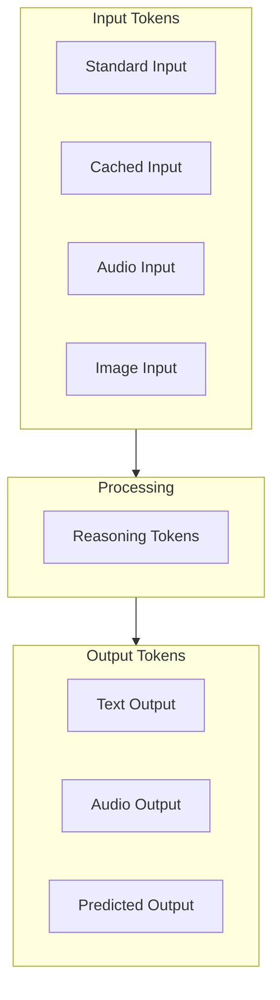
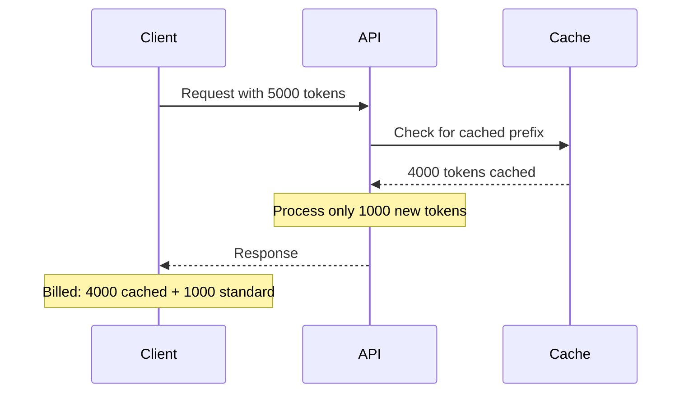

# Token Pricing Categories

## Introduction

Modern AI APIs charge differently for various token types. Understanding these categories helps optimize costs by leveraging caching, choosing appropriate modalities, and structuring prompts effectively.

### What We'll Cover

- Cached tokens and discounts
- Reasoning tokens pricing
- Audio token pricing
- Image token pricing
- Predicted output tokens
- Service tier differences

### Prerequisites

- Basic pricing model understanding
- Token fundamentals

---

## Token Categories Overview



### Pricing Summary

| Token Type | Relative Cost | Discount Available |
|------------|---------------|-------------------|
| Standard Input | 1x | — |
| Cached Input | 0.1-0.5x | 50-90% off |
| Reasoning | Same as output | — |
| Audio Input | ~$100/1M | — |
| Image Input | Varies by size | — |
| Standard Output | 2-4x input | — |
| Predicted Output | Reduced if accepted | — |

---

## Cached Tokens

Cached tokens are input tokens that the API has recently processed and stored.

### How Caching Works



### Cached Pricing by Provider

| Provider | Model | Standard Input | Cached Input | Discount |
|----------|-------|----------------|--------------|----------|
| OpenAI | GPT-4.1 | $2.00/1M | $0.50/1M | 75% |
| OpenAI | GPT-4.1-mini | $0.40/1M | $0.10/1M | 75% |
| Anthropic | Claude Sonnet 4 | $3.00/1M | $0.30/1M | 90% |
| Anthropic | Claude Haiku 3.5 | $0.80/1M | $0.08/1M | 90% |

### Implementing Cache-Friendly Prompts

```python
from openai import OpenAI

client = OpenAI()

# Cache-friendly: Static prefix, dynamic suffix
SYSTEM_PROMPT = """You are an expert code reviewer. Follow these guidelines:
1. Check for security vulnerabilities
2. Identify performance issues
3. Suggest best practices
4. Rate code quality 1-10
5. Provide specific line references
6. Use constructive language

Always format your response as:
## Security
[findings]

## Performance
[findings]

## Best Practices
[findings]

## Rating: X/10

## Summary
[brief summary]
"""  # ~150 tokens - will be cached after first request

def review_code(code: str) -> str:
    """Review code using cached system prompt."""
    
    response = client.chat.completions.create(
        model="gpt-4.1",
        messages=[
            {"role": "system", "content": SYSTEM_PROMPT},
            {"role": "user", "content": f"Review this code:\n\n```\n{code}\n```"}
        ]
    )
    
    # Check cache usage
    usage = response.usage
    cached = getattr(usage, 'prompt_tokens_details', {})
    cached_tokens = getattr(cached, 'cached_tokens', 0)
    
    print(f"Total input: {usage.prompt_tokens}")
    print(f"Cached: {cached_tokens}")
    print(f"Cache rate: {cached_tokens / usage.prompt_tokens * 100:.1f}%")
    
    return response.choices[0].message.content


# First call - no cache
result1 = review_code("def add(a, b): return a + b")

# Second call - system prompt cached
result2 = review_code("def multiply(a, b): return a * b")
```

### Cache Cost Calculator

```python
from dataclasses import dataclass

@dataclass
class CacheAnalyzer:
    """Analyze caching impact on costs."""
    
    standard_price: float  # Per million tokens
    cached_price: float
    
    def analyze_session(
        self,
        requests: list[dict]  # Each: {"total_tokens": int, "cached_tokens": int}
    ) -> dict:
        """Analyze caching across a session."""
        
        total_tokens = sum(r["total_tokens"] for r in requests)
        total_cached = sum(r["cached_tokens"] for r in requests)
        total_uncached = total_tokens - total_cached
        
        # Actual cost
        actual_cost = (
            (total_uncached / 1_000_000) * self.standard_price +
            (total_cached / 1_000_000) * self.cached_price
        )
        
        # Cost without cache
        without_cache = (total_tokens / 1_000_000) * self.standard_price
        
        return {
            "total_tokens": total_tokens,
            "cached_tokens": total_cached,
            "cache_rate": f"{total_cached / total_tokens * 100:.1f}%",
            "actual_cost": round(actual_cost, 4),
            "without_cache": round(without_cache, 4),
            "savings": round(without_cache - actual_cost, 4),
            "savings_percent": f"{(without_cache - actual_cost) / without_cache * 100:.1f}%"
        }


# Simulate a coding session
analyzer = CacheAnalyzer(standard_price=2.00, cached_price=0.50)

session = [
    {"total_tokens": 2000, "cached_tokens": 0},      # First request
    {"total_tokens": 2100, "cached_tokens": 1800},   # Cached system prompt
    {"total_tokens": 2200, "cached_tokens": 1800},   # Cached system prompt
    {"total_tokens": 2500, "cached_tokens": 2000},   # Cached + previous context
    {"total_tokens": 3000, "cached_tokens": 2500},   # More cached
]

result = analyzer.analyze_session(session)
print(f"Cache rate: {result['cache_rate']}")
print(f"Actual cost: ${result['actual_cost']}")
print(f"Savings: ${result['savings']} ({result['savings_percent']})")
```

---

## Reasoning Tokens

Reasoning tokens are generated during extended thinking in models like o1, o3, and o4-mini.

### Reasoning Token Pricing

| Model | Input/1M | Output/1M | Reasoning/1M |
|-------|----------|-----------|--------------|
| o3 | $10.00 | $40.00 | $40.00 |
| o3-mini | $1.10 | $4.40 | $4.40 |
| o4-mini | $1.10 | $4.40 | $4.40 |

### Understanding Reasoning Costs

```python
def calculate_reasoning_cost(
    input_tokens: int,
    reasoning_tokens: int,
    output_tokens: int,
    model: str = "o3-mini"
) -> dict:
    """Calculate cost including reasoning tokens."""
    
    pricing = {
        "o3": {"input": 10.00, "output": 40.00},
        "o3-mini": {"input": 1.10, "output": 4.40},
        "o4-mini": {"input": 1.10, "output": 4.40}
    }
    
    if model not in pricing:
        raise ValueError(f"Unknown model: {model}")
    
    prices = pricing[model]
    
    input_cost = (input_tokens / 1_000_000) * prices["input"]
    reasoning_cost = (reasoning_tokens / 1_000_000) * prices["output"]  # Same as output
    output_cost = (output_tokens / 1_000_000) * prices["output"]
    
    total = input_cost + reasoning_cost + output_cost
    
    return {
        "model": model,
        "input_tokens": input_tokens,
        "reasoning_tokens": reasoning_tokens,
        "output_tokens": output_tokens,
        "input_cost": round(input_cost, 6),
        "reasoning_cost": round(reasoning_cost, 6),
        "output_cost": round(output_cost, 6),
        "total_cost": round(total, 6),
        "reasoning_percent": f"{reasoning_cost / total * 100:.1f}%"
    }


# Complex reasoning task
result = calculate_reasoning_cost(
    input_tokens=1000,
    reasoning_tokens=5000,  # Reasoning often produces many tokens
    output_tokens=500,
    model="o3-mini"
)

print(f"Total cost: ${result['total_cost']:.4f}")
print(f"Reasoning portion: {result['reasoning_percent']}")
```

> **Warning:** Reasoning tokens can significantly exceed output tokens. A 500-token response might involve 5000+ reasoning tokens.

---

## Audio Token Pricing

Audio models charge per audio token or per minute.

### Audio Pricing

| Model | Audio Input | Audio Output | Text |
|-------|-------------|--------------|------|
| GPT-4o Realtime | $100/1M audio tokens | $200/1M audio tokens | Standard |
| Whisper | $0.006/minute | — | — |
| TTS | — | $15/1M characters | — |

### Audio Cost Calculator

```python
from dataclasses import dataclass

@dataclass
class AudioCostCalculator:
    """Calculate costs for audio processing."""
    
    # Audio tokens per second (approximate)
    TOKENS_PER_SECOND = 50
    
    # Pricing
    realtime_input_per_million: float = 100.00
    realtime_output_per_million: float = 200.00
    whisper_per_minute: float = 0.006
    tts_per_million_chars: float = 15.00
    
    def calculate_realtime(
        self,
        audio_seconds: float,
        text_input_tokens: int = 0,
        text_output_tokens: int = 0
    ) -> dict:
        """Calculate realtime audio API cost."""
        
        audio_tokens = int(audio_seconds * self.TOKENS_PER_SECOND)
        
        audio_input_cost = (audio_tokens / 1_000_000) * self.realtime_input_per_million
        audio_output_cost = (audio_tokens / 1_000_000) * self.realtime_output_per_million
        
        # Assume text at GPT-4o rates
        text_input_cost = (text_input_tokens / 1_000_000) * 2.50
        text_output_cost = (text_output_tokens / 1_000_000) * 10.00
        
        total = audio_input_cost + audio_output_cost + text_input_cost + text_output_cost
        
        return {
            "audio_seconds": audio_seconds,
            "audio_tokens": audio_tokens,
            "audio_cost": round(audio_input_cost + audio_output_cost, 4),
            "text_cost": round(text_input_cost + text_output_cost, 4),
            "total_cost": round(total, 4)
        }
    
    def calculate_whisper(self, audio_minutes: float) -> dict:
        """Calculate Whisper transcription cost."""
        
        cost = audio_minutes * self.whisper_per_minute
        
        return {
            "audio_minutes": audio_minutes,
            "cost": round(cost, 4)
        }
    
    def calculate_tts(self, character_count: int) -> dict:
        """Calculate TTS cost."""
        
        cost = (character_count / 1_000_000) * self.tts_per_million_chars
        
        return {
            "characters": character_count,
            "cost": round(cost, 6)
        }


# Examples
calc = AudioCostCalculator()

# 1-minute realtime conversation
realtime = calc.calculate_realtime(audio_seconds=60)
print(f"1-minute realtime: ${realtime['total_cost']:.2f}")

# 10-minute Whisper transcription
whisper = calc.calculate_whisper(audio_minutes=10)
print(f"10-min transcription: ${whisper['cost']:.4f}")

# TTS for 1000 characters
tts = calc.calculate_tts(character_count=1000)
print(f"1000 char TTS: ${tts['cost']:.6f}")
```

---

## Image Token Pricing

Image inputs are converted to tokens based on resolution.

### Image Token Calculation

| Resolution | Tokens (approx) | Cost at GPT-4o |
|------------|-----------------|----------------|
| 512×512 | ~170 | ~$0.00043 |
| 1024×1024 | ~680 | ~$0.0017 |
| 2048×2048 | ~2720 | ~$0.0068 |

### Image Cost Calculator

```python
import math

def calculate_image_tokens(
    width: int,
    height: int,
    detail: str = "auto"
) -> int:
    """
    Calculate tokens for an image.
    
    OpenAI uses 512x512 tiles for high detail.
    Low detail is always 85 tokens.
    """
    
    if detail == "low":
        return 85
    
    # High detail calculation
    # Resize to fit in 2048x2048, maintaining aspect ratio
    max_dim = 2048
    if width > max_dim or height > max_dim:
        scale = max_dim / max(width, height)
        width = int(width * scale)
        height = int(height * scale)
    
    # Resize shortest side to 768
    min_dim = 768
    if min(width, height) > min_dim:
        scale = min_dim / min(width, height)
        width = int(width * scale)
        height = int(height * scale)
    
    # Calculate number of 512x512 tiles
    tiles_x = math.ceil(width / 512)
    tiles_y = math.ceil(height / 512)
    total_tiles = tiles_x * tiles_y
    
    # 170 tokens per tile + 85 base
    tokens = 170 * total_tiles + 85
    
    return tokens


def calculate_image_cost(
    width: int,
    height: int,
    detail: str = "auto",
    model: str = "gpt-4o"
) -> dict:
    """Calculate cost for image input."""
    
    tokens = calculate_image_tokens(width, height, detail)
    
    # Pricing per million tokens
    pricing = {
        "gpt-4o": 2.50,
        "gpt-4.1": 2.00,
        "gpt-4.1-mini": 0.40
    }
    
    price = pricing.get(model, 2.50)
    cost = (tokens / 1_000_000) * price
    
    return {
        "dimensions": f"{width}x{height}",
        "detail": detail,
        "tokens": tokens,
        "cost": round(cost, 6)
    }


# Examples
print(calculate_image_cost(512, 512))
# {'dimensions': '512x512', 'detail': 'auto', 'tokens': 255, 'cost': 0.000638}

print(calculate_image_cost(1920, 1080))
# {'dimensions': '1920x1080', 'detail': 'auto', 'tokens': 765, 'cost': 0.001913}

print(calculate_image_cost(4000, 3000, detail="low"))
# {'dimensions': '4000x3000', 'detail': 'low', 'tokens': 85, 'cost': 0.000213}
```

---

## Predicted Output Tokens

Predicted outputs allow you to provide expected output, reducing costs when predictions match.

### How It Works

```python
from openai import OpenAI

client = OpenAI()

# Original code
original_code = '''
def calculate_total(items):
    total = 0
    for item in items:
        total += item.price
    return total
'''

# Ask for minor edit
response = client.chat.completions.create(
    model="gpt-4.1",
    messages=[
        {"role": "user", "content": f"Add tax calculation (8%) to this function:\n\n{original_code}"}
    ],
    prediction={
        "type": "content",
        "content": '''
def calculate_total(items, tax_rate=0.08):
    total = 0
    for item in items:
        total += item.price
    tax = total * tax_rate
    return total + tax
'''
    }
)

# Check prediction usage
usage = response.usage
print(f"Output tokens: {usage.completion_tokens}")
print(f"Accepted prediction tokens: {usage.completion_tokens_details.accepted_prediction_tokens}")
print(f"Rejected prediction tokens: {usage.completion_tokens_details.rejected_prediction_tokens}")
```

### Predicted Output Cost Savings

```python
from dataclasses import dataclass

@dataclass
class PredictionCostAnalyzer:
    """Analyze cost savings from predicted outputs."""
    
    output_price_per_million: float
    
    def analyze(
        self,
        total_output_tokens: int,
        accepted_prediction_tokens: int,
        rejected_prediction_tokens: int
    ) -> dict:
        """Analyze prediction effectiveness."""
        
        # Full cost without prediction
        full_cost = (total_output_tokens / 1_000_000) * self.output_price_per_million
        
        # With prediction: only pay for non-predicted tokens
        new_tokens = total_output_tokens - accepted_prediction_tokens
        actual_cost = (new_tokens / 1_000_000) * self.output_price_per_million
        
        # Rejection cost (still billed)
        rejection_cost = (rejected_prediction_tokens / 1_000_000) * self.output_price_per_million
        
        total_actual = actual_cost + rejection_cost
        savings = full_cost - total_actual
        
        acceptance_rate = accepted_prediction_tokens / (accepted_prediction_tokens + rejected_prediction_tokens + new_tokens)
        
        return {
            "total_output_tokens": total_output_tokens,
            "accepted_tokens": accepted_prediction_tokens,
            "rejected_tokens": rejected_prediction_tokens,
            "new_tokens": new_tokens,
            "acceptance_rate": f"{acceptance_rate * 100:.1f}%",
            "full_cost": round(full_cost, 6),
            "actual_cost": round(total_actual, 6),
            "savings": round(savings, 6),
            "savings_percent": f"{savings / full_cost * 100:.1f}%" if full_cost > 0 else "0%"
        }


# Example
analyzer = PredictionCostAnalyzer(output_price_per_million=8.00)

result = analyzer.analyze(
    total_output_tokens=500,
    accepted_prediction_tokens=400,
    rejected_prediction_tokens=20
)

print(f"Acceptance rate: {result['acceptance_rate']}")
print(f"Savings: ${result['savings']:.6f} ({result['savings_percent']})")
```

---

## Hands-on Exercise

### Your Task

Build a comprehensive token cost analyzer that handles all token types.

### Requirements

1. Support cached, reasoning, audio, and image tokens
2. Calculate total cost across modalities
3. Show breakdown by token type
4. Suggest optimization opportunities

### Expected Result

```python
analyzer = MultiModalCostAnalyzer()

result = analyzer.analyze(
    input_tokens=2000,
    cached_tokens=1500,
    reasoning_tokens=3000,
    output_tokens=500,
    audio_seconds=30,
    images=[(1024, 1024), (512, 512)]
)

print(result)
# {'text_cost': 0.0045, 'audio_cost': 0.30, 'image_cost': 0.002,
#  'total': 0.3065, 'optimization_tips': ['Enable more caching']}
```

<details>
<summary>💡 Hints</summary>

- Create separate methods for each modality
- Combine results in analyze method
- Track cache miss percentage for optimization tips
</details>

<details>
<summary>✅ Solution</summary>

```python
from dataclasses import dataclass, field
from typing import List, Tuple
import math

@dataclass
class MultiModalCostAnalyzer:
    """Analyze costs across all token types."""
    
    # Text pricing (per million)
    text_input_price: float = 2.00
    text_cached_price: float = 0.50
    text_output_price: float = 8.00
    
    # Reasoning (same as output)
    reasoning_price: float = 8.00
    
    # Audio pricing
    audio_input_per_million: float = 100.00
    audio_tokens_per_second: int = 50
    
    # Image pricing
    image_price_per_million: float = 2.50
    
    def _text_cost(
        self,
        input_tokens: int,
        cached_tokens: int,
        output_tokens: int
    ) -> dict:
        """Calculate text token costs."""
        
        uncached = max(0, input_tokens - cached_tokens)
        
        input_cost = (uncached / 1_000_000) * self.text_input_price
        cached_cost = (cached_tokens / 1_000_000) * self.text_cached_price
        output_cost = (output_tokens / 1_000_000) * self.text_output_price
        
        return {
            "input_cost": input_cost,
            "cached_cost": cached_cost,
            "output_cost": output_cost,
            "total": input_cost + cached_cost + output_cost,
            "cache_rate": cached_tokens / input_tokens if input_tokens > 0 else 0
        }
    
    def _reasoning_cost(self, reasoning_tokens: int) -> dict:
        """Calculate reasoning token costs."""
        
        cost = (reasoning_tokens / 1_000_000) * self.reasoning_price
        return {"reasoning_cost": cost}
    
    def _audio_cost(self, audio_seconds: float) -> dict:
        """Calculate audio costs."""
        
        audio_tokens = int(audio_seconds * self.audio_tokens_per_second)
        cost = (audio_tokens / 1_000_000) * self.audio_input_per_million
        
        return {
            "audio_tokens": audio_tokens,
            "audio_cost": cost
        }
    
    def _image_cost(self, images: List[Tuple[int, int]]) -> dict:
        """Calculate image costs."""
        
        total_tokens = 0
        
        for width, height in images:
            # Simplified tile calculation
            tiles_x = math.ceil(min(width, 2048) / 512)
            tiles_y = math.ceil(min(height, 2048) / 512)
            tokens = 170 * tiles_x * tiles_y + 85
            total_tokens += tokens
        
        cost = (total_tokens / 1_000_000) * self.image_price_per_million
        
        return {
            "image_tokens": total_tokens,
            "image_cost": cost,
            "image_count": len(images)
        }
    
    def analyze(
        self,
        input_tokens: int = 0,
        cached_tokens: int = 0,
        reasoning_tokens: int = 0,
        output_tokens: int = 0,
        audio_seconds: float = 0,
        images: List[Tuple[int, int]] = None
    ) -> dict:
        """Comprehensive cost analysis."""
        
        images = images or []
        
        # Calculate each component
        text = self._text_cost(input_tokens, cached_tokens, output_tokens)
        reasoning = self._reasoning_cost(reasoning_tokens)
        audio = self._audio_cost(audio_seconds) if audio_seconds > 0 else {"audio_cost": 0}
        image = self._image_cost(images) if images else {"image_cost": 0}
        
        # Total
        total_cost = (
            text["total"] +
            reasoning["reasoning_cost"] +
            audio["audio_cost"] +
            image["image_cost"]
        )
        
        # Generate optimization tips
        tips = []
        
        if text["cache_rate"] < 0.5 and input_tokens > 1000:
            tips.append(f"Enable more caching (current: {text['cache_rate']:.0%})")
        
        if reasoning_tokens > output_tokens * 5:
            tips.append("High reasoning:output ratio - consider simpler model")
        
        if images and any(w > 1024 or h > 1024 for w, h in images):
            tips.append("Use low detail or resize images to reduce costs")
        
        if audio_seconds > 60:
            tips.append("Consider Whisper for long transcriptions")
        
        return {
            "text_cost": round(text["total"], 6),
            "reasoning_cost": round(reasoning["reasoning_cost"], 6),
            "audio_cost": round(audio["audio_cost"], 6),
            "image_cost": round(image["image_cost"], 6),
            "total": round(total_cost, 6),
            "breakdown": {
                "text": f"{text['total'] / total_cost * 100:.1f}%" if total_cost > 0 else "0%",
                "reasoning": f"{reasoning['reasoning_cost'] / total_cost * 100:.1f}%" if total_cost > 0 else "0%",
                "audio": f"{audio['audio_cost'] / total_cost * 100:.1f}%" if total_cost > 0 else "0%",
                "image": f"{image['image_cost'] / total_cost * 100:.1f}%" if total_cost > 0 else "0%"
            },
            "optimization_tips": tips if tips else ["Costs are well optimized"]
        }


# Test
analyzer = MultiModalCostAnalyzer()

result = analyzer.analyze(
    input_tokens=2000,
    cached_tokens=500,  # Only 25% cached
    reasoning_tokens=3000,
    output_tokens=500,
    audio_seconds=30,
    images=[(1024, 1024), (512, 512)]
)

print(f"Total cost: ${result['total']:.4f}")
print(f"\nBreakdown:")
for category, pct in result['breakdown'].items():
    print(f"  {category}: {pct}")
print(f"\nTips:")
for tip in result['optimization_tips']:
    print(f"  - {tip}")
```

</details>

---

## Summary

✅ Cached tokens offer 50-90% discount — maximize cache hits  
✅ Reasoning tokens are billed at output rates — can exceed output significantly  
✅ Audio tokens are expensive — use Whisper for transcription when possible  
✅ Image tokens scale with resolution — use low detail when appropriate  
✅ Predicted outputs reduce costs when predictions match

**Next:** [Cost Estimation](./03-cost-estimation.md)

---

## Further Reading

- [OpenAI Token Pricing](https://openai.com/api/pricing/) — Current rates
- [Prompt Caching Guide](https://platform.openai.com/docs/guides/prompt-caching) — Caching strategies
- [Vision Pricing](https://platform.openai.com/docs/guides/vision) — Image token details

<!-- 
Sources Consulted:
- OpenAI pricing: https://openai.com/api/pricing/
- OpenAI prompt caching: https://platform.openai.com/docs/guides/prompt-caching
- OpenAI vision: https://platform.openai.com/docs/guides/vision
-->
