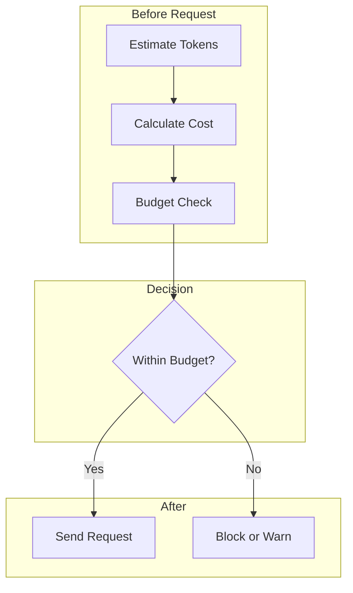

# Cost Estimation

## Introduction

Estimating costs before sending requests prevents budget surprises and enables pre-flight budget checks. This lesson covers token counting techniques, response length estimation, and cost calculators.

### What We'll Cover

- Token counting before sending
- Estimating response length
- Building cost calculators
- Budget checks before API calls
- Real-time cost tracking

### Prerequisites

- Token pricing categories
- Basic API request structure

---

## Why Pre-Estimate Costs



### Benefits

| Benefit | Description |
|---------|-------------|
| **Budget control** | Never exceed spending limits |
| **User transparency** | Show estimated costs before action |
| **Optimization** | Identify expensive requests early |
| **Planning** | Forecast monthly costs accurately |

---

## Token Counting

### Using tiktoken

```python
import tiktoken

def count_tokens(text: str, model: str = "gpt-4.1") -> int:
    """Count tokens for a given text and model."""
    
    try:
        encoding = tiktoken.encoding_for_model(model)
    except KeyError:
        # Fall back to cl100k_base for newer models
        encoding = tiktoken.get_encoding("cl100k_base")
    
    return len(encoding.encode(text))


def count_message_tokens(
    messages: list[dict],
    model: str = "gpt-4.1"
) -> int:
    """
    Count tokens for a list of messages.
    
    Accounts for message formatting overhead.
    """
    
    try:
        encoding = tiktoken.encoding_for_model(model)
    except KeyError:
        encoding = tiktoken.get_encoding("cl100k_base")
    
    # Overhead per message
    tokens_per_message = 3  # <|start|>role<|end|>
    tokens_per_name = 1
    
    total = 0
    
    for message in messages:
        total += tokens_per_message
        
        for key, value in message.items():
            total += len(encoding.encode(str(value)))
            
            if key == "name":
                total += tokens_per_name
    
    total += 3  # Every reply is primed with <|start|>assistant<|message|>
    
    return total


# Examples
text = "Hello, how are you doing today?"
print(f"Tokens: {count_tokens(text)}")  # ~8 tokens

messages = [
    {"role": "system", "content": "You are a helpful assistant."},
    {"role": "user", "content": "What is the capital of France?"}
]
print(f"Message tokens: {count_message_tokens(messages)}")  # ~25 tokens
```

### Batch Token Counting

```python
from dataclasses import dataclass
from typing import List
import tiktoken

@dataclass
class TokenCounter:
    """Efficient token counter for batch operations."""
    
    model: str = "gpt-4.1"
    
    def __post_init__(self):
        try:
            self.encoding = tiktoken.encoding_for_model(self.model)
        except KeyError:
            self.encoding = tiktoken.get_encoding("cl100k_base")
    
    def count(self, text: str) -> int:
        """Count tokens in text."""
        return len(self.encoding.encode(text))
    
    def count_messages(self, messages: list[dict]) -> int:
        """Count tokens in messages."""
        
        total = 3  # Reply priming
        
        for message in messages:
            total += 3  # Message overhead
            
            for key, value in message.items():
                total += self.count(str(value))
                if key == "name":
                    total += 1
        
        return total
    
    def count_batch(self, texts: List[str]) -> List[int]:
        """Count tokens for multiple texts efficiently."""
        return [self.count(text) for text in texts]
    
    def estimate_chat_history(
        self,
        system_prompt: str,
        turns: int,
        avg_user_tokens: int,
        avg_assistant_tokens: int
    ) -> int:
        """Estimate tokens for a conversation history."""
        
        system_tokens = self.count(system_prompt) + 3
        turn_tokens = (avg_user_tokens + 3 + avg_assistant_tokens + 3) * turns
        
        return system_tokens + turn_tokens + 3


# Usage
counter = TokenCounter("gpt-4.1")

# Single count
print(counter.count("Hello world"))

# Batch count
texts = ["Hello", "World", "How are you?"]
counts = counter.count_batch(texts)
print(f"Batch: {counts}")

# Estimate conversation
estimated = counter.estimate_chat_history(
    system_prompt="You are a helpful assistant.",
    turns=10,
    avg_user_tokens=50,
    avg_assistant_tokens=150
)
print(f"Estimated conversation tokens: {estimated}")
```

---

## Response Length Estimation

### Heuristic Estimation

```python
from dataclasses import dataclass
from enum import Enum

class ResponseType(Enum):
    SHORT = "short"           # Yes/no, single word
    SENTENCE = "sentence"     # One sentence
    PARAGRAPH = "paragraph"   # One paragraph
    DETAILED = "detailed"     # Multiple paragraphs
    LONG = "long"             # Full document


@dataclass
class ResponseEstimator:
    """Estimate response token count."""
    
    # Average tokens per response type
    estimates = {
        ResponseType.SHORT: 10,
        ResponseType.SENTENCE: 30,
        ResponseType.PARAGRAPH: 100,
        ResponseType.DETAILED: 300,
        ResponseType.LONG: 1000
    }
    
    def estimate(
        self,
        response_type: ResponseType,
        confidence_interval: float = 0.3
    ) -> dict:
        """
        Estimate response tokens with confidence interval.
        
        Returns min, expected, and max estimates.
        """
        
        expected = self.estimates[response_type]
        margin = int(expected * confidence_interval)
        
        return {
            "min": expected - margin,
            "expected": expected,
            "max": expected + margin
        }
    
    def estimate_from_prompt(self, prompt: str) -> dict:
        """Infer response type from prompt keywords."""
        
        prompt_lower = prompt.lower()
        
        # Short responses
        if any(kw in prompt_lower for kw in ["yes or no", "true or false", "one word"]):
            return self.estimate(ResponseType.SHORT)
        
        # Sentence
        if any(kw in prompt_lower for kw in ["in one sentence", "briefly", "quickly"]):
            return self.estimate(ResponseType.SENTENCE)
        
        # Long/detailed
        if any(kw in prompt_lower for kw in ["explain in detail", "comprehensive", "full analysis"]):
            return self.estimate(ResponseType.DETAILED)
        
        # Very long
        if any(kw in prompt_lower for kw in ["write an essay", "full document", "complete guide"]):
            return self.estimate(ResponseType.LONG)
        
        # Default to paragraph
        return self.estimate(ResponseType.PARAGRAPH)


# Usage
estimator = ResponseEstimator()

# By type
print(estimator.estimate(ResponseType.PARAGRAPH))
# {'min': 70, 'expected': 100, 'max': 130}

# From prompt
prompt = "Explain in detail how neural networks learn"
print(estimator.estimate_from_prompt(prompt))
# {'min': 210, 'expected': 300, 'max': 390}
```

### Using max_tokens

```python
def estimate_with_max_tokens(
    max_tokens: int,
    utilization: float = 0.7
) -> dict:
    """
    Estimate actual output based on max_tokens setting.
    
    Most responses use 50-90% of max_tokens.
    """
    
    return {
        "min": int(max_tokens * 0.3),
        "expected": int(max_tokens * utilization),
        "max": max_tokens
    }


# If you set max_tokens=500
estimate = estimate_with_max_tokens(500)
print(f"Expected output: ~{estimate['expected']} tokens")
```

---

## Cost Calculator

### Pre-Request Calculator

```python
from dataclasses import dataclass, field
import tiktoken

@dataclass
class ModelPricing:
    input_per_million: float
    output_per_million: float
    cached_per_million: float = None
    
    def __post_init__(self):
        if self.cached_per_million is None:
            self.cached_per_million = self.input_per_million * 0.25


MODELS = {
    "gpt-4.1": ModelPricing(2.00, 8.00, 0.50),
    "gpt-4.1-mini": ModelPricing(0.40, 1.60, 0.10),
    "gpt-4o": ModelPricing(2.50, 10.00, 1.25),
    "claude-sonnet-4": ModelPricing(3.00, 15.00, 0.30),
}


@dataclass
class CostEstimator:
    """Estimate request cost before sending."""
    
    model: str = "gpt-4.1"
    _counter: object = field(init=False, repr=False)
    
    def __post_init__(self):
        self._counter = TokenCounter(self.model)
        self.pricing = MODELS.get(self.model, MODELS["gpt-4.1"])
    
    def estimate(
        self,
        messages: list[dict],
        max_tokens: int = 1000,
        expected_output_ratio: float = 0.7,
        cached_tokens: int = 0
    ) -> dict:
        """
        Estimate cost for a request.
        
        Args:
            messages: Input messages
            max_tokens: Maximum output tokens
            expected_output_ratio: Expected % of max_tokens used
            cached_tokens: Number of cached input tokens
        """
        
        # Count input tokens
        input_tokens = self._counter.count_messages(messages)
        
        # Estimate output tokens
        expected_output = int(max_tokens * expected_output_ratio)
        min_output = int(max_tokens * 0.3)
        max_output = max_tokens
        
        # Calculate costs
        uncached = max(0, input_tokens - cached_tokens)
        
        def calc_cost(output_tokens: int) -> float:
            input_cost = (uncached / 1_000_000) * self.pricing.input_per_million
            cached_cost = (cached_tokens / 1_000_000) * self.pricing.cached_per_million
            output_cost = (output_tokens / 1_000_000) * self.pricing.output_per_million
            return input_cost + cached_cost + output_cost
        
        return {
            "model": self.model,
            "input_tokens": input_tokens,
            "cached_tokens": cached_tokens,
            "output_estimate": {
                "min": min_output,
                "expected": expected_output,
                "max": max_output
            },
            "cost_estimate": {
                "min": round(calc_cost(min_output), 6),
                "expected": round(calc_cost(expected_output), 6),
                "max": round(calc_cost(max_output), 6)
            }
        }
    
    def compare_models(
        self,
        messages: list[dict],
        max_tokens: int = 1000,
        models: list[str] = None
    ) -> dict:
        """Compare costs across multiple models."""
        
        models = models or list(MODELS.keys())
        results = {}
        
        for model in models:
            estimator = CostEstimator(model)
            estimate = estimator.estimate(messages, max_tokens)
            results[model] = {
                "expected_cost": estimate["cost_estimate"]["expected"],
                "max_cost": estimate["cost_estimate"]["max"]
            }
        
        # Find cheapest
        cheapest = min(results.items(), key=lambda x: x[1]["expected_cost"])
        
        return {
            "comparison": results,
            "cheapest": cheapest[0],
            "cheapest_cost": cheapest[1]["expected_cost"]
        }


# Usage
estimator = CostEstimator("gpt-4.1")

messages = [
    {"role": "system", "content": "You are a helpful assistant."},
    {"role": "user", "content": "Explain quantum computing in simple terms."}
]

estimate = estimator.estimate(messages, max_tokens=500)
print(f"Expected cost: ${estimate['cost_estimate']['expected']:.4f}")
print(f"Max cost: ${estimate['cost_estimate']['max']:.4f}")

# Compare models
comparison = estimator.compare_models(messages, max_tokens=500)
print(f"\nCheapest: {comparison['cheapest']} at ${comparison['cheapest_cost']:.4f}")
```

---

## Budget Checks

### Pre-Request Budget Gate

```python
from dataclasses import dataclass
from typing import Optional
from datetime import datetime

@dataclass
class BudgetGate:
    """Gate requests based on budget constraints."""
    
    daily_budget: float = 10.00
    monthly_budget: float = 100.00
    per_request_limit: float = 1.00
    warn_threshold: float = 0.8  # Warn at 80%
    
    # Tracking
    _daily_spend: float = 0.0
    _monthly_spend: float = 0.0
    _last_reset: datetime = None
    
    def __post_init__(self):
        self._last_reset = datetime.now()
    
    def _check_reset(self):
        """Reset counters if day/month changed."""
        now = datetime.now()
        
        if now.date() > self._last_reset.date():
            self._daily_spend = 0.0
        
        if now.month != self._last_reset.month:
            self._monthly_spend = 0.0
        
        self._last_reset = now
    
    def check(self, estimated_cost: float) -> dict:
        """
        Check if request is within budget.
        
        Returns approval status and any warnings.
        """
        
        self._check_reset()
        
        warnings = []
        
        # Per-request limit
        if estimated_cost > self.per_request_limit:
            return {
                "approved": False,
                "reason": f"Estimated ${estimated_cost:.4f} exceeds per-request limit ${self.per_request_limit:.2f}",
                "warnings": warnings
            }
        
        # Daily budget
        if self._daily_spend + estimated_cost > self.daily_budget:
            return {
                "approved": False,
                "reason": f"Would exceed daily budget (${self._daily_spend:.2f} + ${estimated_cost:.4f} > ${self.daily_budget:.2f})",
                "warnings": warnings
            }
        
        # Monthly budget
        if self._monthly_spend + estimated_cost > self.monthly_budget:
            return {
                "approved": False,
                "reason": f"Would exceed monthly budget",
                "warnings": warnings
            }
        
        # Warnings
        daily_after = self._daily_spend + estimated_cost
        if daily_after / self.daily_budget > self.warn_threshold:
            warnings.append(f"Daily spend will be at {daily_after / self.daily_budget * 100:.0f}%")
        
        monthly_after = self._monthly_spend + estimated_cost
        if monthly_after / self.monthly_budget > self.warn_threshold:
            warnings.append(f"Monthly spend will be at {monthly_after / self.monthly_budget * 100:.0f}%")
        
        return {
            "approved": True,
            "reason": None,
            "warnings": warnings,
            "daily_remaining": self.daily_budget - daily_after,
            "monthly_remaining": self.monthly_budget - monthly_after
        }
    
    def record_spend(self, amount: float):
        """Record actual spending after request."""
        self._check_reset()
        self._daily_spend += amount
        self._monthly_spend += amount
    
    def get_status(self) -> dict:
        """Get current budget status."""
        self._check_reset()
        
        return {
            "daily_spent": round(self._daily_spend, 2),
            "daily_budget": self.daily_budget,
            "daily_remaining": round(self.daily_budget - self._daily_spend, 2),
            "daily_percent": round(self._daily_spend / self.daily_budget * 100, 1),
            "monthly_spent": round(self._monthly_spend, 2),
            "monthly_budget": self.monthly_budget,
            "monthly_remaining": round(self.monthly_budget - self._monthly_spend, 2),
            "monthly_percent": round(self._monthly_spend / self.monthly_budget * 100, 1)
        }


# Usage
gate = BudgetGate(daily_budget=5.00, monthly_budget=50.00)

# Check before sending
result = gate.check(estimated_cost=0.05)
if result["approved"]:
    print("Request approved")
    # ... send request ...
    gate.record_spend(0.045)  # Record actual cost
else:
    print(f"Request blocked: {result['reason']}")

print(gate.get_status())
```

### Integrated Client with Budget

```python
from openai import OpenAI
from dataclasses import dataclass

@dataclass
class BudgetedClient:
    """OpenAI client with integrated budget controls."""
    
    daily_budget: float = 10.00
    monthly_budget: float = 100.00
    
    def __post_init__(self):
        self.client = OpenAI()
        self.estimator = CostEstimator()
        self.gate = BudgetGate(
            daily_budget=self.daily_budget,
            monthly_budget=self.monthly_budget
        )
    
    def chat(
        self,
        messages: list[dict],
        model: str = "gpt-4.1",
        max_tokens: int = 1000,
        **kwargs
    ) -> dict:
        """Send chat request with budget check."""
        
        # Estimate cost
        self.estimator.model = model
        estimate = self.estimator.estimate(messages, max_tokens)
        estimated_cost = estimate["cost_estimate"]["expected"]
        
        # Check budget
        check = self.gate.check(estimated_cost)
        
        if not check["approved"]:
            return {
                "success": False,
                "error": "Budget exceeded",
                "reason": check["reason"],
                "estimated_cost": estimated_cost
            }
        
        # Show warnings
        if check["warnings"]:
            print(f"⚠️ Warnings: {check['warnings']}")
        
        # Send request
        response = self.client.chat.completions.create(
            model=model,
            messages=messages,
            max_tokens=max_tokens,
            **kwargs
        )
        
        # Calculate actual cost
        usage = response.usage
        actual_cost = (
            (usage.prompt_tokens / 1_000_000) * MODELS[model].input_per_million +
            (usage.completion_tokens / 1_000_000) * MODELS[model].output_per_million
        )
        
        # Record spending
        self.gate.record_spend(actual_cost)
        
        return {
            "success": True,
            "content": response.choices[0].message.content,
            "estimated_cost": estimated_cost,
            "actual_cost": round(actual_cost, 6),
            "tokens": {
                "input": usage.prompt_tokens,
                "output": usage.completion_tokens
            },
            "budget_status": self.gate.get_status()
        }


# Usage
client = BudgetedClient(daily_budget=1.00, monthly_budget=10.00)

result = client.chat(
    messages=[{"role": "user", "content": "Hello!"}],
    model="gpt-4.1-mini"
)

if result["success"]:
    print(f"Response: {result['content']}")
    print(f"Cost: ${result['actual_cost']:.4f}")
else:
    print(f"Blocked: {result['reason']}")
```

---

## JavaScript Implementation

```javascript
const tiktoken = require('tiktoken');

class TokenCounter {
    constructor(model = 'gpt-4') {
        this.encoding = tiktoken.encoding_for_model(model);
    }
    
    count(text) {
        return this.encoding.encode(text).length;
    }
    
    countMessages(messages) {
        let total = 3;  // Reply priming
        
        for (const message of messages) {
            total += 3;  // Message overhead
            for (const [key, value] of Object.entries(message)) {
                total += this.count(String(value));
                if (key === 'name') total += 1;
            }
        }
        
        return total;
    }
}

class CostEstimator {
    static PRICING = {
        'gpt-4.1': { input: 2.00, output: 8.00 },
        'gpt-4.1-mini': { input: 0.40, output: 1.60 },
        'gpt-4o': { input: 2.50, output: 10.00 }
    };
    
    constructor(model = 'gpt-4.1') {
        this.model = model;
        this.counter = new TokenCounter(model);
        this.pricing = CostEstimator.PRICING[model];
    }
    
    estimate(messages, maxTokens = 1000, outputRatio = 0.7) {
        const inputTokens = this.counter.countMessages(messages);
        const expectedOutput = Math.floor(maxTokens * outputRatio);
        
        const inputCost = (inputTokens / 1_000_000) * this.pricing.input;
        const outputCost = (expectedOutput / 1_000_000) * this.pricing.output;
        
        return {
            inputTokens,
            expectedOutput,
            expectedCost: (inputCost + outputCost).toFixed(6),
            maxCost: (inputCost + (maxTokens / 1_000_000) * this.pricing.output).toFixed(6)
        };
    }
}

class BudgetGate {
    constructor(dailyBudget = 10, monthlyBudget = 100) {
        this.dailyBudget = dailyBudget;
        this.monthlyBudget = monthlyBudget;
        this.dailySpend = 0;
        this.monthlySpend = 0;
    }
    
    check(estimatedCost) {
        if (this.dailySpend + estimatedCost > this.dailyBudget) {
            return { approved: false, reason: 'Daily budget exceeded' };
        }
        if (this.monthlySpend + estimatedCost > this.monthlyBudget) {
            return { approved: false, reason: 'Monthly budget exceeded' };
        }
        return { approved: true };
    }
    
    recordSpend(amount) {
        this.dailySpend += amount;
        this.monthlySpend += amount;
    }
}
```

---

## Hands-on Exercise

### Your Task

Build a cost estimation dashboard for a chat application.

### Requirements

1. Count tokens for conversation history
2. Estimate cost for next response
3. Track cumulative session costs
4. Show budget warnings

### Expected Result

```python
dashboard = ChatCostDashboard(session_budget=1.00)

dashboard.add_message("user", "Hello!")
dashboard.add_message("assistant", "Hello! How can I help you today?")

estimate = dashboard.estimate_next(max_tokens=500)
print(estimate)
# {'input_tokens': 25, 'expected_cost': 0.0045, 
#  'session_total': 0.0012, 'budget_remaining': 0.9988}
```

<details>
<summary>💡 Hints</summary>

- Store messages in a list
- Recalculate tokens on each estimate
- Track actual costs after each response
</details>

<details>
<summary>✅ Solution</summary>

```python
from dataclasses import dataclass, field
import tiktoken

@dataclass
class ChatCostDashboard:
    """Cost tracking dashboard for chat sessions."""
    
    session_budget: float = 1.00
    model: str = "gpt-4.1"
    
    # Pricing
    input_price: float = 2.00
    output_price: float = 8.00
    
    # State
    messages: list = field(default_factory=list)
    session_cost: float = 0.0
    
    def __post_init__(self):
        try:
            self.encoding = tiktoken.encoding_for_model(self.model)
        except KeyError:
            self.encoding = tiktoken.get_encoding("cl100k_base")
    
    def _count_tokens(self, text: str) -> int:
        return len(self.encoding.encode(text))
    
    def _count_message_tokens(self) -> int:
        total = 3
        for msg in self.messages:
            total += 3
            total += self._count_tokens(msg["content"])
        return total
    
    def add_message(self, role: str, content: str, actual_cost: float = None):
        """Add a message to the conversation."""
        
        self.messages.append({"role": role, "content": content})
        
        if actual_cost:
            self.session_cost += actual_cost
        elif role == "assistant":
            # Estimate cost for assistant responses
            tokens = self._count_tokens(content)
            cost = (tokens / 1_000_000) * self.output_price
            self.session_cost += cost
    
    def estimate_next(self, max_tokens: int = 500, output_ratio: float = 0.7) -> dict:
        """Estimate cost for the next response."""
        
        input_tokens = self._count_message_tokens()
        expected_output = int(max_tokens * output_ratio)
        
        input_cost = (input_tokens / 1_000_000) * self.input_price
        output_cost = (expected_output / 1_000_000) * self.output_price
        expected_cost = input_cost + output_cost
        
        max_cost = input_cost + (max_tokens / 1_000_000) * self.output_price
        
        budget_remaining = self.session_budget - self.session_cost
        would_exceed = expected_cost > budget_remaining
        
        warnings = []
        if would_exceed:
            warnings.append("⚠️ Would exceed session budget!")
        elif expected_cost > budget_remaining * 0.5:
            warnings.append(f"Budget at {(self.session_cost + expected_cost) / self.session_budget * 100:.0f}%")
        
        return {
            "input_tokens": input_tokens,
            "expected_output_tokens": expected_output,
            "expected_cost": round(expected_cost, 6),
            "max_cost": round(max_cost, 6),
            "session_total": round(self.session_cost, 6),
            "budget_remaining": round(budget_remaining, 6),
            "would_exceed_budget": would_exceed,
            "warnings": warnings
        }
    
    def get_status(self) -> dict:
        """Get current session status."""
        
        return {
            "message_count": len(self.messages),
            "total_tokens": self._count_message_tokens(),
            "session_cost": round(self.session_cost, 6),
            "budget_remaining": round(self.session_budget - self.session_cost, 6),
            "budget_percent": round(self.session_cost / self.session_budget * 100, 1)
        }
    
    def clear_history(self):
        """Clear conversation history (but not costs)."""
        self.messages = []


# Test
dashboard = ChatCostDashboard(session_budget=1.00)

# Simulate conversation
dashboard.add_message("user", "Hello!")
dashboard.add_message("assistant", "Hello! How can I help you today?")

dashboard.add_message("user", "Can you explain how transformers work in machine learning?")

# Estimate next response
estimate = dashboard.estimate_next(max_tokens=500)
print("Next response estimate:")
print(f"  Input tokens: {estimate['input_tokens']}")
print(f"  Expected cost: ${estimate['expected_cost']:.4f}")
print(f"  Session total: ${estimate['session_total']:.4f}")
print(f"  Budget remaining: ${estimate['budget_remaining']:.4f}")

if estimate['warnings']:
    for warning in estimate['warnings']:
        print(f"  {warning}")

print("\nSession status:", dashboard.get_status())
```

</details>

---

## Summary

✅ Count tokens before sending to estimate costs  
✅ Use tiktoken for accurate OpenAI token counts  
✅ Estimate response length based on prompt type and max_tokens  
✅ Implement budget gates to prevent overspending  
✅ Track actual vs estimated costs for accuracy improvement

**Next:** [Usage Tracking & Alerts](./04-usage-tracking-alerts.md)

---

## Further Reading

- [tiktoken Library](https://github.com/openai/tiktoken) — Official tokenizer
- [OpenAI Tokenizer](https://platform.openai.com/tokenizer) — Interactive tool
- [Counting Tokens](https://cookbook.openai.com/examples/how_to_count_tokens_with_tiktoken) — OpenAI cookbook

<!-- 
Sources Consulted:
- tiktoken: https://github.com/openai/tiktoken
- OpenAI tokenizer: https://platform.openai.com/tokenizer
- OpenAI cookbook: https://cookbook.openai.com/examples/how_to_count_tokens_with_tiktoken
-->
