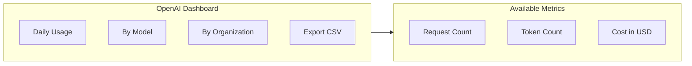

# Usage Tracking & Alerts

## Introduction

Continuous monitoring of API usage enables proactive cost management. This lesson covers tracking dashboards, custom monitoring implementations, and alert systems to prevent budget overruns.

### What We'll Cover

- Provider usage dashboards
- Custom usage tracking
- Email alerts on thresholds
- Weekly/monthly reports
- Real-time usage visualization

### Prerequisites

- Cost estimation basics
- API response handling

---

## Provider Dashboards

### OpenAI Usage Dashboard

Access at: [platform.openai.com/usage](https://platform.openai.com/usage)



### Usage API

```python
from openai import OpenAI
from datetime import datetime, timedelta

client = OpenAI()

# Note: Usage API requires organization admin access
# This shows the conceptual approach

def get_usage_summary(days: int = 7) -> dict:
    """
    Get usage summary from OpenAI.
    
    Note: Actual implementation depends on OpenAI's usage API.
    This is a conceptual example.
    """
    
    end_date = datetime.now()
    start_date = end_date - timedelta(days=days)
    
    # Placeholder - actual API call would go here
    return {
        "period": f"{start_date.date()} to {end_date.date()}",
        "total_requests": 0,
        "total_tokens": 0,
        "total_cost": 0.0,
        "by_model": {}
    }
```

### Anthropic Console

Access at: [console.anthropic.com/settings/usage](https://console.anthropic.com/settings/usage)

---

## Custom Usage Tracker

### Database-Backed Tracker

```python
import sqlite3
import json
from datetime import datetime, timedelta
from dataclasses import dataclass, field
from contextlib import contextmanager
from typing import Optional

@dataclass
class UsageRecord:
    """Single usage record."""
    
    timestamp: datetime
    model: str
    input_tokens: int
    output_tokens: int
    cost: float
    request_id: str
    user_id: Optional[str] = None
    project_id: Optional[str] = None
    cached_tokens: int = 0


class UsageTracker:
    """Persistent usage tracker with SQLite backend."""
    
    def __init__(self, db_path: str = "usage.db"):
        self.db_path = db_path
        self._init_db()
    
    def _init_db(self):
        """Initialize database schema."""
        with self._get_conn() as conn:
            conn.execute("""
                CREATE TABLE IF NOT EXISTS usage (
                    id INTEGER PRIMARY KEY AUTOINCREMENT,
                    timestamp TEXT NOT NULL,
                    model TEXT NOT NULL,
                    input_tokens INTEGER NOT NULL,
                    output_tokens INTEGER NOT NULL,
                    cached_tokens INTEGER DEFAULT 0,
                    cost REAL NOT NULL,
                    request_id TEXT,
                    user_id TEXT,
                    project_id TEXT
                )
            """)
            conn.execute("""
                CREATE INDEX IF NOT EXISTS idx_timestamp 
                ON usage(timestamp)
            """)
            conn.execute("""
                CREATE INDEX IF NOT EXISTS idx_user 
                ON usage(user_id)
            """)
    
    @contextmanager
    def _get_conn(self):
        conn = sqlite3.connect(self.db_path)
        conn.row_factory = sqlite3.Row
        try:
            yield conn
            conn.commit()
        finally:
            conn.close()
    
    def record(self, record: UsageRecord):
        """Record a usage entry."""
        with self._get_conn() as conn:
            conn.execute("""
                INSERT INTO usage 
                (timestamp, model, input_tokens, output_tokens, cached_tokens, 
                 cost, request_id, user_id, project_id)
                VALUES (?, ?, ?, ?, ?, ?, ?, ?, ?)
            """, (
                record.timestamp.isoformat(),
                record.model,
                record.input_tokens,
                record.output_tokens,
                record.cached_tokens,
                record.cost,
                record.request_id,
                record.user_id,
                record.project_id
            ))
    
    def get_summary(
        self,
        start_date: datetime = None,
        end_date: datetime = None,
        user_id: str = None,
        project_id: str = None
    ) -> dict:
        """Get usage summary for a period."""
        
        if start_date is None:
            start_date = datetime.now() - timedelta(days=30)
        if end_date is None:
            end_date = datetime.now()
        
        query = """
            SELECT 
                COUNT(*) as request_count,
                SUM(input_tokens) as total_input,
                SUM(output_tokens) as total_output,
                SUM(cached_tokens) as total_cached,
                SUM(cost) as total_cost,
                AVG(cost) as avg_cost,
                MAX(cost) as max_cost
            FROM usage
            WHERE timestamp BETWEEN ? AND ?
        """
        params = [start_date.isoformat(), end_date.isoformat()]
        
        if user_id:
            query += " AND user_id = ?"
            params.append(user_id)
        
        if project_id:
            query += " AND project_id = ?"
            params.append(project_id)
        
        with self._get_conn() as conn:
            row = conn.execute(query, params).fetchone()
            
            return {
                "period": {
                    "start": start_date.isoformat(),
                    "end": end_date.isoformat()
                },
                "request_count": row["request_count"] or 0,
                "total_input_tokens": row["total_input"] or 0,
                "total_output_tokens": row["total_output"] or 0,
                "total_cached_tokens": row["total_cached"] or 0,
                "total_cost": round(row["total_cost"] or 0, 4),
                "avg_cost_per_request": round(row["avg_cost"] or 0, 6),
                "max_request_cost": round(row["max_cost"] or 0, 6)
            }
    
    def get_by_model(
        self,
        start_date: datetime = None,
        end_date: datetime = None
    ) -> dict:
        """Get usage breakdown by model."""
        
        if start_date is None:
            start_date = datetime.now() - timedelta(days=30)
        if end_date is None:
            end_date = datetime.now()
        
        query = """
            SELECT 
                model,
                COUNT(*) as request_count,
                SUM(input_tokens) as total_input,
                SUM(output_tokens) as total_output,
                SUM(cost) as total_cost
            FROM usage
            WHERE timestamp BETWEEN ? AND ?
            GROUP BY model
            ORDER BY total_cost DESC
        """
        
        with self._get_conn() as conn:
            rows = conn.execute(query, [
                start_date.isoformat(),
                end_date.isoformat()
            ]).fetchall()
            
            return {
                row["model"]: {
                    "request_count": row["request_count"],
                    "total_input_tokens": row["total_input"],
                    "total_output_tokens": row["total_output"],
                    "total_cost": round(row["total_cost"], 4)
                }
                for row in rows
            }
    
    def get_daily_totals(self, days: int = 30) -> list:
        """Get daily usage totals."""
        
        start_date = datetime.now() - timedelta(days=days)
        
        query = """
            SELECT 
                DATE(timestamp) as date,
                COUNT(*) as request_count,
                SUM(cost) as total_cost
            FROM usage
            WHERE timestamp >= ?
            GROUP BY DATE(timestamp)
            ORDER BY date
        """
        
        with self._get_conn() as conn:
            rows = conn.execute(query, [start_date.isoformat()]).fetchall()
            
            return [
                {
                    "date": row["date"],
                    "request_count": row["request_count"],
                    "total_cost": round(row["total_cost"], 4)
                }
                for row in rows
            ]


# Usage
tracker = UsageTracker("my_app_usage.db")

# Record usage after each API call
tracker.record(UsageRecord(
    timestamp=datetime.now(),
    model="gpt-4.1",
    input_tokens=1500,
    output_tokens=500,
    cost=0.007,
    request_id="req_abc123",
    user_id="user_456",
    project_id="chatbot"
))

# Get summaries
print(tracker.get_summary())
print(tracker.get_by_model())
```

---

## Alert System

### Threshold-Based Alerts

```python
from dataclasses import dataclass, field
from enum import Enum
from typing import Callable, Optional
from datetime import datetime, timedelta
import smtplib
from email.message import EmailMessage

class AlertLevel(Enum):
    INFO = "info"
    WARNING = "warning"
    CRITICAL = "critical"


@dataclass
class AlertThreshold:
    """Define an alert threshold."""
    
    name: str
    metric: str  # daily_cost, monthly_cost, request_rate, etc.
    threshold: float
    level: AlertLevel
    message_template: str


@dataclass
class Alert:
    """Triggered alert."""
    
    threshold: AlertThreshold
    current_value: float
    timestamp: datetime
    context: dict = field(default_factory=dict)


class AlertManager:
    """Manage usage alerts."""
    
    DEFAULT_THRESHOLDS = [
        AlertThreshold(
            name="Daily 50%",
            metric="daily_cost_percent",
            threshold=50,
            level=AlertLevel.INFO,
            message_template="Daily spending at {value:.0f}% of budget (${current:.2f}/${budget:.2f})"
        ),
        AlertThreshold(
            name="Daily 80%",
            metric="daily_cost_percent",
            threshold=80,
            level=AlertLevel.WARNING,
            message_template="⚠️ Daily spending at {value:.0f}% - ${remaining:.2f} remaining"
        ),
        AlertThreshold(
            name="Daily 95%",
            metric="daily_cost_percent",
            threshold=95,
            level=AlertLevel.CRITICAL,
            message_template="🚨 CRITICAL: Daily budget nearly exhausted ({value:.0f}%)"
        ),
        AlertThreshold(
            name="Monthly 75%",
            metric="monthly_cost_percent",
            threshold=75,
            level=AlertLevel.WARNING,
            message_template="Monthly spending at {value:.0f}% (${current:.2f}/${budget:.2f})"
        ),
        AlertThreshold(
            name="High cost request",
            metric="request_cost",
            threshold=0.50,
            level=AlertLevel.INFO,
            message_template="High cost request: ${value:.4f} for {model}"
        )
    ]
    
    def __init__(
        self,
        tracker: UsageTracker,
        daily_budget: float = 10.00,
        monthly_budget: float = 100.00,
        thresholds: list = None,
        on_alert: Callable[[Alert], None] = None
    ):
        self.tracker = tracker
        self.daily_budget = daily_budget
        self.monthly_budget = monthly_budget
        self.thresholds = thresholds or self.DEFAULT_THRESHOLDS
        self.on_alert = on_alert or self._default_handler
        
        self._triggered_today = set()
        self._last_check_date = None
    
    def _default_handler(self, alert: Alert):
        """Default alert handler - print to console."""
        emoji = {"info": "ℹ️", "warning": "⚠️", "critical": "🚨"}
        level = alert.threshold.level.value
        print(f"{emoji[level]} [{level.upper()}] {alert.threshold.message_template.format(**alert.context)}")
    
    def _reset_daily(self):
        """Reset daily tracking."""
        today = datetime.now().date()
        if self._last_check_date != today:
            self._triggered_today = set()
            self._last_check_date = today
    
    def check(self) -> list[Alert]:
        """Check all thresholds and trigger alerts."""
        
        self._reset_daily()
        
        # Get current metrics
        today = datetime.now().replace(hour=0, minute=0, second=0, microsecond=0)
        month_start = today.replace(day=1)
        
        daily_summary = self.tracker.get_summary(start_date=today)
        monthly_summary = self.tracker.get_summary(start_date=month_start)
        
        metrics = {
            "daily_cost": daily_summary["total_cost"],
            "daily_cost_percent": (daily_summary["total_cost"] / self.daily_budget * 100) if self.daily_budget > 0 else 0,
            "monthly_cost": monthly_summary["total_cost"],
            "monthly_cost_percent": (monthly_summary["total_cost"] / self.monthly_budget * 100) if self.monthly_budget > 0 else 0
        }
        
        alerts = []
        
        for threshold in self.thresholds:
            value = metrics.get(threshold.metric, 0)
            
            if value >= threshold.threshold:
                # Avoid duplicate alerts
                alert_key = f"{threshold.name}_{datetime.now().date()}"
                if alert_key in self._triggered_today:
                    continue
                
                self._triggered_today.add(alert_key)
                
                alert = Alert(
                    threshold=threshold,
                    current_value=value,
                    timestamp=datetime.now(),
                    context={
                        "value": value,
                        "current": metrics.get("daily_cost", 0) if "daily" in threshold.metric else metrics.get("monthly_cost", 0),
                        "budget": self.daily_budget if "daily" in threshold.metric else self.monthly_budget,
                        "remaining": (self.daily_budget - metrics.get("daily_cost", 0)) if "daily" in threshold.metric else (self.monthly_budget - metrics.get("monthly_cost", 0))
                    }
                )
                
                alerts.append(alert)
                self.on_alert(alert)
        
        return alerts
    
    def check_request(
        self,
        cost: float,
        model: str,
        input_tokens: int,
        output_tokens: int
    ) -> list[Alert]:
        """Check thresholds for a specific request."""
        
        alerts = []
        
        for threshold in self.thresholds:
            if threshold.metric != "request_cost":
                continue
            
            if cost >= threshold.threshold:
                alert = Alert(
                    threshold=threshold,
                    current_value=cost,
                    timestamp=datetime.now(),
                    context={
                        "value": cost,
                        "model": model,
                        "input_tokens": input_tokens,
                        "output_tokens": output_tokens
                    }
                )
                
                alerts.append(alert)
                self.on_alert(alert)
        
        return alerts


# Usage
tracker = UsageTracker()
alert_manager = AlertManager(
    tracker=tracker,
    daily_budget=10.00,
    monthly_budget=100.00
)

# Check periodically
alerts = alert_manager.check()

# Check after each request
request_alerts = alert_manager.check_request(
    cost=0.75,
    model="gpt-4.1",
    input_tokens=10000,
    output_tokens=2000
)
```

### Email Alerts

```python
import smtplib
from email.message import EmailMessage
from dataclasses import dataclass

@dataclass
class EmailAlertConfig:
    """Email alert configuration."""
    
    smtp_host: str
    smtp_port: int
    username: str
    password: str
    from_address: str
    to_addresses: list[str]
    use_tls: bool = True


class EmailAlertSender:
    """Send alerts via email."""
    
    def __init__(self, config: EmailAlertConfig):
        self.config = config
    
    def send(self, alert: Alert):
        """Send email for an alert."""
        
        msg = EmailMessage()
        msg["Subject"] = f"[{alert.threshold.level.value.upper()}] AI API Usage Alert: {alert.threshold.name}"
        msg["From"] = self.config.from_address
        msg["To"] = ", ".join(self.config.to_addresses)
        
        body = f"""
AI API Usage Alert

Level: {alert.threshold.level.value.upper()}
Threshold: {alert.threshold.name}
Time: {alert.timestamp.isoformat()}

Details:
{alert.threshold.message_template.format(**alert.context)}

Current Value: {alert.current_value}
Threshold: {alert.threshold.threshold}

---
This is an automated alert from your AI API usage monitoring system.
        """
        
        msg.set_content(body)
        
        with smtplib.SMTP(self.config.smtp_host, self.config.smtp_port) as server:
            if self.config.use_tls:
                server.starttls()
            server.login(self.config.username, self.config.password)
            server.send_message(msg)


# Usage with alert manager
def email_alert_handler(alert: Alert):
    # Print to console
    print(f"[{alert.threshold.level.value}] {alert.threshold.name}")
    
    # Send email for warnings and critical
    if alert.threshold.level in [AlertLevel.WARNING, AlertLevel.CRITICAL]:
        sender = EmailAlertSender(EmailAlertConfig(
            smtp_host="smtp.example.com",
            smtp_port=587,
            username="alerts@example.com",
            password="password",
            from_address="alerts@example.com",
            to_addresses=["admin@example.com"]
        ))
        sender.send(alert)

# alert_manager = AlertManager(tracker, on_alert=email_alert_handler)
```

---

## Usage Reports

### Weekly/Monthly Reports

```python
from dataclasses import dataclass
from datetime import datetime, timedelta
from typing import Optional
import json

@dataclass
class UsageReport:
    """Generated usage report."""
    
    period_start: datetime
    period_end: datetime
    total_cost: float
    total_requests: int
    total_tokens: int
    by_model: dict
    daily_breakdown: list
    top_users: list
    recommendations: list


class ReportGenerator:
    """Generate usage reports."""
    
    def __init__(self, tracker: UsageTracker):
        self.tracker = tracker
    
    def generate_weekly(self, end_date: datetime = None) -> UsageReport:
        """Generate weekly report."""
        
        if end_date is None:
            end_date = datetime.now()
        
        start_date = end_date - timedelta(days=7)
        
        return self._generate(start_date, end_date, "weekly")
    
    def generate_monthly(self, year: int = None, month: int = None) -> UsageReport:
        """Generate monthly report."""
        
        now = datetime.now()
        
        if year is None:
            year = now.year
        if month is None:
            month = now.month
        
        start_date = datetime(year, month, 1)
        
        if month == 12:
            end_date = datetime(year + 1, 1, 1)
        else:
            end_date = datetime(year, month + 1, 1)
        
        return self._generate(start_date, end_date, "monthly")
    
    def _generate(
        self,
        start_date: datetime,
        end_date: datetime,
        period_type: str
    ) -> UsageReport:
        """Generate report for a period."""
        
        summary = self.tracker.get_summary(start_date, end_date)
        by_model = self.tracker.get_by_model(start_date, end_date)
        daily = self.tracker.get_daily_totals(
            days=(end_date - start_date).days
        )
        
        # Generate recommendations
        recommendations = self._generate_recommendations(summary, by_model)
        
        return UsageReport(
            period_start=start_date,
            period_end=end_date,
            total_cost=summary["total_cost"],
            total_requests=summary["request_count"],
            total_tokens=summary["total_input_tokens"] + summary["total_output_tokens"],
            by_model=by_model,
            daily_breakdown=daily,
            top_users=[],  # Would need user tracking
            recommendations=recommendations
        )
    
    def _generate_recommendations(
        self,
        summary: dict,
        by_model: dict
    ) -> list[str]:
        """Generate cost optimization recommendations."""
        
        recommendations = []
        
        # Check cache usage
        total_tokens = summary["total_input_tokens"]
        cached_tokens = summary["total_cached_tokens"]
        cache_rate = cached_tokens / total_tokens if total_tokens > 0 else 0
        
        if cache_rate < 0.3:
            recommendations.append(
                f"Low cache hit rate ({cache_rate:.0%}). Consider restructuring prompts for better caching."
            )
        
        # Check model usage
        for model, stats in by_model.items():
            if "gpt-4" in model.lower() and "mini" not in model.lower():
                # Check if mini could be used
                if stats["request_count"] > 100:
                    recommendations.append(
                        f"High volume on {model}. Consider using gpt-4.1-mini for simpler tasks."
                    )
        
        # Check average cost
        if summary["request_count"] > 0:
            avg_cost = summary["total_cost"] / summary["request_count"]
            if avg_cost > 0.10:
                recommendations.append(
                    f"High average cost per request (${avg_cost:.4f}). Review prompt lengths and model selection."
                )
        
        return recommendations
    
    def format_text(self, report: UsageReport) -> str:
        """Format report as plain text."""
        
        lines = [
            "=" * 60,
            "USAGE REPORT",
            f"Period: {report.period_start.date()} to {report.period_end.date()}",
            "=" * 60,
            "",
            "SUMMARY",
            "-" * 40,
            f"Total Cost: ${report.total_cost:.2f}",
            f"Total Requests: {report.total_requests:,}",
            f"Total Tokens: {report.total_tokens:,}",
            "",
            "BY MODEL",
            "-" * 40,
        ]
        
        for model, stats in report.by_model.items():
            lines.append(f"  {model}:")
            lines.append(f"    Requests: {stats['request_count']:,}")
            lines.append(f"    Cost: ${stats['total_cost']:.2f}")
        
        lines.extend([
            "",
            "RECOMMENDATIONS",
            "-" * 40
        ])
        
        for rec in report.recommendations:
            lines.append(f"  • {rec}")
        
        if not report.recommendations:
            lines.append("  No recommendations at this time.")
        
        lines.append("")
        lines.append("=" * 60)
        
        return "\n".join(lines)
    
    def format_json(self, report: UsageReport) -> str:
        """Format report as JSON."""
        
        return json.dumps({
            "period": {
                "start": report.period_start.isoformat(),
                "end": report.period_end.isoformat()
            },
            "summary": {
                "total_cost": report.total_cost,
                "total_requests": report.total_requests,
                "total_tokens": report.total_tokens
            },
            "by_model": report.by_model,
            "daily_breakdown": report.daily_breakdown,
            "recommendations": report.recommendations
        }, indent=2)


# Usage
tracker = UsageTracker()
generator = ReportGenerator(tracker)

# Generate and print weekly report
report = generator.generate_weekly()
print(generator.format_text(report))
```

---

## JavaScript Implementation

```javascript
class UsageTracker {
    constructor() {
        this.records = [];
    }
    
    record(data) {
        this.records.push({
            timestamp: new Date(),
            ...data
        });
    }
    
    getSummary(startDate, endDate) {
        const filtered = this.records.filter(r => 
            r.timestamp >= startDate && r.timestamp <= endDate
        );
        
        return {
            requestCount: filtered.length,
            totalCost: filtered.reduce((sum, r) => sum + r.cost, 0),
            totalTokens: filtered.reduce((sum, r) => sum + r.inputTokens + r.outputTokens, 0)
        };
    }
}

class AlertManager {
    constructor(tracker, options = {}) {
        this.tracker = tracker;
        this.dailyBudget = options.dailyBudget || 10;
        this.monthlyBudget = options.monthlyBudget || 100;
        this.onAlert = options.onAlert || console.warn;
    }
    
    check() {
        const today = new Date();
        today.setHours(0, 0, 0, 0);
        
        const summary = this.tracker.getSummary(today, new Date());
        const percent = (summary.totalCost / this.dailyBudget) * 100;
        
        if (percent >= 95) {
            this.onAlert({ level: 'critical', message: `Daily budget at ${percent.toFixed(0)}%` });
        } else if (percent >= 80) {
            this.onAlert({ level: 'warning', message: `Daily budget at ${percent.toFixed(0)}%` });
        }
    }
}
```

---

## Hands-on Exercise

### Your Task

Build a usage dashboard with real-time cost tracking and weekly email reports.

### Requirements

1. Track usage per request
2. Calculate daily/weekly/monthly totals
3. Generate recommendations
4. Format as text report

### Expected Result

```python
dashboard = UsageDashboard()

# After API calls
dashboard.record_usage(model="gpt-4.1", input=1000, output=500, cost=0.006)

# Generate report
report = dashboard.weekly_report()
print(report)
# =====================================
# WEEKLY USAGE REPORT
# Total Cost: $12.34
# Recommendations:
#   - Consider using gpt-4.1-mini for simple tasks
# =====================================
```

<details>
<summary>💡 Hints</summary>

- Store records in a list with timestamps
- Group by date for daily summaries
- Compare model costs for recommendations
</details>

<details>
<summary>✅ Solution</summary>

```python
from dataclasses import dataclass, field
from datetime import datetime, timedelta
from collections import defaultdict

@dataclass
class UsageDashboard:
    """Simple usage dashboard with reporting."""
    
    records: list = field(default_factory=list)
    
    def record_usage(
        self,
        model: str,
        input_tokens: int,
        output_tokens: int,
        cost: float
    ):
        """Record a usage entry."""
        self.records.append({
            "timestamp": datetime.now(),
            "model": model,
            "input_tokens": input_tokens,
            "output_tokens": output_tokens,
            "cost": cost
        })
    
    def _get_period_records(self, days: int) -> list:
        """Get records for the last N days."""
        cutoff = datetime.now() - timedelta(days=days)
        return [r for r in self.records if r["timestamp"] > cutoff]
    
    def daily_summary(self) -> dict:
        """Get today's summary."""
        today = datetime.now().replace(hour=0, minute=0, second=0, microsecond=0)
        records = [r for r in self.records if r["timestamp"] >= today]
        
        return self._summarize(records)
    
    def weekly_summary(self) -> dict:
        """Get weekly summary."""
        records = self._get_period_records(7)
        return self._summarize(records)
    
    def monthly_summary(self) -> dict:
        """Get monthly summary."""
        records = self._get_period_records(30)
        return self._summarize(records)
    
    def _summarize(self, records: list) -> dict:
        """Summarize a list of records."""
        if not records:
            return {
                "request_count": 0,
                "total_cost": 0,
                "total_tokens": 0,
                "by_model": {}
            }
        
        by_model = defaultdict(lambda: {"count": 0, "cost": 0, "tokens": 0})
        
        for r in records:
            model = r["model"]
            by_model[model]["count"] += 1
            by_model[model]["cost"] += r["cost"]
            by_model[model]["tokens"] += r["input_tokens"] + r["output_tokens"]
        
        return {
            "request_count": len(records),
            "total_cost": sum(r["cost"] for r in records),
            "total_tokens": sum(r["input_tokens"] + r["output_tokens"] for r in records),
            "by_model": dict(by_model)
        }
    
    def _generate_recommendations(self, summary: dict) -> list:
        """Generate recommendations based on usage."""
        recs = []
        
        for model, stats in summary["by_model"].items():
            # High-cost model with high volume
            if "gpt-4" in model.lower() and "mini" not in model.lower():
                if stats["count"] > 50:
                    recs.append(
                        f"Consider using gpt-4.1-mini for simple tasks "
                        f"({stats['count']} requests on {model})"
                    )
        
        # High average cost
        if summary["request_count"] > 0:
            avg = summary["total_cost"] / summary["request_count"]
            if avg > 0.05:
                recs.append(f"High average cost: ${avg:.4f}/request")
        
        return recs
    
    def weekly_report(self) -> str:
        """Generate weekly text report."""
        summary = self.weekly_summary()
        recs = self._generate_recommendations(summary)
        
        lines = [
            "=" * 45,
            "WEEKLY USAGE REPORT",
            f"Period: Last 7 days",
            "=" * 45,
            "",
            f"Total Requests: {summary['request_count']:,}",
            f"Total Cost: ${summary['total_cost']:.2f}",
            f"Total Tokens: {summary['total_tokens']:,}",
            ""
        ]
        
        if summary["by_model"]:
            lines.append("By Model:")
            for model, stats in summary["by_model"].items():
                lines.append(f"  {model}: {stats['count']} requests, ${stats['cost']:.2f}")
            lines.append("")
        
        lines.append("Recommendations:")
        if recs:
            for rec in recs:
                lines.append(f"  • {rec}")
        else:
            lines.append("  ✓ No issues detected")
        
        lines.append("")
        lines.append("=" * 45)
        
        return "\n".join(lines)


# Test
dashboard = UsageDashboard()

# Simulate usage
for i in range(10):
    dashboard.record_usage(
        model="gpt-4.1",
        input_tokens=1000 + i * 100,
        output_tokens=500 + i * 50,
        cost=0.006 + i * 0.001
    )

for i in range(20):
    dashboard.record_usage(
        model="gpt-4.1-mini",
        input_tokens=500,
        output_tokens=200,
        cost=0.001
    )

# Generate report
print(dashboard.weekly_report())
```

</details>

---

## Summary

✅ Use provider dashboards for official usage data  
✅ Implement custom tracking for granular insights  
✅ Set alerts at 50%, 80%, and 95% budget thresholds  
✅ Generate weekly reports with recommendations  
✅ Send email alerts for critical budget events

**Next:** [Budget Limits](./05-budget-limits.md)

---

## Further Reading

- [OpenAI Usage Dashboard](https://platform.openai.com/usage) — Official tracking
- [Anthropic Console](https://console.anthropic.com/) — Claude usage
- [Grafana Dashboards](https://grafana.com/) — Custom visualization

<!-- 
Sources Consulted:
- OpenAI usage: https://platform.openai.com/usage
- Anthropic console: https://console.anthropic.com/settings/usage
-->
