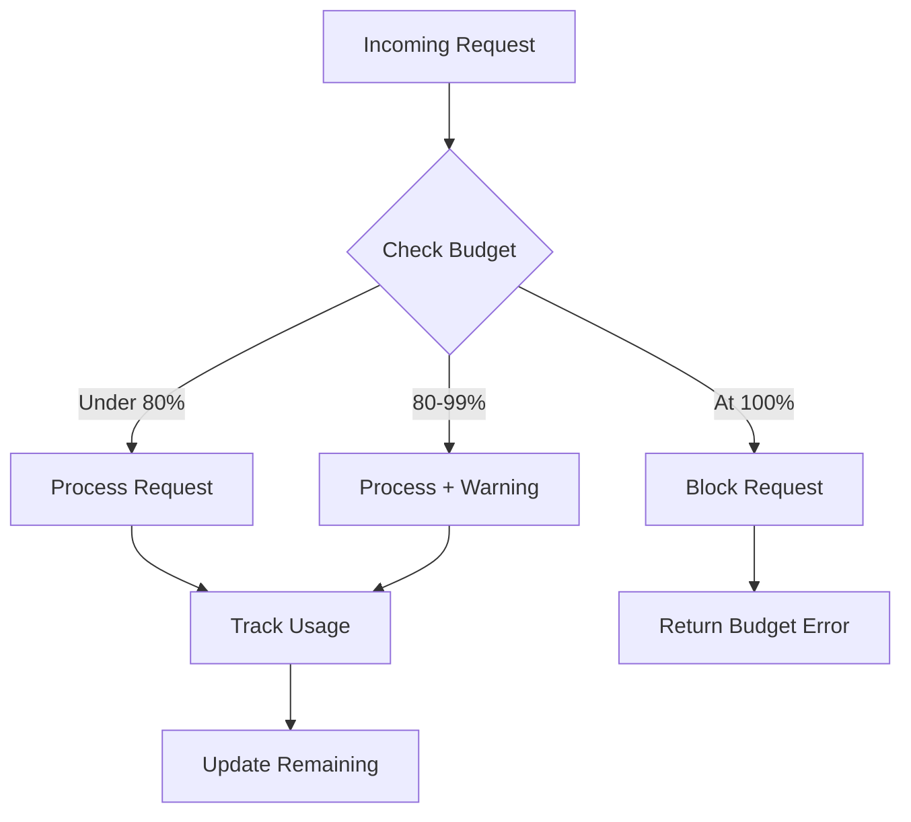

# Budget Limits

## Introduction

Hard limits and soft warnings protect your applications from runaway costs. This lesson covers implementing per-user budgets, project-level limits, and graceful degradation strategies when limits are reached.

### What We'll Cover

- Hard limits vs. soft warnings
- Per-user budget allocation
- Project-level budget management
- Graceful degradation strategies
- Budget enforcement middleware

### Prerequisites

- Usage tracking implementation
- Cost estimation techniques

---

## Hard Limits vs. Soft Warnings



### Budget Types

| Type | Behavior | Use Case |
|------|----------|----------|
| **Soft Warning** | Log, notify, continue | Early awareness |
| **Hard Limit** | Block requests | Cost protection |
| **Rate Limit** | Slow down requests | Burst protection |
| **Quota Reset** | Reset at interval | Recurring limits |

---

## Budget Limit Implementation

```python
from dataclasses import dataclass, field
from datetime import datetime, timedelta
from enum import Enum
from typing import Optional, Callable
import threading

class BudgetPeriod(Enum):
    HOURLY = "hourly"
    DAILY = "daily"
    WEEKLY = "weekly"
    MONTHLY = "monthly"


class BudgetStatus(Enum):
    OK = "ok"
    WARNING = "warning"
    CRITICAL = "critical"
    EXHAUSTED = "exhausted"


@dataclass
class BudgetConfig:
    """Budget configuration for an entity."""
    
    limit: float  # Dollar amount
    period: BudgetPeriod
    soft_warning: float = 0.8  # 80% warning
    hard_warning: float = 0.95  # 95% critical
    allow_overflow: bool = False  # Complete current request if over?
    overflow_margin: float = 0.05  # 5% overflow allowed


@dataclass
class BudgetState:
    """Current state of a budget."""
    
    spent: float = 0.0
    period_start: datetime = field(default_factory=datetime.now)
    request_count: int = 0
    last_updated: datetime = field(default_factory=datetime.now)
    
    def reset(self):
        """Reset for new period."""
        self.spent = 0.0
        self.period_start = datetime.now()
        self.request_count = 0
        self.last_updated = datetime.now()


class BudgetLimitError(Exception):
    """Raised when budget is exhausted."""
    
    def __init__(
        self,
        message: str,
        spent: float,
        limit: float,
        reset_at: datetime
    ):
        super().__init__(message)
        self.spent = spent
        self.limit = limit
        self.reset_at = reset_at


class BudgetManager:
    """Manage budgets for users, projects, or global."""
    
    def __init__(
        self,
        on_warning: Callable[[str, BudgetStatus, float], None] = None
    ):
        self._configs: dict[str, BudgetConfig] = {}
        self._states: dict[str, BudgetState] = {}
        self._lock = threading.Lock()
        self.on_warning = on_warning
    
    def set_budget(self, entity_id: str, config: BudgetConfig):
        """Set budget for an entity (user, project, etc.)."""
        with self._lock:
            self._configs[entity_id] = config
            if entity_id not in self._states:
                self._states[entity_id] = BudgetState()
    
    def get_status(self, entity_id: str) -> tuple[BudgetStatus, dict]:
        """Get current budget status."""
        with self._lock:
            if entity_id not in self._configs:
                return BudgetStatus.OK, {"message": "No budget configured"}
            
            config = self._configs[entity_id]
            state = self._get_current_state(entity_id)
            
            spent_ratio = state.spent / config.limit if config.limit > 0 else 0
            remaining = config.limit - state.spent
            reset_at = self._get_reset_time(entity_id)
            
            if spent_ratio >= 1.0:
                status = BudgetStatus.EXHAUSTED
            elif spent_ratio >= config.hard_warning:
                status = BudgetStatus.CRITICAL
            elif spent_ratio >= config.soft_warning:
                status = BudgetStatus.WARNING
            else:
                status = BudgetStatus.OK
            
            return status, {
                "spent": state.spent,
                "limit": config.limit,
                "remaining": max(0, remaining),
                "spent_percent": spent_ratio * 100,
                "request_count": state.request_count,
                "reset_at": reset_at.isoformat()
            }
    
    def _get_current_state(self, entity_id: str) -> BudgetState:
        """Get state, resetting if period expired."""
        state = self._states.get(entity_id, BudgetState())
        config = self._configs[entity_id]
        
        # Check if period has expired
        reset_at = self._get_reset_time(entity_id)
        if datetime.now() >= reset_at:
            state.reset()
        
        return state
    
    def _get_reset_time(self, entity_id: str) -> datetime:
        """Calculate next reset time."""
        state = self._states.get(entity_id, BudgetState())
        config = self._configs[entity_id]
        
        period_start = state.period_start
        
        if config.period == BudgetPeriod.HOURLY:
            return period_start + timedelta(hours=1)
        elif config.period == BudgetPeriod.DAILY:
            return period_start + timedelta(days=1)
        elif config.period == BudgetPeriod.WEEKLY:
            return period_start + timedelta(weeks=1)
        elif config.period == BudgetPeriod.MONTHLY:
            # Approximate month
            return period_start + timedelta(days=30)
        
        return period_start + timedelta(days=1)
    
    def check_and_reserve(
        self,
        entity_id: str,
        estimated_cost: float
    ) -> bool:
        """
        Check if request can proceed and reserve budget.
        
        Returns True if allowed, raises BudgetLimitError if not.
        """
        with self._lock:
            if entity_id not in self._configs:
                return True  # No budget = unlimited
            
            config = self._configs[entity_id]
            state = self._get_current_state(entity_id)
            
            # Check if already at limit
            if state.spent >= config.limit:
                reset_at = self._get_reset_time(entity_id)
                raise BudgetLimitError(
                    f"Budget exhausted: ${state.spent:.2f} / ${config.limit:.2f}",
                    spent=state.spent,
                    limit=config.limit,
                    reset_at=reset_at
                )
            
            # Check if this request would exceed
            projected = state.spent + estimated_cost
            
            if projected > config.limit:
                if config.allow_overflow:
                    # Allow if within overflow margin
                    overflow_limit = config.limit * (1 + config.overflow_margin)
                    if projected > overflow_limit:
                        reset_at = self._get_reset_time(entity_id)
                        raise BudgetLimitError(
                            f"Request would exceed budget overflow limit",
                            spent=state.spent,
                            limit=config.limit,
                            reset_at=reset_at
                        )
                else:
                    reset_at = self._get_reset_time(entity_id)
                    raise BudgetLimitError(
                        f"Request would exceed budget: ${estimated_cost:.4f} requested, "
                        f"${config.limit - state.spent:.4f} remaining",
                        spent=state.spent,
                        limit=config.limit,
                        reset_at=reset_at
                    )
            
            return True
    
    def record_usage(self, entity_id: str, actual_cost: float):
        """Record actual cost after request completes."""
        with self._lock:
            if entity_id not in self._configs:
                return
            
            config = self._configs[entity_id]
            state = self._get_current_state(entity_id)
            
            state.spent += actual_cost
            state.request_count += 1
            state.last_updated = datetime.now()
            
            self._states[entity_id] = state
            
            # Check for warnings
            if self.on_warning:
                spent_ratio = state.spent / config.limit if config.limit > 0 else 0
                
                if spent_ratio >= 1.0:
                    self.on_warning(entity_id, BudgetStatus.EXHAUSTED, spent_ratio)
                elif spent_ratio >= config.hard_warning:
                    self.on_warning(entity_id, BudgetStatus.CRITICAL, spent_ratio)
                elif spent_ratio >= config.soft_warning:
                    self.on_warning(entity_id, BudgetStatus.WARNING, spent_ratio)


# Usage
def budget_warning(entity_id: str, status: BudgetStatus, ratio: float):
    print(f"⚠️ {entity_id}: {status.value} ({ratio:.0%} used)")

manager = BudgetManager(on_warning=budget_warning)

# Configure budgets
manager.set_budget("user_123", BudgetConfig(
    limit=5.00,
    period=BudgetPeriod.DAILY,
    allow_overflow=True
))

manager.set_budget("project_chatbot", BudgetConfig(
    limit=100.00,
    period=BudgetPeriod.MONTHLY
))

# Check before request
try:
    manager.check_and_reserve("user_123", estimated_cost=0.05)
    # ... make API call ...
    manager.record_usage("user_123", actual_cost=0.048)
except BudgetLimitError as e:
    print(f"Budget exceeded: {e}")
    print(f"Reset at: {e.reset_at}")
```

---

## Per-User Budgets

```python
from dataclasses import dataclass, field
from datetime import datetime
from typing import Optional

@dataclass
class UserBudget:
    """Budget configuration for a user."""
    
    user_id: str
    daily_limit: float = 1.00
    monthly_limit: float = 20.00
    tier: str = "free"  # free, pro, enterprise


class UserBudgetManager:
    """Manage per-user budgets."""
    
    # Default limits by tier
    TIER_LIMITS = {
        "free": {"daily": 1.00, "monthly": 10.00},
        "pro": {"daily": 10.00, "monthly": 100.00},
        "enterprise": {"daily": 100.00, "monthly": 1000.00}
    }
    
    def __init__(self, budget_manager: BudgetManager):
        self.budget_manager = budget_manager
        self._user_tiers: dict[str, str] = {}
    
    def register_user(
        self,
        user_id: str,
        tier: str = "free",
        custom_limits: dict = None
    ):
        """Register a user with budget limits."""
        
        self._user_tiers[user_id] = tier
        
        # Get limits for tier or custom
        if custom_limits:
            daily = custom_limits.get("daily", self.TIER_LIMITS[tier]["daily"])
            monthly = custom_limits.get("monthly", self.TIER_LIMITS[tier]["monthly"])
        else:
            daily = self.TIER_LIMITS[tier]["daily"]
            monthly = self.TIER_LIMITS[tier]["monthly"]
        
        # Set up both daily and monthly budgets
        self.budget_manager.set_budget(
            f"user:{user_id}:daily",
            BudgetConfig(limit=daily, period=BudgetPeriod.DAILY)
        )
        
        self.budget_manager.set_budget(
            f"user:{user_id}:monthly",
            BudgetConfig(limit=monthly, period=BudgetPeriod.MONTHLY)
        )
    
    def check_user_budget(
        self,
        user_id: str,
        estimated_cost: float
    ) -> bool:
        """Check if user can make request."""
        
        # Check both daily and monthly
        self.budget_manager.check_and_reserve(
            f"user:{user_id}:daily",
            estimated_cost
        )
        self.budget_manager.check_and_reserve(
            f"user:{user_id}:monthly",
            estimated_cost
        )
        
        return True
    
    def record_user_usage(self, user_id: str, cost: float):
        """Record usage against user budgets."""
        
        self.budget_manager.record_usage(f"user:{user_id}:daily", cost)
        self.budget_manager.record_usage(f"user:{user_id}:monthly", cost)
    
    def get_user_status(self, user_id: str) -> dict:
        """Get user's budget status."""
        
        daily_status, daily_info = self.budget_manager.get_status(
            f"user:{user_id}:daily"
        )
        monthly_status, monthly_info = self.budget_manager.get_status(
            f"user:{user_id}:monthly"
        )
        
        return {
            "user_id": user_id,
            "tier": self._user_tiers.get(user_id, "unknown"),
            "daily": {
                "status": daily_status.value,
                **daily_info
            },
            "monthly": {
                "status": monthly_status.value,
                **monthly_info
            }
        }
    
    def upgrade_user(self, user_id: str, new_tier: str):
        """Upgrade user to new tier."""
        
        if new_tier not in self.TIER_LIMITS:
            raise ValueError(f"Unknown tier: {new_tier}")
        
        # Re-register with new limits (preserves current usage)
        self.register_user(user_id, new_tier)


# Usage
budget_mgr = BudgetManager()
user_mgr = UserBudgetManager(budget_mgr)

# Register users
user_mgr.register_user("alice", tier="free")
user_mgr.register_user("bob", tier="pro")
user_mgr.register_user("corp_admin", tier="enterprise", custom_limits={
    "daily": 500.00,
    "monthly": 5000.00
})

# Check and record
try:
    user_mgr.check_user_budget("alice", estimated_cost=0.10)
    # ... API call ...
    user_mgr.record_user_usage("alice", cost=0.08)
except BudgetLimitError as e:
    print(f"User budget exceeded: {e}")

# Check status
print(user_mgr.get_user_status("alice"))
```

---

## Project-Level Budgets

```python
from dataclasses import dataclass, field
from datetime import datetime
from typing import Optional

@dataclass
class ProjectConfig:
    """Configuration for a project's budget."""
    
    project_id: str
    name: str
    monthly_budget: float
    models_allowed: list[str] = field(default_factory=list)
    max_tokens_per_request: int = 4000
    priority: int = 1  # For queue priority


class ProjectBudgetManager:
    """Manage project-level budgets."""
    
    def __init__(self, budget_manager: BudgetManager):
        self.budget_manager = budget_manager
        self._projects: dict[str, ProjectConfig] = {}
    
    def create_project(self, config: ProjectConfig):
        """Create a project with budget."""
        
        self._projects[config.project_id] = config
        
        self.budget_manager.set_budget(
            f"project:{config.project_id}",
            BudgetConfig(
                limit=config.monthly_budget,
                period=BudgetPeriod.MONTHLY,
                soft_warning=0.75,  # Warn at 75%
                hard_warning=0.90   # Critical at 90%
            )
        )
    
    def validate_request(
        self,
        project_id: str,
        model: str,
        estimated_tokens: int
    ) -> bool:
        """Validate request against project constraints."""
        
        if project_id not in self._projects:
            raise ValueError(f"Unknown project: {project_id}")
        
        config = self._projects[project_id]
        
        # Check model allowed
        if config.models_allowed and model not in config.models_allowed:
            raise ValueError(
                f"Model {model} not allowed for project {project_id}. "
                f"Allowed: {config.models_allowed}"
            )
        
        # Check token limit
        if estimated_tokens > config.max_tokens_per_request:
            raise ValueError(
                f"Request tokens ({estimated_tokens}) exceed project limit "
                f"({config.max_tokens_per_request})"
            )
        
        return True
    
    def check_project_budget(
        self,
        project_id: str,
        estimated_cost: float
    ) -> bool:
        """Check if project has budget."""
        
        return self.budget_manager.check_and_reserve(
            f"project:{project_id}",
            estimated_cost
        )
    
    def record_project_usage(self, project_id: str, cost: float):
        """Record usage against project."""
        
        self.budget_manager.record_usage(f"project:{project_id}", cost)
    
    def get_project_summary(self, project_id: str) -> dict:
        """Get project budget summary."""
        
        if project_id not in self._projects:
            raise ValueError(f"Unknown project: {project_id}")
        
        config = self._projects[project_id]
        status, info = self.budget_manager.get_status(f"project:{project_id}")
        
        return {
            "project_id": project_id,
            "name": config.name,
            "status": status.value,
            "budget": {
                "monthly_limit": config.monthly_budget,
                **info
            },
            "constraints": {
                "models_allowed": config.models_allowed or "all",
                "max_tokens_per_request": config.max_tokens_per_request
            }
        }


# Usage
budget_mgr = BudgetManager()
project_mgr = ProjectBudgetManager(budget_mgr)

# Create projects
project_mgr.create_project(ProjectConfig(
    project_id="chatbot",
    name="Customer Chatbot",
    monthly_budget=500.00,
    models_allowed=["gpt-4.1-mini", "gpt-4.1-nano"],
    max_tokens_per_request=2000
))

project_mgr.create_project(ProjectConfig(
    project_id="analytics",
    name="Data Analytics",
    monthly_budget=1000.00,
    models_allowed=["gpt-4.1", "claude-sonnet-4"],
    max_tokens_per_request=8000
))

# Validate and check
try:
    project_mgr.validate_request("chatbot", "gpt-4.1-mini", 1500)
    project_mgr.check_project_budget("chatbot", 0.002)
    # ... API call ...
    project_mgr.record_project_usage("chatbot", 0.0018)
except (ValueError, BudgetLimitError) as e:
    print(f"Project error: {e}")
```

---

## Graceful Degradation

```python
from dataclasses import dataclass
from enum import Enum

class DegradationLevel(Enum):
    NONE = "none"           # Full functionality
    REDUCED = "reduced"     # Shorter responses
    MINIMAL = "minimal"     # Basic functionality only
    BLOCKED = "blocked"     # No AI features


@dataclass
class DegradationConfig:
    """Configure degradation behavior."""
    
    # Thresholds (percent of budget spent)
    reduced_at: float = 0.80    # 80%
    minimal_at: float = 0.95    # 95%
    blocked_at: float = 1.00    # 100%
    
    # Reduced mode settings
    reduced_max_tokens: int = 500
    reduced_model: str = "gpt-4.1-nano"
    
    # Minimal mode settings
    minimal_max_tokens: int = 100
    minimal_model: str = "gpt-4.1-nano"
    minimal_temperature: float = 0.0  # No creativity


class GracefulDegrader:
    """Handle graceful degradation based on budget."""
    
    def __init__(
        self,
        budget_manager: BudgetManager,
        config: DegradationConfig = None
    ):
        self.budget_manager = budget_manager
        self.config = config or DegradationConfig()
    
    def get_degradation_level(self, entity_id: str) -> DegradationLevel:
        """Determine current degradation level."""
        
        status, info = self.budget_manager.get_status(entity_id)
        spent_percent = info.get("spent_percent", 0) / 100
        
        if spent_percent >= self.config.blocked_at:
            return DegradationLevel.BLOCKED
        elif spent_percent >= self.config.minimal_at:
            return DegradationLevel.MINIMAL
        elif spent_percent >= self.config.reduced_at:
            return DegradationLevel.REDUCED
        else:
            return DegradationLevel.NONE
    
    def adjust_request(
        self,
        entity_id: str,
        model: str,
        max_tokens: int,
        temperature: float = 1.0
    ) -> dict:
        """Adjust request parameters based on budget."""
        
        level = self.get_degradation_level(entity_id)
        
        adjustments = {
            "original": {
                "model": model,
                "max_tokens": max_tokens,
                "temperature": temperature
            },
            "degradation_level": level.value,
            "adjusted": {}
        }
        
        if level == DegradationLevel.BLOCKED:
            adjustments["blocked"] = True
            adjustments["message"] = "Service temporarily unavailable due to budget limits"
            return adjustments
        
        elif level == DegradationLevel.MINIMAL:
            adjustments["adjusted"] = {
                "model": self.config.minimal_model,
                "max_tokens": min(max_tokens, self.config.minimal_max_tokens),
                "temperature": self.config.minimal_temperature
            }
            adjustments["warning"] = "Running in minimal mode due to budget constraints"
        
        elif level == DegradationLevel.REDUCED:
            adjustments["adjusted"] = {
                "model": self.config.reduced_model,
                "max_tokens": min(max_tokens, self.config.reduced_max_tokens),
                "temperature": temperature
            }
            adjustments["warning"] = "Running in reduced mode due to budget constraints"
        
        else:
            adjustments["adjusted"] = {
                "model": model,
                "max_tokens": max_tokens,
                "temperature": temperature
            }
        
        return adjustments


# Usage
budget_mgr = BudgetManager()
degrader = GracefulDegrader(budget_mgr)

# Configure user budget
budget_mgr.set_budget("user_123", BudgetConfig(
    limit=10.00,
    period=BudgetPeriod.DAILY
))

# Check degradation level
adjustment = degrader.adjust_request(
    entity_id="user_123",
    model="gpt-4.1",
    max_tokens=2000,
    temperature=0.7
)

print(f"Degradation: {adjustment['degradation_level']}")

if adjustment.get("blocked"):
    print(f"Blocked: {adjustment['message']}")
else:
    params = adjustment["adjusted"]
    print(f"Using: {params['model']} with max_tokens={params['max_tokens']}")
```

---

## Budget Enforcement Middleware

```python
from dataclasses import dataclass
from typing import Callable, Any
from functools import wraps

class BudgetMiddleware:
    """Middleware for enforcing budgets on API calls."""
    
    def __init__(
        self,
        budget_manager: BudgetManager,
        cost_estimator: Any,  # Your CostEstimator class
        fallback_response: Callable = None
    ):
        self.budget_manager = budget_manager
        self.cost_estimator = cost_estimator
        self.fallback_response = fallback_response or self._default_fallback
    
    def _default_fallback(self, error: BudgetLimitError) -> dict:
        """Default response when budget exceeded."""
        return {
            "error": "budget_exceeded",
            "message": str(error),
            "reset_at": error.reset_at.isoformat()
        }
    
    def enforce(self, entity_id: str):
        """Decorator to enforce budget on functions."""
        
        def decorator(func: Callable):
            @wraps(func)
            def wrapper(*args, **kwargs):
                # Estimate cost
                model = kwargs.get("model", "gpt-4.1")
                messages = kwargs.get("messages", [])
                max_tokens = kwargs.get("max_tokens", 1000)
                
                estimated_cost = self.cost_estimator.estimate(
                    model=model,
                    messages=messages,
                    max_output_tokens=max_tokens
                )
                
                # Check budget
                try:
                    self.budget_manager.check_and_reserve(
                        entity_id,
                        estimated_cost
                    )
                except BudgetLimitError as e:
                    return self.fallback_response(e)
                
                # Execute function
                result = func(*args, **kwargs)
                
                # Record actual cost (if available in result)
                actual_cost = self._extract_cost(result) or estimated_cost
                self.budget_manager.record_usage(entity_id, actual_cost)
                
                return result
            
            return wrapper
        return decorator
    
    def _extract_cost(self, result: Any) -> float:
        """Extract actual cost from API response."""
        try:
            if hasattr(result, "usage"):
                usage = result.usage
                # Calculate based on actual tokens
                # This would use your cost calculator
                return 0.0  # Placeholder
        except Exception:
            pass
        return None


# Usage example
# budget_middleware = BudgetMiddleware(budget_mgr, cost_estimator)
# 
# @budget_middleware.enforce("user_123")
# def call_ai(model, messages, max_tokens):
#     return client.chat.completions.create(
#         model=model,
#         messages=messages,
#         max_tokens=max_tokens
#     )
```

---

## JavaScript Implementation

```javascript
class BudgetManager {
    constructor() {
        this.budgets = new Map();
        this.usage = new Map();
    }
    
    setBudget(entityId, { limit, period = 'daily' }) {
        this.budgets.set(entityId, { limit, period });
        if (!this.usage.has(entityId)) {
            this.usage.set(entityId, { spent: 0, periodStart: new Date() });
        }
    }
    
    checkBudget(entityId, estimatedCost) {
        const budget = this.budgets.get(entityId);
        if (!budget) return true;
        
        const usage = this.usage.get(entityId);
        const remaining = budget.limit - usage.spent;
        
        if (estimatedCost > remaining) {
            throw new Error(`Budget exceeded: $${usage.spent.toFixed(2)} / $${budget.limit.toFixed(2)}`);
        }
        
        return true;
    }
    
    recordUsage(entityId, cost) {
        const usage = this.usage.get(entityId);
        if (usage) {
            usage.spent += cost;
        }
    }
    
    getStatus(entityId) {
        const budget = this.budgets.get(entityId);
        const usage = this.usage.get(entityId);
        
        if (!budget || !usage) {
            return { status: 'ok', message: 'No budget configured' };
        }
        
        const percent = (usage.spent / budget.limit) * 100;
        
        return {
            status: percent >= 100 ? 'exhausted' : percent >= 80 ? 'warning' : 'ok',
            spent: usage.spent,
            limit: budget.limit,
            percent: percent.toFixed(1)
        };
    }
}

// Usage
const budgetMgr = new BudgetManager();

budgetMgr.setBudget('user_123', { limit: 5.00, period: 'daily' });

try {
    budgetMgr.checkBudget('user_123', 0.10);
    // ... API call ...
    budgetMgr.recordUsage('user_123', 0.08);
} catch (error) {
    console.error('Budget error:', error.message);
}

console.log(budgetMgr.getStatus('user_123'));
```

---

## Hands-on Exercise

### Your Task

Create a multi-tier budget system with user and project limits.

### Requirements

1. Users belong to projects
2. Check both user and project limits
3. Implement graceful degradation
4. Track usage at both levels

### Expected Result

```python
# User hits their limit, project still has budget
result = budget_system.check("user_alice", "project_chatbot", cost=0.10)
# {'allowed': False, 'reason': 'user_limit', 'degradation': 'minimal'}

# Both have budget
result = budget_system.check("user_bob", "project_chatbot", cost=0.10)
# {'allowed': True, 'degradation': 'none'}
```

<details>
<summary>💡 Hints</summary>

- Check user budget first, then project
- Return most restrictive result
- Apply degradation based on higher usage percentage
</details>

<details>
<summary>✅ Solution</summary>

```python
from dataclasses import dataclass
from enum import Enum

class DegradationLevel(Enum):
    NONE = 0
    REDUCED = 1
    MINIMAL = 2
    BLOCKED = 3


@dataclass
class BudgetCheckResult:
    """Result of budget check."""
    
    allowed: bool
    reason: str = ""
    degradation: str = "none"
    user_percent: float = 0.0
    project_percent: float = 0.0


class MultiBudgetSystem:
    """Multi-tier budget with users and projects."""
    
    def __init__(self):
        self.user_limits = {}    # user_id -> limit
        self.project_limits = {} # project_id -> limit
        self.user_usage = {}     # user_id -> spent
        self.project_usage = {}  # project_id -> spent
        self.user_projects = {}  # user_id -> project_id
    
    def setup_user(self, user_id: str, project_id: str, daily_limit: float):
        """Register user with project."""
        self.user_limits[user_id] = daily_limit
        self.user_usage[user_id] = 0.0
        self.user_projects[user_id] = project_id
    
    def setup_project(self, project_id: str, monthly_limit: float):
        """Create project budget."""
        self.project_limits[project_id] = monthly_limit
        self.project_usage[project_id] = 0.0
    
    def check(
        self,
        user_id: str,
        project_id: str,
        cost: float
    ) -> BudgetCheckResult:
        """Check both user and project budgets."""
        
        # Get current usage percentages
        user_limit = self.user_limits.get(user_id, float('inf'))
        user_spent = self.user_usage.get(user_id, 0)
        user_percent = (user_spent / user_limit * 100) if user_limit > 0 else 0
        
        project_limit = self.project_limits.get(project_id, float('inf'))
        project_spent = self.project_usage.get(project_id, 0)
        project_percent = (project_spent / project_limit * 100) if project_limit > 0 else 0
        
        # Determine degradation level based on higher usage
        max_percent = max(user_percent, project_percent)
        
        if max_percent >= 100:
            degradation = "blocked"
        elif max_percent >= 95:
            degradation = "minimal"
        elif max_percent >= 80:
            degradation = "reduced"
        else:
            degradation = "none"
        
        # Check if request fits
        user_remaining = user_limit - user_spent
        project_remaining = project_limit - project_spent
        
        if cost > user_remaining:
            return BudgetCheckResult(
                allowed=False,
                reason="user_limit",
                degradation=degradation,
                user_percent=user_percent,
                project_percent=project_percent
            )
        
        if cost > project_remaining:
            return BudgetCheckResult(
                allowed=False,
                reason="project_limit",
                degradation=degradation,
                user_percent=user_percent,
                project_percent=project_percent
            )
        
        return BudgetCheckResult(
            allowed=True,
            degradation=degradation,
            user_percent=user_percent,
            project_percent=project_percent
        )
    
    def record(self, user_id: str, project_id: str, cost: float):
        """Record usage at both levels."""
        self.user_usage[user_id] = self.user_usage.get(user_id, 0) + cost
        self.project_usage[project_id] = self.project_usage.get(project_id, 0) + cost


# Test
system = MultiBudgetSystem()

# Setup
system.setup_project("chatbot", monthly_limit=100.00)
system.setup_user("alice", "chatbot", daily_limit=5.00)
system.setup_user("bob", "chatbot", daily_limit=10.00)

# Simulate alice hitting her limit
system.user_usage["alice"] = 4.95

# Check alice (should fail - at limit)
result = system.check("alice", "chatbot", cost=0.10)
print(f"Alice: allowed={result.allowed}, reason={result.reason}, "
      f"degradation={result.degradation}")

# Check bob (should succeed)
result = system.check("bob", "chatbot", cost=0.10)
print(f"Bob: allowed={result.allowed}, degradation={result.degradation}")

# Record bob's usage
if result.allowed:
    system.record("bob", "chatbot", 0.10)
```

**Output:**
```
Alice: allowed=False, reason=user_limit, degradation=minimal
Bob: allowed=True, degradation=none
```

</details>

---

## Summary

✅ Use soft warnings at 80% and hard limits at 100%  
✅ Implement per-user quotas with tier-based defaults  
✅ Set project-level budgets with model restrictions  
✅ Apply graceful degradation before blocking  
✅ Enforce budgets in middleware for consistent protection

**Next:** [Prompt Optimization](./06-prompt-optimization.md)

---

## Further Reading

- [OpenAI Usage Limits](https://platform.openai.com/docs/guides/rate-limits) — Official limits
- [Anthropic Rate Limits](https://docs.anthropic.com/en/api/rate-limits) — Claude limits
- [Cost Estimation Guide](./03-cost-estimation.md) — Accurate predictions

<!-- 
Sources Consulted:
- OpenAI rate limits: https://platform.openai.com/docs/guides/rate-limits
- Anthropic rate limits: https://docs.anthropic.com/en/api/rate-limits
-->
