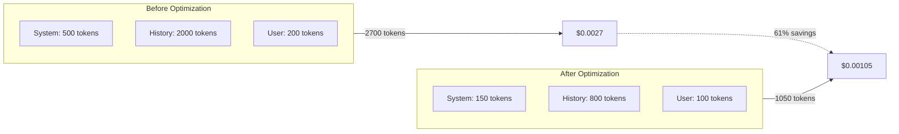

# Prompt Optimization for Cost

## Introduction

Reducing input tokens is one of the most effective ways to cut API costs. This lesson covers techniques for writing shorter prompts, efficient few-shot examples, and selecting cost-effective models without sacrificing quality.

### What We'll Cover

- Writing concise prompts
- Efficient few-shot examples
- Prompt compression techniques
- Model selection strategy
- Measuring optimization impact

### Prerequisites

- Token pricing understanding
- Cost estimation techniques

---

## The Cost of Verbose Prompts



### Token Cost Comparison

| Component | Verbose | Optimized | Savings |
|-----------|---------|-----------|---------|
| System prompt | 500 tokens | 150 tokens | 70% |
| Message history | 2,000 tokens | 800 tokens | 60% |
| User message | 200 tokens | 100 tokens | 50% |
| **Total** | 2,700 tokens | 1,050 tokens | **61%** |

---

## Writing Concise Prompts

### Before and After Examples

**Verbose (124 tokens):**
```
You are a helpful AI assistant. Your role is to help users with their 
questions and provide accurate, informative responses. When answering 
questions, you should be thorough but also concise. You should always 
be polite and professional in your responses. If you don't know 
something, it's okay to say so rather than making up information. 
Please provide your responses in a clear and easy-to-understand format.
```

**Optimized (28 tokens):**
```
You are a helpful assistant. Be accurate, concise, and professional. 
Admit uncertainty rather than guessing.
```

### Prompt Optimization Patterns

```python
class PromptOptimizer:
    """Optimize prompts for cost efficiency."""
    
    # Words/phrases that can often be removed
    FILLER_PATTERNS = [
        r"\bplease\b",
        r"\bkindly\b",
        r"\bif you could\b",
        r"\bI would like you to\b",
        r"\bI want you to\b",
        r"\bin a .* manner\b",
        r"\bremember to\b",
        r"\bmake sure to\b",
        r"\bit is important that\b",
        r"\byou should always\b",
    ]
    
    # Verbose → Concise mappings
    REPLACEMENTS = {
        "in order to": "to",
        "due to the fact that": "because",
        "at this point in time": "now",
        "in the event that": "if",
        "with regard to": "about",
        "take into consideration": "consider",
        "a large number of": "many",
        "in close proximity to": "near",
        "has the ability to": "can",
        "in spite of the fact that": "although",
        "for the purpose of": "to",
        "on a daily basis": "daily",
        "at the present time": "currently",
        "in the near future": "soon",
        "a sufficient amount of": "enough",
    }
    
    def __init__(self):
        import re
        self.filler_regex = [re.compile(p, re.IGNORECASE) for p in self.FILLER_PATTERNS]
    
    def optimize(self, prompt: str) -> str:
        """Apply optimizations to a prompt."""
        
        result = prompt
        
        # Apply word replacements
        for verbose, concise in self.REPLACEMENTS.items():
            result = result.replace(verbose, concise)
        
        # Remove filler patterns (optional - be careful)
        # for pattern in self.filler_regex:
        #     result = pattern.sub("", result)
        
        # Normalize whitespace
        result = " ".join(result.split())
        
        return result
    
    def analyze(self, prompt: str) -> dict:
        """Analyze prompt for optimization opportunities."""
        
        import tiktoken
        enc = tiktoken.get_encoding("cl100k_base")
        
        optimized = self.optimize(prompt)
        
        original_tokens = len(enc.encode(prompt))
        optimized_tokens = len(enc.encode(optimized))
        
        # Find specific issues
        issues = []
        for pattern in self.filler_regex:
            import re
            matches = re.findall(pattern, prompt)
            if matches:
                issues.append(f"Filler phrase found: '{matches[0]}'")
        
        for verbose in self.REPLACEMENTS:
            if verbose in prompt.lower():
                issues.append(f"Verbose phrase: '{verbose}' → '{self.REPLACEMENTS[verbose]}'")
        
        return {
            "original_tokens": original_tokens,
            "optimized_tokens": optimized_tokens,
            "savings_tokens": original_tokens - optimized_tokens,
            "savings_percent": ((original_tokens - optimized_tokens) / original_tokens * 100) if original_tokens > 0 else 0,
            "issues": issues,
            "optimized_prompt": optimized
        }


# Usage
optimizer = PromptOptimizer()

verbose_prompt = """
I would like you to please take into consideration the following request.
In order to provide me with information, you should analyze the data
due to the fact that I need accurate results. Please make sure to be
thorough in your analysis at this point in time.
"""

analysis = optimizer.analyze(verbose_prompt)
print(f"Original: {analysis['original_tokens']} tokens")
print(f"Optimized: {analysis['optimized_tokens']} tokens")
print(f"Savings: {analysis['savings_percent']:.1f}%")
print("\nIssues found:")
for issue in analysis['issues']:
    print(f"  - {issue}")
```

---

## Efficient Few-Shot Examples

### The Cost of Examples

Few-shot examples multiply quickly:

| Examples | Tokens Each | Total Input | Cost per Request |
|----------|-------------|-------------|------------------|
| 0 | 0 | 500 | $0.0005 |
| 3 | 200 | 1,100 | $0.0011 |
| 5 | 200 | 1,500 | $0.0015 |
| 10 | 200 | 2,500 | $0.0025 |

### Optimizing Examples

```python
from dataclasses import dataclass
from typing import Optional

@dataclass
class Example:
    """A few-shot example."""
    
    input_text: str
    output_text: str
    category: Optional[str] = None


class FewShotOptimizer:
    """Optimize few-shot examples for cost."""
    
    def __init__(self):
        import tiktoken
        self.encoder = tiktoken.get_encoding("cl100k_base")
    
    def count_tokens(self, text: str) -> int:
        """Count tokens in text."""
        return len(self.encoder.encode(text))
    
    def compress_example(self, example: Example) -> Example:
        """Compress an example while preserving meaning."""
        
        # Shorten input/output while keeping structure
        compressed_input = self._compress_text(example.input_text)
        compressed_output = self._compress_text(example.output_text)
        
        return Example(
            input_text=compressed_input,
            output_text=compressed_output,
            category=example.category
        )
    
    def _compress_text(self, text: str) -> str:
        """Apply compression to text."""
        
        # Remove unnecessary whitespace
        text = " ".join(text.split())
        
        # Truncate if very long
        if self.count_tokens(text) > 100:
            # Keep first part
            words = text.split()
            while self.count_tokens(" ".join(words)) > 100:
                words = words[:-1]
            text = " ".join(words) + "..."
        
        return text
    
    def select_examples(
        self,
        examples: list[Example],
        max_examples: int = 3,
        max_tokens: int = 500,
        strategy: str = "diverse"
    ) -> list[Example]:
        """Select optimal subset of examples."""
        
        if strategy == "diverse":
            return self._select_diverse(examples, max_examples, max_tokens)
        elif strategy == "shortest":
            return self._select_shortest(examples, max_examples, max_tokens)
        elif strategy == "recent":
            return examples[:max_examples]
        else:
            return examples[:max_examples]
    
    def _select_shortest(
        self,
        examples: list[Example],
        max_count: int,
        max_tokens: int
    ) -> list[Example]:
        """Select shortest examples."""
        
        # Sort by total tokens
        sorted_examples = sorted(
            examples,
            key=lambda e: self.count_tokens(e.input_text + e.output_text)
        )
        
        selected = []
        total_tokens = 0
        
        for ex in sorted_examples:
            ex_tokens = self.count_tokens(ex.input_text + ex.output_text)
            if total_tokens + ex_tokens <= max_tokens and len(selected) < max_count:
                selected.append(ex)
                total_tokens += ex_tokens
        
        return selected
    
    def _select_diverse(
        self,
        examples: list[Example],
        max_count: int,
        max_tokens: int
    ) -> list[Example]:
        """Select diverse examples by category."""
        
        # Group by category
        by_category = {}
        for ex in examples:
            cat = ex.category or "default"
            if cat not in by_category:
                by_category[cat] = []
            by_category[cat].append(ex)
        
        # Take one from each category
        selected = []
        total_tokens = 0
        categories = list(by_category.keys())
        
        while len(selected) < max_count and categories:
            for cat in list(categories):
                if not by_category[cat]:
                    categories.remove(cat)
                    continue
                
                ex = by_category[cat].pop(0)
                ex_tokens = self.count_tokens(ex.input_text + ex.output_text)
                
                if total_tokens + ex_tokens <= max_tokens:
                    selected.append(ex)
                    total_tokens += ex_tokens
                
                if len(selected) >= max_count:
                    break
        
        return selected
    
    def build_prompt_section(self, examples: list[Example]) -> str:
        """Build examples section for prompt."""
        
        lines = ["Examples:"]
        
        for i, ex in enumerate(examples, 1):
            lines.append(f"\nExample {i}:")
            lines.append(f"Input: {ex.input_text}")
            lines.append(f"Output: {ex.output_text}")
        
        return "\n".join(lines)


# Usage
optimizer = FewShotOptimizer()

examples = [
    Example("Translate: Hello", "Hola", category="translation"),
    Example("Translate: Good morning", "Buenos días", category="translation"),
    Example("Sentiment: Great product!", "positive", category="sentiment"),
    Example("Sentiment: Terrible experience", "negative", category="sentiment"),
    Example("Summarize: This is a very long text about...", "Brief summary here", category="summary"),
]

selected = optimizer.select_examples(
    examples,
    max_examples=3,
    max_tokens=200,
    strategy="diverse"
)

prompt_section = optimizer.build_prompt_section(selected)
print(prompt_section)
print(f"\nTotal tokens: {optimizer.count_tokens(prompt_section)}")
```

---

## Dynamic Example Selection

```python
from dataclasses import dataclass
from typing import Callable

class DynamicExampleSelector:
    """Select examples based on the current query."""
    
    def __init__(
        self,
        examples: list[Example],
        similarity_fn: Callable[[str, str], float] = None
    ):
        self.examples = examples
        self.similarity_fn = similarity_fn or self._simple_similarity
    
    def _simple_similarity(self, query: str, example_input: str) -> float:
        """Simple keyword overlap similarity."""
        
        query_words = set(query.lower().split())
        example_words = set(example_input.lower().split())
        
        if not query_words:
            return 0.0
        
        overlap = len(query_words & example_words)
        return overlap / len(query_words)
    
    def select_for_query(
        self,
        query: str,
        max_examples: int = 3,
        min_similarity: float = 0.1
    ) -> list[Example]:
        """Select most relevant examples for a query."""
        
        # Score each example
        scored = [
            (ex, self.similarity_fn(query, ex.input_text))
            for ex in self.examples
        ]
        
        # Filter and sort by similarity
        filtered = [
            (ex, score) for ex, score in scored
            if score >= min_similarity
        ]
        
        filtered.sort(key=lambda x: x[1], reverse=True)
        
        return [ex for ex, _ in filtered[:max_examples]]
    
    def get_cached_or_select(
        self,
        query: str,
        cache: dict,
        max_examples: int = 3
    ) -> tuple[list[Example], bool]:
        """Get from cache or select new examples."""
        
        # Create cache key from query keywords
        query_key = tuple(sorted(set(query.lower().split())))
        
        if query_key in cache:
            return cache[query_key], True  # Cache hit
        
        selected = self.select_for_query(query, max_examples)
        cache[query_key] = selected
        return selected, False  # Cache miss


# Usage
selector = DynamicExampleSelector(examples)

# For translation query, get translation examples
query = "Translate: Goodbye"
relevant = selector.select_for_query(query, max_examples=2)

print(f"Query: {query}")
print(f"Selected examples:")
for ex in relevant:
    print(f"  - {ex.input_text} → {ex.output_text}")
```

---

## Prompt Compression Techniques

### Structured Compression

```python
from dataclasses import dataclass

class PromptCompressor:
    """Compress prompts using various techniques."""
    
    @staticmethod
    def use_abbreviations(prompt: str, abbreviations: dict) -> str:
        """Replace common terms with abbreviations."""
        
        result = prompt
        for full, abbrev in abbreviations.items():
            result = result.replace(full, abbrev)
        return result
    
    @staticmethod
    def use_json_format(structured_data: dict) -> str:
        """Use JSON instead of prose for structured data."""
        
        import json
        return json.dumps(structured_data, separators=(',', ':'))
    
    @staticmethod
    def remove_redundancy(prompt: str) -> str:
        """Remove redundant information."""
        
        lines = prompt.strip().split('\n')
        unique_lines = []
        seen_content = set()
        
        for line in lines:
            normalized = line.strip().lower()
            if normalized and normalized not in seen_content:
                unique_lines.append(line)
                seen_content.add(normalized)
        
        return '\n'.join(unique_lines)
    
    @staticmethod
    def truncate_context(
        context: str,
        max_tokens: int,
        strategy: str = "end"
    ) -> str:
        """Truncate context to fit token limit."""
        
        import tiktoken
        enc = tiktoken.get_encoding("cl100k_base")
        
        tokens = enc.encode(context)
        
        if len(tokens) <= max_tokens:
            return context
        
        if strategy == "end":
            # Keep beginning
            truncated = tokens[:max_tokens]
        elif strategy == "start":
            # Keep end
            truncated = tokens[-max_tokens:]
        elif strategy == "middle":
            # Keep beginning and end
            half = max_tokens // 2
            truncated = tokens[:half] + tokens[-half:]
        else:
            truncated = tokens[:max_tokens]
        
        return enc.decode(truncated) + "..."


# Example usage
compressor = PromptCompressor()

# Using abbreviations
abbreviations = {
    "function": "fn",
    "parameter": "param",
    "return": "ret",
    "variable": "var",
    "JavaScript": "JS",
    "TypeScript": "TS",
}

prompt = "Write a JavaScript function with parameters that returns a variable."
compressed = compressor.use_abbreviations(prompt, abbreviations)
print(f"Original: {prompt}")
print(f"Compressed: {compressed}")

# Using JSON instead of prose
verbose_data = """
The user's name is John. The user's email is john@example.com. 
The user's subscription tier is premium. The user signed up on 2024-01-15.
"""

json_data = compressor.use_json_format({
    "name": "John",
    "email": "john@example.com",
    "tier": "premium",
    "signup": "2024-01-15"
})

import tiktoken
enc = tiktoken.get_encoding("cl100k_base")
print(f"\nVerbose: {len(enc.encode(verbose_data))} tokens")
print(f"JSON: {len(enc.encode(json_data))} tokens")
```

---

## Model Selection Strategy

### Cost-Quality Trade-offs

| Task Complexity | Recommended Model | Cost Level |
|-----------------|-------------------|------------|
| Simple classification | gpt-4.1-nano | Very Low |
| Basic Q&A | gpt-4.1-mini | Low |
| Content generation | gpt-4.1 | Medium |
| Complex reasoning | gpt-4.1 / claude-sonnet-4 | Medium |
| Expert analysis | o3 / claude-opus-4 | High |

### Dynamic Model Selection

```python
from dataclasses import dataclass
from enum import Enum
from typing import Optional

class TaskComplexity(Enum):
    SIMPLE = "simple"      # Classification, extraction
    MODERATE = "moderate"  # Q&A, summarization
    COMPLEX = "complex"    # Analysis, generation
    EXPERT = "expert"      # Reasoning, research


@dataclass
class ModelOption:
    """Model configuration option."""
    
    name: str
    input_cost_per_1k: float
    output_cost_per_1k: float
    max_complexity: TaskComplexity


class ModelSelector:
    """Select optimal model based on task requirements."""
    
    MODELS = [
        ModelOption("gpt-4.1-nano", 0.0001, 0.0004, TaskComplexity.SIMPLE),
        ModelOption("gpt-4.1-mini", 0.0004, 0.0016, TaskComplexity.MODERATE),
        ModelOption("gpt-4.1", 0.002, 0.008, TaskComplexity.COMPLEX),
        ModelOption("o3", 0.01, 0.04, TaskComplexity.EXPERT),
    ]
    
    COMPLEXITY_ORDER = [
        TaskComplexity.SIMPLE,
        TaskComplexity.MODERATE,
        TaskComplexity.COMPLEX,
        TaskComplexity.EXPERT
    ]
    
    def __init__(self, default_model: str = "gpt-4.1-mini"):
        self.default_model = default_model
    
    def select(
        self,
        complexity: TaskComplexity,
        prefer_cost: bool = True,
        min_model: str = None
    ) -> ModelOption:
        """Select model based on complexity."""
        
        complexity_idx = self.COMPLEXITY_ORDER.index(complexity)
        
        # Find capable models
        capable = [
            m for m in self.MODELS
            if self.COMPLEXITY_ORDER.index(m.max_complexity) >= complexity_idx
        ]
        
        if not capable:
            # Fall back to most capable
            return self.MODELS[-1]
        
        if prefer_cost:
            # Return cheapest capable model
            return min(capable, key=lambda m: m.input_cost_per_1k)
        else:
            # Return most capable model
            return max(capable, key=lambda m: self.COMPLEXITY_ORDER.index(m.max_complexity))
    
    def estimate_complexity(self, prompt: str) -> TaskComplexity:
        """Estimate task complexity from prompt."""
        
        prompt_lower = prompt.lower()
        
        # Simple tasks
        simple_indicators = [
            "classify", "categorize", "extract",
            "yes or no", "true or false", "is this"
        ]
        
        # Moderate tasks
        moderate_indicators = [
            "summarize", "explain briefly", "list",
            "what is", "how does", "describe"
        ]
        
        # Complex tasks
        complex_indicators = [
            "analyze", "compare", "evaluate",
            "write an article", "create a", "design"
        ]
        
        # Expert tasks
        expert_indicators = [
            "research", "in-depth analysis", "comprehensive",
            "synthesize", "novel approach", "advanced"
        ]
        
        for indicator in expert_indicators:
            if indicator in prompt_lower:
                return TaskComplexity.EXPERT
        
        for indicator in complex_indicators:
            if indicator in prompt_lower:
                return TaskComplexity.COMPLEX
        
        for indicator in moderate_indicators:
            if indicator in prompt_lower:
                return TaskComplexity.MODERATE
        
        return TaskComplexity.SIMPLE
    
    def auto_select(self, prompt: str) -> tuple[ModelOption, TaskComplexity]:
        """Automatically select model based on prompt."""
        
        complexity = self.estimate_complexity(prompt)
        model = self.select(complexity)
        return model, complexity


# Usage
selector = ModelSelector()

prompts = [
    "Classify this email as spam or not spam",
    "Summarize this article in 3 sentences",
    "Analyze the competitive landscape for AI startups",
    "Conduct comprehensive research on quantum computing applications"
]

for prompt in prompts:
    model, complexity = selector.auto_select(prompt)
    print(f"Task: {prompt[:50]}...")
    print(f"  Complexity: {complexity.value}")
    print(f"  Model: {model.name} (${model.input_cost_per_1k}/1k input)")
    print()
```

---

## Measuring Optimization Impact

```python
from dataclasses import dataclass, field
from datetime import datetime
from typing import Optional
import tiktoken

@dataclass
class OptimizationMetrics:
    """Track optimization impact over time."""
    
    original_tokens: int = 0
    optimized_tokens: int = 0
    original_cost: float = 0.0
    optimized_cost: float = 0.0
    requests_measured: int = 0


class OptimizationTracker:
    """Track and report on prompt optimization."""
    
    def __init__(self, cost_per_1k_tokens: float = 0.001):
        self.cost_per_1k = cost_per_1k_tokens
        self.encoder = tiktoken.get_encoding("cl100k_base")
        self.metrics = OptimizationMetrics()
        self.history = []
    
    def record(
        self,
        original_prompt: str,
        optimized_prompt: str,
        model: str = "gpt-4.1-mini"
    ):
        """Record an optimization comparison."""
        
        original_tokens = len(self.encoder.encode(original_prompt))
        optimized_tokens = len(self.encoder.encode(optimized_prompt))
        
        original_cost = (original_tokens / 1000) * self.cost_per_1k
        optimized_cost = (optimized_tokens / 1000) * self.cost_per_1k
        
        self.metrics.original_tokens += original_tokens
        self.metrics.optimized_tokens += optimized_tokens
        self.metrics.original_cost += original_cost
        self.metrics.optimized_cost += optimized_cost
        self.metrics.requests_measured += 1
        
        self.history.append({
            "timestamp": datetime.now().isoformat(),
            "model": model,
            "original_tokens": original_tokens,
            "optimized_tokens": optimized_tokens,
            "savings_tokens": original_tokens - optimized_tokens,
            "savings_percent": ((original_tokens - optimized_tokens) / original_tokens * 100) if original_tokens > 0 else 0
        })
    
    def get_summary(self) -> dict:
        """Get optimization summary."""
        
        m = self.metrics
        
        savings_tokens = m.original_tokens - m.optimized_tokens
        savings_percent = (savings_tokens / m.original_tokens * 100) if m.original_tokens > 0 else 0
        savings_cost = m.original_cost - m.optimized_cost
        
        return {
            "requests_measured": m.requests_measured,
            "total_tokens": {
                "original": m.original_tokens,
                "optimized": m.optimized_tokens,
                "saved": savings_tokens,
                "savings_percent": round(savings_percent, 1)
            },
            "total_cost": {
                "original": round(m.original_cost, 4),
                "optimized": round(m.optimized_cost, 4),
                "saved": round(savings_cost, 4)
            },
            "avg_savings_per_request": {
                "tokens": savings_tokens // m.requests_measured if m.requests_measured > 0 else 0,
                "cost": round(savings_cost / m.requests_measured, 6) if m.requests_measured > 0 else 0
            }
        }
    
    def project_monthly_savings(self, requests_per_month: int) -> dict:
        """Project savings at scale."""
        
        if self.metrics.requests_measured == 0:
            return {"error": "No data to project from"}
        
        avg_savings = (self.metrics.original_cost - self.metrics.optimized_cost) / self.metrics.requests_measured
        
        monthly_savings = avg_savings * requests_per_month
        
        return {
            "requests_per_month": requests_per_month,
            "projected_savings": round(monthly_savings, 2),
            "annual_savings": round(monthly_savings * 12, 2)
        }


# Usage
tracker = OptimizationTracker()

# Record some optimizations
tracker.record(
    original_prompt="Please help me understand how to write a function in JavaScript that takes a parameter and returns a value",
    optimized_prompt="Write a JS function with param that returns value"
)

tracker.record(
    original_prompt="I would like you to please summarize the following document for me in a way that is concise and easy to understand",
    optimized_prompt="Summarize this document concisely"
)

# Get results
summary = tracker.get_summary()
print(f"Measured {summary['requests_measured']} requests")
print(f"Token savings: {summary['total_tokens']['savings_percent']}%")
print(f"Cost savings: ${summary['total_cost']['saved']}")

# Project at scale
projection = tracker.project_monthly_savings(10000)
print(f"\nAt 10,000 requests/month:")
print(f"  Monthly savings: ${projection['projected_savings']}")
print(f"  Annual savings: ${projection['annual_savings']}")
```

---

## JavaScript Implementation

```javascript
class PromptOptimizer {
    constructor() {
        this.replacements = {
            'in order to': 'to',
            'due to the fact that': 'because',
            'at this point in time': 'now',
            'in the event that': 'if',
            'with regard to': 'about',
        };
    }
    
    optimize(prompt) {
        let result = prompt;
        
        for (const [verbose, concise] of Object.entries(this.replacements)) {
            result = result.replace(new RegExp(verbose, 'gi'), concise);
        }
        
        // Normalize whitespace
        result = result.replace(/\s+/g, ' ').trim();
        
        return result;
    }
    
    analyze(prompt) {
        const optimized = this.optimize(prompt);
        const originalWords = prompt.split(/\s+/).length;
        const optimizedWords = optimized.split(/\s+/).length;
        
        return {
            originalWords,
            optimizedWords,
            savings: originalWords - optimizedWords,
            savingsPercent: ((originalWords - optimizedWords) / originalWords * 100).toFixed(1)
        };
    }
}

class ModelSelector {
    static MODELS = {
        simple: { name: 'gpt-4.1-nano', cost: 0.0001 },
        moderate: { name: 'gpt-4.1-mini', cost: 0.0004 },
        complex: { name: 'gpt-4.1', cost: 0.002 },
        expert: { name: 'o3', cost: 0.01 }
    };
    
    static selectForPrompt(prompt) {
        const lower = prompt.toLowerCase();
        
        if (lower.includes('research') || lower.includes('comprehensive')) {
            return this.MODELS.expert;
        }
        if (lower.includes('analyze') || lower.includes('evaluate')) {
            return this.MODELS.complex;
        }
        if (lower.includes('summarize') || lower.includes('explain')) {
            return this.MODELS.moderate;
        }
        return this.MODELS.simple;
    }
}
```

---

## Hands-on Exercise

### Your Task

Build a prompt optimization pipeline that analyzes, optimizes, and selects the best model.

### Requirements

1. Analyze prompt for verbose patterns
2. Apply optimization rules
3. Select appropriate model
4. Calculate cost savings

### Expected Result

```python
pipeline = OptimizationPipeline()

result = pipeline.process("""
I would like you to please help me in order to understand 
how machine learning works. Please be thorough and comprehensive
in your explanation due to the fact that I am a beginner.
""")

print(result)
# {
#   "original_tokens": 52,
#   "optimized_tokens": 28,
#   "savings": "46%",
#   "selected_model": "gpt-4.1-mini",
#   "estimated_cost": "$0.000028"
# }
```

<details>
<summary>💡 Hints</summary>

- Combine PromptOptimizer and ModelSelector
- Use tiktoken for token counting
- Calculate cost based on selected model
</details>

<details>
<summary>✅ Solution</summary>

```python
import tiktoken

class OptimizationPipeline:
    """Complete prompt optimization pipeline."""
    
    REPLACEMENTS = {
        "in order to": "to",
        "due to the fact that": "because",
        "I would like you to": "",
        "please help me": "help me",
        "please be": "be",
    }
    
    MODELS = {
        "simple": ("gpt-4.1-nano", 0.0001, 0.0004),
        "moderate": ("gpt-4.1-mini", 0.0004, 0.0016),
        "complex": ("gpt-4.1", 0.002, 0.008),
        "expert": ("o3", 0.01, 0.04),
    }
    
    def __init__(self):
        self.encoder = tiktoken.get_encoding("cl100k_base")
    
    def _count_tokens(self, text: str) -> int:
        return len(self.encoder.encode(text))
    
    def _optimize(self, prompt: str) -> str:
        result = prompt
        for verbose, concise in self.REPLACEMENTS.items():
            result = result.replace(verbose, concise)
        result = " ".join(result.split())
        return result
    
    def _estimate_complexity(self, prompt: str) -> str:
        lower = prompt.lower()
        
        if any(w in lower for w in ["research", "comprehensive", "in-depth"]):
            return "complex"
        if any(w in lower for w in ["analyze", "evaluate", "compare"]):
            return "complex"
        if any(w in lower for w in ["summarize", "explain", "describe"]):
            return "moderate"
        return "simple"
    
    def process(self, prompt: str) -> dict:
        """Process prompt through optimization pipeline."""
        
        # Count original
        original_tokens = self._count_tokens(prompt)
        
        # Optimize
        optimized = self._optimize(prompt)
        optimized_tokens = self._count_tokens(optimized)
        
        # Calculate savings
        savings_tokens = original_tokens - optimized_tokens
        savings_percent = (savings_tokens / original_tokens * 100) if original_tokens > 0 else 0
        
        # Select model
        complexity = self._estimate_complexity(optimized)
        model_name, input_cost, output_cost = self.MODELS[complexity]
        
        # Estimate cost (input only for prompt)
        estimated_cost = (optimized_tokens / 1000) * input_cost
        
        return {
            "original_prompt": prompt.strip(),
            "optimized_prompt": optimized,
            "original_tokens": original_tokens,
            "optimized_tokens": optimized_tokens,
            "savings_tokens": savings_tokens,
            "savings": f"{savings_percent:.0f}%",
            "complexity": complexity,
            "selected_model": model_name,
            "estimated_cost": f"${estimated_cost:.6f}"
        }


# Test
pipeline = OptimizationPipeline()

result = pipeline.process("""
I would like you to please help me in order to understand 
how machine learning works. Please be thorough and comprehensive
in your explanation due to the fact that I am a beginner.
""")

print(f"Original: {result['original_tokens']} tokens")
print(f"Optimized: {result['optimized_tokens']} tokens")
print(f"Savings: {result['savings']}")
print(f"Model: {result['selected_model']}")
print(f"Cost: {result['estimated_cost']}")
print(f"\nOptimized prompt:\n{result['optimized_prompt']}")
```

**Output:**
```
Original: 52 tokens
Optimized: 30 tokens
Savings: 42%
Model: gpt-4.1
Cost: $0.000060

Optimized prompt:
help me to understand how machine learning works. be thorough and comprehensive in your explanation because I am a beginner.
```

</details>

---

## Summary

✅ Remove filler words and verbose phrases  
✅ Use 2-3 carefully selected few-shot examples  
✅ Compress structured data to JSON format  
✅ Select models based on task complexity  
✅ Track optimization impact over time

**Next:** [Prompt Caching](./07-prompt-caching.md)

---

## Further Reading

- [OpenAI Prompt Engineering](https://platform.openai.com/docs/guides/prompt-engineering) — Official guide
- [tiktoken](https://github.com/openai/tiktoken) — Token counting library
- [Cost Estimation](./03-cost-estimation.md) — Pre-request cost calculation

<!-- 
Sources Consulted:
- OpenAI prompt engineering: https://platform.openai.com/docs/guides/prompt-engineering
- tiktoken: https://github.com/openai/tiktoken
-->
