# Predicted Outputs Cost Savings

## Introduction

Predicted outputs reduce latency and costs when regenerating content with minor changes. This feature is ideal for code editing, text refinement, and document modifications where most content stays the same.

### What We'll Cover

- When to use predicted outputs
- Code regeneration patterns
- Accepted vs. rejected token tracking
- Cost savings calculation
- Best practices and limitations

### Prerequisites

- Token pricing understanding
- Output token cost awareness

---

## How Predicted Outputs Work


### Key Concepts

| Term | Description |
|------|-------------|
| **Prediction** | The expected output you provide |
| **Accepted tokens** | Tokens that match your prediction (free) |
| **Rejected tokens** | New tokens not in prediction (full price) |
| **Match rate** | Percentage of accepted tokens |

---

## When to Use Predicted Outputs

### Ideal Use Cases

```mermaid
flowchart LR
    subgraph Good["✅ Good For"]
        A[Code editing]
        B[Text refinement]
        C[Format conversion]
        D[Minor updates]
    end
    
    subgraph Bad["❌ Not Good For"]
        E[New generation]
        F[Creative writing]
        G[Q&A responses]
        H[Unpredictable output]
    end
```



### Use Case Examples

| Scenario | Match Rate | Cost Savings |
|----------|------------|--------------|
| Fix typo in 100-line code | ~95% | ~95% |
| Refactor function name | ~90% | ~90% |
| Add error handling | ~70% | ~70% |
| Translate text | ~0% | None |
| Generate new content | ~0% | None |

---

## Code Regeneration Patterns

### Basic Predicted Output Request

```python
from openai import OpenAI

client = OpenAI()

def edit_code_with_prediction(
    original_code: str,
    edit_instruction: str
) -> tuple[str, dict]:
    """Edit code using predicted output for cost savings."""
    
    response = client.chat.completions.create(
        model="gpt-4.1",
        messages=[
            {
                "role": "system",
                "content": "You are a code editor. Return the complete modified code."
            },
            {
                "role": "user",
                "content": f"Edit this code:\n```\n{original_code}\n```\n\nInstruction: {edit_instruction}"
            }
        ],
        prediction={
            "type": "content",
            "content": original_code  # Predict most will stay same
        }
    )
    
    usage = response.usage
    
    stats = {
        "total_output_tokens": usage.completion_tokens,
        "accepted_tokens": getattr(usage.completion_tokens_details, 'accepted_prediction_tokens', 0),
        "rejected_tokens": getattr(usage.completion_tokens_details, 'rejected_prediction_tokens', 0),
    }
    
    # Calculate match rate
    if stats["total_output_tokens"] > 0:
        stats["match_rate"] = (stats["accepted_tokens"] / stats["total_output_tokens"]) * 100
    else:
        stats["match_rate"] = 0
    
    return response.choices[0].message.content, stats


# Example usage
original_code = '''
def calculate_total(items):
    total = 0
    for item in items:
        total += item.price
    return total
'''

edited_code, stats = edit_code_with_prediction(
    original_code,
    "Add a discount parameter with default value of 0"
)

print(f"Accepted tokens: {stats['accepted_tokens']}")
print(f"Rejected tokens: {stats['rejected_tokens']}")
print(f"Match rate: {stats['match_rate']:.1f}%")
print(f"\nEdited code:\n{edited_code}")
```

### Batch Code Editing

```python
from dataclasses import dataclass
from typing import Optional

@dataclass
class CodeEdit:
    """A single code edit operation."""
    
    file_path: str
    original_code: str
    instruction: str
    edited_code: Optional[str] = None
    stats: dict = None


class BatchCodeEditor:
    """Edit multiple code files with predicted outputs."""
    
    def __init__(self, client: OpenAI):
        self.client = client
        self.total_stats = {
            "files_edited": 0,
            "accepted_tokens": 0,
            "rejected_tokens": 0,
            "estimated_savings": 0.0
        }
    
    def edit_file(self, edit: CodeEdit) -> CodeEdit:
        """Edit a single file."""
        
        response = self.client.chat.completions.create(
            model="gpt-4.1",
            messages=[
                {
                    "role": "system",
                    "content": "You are a code editor. Return ONLY the complete modified code with no explanation."
                },
                {
                    "role": "user",
                    "content": f"Edit this code:\n```\n{edit.original_code}\n```\n\n{edit.instruction}"
                }
            ],
            prediction={
                "type": "content",
                "content": edit.original_code
            }
        )
        
        usage = response.usage
        
        accepted = getattr(usage.completion_tokens_details, 'accepted_prediction_tokens', 0)
        rejected = getattr(usage.completion_tokens_details, 'rejected_prediction_tokens', 0)
        
        edit.edited_code = response.choices[0].message.content
        edit.stats = {
            "accepted": accepted,
            "rejected": rejected,
            "match_rate": (accepted / usage.completion_tokens * 100) if usage.completion_tokens > 0 else 0
        }
        
        # Update totals
        self.total_stats["files_edited"] += 1
        self.total_stats["accepted_tokens"] += accepted
        self.total_stats["rejected_tokens"] += rejected
        
        # Estimate savings (accepted tokens are free)
        output_price = 0.008  # gpt-4.1 output price per 1k
        self.total_stats["estimated_savings"] += (accepted / 1000) * output_price
        
        return edit
    
    def edit_batch(self, edits: list[CodeEdit]) -> list[CodeEdit]:
        """Edit multiple files."""
        
        results = []
        for edit in edits:
            result = self.edit_file(edit)
            results.append(result)
        
        return results
    
    def get_summary(self) -> dict:
        """Get batch editing summary."""
        
        total_tokens = self.total_stats["accepted_tokens"] + self.total_stats["rejected_tokens"]
        
        return {
            **self.total_stats,
            "total_output_tokens": total_tokens,
            "overall_match_rate": (
                self.total_stats["accepted_tokens"] / total_tokens * 100
            ) if total_tokens > 0 else 0
        }


# Usage
client = OpenAI()
editor = BatchCodeEditor(client)

edits = [
    CodeEdit(
        file_path="utils.py",
        original_code="def greet(name): return f'Hello, {name}'",
        instruction="Add a greeting parameter with default 'Hello'"
    ),
    CodeEdit(
        file_path="calc.py",
        original_code="def add(a, b): return a + b",
        instruction="Add type hints for int parameters and return"
    )
]

# Edit files
results = editor.edit_batch(edits)

# Print results
for edit in results:
    print(f"\n{edit.file_path}: {edit.stats['match_rate']:.1f}% match")
    print(edit.edited_code)

print(f"\nSummary: {editor.get_summary()}")
```

---

## Tracking Accepted vs Rejected Tokens

```python
from dataclasses import dataclass, field
from datetime import datetime
from typing import Optional

@dataclass
class PredictionStats:
    """Statistics for prediction usage."""
    
    total_requests: int = 0
    total_accepted: int = 0
    total_rejected: int = 0
    total_savings: float = 0.0
    by_use_case: dict = field(default_factory=dict)


class PredictionTracker:
    """Track predicted output performance."""
    
    def __init__(self, output_price_per_1k: float = 0.008):
        self.output_price = output_price_per_1k
        self.stats = PredictionStats()
        self.history = []
    
    def record(
        self,
        accepted_tokens: int,
        rejected_tokens: int,
        use_case: str = "general",
        metadata: dict = None
    ):
        """Record a prediction result."""
        
        total = accepted_tokens + rejected_tokens
        match_rate = (accepted_tokens / total * 100) if total > 0 else 0
        savings = (accepted_tokens / 1000) * self.output_price
        
        # Update stats
        self.stats.total_requests += 1
        self.stats.total_accepted += accepted_tokens
        self.stats.total_rejected += rejected_tokens
        self.stats.total_savings += savings
        
        # Track by use case
        if use_case not in self.stats.by_use_case:
            self.stats.by_use_case[use_case] = {
                "requests": 0,
                "accepted": 0,
                "rejected": 0,
                "savings": 0.0
            }
        
        uc = self.stats.by_use_case[use_case]
        uc["requests"] += 1
        uc["accepted"] += accepted_tokens
        uc["rejected"] += rejected_tokens
        uc["savings"] += savings
        
        # Store history
        self.history.append({
            "timestamp": datetime.now().isoformat(),
            "use_case": use_case,
            "accepted": accepted_tokens,
            "rejected": rejected_tokens,
            "match_rate": match_rate,
            "savings": savings,
            "metadata": metadata
        })
    
    def get_summary(self) -> dict:
        """Get overall summary."""
        
        total = self.stats.total_accepted + self.stats.total_rejected
        overall_match = (self.stats.total_accepted / total * 100) if total > 0 else 0
        
        return {
            "total_requests": self.stats.total_requests,
            "total_output_tokens": total,
            "accepted_tokens": self.stats.total_accepted,
            "rejected_tokens": self.stats.total_rejected,
            "overall_match_rate": f"{overall_match:.1f}%",
            "total_savings": f"${self.stats.total_savings:.4f}"
        }
    
    def get_use_case_analysis(self) -> dict:
        """Analyze performance by use case."""
        
        analysis = {}
        
        for use_case, stats in self.stats.by_use_case.items():
            total = stats["accepted"] + stats["rejected"]
            match_rate = (stats["accepted"] / total * 100) if total > 0 else 0
            
            analysis[use_case] = {
                "requests": stats["requests"],
                "match_rate": f"{match_rate:.1f}%",
                "savings": f"${stats['savings']:.4f}",
                "recommendation": self._get_recommendation(match_rate)
            }
        
        return analysis
    
    def _get_recommendation(self, match_rate: float) -> str:
        """Get recommendation based on match rate."""
        
        if match_rate >= 80:
            return "Excellent - keep using predictions"
        elif match_rate >= 50:
            return "Good - predictions are worthwhile"
        elif match_rate >= 20:
            return "Marginal - consider if predictions help"
        else:
            return "Poor - predictions may not be beneficial"


# Usage
tracker = PredictionTracker(output_price_per_1k=0.008)

# Record various edits
tracker.record(accepted_tokens=450, rejected_tokens=50, use_case="typo_fix")
tracker.record(accepted_tokens=400, rejected_tokens=100, use_case="add_param")
tracker.record(accepted_tokens=300, rejected_tokens=200, use_case="refactor")
tracker.record(accepted_tokens=100, rejected_tokens=400, use_case="new_function")

# Get summary
print("Overall Summary:")
print(tracker.get_summary())

print("\nBy Use Case:")
for use_case, analysis in tracker.get_use_case_analysis().items():
    print(f"\n{use_case}:")
    print(f"  Match rate: {analysis['match_rate']}")
    print(f"  Savings: {analysis['savings']}")
    print(f"  Recommendation: {analysis['recommendation']}")
```

---

## Cost Savings Calculator

```python
from dataclasses import dataclass

@dataclass
class PredictionSavingsCalculator:
    """Calculate savings from predicted outputs."""
    
    output_price_per_1k: float = 0.008  # gpt-4.1
    
    def calculate_single(
        self,
        total_output_tokens: int,
        match_rate: float  # 0.0 to 1.0
    ) -> dict:
        """Calculate savings for a single request."""
        
        accepted = int(total_output_tokens * match_rate)
        rejected = total_output_tokens - accepted
        
        # Without prediction: all tokens at full price
        without_prediction = (total_output_tokens / 1000) * self.output_price_per_1k
        
        # With prediction: only rejected tokens charged
        with_prediction = (rejected / 1000) * self.output_price_per_1k
        
        savings = without_prediction - with_prediction
        
        return {
            "total_tokens": total_output_tokens,
            "accepted_tokens": accepted,
            "rejected_tokens": rejected,
            "cost_without_prediction": round(without_prediction, 6),
            "cost_with_prediction": round(with_prediction, 6),
            "savings": round(savings, 6),
            "savings_percent": f"{match_rate * 100:.1f}%"
        }
    
    def calculate_batch(
        self,
        requests: list[dict]  # [{"tokens": 500, "match_rate": 0.9}, ...]
    ) -> dict:
        """Calculate savings for multiple requests."""
        
        total_without = 0.0
        total_with = 0.0
        total_tokens = 0
        total_accepted = 0
        
        for req in requests:
            tokens = req["tokens"]
            match_rate = req["match_rate"]
            
            accepted = int(tokens * match_rate)
            rejected = tokens - accepted
            
            total_tokens += tokens
            total_accepted += accepted
            
            total_without += (tokens / 1000) * self.output_price_per_1k
            total_with += (rejected / 1000) * self.output_price_per_1k
        
        return {
            "request_count": len(requests),
            "total_output_tokens": total_tokens,
            "total_accepted": total_accepted,
            "avg_match_rate": f"{(total_accepted / total_tokens * 100):.1f}%",
            "cost_without_prediction": round(total_without, 4),
            "cost_with_prediction": round(total_with, 4),
            "total_savings": round(total_without - total_with, 4),
            "savings_percent": f"{((total_without - total_with) / total_without * 100):.1f}%"
        }
    
    def project_monthly(
        self,
        daily_requests: int,
        avg_output_tokens: int,
        avg_match_rate: float
    ) -> dict:
        """Project monthly savings."""
        
        daily_tokens = daily_requests * avg_output_tokens
        monthly_tokens = daily_tokens * 30
        
        accepted = monthly_tokens * avg_match_rate
        rejected = monthly_tokens - accepted
        
        without = (monthly_tokens / 1000) * self.output_price_per_1k
        with_pred = (rejected / 1000) * self.output_price_per_1k
        
        return {
            "monthly_requests": daily_requests * 30,
            "monthly_output_tokens": monthly_tokens,
            "expected_match_rate": f"{avg_match_rate * 100:.0f}%",
            "monthly_cost_without": round(without, 2),
            "monthly_cost_with": round(with_pred, 2),
            "monthly_savings": round(without - with_pred, 2),
            "annual_savings": round((without - with_pred) * 12, 2)
        }


# Usage
calc = PredictionSavingsCalculator(output_price_per_1k=0.008)

# Single request
single = calc.calculate_single(total_output_tokens=500, match_rate=0.85)
print("Single Request:")
print(f"  Without prediction: ${single['cost_without_prediction']}")
print(f"  With prediction: ${single['cost_with_prediction']}")
print(f"  Savings: ${single['savings']} ({single['savings_percent']})")

# Batch
batch_requests = [
    {"tokens": 500, "match_rate": 0.90},  # Typo fix
    {"tokens": 600, "match_rate": 0.85},  # Add parameter
    {"tokens": 800, "match_rate": 0.70},  # Refactor
    {"tokens": 1000, "match_rate": 0.50}, # Major change
]

batch = calc.calculate_batch(batch_requests)
print(f"\nBatch ({batch['request_count']} requests):")
print(f"  Average match rate: {batch['avg_match_rate']}")
print(f"  Total savings: ${batch['total_savings']}")

# Monthly projection
monthly = calc.project_monthly(
    daily_requests=100,
    avg_output_tokens=600,
    avg_match_rate=0.75
)
print(f"\nMonthly Projection:")
print(f"  Without predictions: ${monthly['monthly_cost_without']}")
print(f"  With predictions: ${monthly['monthly_cost_with']}")
print(f"  Monthly savings: ${monthly['monthly_savings']}")
print(f"  Annual savings: ${monthly['annual_savings']}")
```

---

## Best Practices and Limitations

### Best Practices

```python
from enum import Enum
from dataclasses import dataclass

class EditType(Enum):
    """Types of code edits with expected match rates."""
    
    TYPO_FIX = ("typo_fix", 0.95)
    ADD_PARAMETER = ("add_param", 0.85)
    RENAME_VARIABLE = ("rename", 0.90)
    ADD_TYPE_HINTS = ("type_hints", 0.80)
    ADD_DOCSTRING = ("docstring", 0.70)
    REFACTOR_FUNCTION = ("refactor", 0.60)
    ADD_ERROR_HANDLING = ("error_handling", 0.50)
    NEW_FEATURE = ("new_feature", 0.20)
    
    def __init__(self, key: str, expected_match: float):
        self.key = key
        self.expected_match = expected_match


@dataclass 
class PredictionDecision:
    """Decide whether to use predictions."""
    
    # Threshold for using predictions (match rate)
    min_expected_match: float = 0.30  # 30% minimum
    
    def should_use_prediction(self, edit_type: EditType) -> tuple[bool, str]:
        """Determine if predictions are worthwhile."""
        
        if edit_type.expected_match >= 0.70:
            return True, f"Recommended - expect {edit_type.expected_match:.0%} match"
        elif edit_type.expected_match >= self.min_expected_match:
            return True, f"Marginal benefit - expect {edit_type.expected_match:.0%} match"
        else:
            return False, f"Not recommended - expect only {edit_type.expected_match:.0%} match"
    
    def get_recommendations(self) -> dict:
        """Get recommendations for all edit types."""
        
        return {
            edit_type.key: {
                "expected_match": f"{edit_type.expected_match:.0%}",
                "use_prediction": self.should_use_prediction(edit_type)[0],
                "reason": self.should_use_prediction(edit_type)[1]
            }
            for edit_type in EditType
        }


# Usage
decision = PredictionDecision()

print("Prediction Recommendations:\n")
for edit_type, rec in decision.get_recommendations().items():
    emoji = "✅" if rec["use_prediction"] else "❌"
    print(f"{emoji} {edit_type}: {rec['expected_match']} - {rec['reason']}")
```

### Limitations

| Limitation | Description | Workaround |
|------------|-------------|------------|
| Streaming incompatible | Cannot use with streaming | Batch similar edits |
| No parallel processing | Tools and parallel calls not supported | Sequential processing |
| Minimum similarity needed | Very different outputs waste tokens | Check edit type first |
| Token overhead | Prediction tokens count toward context | Use for larger outputs |

---

## JavaScript Implementation

```javascript
class PredictedOutputManager {
    constructor(outputPricePerK = 0.008) {
        this.outputPrice = outputPricePerK;
        this.stats = {
            totalRequests: 0,
            totalAccepted: 0,
            totalRejected: 0,
            totalSavings: 0
        };
    }
    
    async editWithPrediction(client, originalCode, instruction) {
        const response = await client.chat.completions.create({
            model: 'gpt-4.1',
            messages: [
                { role: 'system', content: 'You are a code editor. Return only the modified code.' },
                { role: 'user', content: `Edit this code:\n\`\`\`\n${originalCode}\n\`\`\`\n\n${instruction}` }
            ],
            prediction: {
                type: 'content',
                content: originalCode
            }
        });
        
        const usage = response.usage;
        const accepted = usage.completion_tokens_details?.accepted_prediction_tokens || 0;
        const rejected = usage.completion_tokens_details?.rejected_prediction_tokens || 0;
        
        this.recordUsage(accepted, rejected);
        
        return {
            editedCode: response.choices[0].message.content,
            stats: {
                accepted,
                rejected,
                matchRate: accepted / usage.completion_tokens * 100
            }
        };
    }
    
    recordUsage(accepted, rejected) {
        this.stats.totalRequests++;
        this.stats.totalAccepted += accepted;
        this.stats.totalRejected += rejected;
        this.stats.totalSavings += (accepted / 1000) * this.outputPrice;
    }
    
    getSummary() {
        const total = this.stats.totalAccepted + this.stats.totalRejected;
        const matchRate = total > 0 ? (this.stats.totalAccepted / total) * 100 : 0;
        
        return {
            requests: this.stats.totalRequests,
            matchRate: `${matchRate.toFixed(1)}%`,
            savings: `$${this.stats.totalSavings.toFixed(4)}`
        };
    }
    
    shouldUsePrediction(editType) {
        const expectedRates = {
            'typo_fix': 0.95,
            'add_param': 0.85,
            'refactor': 0.60,
            'new_feature': 0.20
        };
        
        const rate = expectedRates[editType] || 0.5;
        return rate >= 0.30;
    }
}
```

---

## Hands-on Exercise

### Your Task

Build a smart code editor that decides when to use predicted outputs.

### Requirements

1. Classify edit type from instruction
2. Decide if predictions are beneficial
3. Make request with or without prediction
4. Track and report savings

### Expected Result

```python
editor = SmartCodeEditor()

# Minor edit - uses prediction
result = editor.edit(
    code="def add(a, b): return a + b",
    instruction="Add type hints"
)
# Used prediction, 85% match, saved $0.003

# Major change - skips prediction
result = editor.edit(
    code="def add(a, b): return a + b",
    instruction="Rewrite as an async function with error handling"
)
# Skipped prediction (expected low match)
```

<details>
<summary>💡 Hints</summary>

- Check instruction keywords to classify edit type
- Use expected match rate to decide
- Track both prediction and non-prediction requests
</details>

<details>
<summary>✅ Solution</summary>

```python
from dataclasses import dataclass, field
import re

@dataclass
class SmartCodeEditor:
    """Code editor that intelligently uses predicted outputs."""
    
    min_match_threshold: float = 0.40
    output_price_per_1k: float = 0.008
    
    stats: dict = field(default_factory=lambda: {
        "prediction_used": 0,
        "prediction_skipped": 0,
        "total_accepted": 0,
        "total_rejected": 0,
        "total_savings": 0.0
    })
    
    # Keywords that indicate edit type
    EDIT_PATTERNS = {
        "typo": (["fix typo", "correct spelling", "fix error"], 0.95),
        "rename": (["rename", "change name"], 0.90),
        "type_hints": (["add type", "type hint", "typing"], 0.85),
        "parameter": (["add param", "new param", "add argument"], 0.80),
        "docstring": (["add docs", "docstring", "documentation"], 0.75),
        "refactor": (["refactor", "restructure", "reorganize"], 0.60),
        "error_handling": (["error handling", "try catch", "exception"], 0.50),
        "rewrite": (["rewrite", "complete rewrite", "from scratch"], 0.20),
    }
    
    def _classify_edit(self, instruction: str) -> tuple[str, float]:
        """Classify edit type and expected match rate."""
        
        instruction_lower = instruction.lower()
        
        for edit_type, (keywords, match_rate) in self.EDIT_PATTERNS.items():
            if any(kw in instruction_lower for kw in keywords):
                return edit_type, match_rate
        
        # Default to moderate edit
        return "unknown", 0.60
    
    def _should_use_prediction(self, expected_match: float) -> bool:
        """Decide if prediction is worthwhile."""
        return expected_match >= self.min_match_threshold
    
    def edit(
        self,
        code: str,
        instruction: str,
        simulate: bool = True  # Simulate for demo
    ) -> dict:
        """Edit code, deciding whether to use prediction."""
        
        # Classify
        edit_type, expected_match = self._classify_edit(instruction)
        use_prediction = self._should_use_prediction(expected_match)
        
        result = {
            "edit_type": edit_type,
            "expected_match": f"{expected_match:.0%}",
            "used_prediction": use_prediction
        }
        
        if simulate:
            # Simulate the edit
            if use_prediction:
                self.stats["prediction_used"] += 1
                
                # Simulate output
                simulated_tokens = len(code.split()) * 2  # Rough estimate
                actual_match = expected_match * 0.95  # Slightly lower
                accepted = int(simulated_tokens * actual_match)
                rejected = simulated_tokens - accepted
                
                self.stats["total_accepted"] += accepted
                self.stats["total_rejected"] += rejected
                
                savings = (accepted / 1000) * self.output_price_per_1k
                self.stats["total_savings"] += savings
                
                result["actual_match"] = f"{actual_match:.0%}"
                result["accepted_tokens"] = accepted
                result["rejected_tokens"] = rejected
                result["savings"] = f"${savings:.6f}"
            else:
                self.stats["prediction_skipped"] += 1
                result["reason_skipped"] = f"Expected match ({expected_match:.0%}) below threshold ({self.min_match_threshold:.0%})"
        
        return result
    
    def get_report(self) -> dict:
        """Get usage report."""
        
        total_tokens = self.stats["total_accepted"] + self.stats["total_rejected"]
        match_rate = (self.stats["total_accepted"] / total_tokens * 100) if total_tokens > 0 else 0
        
        total_requests = self.stats["prediction_used"] + self.stats["prediction_skipped"]
        prediction_rate = (self.stats["prediction_used"] / total_requests * 100) if total_requests > 0 else 0
        
        return {
            "total_edits": total_requests,
            "prediction_used": self.stats["prediction_used"],
            "prediction_skipped": self.stats["prediction_skipped"],
            "prediction_rate": f"{prediction_rate:.0f}%",
            "avg_match_rate": f"{match_rate:.1f}%",
            "total_savings": f"${self.stats['total_savings']:.4f}"
        }


# Test
editor = SmartCodeEditor()

# Test various edit types
edits = [
    ("def add(a, b): return a + b", "Fix typo in function name"),
    ("def greet(name): return f'Hello, {name}'", "Add type hints"),
    ("class User: pass", "Add docstring to the class"),
    ("def fetch(): pass", "Rewrite as async function with full error handling and logging"),
]

print("Smart Code Editor Results:\n")
for code, instruction in edits:
    result = editor.edit(code, instruction)
    print(f"Instruction: {instruction[:50]}...")
    print(f"  Type: {result['edit_type']}")
    print(f"  Expected match: {result['expected_match']}")
    print(f"  Used prediction: {'✅' if result['used_prediction'] else '❌'}")
    if result['used_prediction']:
        print(f"  Savings: {result['savings']}")
    else:
        print(f"  Reason: {result.get('reason_skipped', 'N/A')}")
    print()

print("=" * 50)
print("Summary Report:")
print(editor.get_report())
```

**Output:**
```
Smart Code Editor Results:

Instruction: Fix typo in function name...
  Type: typo
  Expected match: 95%
  Used prediction: ✅
  Savings: $0.000058

Instruction: Add type hints...
  Type: type_hints
  Expected match: 85%
  Used prediction: ✅
  Savings: $0.000052

Instruction: Add docstring to the class...
  Type: docstring
  Expected match: 75%
  Used prediction: ✅
  Savings: $0.000018

Instruction: Rewrite as async function with full error handling ...
  Type: rewrite
  Expected match: 20%
  Used prediction: ❌
  Reason: Expected match (20%) below threshold (40%)

==================================================
Summary Report:
{'total_edits': 4, 'prediction_used': 3, 'prediction_skipped': 1, 'prediction_rate': '75%', 'avg_match_rate': '81.0%', 'total_savings': '$0.0001'}
```

</details>

---

## Summary

✅ Use predicted outputs for minor edits (typos, renames, adding parameters)  
✅ Skip predictions for major rewrites or new content  
✅ Track accepted vs rejected tokens to measure effectiveness  
✅ Expected savings are proportional to match rate  
✅ Not compatible with streaming or parallel tool calls

**Next:** [Multi-Provider Integration](../09-multi-provider-integration/00-multi-provider-integration.md)

---

## Further Reading

- [OpenAI Predicted Outputs](https://platform.openai.com/docs/guides/predicted-outputs) — Official guide
- [Token Pricing](./02-token-pricing-categories.md) — Output token costs
- [Cost Estimation](./03-cost-estimation.md) — Pre-request cost calculation

<!-- 
Sources Consulted:
- OpenAI predicted outputs: https://platform.openai.com/docs/guides/predicted-outputs
- OpenAI pricing: https://openai.com/api/pricing/
-->
