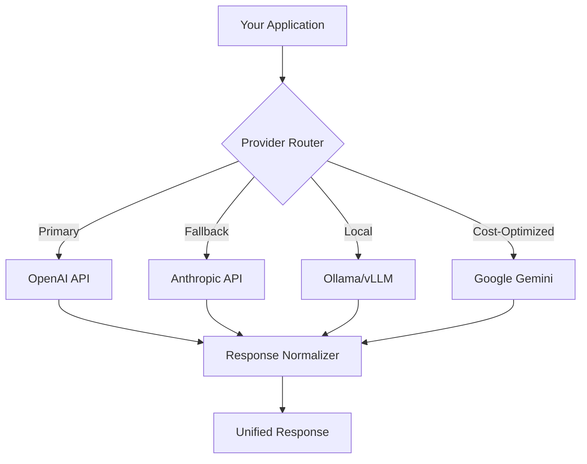

# Multi-Provider Integration

## Introduction

Building applications that work across multiple AI providers increases reliability, enables cost optimization, and prevents vendor lock-in. This lesson covers abstracting provider-specific code, implementing fallback strategies, and normalizing responses across different AI APIs.

### What We'll Cover

1. **Provider Abstraction** — Common interfaces and adapter patterns
2. **Switching Strategies** — Dynamic provider selection and routing
3. **Fallback Systems** — Automatic failover and recovery
4. **Response Normalization** — Consistent formats across providers
5. **Feature Parity** — Handling capability differences
6. **OpenAI Compatibility** — Working with OpenAI-compatible endpoints

### Prerequisites

- Experience with at least one AI API (OpenAI or Anthropic)
- Understanding of error handling and retry patterns
- Familiarity with Python classes and interfaces

---

## Lesson Structure

This lesson is organized into six focused topics:

| File | Topic | Description |
|------|-------|-------------|
| [01-provider-abstraction.md](./01-provider-abstraction.md) | Provider Abstraction | Common interface design, adapter pattern |
| [02-provider-switching.md](./02-provider-switching.md) | Switching Strategies | Dynamic selection, cost/quality routing |
| [03-fallback-systems.md](./03-fallback-systems.md) | Fallback Systems | Automatic failover, recovery patterns |
| [04-response-normalization.md](./04-response-normalization.md) | Response Normalization | Consistent formats, field mapping |
| [05-feature-parity.md](./05-feature-parity.md) | Feature Parity | Capability detection, graceful degradation |
| [06-openai-compatibility.md](./06-openai-compatibility.md) | OpenAI Compatibility | Local models, compatible endpoints |

---

## The Multi-Provider Challenge



### Why Multi-Provider?

| Benefit | Description |
|---------|-------------|
| **Reliability** | Fallback when primary provider is down |
| **Cost Optimization** | Route to cheapest capable provider |
| **Quality Selection** | Use best model for specific tasks |
| **Vendor Independence** | Avoid lock-in to single provider |
| **Feature Access** | Access unique capabilities of each provider |

---

## Provider Landscape

### Major AI API Providers

| Provider | Strengths | Best For |
|----------|-----------|----------|
| OpenAI | Ecosystem, function calling | Production apps, tools |
| Anthropic | Long context, reasoning | Analysis, documents |
| Google Gemini | Multimodal, cost | Vision, budget apps |
| Cohere | Embeddings, RAG | Search, retrieval |
| Local (Ollama) | Privacy, no cost | Development, sensitive data |

### API Differences Overview

| Feature | OpenAI | Anthropic | Gemini |
|---------|--------|-----------|--------|
| Message format | `messages[]` | `messages[]` | `contents[]` |
| System prompt | `messages[0]` | `system` param | `system_instruction` |
| Streaming | SSE | SSE | SSE |
| Function calling | `tools[]` | `tools[]` | `function_declarations` |
| Max context | 128K (GPT-4.1) | 200K | 2M |

---

## Quick Start: Basic Multi-Provider Setup

```python
from abc import ABC, abstractmethod
from dataclasses import dataclass
from typing import Optional

@dataclass
class Message:
    """Unified message format."""
    role: str  # "system", "user", "assistant"
    content: str


@dataclass
class CompletionResponse:
    """Unified response format."""
    content: str
    model: str
    provider: str
    input_tokens: int
    output_tokens: int
    finish_reason: str


class AIProvider(ABC):
    """Abstract base class for AI providers."""
    
    @abstractmethod
    def complete(
        self,
        messages: list[Message],
        model: str,
        max_tokens: int = 1000,
        temperature: float = 0.7
    ) -> CompletionResponse:
        """Generate a completion."""
        pass
    
    @abstractmethod
    def is_available(self) -> bool:
        """Check if provider is currently available."""
        pass


class MultiProviderClient:
    """Client that manages multiple AI providers."""
    
    def __init__(self):
        self.providers: dict[str, AIProvider] = {}
        self.primary_provider: Optional[str] = None
    
    def register(self, name: str, provider: AIProvider, primary: bool = False):
        """Register a provider."""
        self.providers[name] = provider
        if primary or self.primary_provider is None:
            self.primary_provider = name
    
    def complete(
        self,
        messages: list[Message],
        model: str = None,
        provider: str = None,
        **kwargs
    ) -> CompletionResponse:
        """Complete using specified or primary provider."""
        
        provider_name = provider or self.primary_provider
        if provider_name not in self.providers:
            raise ValueError(f"Unknown provider: {provider_name}")
        
        return self.providers[provider_name].complete(
            messages=messages,
            model=model or self._default_model(provider_name),
            **kwargs
        )
    
    def _default_model(self, provider: str) -> str:
        """Get default model for provider."""
        defaults = {
            "openai": "gpt-4.1-mini",
            "anthropic": "claude-sonnet-4-20250514",
            "gemini": "gemini-2.0-flash"
        }
        return defaults.get(provider, "default")
```

---

## Key Concepts Preview

### 1. Provider Abstraction
Define common interfaces that all providers implement, enabling swappable backends.

### 2. Switching Strategies  
Route requests based on cost, quality, latency, or task requirements.

### 3. Fallback Systems
Automatically switch to backup providers when primary fails.

### 4. Response Normalization
Transform provider-specific responses into a unified format.

### 5. Feature Parity
Detect and handle differences in provider capabilities gracefully.

### 6. OpenAI Compatibility
Leverage OpenAI-compatible endpoints for local and alternative models.

---

## Summary

Multi-provider integration provides resilience, cost optimization, and flexibility for AI applications. The key components are:

✅ Abstract interfaces for provider-agnostic code  
✅ Smart routing based on requirements  
✅ Automatic failover for reliability  
✅ Normalized responses for consistent handling  
✅ Graceful degradation for missing features

**Next:** [Provider Abstraction](./01-provider-abstraction.md)

---

## Further Reading

- [OpenAI API Documentation](https://platform.openai.com/docs/api-reference) — Primary reference
- [Anthropic API Reference](https://docs.anthropic.com/en/api) — Claude API
- [Google Gemini API](https://ai.google.dev/gemini-api/docs) — Gemini documentation
- [Ollama](https://ollama.ai/) — Local model hosting

<!-- 
Sources Consulted:
- OpenAI API: https://platform.openai.com/docs/api-reference
- Anthropic API: https://docs.anthropic.com/en/api
- Google Gemini: https://ai.google.dev/gemini-api/docs
-->
