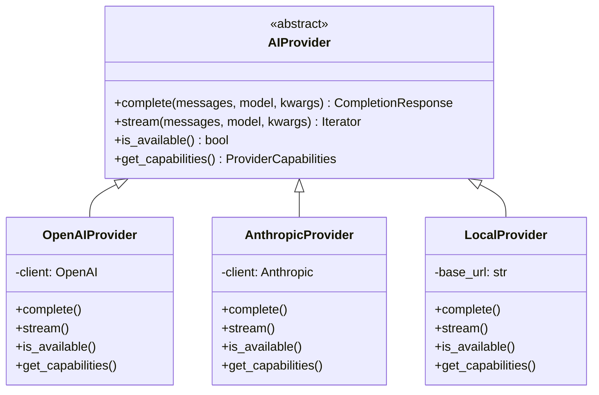

# Provider Abstraction

## Introduction

Provider abstraction creates a unified interface for interacting with multiple AI APIs. This allows your application to switch between providers without changing business logic.

### What We'll Cover

- Common interface design
- Provider adapter pattern
- Configuration-based provider selection
- Plugin architecture

### Prerequisites

- Python classes and inheritance
- Basic API integration experience

---

## Common Interface Design



### Abstract Base Class

```python
from abc import ABC, abstractmethod
from dataclasses import dataclass, field
from typing import Iterator, Optional, Any
from enum import Enum

class FinishReason(Enum):
    STOP = "stop"
    LENGTH = "length"
    TOOL_CALL = "tool_call"
    CONTENT_FILTER = "content_filter"
    ERROR = "error"


@dataclass
class Message:
    """Unified message format across providers."""
    
    role: str  # "system", "user", "assistant", "tool"
    content: str
    name: Optional[str] = None
    tool_calls: Optional[list] = None
    tool_call_id: Optional[str] = None


@dataclass
class Usage:
    """Token usage statistics."""
    
    input_tokens: int
    output_tokens: int
    total_tokens: int
    cached_tokens: int = 0
    
    @property
    def effective_input_tokens(self) -> int:
        """Input tokens minus cached."""
        return self.input_tokens - self.cached_tokens


@dataclass
class CompletionResponse:
    """Unified completion response."""
    
    content: str
    model: str
    provider: str
    usage: Usage
    finish_reason: FinishReason
    raw_response: Optional[Any] = None
    
    @property
    def input_tokens(self) -> int:
        return self.usage.input_tokens
    
    @property
    def output_tokens(self) -> int:
        return self.usage.output_tokens


@dataclass
class StreamChunk:
    """A single chunk from streaming response."""
    
    content: str
    is_final: bool = False
    finish_reason: Optional[FinishReason] = None
    usage: Optional[Usage] = None


@dataclass
class ProviderCapabilities:
    """Capabilities supported by a provider."""
    
    max_context_tokens: int
    supports_streaming: bool = True
    supports_function_calling: bool = True
    supports_vision: bool = False
    supports_audio: bool = False
    supports_structured_output: bool = False
    available_models: list[str] = field(default_factory=list)


class AIProvider(ABC):
    """Abstract base class for AI providers."""
    
    @abstractmethod
    def complete(
        self,
        messages: list[Message],
        model: str,
        max_tokens: int = 1000,
        temperature: float = 0.7,
        **kwargs
    ) -> CompletionResponse:
        """Generate a completion."""
        pass
    
    @abstractmethod
    def stream(
        self,
        messages: list[Message],
        model: str,
        max_tokens: int = 1000,
        temperature: float = 0.7,
        **kwargs
    ) -> Iterator[StreamChunk]:
        """Generate a streaming completion."""
        pass
    
    @abstractmethod
    def is_available(self) -> bool:
        """Check if the provider is currently available."""
        pass
    
    @abstractmethod
    def get_capabilities(self) -> ProviderCapabilities:
        """Get provider capabilities."""
        pass
    
    @property
    @abstractmethod
    def name(self) -> str:
        """Provider name for identification."""
        pass
```

---

## Provider Adapter Pattern

### OpenAI Adapter

```python
from openai import OpenAI
from typing import Iterator

class OpenAIProvider(AIProvider):
    """OpenAI API provider adapter."""
    
    def __init__(self, api_key: str = None, base_url: str = None):
        self.client = OpenAI(api_key=api_key, base_url=base_url)
        self._base_url = base_url
    
    @property
    def name(self) -> str:
        return "openai"
    
    def complete(
        self,
        messages: list[Message],
        model: str = "gpt-4.1-mini",
        max_tokens: int = 1000,
        temperature: float = 0.7,
        **kwargs
    ) -> CompletionResponse:
        """Generate completion using OpenAI API."""
        
        # Convert to OpenAI format
        openai_messages = self._convert_messages(messages)
        
        response = self.client.chat.completions.create(
            model=model,
            messages=openai_messages,
            max_tokens=max_tokens,
            temperature=temperature,
            **kwargs
        )
        
        return self._convert_response(response)
    
    def stream(
        self,
        messages: list[Message],
        model: str = "gpt-4.1-mini",
        max_tokens: int = 1000,
        temperature: float = 0.7,
        **kwargs
    ) -> Iterator[StreamChunk]:
        """Stream completion from OpenAI API."""
        
        openai_messages = self._convert_messages(messages)
        
        stream = self.client.chat.completions.create(
            model=model,
            messages=openai_messages,
            max_tokens=max_tokens,
            temperature=temperature,
            stream=True,
            stream_options={"include_usage": True},
            **kwargs
        )
        
        for chunk in stream:
            if chunk.choices and chunk.choices[0].delta.content:
                yield StreamChunk(
                    content=chunk.choices[0].delta.content,
                    is_final=False
                )
            
            # Final chunk with usage
            if chunk.usage:
                yield StreamChunk(
                    content="",
                    is_final=True,
                    finish_reason=FinishReason.STOP,
                    usage=Usage(
                        input_tokens=chunk.usage.prompt_tokens,
                        output_tokens=chunk.usage.completion_tokens,
                        total_tokens=chunk.usage.total_tokens
                    )
                )
    
    def is_available(self) -> bool:
        """Check OpenAI availability."""
        try:
            # Simple models list call
            self.client.models.list()
            return True
        except Exception:
            return False
    
    def get_capabilities(self) -> ProviderCapabilities:
        """Get OpenAI capabilities."""
        return ProviderCapabilities(
            max_context_tokens=128000,
            supports_streaming=True,
            supports_function_calling=True,
            supports_vision=True,
            supports_audio=True,
            supports_structured_output=True,
            available_models=[
                "gpt-4.1", "gpt-4.1-mini", "gpt-4.1-nano",
                "gpt-4o", "gpt-4o-mini", "o3", "o4-mini"
            ]
        )
    
    def _convert_messages(self, messages: list[Message]) -> list[dict]:
        """Convert unified messages to OpenAI format."""
        result = []
        for msg in messages:
            openai_msg = {"role": msg.role, "content": msg.content}
            if msg.name:
                openai_msg["name"] = msg.name
            if msg.tool_calls:
                openai_msg["tool_calls"] = msg.tool_calls
            if msg.tool_call_id:
                openai_msg["tool_call_id"] = msg.tool_call_id
            result.append(openai_msg)
        return result
    
    def _convert_response(self, response) -> CompletionResponse:
        """Convert OpenAI response to unified format."""
        choice = response.choices[0]
        
        # Map finish reason
        finish_map = {
            "stop": FinishReason.STOP,
            "length": FinishReason.LENGTH,
            "tool_calls": FinishReason.TOOL_CALL,
            "content_filter": FinishReason.CONTENT_FILTER
        }
        finish_reason = finish_map.get(choice.finish_reason, FinishReason.STOP)
        
        return CompletionResponse(
            content=choice.message.content or "",
            model=response.model,
            provider=self.name,
            usage=Usage(
                input_tokens=response.usage.prompt_tokens,
                output_tokens=response.usage.completion_tokens,
                total_tokens=response.usage.total_tokens,
                cached_tokens=getattr(
                    response.usage.prompt_tokens_details, 
                    'cached_tokens', 0
                ) if response.usage.prompt_tokens_details else 0
            ),
            finish_reason=finish_reason,
            raw_response=response
        )
```

### Anthropic Adapter

```python
import anthropic
from typing import Iterator

class AnthropicProvider(AIProvider):
    """Anthropic Claude API provider adapter."""
    
    def __init__(self, api_key: str = None):
        self.client = anthropic.Anthropic(api_key=api_key)
    
    @property
    def name(self) -> str:
        return "anthropic"
    
    def complete(
        self,
        messages: list[Message],
        model: str = "claude-sonnet-4-20250514",
        max_tokens: int = 1000,
        temperature: float = 0.7,
        **kwargs
    ) -> CompletionResponse:
        """Generate completion using Anthropic API."""
        
        # Extract system message
        system_content, conversation = self._extract_system(messages)
        
        response = self.client.messages.create(
            model=model,
            max_tokens=max_tokens,
            temperature=temperature,
            system=system_content,
            messages=self._convert_messages(conversation),
            **kwargs
        )
        
        return self._convert_response(response)
    
    def stream(
        self,
        messages: list[Message],
        model: str = "claude-sonnet-4-20250514",
        max_tokens: int = 1000,
        temperature: float = 0.7,
        **kwargs
    ) -> Iterator[StreamChunk]:
        """Stream completion from Anthropic API."""
        
        system_content, conversation = self._extract_system(messages)
        
        with self.client.messages.stream(
            model=model,
            max_tokens=max_tokens,
            temperature=temperature,
            system=system_content,
            messages=self._convert_messages(conversation),
            **kwargs
        ) as stream:
            for text in stream.text_stream:
                yield StreamChunk(content=text, is_final=False)
            
            # Get final message for usage
            final_message = stream.get_final_message()
            yield StreamChunk(
                content="",
                is_final=True,
                finish_reason=FinishReason.STOP,
                usage=Usage(
                    input_tokens=final_message.usage.input_tokens,
                    output_tokens=final_message.usage.output_tokens,
                    total_tokens=(
                        final_message.usage.input_tokens + 
                        final_message.usage.output_tokens
                    )
                )
            )
    
    def is_available(self) -> bool:
        """Check Anthropic availability."""
        try:
            self.client.messages.create(
                model="claude-sonnet-4-20250514",
                max_tokens=1,
                messages=[{"role": "user", "content": "hi"}]
            )
            return True
        except Exception:
            return False
    
    def get_capabilities(self) -> ProviderCapabilities:
        """Get Anthropic capabilities."""
        return ProviderCapabilities(
            max_context_tokens=200000,
            supports_streaming=True,
            supports_function_calling=True,
            supports_vision=True,
            supports_audio=False,
            supports_structured_output=False,
            available_models=[
                "claude-opus-4-20250514",
                "claude-sonnet-4-20250514", 
                "claude-3-5-haiku-20241022"
            ]
        )
    
    def _extract_system(self, messages: list[Message]) -> tuple[str, list[Message]]:
        """Extract system message from conversation."""
        system_content = ""
        conversation = []
        
        for msg in messages:
            if msg.role == "system":
                system_content = msg.content
            else:
                conversation.append(msg)
        
        return system_content, conversation
    
    def _convert_messages(self, messages: list[Message]) -> list[dict]:
        """Convert unified messages to Anthropic format."""
        return [
            {"role": msg.role, "content": msg.content}
            for msg in messages
        ]
    
    def _convert_response(self, response) -> CompletionResponse:
        """Convert Anthropic response to unified format."""
        
        # Map stop reason
        finish_map = {
            "end_turn": FinishReason.STOP,
            "max_tokens": FinishReason.LENGTH,
            "tool_use": FinishReason.TOOL_CALL
        }
        finish_reason = finish_map.get(response.stop_reason, FinishReason.STOP)
        
        # Extract text content
        content = ""
        for block in response.content:
            if block.type == "text":
                content = block.text
                break
        
        return CompletionResponse(
            content=content,
            model=response.model,
            provider=self.name,
            usage=Usage(
                input_tokens=response.usage.input_tokens,
                output_tokens=response.usage.output_tokens,
                total_tokens=response.usage.input_tokens + response.usage.output_tokens,
                cached_tokens=getattr(response.usage, 'cache_read_input_tokens', 0)
            ),
            finish_reason=finish_reason,
            raw_response=response
        )
```

---

## Configuration-Based Provider Selection

```python
from dataclasses import dataclass, field
from typing import Optional, Type
import os

@dataclass
class ProviderConfig:
    """Configuration for a single provider."""
    
    provider_class: Type[AIProvider]
    api_key_env: str
    enabled: bool = True
    priority: int = 1
    default_model: str = ""
    kwargs: dict = field(default_factory=dict)


class ProviderRegistry:
    """Registry for managing provider configurations."""
    
    # Built-in provider configs
    BUILTIN_CONFIGS = {
        "openai": ProviderConfig(
            provider_class=OpenAIProvider,
            api_key_env="OPENAI_API_KEY",
            priority=1,
            default_model="gpt-4.1-mini"
        ),
        "anthropic": ProviderConfig(
            provider_class=AnthropicProvider,
            api_key_env="ANTHROPIC_API_KEY",
            priority=2,
            default_model="claude-sonnet-4-20250514"
        )
    }
    
    def __init__(self, config: dict = None):
        self.configs = {}
        self.instances: dict[str, AIProvider] = {}
        
        # Load built-in configs
        for name, cfg in self.BUILTIN_CONFIGS.items():
            self.configs[name] = cfg
        
        # Override with user config
        if config:
            self._apply_config(config)
    
    def _apply_config(self, config: dict):
        """Apply user configuration overrides."""
        for name, settings in config.items():
            if name in self.configs:
                cfg = self.configs[name]
                if "enabled" in settings:
                    cfg.enabled = settings["enabled"]
                if "priority" in settings:
                    cfg.priority = settings["priority"]
                if "default_model" in settings:
                    cfg.default_model = settings["default_model"]
                if "kwargs" in settings:
                    cfg.kwargs.update(settings["kwargs"])
    
    def get_provider(self, name: str) -> Optional[AIProvider]:
        """Get a provider instance by name."""
        
        if name not in self.configs:
            return None
        
        config = self.configs[name]
        
        if not config.enabled:
            return None
        
        # Return cached instance
        if name in self.instances:
            return self.instances[name]
        
        # Get API key from environment
        api_key = os.getenv(config.api_key_env)
        if not api_key:
            return None
        
        # Create instance
        try:
            instance = config.provider_class(api_key=api_key, **config.kwargs)
            self.instances[name] = instance
            return instance
        except Exception as e:
            print(f"Failed to create provider {name}: {e}")
            return None
    
    def get_available_providers(self) -> list[tuple[str, AIProvider]]:
        """Get all available providers sorted by priority."""
        
        available = []
        
        for name, config in self.configs.items():
            if not config.enabled:
                continue
            
            provider = self.get_provider(name)
            if provider and provider.is_available():
                available.append((name, provider, config.priority))
        
        # Sort by priority
        available.sort(key=lambda x: x[2])
        
        return [(name, provider) for name, provider, _ in available]
    
    def get_primary_provider(self) -> Optional[tuple[str, AIProvider]]:
        """Get the highest priority available provider."""
        
        available = self.get_available_providers()
        return available[0] if available else None


# Usage
registry = ProviderRegistry({
    "openai": {"priority": 1, "default_model": "gpt-4.1-mini"},
    "anthropic": {"priority": 2, "enabled": True}
})

# Get primary provider
primary = registry.get_primary_provider()
if primary:
    name, provider = primary
    print(f"Primary provider: {name}")
```

---

## Plugin Architecture

```python
from typing import Callable, Type
from abc import ABC

class ProviderPlugin(ABC):
    """Base class for provider plugins."""
    
    @classmethod
    @abstractmethod
    def provider_class(cls) -> Type[AIProvider]:
        """Return the provider class."""
        pass
    
    @classmethod
    @abstractmethod
    def provider_name(cls) -> str:
        """Return the provider name."""
        pass
    
    @classmethod
    def default_config(cls) -> ProviderConfig:
        """Return default configuration."""
        return ProviderConfig(
            provider_class=cls.provider_class(),
            api_key_env=f"{cls.provider_name().upper()}_API_KEY",
            enabled=True,
            priority=99
        )


class PluginManager:
    """Manage provider plugins."""
    
    def __init__(self):
        self._plugins: dict[str, ProviderPlugin] = {}
        self._registry: Optional[ProviderRegistry] = None
    
    def register_plugin(self, plugin: Type[ProviderPlugin]):
        """Register a provider plugin."""
        name = plugin.provider_name()
        self._plugins[name] = plugin
        
        # Update registry if exists
        if self._registry:
            self._registry.configs[name] = plugin.default_config()
    
    def create_registry(self, user_config: dict = None) -> ProviderRegistry:
        """Create a registry with all registered plugins."""
        
        # Build config from plugins
        plugin_configs = {
            name: plugin.default_config()
            for name, plugin in self._plugins.items()
        }
        
        # Merge with built-in
        all_configs = {**ProviderRegistry.BUILTIN_CONFIGS, **plugin_configs}
        
        self._registry = ProviderRegistry.__new__(ProviderRegistry)
        self._registry.configs = all_configs
        self._registry.instances = {}
        
        if user_config:
            self._registry._apply_config(user_config)
        
        return self._registry


# Example custom plugin
class GeminiProvider(AIProvider):
    """Google Gemini provider (simplified)."""
    
    def __init__(self, api_key: str = None, **kwargs):
        # Initialize Gemini client
        self.api_key = api_key
    
    @property
    def name(self) -> str:
        return "gemini"
    
    def complete(self, messages, model="gemini-2.0-flash", **kwargs):
        # Implementation would go here
        pass
    
    def stream(self, messages, model="gemini-2.0-flash", **kwargs):
        pass
    
    def is_available(self) -> bool:
        return bool(self.api_key)
    
    def get_capabilities(self) -> ProviderCapabilities:
        return ProviderCapabilities(
            max_context_tokens=2000000,
            supports_vision=True
        )


class GeminiPlugin(ProviderPlugin):
    """Plugin for Google Gemini."""
    
    @classmethod
    def provider_class(cls) -> Type[AIProvider]:
        return GeminiProvider
    
    @classmethod
    def provider_name(cls) -> str:
        return "gemini"


# Usage
plugin_manager = PluginManager()
plugin_manager.register_plugin(GeminiPlugin)

registry = plugin_manager.create_registry()
```

---

## Unified Client

```python
class UnifiedAIClient:
    """Client that provides unified access to multiple providers."""
    
    def __init__(self, registry: ProviderRegistry = None):
        self.registry = registry or ProviderRegistry()
        self._default_provider: Optional[str] = None
    
    def set_default_provider(self, name: str):
        """Set the default provider."""
        if self.registry.get_provider(name):
            self._default_provider = name
        else:
            raise ValueError(f"Provider not available: {name}")
    
    def complete(
        self,
        messages: list[Message],
        model: str = None,
        provider: str = None,
        **kwargs
    ) -> CompletionResponse:
        """Generate a completion."""
        
        # Determine provider
        provider_name = provider or self._default_provider
        
        if provider_name:
            provider_instance = self.registry.get_provider(provider_name)
            if not provider_instance:
                raise ValueError(f"Provider not available: {provider_name}")
        else:
            # Use primary
            result = self.registry.get_primary_provider()
            if not result:
                raise RuntimeError("No providers available")
            provider_name, provider_instance = result
        
        # Get default model if not specified
        if not model:
            config = self.registry.configs.get(provider_name)
            model = config.default_model if config else None
        
        return provider_instance.complete(
            messages=messages,
            model=model,
            **kwargs
        )
    
    def stream(
        self,
        messages: list[Message],
        model: str = None,
        provider: str = None,
        **kwargs
    ) -> Iterator[StreamChunk]:
        """Generate a streaming completion."""
        
        provider_name = provider or self._default_provider
        
        if provider_name:
            provider_instance = self.registry.get_provider(provider_name)
        else:
            result = self.registry.get_primary_provider()
            if not result:
                raise RuntimeError("No providers available")
            provider_name, provider_instance = result
        
        if not model:
            config = self.registry.configs.get(provider_name)
            model = config.default_model if config else None
        
        yield from provider_instance.stream(
            messages=messages,
            model=model,
            **kwargs
        )


# Usage example
client = UnifiedAIClient()

# Simple completion
response = client.complete(
    messages=[
        Message(role="user", content="Hello!")
    ],
    provider="openai",
    model="gpt-4.1-mini"
)

print(f"Provider: {response.provider}")
print(f"Response: {response.content}")
print(f"Tokens: {response.usage.total_tokens}")
```

---

## Hands-on Exercise

### Your Task

Extend the provider abstraction to support a local Ollama instance.

### Requirements

1. Create `OllamaProvider` class
2. Implement complete and stream methods
3. Handle connection to local endpoint
4. Register with the provider registry

### Expected Result

```python
# Add Ollama provider
registry = ProviderRegistry()
client = UnifiedAIClient(registry)

# Use local model
response = client.complete(
    messages=[Message(role="user", content="Hello!")],
    provider="ollama",
    model="llama2"
)

print(f"Local response: {response.content}")
```

<details>
<summary>💡 Hints</summary>

- Ollama uses OpenAI-compatible API at `http://localhost:11434/v1`
- You can extend OpenAIProvider with a custom base_url
- Check availability by calling the Ollama health endpoint
</details>

<details>
<summary>✅ Solution</summary>

```python
import requests

class OllamaProvider(AIProvider):
    """Provider for local Ollama instance."""
    
    def __init__(
        self,
        base_url: str = "http://localhost:11434",
        **kwargs
    ):
        self.base_url = base_url
        # Use OpenAI-compatible endpoint
        self.openai_url = f"{base_url}/v1"
        
        # Create OpenAI client with custom base URL
        from openai import OpenAI
        self.client = OpenAI(
            api_key="ollama",  # Not used but required
            base_url=self.openai_url
        )
    
    @property
    def name(self) -> str:
        return "ollama"
    
    def complete(
        self,
        messages: list[Message],
        model: str = "llama3.2",
        max_tokens: int = 1000,
        temperature: float = 0.7,
        **kwargs
    ) -> CompletionResponse:
        """Generate completion using Ollama."""
        
        openai_messages = [
            {"role": msg.role, "content": msg.content}
            for msg in messages
        ]
        
        response = self.client.chat.completions.create(
            model=model,
            messages=openai_messages,
            max_tokens=max_tokens,
            temperature=temperature,
            **kwargs
        )
        
        choice = response.choices[0]
        
        return CompletionResponse(
            content=choice.message.content or "",
            model=model,
            provider=self.name,
            usage=Usage(
                input_tokens=response.usage.prompt_tokens if response.usage else 0,
                output_tokens=response.usage.completion_tokens if response.usage else 0,
                total_tokens=response.usage.total_tokens if response.usage else 0
            ),
            finish_reason=FinishReason.STOP,
            raw_response=response
        )
    
    def stream(
        self,
        messages: list[Message],
        model: str = "llama3.2",
        max_tokens: int = 1000,
        temperature: float = 0.7,
        **kwargs
    ) -> Iterator[StreamChunk]:
        """Stream completion from Ollama."""
        
        openai_messages = [
            {"role": msg.role, "content": msg.content}
            for msg in messages
        ]
        
        stream = self.client.chat.completions.create(
            model=model,
            messages=openai_messages,
            max_tokens=max_tokens,
            temperature=temperature,
            stream=True,
            **kwargs
        )
        
        for chunk in stream:
            if chunk.choices and chunk.choices[0].delta.content:
                yield StreamChunk(
                    content=chunk.choices[0].delta.content,
                    is_final=False
                )
        
        yield StreamChunk(content="", is_final=True, finish_reason=FinishReason.STOP)
    
    def is_available(self) -> bool:
        """Check if Ollama is running."""
        try:
            response = requests.get(f"{self.base_url}/api/tags", timeout=2)
            return response.status_code == 200
        except Exception:
            return False
    
    def get_capabilities(self) -> ProviderCapabilities:
        """Get Ollama capabilities."""
        
        available_models = []
        try:
            response = requests.get(f"{self.base_url}/api/tags")
            if response.status_code == 200:
                data = response.json()
                available_models = [m["name"] for m in data.get("models", [])]
        except Exception:
            pass
        
        return ProviderCapabilities(
            max_context_tokens=32768,  # Varies by model
            supports_streaming=True,
            supports_function_calling=False,  # Limited support
            supports_vision=False,  # Some models support
            available_models=available_models
        )


# Register with configuration
BUILTIN_CONFIGS = {
    # ... existing configs ...
    "ollama": ProviderConfig(
        provider_class=OllamaProvider,
        api_key_env="",  # No API key needed
        enabled=True,
        priority=10,  # Lower priority than cloud
        default_model="llama3.2",
        kwargs={"base_url": "http://localhost:11434"}
    )
}

# Test
provider = OllamaProvider()
if provider.is_available():
    response = provider.complete(
        messages=[Message(role="user", content="Hello!")],
        model="llama3.2"
    )
    print(f"Ollama response: {response.content}")
else:
    print("Ollama not running")
```

</details>

---

## Summary

✅ Define abstract interfaces for provider-agnostic code  
✅ Create adapters that translate between unified and provider formats  
✅ Use configuration-based selection for flexibility  
✅ Build plugin architecture for extensibility  
✅ Unified client simplifies multi-provider usage

**Next:** [Provider Switching](./02-provider-switching.md)

---

## Further Reading

- [OpenAI Python SDK](https://github.com/openai/openai-python) — Official client
- [Anthropic Python SDK](https://github.com/anthropics/anthropic-sdk-python) — Claude client
- [Adapter Pattern](https://refactoring.guru/design-patterns/adapter) — Design pattern reference

<!-- 
Sources Consulted:
- OpenAI SDK: https://github.com/openai/openai-python
- Anthropic SDK: https://github.com/anthropics/anthropic-sdk-python
- Ollama API: https://github.com/ollama/ollama/blob/main/docs/api.md
-->
