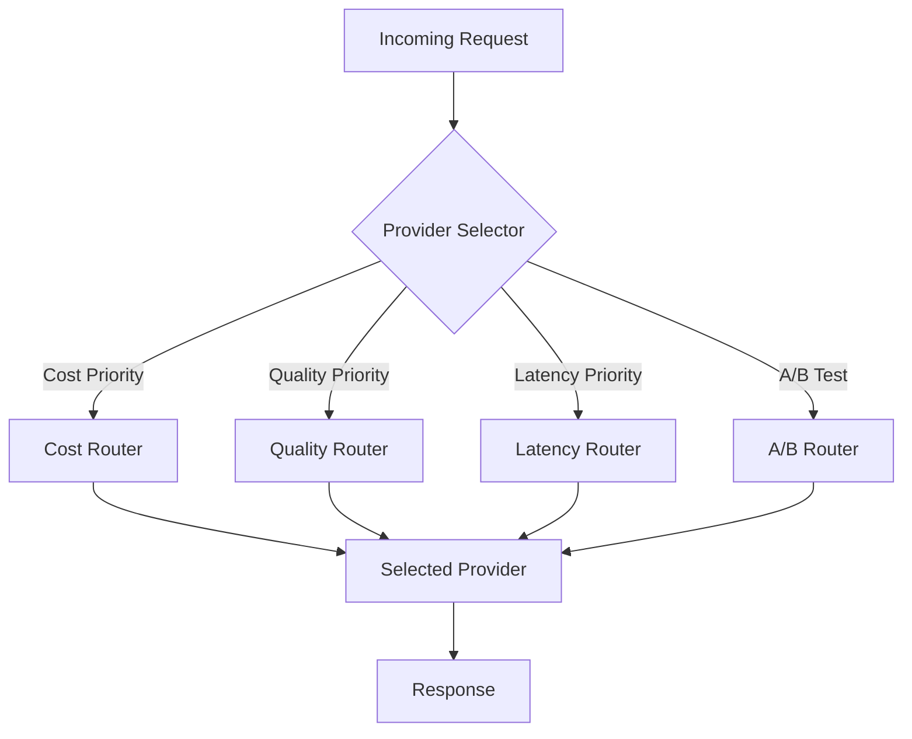

# Provider Switching Strategies

## Introduction

Dynamic provider selection optimizes for cost, quality, latency, or reliability based on request requirements. This lesson covers routing strategies and implementation patterns.

### What We'll Cover

- Dynamic provider selection
- A/B testing across providers
- Cost-based routing
- Quality-based routing
- Latency-based routing

### Prerequisites

- Provider abstraction concepts
- Basic metrics collection

---

## Provider Selection Architecture



---

## Routing Strategy Interface

```python
from abc import ABC, abstractmethod
from dataclasses import dataclass, field
from typing import Optional
from enum import Enum

class RoutingPriority(Enum):
    COST = "cost"
    QUALITY = "quality"
    LATENCY = "latency"
    RELIABILITY = "reliability"
    BALANCED = "balanced"


@dataclass
class RoutingContext:
    """Context for routing decisions."""
    
    messages: list  # The messages to send
    task_type: Optional[str] = None  # e.g., "summarization", "code", "chat"
    max_tokens: int = 1000
    required_features: list[str] = field(default_factory=list)
    budget_remaining: Optional[float] = None
    priority: RoutingPriority = RoutingPriority.BALANCED
    user_tier: str = "standard"
    
    # Computed from messages
    @property
    def estimated_input_tokens(self) -> int:
        """Estimate input tokens from messages."""
        # Simple word-based estimation
        total_chars = sum(len(m.content) for m in self.messages)
        return total_chars // 4  # Rough approximation


@dataclass
class RoutingDecision:
    """Result of a routing decision."""
    
    provider_name: str
    model: str
    reason: str
    estimated_cost: Optional[float] = None
    estimated_latency_ms: Optional[int] = None
    confidence: float = 1.0


class RoutingStrategy(ABC):
    """Abstract base for routing strategies."""
    
    @abstractmethod
    def select(
        self,
        context: RoutingContext,
        available_providers: list[tuple[str, 'AIProvider']]
    ) -> RoutingDecision:
        """Select a provider based on strategy."""
        pass
    
    @property
    @abstractmethod
    def name(self) -> str:
        """Strategy name."""
        pass
```

---

## Cost-Based Routing

```python
from dataclasses import dataclass

@dataclass
class ModelPricing:
    """Pricing information for a model."""
    
    provider: str
    model: str
    input_price_per_1k: float
    output_price_per_1k: float
    context_limit: int = 128000
    
    def estimate_cost(self, input_tokens: int, output_tokens: int) -> float:
        """Estimate total cost."""
        input_cost = (input_tokens / 1000) * self.input_price_per_1k
        output_cost = (output_tokens / 1000) * self.output_price_per_1k
        return input_cost + output_cost


class CostBasedRouter(RoutingStrategy):
    """Route to cheapest capable provider."""
    
    PRICING = [
        ModelPricing("openai", "gpt-4.1-nano", 0.0001, 0.0004, 128000),
        ModelPricing("openai", "gpt-4.1-mini", 0.0004, 0.0016, 128000),
        ModelPricing("openai", "gpt-4.1", 0.002, 0.008, 128000),
        ModelPricing("anthropic", "claude-3-5-haiku-20241022", 0.0008, 0.004, 200000),
        ModelPricing("anthropic", "claude-sonnet-4-20250514", 0.003, 0.015, 200000),
        ModelPricing("gemini", "gemini-2.0-flash", 0.0001, 0.0004, 1000000),
    ]
    
    def __init__(self, quality_threshold: str = "standard"):
        """
        Initialize with quality threshold.
        
        quality_threshold: "basic", "standard", "high", "premium"
        """
        self.quality_threshold = quality_threshold
        
        # Models meeting each quality level
        self.quality_levels = {
            "basic": ["gpt-4.1-nano", "gemini-2.0-flash"],
            "standard": ["gpt-4.1-mini", "claude-3-5-haiku-20241022", "gemini-2.0-flash"],
            "high": ["gpt-4.1", "claude-sonnet-4-20250514"],
            "premium": ["claude-opus-4-20250514", "o3"]
        }
    
    @property
    def name(self) -> str:
        return "cost_based"
    
    def select(
        self,
        context: RoutingContext,
        available_providers: list[tuple[str, 'AIProvider']]
    ) -> RoutingDecision:
        """Select cheapest provider meeting quality threshold."""
        
        available_names = {name for name, _ in available_providers}
        
        # Get acceptable models for quality level
        acceptable_models = set()
        for level in self.quality_levels:
            acceptable_models.update(self.quality_levels[level])
            if level == self.quality_threshold:
                break
        
        # Find cheapest available option
        candidates = []
        
        for pricing in self.PRICING:
            if pricing.provider not in available_names:
                continue
            if pricing.model not in acceptable_models:
                continue
            
            # Check context fits
            if context.estimated_input_tokens > pricing.context_limit:
                continue
            
            estimated_cost = pricing.estimate_cost(
                context.estimated_input_tokens,
                context.max_tokens
            )
            
            candidates.append((pricing, estimated_cost))
        
        if not candidates:
            # Fallback to first available
            provider_name, _ = available_providers[0]
            return RoutingDecision(
                provider_name=provider_name,
                model="default",
                reason="No matching providers, using fallback"
            )
        
        # Sort by cost
        candidates.sort(key=lambda x: x[1])
        best_pricing, best_cost = candidates[0]
        
        return RoutingDecision(
            provider_name=best_pricing.provider,
            model=best_pricing.model,
            reason=f"Cheapest at ${best_cost:.6f} estimated",
            estimated_cost=best_cost
        )


# Usage
router = CostBasedRouter(quality_threshold="standard")

context = RoutingContext(
    messages=[Message(role="user", content="Summarize this text...")],
    max_tokens=500
)

# Assume we have available providers
available = [("openai", openai_provider), ("anthropic", anthropic_provider)]

decision = router.select(context, available)
print(f"Selected: {decision.provider_name}/{decision.model}")
print(f"Reason: {decision.reason}")
print(f"Estimated cost: ${decision.estimated_cost:.6f}")
```

---

## Quality-Based Routing

```python
from dataclasses import dataclass
from enum import Enum

class TaskType(Enum):
    CHAT = "chat"
    SUMMARIZATION = "summarization"
    CODE = "code"
    REASONING = "reasoning"
    CREATIVE = "creative"
    ANALYSIS = "analysis"


@dataclass
class ModelQuality:
    """Quality ratings for a model on different tasks."""
    
    provider: str
    model: str
    task_scores: dict[TaskType, float]  # 0.0 to 1.0
    
    def score_for_task(self, task: TaskType) -> float:
        return self.task_scores.get(task, 0.5)


class QualityBasedRouter(RoutingStrategy):
    """Route based on model quality for specific tasks."""
    
    QUALITY_RATINGS = [
        ModelQuality("openai", "gpt-4.1", {
            TaskType.CHAT: 0.9,
            TaskType.CODE: 0.95,
            TaskType.REASONING: 0.9,
            TaskType.CREATIVE: 0.85,
            TaskType.ANALYSIS: 0.9,
            TaskType.SUMMARIZATION: 0.85
        }),
        ModelQuality("openai", "gpt-4.1-mini", {
            TaskType.CHAT: 0.8,
            TaskType.CODE: 0.8,
            TaskType.REASONING: 0.75,
            TaskType.CREATIVE: 0.75,
            TaskType.ANALYSIS: 0.75,
            TaskType.SUMMARIZATION: 0.8
        }),
        ModelQuality("anthropic", "claude-sonnet-4-20250514", {
            TaskType.CHAT: 0.9,
            TaskType.CODE: 0.9,
            TaskType.REASONING: 0.95,
            TaskType.CREATIVE: 0.9,
            TaskType.ANALYSIS: 0.95,
            TaskType.SUMMARIZATION: 0.9
        }),
        ModelQuality("anthropic", "claude-3-5-haiku-20241022", {
            TaskType.CHAT: 0.75,
            TaskType.CODE: 0.75,
            TaskType.REASONING: 0.7,
            TaskType.CREATIVE: 0.7,
            TaskType.ANALYSIS: 0.7,
            TaskType.SUMMARIZATION: 0.75
        }),
        ModelQuality("openai", "o3", {
            TaskType.CHAT: 0.8,
            TaskType.CODE: 0.98,
            TaskType.REASONING: 0.99,
            TaskType.CREATIVE: 0.7,
            TaskType.ANALYSIS: 0.98,
            TaskType.SUMMARIZATION: 0.8
        }),
    ]
    
    def __init__(self, min_quality: float = 0.8):
        self.min_quality = min_quality
    
    @property
    def name(self) -> str:
        return "quality_based"
    
    def _infer_task_type(self, context: RoutingContext) -> TaskType:
        """Infer task type from context."""
        
        if context.task_type:
            try:
                return TaskType(context.task_type)
            except ValueError:
                pass
        
        # Infer from message content
        if context.messages:
            content = context.messages[-1].content.lower()
            
            if any(w in content for w in ["code", "function", "implement", "debug"]):
                return TaskType.CODE
            if any(w in content for w in ["summarize", "tldr", "brief"]):
                return TaskType.SUMMARIZATION
            if any(w in content for w in ["analyze", "evaluate", "compare"]):
                return TaskType.ANALYSIS
            if any(w in content for w in ["think", "reason", "solve", "math"]):
                return TaskType.REASONING
            if any(w in content for w in ["write", "story", "creative"]):
                return TaskType.CREATIVE
        
        return TaskType.CHAT
    
    def select(
        self,
        context: RoutingContext,
        available_providers: list[tuple[str, 'AIProvider']]
    ) -> RoutingDecision:
        """Select highest quality provider for task."""
        
        task_type = self._infer_task_type(context)
        available_names = {name for name, _ in available_providers}
        
        # Find best quality model
        candidates = []
        
        for quality in self.QUALITY_RATINGS:
            if quality.provider not in available_names:
                continue
            
            score = quality.score_for_task(task_type)
            if score >= self.min_quality:
                candidates.append((quality, score))
        
        if not candidates:
            # Lower threshold
            for quality in self.QUALITY_RATINGS:
                if quality.provider in available_names:
                    candidates.append((quality, quality.score_for_task(task_type)))
        
        # Sort by score descending
        candidates.sort(key=lambda x: x[1], reverse=True)
        best_quality, best_score = candidates[0]
        
        return RoutingDecision(
            provider_name=best_quality.provider,
            model=best_quality.model,
            reason=f"Best for {task_type.value} (score: {best_score:.2f})",
            confidence=best_score
        )


# Usage
router = QualityBasedRouter(min_quality=0.85)

context = RoutingContext(
    messages=[Message(role="user", content="Write a Python function to sort a list")],
    task_type="code"
)

decision = router.select(context, available)
print(f"Selected: {decision.provider_name}/{decision.model}")
print(f"Reason: {decision.reason}")
```

---

## Latency-Based Routing

```python
from dataclasses import dataclass, field
from datetime import datetime, timedelta
from collections import defaultdict
import statistics

@dataclass
class LatencyRecord:
    """Record of response latency."""
    
    provider: str
    model: str
    latency_ms: int
    timestamp: datetime
    input_tokens: int
    output_tokens: int


class LatencyTracker:
    """Track latency across providers."""
    
    def __init__(self, window_minutes: int = 30):
        self.records: list[LatencyRecord] = []
        self.window = timedelta(minutes=window_minutes)
    
    def record(
        self,
        provider: str,
        model: str,
        latency_ms: int,
        input_tokens: int,
        output_tokens: int
    ):
        """Record a latency measurement."""
        self.records.append(LatencyRecord(
            provider=provider,
            model=model,
            latency_ms=latency_ms,
            timestamp=datetime.now(),
            input_tokens=input_tokens,
            output_tokens=output_tokens
        ))
        
        # Cleanup old records
        cutoff = datetime.now() - self.window
        self.records = [r for r in self.records if r.timestamp > cutoff]
    
    def get_stats(self, provider: str, model: str = None) -> dict:
        """Get latency statistics for a provider/model."""
        
        cutoff = datetime.now() - self.window
        relevant = [
            r for r in self.records
            if r.provider == provider and r.timestamp > cutoff
            and (model is None or r.model == model)
        ]
        
        if not relevant:
            return {
                "count": 0,
                "avg_ms": None,
                "p50_ms": None,
                "p95_ms": None
            }
        
        latencies = [r.latency_ms for r in relevant]
        
        return {
            "count": len(latencies),
            "avg_ms": statistics.mean(latencies),
            "p50_ms": statistics.median(latencies),
            "p95_ms": statistics.quantiles(latencies, n=20)[18] if len(latencies) >= 20 else max(latencies),
            "min_ms": min(latencies),
            "max_ms": max(latencies)
        }


class LatencyBasedRouter(RoutingStrategy):
    """Route to provider with lowest latency."""
    
    # Baseline estimates when no data
    BASELINE_LATENCY = {
        ("openai", "gpt-4.1-mini"): 500,
        ("openai", "gpt-4.1"): 800,
        ("openai", "gpt-4.1-nano"): 300,
        ("anthropic", "claude-sonnet-4-20250514"): 600,
        ("anthropic", "claude-3-5-haiku-20241022"): 400,
        ("ollama", "llama3.2"): 200,  # Local is fast
    }
    
    def __init__(self, tracker: LatencyTracker = None, max_latency_ms: int = None):
        self.tracker = tracker or LatencyTracker()
        self.max_latency_ms = max_latency_ms
    
    @property
    def name(self) -> str:
        return "latency_based"
    
    def select(
        self,
        context: RoutingContext,
        available_providers: list[tuple[str, 'AIProvider']]
    ) -> RoutingDecision:
        """Select provider with lowest expected latency."""
        
        candidates = []
        
        for provider_name, provider in available_providers:
            caps = provider.get_capabilities()
            
            for model in caps.available_models[:3]:  # Top 3 models
                # Get tracked latency or baseline
                stats = self.tracker.get_stats(provider_name, model)
                
                if stats["count"] >= 5:
                    expected_latency = stats["p50_ms"]
                else:
                    expected_latency = self.BASELINE_LATENCY.get(
                        (provider_name, model),
                        1000  # Default
                    )
                
                # Skip if over max latency
                if self.max_latency_ms and expected_latency > self.max_latency_ms:
                    continue
                
                candidates.append((provider_name, model, expected_latency, stats["count"]))
        
        if not candidates:
            # Fallback
            provider_name, _ = available_providers[0]
            return RoutingDecision(
                provider_name=provider_name,
                model="default",
                reason="No providers meet latency requirements"
            )
        
        # Sort by latency
        candidates.sort(key=lambda x: x[2])
        best_provider, best_model, latency, sample_count = candidates[0]
        
        confidence = min(1.0, sample_count / 20)  # More samples = more confidence
        
        return RoutingDecision(
            provider_name=best_provider,
            model=best_model,
            reason=f"Lowest latency: {latency}ms (n={sample_count})",
            estimated_latency_ms=int(latency),
            confidence=confidence
        )


# Usage with tracking
tracker = LatencyTracker()

# Record some measurements
tracker.record("openai", "gpt-4.1-mini", 450, 100, 200)
tracker.record("openai", "gpt-4.1-mini", 520, 100, 200)
tracker.record("anthropic", "claude-sonnet-4-20250514", 650, 100, 200)

router = LatencyBasedRouter(tracker=tracker, max_latency_ms=1000)

decision = router.select(context, available)
print(f"Selected: {decision.provider_name}/{decision.model}")
print(f"Expected latency: {decision.estimated_latency_ms}ms")
```

---

## A/B Testing Across Providers

```python
import random
from dataclasses import dataclass, field
from datetime import datetime
from typing import Callable

@dataclass
class ABTestConfig:
    """Configuration for an A/B test."""
    
    name: str
    variants: dict[str, dict]  # variant_name -> {provider, model, weight}
    start_time: datetime
    end_time: datetime = None
    enabled: bool = True


@dataclass
class ABTestResult:
    """Result of an A/B test assignment."""
    
    test_name: str
    variant_name: str
    provider: str
    model: str


class ABTestRouter(RoutingStrategy):
    """Route based on A/B test configuration."""
    
    def __init__(self):
        self.tests: dict[str, ABTestConfig] = {}
        self.assignments: dict[str, str] = {}  # user_id -> variant
        self.results: list[dict] = []
    
    @property
    def name(self) -> str:
        return "ab_test"
    
    def create_test(
        self,
        name: str,
        variants: dict[str, dict],
        duration_hours: int = 24
    ) -> ABTestConfig:
        """Create a new A/B test."""
        
        # Validate weights sum to 1
        total_weight = sum(v.get("weight", 0) for v in variants.values())
        if abs(total_weight - 1.0) > 0.01:
            raise ValueError(f"Variant weights must sum to 1, got {total_weight}")
        
        config = ABTestConfig(
            name=name,
            variants=variants,
            start_time=datetime.now(),
            end_time=datetime.now() + timedelta(hours=duration_hours)
        )
        
        self.tests[name] = config
        return config
    
    def assign_variant(self, test_name: str, user_id: str) -> ABTestResult:
        """Assign user to a test variant."""
        
        test = self.tests.get(test_name)
        if not test or not test.enabled:
            raise ValueError(f"Test not found or disabled: {test_name}")
        
        # Check if already assigned
        key = f"{test_name}:{user_id}"
        if key in self.assignments:
            variant_name = self.assignments[key]
        else:
            # Random assignment based on weights
            r = random.random()
            cumulative = 0
            variant_name = list(test.variants.keys())[0]
            
            for name, config in test.variants.items():
                cumulative += config.get("weight", 0)
                if r < cumulative:
                    variant_name = name
                    break
            
            self.assignments[key] = variant_name
        
        variant = test.variants[variant_name]
        
        return ABTestResult(
            test_name=test_name,
            variant_name=variant_name,
            provider=variant["provider"],
            model=variant["model"]
        )
    
    def record_result(
        self,
        test_name: str,
        variant_name: str,
        metrics: dict
    ):
        """Record test result for analysis."""
        self.results.append({
            "test_name": test_name,
            "variant_name": variant_name,
            "timestamp": datetime.now().isoformat(),
            **metrics
        })
    
    def get_stats(self, test_name: str) -> dict:
        """Get statistics for a test."""
        
        test_results = [r for r in self.results if r["test_name"] == test_name]
        
        if not test_results:
            return {"error": "No results yet"}
        
        by_variant = defaultdict(list)
        for r in test_results:
            by_variant[r["variant_name"]].append(r)
        
        stats = {}
        for variant, results in by_variant.items():
            stats[variant] = {
                "count": len(results),
                "avg_latency": statistics.mean([r.get("latency_ms", 0) for r in results]),
                "avg_cost": statistics.mean([r.get("cost", 0) for r in results]),
                "avg_quality": statistics.mean([r.get("quality_score", 0) for r in results]) if any("quality_score" in r for r in results) else None
            }
        
        return stats
    
    def select(
        self,
        context: RoutingContext,
        available_providers: list[tuple[str, 'AIProvider']]
    ) -> RoutingDecision:
        """Select based on active A/B test."""
        
        # Find active test
        now = datetime.now()
        active_tests = [
            t for t in self.tests.values()
            if t.enabled and t.start_time <= now and (t.end_time is None or now < t.end_time)
        ]
        
        if not active_tests:
            # No active test, use default
            provider_name, _ = available_providers[0]
            return RoutingDecision(
                provider_name=provider_name,
                model="default",
                reason="No active A/B test"
            )
        
        # Use first active test (could be more sophisticated)
        test = active_tests[0]
        
        # Generate stable user ID from context (or use provided)
        user_id = hash(str(context.messages)) % 1000000
        
        result = self.assign_variant(test.name, str(user_id))
        
        return RoutingDecision(
            provider_name=result.provider,
            model=result.model,
            reason=f"A/B test '{test.name}' variant '{result.variant_name}'"
        )


# Usage
ab_router = ABTestRouter()

# Create a test comparing providers
ab_router.create_test(
    name="provider_comparison_q4",
    variants={
        "control": {"provider": "openai", "model": "gpt-4.1-mini", "weight": 0.5},
        "treatment": {"provider": "anthropic", "model": "claude-sonnet-4-20250514", "weight": 0.5}
    },
    duration_hours=168  # 1 week
)

# Route requests
decision = ab_router.select(context, available)
print(f"A/B Test: {decision.reason}")
print(f"Using: {decision.provider_name}/{decision.model}")

# Record results after completion
ab_router.record_result(
    test_name="provider_comparison_q4",
    variant_name="control",  # From decision
    metrics={
        "latency_ms": 520,
        "cost": 0.002,
        "quality_score": 4.5  # User rating
    }
)

# Check stats
print(ab_router.get_stats("provider_comparison_q4"))
```

---

## Composite Router

```python
class CompositeRouter(RoutingStrategy):
    """Combine multiple routing strategies."""
    
    def __init__(self, strategies: list[tuple[RoutingStrategy, float]]):
        """
        Initialize with weighted strategies.
        
        strategies: [(strategy, weight), ...]
        """
        self.strategies = strategies
        total = sum(w for _, w in strategies)
        self.strategies = [(s, w/total) for s, w in strategies]  # Normalize
    
    @property
    def name(self) -> str:
        return "composite"
    
    def select(
        self,
        context: RoutingContext,
        available_providers: list[tuple[str, 'AIProvider']]
    ) -> RoutingDecision:
        """Select using weighted combination of strategies."""
        
        # Score each option across strategies
        scores = defaultdict(float)
        reasons = defaultdict(list)
        
        for strategy, weight in self.strategies:
            decision = strategy.select(context, available_providers)
            key = (decision.provider_name, decision.model)
            scores[key] += weight * decision.confidence
            reasons[key].append(f"{strategy.name}: {decision.reason}")
        
        # Select highest score
        best_key = max(scores.keys(), key=lambda k: scores[k])
        provider_name, model = best_key
        
        return RoutingDecision(
            provider_name=provider_name,
            model=model,
            reason=" | ".join(reasons[best_key]),
            confidence=scores[best_key]
        )


# Usage
composite = CompositeRouter([
    (CostBasedRouter(quality_threshold="standard"), 0.4),
    (QualityBasedRouter(min_quality=0.8), 0.4),
    (LatencyBasedRouter(tracker), 0.2)
])

decision = composite.select(context, available)
print(f"Composite decision: {decision.provider_name}/{decision.model}")
print(f"Combined reason: {decision.reason}")
```

---

## Hands-on Exercise

### Your Task

Create a smart router that adjusts strategy based on user tier.

### Requirements

1. Free users: Cost-optimized routing
2. Pro users: Quality-optimized routing  
3. Enterprise: Latency-optimized with fallbacks
4. Track routing decisions

### Expected Result

```python
router = TierAwareRouter()

# Free user gets cheapest
decision = router.route(context, user_tier="free")
# -> Uses gpt-4.1-nano or similar

# Pro user gets quality
decision = router.route(context, user_tier="pro")
# -> Uses gpt-4.1 or claude-sonnet

# Enterprise gets fastest
decision = router.route(context, user_tier="enterprise")
# -> Uses lowest latency option
```

<details>
<summary>💡 Hints</summary>

- Map tiers to different RoutingStrategy instances
- Consider quality thresholds for each tier
- Track decisions by tier for analysis
</details>

<details>
<summary>✅ Solution</summary>

```python
from dataclasses import dataclass, field
from collections import defaultdict

@dataclass
class TierAwareRouter:
    """Route based on user tier."""
    
    _decisions: list = field(default_factory=list)
    
    def __post_init__(self):
        # Create routers for each tier
        self.routers = {
            "free": CostBasedRouter(quality_threshold="basic"),
            "pro": QualityBasedRouter(min_quality=0.85),
            "enterprise": LatencyBasedRouter(max_latency_ms=500)
        }
        
        # Fallback routers
        self.fallbacks = {
            "free": None,  # No fallback for free
            "pro": CostBasedRouter(quality_threshold="standard"),
            "enterprise": QualityBasedRouter(min_quality=0.8)
        }
    
    def route(
        self,
        context: RoutingContext,
        user_tier: str,
        available_providers: list = None
    ) -> RoutingDecision:
        """Route based on user tier."""
        
        if available_providers is None:
            # Default providers for demo
            available_providers = []
        
        tier = user_tier.lower()
        if tier not in self.routers:
            tier = "free"
        
        # Get primary router for tier
        router = self.routers[tier]
        
        try:
            decision = router.select(context, available_providers)
            decision.reason = f"[{tier.upper()}] {decision.reason}"
        except Exception as e:
            # Try fallback
            fallback = self.fallbacks.get(tier)
            if fallback:
                decision = fallback.select(context, available_providers)
                decision.reason = f"[{tier.upper()} FALLBACK] {decision.reason}"
            else:
                raise
        
        # Track decision
        self._decisions.append({
            "tier": tier,
            "provider": decision.provider_name,
            "model": decision.model,
            "reason": decision.reason
        })
        
        return decision
    
    def get_stats_by_tier(self) -> dict:
        """Get routing statistics by tier."""
        
        by_tier = defaultdict(lambda: defaultdict(int))
        
        for d in self._decisions:
            tier = d["tier"]
            provider = d["provider"]
            by_tier[tier][provider] += 1
        
        return dict(by_tier)
    
    def get_tier_config(self, tier: str) -> dict:
        """Get configuration description for a tier."""
        
        configs = {
            "free": {
                "strategy": "cost_optimized",
                "models": ["gpt-4.1-nano", "gemini-2.0-flash"],
                "priority": "Lowest cost"
            },
            "pro": {
                "strategy": "quality_optimized", 
                "models": ["gpt-4.1", "claude-sonnet-4"],
                "priority": "Best quality for task"
            },
            "enterprise": {
                "strategy": "latency_optimized",
                "models": ["Any with < 500ms"],
                "priority": "Fastest response"
            }
        }
        
        return configs.get(tier, configs["free"])


# Test
router = TierAwareRouter()

# Simulate routing for different tiers
test_context = RoutingContext(
    messages=[Message(role="user", content="Hello!")],
    max_tokens=500
)

# Create mock providers
class MockProvider:
    def __init__(self, name):
        self._name = name
    
    def get_capabilities(self):
        return ProviderCapabilities(
            max_context_tokens=128000,
            available_models=["gpt-4.1-mini", "gpt-4.1"] if self._name == "openai" else ["claude-sonnet-4"]
        )

mock_providers = [
    ("openai", MockProvider("openai")),
    ("anthropic", MockProvider("anthropic"))
]

# Route for each tier
for tier in ["free", "pro", "enterprise"]:
    try:
        decision = router.route(test_context, tier, mock_providers)
        print(f"{tier.upper()}: {decision.provider_name}/{decision.model}")
        print(f"  Reason: {decision.reason}")
    except Exception as e:
        print(f"{tier.upper()}: Error - {e}")
    print()

# Show tier configs
print("Tier Configurations:")
for tier in ["free", "pro", "enterprise"]:
    config = router.get_tier_config(tier)
    print(f"  {tier}: {config['priority']}")
```

</details>

---

## Summary

✅ Cost routing selects cheapest provider meeting quality threshold  
✅ Quality routing matches model capabilities to task type  
✅ Latency routing tracks and optimizes for response time  
✅ A/B testing enables systematic provider comparison  
✅ Composite routing combines strategies with weighted scores

**Next:** [Fallback Systems](./03-fallback-systems.md)

---

## Further Reading

- [Feature Flags and A/B Testing](https://martinfowler.com/articles/feature-toggles.html) — Best practices
- [Model Quality Benchmarks](https://artificialanalysis.ai/) — Model comparisons
- [API Pricing Comparison](https://openai.com/api/pricing) — Current pricing

<!-- 
Sources Consulted:
- OpenAI pricing: https://openai.com/api/pricing
- Anthropic pricing: https://www.anthropic.com/pricing
- LMSys leaderboard: https://huggingface.co/spaces/lmsys/chatbot-arena-leaderboard
-->
