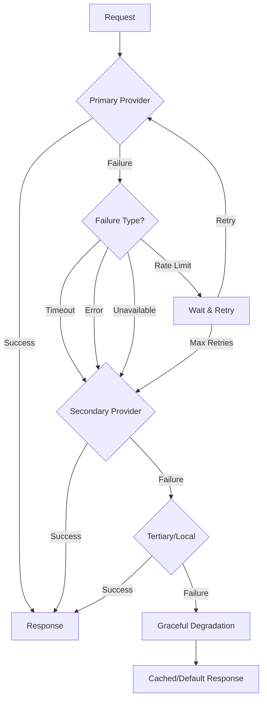

# Fallback Systems

## Introduction

Fallback systems ensure application reliability when primary AI providers experience issues. This lesson covers implementing robust failover patterns that maintain service availability.

### What We'll Cover

- Primary/secondary provider setup
- Automatic failover triggers
- Health checks and circuit breakers
- Fallback chains
- Graceful degradation strategies

### Prerequisites

- Provider abstraction layer
- Error handling fundamentals

---

## Fallback Architecture



---

## Fallback Provider Configuration

```python
from dataclasses import dataclass, field
from typing import Optional, Callable
from enum import Enum

class FailureType(Enum):
    TIMEOUT = "timeout"
    RATE_LIMIT = "rate_limit"
    SERVER_ERROR = "server_error"
    AUTH_ERROR = "auth_error"
    NETWORK_ERROR = "network_error"
    CONTENT_FILTER = "content_filter"
    UNKNOWN = "unknown"


@dataclass
class FallbackConfig:
    """Configuration for a fallback provider."""
    
    provider_name: str
    model: str
    priority: int  # Lower = higher priority
    max_retries: int = 2
    timeout_seconds: float = 30.0
    trigger_on: list[FailureType] = field(default_factory=lambda: [
        FailureType.TIMEOUT,
        FailureType.RATE_LIMIT,
        FailureType.SERVER_ERROR,
        FailureType.NETWORK_ERROR
    ])
    enabled: bool = True


@dataclass
class FallbackChain:
    """Ordered chain of fallback providers."""
    
    configs: list[FallbackConfig]
    
    def __post_init__(self):
        # Sort by priority
        self.configs.sort(key=lambda c: c.priority)
    
    def get_active(self) -> list[FallbackConfig]:
        """Get enabled providers in priority order."""
        return [c for c in self.configs if c.enabled]
    
    def should_fallback(self, failure_type: FailureType, config: FallbackConfig) -> bool:
        """Check if this failure type should trigger fallback."""
        return failure_type in config.trigger_on


# Configuration example
fallback_chain = FallbackChain([
    FallbackConfig(
        provider_name="openai",
        model="gpt-4.1",
        priority=1,  # Primary
        max_retries=3,
        timeout_seconds=30
    ),
    FallbackConfig(
        provider_name="anthropic",
        model="claude-sonnet-4-20250514",
        priority=2,  # Secondary
        max_retries=2,
        timeout_seconds=25
    ),
    FallbackConfig(
        provider_name="ollama",
        model="llama3.2",
        priority=3,  # Tertiary (local)
        max_retries=1,
        timeout_seconds=60  # Local can be slower
    )
])
```

---

## Fallback Manager

```python
import asyncio
from dataclasses import dataclass
from datetime import datetime
from typing import Dict, Tuple

@dataclass
class FallbackAttempt:
    """Record of a fallback attempt."""
    
    provider_name: str
    model: str
    success: bool
    failure_type: Optional[FailureType]
    latency_ms: int
    timestamp: datetime


class FallbackManager:
    """Manages provider fallback chain."""
    
    def __init__(
        self,
        chain: FallbackChain,
        providers: Dict[str, 'AIProvider']
    ):
        self.chain = chain
        self.providers = providers
        self.attempts: list[FallbackAttempt] = []
    
    def _classify_error(self, error: Exception) -> FailureType:
        """Classify exception into failure type."""
        
        error_str = str(error).lower()
        error_type = type(error).__name__.lower()
        
        if "timeout" in error_str or "timeout" in error_type:
            return FailureType.TIMEOUT
        if "rate" in error_str or "429" in error_str:
            return FailureType.RATE_LIMIT
        if "500" in error_str or "502" in error_str or "503" in error_str:
            return FailureType.SERVER_ERROR
        if "401" in error_str or "403" in error_str or "auth" in error_str:
            return FailureType.AUTH_ERROR
        if "connection" in error_str or "network" in error_str:
            return FailureType.NETWORK_ERROR
        if "content" in error_str or "filter" in error_str:
            return FailureType.CONTENT_FILTER
        
        return FailureType.UNKNOWN
    
    async def complete_with_fallback(
        self,
        messages: list,
        **kwargs
    ) -> Tuple['CompletionResponse', str]:
        """
        Attempt completion with fallback chain.
        
        Returns: (response, provider_used)
        """
        
        active_configs = self.chain.get_active()
        last_error = None
        
        for config in active_configs:
            provider = self.providers.get(config.provider_name)
            if not provider:
                continue
            
            # Check if provider is available
            if not await provider.is_available():
                self.attempts.append(FallbackAttempt(
                    provider_name=config.provider_name,
                    model=config.model,
                    success=False,
                    failure_type=FailureType.NETWORK_ERROR,
                    latency_ms=0,
                    timestamp=datetime.now()
                ))
                continue
            
            # Try with retries
            for attempt in range(config.max_retries):
                start = datetime.now()
                
                try:
                    response = await asyncio.wait_for(
                        provider.complete(
                            messages,
                            model=config.model,
                            **kwargs
                        ),
                        timeout=config.timeout_seconds
                    )
                    
                    latency = int((datetime.now() - start).total_seconds() * 1000)
                    
                    self.attempts.append(FallbackAttempt(
                        provider_name=config.provider_name,
                        model=config.model,
                        success=True,
                        failure_type=None,
                        latency_ms=latency,
                        timestamp=datetime.now()
                    ))
                    
                    return response, config.provider_name
                    
                except asyncio.TimeoutError:
                    last_error = asyncio.TimeoutError(f"Timeout after {config.timeout_seconds}s")
                    failure_type = FailureType.TIMEOUT
                    
                except Exception as e:
                    last_error = e
                    failure_type = self._classify_error(e)
                
                latency = int((datetime.now() - start).total_seconds() * 1000)
                
                self.attempts.append(FallbackAttempt(
                    provider_name=config.provider_name,
                    model=config.model,
                    success=False,
                    failure_type=failure_type,
                    latency_ms=latency,
                    timestamp=datetime.now()
                ))
                
                # Check if we should fallback for this error type
                if not self.chain.should_fallback(failure_type, config):
                    # Don't retry or fallback for this error type
                    raise last_error
                
                # Brief delay before retry
                if attempt < config.max_retries - 1:
                    await asyncio.sleep(0.5 * (attempt + 1))
        
        # All providers failed
        raise Exception(f"All providers failed. Last error: {last_error}")
    
    def get_fallback_stats(self) -> dict:
        """Get statistics on fallback usage."""
        
        total = len(self.attempts)
        if total == 0:
            return {"total_attempts": 0}
        
        by_provider = {}
        for attempt in self.attempts:
            if attempt.provider_name not in by_provider:
                by_provider[attempt.provider_name] = {
                    "total": 0,
                    "success": 0,
                    "failures": {},
                    "avg_latency_ms": 0
                }
            
            stats = by_provider[attempt.provider_name]
            stats["total"] += 1
            
            if attempt.success:
                stats["success"] += 1
            else:
                failure_name = attempt.failure_type.value if attempt.failure_type else "unknown"
                stats["failures"][failure_name] = stats["failures"].get(failure_name, 0) + 1
            
            # Update running average
            n = stats["total"]
            stats["avg_latency_ms"] = (
                (stats["avg_latency_ms"] * (n - 1) + attempt.latency_ms) / n
            )
        
        # Calculate fallback rate
        primary_config = self.chain.get_active()[0] if self.chain.get_active() else None
        primary_name = primary_config.provider_name if primary_config else None
        
        primary_successes = by_provider.get(primary_name, {}).get("success", 0)
        fallback_count = sum(
            s["success"] for name, s in by_provider.items()
            if name != primary_name
        )
        
        return {
            "total_attempts": total,
            "by_provider": by_provider,
            "primary_success_rate": primary_successes / total if total > 0 else 0,
            "fallback_rate": fallback_count / total if total > 0 else 0
        }
```

---

## Circuit Breaker Pattern

```python
from dataclasses import dataclass
from datetime import datetime, timedelta
from enum import Enum
from threading import Lock

class CircuitState(Enum):
    CLOSED = "closed"      # Normal operation
    OPEN = "open"          # Failing, reject requests
    HALF_OPEN = "half_open"  # Testing if recovered


@dataclass
class CircuitBreakerConfig:
    """Configuration for circuit breaker."""
    
    failure_threshold: int = 5       # Failures before opening
    success_threshold: int = 2       # Successes in half-open to close
    timeout_seconds: float = 60.0    # Time before half-open
    half_open_max_calls: int = 3     # Max calls in half-open


class CircuitBreaker:
    """Circuit breaker for a single provider."""
    
    def __init__(self, provider_name: str, config: CircuitBreakerConfig = None):
        self.provider_name = provider_name
        self.config = config or CircuitBreakerConfig()
        
        self._state = CircuitState.CLOSED
        self._failure_count = 0
        self._success_count = 0
        self._last_failure_time: Optional[datetime] = None
        self._half_open_calls = 0
        self._lock = Lock()
    
    @property
    def state(self) -> CircuitState:
        """Get current state, checking for timeout."""
        with self._lock:
            if self._state == CircuitState.OPEN:
                if self._last_failure_time:
                    elapsed = (datetime.now() - self._last_failure_time).total_seconds()
                    if elapsed >= self.config.timeout_seconds:
                        self._state = CircuitState.HALF_OPEN
                        self._half_open_calls = 0
                        self._success_count = 0
            
            return self._state
    
    def allow_request(self) -> bool:
        """Check if request should be allowed."""
        state = self.state
        
        if state == CircuitState.CLOSED:
            return True
        
        if state == CircuitState.OPEN:
            return False
        
        # Half-open: allow limited requests
        with self._lock:
            if self._half_open_calls < self.config.half_open_max_calls:
                self._half_open_calls += 1
                return True
            return False
    
    def record_success(self):
        """Record a successful call."""
        with self._lock:
            self._failure_count = 0
            
            if self._state == CircuitState.HALF_OPEN:
                self._success_count += 1
                if self._success_count >= self.config.success_threshold:
                    self._state = CircuitState.CLOSED
                    self._success_count = 0
    
    def record_failure(self):
        """Record a failed call."""
        with self._lock:
            self._failure_count += 1
            self._last_failure_time = datetime.now()
            
            if self._state == CircuitState.HALF_OPEN:
                # Immediate return to open
                self._state = CircuitState.OPEN
            elif self._failure_count >= self.config.failure_threshold:
                self._state = CircuitState.OPEN
    
    def reset(self):
        """Manually reset the circuit."""
        with self._lock:
            self._state = CircuitState.CLOSED
            self._failure_count = 0
            self._success_count = 0
            self._half_open_calls = 0


class CircuitBreakerManager:
    """Manage circuit breakers for multiple providers."""
    
    def __init__(self, config: CircuitBreakerConfig = None):
        self.config = config or CircuitBreakerConfig()
        self.breakers: Dict[str, CircuitBreaker] = {}
    
    def get_breaker(self, provider_name: str) -> CircuitBreaker:
        """Get or create circuit breaker for provider."""
        if provider_name not in self.breakers:
            self.breakers[provider_name] = CircuitBreaker(provider_name, self.config)
        return self.breakers[provider_name]
    
    def get_available_providers(self, provider_names: list[str]) -> list[str]:
        """Get providers with closed or half-open circuits."""
        return [
            name for name in provider_names
            if self.get_breaker(name).allow_request()
        ]
    
    def get_status(self) -> dict:
        """Get status of all circuit breakers."""
        return {
            name: {
                "state": breaker.state.value,
                "failure_count": breaker._failure_count,
                "allows_request": breaker.allow_request()
            }
            for name, breaker in self.breakers.items()
        }


# Integration with FallbackManager
class ResilientFallbackManager(FallbackManager):
    """Fallback manager with circuit breakers."""
    
    def __init__(
        self,
        chain: FallbackChain,
        providers: Dict[str, 'AIProvider'],
        breaker_config: CircuitBreakerConfig = None
    ):
        super().__init__(chain, providers)
        self.circuit_manager = CircuitBreakerManager(breaker_config)
    
    async def complete_with_fallback(
        self,
        messages: list,
        **kwargs
    ) -> Tuple['CompletionResponse', str]:
        """Attempt completion with circuit breakers."""
        
        active_configs = self.chain.get_active()
        last_error = None
        
        for config in active_configs:
            breaker = self.circuit_manager.get_breaker(config.provider_name)
            
            # Check circuit breaker
            if not breaker.allow_request():
                continue
            
            provider = self.providers.get(config.provider_name)
            if not provider:
                continue
            
            start = datetime.now()
            
            try:
                response = await asyncio.wait_for(
                    provider.complete(
                        messages,
                        model=config.model,
                        **kwargs
                    ),
                    timeout=config.timeout_seconds
                )
                
                breaker.record_success()
                
                latency = int((datetime.now() - start).total_seconds() * 1000)
                self.attempts.append(FallbackAttempt(
                    provider_name=config.provider_name,
                    model=config.model,
                    success=True,
                    failure_type=None,
                    latency_ms=latency,
                    timestamp=datetime.now()
                ))
                
                return response, config.provider_name
                
            except Exception as e:
                breaker.record_failure()
                last_error = e
                
                latency = int((datetime.now() - start).total_seconds() * 1000)
                self.attempts.append(FallbackAttempt(
                    provider_name=config.provider_name,
                    model=config.model,
                    success=False,
                    failure_type=self._classify_error(e),
                    latency_ms=latency,
                    timestamp=datetime.now()
                ))
        
        raise Exception(f"All providers failed. Last error: {last_error}")
```

---

## Health Check System

```python
import asyncio
from dataclasses import dataclass
from datetime import datetime
from typing import Dict

@dataclass
class HealthStatus:
    """Health status for a provider."""
    
    provider_name: str
    healthy: bool
    latency_ms: Optional[int]
    last_check: datetime
    error: Optional[str] = None


class HealthChecker:
    """Check provider health periodically."""
    
    TEST_MESSAGES = [
        {"role": "user", "content": "Say 'OK' if you're working."}
    ]
    
    def __init__(
        self,
        providers: Dict[str, 'AIProvider'],
        check_interval_seconds: float = 60.0,
        timeout_seconds: float = 10.0
    ):
        self.providers = providers
        self.check_interval = check_interval_seconds
        self.timeout = timeout_seconds
        self.status: Dict[str, HealthStatus] = {}
        self._running = False
    
    async def check_provider(self, name: str, provider: 'AIProvider') -> HealthStatus:
        """Check health of a single provider."""
        
        start = datetime.now()
        
        try:
            # Quick availability check
            if not await provider.is_available():
                return HealthStatus(
                    provider_name=name,
                    healthy=False,
                    latency_ms=None,
                    last_check=datetime.now(),
                    error="Provider not available"
                )
            
            # Actual request test
            response = await asyncio.wait_for(
                provider.complete(
                    self.TEST_MESSAGES,
                    max_tokens=10
                ),
                timeout=self.timeout
            )
            
            latency = int((datetime.now() - start).total_seconds() * 1000)
            
            return HealthStatus(
                provider_name=name,
                healthy=True,
                latency_ms=latency,
                last_check=datetime.now()
            )
            
        except asyncio.TimeoutError:
            return HealthStatus(
                provider_name=name,
                healthy=False,
                latency_ms=None,
                last_check=datetime.now(),
                error=f"Timeout after {self.timeout}s"
            )
        except Exception as e:
            return HealthStatus(
                provider_name=name,
                healthy=False,
                latency_ms=None,
                last_check=datetime.now(),
                error=str(e)
            )
    
    async def check_all(self) -> Dict[str, HealthStatus]:
        """Check health of all providers."""
        
        tasks = [
            self.check_provider(name, provider)
            for name, provider in self.providers.items()
        ]
        
        results = await asyncio.gather(*tasks, return_exceptions=True)
        
        for result in results:
            if isinstance(result, HealthStatus):
                self.status[result.provider_name] = result
            elif isinstance(result, Exception):
                # Handle gather exceptions
                pass
        
        return self.status
    
    async def start_background_checks(self):
        """Start periodic health checks."""
        
        self._running = True
        
        while self._running:
            await self.check_all()
            await asyncio.sleep(self.check_interval)
    
    def stop(self):
        """Stop background checks."""
        self._running = False
    
    def get_healthy_providers(self) -> list[str]:
        """Get list of healthy providers."""
        return [
            name for name, status in self.status.items()
            if status.healthy
        ]
    
    def is_healthy(self, provider_name: str) -> bool:
        """Check if specific provider is healthy."""
        status = self.status.get(provider_name)
        if not status:
            return True  # Unknown = assume healthy
        return status.healthy


# Integration with fallback
class HealthAwareFallbackManager(ResilientFallbackManager):
    """Fallback manager with health checks."""
    
    def __init__(
        self,
        chain: FallbackChain,
        providers: Dict[str, 'AIProvider'],
        health_checker: HealthChecker
    ):
        super().__init__(chain, providers)
        self.health_checker = health_checker
    
    async def complete_with_fallback(
        self,
        messages: list,
        **kwargs
    ) -> Tuple['CompletionResponse', str]:
        """Complete with health-aware fallback."""
        
        # Filter to healthy providers
        healthy_names = set(self.health_checker.get_healthy_providers())
        
        active_configs = [
            config for config in self.chain.get_active()
            if config.provider_name in healthy_names or 
               config.provider_name not in self.health_checker.status
        ]
        
        if not active_configs:
            # All unhealthy - try anyway with circuit breakers
            active_configs = self.chain.get_active()
        
        # Create temporary chain
        temp_chain = FallbackChain(active_configs)
        original_chain = self.chain
        self.chain = temp_chain
        
        try:
            return await super().complete_with_fallback(messages, **kwargs)
        finally:
            self.chain = original_chain
```

---

## Graceful Degradation

```python
from dataclasses import dataclass
from typing import Optional, Callable, Any

@dataclass
class DegradedResponse:
    """Response in degraded mode."""
    
    content: str
    is_degraded: bool = True
    degradation_reason: str = ""
    original_error: Optional[str] = None


class GracefulDegrader:
    """Handle complete fallback failure gracefully."""
    
    def __init__(self):
        self.cached_responses: Dict[str, str] = {}
        self.default_responses: Dict[str, str] = {
            "greeting": "Hello! I'm currently experiencing technical difficulties. Please try again shortly.",
            "error": "I'm sorry, but I'm unable to process your request right now. Please try again later.",
            "busy": "I'm currently handling a high volume of requests. Please wait a moment and try again."
        }
    
    def set_cached_response(self, key: str, response: str):
        """Cache a response for degraded mode."""
        self.cached_responses[key] = response
    
    def get_degraded_response(
        self,
        messages: list,
        error: Exception
    ) -> DegradedResponse:
        """Get appropriate degraded response."""
        
        # Try to match cached response
        if messages:
            last_message = messages[-1].content.lower() if hasattr(messages[-1], 'content') else str(messages[-1]).lower()
            
            # Check for greetings
            if any(g in last_message for g in ["hello", "hi", "hey"]):
                return DegradedResponse(
                    content=self.default_responses["greeting"],
                    degradation_reason="All providers unavailable",
                    original_error=str(error)
                )
        
        # Check error type for specific response
        error_str = str(error).lower()
        
        if "rate" in error_str or "quota" in error_str:
            return DegradedResponse(
                content=self.default_responses["busy"],
                degradation_reason="Rate limits exceeded",
                original_error=str(error)
            )
        
        return DegradedResponse(
            content=self.default_responses["error"],
            degradation_reason="Service unavailable",
            original_error=str(error)
        )


class FullyResilientClient:
    """Complete resilient AI client."""
    
    def __init__(
        self,
        fallback_manager: HealthAwareFallbackManager,
        degrader: GracefulDegrader
    ):
        self.fallback_manager = fallback_manager
        self.degrader = degrader
    
    async def complete(
        self,
        messages: list,
        allow_degraded: bool = True,
        **kwargs
    ) -> tuple[Any, str, bool]:
        """
        Complete with full resilience.
        
        Returns: (response, provider_or_"degraded", is_degraded)
        """
        
        try:
            response, provider = await self.fallback_manager.complete_with_fallback(
                messages,
                **kwargs
            )
            return response, provider, False
            
        except Exception as e:
            if allow_degraded:
                degraded = self.degrader.get_degraded_response(messages, e)
                return degraded, "degraded", True
            raise


# Usage example
async def main():
    # Setup providers
    providers = {
        "openai": OpenAIProvider(api_key="..."),
        "anthropic": AnthropicProvider(api_key="..."),
        "ollama": OllamaProvider()
    }
    
    # Setup fallback chain
    chain = FallbackChain([
        FallbackConfig("openai", "gpt-4.1", priority=1),
        FallbackConfig("anthropic", "claude-sonnet-4-20250514", priority=2),
        FallbackConfig("ollama", "llama3.2", priority=3)
    ])
    
    # Setup health checker
    health_checker = HealthChecker(providers, check_interval_seconds=30)
    
    # Start health checks in background
    asyncio.create_task(health_checker.start_background_checks())
    
    # Setup resilient manager
    fallback_manager = HealthAwareFallbackManager(
        chain=chain,
        providers=providers,
        health_checker=health_checker
    )
    
    # Setup degrader
    degrader = GracefulDegrader()
    
    # Create fully resilient client
    client = FullyResilientClient(fallback_manager, degrader)
    
    # Use it
    messages = [Message(role="user", content="Hello!")]
    
    response, provider, is_degraded = await client.complete(messages)
    
    if is_degraded:
        print(f"Degraded response: {response.content}")
        print(f"Reason: {response.degradation_reason}")
    else:
        print(f"Response from {provider}: {response.content}")
```

---

## Hands-on Exercise

### Your Task

Build a fallback system with weighted provider selection.

### Requirements

1. Primary provider with 70% traffic
2. Secondary provider with 30% traffic
3. Full fallback when primary fails
4. Track success rates per provider

### Expected Result

```python
router = WeightedFallbackRouter(
    weights={"openai": 0.7, "anthropic": 0.3}
)

# 70% of requests go to OpenAI
# 30% go to Anthropic
# If selected provider fails, fall back to the other
```

<details>
<summary>💡 Hints</summary>

- Use random.random() for weight selection
- Track primary selection vs fallback usage
- Consider health status in weight calculation
</details>

<details>
<summary>✅ Solution</summary>

```python
import random
from dataclasses import dataclass, field
from collections import defaultdict
from datetime import datetime

@dataclass
class WeightedFallbackRouter:
    """Weighted provider selection with fallback."""
    
    weights: dict[str, float]  # provider_name -> weight (0-1)
    providers: dict[str, 'AIProvider'] = field(default_factory=dict)
    
    _stats: dict = field(default_factory=lambda: defaultdict(lambda: {
        "selected": 0,
        "success": 0,
        "fallback_from": 0,
        "fallback_to": 0
    }))
    
    def __post_init__(self):
        # Normalize weights
        total = sum(self.weights.values())
        self.weights = {k: v/total for k, v in self.weights.items()}
    
    def _select_weighted(self) -> str:
        """Select provider based on weights."""
        r = random.random()
        cumulative = 0
        
        for provider, weight in self.weights.items():
            cumulative += weight
            if r < cumulative:
                return provider
        
        return list(self.weights.keys())[0]
    
    def _get_fallback(self, failed_provider: str) -> str:
        """Get fallback provider."""
        for provider in self.weights:
            if provider != failed_provider:
                return provider
        return None
    
    async def complete(
        self,
        messages: list,
        **kwargs
    ) -> tuple['CompletionResponse', str]:
        """Complete with weighted selection and fallback."""
        
        primary = self._select_weighted()
        self._stats[primary]["selected"] += 1
        
        try:
            provider = self.providers[primary]
            response = await provider.complete(messages, **kwargs)
            
            self._stats[primary]["success"] += 1
            return response, primary
            
        except Exception as primary_error:
            self._stats[primary]["fallback_from"] += 1
            
            # Try fallback
            fallback = self._get_fallback(primary)
            
            if fallback:
                self._stats[fallback]["fallback_to"] += 1
                
                try:
                    provider = self.providers[fallback]
                    response = await provider.complete(messages, **kwargs)
                    
                    self._stats[fallback]["success"] += 1
                    return response, fallback
                    
                except Exception as fallback_error:
                    raise Exception(
                        f"Both providers failed. Primary ({primary}): {primary_error}, "
                        f"Fallback ({fallback}): {fallback_error}"
                    )
            
            raise primary_error
    
    def get_stats(self) -> dict:
        """Get router statistics."""
        stats = dict(self._stats)
        
        # Calculate rates
        for provider, data in stats.items():
            total = data["selected"] + data["fallback_to"]
            if total > 0:
                data["success_rate"] = data["success"] / total
                data["fallback_rate"] = data["fallback_from"] / data["selected"] if data["selected"] > 0 else 0
        
        return stats
    
    def adjust_weights(self, success_rates: dict[str, float]):
        """Adjust weights based on success rates."""
        
        # Higher success rate = higher weight
        total_success = sum(success_rates.values())
        
        if total_success > 0:
            for provider in self.weights:
                if provider in success_rates:
                    # Blend current weight with success rate
                    current = self.weights[provider]
                    success_based = success_rates[provider] / total_success
                    self.weights[provider] = (current + success_based) / 2
            
            # Renormalize
            total = sum(self.weights.values())
            self.weights = {k: v/total for k, v in self.weights.items()}


# Usage
router = WeightedFallbackRouter(
    weights={"openai": 0.7, "anthropic": 0.3},
    providers={
        "openai": openai_provider,
        "anthropic": anthropic_provider
    }
)

# Simulate 100 requests
import asyncio

async def simulate():
    for _ in range(100):
        try:
            response, provider = await router.complete([
                Message(role="user", content="Hello!")
            ])
            print(f"Used: {provider}")
        except Exception as e:
            print(f"Failed: {e}")

    # Show stats
    stats = router.get_stats()
    for provider, data in stats.items():
        print(f"\n{provider}:")
        print(f"  Selected: {data['selected']}")
        print(f"  Success: {data['success']}")
        print(f"  Fallback from: {data['fallback_from']}")
        print(f"  Fallback to: {data['fallback_to']}")
        print(f"  Success rate: {data.get('success_rate', 'N/A'):.2%}")

asyncio.run(simulate())
```

</details>

---

## Summary

✅ Fallback chains provide ordered provider alternatives  
✅ Circuit breakers prevent overwhelming failing providers  
✅ Health checks proactively identify unavailable providers  
✅ Graceful degradation maintains UX during complete failures  
✅ Weighted routing distributes load while enabling fallback

**Next:** [Response Normalization](./04-response-normalization.md)

---

## Further Reading

- [Circuit Breaker Pattern](https://martinfowler.com/bliki/CircuitBreaker.html) — Martin Fowler
- [Resilience4j](https://resilience4j.readme.io/) — Java resilience patterns
- [Hystrix](https://github.com/Netflix/Hystrix/wiki) — Netflix resilience library (archived but educational)

<!-- 
Sources Consulted:
- Martin Fowler Circuit Breaker: https://martinfowler.com/bliki/CircuitBreaker.html
- AWS Well-Architected: https://docs.aws.amazon.com/wellarchitected/latest/reliability-pillar/
- Microsoft Retry Pattern: https://docs.microsoft.com/en-us/azure/architecture/patterns/retry
-->
