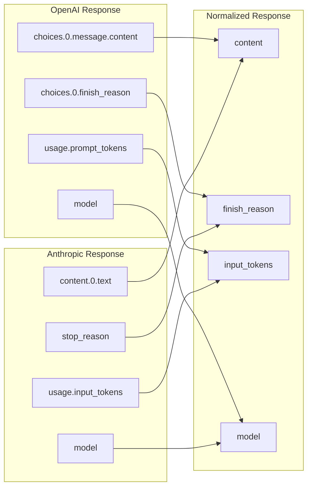

# Response Normalization

## Introduction

Different AI providers return responses in varying formats. Response normalization creates a unified data structure, simplifying application code and enabling seamless provider switching.

### What We'll Cover

- Common response format design
- Field mapping between providers
- Handling provider-specific features
- Consistent error responses
- Streaming normalization

### Prerequisites

- Provider abstraction concepts
- Understanding of OpenAI and Anthropic response formats

---

## Response Format Differences



---

## Unified Response Model

```python
from dataclasses import dataclass, field
from typing import Optional, Any
from enum import Enum
from datetime import datetime

class FinishReason(Enum):
    """Normalized finish reasons across providers."""
    
    STOP = "stop"              # Natural completion
    LENGTH = "length"          # Max tokens reached
    TOOL_CALL = "tool_call"    # Function/tool called
    CONTENT_FILTER = "content_filter"  # Content filtered
    ERROR = "error"            # Error occurred
    UNKNOWN = "unknown"        # Unknown reason


@dataclass
class TokenUsage:
    """Normalized token usage."""
    
    input_tokens: int
    output_tokens: int
    total_tokens: int
    
    # Provider-specific extras
    cached_tokens: Optional[int] = None
    reasoning_tokens: Optional[int] = None
    
    @classmethod
    def from_openai(cls, usage: dict) -> 'TokenUsage':
        """Create from OpenAI usage object."""
        return cls(
            input_tokens=usage.get("prompt_tokens", 0),
            output_tokens=usage.get("completion_tokens", 0),
            total_tokens=usage.get("total_tokens", 0),
            cached_tokens=usage.get("prompt_tokens_details", {}).get("cached_tokens"),
            reasoning_tokens=usage.get("completion_tokens_details", {}).get("reasoning_tokens")
        )
    
    @classmethod
    def from_anthropic(cls, usage: dict) -> 'TokenUsage':
        """Create from Anthropic usage object."""
        input_tokens = usage.get("input_tokens", 0)
        output_tokens = usage.get("output_tokens", 0)
        
        return cls(
            input_tokens=input_tokens,
            output_tokens=output_tokens,
            total_tokens=input_tokens + output_tokens,
            cached_tokens=usage.get("cache_read_input_tokens")
        )
    
    @classmethod  
    def from_gemini(cls, usage: dict) -> 'TokenUsage':
        """Create from Gemini usage object."""
        return cls(
            input_tokens=usage.get("promptTokenCount", 0),
            output_tokens=usage.get("candidatesTokenCount", 0),
            total_tokens=usage.get("totalTokenCount", 0)
        )


@dataclass
class ToolCall:
    """Normalized tool/function call."""
    
    id: str
    name: str
    arguments: dict
    
    @classmethod
    def from_openai(cls, tool_call: dict) -> 'ToolCall':
        """Create from OpenAI tool call."""
        import json
        return cls(
            id=tool_call.get("id", ""),
            name=tool_call.get("function", {}).get("name", ""),
            arguments=json.loads(tool_call.get("function", {}).get("arguments", "{}"))
        )
    
    @classmethod
    def from_anthropic(cls, tool_use: dict) -> 'ToolCall':
        """Create from Anthropic tool use."""
        return cls(
            id=tool_use.get("id", ""),
            name=tool_use.get("name", ""),
            arguments=tool_use.get("input", {})
        )


@dataclass
class NormalizedResponse:
    """Unified response across all providers."""
    
    # Core fields
    content: str
    finish_reason: FinishReason
    model: str
    provider: str
    
    # Token usage
    usage: Optional[TokenUsage] = None
    
    # Tool calls
    tool_calls: list[ToolCall] = field(default_factory=list)
    
    # Metadata
    id: str = ""
    created: Optional[datetime] = None
    latency_ms: Optional[int] = None
    
    # Provider-specific data (preserved for debugging)
    raw_response: Optional[Any] = None
    
    def has_tool_calls(self) -> bool:
        """Check if response includes tool calls."""
        return len(self.tool_calls) > 0
    
    def to_dict(self) -> dict:
        """Convert to dictionary."""
        return {
            "content": self.content,
            "finish_reason": self.finish_reason.value,
            "model": self.model,
            "provider": self.provider,
            "usage": {
                "input_tokens": self.usage.input_tokens,
                "output_tokens": self.usage.output_tokens,
                "total_tokens": self.usage.total_tokens
            } if self.usage else None,
            "tool_calls": [
                {"id": tc.id, "name": tc.name, "arguments": tc.arguments}
                for tc in self.tool_calls
            ],
            "id": self.id,
            "latency_ms": self.latency_ms
        }
```

---

## Response Normalizers

```python
from abc import ABC, abstractmethod
from typing import Any

class ResponseNormalizer(ABC):
    """Base class for response normalizers."""
    
    @property
    @abstractmethod
    def provider_name(self) -> str:
        """Provider this normalizer handles."""
        pass
    
    @abstractmethod
    def normalize(self, raw_response: Any, latency_ms: int = None) -> NormalizedResponse:
        """Normalize a raw response."""
        pass
    
    @abstractmethod
    def normalize_error(self, error: Exception) -> NormalizedResponse:
        """Normalize an error into a response format."""
        pass


class OpenAINormalizer(ResponseNormalizer):
    """Normalize OpenAI responses."""
    
    FINISH_REASON_MAP = {
        "stop": FinishReason.STOP,
        "length": FinishReason.LENGTH,
        "tool_calls": FinishReason.TOOL_CALL,
        "content_filter": FinishReason.CONTENT_FILTER
    }
    
    @property
    def provider_name(self) -> str:
        return "openai"
    
    def normalize(self, raw_response: Any, latency_ms: int = None) -> NormalizedResponse:
        """Normalize OpenAI response."""
        
        # Handle both dict and object responses
        if hasattr(raw_response, "model_dump"):
            data = raw_response.model_dump()
        elif isinstance(raw_response, dict):
            data = raw_response
        else:
            data = dict(raw_response)
        
        # Extract choice
        choices = data.get("choices", [])
        choice = choices[0] if choices else {}
        message = choice.get("message", {})
        
        # Extract content
        content = message.get("content", "") or ""
        
        # Map finish reason
        raw_reason = choice.get("finish_reason", "unknown")
        finish_reason = self.FINISH_REASON_MAP.get(raw_reason, FinishReason.UNKNOWN)
        
        # Extract tool calls
        tool_calls = []
        raw_tool_calls = message.get("tool_calls", [])
        for tc in raw_tool_calls:
            tool_calls.append(ToolCall.from_openai(tc))
        
        # Extract usage
        usage = None
        if "usage" in data:
            usage = TokenUsage.from_openai(data["usage"])
        
        return NormalizedResponse(
            content=content,
            finish_reason=finish_reason,
            model=data.get("model", "unknown"),
            provider=self.provider_name,
            usage=usage,
            tool_calls=tool_calls,
            id=data.get("id", ""),
            created=datetime.fromtimestamp(data.get("created", 0)) if data.get("created") else None,
            latency_ms=latency_ms,
            raw_response=raw_response
        )
    
    def normalize_error(self, error: Exception) -> NormalizedResponse:
        """Create error response."""
        return NormalizedResponse(
            content=f"Error: {str(error)}",
            finish_reason=FinishReason.ERROR,
            model="unknown",
            provider=self.provider_name
        )


class AnthropicNormalizer(ResponseNormalizer):
    """Normalize Anthropic responses."""
    
    STOP_REASON_MAP = {
        "end_turn": FinishReason.STOP,
        "stop_sequence": FinishReason.STOP,
        "max_tokens": FinishReason.LENGTH,
        "tool_use": FinishReason.TOOL_CALL
    }
    
    @property
    def provider_name(self) -> str:
        return "anthropic"
    
    def normalize(self, raw_response: Any, latency_ms: int = None) -> NormalizedResponse:
        """Normalize Anthropic response."""
        
        # Handle both dict and object responses
        if hasattr(raw_response, "model_dump"):
            data = raw_response.model_dump()
        elif isinstance(raw_response, dict):
            data = raw_response
        else:
            data = dict(raw_response)
        
        # Extract content
        content_blocks = data.get("content", [])
        text_content = ""
        tool_calls = []
        
        for block in content_blocks:
            if block.get("type") == "text":
                text_content += block.get("text", "")
            elif block.get("type") == "tool_use":
                tool_calls.append(ToolCall.from_anthropic(block))
        
        # Map stop reason
        raw_reason = data.get("stop_reason", "unknown")
        finish_reason = self.STOP_REASON_MAP.get(raw_reason, FinishReason.UNKNOWN)
        
        # Extract usage
        usage = None
        if "usage" in data:
            usage = TokenUsage.from_anthropic(data["usage"])
        
        return NormalizedResponse(
            content=text_content,
            finish_reason=finish_reason,
            model=data.get("model", "unknown"),
            provider=self.provider_name,
            usage=usage,
            tool_calls=tool_calls,
            id=data.get("id", ""),
            latency_ms=latency_ms,
            raw_response=raw_response
        )
    
    def normalize_error(self, error: Exception) -> NormalizedResponse:
        """Create error response."""
        return NormalizedResponse(
            content=f"Error: {str(error)}",
            finish_reason=FinishReason.ERROR,
            model="unknown",
            provider=self.provider_name
        )


class GeminiNormalizer(ResponseNormalizer):
    """Normalize Google Gemini responses."""
    
    FINISH_REASON_MAP = {
        "STOP": FinishReason.STOP,
        "MAX_TOKENS": FinishReason.LENGTH,
        "SAFETY": FinishReason.CONTENT_FILTER,
        "RECITATION": FinishReason.CONTENT_FILTER
    }
    
    @property
    def provider_name(self) -> str:
        return "gemini"
    
    def normalize(self, raw_response: Any, latency_ms: int = None) -> NormalizedResponse:
        """Normalize Gemini response."""
        
        if hasattr(raw_response, "to_dict"):
            data = raw_response.to_dict()
        elif isinstance(raw_response, dict):
            data = raw_response
        else:
            data = {}
        
        # Extract content from candidates
        candidates = data.get("candidates", [])
        candidate = candidates[0] if candidates else {}
        content_obj = candidate.get("content", {})
        parts = content_obj.get("parts", [])
        
        text_content = ""
        tool_calls = []
        
        for part in parts:
            if "text" in part:
                text_content += part["text"]
            elif "functionCall" in part:
                fc = part["functionCall"]
                tool_calls.append(ToolCall(
                    id=fc.get("name", ""),  # Gemini doesn't have separate ID
                    name=fc.get("name", ""),
                    arguments=fc.get("args", {})
                ))
        
        # Map finish reason
        raw_reason = candidate.get("finishReason", "UNKNOWN")
        finish_reason = self.FINISH_REASON_MAP.get(raw_reason, FinishReason.UNKNOWN)
        
        # Extract usage
        usage = None
        usage_meta = data.get("usageMetadata", {})
        if usage_meta:
            usage = TokenUsage.from_gemini(usage_meta)
        
        return NormalizedResponse(
            content=text_content,
            finish_reason=finish_reason,
            model=data.get("modelVersion", "gemini"),
            provider=self.provider_name,
            usage=usage,
            tool_calls=tool_calls,
            latency_ms=latency_ms,
            raw_response=raw_response
        )
    
    def normalize_error(self, error: Exception) -> NormalizedResponse:
        return NormalizedResponse(
            content=f"Error: {str(error)}",
            finish_reason=FinishReason.ERROR,
            model="unknown",
            provider=self.provider_name
        )
```

---

## Normalizer Registry

```python
class NormalizerRegistry:
    """Registry of response normalizers."""
    
    def __init__(self):
        self._normalizers: dict[str, ResponseNormalizer] = {}
        
        # Register defaults
        self.register(OpenAINormalizer())
        self.register(AnthropicNormalizer())
        self.register(GeminiNormalizer())
    
    def register(self, normalizer: ResponseNormalizer):
        """Register a normalizer."""
        self._normalizers[normalizer.provider_name] = normalizer
    
    def get(self, provider_name: str) -> ResponseNormalizer:
        """Get normalizer for provider."""
        if provider_name not in self._normalizers:
            raise ValueError(f"No normalizer for provider: {provider_name}")
        return self._normalizers[provider_name]
    
    def normalize(
        self,
        provider_name: str,
        raw_response: Any,
        latency_ms: int = None
    ) -> NormalizedResponse:
        """Normalize a response from any provider."""
        normalizer = self.get(provider_name)
        return normalizer.normalize(raw_response, latency_ms)


# Usage
registry = NormalizerRegistry()

# Normalize OpenAI response
openai_raw = {
    "id": "chatcmpl-123",
    "model": "gpt-4.1",
    "choices": [{
        "message": {"content": "Hello!"},
        "finish_reason": "stop"
    }],
    "usage": {
        "prompt_tokens": 10,
        "completion_tokens": 5,
        "total_tokens": 15
    }
}

normalized = registry.normalize("openai", openai_raw, latency_ms=450)
print(f"Content: {normalized.content}")
print(f"Finish: {normalized.finish_reason.value}")
print(f"Tokens: {normalized.usage.total_tokens}")
```

---

## Streaming Normalization

```python
from dataclasses import dataclass
from typing import AsyncIterator, Any

@dataclass  
class NormalizedChunk:
    """Normalized streaming chunk."""
    
    content: str
    finish_reason: Optional[FinishReason]
    provider: str
    
    # Delta tool calls
    tool_call_delta: Optional[dict] = None
    
    # Usage (only in final chunk for some providers)
    usage: Optional[TokenUsage] = None
    
    def is_final(self) -> bool:
        """Check if this is the final chunk."""
        return self.finish_reason is not None


class StreamNormalizer(ABC):
    """Base for stream normalizers."""
    
    @abstractmethod
    async def normalize_stream(
        self,
        raw_stream: AsyncIterator[Any]
    ) -> AsyncIterator[NormalizedChunk]:
        """Normalize a stream of chunks."""
        pass


class OpenAIStreamNormalizer(StreamNormalizer):
    """Normalize OpenAI streaming responses."""
    
    async def normalize_stream(
        self,
        raw_stream: AsyncIterator[Any]
    ) -> AsyncIterator[NormalizedChunk]:
        """Normalize OpenAI stream."""
        
        accumulated_tool_calls = {}
        
        async for chunk in raw_stream:
            if hasattr(chunk, "model_dump"):
                data = chunk.model_dump()
            else:
                data = chunk
            
            choices = data.get("choices", [])
            if not choices:
                continue
            
            choice = choices[0]
            delta = choice.get("delta", {})
            
            # Extract content delta
            content = delta.get("content", "") or ""
            
            # Handle tool call deltas
            tool_call_delta = None
            if "tool_calls" in delta:
                for tc in delta["tool_calls"]:
                    idx = tc.get("index", 0)
                    if idx not in accumulated_tool_calls:
                        accumulated_tool_calls[idx] = {
                            "id": tc.get("id", ""),
                            "name": tc.get("function", {}).get("name", ""),
                            "arguments": ""
                        }
                    if "function" in tc and "arguments" in tc["function"]:
                        accumulated_tool_calls[idx]["arguments"] += tc["function"]["arguments"]
                    
                    tool_call_delta = accumulated_tool_calls[idx]
            
            # Check finish reason
            finish_reason = None
            raw_reason = choice.get("finish_reason")
            if raw_reason:
                finish_reason = OpenAINormalizer.FINISH_REASON_MAP.get(
                    raw_reason, 
                    FinishReason.UNKNOWN
                )
            
            # Usage in final chunk
            usage = None
            if "usage" in data:
                usage = TokenUsage.from_openai(data["usage"])
            
            yield NormalizedChunk(
                content=content,
                finish_reason=finish_reason,
                provider="openai",
                tool_call_delta=tool_call_delta,
                usage=usage
            )


class AnthropicStreamNormalizer(StreamNormalizer):
    """Normalize Anthropic streaming responses."""
    
    async def normalize_stream(
        self,
        raw_stream: AsyncIterator[Any]
    ) -> AsyncIterator[NormalizedChunk]:
        """Normalize Anthropic stream."""
        
        current_usage = None
        
        async for event in raw_stream:
            if hasattr(event, "model_dump"):
                data = event.model_dump()
            else:
                data = event
            
            event_type = data.get("type", "")
            
            if event_type == "content_block_delta":
                delta = data.get("delta", {})
                
                if delta.get("type") == "text_delta":
                    yield NormalizedChunk(
                        content=delta.get("text", ""),
                        finish_reason=None,
                        provider="anthropic"
                    )
                
                elif delta.get("type") == "input_json_delta":
                    # Tool call argument delta
                    yield NormalizedChunk(
                        content="",
                        finish_reason=None,
                        provider="anthropic",
                        tool_call_delta={"partial_json": delta.get("partial_json", "")}
                    )
            
            elif event_type == "message_delta":
                delta = data.get("delta", {})
                stop_reason = delta.get("stop_reason")
                
                finish_reason = None
                if stop_reason:
                    finish_reason = AnthropicNormalizer.STOP_REASON_MAP.get(
                        stop_reason,
                        FinishReason.UNKNOWN
                    )
                
                # Anthropic sends usage in message_delta
                usage = None
                if "usage" in delta:
                    usage = TokenUsage.from_anthropic(delta["usage"])
                
                yield NormalizedChunk(
                    content="",
                    finish_reason=finish_reason,
                    provider="anthropic",
                    usage=usage
                )
            
            elif event_type == "message_start":
                # Initial message with input token count
                message = data.get("message", {})
                if "usage" in message:
                    current_usage = TokenUsage.from_anthropic(message["usage"])


# Usage
async def consume_normalized_stream():
    normalizer = OpenAIStreamNormalizer()
    
    # Assume raw_stream comes from OpenAI
    full_content = ""
    final_usage = None
    
    async for chunk in normalizer.normalize_stream(raw_stream):
        full_content += chunk.content
        print(chunk.content, end="", flush=True)
        
        if chunk.is_final():
            print(f"\n\nFinish reason: {chunk.finish_reason.value}")
            final_usage = chunk.usage
    
    if final_usage:
        print(f"Tokens used: {final_usage.total_tokens}")
```

---

## Consistent Error Responses

```python
from dataclasses import dataclass
from enum import Enum
from typing import Optional

class ErrorCategory(Enum):
    """Categorized error types."""
    
    AUTHENTICATION = "authentication"
    RATE_LIMIT = "rate_limit"
    QUOTA_EXCEEDED = "quota_exceeded"
    INVALID_REQUEST = "invalid_request"
    CONTENT_POLICY = "content_policy"
    SERVER_ERROR = "server_error"
    NETWORK = "network"
    TIMEOUT = "timeout"
    MODEL_NOT_FOUND = "model_not_found"
    CONTEXT_LENGTH = "context_length"
    UNKNOWN = "unknown"


@dataclass
class NormalizedError:
    """Unified error across providers."""
    
    category: ErrorCategory
    message: str
    provider: str
    
    # Retry guidance
    retryable: bool = False
    retry_after_seconds: Optional[int] = None
    
    # Original error info
    status_code: Optional[int] = None
    original_error: Optional[str] = None
    
    def to_dict(self) -> dict:
        return {
            "category": self.category.value,
            "message": self.message,
            "provider": self.provider,
            "retryable": self.retryable,
            "retry_after": self.retry_after_seconds
        }


class ErrorNormalizer:
    """Normalize errors across providers."""
    
    OPENAI_ERROR_MAP = {
        401: (ErrorCategory.AUTHENTICATION, False),
        403: (ErrorCategory.AUTHENTICATION, False),
        429: (ErrorCategory.RATE_LIMIT, True),
        500: (ErrorCategory.SERVER_ERROR, True),
        502: (ErrorCategory.SERVER_ERROR, True),
        503: (ErrorCategory.SERVER_ERROR, True),
    }
    
    def normalize_openai(self, error: Exception) -> NormalizedError:
        """Normalize OpenAI error."""
        
        error_str = str(error).lower()
        status_code = getattr(error, "status_code", None)
        
        # Try status code mapping
        if status_code and status_code in self.OPENAI_ERROR_MAP:
            category, retryable = self.OPENAI_ERROR_MAP[status_code]
        else:
            # Pattern matching
            if "rate" in error_str or "limit" in error_str:
                category, retryable = ErrorCategory.RATE_LIMIT, True
            elif "auth" in error_str or "key" in error_str:
                category, retryable = ErrorCategory.AUTHENTICATION, False
            elif "context" in error_str or "token" in error_str:
                category, retryable = ErrorCategory.CONTEXT_LENGTH, False
            elif "content" in error_str or "policy" in error_str:
                category, retryable = ErrorCategory.CONTENT_POLICY, False
            elif "model" in error_str and "not found" in error_str:
                category, retryable = ErrorCategory.MODEL_NOT_FOUND, False
            else:
                category, retryable = ErrorCategory.UNKNOWN, True
        
        # Extract retry-after header if available
        retry_after = None
        if hasattr(error, "response") and hasattr(error.response, "headers"):
            retry_header = error.response.headers.get("retry-after")
            if retry_header:
                try:
                    retry_after = int(retry_header)
                except ValueError:
                    pass
        
        return NormalizedError(
            category=category,
            message=str(error),
            provider="openai",
            retryable=retryable,
            retry_after_seconds=retry_after,
            status_code=status_code,
            original_error=str(error)
        )
    
    def normalize_anthropic(self, error: Exception) -> NormalizedError:
        """Normalize Anthropic error."""
        
        error_str = str(error).lower()
        error_type = type(error).__name__
        
        if "rate" in error_str or "RateLimitError" in error_type:
            return NormalizedError(
                category=ErrorCategory.RATE_LIMIT,
                message="Rate limit exceeded",
                provider="anthropic",
                retryable=True,
                retry_after_seconds=60  # Anthropic default
            )
        
        if "auth" in error_str or "APIAuthenticationError" in error_type:
            return NormalizedError(
                category=ErrorCategory.AUTHENTICATION,
                message="Authentication failed",
                provider="anthropic",
                retryable=False
            )
        
        if "overloaded" in error_str:
            return NormalizedError(
                category=ErrorCategory.SERVER_ERROR,
                message="API overloaded",
                provider="anthropic",
                retryable=True,
                retry_after_seconds=30
            )
        
        return NormalizedError(
            category=ErrorCategory.UNKNOWN,
            message=str(error),
            provider="anthropic",
            retryable=True,
            original_error=str(error)
        )
    
    def normalize(self, provider: str, error: Exception) -> NormalizedError:
        """Normalize error from any provider."""
        
        normalizers = {
            "openai": self.normalize_openai,
            "anthropic": self.normalize_anthropic
        }
        
        normalizer = normalizers.get(provider)
        if normalizer:
            return normalizer(error)
        
        # Generic fallback
        error_str = str(error).lower()
        
        if "timeout" in error_str:
            category = ErrorCategory.TIMEOUT
        elif "connect" in error_str or "network" in error_str:
            category = ErrorCategory.NETWORK
        else:
            category = ErrorCategory.UNKNOWN
        
        return NormalizedError(
            category=category,
            message=str(error),
            provider=provider,
            retryable=True,
            original_error=str(error)
        )


# Usage
error_normalizer = ErrorNormalizer()

try:
    response = client.complete(messages)
except Exception as e:
    normalized_error = error_normalizer.normalize("openai", e)
    
    print(f"Error category: {normalized_error.category.value}")
    print(f"Retryable: {normalized_error.retryable}")
    
    if normalized_error.retryable:
        wait_time = normalized_error.retry_after_seconds or 60
        print(f"Retrying in {wait_time} seconds...")
```

---

## Normalizing Client

```python
from datetime import datetime
from typing import Union, AsyncIterator

class NormalizingClient:
    """AI client with automatic response normalization."""
    
    def __init__(
        self,
        providers: dict[str, 'AIProvider'],
        default_provider: str = None
    ):
        self.providers = providers
        self.default_provider = default_provider or list(providers.keys())[0]
        self.normalizer_registry = NormalizerRegistry()
        self.error_normalizer = ErrorNormalizer()
        
        # Stream normalizers
        self.stream_normalizers = {
            "openai": OpenAIStreamNormalizer(),
            "anthropic": AnthropicStreamNormalizer()
        }
    
    async def complete(
        self,
        messages: list,
        provider: str = None,
        **kwargs
    ) -> NormalizedResponse:
        """Complete with normalized response."""
        
        provider = provider or self.default_provider
        ai_provider = self.providers.get(provider)
        
        if not ai_provider:
            raise ValueError(f"Unknown provider: {provider}")
        
        start_time = datetime.now()
        
        try:
            raw_response = await ai_provider.complete(messages, **kwargs)
            latency_ms = int((datetime.now() - start_time).total_seconds() * 1000)
            
            return self.normalizer_registry.normalize(
                provider,
                raw_response,
                latency_ms=latency_ms
            )
            
        except Exception as e:
            normalized_error = self.error_normalizer.normalize(provider, e)
            
            # Convert to NormalizedResponse with error info
            return NormalizedResponse(
                content="",
                finish_reason=FinishReason.ERROR,
                model="unknown",
                provider=provider,
                raw_response={"error": normalized_error.to_dict()}
            )
    
    async def stream(
        self,
        messages: list,
        provider: str = None,
        **kwargs
    ) -> AsyncIterator[NormalizedChunk]:
        """Stream with normalized chunks."""
        
        provider = provider or self.default_provider
        ai_provider = self.providers.get(provider)
        
        if not ai_provider:
            raise ValueError(f"Unknown provider: {provider}")
        
        stream_normalizer = self.stream_normalizers.get(provider)
        
        if not stream_normalizer:
            raise ValueError(f"No stream normalizer for: {provider}")
        
        try:
            raw_stream = ai_provider.stream(messages, **kwargs)
            
            async for chunk in stream_normalizer.normalize_stream(raw_stream):
                yield chunk
                
        except Exception as e:
            normalized_error = self.error_normalizer.normalize(provider, e)
            
            yield NormalizedChunk(
                content=f"Error: {normalized_error.message}",
                finish_reason=FinishReason.ERROR,
                provider=provider
            )


# Usage
async def main():
    client = NormalizingClient({
        "openai": OpenAIProvider(api_key="..."),
        "anthropic": AnthropicProvider(api_key="...")
    })
    
    messages = [{"role": "user", "content": "Hello!"}]
    
    # Get normalized response
    response = await client.complete(messages, provider="openai")
    
    print(f"Provider: {response.provider}")
    print(f"Content: {response.content}")
    print(f"Finish reason: {response.finish_reason.value}")
    print(f"Latency: {response.latency_ms}ms")
    
    if response.usage:
        print(f"Tokens: {response.usage.total_tokens}")
    
    # Same code works for any provider
    response = await client.complete(messages, provider="anthropic")
    print(f"Same interface, different provider: {response.provider}")
```

---

## Hands-on Exercise

### Your Task

Create a response normalizer for a local Ollama model.

### Requirements

1. Map Ollama response format to NormalizedResponse
2. Handle Ollama's streaming format
3. Normalize Ollama errors

### Expected Result

```python
normalizer = OllamaNormalizer()

ollama_response = {
    "model": "llama3.2",
    "message": {"role": "assistant", "content": "Hello!"},
    "done": True,
    "total_duration": 1500000000,
    "eval_count": 10,
    "prompt_eval_count": 5
}

normalized = normalizer.normalize(ollama_response)
# Returns NormalizedResponse with proper field mapping
```

<details>
<summary>💡 Hints</summary>

- Ollama uses `done` instead of finish_reason
- Duration is in nanoseconds
- Token counts are in `eval_count` and `prompt_eval_count`
</details>

<details>
<summary>✅ Solution</summary>

```python
from dataclasses import dataclass
from typing import Any, AsyncIterator

class OllamaNormalizer(ResponseNormalizer):
    """Normalize Ollama responses."""
    
    @property
    def provider_name(self) -> str:
        return "ollama"
    
    def normalize(self, raw_response: Any, latency_ms: int = None) -> NormalizedResponse:
        """Normalize Ollama response."""
        
        if isinstance(raw_response, dict):
            data = raw_response
        else:
            data = dict(raw_response)
        
        # Extract message content
        message = data.get("message", {})
        content = message.get("content", "")
        
        # Ollama uses 'done' flag
        done = data.get("done", True)
        finish_reason = FinishReason.STOP if done else FinishReason.UNKNOWN
        
        # Check for context length error
        if "context" in str(data.get("error", "")).lower():
            finish_reason = FinishReason.LENGTH
        
        # Build usage from Ollama's format
        usage = None
        prompt_tokens = data.get("prompt_eval_count", 0)
        completion_tokens = data.get("eval_count", 0)
        
        if prompt_tokens or completion_tokens:
            usage = TokenUsage(
                input_tokens=prompt_tokens,
                output_tokens=completion_tokens,
                total_tokens=prompt_tokens + completion_tokens
            )
        
        # Calculate latency from total_duration if not provided
        if latency_ms is None:
            total_duration_ns = data.get("total_duration", 0)
            if total_duration_ns:
                latency_ms = int(total_duration_ns / 1_000_000)  # ns to ms
        
        return NormalizedResponse(
            content=content,
            finish_reason=finish_reason,
            model=data.get("model", "unknown"),
            provider=self.provider_name,
            usage=usage,
            latency_ms=latency_ms,
            raw_response=raw_response
        )
    
    def normalize_error(self, error: Exception) -> NormalizedResponse:
        """Create error response."""
        return NormalizedResponse(
            content=f"Error: {str(error)}",
            finish_reason=FinishReason.ERROR,
            model="unknown",
            provider=self.provider_name
        )


class OllamaStreamNormalizer(StreamNormalizer):
    """Normalize Ollama streaming responses."""
    
    async def normalize_stream(
        self,
        raw_stream: AsyncIterator[Any]
    ) -> AsyncIterator[NormalizedChunk]:
        """Normalize Ollama stream."""
        
        async for chunk in raw_stream:
            if isinstance(chunk, dict):
                data = chunk
            else:
                data = dict(chunk)
            
            message = data.get("message", {})
            content = message.get("content", "")
            
            done = data.get("done", False)
            finish_reason = FinishReason.STOP if done else None
            
            # Build usage from final chunk
            usage = None
            if done:
                prompt_tokens = data.get("prompt_eval_count", 0)
                completion_tokens = data.get("eval_count", 0)
                if prompt_tokens or completion_tokens:
                    usage = TokenUsage(
                        input_tokens=prompt_tokens,
                        output_tokens=completion_tokens,
                        total_tokens=prompt_tokens + completion_tokens
                    )
            
            yield NormalizedChunk(
                content=content,
                finish_reason=finish_reason,
                provider="ollama",
                usage=usage
            )


# Register with the registry
registry = NormalizerRegistry()
registry.register(OllamaNormalizer())

# Test
ollama_response = {
    "model": "llama3.2",
    "message": {"role": "assistant", "content": "Hello! How can I help you?"},
    "done": True,
    "total_duration": 1500000000,
    "eval_count": 10,
    "prompt_eval_count": 5
}

normalized = registry.normalize("ollama", ollama_response)

print(f"Content: {normalized.content}")
print(f"Model: {normalized.model}")
print(f"Provider: {normalized.provider}")
print(f"Finish reason: {normalized.finish_reason.value}")
print(f"Input tokens: {normalized.usage.input_tokens}")
print(f"Output tokens: {normalized.usage.output_tokens}")
print(f"Latency: {normalized.latency_ms}ms")
```

</details>

---

## Summary

✅ Unified response model enables provider-agnostic code  
✅ Normalizers map provider-specific formats to common structure  
✅ Stream normalization enables consistent streaming interfaces  
✅ Error normalization provides consistent error handling  
✅ Raw responses preserved for debugging

**Next:** [Feature Parity](./05-feature-parity.md)

---

## Further Reading

- [OpenAI API Reference](https://platform.openai.com/docs/api-reference) — Response format
- [Anthropic API Reference](https://docs.anthropic.com/en/api/messages) — Message format
- [Gemini API Reference](https://ai.google.dev/api/generate-content) — Response structure

<!-- 
Sources Consulted:
- OpenAI API: https://platform.openai.com/docs/api-reference/chat/object
- Anthropic API: https://docs.anthropic.com/en/api/messages
- Google Gemini: https://ai.google.dev/api/generate-content
- Ollama API: https://github.com/ollama/ollama/blob/main/docs/api.md
-->
