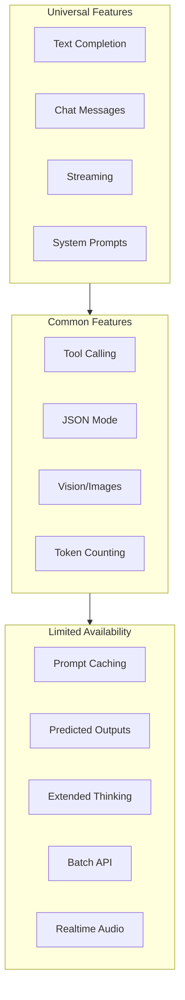

# Feature Parity Considerations

## Introduction

Different AI providers offer varying capabilities. Feature parity management ensures your application adapts gracefully when features aren't universally available, enabling consistent user experiences across providers.

### What We'll Cover

- Feature matrix across providers
- Capability detection
- Graceful feature degradation
- Feature-aware routing
- Polyfills for missing features

### Prerequisites

- Provider abstraction concepts
- Understanding of provider APIs

---

## Provider Feature Landscape



---

## Feature Matrix Definition

```python
from dataclasses import dataclass, field
from typing import Optional
from enum import Enum

class FeatureSupport(Enum):
    """Level of feature support."""
    
    FULL = "full"           # Fully supported
    PARTIAL = "partial"     # Supported with limitations
    POLYFILL = "polyfill"   # Can be simulated
    NONE = "none"           # Not available


@dataclass
class FeatureInfo:
    """Information about a specific feature."""
    
    name: str
    support: FeatureSupport
    min_version: Optional[str] = None
    models: list[str] = field(default_factory=list)  # Models that support it
    notes: str = ""


@dataclass
class ProviderFeatures:
    """Complete feature matrix for a provider."""
    
    provider_name: str
    features: dict[str, FeatureInfo] = field(default_factory=dict)
    
    def supports(self, feature_name: str) -> bool:
        """Check if feature is supported (full or partial)."""
        info = self.features.get(feature_name)
        if not info:
            return False
        return info.support in (FeatureSupport.FULL, FeatureSupport.PARTIAL)
    
    def get_support_level(self, feature_name: str) -> FeatureSupport:
        """Get feature support level."""
        info = self.features.get(feature_name)
        return info.support if info else FeatureSupport.NONE
    
    def get_models_with_feature(self, feature_name: str) -> list[str]:
        """Get models that support a feature."""
        info = self.features.get(feature_name)
        return info.models if info else []


# Define feature matrices
OPENAI_FEATURES = ProviderFeatures(
    provider_name="openai",
    features={
        "chat_completion": FeatureInfo(
            name="chat_completion",
            support=FeatureSupport.FULL,
            models=["gpt-4.1", "gpt-4.1-mini", "gpt-4.1-nano", "o3", "o4-mini"]
        ),
        "streaming": FeatureInfo(
            name="streaming",
            support=FeatureSupport.FULL,
            models=["gpt-4.1", "gpt-4.1-mini", "gpt-4.1-nano"]
        ),
        "tool_calling": FeatureInfo(
            name="tool_calling",
            support=FeatureSupport.FULL,
            models=["gpt-4.1", "gpt-4.1-mini", "gpt-4.1-nano"]
        ),
        "vision": FeatureInfo(
            name="vision",
            support=FeatureSupport.FULL,
            models=["gpt-4.1", "gpt-4.1-mini", "o3", "o4-mini"]
        ),
        "structured_output": FeatureInfo(
            name="structured_output",
            support=FeatureSupport.FULL,
            notes="response_format with json_schema"
        ),
        "prompt_caching": FeatureInfo(
            name="prompt_caching",
            support=FeatureSupport.FULL,
            notes="Automatic, 50% discount on cached tokens"
        ),
        "predicted_outputs": FeatureInfo(
            name="predicted_outputs",
            support=FeatureSupport.FULL,
            models=["gpt-4.1", "gpt-4.1-mini"],
            notes="prediction parameter for code editing"
        ),
        "batch_api": FeatureInfo(
            name="batch_api",
            support=FeatureSupport.FULL,
            notes="50% discount, 24-hour completion"
        ),
        "realtime_audio": FeatureInfo(
            name="realtime_audio",
            support=FeatureSupport.FULL,
            models=["gpt-4o-realtime-preview"]
        ),
        "extended_thinking": FeatureInfo(
            name="extended_thinking",
            support=FeatureSupport.PARTIAL,
            models=["o3", "o4-mini"],
            notes="reasoning_effort parameter"
        ),
        "web_search": FeatureInfo(
            name="web_search",
            support=FeatureSupport.FULL,
            models=["gpt-4.1", "gpt-4.1-mini"],
            notes="web_search_options tool"
        )
    }
)


ANTHROPIC_FEATURES = ProviderFeatures(
    provider_name="anthropic",
    features={
        "chat_completion": FeatureInfo(
            name="chat_completion",
            support=FeatureSupport.FULL,
            models=["claude-opus-4-20250514", "claude-sonnet-4-20250514", "claude-3-5-haiku-20241022"]
        ),
        "streaming": FeatureInfo(
            name="streaming",
            support=FeatureSupport.FULL,
            models=["claude-opus-4-20250514", "claude-sonnet-4-20250514", "claude-3-5-haiku-20241022"]
        ),
        "tool_calling": FeatureInfo(
            name="tool_calling",
            support=FeatureSupport.FULL,
            models=["claude-opus-4-20250514", "claude-sonnet-4-20250514", "claude-3-5-haiku-20241022"]
        ),
        "vision": FeatureInfo(
            name="vision",
            support=FeatureSupport.FULL,
            models=["claude-opus-4-20250514", "claude-sonnet-4-20250514", "claude-3-5-haiku-20241022"]
        ),
        "structured_output": FeatureInfo(
            name="structured_output",
            support=FeatureSupport.PARTIAL,
            notes="Via tool_use with specific schema"
        ),
        "prompt_caching": FeatureInfo(
            name="prompt_caching",
            support=FeatureSupport.FULL,
            notes="Explicit cache_control, 90% discount"
        ),
        "extended_thinking": FeatureInfo(
            name="extended_thinking",
            support=FeatureSupport.FULL,
            models=["claude-opus-4-20250514", "claude-sonnet-4-20250514"],
            notes="thinking parameter with budget_tokens"
        ),
        "computer_use": FeatureInfo(
            name="computer_use",
            support=FeatureSupport.FULL,
            models=["claude-sonnet-4-20250514"],
            notes="Desktop automation via tool"
        ),
        "batch_api": FeatureInfo(
            name="batch_api",
            support=FeatureSupport.FULL,
            notes="50% discount via Message Batches API"
        ),
        "predicted_outputs": FeatureInfo(
            name="predicted_outputs",
            support=FeatureSupport.NONE
        ),
        "realtime_audio": FeatureInfo(
            name="realtime_audio",
            support=FeatureSupport.NONE
        )
    }
)


GEMINI_FEATURES = ProviderFeatures(
    provider_name="gemini",
    features={
        "chat_completion": FeatureInfo(
            name="chat_completion",
            support=FeatureSupport.FULL,
            models=["gemini-2.5-pro", "gemini-2.5-flash", "gemini-2.0-flash"]
        ),
        "streaming": FeatureInfo(
            name="streaming",
            support=FeatureSupport.FULL
        ),
        "tool_calling": FeatureInfo(
            name="tool_calling",
            support=FeatureSupport.FULL,
            notes="Function declarations"
        ),
        "vision": FeatureInfo(
            name="vision",
            support=FeatureSupport.FULL,
            notes="Native multimodal"
        ),
        "structured_output": FeatureInfo(
            name="structured_output",
            support=FeatureSupport.FULL,
            notes="response_mime_type: application/json"
        ),
        "prompt_caching": FeatureInfo(
            name="prompt_caching",
            support=FeatureSupport.FULL,
            notes="Context caching API"
        ),
        "extended_thinking": FeatureInfo(
            name="extended_thinking",
            support=FeatureSupport.FULL,
            models=["gemini-2.5-flash-thinking", "gemini-2.5-pro"],
            notes="thinking_config parameter"
        ),
        "grounding": FeatureInfo(
            name="grounding",
            support=FeatureSupport.FULL,
            notes="Google Search grounding"
        )
    }
)
```

---

## Capability Detection

```python
from typing import List, Dict

class CapabilityDetector:
    """Detect and compare provider capabilities."""
    
    def __init__(self):
        self.providers: dict[str, ProviderFeatures] = {
            "openai": OPENAI_FEATURES,
            "anthropic": ANTHROPIC_FEATURES,
            "gemini": GEMINI_FEATURES
        }
    
    def register_provider(self, features: ProviderFeatures):
        """Register a provider's features."""
        self.providers[features.provider_name] = features
    
    def can_use_feature(
        self,
        provider_name: str,
        feature_name: str,
        model: str = None
    ) -> bool:
        """Check if a provider/model can use a feature."""
        
        features = self.providers.get(provider_name)
        if not features:
            return False
        
        info = features.features.get(feature_name)
        if not info:
            return False
        
        if info.support == FeatureSupport.NONE:
            return False
        
        # If model specified, check if it's in the supported list
        if model and info.models:
            return model in info.models
        
        return True
    
    def get_providers_for_feature(self, feature_name: str) -> List[str]:
        """Get all providers that support a feature."""
        
        supporting = []
        
        for name, features in self.providers.items():
            if features.supports(feature_name):
                supporting.append(name)
        
        return supporting
    
    def compare_features(
        self,
        providers: List[str] = None
    ) -> Dict[str, Dict[str, FeatureSupport]]:
        """Compare features across providers."""
        
        if providers is None:
            providers = list(self.providers.keys())
        
        # Get all unique features
        all_features = set()
        for name in providers:
            if name in self.providers:
                all_features.update(self.providers[name].features.keys())
        
        # Build comparison matrix
        matrix = {}
        for feature in sorted(all_features):
            matrix[feature] = {}
            for provider in providers:
                if provider in self.providers:
                    matrix[feature][provider] = self.providers[provider].get_support_level(feature)
                else:
                    matrix[feature][provider] = FeatureSupport.NONE
        
        return matrix
    
    def find_common_features(
        self,
        providers: List[str],
        required_level: FeatureSupport = FeatureSupport.PARTIAL
    ) -> List[str]:
        """Find features supported by all specified providers."""
        
        if not providers:
            return []
        
        # Get features from first provider
        first = self.providers.get(providers[0])
        if not first:
            return []
        
        common = set(first.features.keys())
        
        # Intersect with other providers
        for name in providers[1:]:
            features = self.providers.get(name)
            if features:
                common &= set(features.features.keys())
        
        # Filter by support level
        result = []
        for feature in common:
            all_support = True
            for name in providers:
                level = self.providers[name].get_support_level(feature)
                if level == FeatureSupport.NONE:
                    all_support = False
                    break
                if required_level == FeatureSupport.FULL and level != FeatureSupport.FULL:
                    all_support = False
                    break
            
            if all_support:
                result.append(feature)
        
        return result


# Usage
detector = CapabilityDetector()

# Check specific feature
can_cache = detector.can_use_feature("anthropic", "prompt_caching")
print(f"Anthropic supports caching: {can_cache}")

# Find providers for a feature
thinking_providers = detector.get_providers_for_feature("extended_thinking")
print(f"Extended thinking providers: {thinking_providers}")

# Compare all features
comparison = detector.compare_features(["openai", "anthropic"])
for feature, support in comparison.items():
    openai_level = support["openai"].value
    anthropic_level = support["anthropic"].value
    print(f"{feature}: OpenAI={openai_level}, Anthropic={anthropic_level}")
```

---

## Graceful Feature Degradation

```python
from typing import Callable, Any, Optional
from dataclasses import dataclass

@dataclass
class DegradationResult:
    """Result of feature degradation."""
    
    degraded: bool
    original_feature: str
    fallback_used: Optional[str]
    message: str


class FeatureDegrader:
    """Handle graceful feature degradation."""
    
    def __init__(self, detector: CapabilityDetector):
        self.detector = detector
        self.fallbacks: dict[str, Callable] = {}
        self.polyfills: dict[str, Callable] = {}
    
    def register_fallback(
        self,
        feature_name: str,
        fallback_fn: Callable[[Any], Any]
    ):
        """Register a fallback for a feature."""
        self.fallbacks[feature_name] = fallback_fn
    
    def register_polyfill(
        self,
        feature_name: str,
        polyfill_fn: Callable[[Any], Any]
    ):
        """Register a polyfill implementation."""
        self.polyfills[feature_name] = polyfill_fn
    
    def use_feature(
        self,
        provider_name: str,
        feature_name: str,
        native_fn: Callable,
        *args,
        **kwargs
    ) -> tuple[Any, DegradationResult]:
        """Use a feature with automatic degradation."""
        
        support = self.detector.providers.get(provider_name, ProviderFeatures(provider_name))
        level = support.get_support_level(feature_name)
        
        if level == FeatureSupport.FULL:
            # Use native implementation
            result = native_fn(*args, **kwargs)
            return result, DegradationResult(
                degraded=False,
                original_feature=feature_name,
                fallback_used=None,
                message="Native feature used"
            )
        
        elif level == FeatureSupport.PARTIAL:
            # Use native with warning
            result = native_fn(*args, **kwargs)
            return result, DegradationResult(
                degraded=True,
                original_feature=feature_name,
                fallback_used=None,
                message="Partial support - some limitations may apply"
            )
        
        elif level == FeatureSupport.POLYFILL or feature_name in self.polyfills:
            # Use polyfill
            if feature_name in self.polyfills:
                result = self.polyfills[feature_name](*args, **kwargs)
                return result, DegradationResult(
                    degraded=True,
                    original_feature=feature_name,
                    fallback_used="polyfill",
                    message=f"Polyfill used for {feature_name}"
                )
        
        # Use fallback if available
        if feature_name in self.fallbacks:
            result = self.fallbacks[feature_name](*args, **kwargs)
            return result, DegradationResult(
                degraded=True,
                original_feature=feature_name,
                fallback_used="fallback",
                message=f"Fallback used - {feature_name} not supported"
            )
        
        # No fallback available
        raise NotImplementedError(
            f"Feature '{feature_name}' not supported by {provider_name} "
            f"and no fallback registered"
        )


# Example fallbacks
def structured_output_fallback(
    messages: list,
    schema: dict,
    client: Any
) -> dict:
    """Fallback for structured output - use prompt engineering."""
    
    # Add schema to prompt
    schema_prompt = f"""
Respond ONLY with valid JSON matching this schema:
{schema}

Do not include any other text, only the JSON object.
"""
    
    enhanced_messages = messages.copy()
    if enhanced_messages and enhanced_messages[-1].get("role") == "user":
        enhanced_messages[-1]["content"] += "\n\n" + schema_prompt
    else:
        enhanced_messages.append({"role": "user", "content": schema_prompt})
    
    response = client.complete(enhanced_messages)
    
    # Parse JSON from response
    import json
    return json.loads(response.content)


def extended_thinking_fallback(
    messages: list,
    client: Any
) -> str:
    """Fallback for extended thinking - use chain of thought prompt."""
    
    cot_prompt = """
Before answering, think through this step-by-step:
1. What is being asked?
2. What are the key considerations?
3. What is the logical approach?
4. What is the answer?

Show your thinking process, then provide the final answer.
"""
    
    enhanced_messages = messages.copy()
    if enhanced_messages:
        first_msg = enhanced_messages[0]
        if first_msg.get("role") == "system":
            first_msg["content"] += "\n\n" + cot_prompt
        else:
            enhanced_messages.insert(0, {"role": "system", "content": cot_prompt})
    
    return client.complete(enhanced_messages)


# Register fallbacks
degrader = FeatureDegrader(detector)
degrader.register_fallback("structured_output", structured_output_fallback)
degrader.register_fallback("extended_thinking", extended_thinking_fallback)
```

---

## Feature-Aware Request Builder

```python
from dataclasses import dataclass, field
from typing import Any, Optional

@dataclass
class FeatureRequest:
    """Request with feature requirements."""
    
    messages: list
    required_features: list[str] = field(default_factory=list)
    preferred_features: list[str] = field(default_factory=list)
    model: Optional[str] = None
    
    # Feature-specific params
    tools: Optional[list] = None
    response_format: Optional[dict] = None
    thinking_budget: Optional[int] = None
    cache_control: Optional[dict] = None


class FeatureAwareBuilder:
    """Build provider-specific requests based on features."""
    
    def __init__(self, detector: CapabilityDetector):
        self.detector = detector
    
    def build_openai_request(
        self,
        request: FeatureRequest
    ) -> dict:
        """Build OpenAI-compatible request."""
        
        params = {
            "messages": request.messages,
        }
        
        if request.model:
            params["model"] = request.model
        
        # Tool calling
        if request.tools and "tool_calling" in request.required_features:
            if self.detector.can_use_feature("openai", "tool_calling", request.model):
                params["tools"] = request.tools
        
        # Structured output
        if request.response_format and "structured_output" in request.required_features:
            if self.detector.can_use_feature("openai", "structured_output", request.model):
                params["response_format"] = request.response_format
        
        # Extended thinking (for o3/o4-mini)
        if request.thinking_budget and "extended_thinking" in request.required_features:
            if self.detector.can_use_feature("openai", "extended_thinking", request.model):
                # OpenAI uses reasoning_effort
                if request.thinking_budget > 10000:
                    params["reasoning_effort"] = "high"
                elif request.thinking_budget > 5000:
                    params["reasoning_effort"] = "medium"
                else:
                    params["reasoning_effort"] = "low"
        
        return params
    
    def build_anthropic_request(
        self,
        request: FeatureRequest
    ) -> dict:
        """Build Anthropic-compatible request."""
        
        # Extract system message
        system = None
        messages = []
        
        for msg in request.messages:
            if msg.get("role") == "system":
                system = msg.get("content", "")
            else:
                messages.append(msg)
        
        params = {
            "messages": messages,
        }
        
        if system:
            params["system"] = system
        
        if request.model:
            params["model"] = request.model
        
        # Tool calling
        if request.tools and "tool_calling" in request.required_features:
            if self.detector.can_use_feature("anthropic", "tool_calling", request.model):
                # Convert to Anthropic tool format
                params["tools"] = [
                    {
                        "name": t["function"]["name"],
                        "description": t["function"].get("description", ""),
                        "input_schema": t["function"]["parameters"]
                    }
                    for t in request.tools
                ]
        
        # Extended thinking
        if request.thinking_budget and "extended_thinking" in request.required_features:
            if self.detector.can_use_feature("anthropic", "extended_thinking", request.model):
                params["thinking"] = {
                    "type": "enabled",
                    "budget_tokens": request.thinking_budget
                }
        
        # Prompt caching
        if request.cache_control and "prompt_caching" in request.preferred_features:
            if self.detector.can_use_feature("anthropic", "prompt_caching"):
                # Add cache_control to last content block
                if system:
                    params["system"] = [
                        {
                            "type": "text",
                            "text": system,
                            "cache_control": {"type": "ephemeral"}
                        }
                    ]
        
        return params
    
    def select_best_provider(
        self,
        request: FeatureRequest,
        available_providers: list[str]
    ) -> tuple[str, list[str]]:
        """
        Select best provider for request.
        
        Returns: (provider_name, list of unsupported required features)
        """
        
        best_provider = None
        best_missing = None
        
        for provider in available_providers:
            features = self.detector.providers.get(provider)
            if not features:
                continue
            
            # Check required features
            missing = []
            for feature in request.required_features:
                if not features.supports(feature):
                    # Check if model-specific
                    if request.model:
                        info = features.features.get(feature)
                        if info and request.model not in info.models:
                            missing.append(feature)
                    else:
                        missing.append(feature)
            
            # Count preferred features
            preferred_count = sum(
                1 for f in request.preferred_features
                if features.supports(f)
            )
            
            # Select provider with fewest missing required features
            if best_provider is None or len(missing) < len(best_missing):
                best_provider = provider
                best_missing = missing
            elif len(missing) == len(best_missing):
                # Tie-break on preferred features
                current_preferred = sum(
                    1 for f in request.preferred_features
                    if self.detector.providers[best_provider].supports(f)
                )
                if preferred_count > current_preferred:
                    best_provider = provider
                    best_missing = missing
        
        return best_provider, best_missing or []


# Usage
builder = FeatureAwareBuilder(detector)

# Create a request with features
request = FeatureRequest(
    messages=[
        {"role": "system", "content": "You are a helpful assistant."},
        {"role": "user", "content": "Solve this math problem step by step."}
    ],
    required_features=["extended_thinking", "streaming"],
    preferred_features=["prompt_caching"],
    thinking_budget=10000
)

# Find best provider
provider, missing = builder.select_best_provider(
    request,
    ["openai", "anthropic", "gemini"]
)

print(f"Best provider: {provider}")
if missing:
    print(f"Missing features: {missing}")

# Build provider-specific request
if provider == "anthropic":
    api_params = builder.build_anthropic_request(request)
elif provider == "openai":
    api_params = builder.build_openai_request(request)

print(f"API params: {api_params}")
```

---

## Feature Polyfills

```python
import json
from typing import Any, AsyncIterator

class FeaturePolyfills:
    """Polyfill implementations for missing features."""
    
    @staticmethod
    def polyfill_structured_output(
        client: Any,
        messages: list,
        schema: dict,
        max_retries: int = 3
    ) -> dict:
        """
        Polyfill for structured output via prompt engineering.
        Works with any provider.
        """
        
        schema_str = json.dumps(schema, indent=2)
        
        instruction = f"""
You must respond with ONLY valid JSON that matches this exact schema:

```json
{schema_str}
```

Rules:
1. Return ONLY the JSON object, no other text
2. All required fields must be present
3. Field types must match exactly
4. No trailing commas or syntax errors

Your JSON response:"""
        
        enhanced_messages = messages.copy()
        enhanced_messages.append({"role": "user", "content": instruction})
        
        for attempt in range(max_retries):
            response = client.complete(enhanced_messages)
            content = response.content.strip()
            
            # Clean up common issues
            if content.startswith("```json"):
                content = content[7:]
            if content.startswith("```"):
                content = content[3:]
            if content.endswith("```"):
                content = content[:-3]
            content = content.strip()
            
            try:
                result = json.loads(content)
                return result
            except json.JSONDecodeError as e:
                if attempt == max_retries - 1:
                    raise ValueError(f"Failed to get valid JSON after {max_retries} attempts: {e}")
                
                # Add error feedback
                enhanced_messages.append({
                    "role": "assistant",
                    "content": content
                })
                enhanced_messages.append({
                    "role": "user", 
                    "content": f"That JSON was invalid: {e}. Please try again with valid JSON only."
                })
    
    @staticmethod
    async def polyfill_streaming(
        client: Any,
        messages: list,
        chunk_size: int = 20
    ) -> AsyncIterator[str]:
        """
        Polyfill streaming for providers without native streaming.
        Simulates streaming by chunking the response.
        """
        
        response = await client.complete(messages)
        content = response.content
        
        # Yield in chunks
        for i in range(0, len(content), chunk_size):
            yield content[i:i + chunk_size]
            await asyncio.sleep(0.01)  # Simulate streaming delay
    
    @staticmethod
    def polyfill_tool_calling(
        client: Any,
        messages: list,
        tools: list[dict]
    ) -> dict:
        """
        Polyfill tool calling via prompt engineering.
        Returns parsed tool call or text response.
        """
        
        tools_description = []
        for tool in tools:
            func = tool.get("function", {})
            tools_description.append({
                "name": func.get("name"),
                "description": func.get("description"),
                "parameters": func.get("parameters")
            })
        
        tools_str = json.dumps(tools_description, indent=2)
        
        instruction = f"""
You have access to these tools:

{tools_str}

If you need to use a tool, respond with ONLY this JSON format:
{{"tool_call": {{"name": "tool_name", "arguments": {{...}}}}}}

If you don't need a tool, respond normally with text.
"""
        
        enhanced_messages = messages.copy()
        if enhanced_messages and enhanced_messages[0].get("role") == "system":
            enhanced_messages[0]["content"] += "\n\n" + instruction
        else:
            enhanced_messages.insert(0, {"role": "system", "content": instruction})
        
        response = client.complete(enhanced_messages)
        content = response.content.strip()
        
        # Try to parse as tool call
        try:
            parsed = json.loads(content)
            if "tool_call" in parsed:
                return {
                    "type": "tool_call",
                    "tool_call": parsed["tool_call"]
                }
        except json.JSONDecodeError:
            pass
        
        return {
            "type": "text",
            "content": content
        }
    
    @staticmethod
    def polyfill_vision(
        client: Any,
        messages: list,
        image_url: str
    ) -> str:
        """
        Polyfill vision for non-vision models.
        Falls back to describing that image analysis is unavailable.
        """
        
        # This is a limited polyfill - we can't actually analyze images
        # without vision capability, but we can handle the request gracefully
        
        fallback_message = (
            "I apologize, but I'm currently unable to analyze images. "
            "Please describe the image content in text, or try again with "
            "a vision-capable model."
        )
        
        # Extract text-only parts of the request
        text_messages = []
        for msg in messages:
            content = msg.get("content")
            if isinstance(content, str):
                text_messages.append(msg)
            elif isinstance(content, list):
                # Extract text parts only
                text_parts = [
                    p.get("text", "") for p in content
                    if p.get("type") == "text"
                ]
                if text_parts:
                    text_messages.append({
                        "role": msg["role"],
                        "content": " ".join(text_parts)
                    })
        
        if text_messages:
            # Try to respond to text content
            response = client.complete(text_messages)
            return response.content + "\n\n" + fallback_message
        
        return fallback_message
```

---

## Hands-on Exercise

### Your Task

Create a feature compatibility layer that automatically adapts requests.

### Requirements

1. Detect required features from request content
2. Select provider based on feature availability
3. Apply polyfills when needed
4. Return compatibility report

### Expected Result

```python
adapter = FeatureAdapter(providers)

request = {
    "messages": [...],
    "tools": [...],  # Requires tool calling
    "response_format": {"type": "json"}  # Requires structured output
}

result = adapter.execute(request)
print(result.compatibility_report)
# {
#   "provider_used": "anthropic",
#   "features_native": ["tool_calling"],
#   "features_polyfilled": ["structured_output"],
#   "features_unavailable": []
# }
```

<details>
<summary>💡 Hints</summary>

- Analyze request dict to detect features
- Use CapabilityDetector to check availability
- Track which polyfills were applied
</details>

<details>
<summary>✅ Solution</summary>

```python
from dataclasses import dataclass, field
from typing import Any, Optional

@dataclass
class CompatibilityReport:
    """Report on feature compatibility."""
    
    provider_used: str
    features_native: list[str] = field(default_factory=list)
    features_polyfilled: list[str] = field(default_factory=list)
    features_unavailable: list[str] = field(default_factory=list)
    warnings: list[str] = field(default_factory=list)


@dataclass
class AdaptedResult:
    """Result from adapted execution."""
    
    response: Any
    compatibility_report: CompatibilityReport


class FeatureAdapter:
    """Automatically adapt requests for provider compatibility."""
    
    def __init__(
        self,
        providers: dict[str, Any],
        detector: CapabilityDetector = None
    ):
        self.providers = providers
        self.detector = detector or CapabilityDetector()
        self.polyfills = FeaturePolyfills()
    
    def detect_features(self, request: dict) -> list[str]:
        """Detect required features from request."""
        
        features = []
        
        # Always need basic completion
        features.append("chat_completion")
        
        # Tool calling
        if request.get("tools"):
            features.append("tool_calling")
        
        # Structured output
        if request.get("response_format"):
            rf = request["response_format"]
            if rf.get("type") in ("json_object", "json_schema"):
                features.append("structured_output")
        
        # Vision
        messages = request.get("messages", [])
        for msg in messages:
            content = msg.get("content")
            if isinstance(content, list):
                for part in content:
                    if part.get("type") == "image_url":
                        features.append("vision")
                        break
        
        # Streaming
        if request.get("stream"):
            features.append("streaming")
        
        # Extended thinking
        if request.get("thinking") or request.get("reasoning_effort"):
            features.append("extended_thinking")
        
        return list(set(features))
    
    def select_provider(
        self,
        features: list[str],
        preferred: str = None
    ) -> tuple[str, list[str], list[str]]:
        """
        Select best provider for features.
        
        Returns: (provider, native_features, missing_features)
        """
        
        best_provider = None
        best_native = []
        best_missing = features.copy()
        
        # Check preferred first
        providers_to_check = list(self.providers.keys())
        if preferred and preferred in providers_to_check:
            providers_to_check.remove(preferred)
            providers_to_check.insert(0, preferred)
        
        for provider_name in providers_to_check:
            native = []
            missing = []
            
            for feature in features:
                if self.detector.can_use_feature(provider_name, feature):
                    native.append(feature)
                else:
                    missing.append(feature)
            
            # Better if more native features
            if len(native) > len(best_native):
                best_provider = provider_name
                best_native = native
                best_missing = missing
            elif len(native) == len(best_native) and provider_name == preferred:
                best_provider = provider_name
                best_native = native
                best_missing = missing
        
        return best_provider, best_native, best_missing
    
    def apply_polyfills(
        self,
        request: dict,
        missing_features: list[str],
        client: Any
    ) -> tuple[dict, list[str], list[str]]:
        """
        Apply polyfills for missing features.
        
        Returns: (modified_request, polyfilled_features, unavailable_features)
        """
        
        polyfilled = []
        unavailable = []
        modified = request.copy()
        
        for feature in missing_features:
            if feature == "structured_output" and request.get("response_format"):
                # We'll handle this in execution
                polyfilled.append(feature)
                del modified["response_format"]
            
            elif feature == "tool_calling" and request.get("tools"):
                # We'll handle this in execution
                polyfilled.append(feature)
                del modified["tools"]
            
            elif feature == "streaming" and request.get("stream"):
                # We can polyfill streaming
                polyfilled.append(feature)
                modified["stream"] = False
            
            elif feature == "vision":
                # Vision can't be fully polyfilled
                unavailable.append(feature)
            
            else:
                unavailable.append(feature)
        
        return modified, polyfilled, unavailable
    
    def execute(
        self,
        request: dict,
        preferred_provider: str = None
    ) -> AdaptedResult:
        """Execute request with automatic adaptation."""
        
        # Detect required features
        features = self.detect_features(request)
        
        # Select best provider
        provider_name, native, missing = self.select_provider(
            features,
            preferred_provider
        )
        
        if not provider_name:
            raise ValueError("No suitable provider found")
        
        client = self.providers[provider_name]
        
        # Apply polyfills
        modified_request, polyfilled, unavailable = self.apply_polyfills(
            request,
            missing,
            client
        )
        
        # Build compatibility report
        report = CompatibilityReport(
            provider_used=provider_name,
            features_native=native,
            features_polyfilled=polyfilled,
            features_unavailable=unavailable
        )
        
        if unavailable:
            report.warnings.append(
                f"Features not available: {unavailable}"
            )
        
        # Execute with polyfills
        messages = modified_request.get("messages", [])
        
        # Handle polyfilled structured output
        if "structured_output" in polyfilled:
            schema = request.get("response_format", {}).get("json_schema", {})
            response = self.polyfills.polyfill_structured_output(
                client,
                messages,
                schema
            )
        
        # Handle polyfilled tool calling
        elif "tool_calling" in polyfilled:
            tools = request.get("tools", [])
            response = self.polyfills.polyfill_tool_calling(
                client,
                messages,
                tools
            )
        
        # Normal execution
        else:
            response = client.complete(messages, **modified_request)
        
        return AdaptedResult(
            response=response,
            compatibility_report=report
        )


# Usage
adapter = FeatureAdapter({
    "openai": openai_client,
    "anthropic": anthropic_client,
    "ollama": ollama_client
})

request = {
    "messages": [
        {"role": "user", "content": "Get the weather for NYC"}
    ],
    "tools": [
        {
            "type": "function",
            "function": {
                "name": "get_weather",
                "description": "Get weather for a location",
                "parameters": {
                    "type": "object",
                    "properties": {
                        "location": {"type": "string"}
                    }
                }
            }
        }
    ],
    "response_format": {"type": "json_object"}
}

result = adapter.execute(request)

print(f"Provider: {result.compatibility_report.provider_used}")
print(f"Native: {result.compatibility_report.features_native}")
print(f"Polyfilled: {result.compatibility_report.features_polyfilled}")
print(f"Unavailable: {result.compatibility_report.features_unavailable}")
print(f"Response: {result.response}")
```

</details>

---

## Summary

✅ Feature matrices document provider capabilities precisely  
✅ Capability detection enables informed routing decisions  
✅ Graceful degradation maintains functionality across providers  
✅ Polyfills simulate features when native support is missing  
✅ Feature-aware routing matches requests to capable providers

**Next:** [OpenAI-Compatible APIs](./06-openai-compatibility.md)

---

## Further Reading

- [OpenAI API Reference](https://platform.openai.com/docs/api-reference) — Feature details
- [Anthropic API Reference](https://docs.anthropic.com/en/api) — Feature documentation
- [Google AI Gemini](https://ai.google.dev/docs) — Capability reference

<!-- 
Sources Consulted:
- OpenAI API: https://platform.openai.com/docs/api-reference
- Anthropic API: https://docs.anthropic.com/en/api
- Google Gemini: https://ai.google.dev/gemini-api/docs
- Model comparison: https://artificialanalysis.ai/
-->
