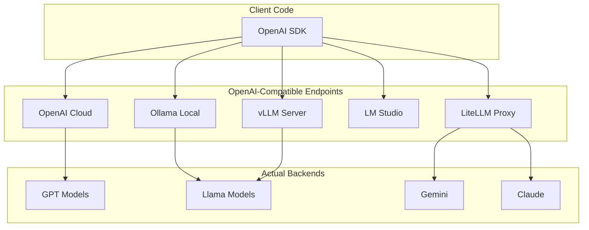

# OpenAI-Compatible API Standards

## Introduction

OpenAI's API format has become a de-facto standard, with many providers offering compatible endpoints. This enables using the same client code across cloud services and local models.

### What We'll Cover

- OpenAI API format as standard
- Local models with OpenAI compatibility
- Ollama integration
- vLLM deployment
- LiteLLM as a proxy
- Gemini compatibility layer

### Prerequisites

- Understanding of OpenAI API format
- Provider abstraction concepts

---

## OpenAI API Standard



---

## Core API Structure

```python
# The OpenAI API format that has become a standard
"""
POST /v1/chat/completions
{
    "model": "gpt-4.1",
    "messages": [
        {"role": "system", "content": "You are helpful."},
        {"role": "user", "content": "Hello!"}
    ],
    "temperature": 0.7,
    "max_tokens": 1000,
    "stream": false
}

Response:
{
    "id": "chatcmpl-xxx",
    "object": "chat.completion",
    "created": 1234567890,
    "model": "gpt-4.1",
    "choices": [{
        "index": 0,
        "message": {
            "role": "assistant",
            "content": "Hello! How can I help you?"
        },
        "finish_reason": "stop"
    }],
    "usage": {
        "prompt_tokens": 10,
        "completion_tokens": 8,
        "total_tokens": 18
    }
}
"""

# Using OpenAI SDK with any compatible endpoint
from openai import OpenAI

def create_compatible_client(
    base_url: str,
    api_key: str = "not-needed"
) -> OpenAI:
    """Create OpenAI client for any compatible endpoint."""
    return OpenAI(
        base_url=base_url,
        api_key=api_key
    )


# Examples of compatible endpoints
COMPATIBLE_ENDPOINTS = {
    "openai": "https://api.openai.com/v1",
    "ollama": "http://localhost:11434/v1",
    "vllm": "http://localhost:8000/v1",
    "lmstudio": "http://localhost:1234/v1",
    "together": "https://api.together.xyz/v1",
    "groq": "https://api.groq.com/openai/v1",
    "deepseek": "https://api.deepseek.com/v1",
    "fireworks": "https://api.fireworks.ai/inference/v1",
}
```

---

## Ollama Integration

```python
from openai import OpenAI
from typing import Optional, Iterator
import httpx

class OllamaClient:
    """OpenAI-compatible client for Ollama."""
    
    def __init__(
        self,
        host: str = "http://localhost:11434",
        timeout: float = 120.0
    ):
        self.host = host
        self.client = OpenAI(
            base_url=f"{host}/v1",
            api_key="ollama",  # Ollama doesn't need a real key
            timeout=httpx.Timeout(timeout)
        )
        
        # Native Ollama client for extra features
        self._native_base = host
    
    def list_models(self) -> list[str]:
        """List available models using native API."""
        import requests
        response = requests.get(f"{self._native_base}/api/tags")
        data = response.json()
        return [m["name"] for m in data.get("models", [])]
    
    def pull_model(self, model: str) -> bool:
        """Pull a model using native API."""
        import requests
        response = requests.post(
            f"{self._native_base}/api/pull",
            json={"name": model},
            stream=True
        )
        
        for line in response.iter_lines():
            if line:
                import json
                status = json.loads(line)
                print(f"Pulling {model}: {status.get('status', '')}")
        
        return response.status_code == 200
    
    def complete(
        self,
        messages: list,
        model: str = "llama3.2",
        **kwargs
    ):
        """Chat completion using OpenAI-compatible endpoint."""
        
        # Map common parameters
        params = {
            "model": model,
            "messages": messages,
        }
        
        # Ollama-specific: handle keep_alive
        if "keep_alive" in kwargs:
            # This needs native API, remove from OpenAI params
            del kwargs["keep_alive"]
        
        params.update(kwargs)
        
        return self.client.chat.completions.create(**params)
    
    def stream(
        self,
        messages: list,
        model: str = "llama3.2",
        **kwargs
    ) -> Iterator:
        """Streaming completion."""
        
        params = {
            "model": model,
            "messages": messages,
            "stream": True
        }
        params.update(kwargs)
        
        return self.client.chat.completions.create(**params)
    
    def embed(
        self,
        text: str,
        model: str = "nomic-embed-text"
    ) -> list[float]:
        """Get embeddings using OpenAI-compatible endpoint."""
        
        response = self.client.embeddings.create(
            model=model,
            input=text
        )
        
        return response.data[0].embedding


# Usage
ollama = OllamaClient()

# List available models
print("Available models:", ollama.list_models())

# Pull a model if needed
# ollama.pull_model("llama3.2")

# Chat completion
response = ollama.complete(
    messages=[{"role": "user", "content": "Hello!"}],
    model="llama3.2"
)
print(response.choices[0].message.content)

# Streaming
for chunk in ollama.stream(
    messages=[{"role": "user", "content": "Tell me a short story"}],
    model="llama3.2"
):
    if chunk.choices[0].delta.content:
        print(chunk.choices[0].delta.content, end="", flush=True)
```

---

## vLLM Integration

```python
from openai import OpenAI
from typing import Optional
import subprocess
import time

class VLLMClient:
    """OpenAI-compatible client for vLLM."""
    
    def __init__(
        self,
        host: str = "http://localhost:8000",
        api_key: str = "token-abc123"  # vLLM API key if configured
    ):
        self.host = host
        self.client = OpenAI(
            base_url=f"{host}/v1",
            api_key=api_key
        )
    
    @staticmethod
    def start_server(
        model: str,
        port: int = 8000,
        tensor_parallel_size: int = 1,
        gpu_memory_utilization: float = 0.9,
        max_model_len: int = 4096
    ) -> subprocess.Popen:
        """Start vLLM server."""
        
        cmd = [
            "python", "-m", "vllm.entrypoints.openai.api_server",
            "--model", model,
            "--port", str(port),
            "--tensor-parallel-size", str(tensor_parallel_size),
            "--gpu-memory-utilization", str(gpu_memory_utilization),
            "--max-model-len", str(max_model_len)
        ]
        
        process = subprocess.Popen(
            cmd,
            stdout=subprocess.PIPE,
            stderr=subprocess.PIPE
        )
        
        # Wait for server to start
        time.sleep(30)  # vLLM takes time to load model
        
        return process
    
    def list_models(self) -> list[str]:
        """List available models."""
        models = self.client.models.list()
        return [m.id for m in models.data]
    
    def complete(
        self,
        messages: list,
        model: str = None,
        **kwargs
    ):
        """Chat completion."""
        
        # Use first available model if not specified
        if model is None:
            models = self.list_models()
            model = models[0] if models else "default"
        
        # vLLM-specific parameters
        extra_body = {}
        
        # Best-of sampling
        if "best_of" in kwargs:
            extra_body["best_of"] = kwargs.pop("best_of")
        
        # Use beam search
        if "use_beam_search" in kwargs:
            extra_body["use_beam_search"] = kwargs.pop("use_beam_search")
        
        # Top-k sampling
        if "top_k" in kwargs:
            extra_body["top_k"] = kwargs.pop("top_k")
        
        params = {
            "model": model,
            "messages": messages,
            **kwargs
        }
        
        if extra_body:
            params["extra_body"] = extra_body
        
        return self.client.chat.completions.create(**params)
    
    def stream(
        self,
        messages: list,
        model: str = None,
        **kwargs
    ):
        """Streaming completion."""
        
        if model is None:
            models = self.list_models()
            model = models[0] if models else "default"
        
        return self.client.chat.completions.create(
            model=model,
            messages=messages,
            stream=True,
            **kwargs
        )


# Usage
vllm = VLLMClient()

# Chat completion with vLLM-specific params
response = vllm.complete(
    messages=[{"role": "user", "content": "Explain quantum computing"}],
    temperature=0.7,
    best_of=3,  # vLLM-specific: return best of 3 samples
    top_k=50    # vLLM-specific: top-k sampling
)

print(response.choices[0].message.content)
```

---

## LiteLLM Proxy

```python
"""
LiteLLM provides a unified OpenAI-compatible proxy for 100+ LLMs.
"""

from openai import OpenAI
import subprocess
import yaml

# LiteLLM config file
LITELLM_CONFIG = """
model_list:
  - model_name: gpt-4
    litellm_params:
      model: openai/gpt-4.1
      api_key: os.environ/OPENAI_API_KEY
      
  - model_name: claude-3
    litellm_params:
      model: anthropic/claude-sonnet-4-20250514
      api_key: os.environ/ANTHROPIC_API_KEY
      
  - model_name: gemini-pro
    litellm_params:
      model: gemini/gemini-2.5-pro
      api_key: os.environ/GOOGLE_API_KEY
      
  - model_name: llama-local
    litellm_params:
      model: ollama/llama3.2
      api_base: http://localhost:11434

router_settings:
  routing_strategy: least-busy
  num_retries: 3
  timeout: 60
  
general_settings:
  master_key: sk-litellm-master-key
"""


class LiteLLMProxy:
    """Client for LiteLLM proxy."""
    
    def __init__(
        self,
        host: str = "http://localhost:4000",
        api_key: str = "sk-litellm-master-key"
    ):
        self.host = host
        self.client = OpenAI(
            base_url=f"{host}/v1",
            api_key=api_key
        )
    
    @staticmethod
    def write_config(config_path: str = "litellm_config.yaml"):
        """Write LiteLLM config file."""
        with open(config_path, "w") as f:
            f.write(LITELLM_CONFIG)
    
    @staticmethod
    def start_server(
        config_path: str = "litellm_config.yaml",
        port: int = 4000
    ) -> subprocess.Popen:
        """Start LiteLLM proxy server."""
        
        cmd = [
            "litellm",
            "--config", config_path,
            "--port", str(port)
        ]
        
        return subprocess.Popen(
            cmd,
            stdout=subprocess.PIPE,
            stderr=subprocess.PIPE
        )
    
    def complete(
        self,
        messages: list,
        model: str = "gpt-4",
        **kwargs
    ):
        """Chat completion through proxy."""
        
        return self.client.chat.completions.create(
            model=model,
            messages=messages,
            **kwargs
        )
    
    def complete_with_fallback(
        self,
        messages: list,
        models: list[str],
        **kwargs
    ):
        """Try multiple models with automatic fallback."""
        
        # LiteLLM supports fallback via model parameter
        # Format: "model1,model2,model3"
        model_string = ",".join(models)
        
        return self.client.chat.completions.create(
            model=model_string,
            messages=messages,
            **kwargs
        )
    
    def embed(
        self,
        text: str,
        model: str = "text-embedding-ada-002"
    ) -> list[float]:
        """Get embeddings through proxy."""
        
        response = self.client.embeddings.create(
            model=model,
            input=text
        )
        
        return response.data[0].embedding


# Usage
"""
# Start LiteLLM proxy
LiteLLMProxy.write_config()
process = LiteLLMProxy.start_server()

# Use proxy
proxy = LiteLLMProxy()

# Request goes to configured backend
response = proxy.complete(
    messages=[{"role": "user", "content": "Hello!"}],
    model="gpt-4"  # Maps to openai/gpt-4.1
)

# Or with fallback
response = proxy.complete_with_fallback(
    messages=[{"role": "user", "content": "Hello!"}],
    models=["gpt-4", "claude-3", "llama-local"]
)
"""
```

---

## Gemini Compatibility

```python
from openai import OpenAI
from typing import Optional

class GeminiOpenAIClient:
    """Use Gemini with OpenAI SDK via compatibility layer."""
    
    def __init__(self, api_key: str = None):
        import os
        api_key = api_key or os.environ.get("GOOGLE_API_KEY")
        
        # Gemini provides OpenAI-compatible endpoint
        self.client = OpenAI(
            base_url="https://generativelanguage.googleapis.com/v1beta/openai/",
            api_key=api_key
        )
    
    def complete(
        self,
        messages: list,
        model: str = "gemini-2.0-flash",
        **kwargs
    ):
        """Chat completion using OpenAI-compatible endpoint."""
        
        # Map OpenAI params to Gemini-supported ones
        supported_params = {
            "temperature",
            "max_tokens",
            "top_p",
            "stop",
            "stream",
            "n"
        }
        
        params = {
            "model": model,
            "messages": messages
        }
        
        for key, value in kwargs.items():
            if key in supported_params:
                params[key] = value
        
        return self.client.chat.completions.create(**params)
    
    def stream(
        self,
        messages: list,
        model: str = "gemini-2.0-flash",
        **kwargs
    ):
        """Streaming completion."""
        
        return self.complete(
            messages,
            model,
            stream=True,
            **kwargs
        )
    
    def embed(
        self,
        text: str,
        model: str = "text-embedding-004"
    ) -> list[float]:
        """Get embeddings."""
        
        response = self.client.embeddings.create(
            model=model,
            input=text
        )
        
        return response.data[0].embedding


# Usage
gemini = GeminiOpenAIClient()

response = gemini.complete(
    messages=[{"role": "user", "content": "Hello!"}],
    model="gemini-2.0-flash"
)

print(response.choices[0].message.content)
```

---

## Unified Compatible Client

```python
from dataclasses import dataclass
from typing import Optional, Iterator
from enum import Enum
from openai import OpenAI

class ProviderType(Enum):
    OPENAI = "openai"
    OLLAMA = "ollama"
    VLLM = "vllm"
    LITELLM = "litellm"
    GEMINI = "gemini"
    GROQ = "groq"
    TOGETHER = "together"
    CUSTOM = "custom"


@dataclass
class ProviderConfig:
    """Configuration for an OpenAI-compatible provider."""
    
    provider_type: ProviderType
    base_url: str
    api_key: str
    default_model: str
    requires_auth: bool = True


# Pre-configured providers
PROVIDER_CONFIGS = {
    "openai": ProviderConfig(
        provider_type=ProviderType.OPENAI,
        base_url="https://api.openai.com/v1",
        api_key="${OPENAI_API_KEY}",
        default_model="gpt-4.1"
    ),
    "ollama": ProviderConfig(
        provider_type=ProviderType.OLLAMA,
        base_url="http://localhost:11434/v1",
        api_key="ollama",
        default_model="llama3.2",
        requires_auth=False
    ),
    "groq": ProviderConfig(
        provider_type=ProviderType.GROQ,
        base_url="https://api.groq.com/openai/v1",
        api_key="${GROQ_API_KEY}",
        default_model="llama-3.3-70b-versatile"
    ),
    "together": ProviderConfig(
        provider_type=ProviderType.TOGETHER,
        base_url="https://api.together.xyz/v1",
        api_key="${TOGETHER_API_KEY}",
        default_model="meta-llama/Llama-3.3-70B-Instruct-Turbo"
    ),
    "gemini": ProviderConfig(
        provider_type=ProviderType.GEMINI,
        base_url="https://generativelanguage.googleapis.com/v1beta/openai/",
        api_key="${GOOGLE_API_KEY}",
        default_model="gemini-2.0-flash"
    )
}


class UnifiedCompatibleClient:
    """Unified client for all OpenAI-compatible providers."""
    
    def __init__(self):
        self._clients: dict[str, OpenAI] = {}
        self._configs: dict[str, ProviderConfig] = {}
    
    def add_provider(
        self,
        name: str,
        config: ProviderConfig = None,
        base_url: str = None,
        api_key: str = None
    ):
        """Add a provider."""
        
        import os
        
        if config is None:
            # Use pre-configured if available
            if name in PROVIDER_CONFIGS:
                config = PROVIDER_CONFIGS[name]
            else:
                if not base_url:
                    raise ValueError(f"No config for {name}, provide base_url")
                config = ProviderConfig(
                    provider_type=ProviderType.CUSTOM,
                    base_url=base_url,
                    api_key=api_key or "not-needed",
                    default_model="default"
                )
        
        # Resolve environment variables in api_key
        resolved_key = config.api_key
        if resolved_key.startswith("${") and resolved_key.endswith("}"):
            env_var = resolved_key[2:-1]
            resolved_key = os.environ.get(env_var, "")
        
        # Override with explicit api_key if provided
        if api_key:
            resolved_key = api_key
        
        self._configs[name] = config
        self._clients[name] = OpenAI(
            base_url=config.base_url,
            api_key=resolved_key
        )
    
    def complete(
        self,
        messages: list,
        provider: str = "openai",
        model: str = None,
        **kwargs
    ):
        """Chat completion from any provider."""
        
        if provider not in self._clients:
            self.add_provider(provider)
        
        client = self._clients[provider]
        config = self._configs[provider]
        model = model or config.default_model
        
        return client.chat.completions.create(
            model=model,
            messages=messages,
            **kwargs
        )
    
    def stream(
        self,
        messages: list,
        provider: str = "openai",
        model: str = None,
        **kwargs
    ) -> Iterator:
        """Streaming completion from any provider."""
        
        return self.complete(
            messages,
            provider=provider,
            model=model,
            stream=True,
            **kwargs
        )
    
    def embed(
        self,
        text: str,
        provider: str = "openai",
        model: str = None
    ) -> list[float]:
        """Get embeddings from any provider."""
        
        if provider not in self._clients:
            self.add_provider(provider)
        
        client = self._clients[provider]
        
        # Default embedding models
        if model is None:
            embedding_models = {
                "openai": "text-embedding-3-small",
                "ollama": "nomic-embed-text",
                "gemini": "text-embedding-004",
                "together": "togethercomputer/m2-bert-80M-8k-retrieval"
            }
            model = embedding_models.get(provider, "default")
        
        response = client.embeddings.create(
            model=model,
            input=text
        )
        
        return response.data[0].embedding
    
    def list_providers(self) -> list[str]:
        """List configured providers."""
        return list(self._clients.keys())
    
    def switch_provider(
        self,
        messages: list,
        preferred_providers: list[str],
        **kwargs
    ):
        """Try providers in order until one succeeds."""
        
        last_error = None
        
        for provider in preferred_providers:
            try:
                return self.complete(messages, provider=provider, **kwargs), provider
            except Exception as e:
                last_error = e
                continue
        
        raise last_error or Exception("All providers failed")


# Usage
client = UnifiedCompatibleClient()

# Add providers
client.add_provider("openai")
client.add_provider("ollama")
client.add_provider("groq")

# Same interface for all
messages = [{"role": "user", "content": "Hello!"}]

# Use OpenAI
response = client.complete(messages, provider="openai")
print(f"OpenAI: {response.choices[0].message.content}")

# Use Ollama (local)
response = client.complete(messages, provider="ollama", model="llama3.2")
print(f"Ollama: {response.choices[0].message.content}")

# Use Groq (fast inference)
response = client.complete(messages, provider="groq")
print(f"Groq: {response.choices[0].message.content}")

# Automatic fallback
response, provider_used = client.switch_provider(
    messages,
    preferred_providers=["ollama", "groq", "openai"]
)
print(f"Used {provider_used}: {response.choices[0].message.content}")
```

---

## Tool Calling Compatibility

```python
from typing import Callable, Any

class ToolCompatibilityLayer:
    """Handle tool calling differences across providers."""
    
    # Providers with OpenAI-style tool calling
    OPENAI_STYLE = {"openai", "groq", "together", "vllm"}
    
    # Providers needing adaptation
    NEEDS_ADAPTATION = {"ollama", "gemini"}
    
    def __init__(self, provider: str):
        self.provider = provider
    
    def format_tools(self, tools: list[dict]) -> list[dict]:
        """Format tools for the provider."""
        
        if self.provider in self.OPENAI_STYLE:
            return tools
        
        if self.provider == "ollama":
            # Ollama uses simplified format
            return [
                {
                    "type": "function",
                    "function": {
                        "name": t["function"]["name"],
                        "description": t["function"].get("description", ""),
                        "parameters": t["function"]["parameters"]
                    }
                }
                for t in tools
            ]
        
        if self.provider == "gemini":
            # Gemini uses function_declarations
            return [
                {
                    "name": t["function"]["name"],
                    "description": t["function"].get("description", ""),
                    "parameters": t["function"]["parameters"]
                }
                for t in tools
            ]
        
        return tools
    
    def parse_tool_calls(self, response) -> list[dict]:
        """Extract tool calls from response."""
        
        message = response.choices[0].message
        
        if not hasattr(message, "tool_calls") or not message.tool_calls:
            return []
        
        tool_calls = []
        
        for tc in message.tool_calls:
            import json
            
            tool_calls.append({
                "id": tc.id,
                "name": tc.function.name,
                "arguments": json.loads(tc.function.arguments)
            })
        
        return tool_calls
    
    def format_tool_result(
        self,
        tool_call_id: str,
        result: Any
    ) -> dict:
        """Format tool result for the provider."""
        
        import json
        
        return {
            "role": "tool",
            "tool_call_id": tool_call_id,
            "content": json.dumps(result) if not isinstance(result, str) else result
        }


# Usage
tools = [
    {
        "type": "function",
        "function": {
            "name": "get_weather",
            "description": "Get weather for a location",
            "parameters": {
                "type": "object",
                "properties": {
                    "location": {"type": "string"}
                },
                "required": ["location"]
            }
        }
    }
]

# Use with any provider
compat = ToolCompatibilityLayer("ollama")
formatted_tools = compat.format_tools(tools)

response = client.complete(
    messages=[{"role": "user", "content": "What's the weather in NYC?"}],
    provider="ollama",
    tools=formatted_tools
)

tool_calls = compat.parse_tool_calls(response)
print(f"Tool calls: {tool_calls}")
```

---

## Hands-on Exercise

### Your Task

Create a provider adapter that normalizes request/response across providers.

### Requirements

1. Accept OpenAI-style requests
2. Adapt to provider-specific requirements
3. Normalize responses to OpenAI format
4. Handle missing features gracefully

### Expected Result

```python
adapter = ProviderAdapter("ollama")

# OpenAI-style request works for any provider
response = adapter.complete(
    messages=[{"role": "user", "content": "Hello!"}],
    model="llama3.2",
    temperature=0.7,
    max_tokens=1000
)

# Response is always OpenAI-format
print(response.choices[0].message.content)
print(response.usage.total_tokens)
```

<details>
<summary>💡 Hints</summary>

- Map parameters that differ between providers
- Handle missing response fields with defaults
- Check provider capabilities before using features
</details>

<details>
<summary>✅ Solution</summary>

```python
from dataclasses import dataclass, field
from typing import Optional, Any
from openai import OpenAI

@dataclass
class AdaptedResponse:
    """OpenAI-compatible response structure."""
    
    id: str = ""
    object: str = "chat.completion"
    created: int = 0
    model: str = ""
    choices: list = field(default_factory=list)
    usage: Optional[dict] = None
    
    @dataclass
    class Choice:
        index: int = 0
        message: dict = field(default_factory=dict)
        finish_reason: str = "stop"
    
    @dataclass
    class Usage:
        prompt_tokens: int = 0
        completion_tokens: int = 0
        total_tokens: int = 0


class ProviderAdapter:
    """Adapt any provider to OpenAI-compatible interface."""
    
    # Parameter mappings per provider
    PARAM_MAPPINGS = {
        "ollama": {
            "max_tokens": "num_predict",
        },
        "gemini": {
            "max_tokens": "max_output_tokens",
        }
    }
    
    # Unsupported parameters per provider
    UNSUPPORTED = {
        "ollama": {"presence_penalty", "frequency_penalty", "logit_bias"},
        "gemini": {"logit_bias", "user"}
    }
    
    def __init__(
        self,
        provider: str,
        base_url: str = None,
        api_key: str = None
    ):
        self.provider = provider
        
        # Get default config
        config = PROVIDER_CONFIGS.get(provider)
        
        if config:
            base_url = base_url or config.base_url
            api_key = api_key or self._resolve_key(config.api_key)
        
        self.client = OpenAI(
            base_url=base_url,
            api_key=api_key or "not-needed"
        )
    
    def _resolve_key(self, key_template: str) -> str:
        """Resolve environment variable in API key."""
        import os
        if key_template.startswith("${") and key_template.endswith("}"):
            return os.environ.get(key_template[2:-1], "")
        return key_template
    
    def _adapt_params(self, params: dict) -> dict:
        """Adapt parameters for the provider."""
        
        adapted = params.copy()
        
        # Apply mappings
        mappings = self.PARAM_MAPPINGS.get(self.provider, {})
        for openai_param, provider_param in mappings.items():
            if openai_param in adapted:
                adapted[provider_param] = adapted.pop(openai_param)
        
        # Remove unsupported
        unsupported = self.UNSUPPORTED.get(self.provider, set())
        for param in unsupported:
            adapted.pop(param, None)
        
        return adapted
    
    def _normalize_response(self, response: Any) -> AdaptedResponse:
        """Normalize response to OpenAI format."""
        
        # Most providers already return OpenAI-compatible format
        # This handles edge cases
        
        if hasattr(response, "model_dump"):
            data = response.model_dump()
        elif isinstance(response, dict):
            data = response
        else:
            # Try to extract from object
            data = {
                "id": getattr(response, "id", ""),
                "model": getattr(response, "model", ""),
                "choices": [],
                "usage": None
            }
            
            if hasattr(response, "choices"):
                for choice in response.choices:
                    data["choices"].append({
                        "index": getattr(choice, "index", 0),
                        "message": {
                            "role": getattr(choice.message, "role", "assistant"),
                            "content": getattr(choice.message, "content", "")
                        },
                        "finish_reason": getattr(choice, "finish_reason", "stop")
                    })
            
            if hasattr(response, "usage") and response.usage:
                data["usage"] = {
                    "prompt_tokens": getattr(response.usage, "prompt_tokens", 0),
                    "completion_tokens": getattr(response.usage, "completion_tokens", 0),
                    "total_tokens": getattr(response.usage, "total_tokens", 0)
                }
        
        # Ensure usage exists
        if not data.get("usage"):
            # Estimate tokens if not provided
            content = ""
            if data.get("choices"):
                content = data["choices"][0].get("message", {}).get("content", "")
            
            data["usage"] = {
                "prompt_tokens": 0,  # Unknown
                "completion_tokens": len(content) // 4,  # Estimate
                "total_tokens": len(content) // 4
            }
        
        return response  # Return original if already compatible
    
    def complete(
        self,
        messages: list,
        model: str = None,
        **kwargs
    ):
        """OpenAI-compatible completion."""
        
        # Get default model
        if model is None:
            config = PROVIDER_CONFIGS.get(self.provider)
            model = config.default_model if config else "default"
        
        # Adapt parameters
        params = self._adapt_params(kwargs)
        
        # Make request
        response = self.client.chat.completions.create(
            model=model,
            messages=messages,
            **params
        )
        
        return self._normalize_response(response)
    
    def stream(
        self,
        messages: list,
        model: str = None,
        **kwargs
    ):
        """Streaming completion."""
        
        if model is None:
            config = PROVIDER_CONFIGS.get(self.provider)
            model = config.default_model if config else "default"
        
        params = self._adapt_params(kwargs)
        
        return self.client.chat.completions.create(
            model=model,
            messages=messages,
            stream=True,
            **params
        )


# Test
adapter = ProviderAdapter("ollama")

response = adapter.complete(
    messages=[{"role": "user", "content": "Hello!"}],
    model="llama3.2",
    temperature=0.7,
    max_tokens=100  # Adapted to num_predict for Ollama
)

print(f"Model: {response.model}")
print(f"Content: {response.choices[0].message.content}")

if response.usage:
    print(f"Tokens: {response.usage.total_tokens}")
```

</details>

---

## Summary

✅ OpenAI API format serves as industry standard  
✅ Ollama provides local models with OpenAI compatibility  
✅ vLLM enables high-performance serving with compatibility  
✅ LiteLLM proxies 100+ providers through one interface  
✅ Unified clients simplify multi-provider applications

**Next:** [Lesson 10 - SDKs vs Raw HTTP](../10-sdks-vs-raw-http/00-sdks-vs-raw-http.md)

---

## Further Reading

- [Ollama GitHub](https://github.com/ollama/ollama) — Local model serving
- [vLLM Documentation](https://docs.vllm.ai/) — High-throughput serving
- [LiteLLM Docs](https://docs.litellm.ai/) — Unified LLM proxy
- [OpenAI Compatibility](https://platform.openai.com/docs/api-reference) — API specification

<!-- 
Sources Consulted:
- Ollama API: https://github.com/ollama/ollama/blob/main/docs/api.md
- vLLM: https://docs.vllm.ai/en/latest/serving/openai_compatible_server.html
- LiteLLM: https://docs.litellm.ai/
- Gemini OpenAI: https://ai.google.dev/gemini-api/docs/openai
-->
