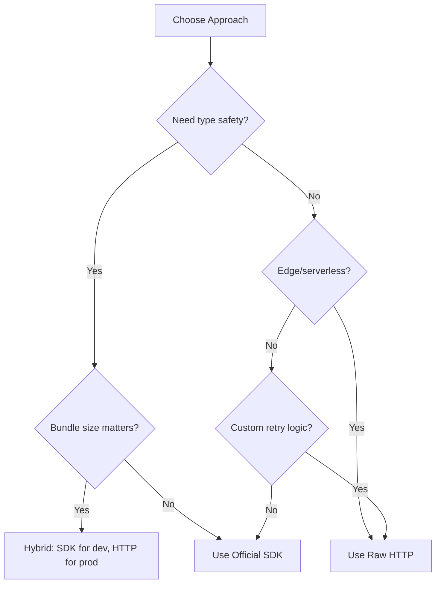

# SDKs vs Raw HTTP

## Overview

This lesson explores the trade-offs between using official AI SDKs and making raw HTTP requests. Understanding both approaches enables informed decisions about architecture, flexibility, and maintainability.

### Learning Objectives

By the end of this lesson, you will be able to:
- Evaluate SDK vs raw HTTP trade-offs for your use case
- Implement both SDK and raw HTTP approaches
- Build abstraction layers over SDKs
- Leverage modern SDK features (parse, structured outputs)
- Design vendor-agnostic architectures

### Lesson Structure

| File | Topic | Description |
|------|-------|-------------|
| [01-sdk-advantages.md](./01-sdk-advantages.md) | SDK Advantages | Type safety, retries, streaming, versioning |
| [02-raw-http-usage.md](./02-raw-http-usage.md) | Raw HTTP Requests | When and how to use direct API calls |
| [03-sdk-abstraction.md](./03-sdk-abstraction.md) | SDK Abstraction | Wrapping SDKs for flexibility |
| [04-vendor-lockin.md](./04-vendor-lockin.md) | Vendor Lock-in | Migration strategies, multi-provider support |
| [05-wrapper-patterns.md](./05-wrapper-patterns.md) | Custom Wrappers | Unified API, middleware, decorators |
| [06-modern-sdk-features.md](./06-modern-sdk-features.md) | Modern Features | parse(), Agents SDK, structured outputs |

---

## Quick Comparison

| Aspect | Official SDK | Raw HTTP |
|--------|-------------|----------|
| **Setup** | `pip install openai` | No dependencies |
| **Type Safety** | ✅ Full | ❌ Manual |
| **Auto-retries** | ✅ Built-in | ❌ Implement yourself |
| **Streaming** | ✅ Helpers | ⚠️ Manual parsing |
| **Control** | ⚠️ Limited | ✅ Full |
| **Bundle Size** | ⚠️ Larger | ✅ Minimal |
| **Edge Runtime** | ⚠️ May not work | ✅ Works everywhere |
| **Learning** | ⚠️ Abstracts details | ✅ Understand protocol |

---

## Decision Framework



---

## Quick Start Examples

### Using Official SDK

```python
from openai import OpenAI

client = OpenAI()

# Simple, type-safe API
response = client.chat.completions.create(
    model="gpt-4.1",
    messages=[{"role": "user", "content": "Hello!"}]
)

# Access typed response
print(response.choices[0].message.content)
print(response.usage.total_tokens)
```

### Using Raw HTTP

```python
import httpx

async def complete(messages: list) -> dict:
    async with httpx.AsyncClient() as client:
        response = await client.post(
            "https://api.openai.com/v1/chat/completions",
            headers={"Authorization": f"Bearer {API_KEY}"},
            json={"model": "gpt-4.1", "messages": messages}
        )
        return response.json()
```

---

## Key Concepts Preview

### 1. SDK Advantages
- Type definitions catch errors at development time
- Built-in retry logic with exponential backoff
- Streaming generators simplify consumption
- Version-locked API compatibility

### 2. Raw HTTP Benefits
- Zero dependencies beyond HTTP client
- Full control over request/response cycle
- Works in constrained environments (edge)
- Educational for understanding the protocol

### 3. Modern SDK Features (2025)
```python
# Structured outputs with Pydantic
from pydantic import BaseModel

class Response(BaseModel):
    answer: str
    confidence: float

# SDK parses and validates automatically
result = client.responses.parse(
    model="gpt-4.1",
    input="What is 2+2?",
    text_format=Response
)
# result.output_parsed is typed Response
```

---

## Prerequisites

Before starting this lesson, ensure you understand:
- HTTP fundamentals (methods, headers, status codes)
- Python async/await patterns
- Basic type hints and Pydantic
- OpenAI API structure

---

## Further Reading

- [OpenAI Python SDK](https://github.com/openai/openai-python) — Official library
- [Anthropic Python SDK](https://github.com/anthropics/anthropic-sdk-python) — Claude library
- [httpx Documentation](https://www.python-httpx.org/) — Modern HTTP client

---

**Next:** [SDK Advantages](./01-sdk-advantages.md)
