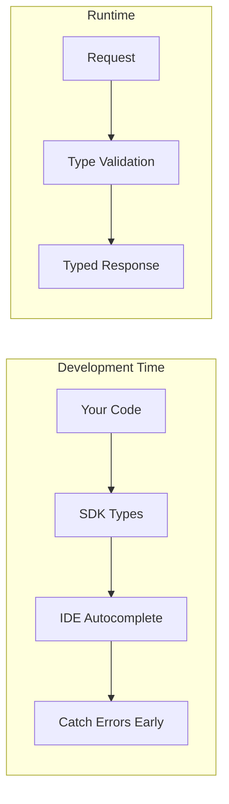

# SDK Advantages and Limitations

## Introduction

Official AI SDKs provide a developer-friendly layer over raw HTTP APIs. This lesson examines their benefits, limitations, and when they're the right choice.

### What We'll Cover

- Type safety and IDE support
- Automatic retries and error handling
- Streaming helpers
- Version management
- SDK limitations

### Prerequisites

- Basic Python/JavaScript experience
- Understanding of HTTP APIs

---

## Type Safety Benefits



### Python SDK Types

```python
from openai import OpenAI
from openai.types.chat import ChatCompletion, ChatCompletionMessage

client = OpenAI()

# Return type is fully typed: ChatCompletion
response: ChatCompletion = client.chat.completions.create(
    model="gpt-4.1",
    messages=[
        {"role": "system", "content": "You are helpful."},
        {"role": "user", "content": "Hello!"}
    ],
    temperature=0.7,
    max_tokens=1000
)

# IDE knows all available properties
message: ChatCompletionMessage = response.choices[0].message
content: str = message.content  # Type: str | None
role: str = message.role  # Type: Literal["assistant"]

# Usage is also typed
prompt_tokens: int = response.usage.prompt_tokens
completion_tokens: int = response.usage.completion_tokens

# Type errors caught during development
# response.choices[0].invalid_field  # Error: no attribute 'invalid_field'
```

### TypeScript SDK Types

```typescript
import OpenAI from 'openai';
import { ChatCompletion } from 'openai/resources/chat/completions';

const client = new OpenAI();

async function chat(): Promise<string> {
  // Full type inference
  const response: ChatCompletion = await client.chat.completions.create({
    model: 'gpt-4.1',
    messages: [
      { role: 'user', content: 'Hello!' }
    ]
  });
  
  // TypeScript knows the structure
  const content = response.choices[0]?.message?.content;
  
  // Type guards help with null checks
  if (content) {
    return content;
  }
  
  return 'No response';
}
```

### Anthropic SDK Types

```python
import anthropic
from anthropic.types import Message, ContentBlock

client = anthropic.Anthropic()

# Typed response
response: Message = client.messages.create(
    model="claude-sonnet-4-20250514",
    max_tokens=1024,
    messages=[
        {"role": "user", "content": "Hello!"}
    ]
)

# Access typed content blocks
for block in response.content:
    if block.type == "text":
        print(block.text)  # IDE knows 'text' exists here

# Typed usage
input_tokens: int = response.usage.input_tokens
output_tokens: int = response.usage.output_tokens
```

---

## Automatic Retries

```python
from openai import OpenAI

# SDK includes automatic retry logic
client = OpenAI(
    max_retries=3,  # Default is 2
    timeout=60.0    # Request timeout
)

# Retries automatically on:
# - Connection errors
# - 429 (rate limit) - with backoff
# - 500, 502, 503, 504 (server errors)

response = client.chat.completions.create(
    model="gpt-4.1",
    messages=[{"role": "user", "content": "Hello!"}]
)
# No need to implement retry logic yourself!


# Customize retry behavior
from openai import OpenAI
import httpx

client = OpenAI(
    max_retries=5,
    timeout=httpx.Timeout(
        connect=5.0,   # Connection timeout
        read=60.0,     # Read timeout
        write=10.0,    # Write timeout  
        pool=10.0      # Pool timeout
    )
)
```

### Retry Implementation Comparison

```python
# What the SDK does for you internally (simplified)
import time
import random
from typing import Callable, TypeVar

T = TypeVar('T')

def sdk_retry_logic(
    func: Callable[[], T],
    max_retries: int = 3,
    initial_delay: float = 0.5
) -> T:
    """Simplified version of SDK retry logic."""
    
    for attempt in range(max_retries + 1):
        try:
            return func()
        except Exception as e:
            error_str = str(e)
            
            # Check if retryable
            is_retryable = (
                "rate_limit" in error_str.lower() or
                "429" in error_str or
                "500" in error_str or
                "503" in error_str or
                "connection" in error_str.lower()
            )
            
            if not is_retryable or attempt == max_retries:
                raise
            
            # Exponential backoff with jitter
            delay = initial_delay * (2 ** attempt)
            jitter = random.uniform(0, delay * 0.1)
            time.sleep(delay + jitter)
    
    raise Exception("Max retries exceeded")


# Without SDK, you'd write this yourself for every request
# SDK handles this transparently
```

---

## Streaming Helpers

```python
from openai import OpenAI

client = OpenAI()

# SDK provides clean streaming interface
stream = client.chat.completions.create(
    model="gpt-4.1",
    messages=[{"role": "user", "content": "Tell me a story"}],
    stream=True
)

# Simple iteration over chunks
for chunk in stream:
    if chunk.choices[0].delta.content:
        print(chunk.choices[0].delta.content, end="", flush=True)


# With context manager for proper cleanup
with client.chat.completions.create(
    model="gpt-4.1",
    messages=[{"role": "user", "content": "Hello!"}],
    stream=True
) as stream:
    for chunk in stream:
        content = chunk.choices[0].delta.content or ""
        print(content, end="")
```

### Async Streaming

```python
import asyncio
from openai import AsyncOpenAI

async def stream_response():
    client = AsyncOpenAI()
    
    # Async streaming with proper resource management
    async with client.chat.completions.create(
        model="gpt-4.1",
        messages=[{"role": "user", "content": "Hello!"}],
        stream=True
    ) as stream:
        async for chunk in stream:
            content = chunk.choices[0].delta.content
            if content:
                print(content, end="", flush=True)


asyncio.run(stream_response())
```

### Anthropic Streaming

```python
import anthropic

client = anthropic.Anthropic()

# Stream with event types
with client.messages.stream(
    model="claude-sonnet-4-20250514",
    max_tokens=1024,
    messages=[{"role": "user", "content": "Hello!"}]
) as stream:
    for text in stream.text_stream:
        print(text, end="", flush=True)


# Or with full events
with client.messages.stream(
    model="claude-sonnet-4-20250514",
    max_tokens=1024,
    messages=[{"role": "user", "content": "Hello!"}]
) as stream:
    for event in stream:
        if event.type == "content_block_delta":
            if event.delta.type == "text_delta":
                print(event.delta.text, end="")
        elif event.type == "message_stop":
            print("\n[Complete]")
```

---

## Version Management

```python
# SDK versions are pinned to API versions
# This protects against breaking changes

# requirements.txt
"""
openai>=1.40.0,<2.0.0
anthropic>=0.35.0,<1.0.0
"""

# The SDK handles API version headers
from openai import OpenAI

client = OpenAI()
# SDK automatically sends appropriate API version headers

# Check SDK version
import openai
print(f"OpenAI SDK version: {openai.__version__}")

# For Anthropic
import anthropic
print(f"Anthropic SDK version: {anthropic.__version__}")
```

### Version Compatibility

```python
# SDKs handle API versioning transparently
"""
SDK Version | API Version | Python Support
------------|-------------|---------------
openai 1.0  | 2023-11     | 3.7+
openai 1.40 | 2024-10     | 3.8+
openai 2.0  | 2025-xx     | 3.9+ (expected)
"""

# Best practice: pin major version
# pyproject.toml
"""
[project]
dependencies = [
    "openai>=1.40,<2",
    "anthropic>=0.35,<1",
]
"""
```

---

## SDK Limitations

### 1. Bundle Size

```javascript
// JavaScript bundle impact
// openai package: ~500KB (unpacked)
// anthropic package: ~400KB (unpacked)

// For edge functions with size limits, this matters
// Cloudflare Workers: 1MB limit
// Vercel Edge: 4MB limit

// Consider raw HTTP for size-constrained environments
```

### 2. Dependency Updates

```python
# SDK updates may lag behind API features
"""
Timeline Example:
- Jan 15: OpenAI releases new API feature
- Jan 20: SDK team starts implementation
- Feb 1: SDK beta with new feature
- Feb 15: SDK stable release

You're waiting 1 month for SDK support
With raw HTTP, you can use it immediately
"""
```

### 3. Limited Customization

```python
from openai import OpenAI
import httpx

# SDK provides some customization
client = OpenAI(
    http_client=httpx.Client(
        proxies="http://proxy.example.com:8080",
        verify=False,  # Disable SSL (not recommended)
    )
)

# But some things are harder:
# - Custom request middleware
# - Non-standard authentication
# - Unusual error handling
# - Request/response logging at HTTP level
```

### 4. Error Abstraction

```python
from openai import OpenAI, APIError, RateLimitError, APIConnectionError

client = OpenAI()

try:
    response = client.chat.completions.create(
        model="gpt-4.1",
        messages=[{"role": "user", "content": "Hello!"}]
    )
except RateLimitError as e:
    # SDK abstracts the raw 429 response
    print(f"Rate limited: {e}")
    # But you might want the raw response headers
    # for retry-after, etc.
    
except APIError as e:
    # Generic API error
    print(f"Status: {e.status_code}")
    print(f"Message: {e.message}")
    # Raw response body not easily accessible
    
except APIConnectionError as e:
    # Network error
    print(f"Connection failed: {e}")
```

---

## When to Use SDK

| Use Case | Recommendation |
|----------|----------------|
| Production application | ✅ SDK |
| Rapid prototyping | ✅ SDK |
| Type-safe codebase | ✅ SDK |
| Edge/serverless (size matters) | ⚠️ Consider HTTP |
| Need latest API features | ⚠️ Consider HTTP |
| Custom auth/proxy needs | ⚠️ Consider HTTP |
| Learning the API | ⚠️ Consider HTTP |
| Maximum control | ❌ Use HTTP |

---

## Hands-on Exercise

### Your Task

Compare SDK and raw HTTP for the same functionality.

### Requirements

1. Implement chat completion with SDK
2. Implement same with raw HTTP
3. Compare error handling
4. Measure any performance difference

### Expected Result

Both implementations should produce identical results, but you'll notice the SDK version is more concise while HTTP gives more control.

<details>
<summary>💡 Hints</summary>

- Use `httpx` for async HTTP
- Check response status codes manually with HTTP
- Time both approaches with `time.perf_counter()`
</details>

<details>
<summary>✅ Solution</summary>

```python
import time
import httpx
from openai import OpenAI
import os

API_KEY = os.environ.get("OPENAI_API_KEY")
MESSAGES = [{"role": "user", "content": "Say 'hello' and nothing else"}]

# --- SDK Approach ---
def sdk_completion():
    client = OpenAI()
    
    start = time.perf_counter()
    
    try:
        response = client.chat.completions.create(
            model="gpt-4.1-mini",
            messages=MESSAGES,
            max_tokens=10
        )
        
        elapsed = time.perf_counter() - start
        
        return {
            "content": response.choices[0].message.content,
            "tokens": response.usage.total_tokens,
            "elapsed": elapsed,
            "approach": "sdk"
        }
    except Exception as e:
        return {"error": str(e), "approach": "sdk"}


# --- Raw HTTP Approach ---
def http_completion():
    start = time.perf_counter()
    
    try:
        response = httpx.post(
            "https://api.openai.com/v1/chat/completions",
            headers={
                "Authorization": f"Bearer {API_KEY}",
                "Content-Type": "application/json"
            },
            json={
                "model": "gpt-4.1-mini",
                "messages": MESSAGES,
                "max_tokens": 10
            },
            timeout=30.0
        )
        
        elapsed = time.perf_counter() - start
        
        if response.status_code != 200:
            return {
                "error": f"HTTP {response.status_code}: {response.text}",
                "approach": "http"
            }
        
        data = response.json()
        
        return {
            "content": data["choices"][0]["message"]["content"],
            "tokens": data["usage"]["total_tokens"],
            "elapsed": elapsed,
            "approach": "http"
        }
    except Exception as e:
        return {"error": str(e), "approach": "http"}


# --- Comparison ---
def compare():
    print("SDK Approach:")
    sdk_result = sdk_completion()
    print(f"  Content: {sdk_result.get('content', sdk_result.get('error'))}")
    print(f"  Tokens: {sdk_result.get('tokens', 'N/A')}")
    print(f"  Time: {sdk_result.get('elapsed', 'N/A'):.3f}s")
    
    print("\nHTTP Approach:")
    http_result = http_completion()
    print(f"  Content: {http_result.get('content', http_result.get('error'))}")
    print(f"  Tokens: {http_result.get('tokens', 'N/A')}")
    print(f"  Time: {http_result.get('elapsed', 'N/A'):.3f}s")
    
    # Compare
    print("\n--- Comparison ---")
    print("SDK advantages seen:")
    print("  - Simpler code (no manual headers)")
    print("  - Type-safe response access")
    print("  - Automatic error types")
    
    print("\nHTTP advantages seen:")
    print("  - No SDK dependency")
    print("  - Full control over request")
    print("  - Access to raw response")


if __name__ == "__main__":
    compare()
```

</details>

---

## Summary

✅ SDKs provide type safety and IDE autocomplete  
✅ Built-in retries handle transient failures automatically  
✅ Streaming helpers simplify real-time responses  
✅ Version pinning protects against breaking changes  
✅ Trade-off: less control and larger bundle size

**Next:** [Raw HTTP Usage](./02-raw-http-usage.md)

---

## Further Reading

- [OpenAI Python SDK](https://github.com/openai/openai-python) — Source and docs
- [Anthropic SDK](https://github.com/anthropics/anthropic-sdk-python) — Source and docs
- [Python Type Hints](https://docs.python.org/3/library/typing.html) — Type system

<!-- 
Sources Consulted:
- OpenAI SDK: https://github.com/openai/openai-python
- Anthropic SDK: https://github.com/anthropics/anthropic-sdk-python
- httpx: https://www.python-httpx.org/
-->
