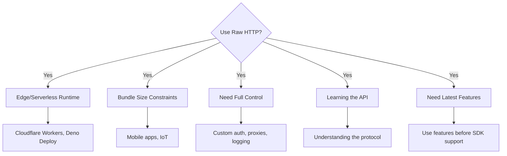

# When to Use Raw HTTP Requests

## Introduction

Raw HTTP requests give you complete control over AI API interactions. This lesson covers when direct HTTP calls are preferable and how to implement them effectively.

### What We'll Cover

- Maximum control scenarios
- Minimal dependency requirements
- Edge runtime compatibility
- Custom retry logic
- Learning and debugging

### Prerequisites

- HTTP fundamentals
- Python async/await
- Understanding of REST APIs

---

## When Raw HTTP Makes Sense



---

## Basic HTTP Implementation

### Python with httpx

```python
import httpx
import os
from typing import Optional, AsyncIterator

class RawOpenAIClient:
    """Raw HTTP client for OpenAI API."""
    
    BASE_URL = "https://api.openai.com/v1"
    
    def __init__(self, api_key: str = None):
        self.api_key = api_key or os.environ.get("OPENAI_API_KEY")
        self._client = httpx.AsyncClient(
            base_url=self.BASE_URL,
            headers={
                "Authorization": f"Bearer {self.api_key}",
                "Content-Type": "application/json"
            },
            timeout=60.0
        )
    
    async def complete(
        self,
        messages: list,
        model: str = "gpt-4.1",
        **kwargs
    ) -> dict:
        """Chat completion via raw HTTP."""
        
        payload = {
            "model": model,
            "messages": messages,
            **kwargs
        }
        
        response = await self._client.post(
            "/chat/completions",
            json=payload
        )
        
        response.raise_for_status()
        return response.json()
    
    async def stream(
        self,
        messages: list,
        model: str = "gpt-4.1",
        **kwargs
    ) -> AsyncIterator[dict]:
        """Streaming completion via raw HTTP."""
        
        payload = {
            "model": model,
            "messages": messages,
            "stream": True,
            **kwargs
        }
        
        async with self._client.stream(
            "POST",
            "/chat/completions",
            json=payload
        ) as response:
            response.raise_for_status()
            
            async for line in response.aiter_lines():
                if line.startswith("data: "):
                    data = line[6:]  # Remove "data: " prefix
                    
                    if data == "[DONE]":
                        break
                    
                    import json
                    yield json.loads(data)
    
    async def close(self):
        """Close the client."""
        await self._client.aclose()


# Usage
async def main():
    client = RawOpenAIClient()
    
    try:
        # Non-streaming
        response = await client.complete(
            messages=[{"role": "user", "content": "Hello!"}]
        )
        print(response["choices"][0]["message"]["content"])
        
        # Streaming
        print("\nStreaming:")
        async for chunk in client.stream(
            messages=[{"role": "user", "content": "Count to 5"}]
        ):
            content = chunk["choices"][0]["delta"].get("content", "")
            print(content, end="", flush=True)
    finally:
        await client.close()


import asyncio
asyncio.run(main())
```

### JavaScript with Fetch

```javascript
// Works in browsers, Node.js, Deno, Cloudflare Workers

const BASE_URL = 'https://api.openai.com/v1';

async function complete(messages, options = {}) {
  const { model = 'gpt-4.1', ...rest } = options;
  
  const response = await fetch(`${BASE_URL}/chat/completions`, {
    method: 'POST',
    headers: {
      'Authorization': `Bearer ${process.env.OPENAI_API_KEY}`,
      'Content-Type': 'application/json'
    },
    body: JSON.stringify({
      model,
      messages,
      ...rest
    })
  });
  
  if (!response.ok) {
    const error = await response.text();
    throw new Error(`HTTP ${response.status}: ${error}`);
  }
  
  return response.json();
}

async function* stream(messages, options = {}) {
  const { model = 'gpt-4.1', ...rest } = options;
  
  const response = await fetch(`${BASE_URL}/chat/completions`, {
    method: 'POST',
    headers: {
      'Authorization': `Bearer ${process.env.OPENAI_API_KEY}`,
      'Content-Type': 'application/json'
    },
    body: JSON.stringify({
      model,
      messages,
      stream: true,
      ...rest
    })
  });
  
  if (!response.ok) {
    throw new Error(`HTTP ${response.status}`);
  }
  
  const reader = response.body.getReader();
  const decoder = new TextDecoder();
  let buffer = '';
  
  while (true) {
    const { done, value } = await reader.read();
    
    if (done) break;
    
    buffer += decoder.decode(value, { stream: true });
    
    const lines = buffer.split('\n');
    buffer = lines.pop() || '';
    
    for (const line of lines) {
      if (line.startsWith('data: ')) {
        const data = line.slice(6);
        
        if (data === '[DONE]') return;
        
        yield JSON.parse(data);
      }
    }
  }
}

// Usage
async function main() {
  const messages = [{ role: 'user', content: 'Hello!' }];
  
  // Non-streaming
  const result = await complete(messages);
  console.log(result.choices[0].message.content);
  
  // Streaming
  for await (const chunk of stream(messages)) {
    const content = chunk.choices[0]?.delta?.content || '';
    process.stdout.write(content);
  }
}
```

---

## Edge Runtime Compatibility

```javascript
// Cloudflare Worker - SDK might not work, fetch does

export default {
  async fetch(request, env) {
    const { messages } = await request.json();
    
    const response = await fetch('https://api.openai.com/v1/chat/completions', {
      method: 'POST',
      headers: {
        'Authorization': `Bearer ${env.OPENAI_API_KEY}`,
        'Content-Type': 'application/json'
      },
      body: JSON.stringify({
        model: 'gpt-4.1-mini',
        messages,
        max_tokens: 500
      })
    });
    
    // Stream back to client
    return new Response(response.body, {
      headers: {
        'Content-Type': 'text/event-stream',
        'Cache-Control': 'no-cache'
      }
    });
  }
};
```

```typescript
// Deno Deploy
import { serve } from "https://deno.land/std@0.177.0/http/server.ts";

serve(async (req) => {
  const { messages } = await req.json();
  
  const response = await fetch("https://api.openai.com/v1/chat/completions", {
    method: "POST",
    headers: {
      "Authorization": `Bearer ${Deno.env.get("OPENAI_API_KEY")}`,
      "Content-Type": "application/json"
    },
    body: JSON.stringify({
      model: "gpt-4.1-mini",
      messages
    })
  });
  
  return new Response(response.body, {
    headers: { "Content-Type": "application/json" }
  });
});
```

---

## Custom Retry Logic

```python
import httpx
import asyncio
import random
from typing import Callable, TypeVar, Optional
from dataclasses import dataclass

T = TypeVar('T')

@dataclass
class RetryConfig:
    """Configuration for retry behavior."""
    
    max_retries: int = 3
    initial_delay: float = 1.0
    max_delay: float = 60.0
    exponential_base: float = 2.0
    jitter: bool = True
    retryable_status_codes: set = None
    
    def __post_init__(self):
        if self.retryable_status_codes is None:
            self.retryable_status_codes = {429, 500, 502, 503, 504}


class RetryableHTTPClient:
    """HTTP client with custom retry logic."""
    
    def __init__(
        self,
        base_url: str,
        headers: dict,
        retry_config: RetryConfig = None
    ):
        self.base_url = base_url
        self.headers = headers
        self.config = retry_config or RetryConfig()
        self._client = httpx.AsyncClient(
            base_url=base_url,
            headers=headers,
            timeout=60.0
        )
    
    def _calculate_delay(self, attempt: int) -> float:
        """Calculate delay with exponential backoff and jitter."""
        
        delay = self.config.initial_delay * (
            self.config.exponential_base ** attempt
        )
        delay = min(delay, self.config.max_delay)
        
        if self.config.jitter:
            delay = delay * (0.5 + random.random())
        
        return delay
    
    def _should_retry(
        self,
        response: httpx.Response = None,
        exception: Exception = None
    ) -> bool:
        """Determine if request should be retried."""
        
        if exception:
            # Retry on connection errors
            return isinstance(exception, (
                httpx.ConnectError,
                httpx.ConnectTimeout,
                httpx.ReadTimeout
            ))
        
        if response:
            return response.status_code in self.config.retryable_status_codes
        
        return False
    
    def _get_retry_after(self, response: httpx.Response) -> Optional[float]:
        """Extract retry-after header if present."""
        
        retry_after = response.headers.get("retry-after")
        if retry_after:
            try:
                return float(retry_after)
            except ValueError:
                pass
        return None
    
    async def request(
        self,
        method: str,
        path: str,
        **kwargs
    ) -> httpx.Response:
        """Make request with retry logic."""
        
        last_exception = None
        
        for attempt in range(self.config.max_retries + 1):
            try:
                response = await self._client.request(method, path, **kwargs)
                
                if not self._should_retry(response=response):
                    return response
                
                # Handle rate limit with retry-after
                if response.status_code == 429:
                    delay = self._get_retry_after(response)
                    if delay is None:
                        delay = self._calculate_delay(attempt)
                    
                    print(f"Rate limited, waiting {delay:.1f}s...")
                    await asyncio.sleep(delay)
                    continue
                
                # Other retryable errors
                if attempt < self.config.max_retries:
                    delay = self._calculate_delay(attempt)
                    print(f"Retry {attempt + 1} after {delay:.1f}s...")
                    await asyncio.sleep(delay)
                    continue
                
                return response
                
            except Exception as e:
                last_exception = e
                
                if not self._should_retry(exception=e):
                    raise
                
                if attempt < self.config.max_retries:
                    delay = self._calculate_delay(attempt)
                    print(f"Retry {attempt + 1} after {delay:.1f}s due to: {e}")
                    await asyncio.sleep(delay)
        
        if last_exception:
            raise last_exception
        
        raise Exception("Max retries exceeded")
    
    async def post(self, path: str, **kwargs) -> httpx.Response:
        return await self.request("POST", path, **kwargs)
    
    async def get(self, path: str, **kwargs) -> httpx.Response:
        return await self.request("GET", path, **kwargs)
    
    async def close(self):
        await self._client.aclose()


# Usage
async def main():
    config = RetryConfig(
        max_retries=5,
        initial_delay=0.5,
        max_delay=30.0
    )
    
    client = RetryableHTTPClient(
        base_url="https://api.openai.com/v1",
        headers={
            "Authorization": f"Bearer {os.environ['OPENAI_API_KEY']}",
            "Content-Type": "application/json"
        },
        retry_config=config
    )
    
    try:
        response = await client.post(
            "/chat/completions",
            json={
                "model": "gpt-4.1",
                "messages": [{"role": "user", "content": "Hello!"}]
            }
        )
        
        data = response.json()
        print(data["choices"][0]["message"]["content"])
    finally:
        await client.close()
```

---

## Request/Response Logging

```python
import httpx
import json
from datetime import datetime
from typing import Any
from dataclasses import dataclass, asdict

@dataclass
class RequestLog:
    """Log entry for a request."""
    
    timestamp: str
    method: str
    url: str
    headers: dict
    body: Any
    response_status: int
    response_body: Any
    duration_ms: float


class LoggingHTTPClient:
    """HTTP client with detailed logging."""
    
    def __init__(
        self,
        base_url: str,
        headers: dict,
        log_file: str = None,
        log_bodies: bool = True
    ):
        self.base_url = base_url
        self.headers = headers
        self.log_file = log_file
        self.log_bodies = log_bodies
        self.logs: list[RequestLog] = []
        
        self._client = httpx.AsyncClient(
            base_url=base_url,
            headers=headers,
            timeout=60.0
        )
    
    def _sanitize_headers(self, headers: dict) -> dict:
        """Remove sensitive headers for logging."""
        
        sanitized = dict(headers)
        sensitive = {"authorization", "api-key", "x-api-key"}
        
        for key in list(sanitized.keys()):
            if key.lower() in sensitive:
                sanitized[key] = "***REDACTED***"
        
        return sanitized
    
    async def request(
        self,
        method: str,
        path: str,
        **kwargs
    ) -> httpx.Response:
        """Make request with logging."""
        
        import time
        start = time.perf_counter()
        
        # Prepare log entry
        log_entry = RequestLog(
            timestamp=datetime.now().isoformat(),
            method=method,
            url=f"{self.base_url}{path}",
            headers=self._sanitize_headers(self.headers),
            body=kwargs.get("json") if self.log_bodies else "[BODY_LOGGING_DISABLED]",
            response_status=0,
            response_body=None,
            duration_ms=0
        )
        
        try:
            response = await self._client.request(method, path, **kwargs)
            
            duration = (time.perf_counter() - start) * 1000
            log_entry.duration_ms = duration
            log_entry.response_status = response.status_code
            
            if self.log_bodies:
                try:
                    log_entry.response_body = response.json()
                except:
                    log_entry.response_body = response.text[:1000]
            
            return response
            
        except Exception as e:
            duration = (time.perf_counter() - start) * 1000
            log_entry.duration_ms = duration
            log_entry.response_body = {"error": str(e)}
            raise
            
        finally:
            self.logs.append(log_entry)
            self._write_log(log_entry)
    
    def _write_log(self, entry: RequestLog):
        """Write log entry to file if configured."""
        
        if self.log_file:
            with open(self.log_file, "a") as f:
                f.write(json.dumps(asdict(entry)) + "\n")
        
        # Also print summary
        print(
            f"[{entry.timestamp}] {entry.method} {entry.url} "
            f"-> {entry.response_status} ({entry.duration_ms:.0f}ms)"
        )
    
    def get_logs(self) -> list[RequestLog]:
        """Get all logged requests."""
        return self.logs
    
    async def close(self):
        await self._client.aclose()


# Usage
client = LoggingHTTPClient(
    base_url="https://api.openai.com/v1",
    headers={"Authorization": f"Bearer {API_KEY}"},
    log_file="api_requests.log",
    log_bodies=True
)

# All requests are now logged
response = await client.request(
    "POST",
    "/chat/completions",
    json={"model": "gpt-4.1", "messages": [{"role": "user", "content": "Hi"}]}
)
```

---

## Multi-Provider Raw HTTP

```python
from dataclasses import dataclass
from typing import Optional

@dataclass
class ProviderEndpoint:
    """Configuration for a provider endpoint."""
    
    base_url: str
    auth_header: str
    auth_prefix: str = "Bearer"
    completions_path: str = "/chat/completions"


PROVIDERS = {
    "openai": ProviderEndpoint(
        base_url="https://api.openai.com/v1",
        auth_header="Authorization",
        completions_path="/chat/completions"
    ),
    "anthropic": ProviderEndpoint(
        base_url="https://api.anthropic.com/v1",
        auth_header="x-api-key",
        auth_prefix="",  # No prefix for Anthropic
        completions_path="/messages"
    ),
    "gemini": ProviderEndpoint(
        base_url="https://generativelanguage.googleapis.com/v1beta",
        auth_header="x-goog-api-key",
        auth_prefix="",
        completions_path="/models/{model}:generateContent"
    )
}


class MultiProviderHTTPClient:
    """Raw HTTP client for multiple providers."""
    
    def __init__(self, api_keys: dict):
        self.api_keys = api_keys
        self._clients: dict[str, httpx.AsyncClient] = {}
    
    def _get_client(self, provider: str) -> httpx.AsyncClient:
        """Get or create client for provider."""
        
        if provider not in self._clients:
            config = PROVIDERS[provider]
            
            auth_value = self.api_keys.get(provider, "")
            if config.auth_prefix:
                auth_value = f"{config.auth_prefix} {auth_value}"
            
            headers = {
                config.auth_header: auth_value,
                "Content-Type": "application/json"
            }
            
            # Anthropic needs additional headers
            if provider == "anthropic":
                headers["anthropic-version"] = "2023-06-01"
            
            self._clients[provider] = httpx.AsyncClient(
                base_url=config.base_url,
                headers=headers,
                timeout=60.0
            )
        
        return self._clients[provider]
    
    async def complete(
        self,
        provider: str,
        messages: list,
        model: str,
        **kwargs
    ) -> dict:
        """Complete with any provider via raw HTTP."""
        
        client = self._get_client(provider)
        config = PROVIDERS[provider]
        
        # Build provider-specific payload
        if provider == "openai":
            payload = {
                "model": model,
                "messages": messages,
                **kwargs
            }
            path = config.completions_path
            
        elif provider == "anthropic":
            # Extract system message
            system = None
            user_messages = []
            for msg in messages:
                if msg["role"] == "system":
                    system = msg["content"]
                else:
                    user_messages.append(msg)
            
            payload = {
                "model": model,
                "messages": user_messages,
                "max_tokens": kwargs.get("max_tokens", 1024)
            }
            if system:
                payload["system"] = system
            
            path = config.completions_path
            
        elif provider == "gemini":
            # Convert to Gemini format
            contents = []
            for msg in messages:
                role = "user" if msg["role"] == "user" else "model"
                contents.append({
                    "role": role,
                    "parts": [{"text": msg["content"]}]
                })
            
            payload = {"contents": contents}
            path = config.completions_path.format(model=model)
        
        response = await client.post(path, json=payload)
        response.raise_for_status()
        return response.json()
    
    async def close(self):
        for client in self._clients.values():
            await client.aclose()


# Usage
client = MultiProviderHTTPClient({
    "openai": os.environ["OPENAI_API_KEY"],
    "anthropic": os.environ["ANTHROPIC_API_KEY"],
    "gemini": os.environ["GOOGLE_API_KEY"]
})

# Same interface, any provider
messages = [{"role": "user", "content": "Hello!"}]

result = await client.complete("openai", messages, "gpt-4.1")
result = await client.complete("anthropic", messages, "claude-sonnet-4-20250514")
result = await client.complete("gemini", messages, "gemini-2.0-flash")
```

---

## Hands-on Exercise

### Your Task

Implement a raw HTTP client with request caching.

### Requirements

1. Cache identical requests for a configurable TTL
2. Generate cache keys from request content
3. Track cache hits/misses
4. Support cache invalidation

### Expected Result

```python
client = CachingHTTPClient(cache_ttl=300)  # 5 minute cache

# First call hits API
result1 = await client.complete(messages)  # cache_miss

# Second identical call uses cache
result2 = await client.complete(messages)  # cache_hit

print(client.get_cache_stats())
# {"hits": 1, "misses": 1, "hit_rate": 0.5}
```

<details>
<summary>💡 Hints</summary>

- Use hashlib to create cache keys from request JSON
- Store cache entries with timestamps
- Check TTL before returning cached values
</details>

<details>
<summary>✅ Solution</summary>

```python
import httpx
import hashlib
import json
import time
from dataclasses import dataclass
from typing import Any, Optional

@dataclass
class CacheEntry:
    """Cached response with timestamp."""
    
    response: dict
    timestamp: float
    
    def is_valid(self, ttl: float) -> bool:
        return (time.time() - self.timestamp) < ttl


class CachingHTTPClient:
    """HTTP client with response caching."""
    
    def __init__(
        self,
        base_url: str = "https://api.openai.com/v1",
        api_key: str = None,
        cache_ttl: float = 300.0  # 5 minutes
    ):
        self.cache_ttl = cache_ttl
        self._cache: dict[str, CacheEntry] = {}
        self._stats = {"hits": 0, "misses": 0}
        
        self._client = httpx.AsyncClient(
            base_url=base_url,
            headers={
                "Authorization": f"Bearer {api_key or os.environ['OPENAI_API_KEY']}",
                "Content-Type": "application/json"
            },
            timeout=60.0
        )
    
    def _generate_cache_key(self, payload: dict) -> str:
        """Generate cache key from request payload."""
        
        # Sort keys for consistent hashing
        normalized = json.dumps(payload, sort_keys=True)
        return hashlib.sha256(normalized.encode()).hexdigest()[:16]
    
    def _get_from_cache(self, key: str) -> Optional[dict]:
        """Get valid entry from cache."""
        
        entry = self._cache.get(key)
        
        if entry and entry.is_valid(self.cache_ttl):
            self._stats["hits"] += 1
            return entry.response
        
        # Remove expired entry
        if entry:
            del self._cache[key]
        
        self._stats["misses"] += 1
        return None
    
    def _add_to_cache(self, key: str, response: dict):
        """Add response to cache."""
        self._cache[key] = CacheEntry(
            response=response,
            timestamp=time.time()
        )
    
    async def complete(
        self,
        messages: list,
        model: str = "gpt-4.1",
        use_cache: bool = True,
        **kwargs
    ) -> dict:
        """Chat completion with caching."""
        
        payload = {
            "model": model,
            "messages": messages,
            **kwargs
        }
        
        # Check cache
        if use_cache:
            cache_key = self._generate_cache_key(payload)
            cached = self._get_from_cache(cache_key)
            
            if cached:
                return cached
        
        # Make actual request
        response = await self._client.post(
            "/chat/completions",
            json=payload
        )
        response.raise_for_status()
        result = response.json()
        
        # Cache the result
        if use_cache:
            self._add_to_cache(cache_key, result)
        
        return result
    
    def invalidate_cache(self, messages: list = None, model: str = None):
        """Invalidate cache entries."""
        
        if messages and model:
            # Invalidate specific entry
            payload = {"model": model, "messages": messages}
            key = self._generate_cache_key(payload)
            self._cache.pop(key, None)
        else:
            # Invalidate all
            self._cache.clear()
    
    def get_cache_stats(self) -> dict:
        """Get cache statistics."""
        
        total = self._stats["hits"] + self._stats["misses"]
        hit_rate = self._stats["hits"] / total if total > 0 else 0
        
        return {
            "hits": self._stats["hits"],
            "misses": self._stats["misses"],
            "hit_rate": hit_rate,
            "cache_size": len(self._cache),
            "ttl_seconds": self.cache_ttl
        }
    
    async def close(self):
        await self._client.aclose()


# Test
async def test_caching():
    client = CachingHTTPClient(cache_ttl=300)
    
    messages = [{"role": "user", "content": "Say 'hello'"}]
    
    # First call - cache miss
    result1 = await client.complete(messages, model="gpt-4.1-mini")
    print(f"First call: {result1['choices'][0]['message']['content']}")
    
    # Second call - cache hit
    result2 = await client.complete(messages, model="gpt-4.1-mini")
    print(f"Second call: {result2['choices'][0]['message']['content']}")
    
    # Different message - cache miss
    result3 = await client.complete(
        [{"role": "user", "content": "Say 'goodbye'"}],
        model="gpt-4.1-mini"
    )
    print(f"Third call: {result3['choices'][0]['message']['content']}")
    
    # Print stats
    stats = client.get_cache_stats()
    print(f"\nCache Stats:")
    print(f"  Hits: {stats['hits']}")
    print(f"  Misses: {stats['misses']}")
    print(f"  Hit Rate: {stats['hit_rate']:.1%}")
    
    await client.close()

asyncio.run(test_caching())
```

</details>

---

## Summary

✅ Raw HTTP provides maximum control over requests  
✅ Essential for edge runtimes and size-constrained environments  
✅ Enables custom retry, caching, and logging logic  
✅ Useful for learning the underlying API protocol  
✅ Trade-off: more code to write and maintain

**Next:** [SDK Abstraction](./03-sdk-abstraction.md)

---

## Further Reading

- [httpx Documentation](https://www.python-httpx.org/) — Modern Python HTTP
- [MDN Fetch API](https://developer.mozilla.org/en-US/docs/Web/API/Fetch_API) — JavaScript fetch
- [OpenAI API Reference](https://platform.openai.com/docs/api-reference) — Raw API specs

<!-- 
Sources Consulted:
- httpx: https://www.python-httpx.org/
- OpenAI API: https://platform.openai.com/docs/api-reference
- Anthropic API: https://docs.anthropic.com/en/api
-->
