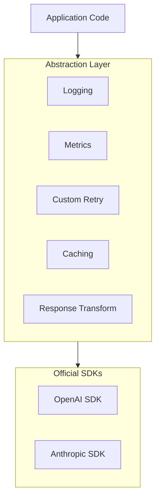

# SDK Abstraction Layers

## Introduction

Wrapping official SDKs in abstraction layers combines SDK benefits with custom functionality. This lesson covers patterns for extending SDKs with logging, monitoring, testing support, and business logic.

### What We'll Cover

- Wrapping official SDKs
- Adding custom functionality
- Logging and monitoring integration
- Testing and mocking support

### Prerequisites

- Python OOP concepts
- Decorator pattern basics
- Understanding of SDKs vs raw HTTP

---

## Why Abstract the SDK?



**Benefits:**
- Add cross-cutting concerns (logging, metrics)
- Implement custom retry/caching logic
- Simplify testing with mockable interfaces
- Prepare for multi-provider support

---

## Basic SDK Wrapper

```python
from openai import OpenAI
from anthropic import Anthropic
from dataclasses import dataclass
from typing import Optional, List
import time

@dataclass
class CompletionRequest:
    """Unified request format."""
    
    messages: List[dict]
    model: str = "gpt-4.1"
    temperature: float = 1.0
    max_tokens: Optional[int] = None
    system: Optional[str] = None


@dataclass
class CompletionResponse:
    """Unified response format."""
    
    content: str
    model: str
    input_tokens: int
    output_tokens: int
    finish_reason: str
    raw_response: dict  # Original SDK response


class AIClient:
    """Abstraction layer over AI SDKs."""
    
    def __init__(
        self,
        openai_key: str = None,
        anthropic_key: str = None
    ):
        self._openai = OpenAI(api_key=openai_key) if openai_key else None
        self._anthropic = Anthropic(api_key=anthropic_key) if anthropic_key else None
    
    def complete(self, request: CompletionRequest) -> CompletionResponse:
        """Generate completion using appropriate provider."""
        
        if request.model.startswith("gpt") or request.model.startswith("o"):
            return self._complete_openai(request)
        elif request.model.startswith("claude"):
            return self._complete_anthropic(request)
        else:
            raise ValueError(f"Unknown model: {request.model}")
    
    def _complete_openai(self, request: CompletionRequest) -> CompletionResponse:
        """OpenAI completion via SDK."""
        
        messages = list(request.messages)
        if request.system:
            messages.insert(0, {"role": "system", "content": request.system})
        
        response = self._openai.chat.completions.create(
            model=request.model,
            messages=messages,
            temperature=request.temperature,
            max_tokens=request.max_tokens
        )
        
        choice = response.choices[0]
        
        return CompletionResponse(
            content=choice.message.content or "",
            model=response.model,
            input_tokens=response.usage.prompt_tokens,
            output_tokens=response.usage.completion_tokens,
            finish_reason=choice.finish_reason,
            raw_response=response.model_dump()
        )
    
    def _complete_anthropic(self, request: CompletionRequest) -> CompletionResponse:
        """Anthropic completion via SDK."""
        
        response = self._anthropic.messages.create(
            model=request.model,
            messages=request.messages,
            system=request.system or "",
            temperature=request.temperature,
            max_tokens=request.max_tokens or 1024
        )
        
        content = ""
        for block in response.content:
            if block.type == "text":
                content += block.text
        
        return CompletionResponse(
            content=content,
            model=response.model,
            input_tokens=response.usage.input_tokens,
            output_tokens=response.usage.output_tokens,
            finish_reason=response.stop_reason,
            raw_response=response.model_dump()
        )


# Usage
client = AIClient(
    openai_key=os.environ["OPENAI_API_KEY"],
    anthropic_key=os.environ["ANTHROPIC_API_KEY"]
)

request = CompletionRequest(
    messages=[{"role": "user", "content": "Hello!"}],
    model="gpt-4.1",
    system="You are a helpful assistant."
)

response = client.complete(request)
print(response.content)
```

---

## Adding Logging and Monitoring

```python
import logging
import time
from functools import wraps
from typing import Callable
from dataclasses import dataclass, field
from datetime import datetime

# Configure logging
logging.basicConfig(level=logging.INFO)
logger = logging.getLogger("ai_client")


@dataclass
class RequestMetrics:
    """Metrics for a single request."""
    
    timestamp: datetime
    model: str
    input_tokens: int
    output_tokens: int
    latency_ms: float
    success: bool
    error: str = None


class MetricsCollector:
    """Collect and report metrics."""
    
    def __init__(self):
        self.metrics: list[RequestMetrics] = []
    
    def record(self, metric: RequestMetrics):
        """Record a metric."""
        self.metrics.append(metric)
    
    def get_summary(self) -> dict:
        """Get metrics summary."""
        
        if not self.metrics:
            return {}
        
        successful = [m for m in self.metrics if m.success]
        
        return {
            "total_requests": len(self.metrics),
            "successful_requests": len(successful),
            "total_input_tokens": sum(m.input_tokens for m in successful),
            "total_output_tokens": sum(m.output_tokens for m in successful),
            "avg_latency_ms": sum(m.latency_ms for m in self.metrics) / len(self.metrics),
            "error_rate": 1 - (len(successful) / len(self.metrics))
        }


class LoggingAIClient(AIClient):
    """AI client with integrated logging and metrics."""
    
    def __init__(
        self,
        openai_key: str = None,
        anthropic_key: str = None,
        log_prompts: bool = False,  # Be careful with PII
        log_responses: bool = False
    ):
        super().__init__(openai_key, anthropic_key)
        self.log_prompts = log_prompts
        self.log_responses = log_responses
        self.metrics = MetricsCollector()
    
    def complete(self, request: CompletionRequest) -> CompletionResponse:
        """Complete with logging and metrics."""
        
        start_time = time.perf_counter()
        
        # Log request
        logger.info(
            f"AI Request: model={request.model}, "
            f"messages={len(request.messages)}"
        )
        
        if self.log_prompts:
            logger.debug(f"Messages: {request.messages}")
        
        try:
            response = super().complete(request)
            
            latency_ms = (time.perf_counter() - start_time) * 1000
            
            # Record metrics
            self.metrics.record(RequestMetrics(
                timestamp=datetime.now(),
                model=response.model,
                input_tokens=response.input_tokens,
                output_tokens=response.output_tokens,
                latency_ms=latency_ms,
                success=True
            ))
            
            # Log response
            logger.info(
                f"AI Response: model={response.model}, "
                f"tokens={response.input_tokens}/{response.output_tokens}, "
                f"latency={latency_ms:.0f}ms"
            )
            
            if self.log_responses:
                logger.debug(f"Content: {response.content[:200]}...")
            
            return response
            
        except Exception as e:
            latency_ms = (time.perf_counter() - start_time) * 1000
            
            self.metrics.record(RequestMetrics(
                timestamp=datetime.now(),
                model=request.model,
                input_tokens=0,
                output_tokens=0,
                latency_ms=latency_ms,
                success=False,
                error=str(e)
            ))
            
            logger.error(f"AI Error: {e}")
            raise
    
    def get_metrics(self) -> dict:
        """Get collected metrics."""
        return self.metrics.get_summary()


# Usage
client = LoggingAIClient(
    openai_key=os.environ["OPENAI_API_KEY"],
    log_prompts=False,  # Don't log sensitive data in production
    log_responses=False
)

response = client.complete(CompletionRequest(
    messages=[{"role": "user", "content": "Hello!"}],
    model="gpt-4.1-mini"
))

# After many requests
print(client.get_metrics())
```

---

## Decorator-Based Extensions

```python
from functools import wraps
from typing import Callable, TypeVar
import time

T = TypeVar('T')

def with_timing(func: Callable[..., T]) -> Callable[..., T]:
    """Decorator to add timing to any method."""
    
    @wraps(func)
    def wrapper(*args, **kwargs):
        start = time.perf_counter()
        result = func(*args, **kwargs)
        duration = time.perf_counter() - start
        print(f"{func.__name__} took {duration*1000:.1f}ms")
        return result
    
    return wrapper


def with_retry(max_retries: int = 3, delay: float = 1.0):
    """Decorator for retry logic."""
    
    def decorator(func: Callable[..., T]) -> Callable[..., T]:
        @wraps(func)
        def wrapper(*args, **kwargs):
            last_exception = None
            
            for attempt in range(max_retries):
                try:
                    return func(*args, **kwargs)
                except Exception as e:
                    last_exception = e
                    if attempt < max_retries - 1:
                        time.sleep(delay * (2 ** attempt))
            
            raise last_exception
        
        return wrapper
    return decorator


def with_cache(ttl_seconds: float = 300):
    """Decorator for response caching."""
    
    cache = {}
    
    def decorator(func: Callable[..., T]) -> Callable[..., T]:
        @wraps(func)
        def wrapper(self, request: CompletionRequest):
            # Create cache key
            import hashlib
            import json
            key_data = {
                "messages": request.messages,
                "model": request.model,
                "system": request.system
            }
            key = hashlib.sha256(
                json.dumps(key_data, sort_keys=True).encode()
            ).hexdigest()[:16]
            
            # Check cache
            if key in cache:
                entry_time, result = cache[key]
                if time.time() - entry_time < ttl_seconds:
                    return result
            
            # Call function
            result = func(self, request)
            cache[key] = (time.time(), result)
            return result
        
        return wrapper
    return decorator


class DecoratedAIClient(AIClient):
    """AI client with decorator-based enhancements."""
    
    @with_timing
    @with_retry(max_retries=3, delay=1.0)
    @with_cache(ttl_seconds=300)
    def complete(self, request: CompletionRequest) -> CompletionResponse:
        return super().complete(request)


# All calls now have timing, retry, and caching
client = DecoratedAIClient(openai_key=os.environ["OPENAI_API_KEY"])
response = client.complete(request)
```

---

## Testing and Mocking

```python
from abc import ABC, abstractmethod
from typing import Optional, Protocol
from unittest.mock import Mock, patch

# Define protocol for testability
class AIClientProtocol(Protocol):
    """Protocol for AI client implementations."""
    
    def complete(self, request: CompletionRequest) -> CompletionResponse:
        ...


class MockAIClient:
    """Mock client for testing."""
    
    def __init__(self, responses: dict = None):
        self.responses = responses or {}
        self.calls: list[CompletionRequest] = []
        self.default_response = CompletionResponse(
            content="Mock response",
            model="mock-model",
            input_tokens=10,
            output_tokens=5,
            finish_reason="stop",
            raw_response={}
        )
    
    def complete(self, request: CompletionRequest) -> CompletionResponse:
        """Return mock response."""
        
        self.calls.append(request)
        
        # Check for specific response
        for pattern, response in self.responses.items():
            if pattern in str(request.messages):
                return response
        
        return self.default_response
    
    def assert_called(self, times: int = None):
        """Assert client was called."""
        
        if times is not None:
            assert len(self.calls) == times, \
                f"Expected {times} calls, got {len(self.calls)}"
    
    def assert_called_with_model(self, model: str):
        """Assert called with specific model."""
        
        models_used = [c.model for c in self.calls]
        assert model in models_used, \
            f"Expected model {model}, used: {models_used}"


# Application code using the client
class Chatbot:
    """Example application using AI client."""
    
    def __init__(self, client: AIClientProtocol):
        self.client = client
        self.system_prompt = "You are a helpful assistant."
    
    def chat(self, user_message: str) -> str:
        """Handle user message."""
        
        request = CompletionRequest(
            messages=[{"role": "user", "content": user_message}],
            model="gpt-4.1-mini",
            system=self.system_prompt
        )
        
        response = self.client.complete(request)
        return response.content


# Test
def test_chatbot():
    """Test chatbot with mock client."""
    
    # Setup mock
    mock_client = MockAIClient(responses={
        "hello": CompletionResponse(
            content="Hello! How can I help?",
            model="gpt-4.1-mini",
            input_tokens=10,
            output_tokens=8,
            finish_reason="stop",
            raw_response={}
        )
    })
    
    # Create chatbot with mock
    chatbot = Chatbot(client=mock_client)
    
    # Test
    response = chatbot.chat("hello world")
    
    # Assertions
    assert response == "Hello! How can I help?"
    mock_client.assert_called(times=1)
    mock_client.assert_called_with_model("gpt-4.1-mini")
    
    print("✅ Test passed!")


test_chatbot()
```

---

## Factory Pattern for Clients

```python
from abc import ABC, abstractmethod
from dataclasses import dataclass
from enum import Enum
from typing import Type

class Provider(Enum):
    """Supported providers."""
    
    OPENAI = "openai"
    ANTHROPIC = "anthropic"
    MOCK = "mock"


@dataclass
class ClientConfig:
    """Configuration for client creation."""
    
    provider: Provider
    api_key: str = None
    model: str = None
    timeout: float = 60.0
    max_retries: int = 3
    enable_logging: bool = True
    enable_caching: bool = False
    cache_ttl: float = 300.0


class AIClientFactory:
    """Factory for creating configured AI clients."""
    
    _registry: dict[Provider, Type] = {}
    
    @classmethod
    def register(cls, provider: Provider, client_class: Type):
        """Register a client class for a provider."""
        cls._registry[provider] = client_class
    
    @classmethod
    def create(cls, config: ClientConfig) -> AIClientProtocol:
        """Create a configured client."""
        
        # Get base client class
        if config.provider not in cls._registry:
            raise ValueError(f"Unknown provider: {config.provider}")
        
        client_class = cls._registry[config.provider]
        
        # Create base client
        if config.provider == Provider.MOCK:
            client = client_class()
        else:
            client = client_class(api_key=config.api_key)
        
        # Wrap with optional features
        if config.enable_logging:
            client = LoggingWrapper(client)
        
        if config.enable_caching:
            client = CachingWrapper(client, ttl=config.cache_ttl)
        
        return client


class LoggingWrapper:
    """Wrapper that adds logging."""
    
    def __init__(self, client: AIClientProtocol):
        self._client = client
    
    def complete(self, request: CompletionRequest) -> CompletionResponse:
        logger.info(f"Request: {request.model}")
        response = self._client.complete(request)
        logger.info(f"Response: {response.output_tokens} tokens")
        return response


class CachingWrapper:
    """Wrapper that adds caching."""
    
    def __init__(self, client: AIClientProtocol, ttl: float = 300):
        self._client = client
        self._ttl = ttl
        self._cache = {}
    
    def complete(self, request: CompletionRequest) -> CompletionResponse:
        # ... caching logic ...
        return self._client.complete(request)


# Register implementations
AIClientFactory.register(Provider.OPENAI, AIClient)
AIClientFactory.register(Provider.MOCK, MockAIClient)

# Usage
config = ClientConfig(
    provider=Provider.OPENAI,
    api_key=os.environ["OPENAI_API_KEY"],
    enable_logging=True,
    enable_caching=True
)

client = AIClientFactory.create(config)
```

---

## Middleware Pattern

```python
from typing import Callable, List

# Middleware type
Middleware = Callable[
    [CompletionRequest, Callable[[CompletionRequest], CompletionResponse]],
    CompletionResponse
]


def logging_middleware(
    request: CompletionRequest,
    next_handler: Callable[[CompletionRequest], CompletionResponse]
) -> CompletionResponse:
    """Middleware for logging."""
    
    print(f"[LOG] Request to {request.model}")
    response = next_handler(request)
    print(f"[LOG] Response: {response.output_tokens} tokens")
    return response


def timing_middleware(
    request: CompletionRequest,
    next_handler: Callable[[CompletionRequest], CompletionResponse]
) -> CompletionResponse:
    """Middleware for timing."""
    
    start = time.perf_counter()
    response = next_handler(request)
    duration = (time.perf_counter() - start) * 1000
    print(f"[TIME] {duration:.0f}ms")
    return response


def validation_middleware(
    request: CompletionRequest,
    next_handler: Callable[[CompletionRequest], CompletionResponse]
) -> CompletionResponse:
    """Middleware for request validation."""
    
    if not request.messages:
        raise ValueError("Messages cannot be empty")
    
    if request.max_tokens and request.max_tokens > 4096:
        raise ValueError("max_tokens too high")
    
    return next_handler(request)


class MiddlewareAIClient:
    """AI client with middleware support."""
    
    def __init__(
        self,
        client: AIClientProtocol,
        middlewares: List[Middleware] = None
    ):
        self._client = client
        self._middlewares = middlewares or []
    
    def use(self, middleware: Middleware) -> 'MiddlewareAIClient':
        """Add middleware."""
        self._middlewares.append(middleware)
        return self
    
    def complete(self, request: CompletionRequest) -> CompletionResponse:
        """Execute request through middleware chain."""
        
        # Build handler chain
        def final_handler(req: CompletionRequest) -> CompletionResponse:
            return self._client.complete(req)
        
        # Apply middlewares in reverse order
        handler = final_handler
        for middleware in reversed(self._middlewares):
            previous_handler = handler
            handler = lambda req, mw=middleware, ph=previous_handler: mw(req, ph)
        
        return handler(request)


# Usage
base_client = AIClient(openai_key=os.environ["OPENAI_API_KEY"])

client = MiddlewareAIClient(base_client)
client.use(validation_middleware)
client.use(logging_middleware)
client.use(timing_middleware)

# Request flows through: validation → logging → timing → actual call
response = client.complete(request)
```

---

## Hands-on Exercise

### Your Task

Create an SDK abstraction with automatic cost tracking.

### Requirements

1. Track token usage per model
2. Calculate costs using pricing table
3. Support budget limits with warnings
4. Provide usage reports

### Expected Result

```python
client = CostTrackingClient(budget_limit=1.00)  # $1 budget

client.complete(request)  # Works
client.complete(request)  # Works

print(client.get_cost_report())
# {
#   "gpt-4.1": {"requests": 2, "input_tokens": 200, "output_tokens": 100, "cost": 0.012},
#   "total_cost": 0.012,
#   "budget_remaining": 0.988
# }
```

<details>
<summary>💡 Hints</summary>

- Store pricing per model as a dict
- Accumulate tokens after each request
- Check budget before each request
</details>

<details>
<summary>✅ Solution</summary>

```python
from dataclasses import dataclass, field
from typing import Dict
import warnings

# Pricing per 1M tokens (June 2025 estimates)
MODEL_PRICING = {
    "gpt-4.1": {"input": 2.00, "output": 8.00},
    "gpt-4.1-mini": {"input": 0.40, "output": 1.60},
    "gpt-4.1-nano": {"input": 0.10, "output": 0.40},
    "claude-sonnet-4-20250514": {"input": 3.00, "output": 15.00},
    "claude-3-5-haiku-20241022": {"input": 0.80, "output": 4.00},
}


@dataclass
class ModelUsage:
    """Usage statistics for a model."""
    
    requests: int = 0
    input_tokens: int = 0
    output_tokens: int = 0
    cost: float = 0.0


class CostTrackingClient:
    """AI client with cost tracking and budget limits."""
    
    def __init__(
        self,
        openai_key: str = None,
        anthropic_key: str = None,
        budget_limit: float = None,
        warn_at_percentage: float = 0.8
    ):
        self._client = AIClient(openai_key, anthropic_key)
        self.budget_limit = budget_limit
        self.warn_at = warn_at_percentage
        self.usage: Dict[str, ModelUsage] = {}
        self._warned = False
    
    def _get_pricing(self, model: str) -> dict:
        """Get pricing for model."""
        
        # Find matching pricing (handles version suffixes)
        for model_key, pricing in MODEL_PRICING.items():
            if model.startswith(model_key.split("-")[0]):
                return pricing
        
        # Default conservative pricing
        return {"input": 10.0, "output": 30.0}
    
    def _calculate_cost(
        self,
        model: str,
        input_tokens: int,
        output_tokens: int
    ) -> float:
        """Calculate cost for tokens."""
        
        pricing = self._get_pricing(model)
        
        input_cost = (input_tokens / 1_000_000) * pricing["input"]
        output_cost = (output_tokens / 1_000_000) * pricing["output"]
        
        return input_cost + output_cost
    
    def _check_budget(self, estimated_cost: float = 0.0):
        """Check if within budget."""
        
        total_cost = self.get_total_cost()
        
        if self.budget_limit:
            # Warning threshold
            if not self._warned and total_cost >= self.budget_limit * self.warn_at:
                warnings.warn(
                    f"Budget warning: ${total_cost:.4f} of ${self.budget_limit:.2f} used "
                    f"({total_cost/self.budget_limit:.0%})"
                )
                self._warned = True
            
            # Hard limit
            if total_cost + estimated_cost >= self.budget_limit:
                raise Exception(
                    f"Budget exceeded: ${total_cost:.4f} >= ${self.budget_limit:.2f}"
                )
    
    def get_total_cost(self) -> float:
        """Get total cost across all models."""
        return sum(u.cost for u in self.usage.values())
    
    def complete(self, request: CompletionRequest) -> CompletionResponse:
        """Complete with cost tracking."""
        
        # Pre-check budget
        self._check_budget()
        
        # Make request
        response = self._client.complete(request)
        
        # Track usage
        model = response.model
        if model not in self.usage:
            self.usage[model] = ModelUsage()
        
        usage = self.usage[model]
        usage.requests += 1
        usage.input_tokens += response.input_tokens
        usage.output_tokens += response.output_tokens
        
        cost = self._calculate_cost(
            model,
            response.input_tokens,
            response.output_tokens
        )
        usage.cost += cost
        
        # Post-check budget
        self._check_budget()
        
        return response
    
    def get_cost_report(self) -> dict:
        """Get detailed cost report."""
        
        report = {}
        
        for model, usage in self.usage.items():
            report[model] = {
                "requests": usage.requests,
                "input_tokens": usage.input_tokens,
                "output_tokens": usage.output_tokens,
                "cost": round(usage.cost, 6)
            }
        
        total_cost = self.get_total_cost()
        
        report["total_cost"] = round(total_cost, 6)
        
        if self.budget_limit:
            report["budget_limit"] = self.budget_limit
            report["budget_remaining"] = round(
                self.budget_limit - total_cost, 6
            )
            report["budget_used_percent"] = round(
                (total_cost / self.budget_limit) * 100, 1
            )
        
        return report


# Test
client = CostTrackingClient(
    openai_key=os.environ["OPENAI_API_KEY"],
    budget_limit=1.00
)

# Make some requests
for _ in range(3):
    response = client.complete(CompletionRequest(
        messages=[{"role": "user", "content": "Hello!"}],
        model="gpt-4.1-mini"
    ))

# Get report
import json
print(json.dumps(client.get_cost_report(), indent=2))
```

</details>

---

## Summary

✅ SDK wrappers add cross-cutting concerns without modifying SDK code  
✅ Logging and metrics are essential for production monitoring  
✅ Decorator pattern enables modular functionality composition  
✅ Mock clients enable reliable unit testing  
✅ Factory and middleware patterns provide flexibility

**Next:** [Vendor Lock-in Considerations](./04-vendor-lockin.md)

---

## Further Reading

- [Decorator Pattern](https://refactoring.guru/design-patterns/decorator) — Design pattern guide
- [Python Testing](https://docs.python.org/3/library/unittest.mock.html) — Mock and patch
- [OpenAI SDK Source](https://github.com/openai/openai-python) — Study the implementation

<!-- 
Sources Consulted:
- OpenAI SDK: https://github.com/openai/openai-python
- Anthropic SDK: https://docs.anthropic.com/en/api/client-sdks
- Python unittest.mock: https://docs.python.org/3/library/unittest.mock.html
-->
