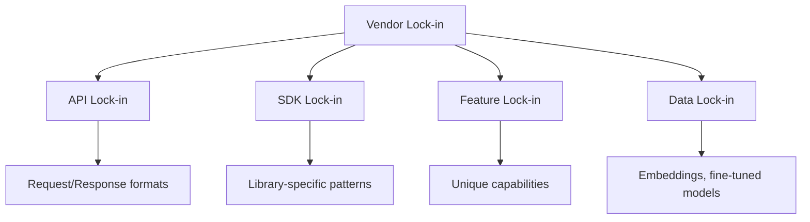

# Vendor Lock-in Considerations

## Introduction

SDK-specific code patterns can create migration challenges. This lesson covers strategies for maintaining provider flexibility while leveraging SDK features.

### What We'll Cover

- SDK-specific patterns that create lock-in
- Migration difficulty assessment
- Multi-provider architecture patterns
- Future flexibility strategies

### Prerequisites

- Experience with at least one AI SDK
- Understanding of abstraction layers
- Basic software architecture concepts

---

## Types of Lock-in



---

## SDK-Specific Patterns

### OpenAI SDK Patterns

```python
from openai import OpenAI

client = OpenAI()

# Pattern 1: Structured outputs with response_format
response = client.chat.completions.create(
    model="gpt-4.1",
    messages=[{"role": "user", "content": "List 3 colors"}],
    response_format={
        "type": "json_schema",
        "json_schema": {
            "name": "colors",
            "schema": {
                "type": "object",
                "properties": {
                    "colors": {"type": "array", "items": {"type": "string"}}
                }
            }
        }
    }
)

# Pattern 2: Tool calling with specific format
response = client.chat.completions.create(
    model="gpt-4.1",
    messages=[{"role": "user", "content": "What's the weather?"}],
    tools=[{
        "type": "function",
        "function": {
            "name": "get_weather",
            "description": "Get weather for a location",
            "parameters": {
                "type": "object",
                "properties": {
                    "location": {"type": "string"}
                },
                "required": ["location"]
            }
        }
    }]
)

# Pattern 3: Parsing with SDK helpers
from openai import pydantic_function_tool
from pydantic import BaseModel

class WeatherQuery(BaseModel):
    location: str
    unit: str = "celsius"

# OpenAI-specific helper
tool = pydantic_function_tool(WeatherQuery)

# Pattern 4: Streaming with specific response types
with client.chat.completions.create(
    model="gpt-4.1",
    messages=[{"role": "user", "content": "Tell me a story"}],
    stream=True
) as stream:
    for chunk in stream:
        # OpenAI-specific: ChatCompletionChunk type
        delta = chunk.choices[0].delta
        if delta.content:
            print(delta.content, end="")
```

### Anthropic SDK Patterns

```python
from anthropic import Anthropic

client = Anthropic()

# Pattern 1: System prompt as separate parameter
response = client.messages.create(
    model="claude-sonnet-4-20250514",
    system="You are a helpful assistant.",  # Different from OpenAI
    messages=[{"role": "user", "content": "Hello!"}],
    max_tokens=1024  # Required for Anthropic
)

# Pattern 2: Content blocks instead of strings
for block in response.content:
    if block.type == "text":
        print(block.text)
    elif block.type == "tool_use":
        # Anthropic-specific tool response format
        print(f"Tool call: {block.name}({block.input})")

# Pattern 3: Tool use with different structure
response = client.messages.create(
    model="claude-sonnet-4-20250514",
    messages=[{"role": "user", "content": "What's the weather?"}],
    tools=[{
        "name": "get_weather",  # No nested "function" wrapper
        "description": "Get weather for a location",
        "input_schema": {  # Different key name
            "type": "object",
            "properties": {
                "location": {"type": "string"}
            },
            "required": ["location"]
        }
    }],
    max_tokens=1024
)

# Pattern 4: Streaming with event types
with client.messages.stream(
    model="claude-sonnet-4-20250514",
    messages=[{"role": "user", "content": "Tell me a story"}],
    max_tokens=1024
) as stream:
    # Anthropic-specific event handling
    for event in stream:
        if event.type == "content_block_delta":
            print(event.delta.text, end="")
```

### Google Gemini SDK Patterns

```python
import google.generativeai as genai

genai.configure(api_key=os.environ["GOOGLE_API_KEY"])

# Pattern 1: Model-centric API
model = genai.GenerativeModel("gemini-2.0-flash")

# Pattern 2: Different message format
response = model.generate_content([
    {"role": "user", "parts": [{"text": "Hello!"}]}  # "parts" array
])

# Pattern 3: Simple interface hides complexity
response = model.generate_content("What is 2+2?")
print(response.text)  # Direct text access

# Pattern 4: Different streaming interface
for chunk in model.generate_content("Tell a story", stream=True):
    print(chunk.text, end="")

# Pattern 5: System instruction as model config
model = genai.GenerativeModel(
    "gemini-2.0-flash",
    system_instruction="You are a helpful assistant."  # Different approach
)
```

---

## Lock-in Severity Assessment

| Aspect | Low Lock-in | Medium Lock-in | High Lock-in |
|--------|-------------|----------------|--------------|
| **API Format** | Standard JSON | Custom wrappers | Proprietary SDK objects |
| **Features** | Text completion | Tool calling | Provider-specific features |
| **Streaming** | SSE standard | SDK-specific types | Custom protocols |
| **Data** | Raw prompts | Cached prompts | Fine-tuned models, embeddings |

---

## Migration Challenges

```python
from dataclasses import dataclass
from enum import Enum

class MigrationDifficulty(Enum):
    TRIVIAL = 1      # Just change API key/endpoint
    EASY = 2         # Adjust request format
    MODERATE = 3     # Restructure messages/tools
    HARD = 4         # Rebuild prompts, retest outputs
    VERY_HARD = 5    # Re-embed data, retrain models


@dataclass
class FeatureMigration:
    """Migration assessment for a feature."""
    
    feature: str
    difficulty: MigrationDifficulty
    openai_equivalent: str
    anthropic_equivalent: str
    gemini_equivalent: str
    notes: str


FEATURE_MIGRATIONS = [
    FeatureMigration(
        feature="Basic completion",
        difficulty=MigrationDifficulty.EASY,
        openai_equivalent="chat.completions.create",
        anthropic_equivalent="messages.create",
        gemini_equivalent="generate_content",
        notes="Format differences, but straightforward"
    ),
    FeatureMigration(
        feature="System prompts",
        difficulty=MigrationDifficulty.EASY,
        openai_equivalent="system role in messages",
        anthropic_equivalent="system parameter",
        gemini_equivalent="system_instruction in model",
        notes="Different locations, same concept"
    ),
    FeatureMigration(
        feature="Tool calling",
        difficulty=MigrationDifficulty.MODERATE,
        openai_equivalent="tools + tool_choice",
        anthropic_equivalent="tools + tool_choice",
        gemini_equivalent="function_declarations",
        notes="Different schemas, different response formats"
    ),
    FeatureMigration(
        feature="Streaming",
        difficulty=MigrationDifficulty.MODERATE,
        openai_equivalent="stream=True, SSE format",
        anthropic_equivalent="stream(), event types",
        gemini_equivalent="stream=True, chunks",
        notes="Different event structures"
    ),
    FeatureMigration(
        feature="Structured output",
        difficulty=MigrationDifficulty.HARD,
        openai_equivalent="response_format json_schema",
        anthropic_equivalent="tool_use workaround",
        gemini_equivalent="response_schema",
        notes="Different capabilities and reliability"
    ),
    FeatureMigration(
        feature="Embeddings",
        difficulty=MigrationDifficulty.VERY_HARD,
        openai_equivalent="text-embedding-3-*",
        anthropic_equivalent="voyage-* (via Voyage AI)",
        gemini_equivalent="text-embedding-004",
        notes="Different dimensions, must re-embed all data"
    ),
    FeatureMigration(
        feature="Fine-tuned models",
        difficulty=MigrationDifficulty.VERY_HARD,
        openai_equivalent="ft:gpt-4o-*",
        anthropic_equivalent="Not available",
        gemini_equivalent="tuned models",
        notes="Cannot migrate, must retrain"
    ),
]


def assess_migration(current: str, target: str, features_used: list) -> dict:
    """Assess migration difficulty."""
    
    relevant = [f for f in FEATURE_MIGRATIONS if f.feature in features_used]
    
    max_difficulty = max(
        (f.difficulty.value for f in relevant),
        default=1
    )
    
    blockers = [
        f.feature for f in relevant 
        if f.difficulty == MigrationDifficulty.VERY_HARD
    ]
    
    return {
        "current_provider": current,
        "target_provider": target,
        "features_assessed": len(relevant),
        "max_difficulty": MigrationDifficulty(max_difficulty).name,
        "blockers": blockers,
        "estimated_effort": {
            1: "Hours",
            2: "Days",
            3: "Week",
            4: "Weeks",
            5: "Months"
        }[max_difficulty]
    }


# Example assessment
result = assess_migration(
    current="openai",
    target="anthropic",
    features_used=[
        "Basic completion",
        "Tool calling",
        "Streaming",
        "Embeddings"  # This is a blocker
    ]
)

print(result)
# {'current_provider': 'openai', 'target_provider': 'anthropic', 
#  'features_assessed': 4, 'max_difficulty': 'VERY_HARD', 
#  'blockers': ['Embeddings'], 'estimated_effort': 'Months'}
```

---

## Portable Design Patterns

### Pattern 1: Abstraction Interface

```python
from abc import ABC, abstractmethod
from dataclasses import dataclass
from typing import List, Optional, Iterator

@dataclass
class Message:
    """Provider-agnostic message."""
    role: str  # "system", "user", "assistant"
    content: str


@dataclass
class ToolDefinition:
    """Provider-agnostic tool definition."""
    name: str
    description: str
    parameters: dict  # JSON Schema


@dataclass
class CompletionResult:
    """Provider-agnostic result."""
    content: str
    tool_calls: List[dict]
    input_tokens: int
    output_tokens: int
    finish_reason: str


class AIProvider(ABC):
    """Abstract provider interface."""
    
    @abstractmethod
    def complete(
        self,
        messages: List[Message],
        model: str,
        tools: List[ToolDefinition] = None,
        **kwargs
    ) -> CompletionResult:
        """Generate completion."""
        pass
    
    @abstractmethod
    def stream(
        self,
        messages: List[Message],
        model: str,
        **kwargs
    ) -> Iterator[str]:
        """Stream completion."""
        pass


class OpenAIProvider(AIProvider):
    """OpenAI implementation."""
    
    def __init__(self, api_key: str = None):
        from openai import OpenAI
        self.client = OpenAI(api_key=api_key)
    
    def _convert_messages(self, messages: List[Message]) -> list:
        """Convert to OpenAI format."""
        return [{"role": m.role, "content": m.content} for m in messages]
    
    def _convert_tools(self, tools: List[ToolDefinition]) -> list:
        """Convert to OpenAI format."""
        if not tools:
            return None
        
        return [{
            "type": "function",
            "function": {
                "name": t.name,
                "description": t.description,
                "parameters": t.parameters
            }
        } for t in tools]
    
    def complete(
        self,
        messages: List[Message],
        model: str,
        tools: List[ToolDefinition] = None,
        **kwargs
    ) -> CompletionResult:
        response = self.client.chat.completions.create(
            model=model,
            messages=self._convert_messages(messages),
            tools=self._convert_tools(tools),
            **kwargs
        )
        
        choice = response.choices[0]
        
        tool_calls = []
        if choice.message.tool_calls:
            for tc in choice.message.tool_calls:
                tool_calls.append({
                    "name": tc.function.name,
                    "arguments": tc.function.arguments
                })
        
        return CompletionResult(
            content=choice.message.content or "",
            tool_calls=tool_calls,
            input_tokens=response.usage.prompt_tokens,
            output_tokens=response.usage.completion_tokens,
            finish_reason=choice.finish_reason
        )
    
    def stream(
        self,
        messages: List[Message],
        model: str,
        **kwargs
    ) -> Iterator[str]:
        stream = self.client.chat.completions.create(
            model=model,
            messages=self._convert_messages(messages),
            stream=True,
            **kwargs
        )
        
        for chunk in stream:
            if chunk.choices[0].delta.content:
                yield chunk.choices[0].delta.content


class AnthropicProvider(AIProvider):
    """Anthropic implementation."""
    
    def __init__(self, api_key: str = None):
        from anthropic import Anthropic
        self.client = Anthropic(api_key=api_key)
    
    def _convert_messages(self, messages: List[Message]) -> tuple:
        """Convert to Anthropic format, extracting system."""
        system = None
        converted = []
        
        for m in messages:
            if m.role == "system":
                system = m.content
            else:
                converted.append({"role": m.role, "content": m.content})
        
        return system, converted
    
    def _convert_tools(self, tools: List[ToolDefinition]) -> list:
        """Convert to Anthropic format."""
        if not tools:
            return None
        
        return [{
            "name": t.name,
            "description": t.description,
            "input_schema": t.parameters
        } for t in tools]
    
    def complete(
        self,
        messages: List[Message],
        model: str,
        tools: List[ToolDefinition] = None,
        **kwargs
    ) -> CompletionResult:
        system, converted_messages = self._convert_messages(messages)
        
        kwargs.setdefault("max_tokens", 1024)
        
        response = self.client.messages.create(
            model=model,
            system=system or "",
            messages=converted_messages,
            tools=self._convert_tools(tools),
            **kwargs
        )
        
        content = ""
        tool_calls = []
        
        for block in response.content:
            if block.type == "text":
                content += block.text
            elif block.type == "tool_use":
                tool_calls.append({
                    "name": block.name,
                    "arguments": block.input
                })
        
        return CompletionResult(
            content=content,
            tool_calls=tool_calls,
            input_tokens=response.usage.input_tokens,
            output_tokens=response.usage.output_tokens,
            finish_reason=response.stop_reason
        )
    
    def stream(
        self,
        messages: List[Message],
        model: str,
        **kwargs
    ) -> Iterator[str]:
        system, converted_messages = self._convert_messages(messages)
        kwargs.setdefault("max_tokens", 1024)
        
        with self.client.messages.stream(
            model=model,
            system=system or "",
            messages=converted_messages,
            **kwargs
        ) as stream:
            for text in stream.text_stream:
                yield text
```

### Pattern 2: Configuration-Driven Provider

```python
from dataclasses import dataclass
from typing import Dict, Any

@dataclass
class ProviderConfig:
    """Configuration for a provider."""
    
    name: str
    models: Dict[str, str]  # Capability -> model name
    default_model: str
    api_key_env: str
    max_tokens_default: int = 1024


PROVIDER_CONFIGS = {
    "openai": ProviderConfig(
        name="openai",
        models={
            "fast": "gpt-4.1-mini",
            "smart": "gpt-4.1",
            "cheap": "gpt-4.1-nano",
            "reasoning": "o3-mini"
        },
        default_model="gpt-4.1",
        api_key_env="OPENAI_API_KEY"
    ),
    "anthropic": ProviderConfig(
        name="anthropic",
        models={
            "fast": "claude-3-5-haiku-20241022",
            "smart": "claude-sonnet-4-20250514",
            "cheap": "claude-3-5-haiku-20241022"
        },
        default_model="claude-sonnet-4-20250514",
        api_key_env="ANTHROPIC_API_KEY"
    ),
    "gemini": ProviderConfig(
        name="gemini",
        models={
            "fast": "gemini-2.0-flash",
            "smart": "gemini-2.5-pro",
            "cheap": "gemini-2.0-flash"
        },
        default_model="gemini-2.0-flash",
        api_key_env="GOOGLE_API_KEY"
    )
}


class ConfigurableAI:
    """Provider-agnostic AI client."""
    
    def __init__(self, provider_name: str = "openai"):
        self.config = PROVIDER_CONFIGS[provider_name]
        self._provider = self._create_provider()
    
    def _create_provider(self) -> AIProvider:
        """Create provider from config."""
        
        import os
        api_key = os.environ.get(self.config.api_key_env)
        
        if self.config.name == "openai":
            return OpenAIProvider(api_key)
        elif self.config.name == "anthropic":
            return AnthropicProvider(api_key)
        # ... other providers
    
    def complete(
        self,
        messages: List[Message],
        capability: str = None,  # "fast", "smart", "cheap"
        **kwargs
    ) -> CompletionResult:
        """Complete using capability-based model selection."""
        
        if capability:
            model = self.config.models.get(capability, self.config.default_model)
        else:
            model = self.config.default_model
        
        return self._provider.complete(messages, model, **kwargs)
    
    def switch_provider(self, provider_name: str):
        """Switch to different provider."""
        
        self.config = PROVIDER_CONFIGS[provider_name]
        self._provider = self._create_provider()


# Usage - no provider-specific code in application
ai = ConfigurableAI(provider_name="openai")

response = ai.complete(
    messages=[Message(role="user", content="Hello!")],
    capability="fast"  # Uses gpt-4.1-mini
)

# Switch provider - application code unchanged
ai.switch_provider("anthropic")

response = ai.complete(
    messages=[Message(role="user", content="Hello!")],
    capability="fast"  # Now uses claude-3-5-haiku
)
```

---

## Reducing Data Lock-in

```python
from abc import ABC, abstractmethod
from dataclasses import dataclass
from typing import List
import numpy as np

@dataclass
class EmbeddingResult:
    """Provider-agnostic embedding."""
    
    vector: List[float]
    model: str
    dimensions: int


class EmbeddingProvider(ABC):
    """Abstract embedding interface."""
    
    @abstractmethod
    def embed(self, text: str) -> EmbeddingResult:
        pass
    
    @abstractmethod
    def embed_batch(self, texts: List[str]) -> List[EmbeddingResult]:
        pass


class EmbeddingStore:
    """
    Embedding storage that supports migration.
    
    Strategy: Store raw text alongside embeddings,
    enabling re-embedding with new provider.
    """
    
    def __init__(self, provider: EmbeddingProvider):
        self.provider = provider
        self.store: List[dict] = []
    
    def add(self, text: str, metadata: dict = None):
        """Add text with embedding."""
        
        embedding = self.provider.embed(text)
        
        self.store.append({
            "text": text,  # Always store original text!
            "embedding": embedding.vector,
            "model": embedding.model,
            "dimensions": embedding.dimensions,
            "metadata": metadata or {}
        })
    
    def migrate(self, new_provider: EmbeddingProvider):
        """Re-embed all documents with new provider."""
        
        # Extract texts
        texts = [item["text"] for item in self.store]
        
        # Re-embed in batches
        new_embeddings = new_provider.embed_batch(texts)
        
        # Update store
        for item, new_emb in zip(self.store, new_embeddings):
            item["embedding"] = new_emb.vector
            item["model"] = new_emb.model
            item["dimensions"] = new_emb.dimensions
            item["migrated"] = True
        
        self.provider = new_provider
        
        return len(self.store)
    
    def search(self, query: str, top_k: int = 5) -> List[dict]:
        """Search by similarity."""
        
        query_embedding = self.provider.embed(query)
        query_vector = np.array(query_embedding.vector)
        
        # Calculate similarities
        results = []
        for item in self.store:
            item_vector = np.array(item["embedding"])
            
            # Cosine similarity
            similarity = np.dot(query_vector, item_vector) / (
                np.linalg.norm(query_vector) * np.linalg.norm(item_vector)
            )
            
            results.append({
                "text": item["text"],
                "metadata": item["metadata"],
                "similarity": float(similarity)
            })
        
        # Sort by similarity
        results.sort(key=lambda x: x["similarity"], reverse=True)
        
        return results[:top_k]


# Usage
store = EmbeddingStore(OpenAIEmbeddingProvider())

# Add documents
store.add("Python is great for AI", {"category": "programming"})
store.add("JavaScript runs in browsers", {"category": "web"})

# Later: migrate to different provider
store.migrate(CohereEmbeddingProvider())

# Search works with new embeddings
results = store.search("web development")
```

---

## Hands-on Exercise

### Your Task

Create a provider compatibility checker.

### Requirements

1. Define feature requirements for your application
2. Check which providers support all features
3. Generate migration compatibility report
4. Recommend optimal provider

### Expected Result

```python
checker = CompatibilityChecker()

requirements = [
    "text_completion",
    "tool_calling",
    "streaming",
    "vision"
]

report = checker.check_compatibility(requirements)
print(report)
# {
#   "compatible_providers": ["openai", "anthropic", "gemini"],
#   "partial_providers": [],
#   "recommended": "openai",
#   "recommendation_reason": "Full feature support with best tool calling"
# }
```

<details>
<summary>💡 Hints</summary>

- Create a feature matrix for each provider
- Check required features against the matrix
- Score providers by feature coverage and quality
</details>

<details>
<summary>✅ Solution</summary>

```python
from dataclasses import dataclass
from enum import Enum
from typing import List, Dict, Set

class FeatureQuality(Enum):
    """Quality level for a feature."""
    
    NOT_SUPPORTED = 0
    BASIC = 1
    GOOD = 2
    EXCELLENT = 3


@dataclass
class ProviderCapabilities:
    """Capabilities of a provider."""
    
    name: str
    features: Dict[str, FeatureQuality]
    notes: Dict[str, str]


PROVIDER_CAPABILITIES = {
    "openai": ProviderCapabilities(
        name="OpenAI",
        features={
            "text_completion": FeatureQuality.EXCELLENT,
            "tool_calling": FeatureQuality.EXCELLENT,
            "streaming": FeatureQuality.EXCELLENT,
            "vision": FeatureQuality.EXCELLENT,
            "structured_output": FeatureQuality.EXCELLENT,
            "embeddings": FeatureQuality.EXCELLENT,
            "fine_tuning": FeatureQuality.GOOD,
            "audio": FeatureQuality.GOOD,
            "realtime": FeatureQuality.BASIC,
        },
        notes={
            "tool_calling": "Best-in-class parallel tool calling",
            "structured_output": "Native JSON schema support",
            "realtime": "WebSocket API in beta"
        }
    ),
    "anthropic": ProviderCapabilities(
        name="Anthropic",
        features={
            "text_completion": FeatureQuality.EXCELLENT,
            "tool_calling": FeatureQuality.GOOD,
            "streaming": FeatureQuality.EXCELLENT,
            "vision": FeatureQuality.EXCELLENT,
            "structured_output": FeatureQuality.GOOD,
            "embeddings": FeatureQuality.NOT_SUPPORTED,
            "fine_tuning": FeatureQuality.NOT_SUPPORTED,
            "audio": FeatureQuality.NOT_SUPPORTED,
            "realtime": FeatureQuality.NOT_SUPPORTED,
        },
        notes={
            "tool_calling": "Sequential tool calling only",
            "structured_output": "Via tool_use workaround",
            "embeddings": "Partner with Voyage AI for embeddings"
        }
    ),
    "gemini": ProviderCapabilities(
        name="Google Gemini",
        features={
            "text_completion": FeatureQuality.EXCELLENT,
            "tool_calling": FeatureQuality.GOOD,
            "streaming": FeatureQuality.GOOD,
            "vision": FeatureQuality.EXCELLENT,
            "structured_output": FeatureQuality.GOOD,
            "embeddings": FeatureQuality.GOOD,
            "fine_tuning": FeatureQuality.BASIC,
            "audio": FeatureQuality.EXCELLENT,
            "realtime": FeatureQuality.NOT_SUPPORTED,
        },
        notes={
            "vision": "Native multimodal, excellent for images/video",
            "audio": "Built-in speech capabilities"
        }
    ),
    "mistral": ProviderCapabilities(
        name="Mistral AI",
        features={
            "text_completion": FeatureQuality.GOOD,
            "tool_calling": FeatureQuality.GOOD,
            "streaming": FeatureQuality.GOOD,
            "vision": FeatureQuality.BASIC,
            "structured_output": FeatureQuality.GOOD,
            "embeddings": FeatureQuality.GOOD,
            "fine_tuning": FeatureQuality.BASIC,
            "audio": FeatureQuality.NOT_SUPPORTED,
            "realtime": FeatureQuality.NOT_SUPPORTED,
        },
        notes={
            "text_completion": "Strong European data privacy",
        }
    )
}


class CompatibilityChecker:
    """Check provider compatibility with requirements."""
    
    def __init__(self, capabilities: dict = None):
        self.capabilities = capabilities or PROVIDER_CAPABILITIES
    
    def check_compatibility(
        self,
        requirements: List[str],
        min_quality: FeatureQuality = FeatureQuality.BASIC
    ) -> dict:
        """Check which providers meet requirements."""
        
        compatible = []
        partial = []
        scores = {}
        
        for provider_id, caps in self.capabilities.items():
            supported = 0
            total_quality = 0
            missing = []
            
            for req in requirements:
                quality = caps.features.get(req, FeatureQuality.NOT_SUPPORTED)
                
                if quality.value >= min_quality.value:
                    supported += 1
                    total_quality += quality.value
                else:
                    missing.append(req)
            
            coverage = supported / len(requirements) if requirements else 0
            avg_quality = total_quality / len(requirements) if requirements else 0
            
            scores[provider_id] = {
                "coverage": coverage,
                "avg_quality": avg_quality,
                "missing": missing,
                "score": coverage * 0.6 + (avg_quality / 3) * 0.4
            }
            
            if coverage == 1.0:
                compatible.append(provider_id)
            elif coverage > 0.5:
                partial.append(provider_id)
        
        # Find recommendation
        recommended = None
        recommendation_reason = ""
        
        if compatible:
            # Best among compatible
            recommended = max(
                compatible,
                key=lambda p: scores[p]["score"]
            )
            caps = self.capabilities[recommended]
            
            # Build reason
            strengths = [
                caps.notes.get(req, req)
                for req in requirements[:2]
                if req in caps.notes
            ]
            recommendation_reason = f"Full feature support. {'; '.join(strengths)}"
        
        elif partial:
            recommended = max(
                partial,
                key=lambda p: scores[p]["coverage"]
            )
            missing = scores[recommended]["missing"]
            recommendation_reason = f"Best partial match. Missing: {', '.join(missing)}"
        
        return {
            "requirements": requirements,
            "compatible_providers": compatible,
            "partial_providers": partial,
            "recommended": recommended,
            "recommendation_reason": recommendation_reason,
            "detailed_scores": scores
        }
    
    def migration_report(
        self,
        current: str,
        target: str,
        requirements: List[str]
    ) -> dict:
        """Generate migration report."""
        
        current_caps = self.capabilities[current]
        target_caps = self.capabilities[target]
        
        improvements = []
        regressions = []
        unchanged = []
        
        for req in requirements:
            current_q = current_caps.features.get(req, FeatureQuality.NOT_SUPPORTED)
            target_q = target_caps.features.get(req, FeatureQuality.NOT_SUPPORTED)
            
            if target_q.value > current_q.value:
                improvements.append({
                    "feature": req,
                    "current": current_q.name,
                    "target": target_q.name
                })
            elif target_q.value < current_q.value:
                regressions.append({
                    "feature": req,
                    "current": current_q.name,
                    "target": target_q.name
                })
            else:
                unchanged.append(req)
        
        # Migration feasibility
        critical_regressions = [
            r for r in regressions
            if r["target"] == "NOT_SUPPORTED"
        ]
        
        return {
            "from": current,
            "to": target,
            "feasible": len(critical_regressions) == 0,
            "improvements": improvements,
            "regressions": regressions,
            "unchanged": unchanged,
            "blockers": [r["feature"] for r in critical_regressions]
        }


# Test
checker = CompatibilityChecker()

# Check compatibility
requirements = ["text_completion", "tool_calling", "streaming", "vision"]
report = checker.check_compatibility(requirements)

import json
print("Compatibility Report:")
print(json.dumps(report, indent=2, default=str))

# Migration report
migration = checker.migration_report("openai", "anthropic", requirements)
print("\nMigration Report:")
print(json.dumps(migration, indent=2))
```

</details>

---

## Summary

✅ SDK-specific patterns create varying levels of lock-in  
✅ Data lock-in (embeddings, fine-tuning) is hardest to escape  
✅ Abstraction interfaces enable provider switching  
✅ Configuration-driven design reduces code changes  
✅ Always store raw text alongside embeddings for future migration

**Next:** [Wrapper Patterns](./05-wrapper-patterns.md)

---

## Further Reading

- [OpenAI API Changelog](https://platform.openai.com/docs/changelog) — Track breaking changes
- [Anthropic Migration Guide](https://docs.anthropic.com/en/docs/migration-guide) — Official migration docs
- [LiteLLM](https://github.com/BerriAI/litellm) — Multi-provider abstraction library

<!-- 
Sources Consulted:
- OpenAI SDK: https://github.com/openai/openai-python
- Anthropic SDK: https://docs.anthropic.com/en/api/client-sdks
- Gemini SDK: https://ai.google.dev/gemini-api/docs
-->
