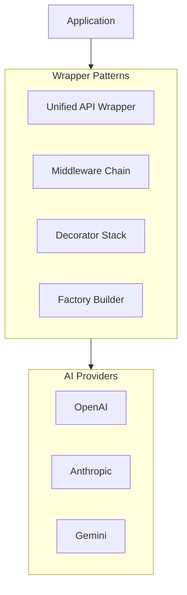

# Custom Wrapper Patterns

## Introduction

Well-designed wrapper patterns enable consistent AI interactions across providers while adding custom functionality. This lesson covers proven patterns for building flexible, maintainable AI client wrappers.

### What We'll Cover

- Unified API wrapper design
- Middleware patterns
- Decorator patterns
- Factory patterns

### Prerequisites

- OOP design patterns
- Python protocol/abstract classes
- Understanding of vendor lock-in challenges

---

## Pattern Overview



---

## Unified API Wrapper

```python
from abc import ABC, abstractmethod
from dataclasses import dataclass, field
from typing import List, Optional, Iterator, Dict, Any
from enum import Enum

class Role(Enum):
    SYSTEM = "system"
    USER = "user"
    ASSISTANT = "assistant"
    TOOL = "tool"


@dataclass
class Message:
    """Unified message format."""
    
    role: Role
    content: str
    name: Optional[str] = None
    tool_call_id: Optional[str] = None


@dataclass
class Tool:
    """Unified tool definition."""
    
    name: str
    description: str
    parameters: Dict[str, Any]  # JSON Schema
    
    def to_openai(self) -> dict:
        return {
            "type": "function",
            "function": {
                "name": self.name,
                "description": self.description,
                "parameters": self.parameters
            }
        }
    
    def to_anthropic(self) -> dict:
        return {
            "name": self.name,
            "description": self.description,
            "input_schema": self.parameters
        }


@dataclass
class ToolCall:
    """Unified tool call result."""
    
    id: str
    name: str
    arguments: dict


@dataclass
class Response:
    """Unified response format."""
    
    content: str
    tool_calls: List[ToolCall] = field(default_factory=list)
    input_tokens: int = 0
    output_tokens: int = 0
    model: str = ""
    finish_reason: str = ""
    
    @property
    def total_tokens(self) -> int:
        return self.input_tokens + self.output_tokens
    
    @property
    def has_tool_calls(self) -> bool:
        return len(self.tool_calls) > 0


@dataclass
class CompletionConfig:
    """Unified completion configuration."""
    
    model: str = None
    temperature: float = 1.0
    max_tokens: Optional[int] = None
    top_p: float = 1.0
    stop: Optional[List[str]] = None
    tools: Optional[List[Tool]] = None
    tool_choice: str = "auto"  # "auto", "none", "required"
    
    def with_model(self, model: str) -> 'CompletionConfig':
        """Create copy with different model."""
        return CompletionConfig(
            model=model,
            temperature=self.temperature,
            max_tokens=self.max_tokens,
            top_p=self.top_p,
            stop=self.stop,
            tools=self.tools,
            tool_choice=self.tool_choice
        )


class UnifiedAI:
    """Unified API wrapper for multiple providers."""
    
    def __init__(self):
        self._providers: Dict[str, 'ProviderAdapter'] = {}
        self._default_provider: str = None
    
    def register_provider(
        self,
        name: str,
        adapter: 'ProviderAdapter',
        default: bool = False
    ):
        """Register a provider adapter."""
        self._providers[name] = adapter
        if default or self._default_provider is None:
            self._default_provider = name
    
    def _get_adapter(self, provider: str = None) -> 'ProviderAdapter':
        """Get provider adapter."""
        provider = provider or self._default_provider
        if provider not in self._providers:
            raise ValueError(f"Unknown provider: {provider}")
        return self._providers[provider]
    
    def complete(
        self,
        messages: List[Message],
        config: CompletionConfig = None,
        provider: str = None
    ) -> Response:
        """Generate completion."""
        config = config or CompletionConfig()
        adapter = self._get_adapter(provider)
        return adapter.complete(messages, config)
    
    def stream(
        self,
        messages: List[Message],
        config: CompletionConfig = None,
        provider: str = None
    ) -> Iterator[str]:
        """Stream completion."""
        config = config or CompletionConfig()
        adapter = self._get_adapter(provider)
        return adapter.stream(messages, config)


class ProviderAdapter(ABC):
    """Abstract adapter for providers."""
    
    @abstractmethod
    def complete(
        self,
        messages: List[Message],
        config: CompletionConfig
    ) -> Response:
        pass
    
    @abstractmethod
    def stream(
        self,
        messages: List[Message],
        config: CompletionConfig
    ) -> Iterator[str]:
        pass


class OpenAIAdapter(ProviderAdapter):
    """OpenAI provider adapter."""
    
    DEFAULT_MODEL = "gpt-4.1"
    
    def __init__(self, api_key: str = None):
        from openai import OpenAI
        self.client = OpenAI(api_key=api_key)
    
    def _convert_messages(self, messages: List[Message]) -> list:
        return [
            {"role": m.role.value, "content": m.content}
            for m in messages
        ]
    
    def complete(
        self,
        messages: List[Message],
        config: CompletionConfig
    ) -> Response:
        kwargs = {
            "model": config.model or self.DEFAULT_MODEL,
            "messages": self._convert_messages(messages),
            "temperature": config.temperature,
        }
        
        if config.max_tokens:
            kwargs["max_tokens"] = config.max_tokens
        
        if config.tools:
            kwargs["tools"] = [t.to_openai() for t in config.tools]
            kwargs["tool_choice"] = config.tool_choice
        
        response = self.client.chat.completions.create(**kwargs)
        choice = response.choices[0]
        
        tool_calls = []
        if choice.message.tool_calls:
            import json
            for tc in choice.message.tool_calls:
                tool_calls.append(ToolCall(
                    id=tc.id,
                    name=tc.function.name,
                    arguments=json.loads(tc.function.arguments)
                ))
        
        return Response(
            content=choice.message.content or "",
            tool_calls=tool_calls,
            input_tokens=response.usage.prompt_tokens,
            output_tokens=response.usage.completion_tokens,
            model=response.model,
            finish_reason=choice.finish_reason
        )
    
    def stream(
        self,
        messages: List[Message],
        config: CompletionConfig
    ) -> Iterator[str]:
        kwargs = {
            "model": config.model or self.DEFAULT_MODEL,
            "messages": self._convert_messages(messages),
            "temperature": config.temperature,
            "stream": True
        }
        
        if config.max_tokens:
            kwargs["max_tokens"] = config.max_tokens
        
        stream = self.client.chat.completions.create(**kwargs)
        
        for chunk in stream:
            if chunk.choices[0].delta.content:
                yield chunk.choices[0].delta.content


class AnthropicAdapter(ProviderAdapter):
    """Anthropic provider adapter."""
    
    DEFAULT_MODEL = "claude-sonnet-4-20250514"
    
    def __init__(self, api_key: str = None):
        from anthropic import Anthropic
        self.client = Anthropic(api_key=api_key)
    
    def _convert_messages(self, messages: List[Message]) -> tuple:
        system = None
        converted = []
        
        for m in messages:
            if m.role == Role.SYSTEM:
                system = m.content
            else:
                converted.append({
                    "role": m.role.value,
                    "content": m.content
                })
        
        return system, converted
    
    def complete(
        self,
        messages: List[Message],
        config: CompletionConfig
    ) -> Response:
        system, converted = self._convert_messages(messages)
        
        kwargs = {
            "model": config.model or self.DEFAULT_MODEL,
            "messages": converted,
            "max_tokens": config.max_tokens or 1024,
        }
        
        if system:
            kwargs["system"] = system
        
        if config.tools:
            kwargs["tools"] = [t.to_anthropic() for t in config.tools]
        
        response = self.client.messages.create(**kwargs)
        
        content = ""
        tool_calls = []
        
        for block in response.content:
            if block.type == "text":
                content += block.text
            elif block.type == "tool_use":
                tool_calls.append(ToolCall(
                    id=block.id,
                    name=block.name,
                    arguments=block.input
                ))
        
        return Response(
            content=content,
            tool_calls=tool_calls,
            input_tokens=response.usage.input_tokens,
            output_tokens=response.usage.output_tokens,
            model=response.model,
            finish_reason=response.stop_reason
        )
    
    def stream(
        self,
        messages: List[Message],
        config: CompletionConfig
    ) -> Iterator[str]:
        system, converted = self._convert_messages(messages)
        
        kwargs = {
            "model": config.model or self.DEFAULT_MODEL,
            "messages": converted,
            "max_tokens": config.max_tokens or 1024,
        }
        
        if system:
            kwargs["system"] = system
        
        with self.client.messages.stream(**kwargs) as stream:
            for text in stream.text_stream:
                yield text


# Usage
ai = UnifiedAI()
ai.register_provider("openai", OpenAIAdapter(), default=True)
ai.register_provider("anthropic", AnthropicAdapter())

messages = [
    Message(Role.SYSTEM, "You are helpful."),
    Message(Role.USER, "Hello!")
]

# Use default (OpenAI)
response = ai.complete(messages)
print(response.content)

# Explicitly use Anthropic
response = ai.complete(messages, provider="anthropic")
print(response.content)

# Streaming
for chunk in ai.stream(messages):
    print(chunk, end="", flush=True)
```

---

## Middleware Pattern

```python
from typing import Callable, TypeVar
from dataclasses import dataclass
import time

# Types
CompletionHandler = Callable[[List[Message], CompletionConfig], Response]
StreamHandler = Callable[[List[Message], CompletionConfig], Iterator[str]]


@dataclass
class Context:
    """Request context passed through middleware."""
    
    messages: List[Message]
    config: CompletionConfig
    metadata: Dict[str, Any] = field(default_factory=dict)
    start_time: float = field(default_factory=time.time)


class Middleware(ABC):
    """Abstract middleware."""
    
    @abstractmethod
    def process(
        self,
        context: Context,
        next_handler: CompletionHandler
    ) -> Response:
        pass


class LoggingMiddleware(Middleware):
    """Middleware for request/response logging."""
    
    def __init__(self, log_content: bool = False):
        self.log_content = log_content
    
    def process(
        self,
        context: Context,
        next_handler: CompletionHandler
    ) -> Response:
        # Pre-processing
        print(f"[LOG] Request: {len(context.messages)} messages")
        if self.log_content:
            print(f"[LOG] Last message: {context.messages[-1].content[:100]}...")
        
        # Call next
        response = next_handler(context.messages, context.config)
        
        # Post-processing
        duration = (time.time() - context.start_time) * 1000
        print(
            f"[LOG] Response: {response.total_tokens} tokens, "
            f"{duration:.0f}ms"
        )
        
        return response


class RetryMiddleware(Middleware):
    """Middleware for automatic retries."""
    
    def __init__(
        self,
        max_retries: int = 3,
        retry_exceptions: tuple = (Exception,)
    ):
        self.max_retries = max_retries
        self.retry_exceptions = retry_exceptions
    
    def process(
        self,
        context: Context,
        next_handler: CompletionHandler
    ) -> Response:
        last_exception = None
        
        for attempt in range(self.max_retries + 1):
            try:
                return next_handler(context.messages, context.config)
            except self.retry_exceptions as e:
                last_exception = e
                if attempt < self.max_retries:
                    delay = 2 ** attempt
                    print(f"[RETRY] Attempt {attempt + 1} failed, waiting {delay}s")
                    time.sleep(delay)
        
        raise last_exception


class CachingMiddleware(Middleware):
    """Middleware for response caching."""
    
    def __init__(self, ttl_seconds: float = 300):
        self.ttl = ttl_seconds
        self.cache: Dict[str, tuple] = {}  # key -> (response, timestamp)
    
    def _cache_key(self, messages: List[Message], config: CompletionConfig) -> str:
        import hashlib
        import json
        
        data = {
            "messages": [(m.role.value, m.content) for m in messages],
            "model": config.model,
            "temperature": config.temperature
        }
        return hashlib.sha256(
            json.dumps(data, sort_keys=True).encode()
        ).hexdigest()[:16]
    
    def process(
        self,
        context: Context,
        next_handler: CompletionHandler
    ) -> Response:
        key = self._cache_key(context.messages, context.config)
        
        # Check cache
        if key in self.cache:
            response, timestamp = self.cache[key]
            if time.time() - timestamp < self.ttl:
                print("[CACHE] Hit")
                return response
        
        # Cache miss
        print("[CACHE] Miss")
        response = next_handler(context.messages, context.config)
        self.cache[key] = (response, time.time())
        
        return response


class ValidationMiddleware(Middleware):
    """Middleware for request validation."""
    
    def __init__(self, max_messages: int = 100, max_content_length: int = 100000):
        self.max_messages = max_messages
        self.max_content_length = max_content_length
    
    def process(
        self,
        context: Context,
        next_handler: CompletionHandler
    ) -> Response:
        # Validate message count
        if len(context.messages) > self.max_messages:
            raise ValueError(
                f"Too many messages: {len(context.messages)} > {self.max_messages}"
            )
        
        # Validate content length
        total_length = sum(len(m.content) for m in context.messages)
        if total_length > self.max_content_length:
            raise ValueError(
                f"Content too long: {total_length} > {self.max_content_length}"
            )
        
        return next_handler(context.messages, context.config)


class MiddlewareChain:
    """Chain of middleware handlers."""
    
    def __init__(self, adapter: ProviderAdapter):
        self.adapter = adapter
        self.middlewares: List[Middleware] = []
    
    def use(self, middleware: Middleware) -> 'MiddlewareChain':
        """Add middleware to chain."""
        self.middlewares.append(middleware)
        return self
    
    def complete(
        self,
        messages: List[Message],
        config: CompletionConfig = None
    ) -> Response:
        """Execute completion through middleware chain."""
        
        config = config or CompletionConfig()
        context = Context(messages=messages, config=config)
        
        # Build handler chain
        def final_handler(msgs: List[Message], cfg: CompletionConfig) -> Response:
            return self.adapter.complete(msgs, cfg)
        
        handler = final_handler
        
        # Apply middlewares in reverse order
        for middleware in reversed(self.middlewares):
            prev_handler = handler
            handler = lambda msgs, cfg, mw=middleware, ph=prev_handler: \
                mw.process(Context(messages=msgs, config=cfg), ph)
        
        return handler(messages, config)


# Usage
chain = MiddlewareChain(OpenAIAdapter())
chain.use(ValidationMiddleware())
chain.use(LoggingMiddleware(log_content=True))
chain.use(RetryMiddleware(max_retries=3))
chain.use(CachingMiddleware(ttl_seconds=300))

# Request flows through: validation → logging → retry → cache → OpenAI
response = chain.complete([
    Message(Role.USER, "Hello!")
])
```

---

## Decorator Pattern

```python
from functools import wraps
from typing import Callable, TypeVar, ParamSpec

P = ParamSpec('P')
R = TypeVar('R')


def with_logging(
    log_request: bool = True,
    log_response: bool = True
):
    """Decorator for logging."""
    
    def decorator(func: Callable[P, R]) -> Callable[P, R]:
        @wraps(func)
        def wrapper(*args, **kwargs):
            if log_request:
                print(f"[LOG] Calling {func.__name__}")
            
            result = func(*args, **kwargs)
            
            if log_response and isinstance(result, Response):
                print(f"[LOG] Response: {result.total_tokens} tokens")
            
            return result
        return wrapper
    return decorator


def with_retry(
    max_retries: int = 3,
    backoff_base: float = 2.0
):
    """Decorator for automatic retries."""
    
    def decorator(func: Callable[P, R]) -> Callable[P, R]:
        @wraps(func)
        def wrapper(*args, **kwargs):
            last_exception = None
            
            for attempt in range(max_retries + 1):
                try:
                    return func(*args, **kwargs)
                except Exception as e:
                    last_exception = e
                    if attempt < max_retries:
                        delay = backoff_base ** attempt
                        time.sleep(delay)
            
            raise last_exception
        return wrapper
    return decorator


def with_timeout(seconds: float):
    """Decorator for request timeout."""
    
    import signal
    
    def decorator(func: Callable[P, R]) -> Callable[P, R]:
        @wraps(func)
        def wrapper(*args, **kwargs):
            def handler(signum, frame):
                raise TimeoutError(f"Request timed out after {seconds}s")
            
            old_handler = signal.signal(signal.SIGALRM, handler)
            signal.alarm(int(seconds))
            
            try:
                return func(*args, **kwargs)
            finally:
                signal.alarm(0)
                signal.signal(signal.SIGALRM, old_handler)
        
        return wrapper
    return decorator


def with_cost_tracking(tracker: 'CostTracker'):
    """Decorator for cost tracking."""
    
    def decorator(func: Callable[P, R]) -> Callable[P, R]:
        @wraps(func)
        def wrapper(*args, **kwargs):
            result = func(*args, **kwargs)
            
            if isinstance(result, Response):
                tracker.record(
                    model=result.model,
                    input_tokens=result.input_tokens,
                    output_tokens=result.output_tokens
                )
            
            return result
        return wrapper
    return decorator


class CostTracker:
    """Simple cost tracker."""
    
    # Pricing per 1M tokens
    PRICING = {
        "gpt-4.1": {"input": 2.00, "output": 8.00},
        "gpt-4.1-mini": {"input": 0.40, "output": 1.60},
    }
    
    def __init__(self):
        self.total_input = 0
        self.total_output = 0
        self.total_cost = 0.0
    
    def record(self, model: str, input_tokens: int, output_tokens: int):
        pricing = self.PRICING.get(model, {"input": 10.0, "output": 30.0})
        
        self.total_input += input_tokens
        self.total_output += output_tokens
        self.total_cost += (
            (input_tokens / 1_000_000) * pricing["input"] +
            (output_tokens / 1_000_000) * pricing["output"]
        )


# Create decorated client
class DecoratedAI:
    """AI client using decorators."""
    
    def __init__(self, adapter: ProviderAdapter):
        self.adapter = adapter
        self.cost_tracker = CostTracker()
        
        # Apply decorators
        self._complete = with_cost_tracking(self.cost_tracker)(
            with_retry(max_retries=3)(
                with_logging()(
                    self._raw_complete
                )
            )
        )
    
    def _raw_complete(
        self,
        messages: List[Message],
        config: CompletionConfig
    ) -> Response:
        return self.adapter.complete(messages, config)
    
    def complete(
        self,
        messages: List[Message],
        config: CompletionConfig = None
    ) -> Response:
        return self._complete(messages, config or CompletionConfig())
    
    @property
    def costs(self) -> dict:
        return {
            "input_tokens": self.cost_tracker.total_input,
            "output_tokens": self.cost_tracker.total_output,
            "total_cost": f"${self.cost_tracker.total_cost:.4f}"
        }


# Usage
ai = DecoratedAI(OpenAIAdapter())

response = ai.complete([
    Message(Role.USER, "Hello!")
])

print(ai.costs)
```

---

## Factory Pattern

```python
from dataclasses import dataclass
from typing import Type, Dict, Optional
from enum import Enum

class Provider(Enum):
    OPENAI = "openai"
    ANTHROPIC = "anthropic"
    GEMINI = "gemini"
    MOCK = "mock"


class Feature(Enum):
    LOGGING = "logging"
    CACHING = "caching"
    RETRY = "retry"
    COST_TRACKING = "cost_tracking"
    VALIDATION = "validation"


@dataclass
class ClientConfig:
    """Configuration for client creation."""
    
    provider: Provider
    api_key: Optional[str] = None
    model: Optional[str] = None
    features: List[Feature] = field(default_factory=list)
    
    # Feature-specific config
    cache_ttl: float = 300.0
    max_retries: int = 3
    log_content: bool = False
    max_messages: int = 100


class AIClientFactory:
    """Factory for creating configured AI clients."""
    
    _adapters: Dict[Provider, Type[ProviderAdapter]] = {
        Provider.OPENAI: OpenAIAdapter,
        Provider.ANTHROPIC: AnthropicAdapter,
    }
    
    @classmethod
    def register_adapter(cls, provider: Provider, adapter_class: Type[ProviderAdapter]):
        """Register an adapter class."""
        cls._adapters[provider] = adapter_class
    
    @classmethod
    def create(cls, config: ClientConfig) -> MiddlewareChain:
        """Create a configured client."""
        
        # Get adapter
        adapter_class = cls._adapters.get(config.provider)
        if not adapter_class:
            raise ValueError(f"Unknown provider: {config.provider}")
        
        adapter = adapter_class(api_key=config.api_key)
        
        # Build middleware chain
        chain = MiddlewareChain(adapter)
        
        # Add features in order
        if Feature.VALIDATION in config.features:
            chain.use(ValidationMiddleware(
                max_messages=config.max_messages
            ))
        
        if Feature.LOGGING in config.features:
            chain.use(LoggingMiddleware(
                log_content=config.log_content
            ))
        
        if Feature.RETRY in config.features:
            chain.use(RetryMiddleware(
                max_retries=config.max_retries
            ))
        
        if Feature.CACHING in config.features:
            chain.use(CachingMiddleware(
                ttl_seconds=config.cache_ttl
            ))
        
        return chain
    
    @classmethod
    def from_env(cls, features: List[Feature] = None) -> MiddlewareChain:
        """Create client from environment variables."""
        
        import os
        
        # Auto-detect provider from env vars
        if os.environ.get("OPENAI_API_KEY"):
            provider = Provider.OPENAI
            api_key = os.environ["OPENAI_API_KEY"]
        elif os.environ.get("ANTHROPIC_API_KEY"):
            provider = Provider.ANTHROPIC
            api_key = os.environ["ANTHROPIC_API_KEY"]
        else:
            raise ValueError("No API key found in environment")
        
        config = ClientConfig(
            provider=provider,
            api_key=api_key,
            features=features or [
                Feature.LOGGING,
                Feature.RETRY
            ]
        )
        
        return cls.create(config)


# Usage
config = ClientConfig(
    provider=Provider.OPENAI,
    features=[
        Feature.VALIDATION,
        Feature.LOGGING,
        Feature.RETRY,
        Feature.CACHING
    ],
    cache_ttl=600.0,
    max_retries=5,
    log_content=True
)

client = AIClientFactory.create(config)

# Or from environment
client = AIClientFactory.from_env(features=[
    Feature.LOGGING,
    Feature.RETRY
])
```

---

## Builder Pattern

```python
class AIClientBuilder:
    """Fluent builder for AI clients."""
    
    def __init__(self):
        self._provider: Provider = None
        self._api_key: str = None
        self._model: str = None
        self._middlewares: List[Middleware] = []
        self._default_config = CompletionConfig()
    
    def with_provider(self, provider: Provider, api_key: str = None) -> 'AIClientBuilder':
        """Set the provider."""
        self._provider = provider
        self._api_key = api_key
        return self
    
    def with_model(self, model: str) -> 'AIClientBuilder':
        """Set default model."""
        self._model = model
        return self
    
    def with_logging(self, log_content: bool = False) -> 'AIClientBuilder':
        """Add logging middleware."""
        self._middlewares.append(LoggingMiddleware(log_content=log_content))
        return self
    
    def with_retry(
        self,
        max_retries: int = 3,
        retry_exceptions: tuple = (Exception,)
    ) -> 'AIClientBuilder':
        """Add retry middleware."""
        self._middlewares.append(RetryMiddleware(
            max_retries=max_retries,
            retry_exceptions=retry_exceptions
        ))
        return self
    
    def with_caching(self, ttl_seconds: float = 300) -> 'AIClientBuilder':
        """Add caching middleware."""
        self._middlewares.append(CachingMiddleware(ttl_seconds=ttl_seconds))
        return self
    
    def with_validation(
        self,
        max_messages: int = 100,
        max_content_length: int = 100000
    ) -> 'AIClientBuilder':
        """Add validation middleware."""
        self._middlewares.append(ValidationMiddleware(
            max_messages=max_messages,
            max_content_length=max_content_length
        ))
        return self
    
    def with_middleware(self, middleware: Middleware) -> 'AIClientBuilder':
        """Add custom middleware."""
        self._middlewares.append(middleware)
        return self
    
    def with_temperature(self, temperature: float) -> 'AIClientBuilder':
        """Set default temperature."""
        self._default_config.temperature = temperature
        return self
    
    def with_max_tokens(self, max_tokens: int) -> 'AIClientBuilder':
        """Set default max tokens."""
        self._default_config.max_tokens = max_tokens
        return self
    
    def build(self) -> 'ConfiguredClient':
        """Build the configured client."""
        
        if not self._provider:
            raise ValueError("Provider not set")
        
        # Create adapter
        adapter_class = AIClientFactory._adapters[self._provider]
        adapter = adapter_class(api_key=self._api_key)
        
        # Create chain
        chain = MiddlewareChain(adapter)
        for middleware in self._middlewares:
            chain.use(middleware)
        
        # Set model in default config
        if self._model:
            self._default_config = self._default_config.with_model(self._model)
        
        return ConfiguredClient(chain, self._default_config)


@dataclass
class ConfiguredClient:
    """Configured AI client."""
    
    chain: MiddlewareChain
    default_config: CompletionConfig
    
    def complete(
        self,
        messages: List[Message],
        config: CompletionConfig = None
    ) -> Response:
        """Complete with default config."""
        effective_config = config or self.default_config
        return self.chain.complete(messages, effective_config)
    
    def chat(self, user_message: str) -> str:
        """Simple chat interface."""
        response = self.complete([
            Message(Role.USER, user_message)
        ])
        return response.content


# Usage - fluent interface
client = (
    AIClientBuilder()
    .with_provider(Provider.OPENAI)
    .with_model("gpt-4.1")
    .with_validation()
    .with_logging(log_content=True)
    .with_retry(max_retries=3)
    .with_caching(ttl_seconds=600)
    .with_temperature(0.7)
    .with_max_tokens(1000)
    .build()
)

# Simple usage
response = client.chat("Hello, how are you?")
print(response)
```

---

## Hands-on Exercise

### Your Task

Create a plugin-based AI client wrapper.

### Requirements

1. Define a plugin interface with hooks
2. Implement plugins for: metrics, rate limiting, content filtering
3. Allow plugins to be enabled/disabled at runtime
4. Provide plugin discovery and registration

### Expected Result

```python
client = PluginAI()
client.register_plugin(MetricsPlugin())
client.register_plugin(RateLimitPlugin(requests_per_minute=60))
client.register_plugin(ContentFilterPlugin())

response = client.complete(messages)

# Disable a plugin
client.disable_plugin("content_filter")
```

<details>
<summary>💡 Hints</summary>

- Use a hook-based interface (pre_request, post_response)
- Store plugins in a dict by name
- Check enabled status before calling hooks
</details>

<details>
<summary>✅ Solution</summary>

```python
from abc import ABC, abstractmethod
from dataclasses import dataclass, field
from typing import Dict, Any, Optional
from datetime import datetime
import time

@dataclass
class PluginContext:
    """Context passed to plugins."""
    
    messages: List[Message]
    config: CompletionConfig
    response: Optional[Response] = None
    error: Optional[Exception] = None
    metadata: Dict[str, Any] = field(default_factory=dict)
    start_time: float = field(default_factory=time.time)


class Plugin(ABC):
    """Base plugin interface."""
    
    @property
    @abstractmethod
    def name(self) -> str:
        """Unique plugin name."""
        pass
    
    def pre_request(self, context: PluginContext) -> PluginContext:
        """Hook called before request. Can modify context."""
        return context
    
    def post_response(self, context: PluginContext) -> PluginContext:
        """Hook called after response. Can modify context."""
        return context
    
    def on_error(self, context: PluginContext) -> PluginContext:
        """Hook called on error."""
        return context


class MetricsPlugin(Plugin):
    """Plugin for collecting metrics."""
    
    @property
    def name(self) -> str:
        return "metrics"
    
    def __init__(self):
        self.requests = 0
        self.total_tokens = 0
        self.total_latency_ms = 0.0
        self.errors = 0
    
    def pre_request(self, context: PluginContext) -> PluginContext:
        context.metadata["request_start"] = time.time()
        self.requests += 1
        return context
    
    def post_response(self, context: PluginContext) -> PluginContext:
        start = context.metadata.get("request_start", context.start_time)
        latency = (time.time() - start) * 1000
        
        self.total_latency_ms += latency
        
        if context.response:
            self.total_tokens += context.response.total_tokens
        
        return context
    
    def on_error(self, context: PluginContext) -> PluginContext:
        self.errors += 1
        return context
    
    def get_metrics(self) -> dict:
        return {
            "total_requests": self.requests,
            "total_tokens": self.total_tokens,
            "total_errors": self.errors,
            "avg_latency_ms": self.total_latency_ms / max(1, self.requests)
        }


class RateLimitPlugin(Plugin):
    """Plugin for rate limiting."""
    
    @property
    def name(self) -> str:
        return "rate_limit"
    
    def __init__(self, requests_per_minute: int = 60):
        self.limit = requests_per_minute
        self.window_start = time.time()
        self.request_count = 0
    
    def pre_request(self, context: PluginContext) -> PluginContext:
        current_time = time.time()
        
        # Reset window
        if current_time - self.window_start >= 60:
            self.window_start = current_time
            self.request_count = 0
        
        # Check limit
        if self.request_count >= self.limit:
            wait_time = 60 - (current_time - self.window_start)
            raise Exception(
                f"Rate limit exceeded. Wait {wait_time:.1f}s"
            )
        
        self.request_count += 1
        return context


class ContentFilterPlugin(Plugin):
    """Plugin for content filtering."""
    
    @property
    def name(self) -> str:
        return "content_filter"
    
    def __init__(self, blocked_terms: List[str] = None):
        self.blocked_terms = blocked_terms or [
            "password",
            "credit card",
            "ssn"
        ]
    
    def pre_request(self, context: PluginContext) -> PluginContext:
        for message in context.messages:
            content_lower = message.content.lower()
            for term in self.blocked_terms:
                if term in content_lower:
                    raise ValueError(
                        f"Content contains blocked term: '{term}'"
                    )
        return context
    
    def post_response(self, context: PluginContext) -> PluginContext:
        if context.response:
            content_lower = context.response.content.lower()
            for term in self.blocked_terms:
                if term in content_lower:
                    # Redact the term
                    context.response.content = context.response.content.replace(
                        term, "[REDACTED]"
                    )
        return context


@dataclass
class RegisteredPlugin:
    """Plugin registration entry."""
    
    plugin: Plugin
    enabled: bool = True


class PluginAI:
    """Plugin-based AI client."""
    
    def __init__(self, adapter: ProviderAdapter = None):
        self.adapter = adapter or OpenAIAdapter()
        self.plugins: Dict[str, RegisteredPlugin] = {}
    
    def register_plugin(self, plugin: Plugin) -> 'PluginAI':
        """Register a plugin."""
        self.plugins[plugin.name] = RegisteredPlugin(plugin=plugin)
        print(f"[PLUGIN] Registered: {plugin.name}")
        return self
    
    def unregister_plugin(self, name: str) -> bool:
        """Unregister a plugin."""
        if name in self.plugins:
            del self.plugins[name]
            print(f"[PLUGIN] Unregistered: {name}")
            return True
        return False
    
    def enable_plugin(self, name: str) -> bool:
        """Enable a plugin."""
        if name in self.plugins:
            self.plugins[name].enabled = True
            print(f"[PLUGIN] Enabled: {name}")
            return True
        return False
    
    def disable_plugin(self, name: str) -> bool:
        """Disable a plugin."""
        if name in self.plugins:
            self.plugins[name].enabled = False
            print(f"[PLUGIN] Disabled: {name}")
            return True
        return False
    
    def get_plugin(self, name: str) -> Optional[Plugin]:
        """Get a registered plugin."""
        entry = self.plugins.get(name)
        return entry.plugin if entry else None
    
    def _get_enabled_plugins(self) -> List[Plugin]:
        """Get all enabled plugins."""
        return [
            entry.plugin 
            for entry in self.plugins.values() 
            if entry.enabled
        ]
    
    def complete(
        self,
        messages: List[Message],
        config: CompletionConfig = None
    ) -> Response:
        """Complete with plugin processing."""
        
        config = config or CompletionConfig()
        context = PluginContext(messages=messages, config=config)
        
        plugins = self._get_enabled_plugins()
        
        try:
            # Pre-request hooks
            for plugin in plugins:
                context = plugin.pre_request(context)
            
            # Make request
            context.response = self.adapter.complete(
                context.messages,
                context.config
            )
            
            # Post-response hooks
            for plugin in plugins:
                context = plugin.post_response(context)
            
            return context.response
            
        except Exception as e:
            context.error = e
            
            # Error hooks
            for plugin in plugins:
                context = plugin.on_error(context)
            
            raise


# Test
client = PluginAI()
client.register_plugin(MetricsPlugin())
client.register_plugin(RateLimitPlugin(requests_per_minute=60))
client.register_plugin(ContentFilterPlugin())

# Make request
response = client.complete([
    Message(Role.USER, "Hello, how are you?")
])
print(f"Response: {response.content}")

# Get metrics
metrics_plugin = client.get_plugin("metrics")
if isinstance(metrics_plugin, MetricsPlugin):
    print(f"Metrics: {metrics_plugin.get_metrics()}")

# Disable content filter
client.disable_plugin("content_filter")

# Now this would work (if content filter was blocking)
response = client.complete([
    Message(Role.USER, "What is a password?")
])
```

</details>

---

## Summary

✅ Unified API wrappers enable provider-agnostic code  
✅ Middleware chains provide flexible request/response processing  
✅ Decorators add functionality without modifying base classes  
✅ Factory and builder patterns simplify client configuration  
✅ Plugin systems allow runtime customization

**Next:** [Modern SDK Features](./06-modern-sdk-features.md)

---

## Further Reading

- [Middleware Pattern](https://en.wikipedia.org/wiki/Middleware) — Pattern overview
- [Chain of Responsibility](https://refactoring.guru/design-patterns/chain-of-responsibility) — Design pattern
- [Builder Pattern](https://refactoring.guru/design-patterns/builder) — Fluent builders

<!-- 
Sources Consulted:
- Design Patterns: https://refactoring.guru/design-patterns
- OpenAI SDK: https://github.com/openai/openai-python
- Anthropic SDK: https://docs.anthropic.com/en/api/client-sdks
-->
