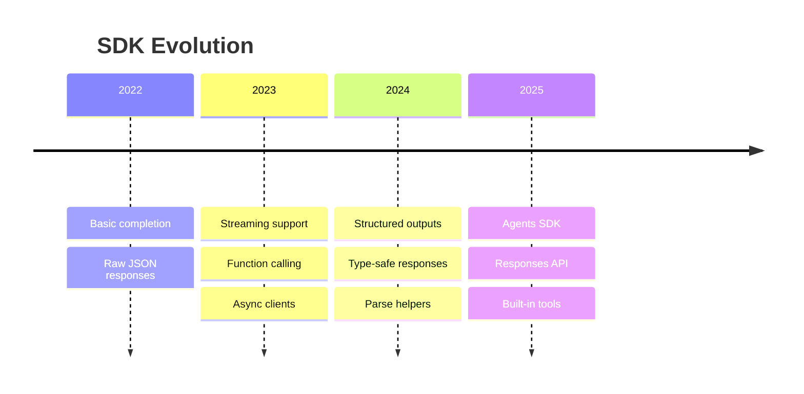

# Modern SDK Features (2024-2025)

## Introduction

Modern AI SDKs have evolved beyond simple HTTP wrappers. This lesson covers the latest SDK features including structured output parsing, helper methods, the Agents SDK, and Responses API support.

### What We'll Cover

- Structured output with `parse()` methods
- Pydantic and Zod schema integration
- `output_text` and `output_parsed` helpers
- OpenAI Agents SDK
- Responses API support

### Prerequisites

- Experience with OpenAI/Anthropic SDKs
- Understanding of Pydantic (Python) or Zod (TypeScript)
- Basic async/await patterns

---

## Evolution of AI SDKs



---

## Structured Outputs with parse()

### Python with Pydantic

```python
from openai import OpenAI
from pydantic import BaseModel, Field
from typing import List, Optional

client = OpenAI()

# Define your output schema
class MovieReview(BaseModel):
    """A structured movie review."""
    
    title: str = Field(description="Movie title")
    year: int = Field(description="Release year")
    rating: float = Field(ge=0, le=10, description="Rating out of 10")
    genres: List[str] = Field(description="List of genres")
    summary: str = Field(description="Brief summary")
    recommend: bool = Field(description="Would recommend")


# Use parse() method for structured output
response = client.beta.chat.completions.parse(
    model="gpt-4.1",
    messages=[
        {"role": "system", "content": "Extract movie information."},
        {"role": "user", "content": "The Matrix (1999) is a sci-fi action classic. 9/10, must watch!"}
    ],
    response_format=MovieReview
)

# Get typed, validated output
review: MovieReview = response.choices[0].message.parsed

print(f"Title: {review.title}")
print(f"Year: {review.year}")
print(f"Rating: {review.rating}/10")
print(f"Genres: {', '.join(review.genres)}")
print(f"Recommend: {'Yes' if review.recommend else 'No'}")


# Complex nested structures
class Cast(BaseModel):
    actor: str
    character: str


class MovieDetails(BaseModel):
    title: str
    year: int
    director: str
    cast: List[Cast]
    plot_points: List[str]
    themes: List[str]


response = client.beta.chat.completions.parse(
    model="gpt-4.1",
    messages=[
        {"role": "user", "content": "Analyze the movie Inception (2010)"}
    ],
    response_format=MovieDetails
)

details: MovieDetails = response.choices[0].message.parsed

for actor in details.cast:
    print(f"{actor.actor} as {actor.character}")
```

### TypeScript with Zod

```typescript
import OpenAI from 'openai';
import { z } from 'zod';
import { zodResponseFormat } from 'openai/helpers/zod';

const client = new OpenAI();

// Define schema with Zod
const MovieReviewSchema = z.object({
  title: z.string().describe('Movie title'),
  year: z.number().int().describe('Release year'),
  rating: z.number().min(0).max(10).describe('Rating out of 10'),
  genres: z.array(z.string()).describe('List of genres'),
  summary: z.string().describe('Brief summary'),
  recommend: z.boolean().describe('Would recommend')
});

type MovieReview = z.infer<typeof MovieReviewSchema>;

async function getReview(description: string): Promise<MovieReview> {
  const response = await client.beta.chat.completions.parse({
    model: 'gpt-4.1',
    messages: [
      { role: 'system', content: 'Extract movie information.' },
      { role: 'user', content: description }
    ],
    response_format: zodResponseFormat(MovieReviewSchema, 'movie_review')
  });

  // Typed response
  const review = response.choices[0].message.parsed;
  
  if (!review) {
    throw new Error('Failed to parse response');
  }
  
  return review;
}

// Usage
const review = await getReview('The Dark Knight (2008) - 9.5/10 masterpiece');
console.log(review.title);  // TypeScript knows this is a string
```

---

## Output Text and Parsed Helpers

### Quick Access to Content

```python
from openai import OpenAI

client = OpenAI()

# Standard approach
response = client.chat.completions.create(
    model="gpt-4.1",
    messages=[{"role": "user", "content": "Hello!"}]
)
content = response.choices[0].message.content

# New helper: output_text
# Available in Responses API
response = client.responses.create(
    model="gpt-4.1",
    input="Hello!"
)
# Direct access to text output
text = response.output_text
print(text)


# With structured output: output_parsed
from pydantic import BaseModel

class Answer(BaseModel):
    response: str
    confidence: float

response = client.responses.create(
    model="gpt-4.1",
    input="What's the capital of France?",
    text={"format": {"type": "json_schema", "schema": Answer.model_json_schema()}}
)

# Direct access to parsed output
answer = response.output_parsed
print(f"Answer: {answer['response']} (confidence: {answer['confidence']})")
```

### Streaming with Helpers

```python
# Stream and collect text
def stream_text(prompt: str) -> str:
    """Stream response and return full text."""
    
    chunks = []
    
    with client.responses.create(
        model="gpt-4.1",
        input=prompt,
        stream=True
    ) as stream:
        for event in stream:
            if event.type == "response.output_text.delta":
                chunk = event.delta
                chunks.append(chunk)
                print(chunk, end="", flush=True)
    
    print()  # Newline
    return "".join(chunks)


# Typed streaming (2025 SDK feature)
async def stream_structured(prompt: str) -> MovieReview:
    """Stream with incremental parsing."""
    
    partial = None
    
    async with client.beta.chat.completions.stream(
        model="gpt-4.1",
        messages=[{"role": "user", "content": prompt}],
        response_format=MovieReview
    ) as stream:
        async for chunk in stream:
            # Get partial parsed object
            partial = chunk.choices[0].message.parsed_partial
            if partial:
                print(f"Partial: {partial}")
    
    # Final complete object
    return stream.get_final_completion().choices[0].message.parsed
```

---

## OpenAI Agents SDK (2025)

### Basic Agent

```python
from openai import OpenAI
from openai.types.beta import Agent, Thread, Run

client = OpenAI()

# Create an agent
agent = client.beta.agents.create(
    model="gpt-4.1",
    name="Research Assistant",
    instructions="""You are a research assistant. 
    Help users find and summarize information.
    Use web search when needed.""",
    tools=[
        {"type": "web_search"},  # Built-in web search
        {"type": "code_interpreter"}  # Built-in code execution
    ]
)

print(f"Created agent: {agent.id}")

# Create a thread (conversation)
thread = client.beta.threads.create()

# Add user message
client.beta.threads.messages.create(
    thread_id=thread.id,
    role="user",
    content="What are the latest developments in quantum computing?"
)

# Run the agent
run = client.beta.threads.runs.create(
    thread_id=thread.id,
    agent_id=agent.id
)

# Wait for completion
import time
while run.status in ["queued", "in_progress"]:
    time.sleep(1)
    run = client.beta.threads.runs.retrieve(
        thread_id=thread.id,
        run_id=run.id
    )

# Get response
messages = client.beta.threads.messages.list(thread_id=thread.id)
for msg in messages.data:
    if msg.role == "assistant":
        for block in msg.content:
            if block.type == "text":
                print(block.text.value)
```

### Agent with Custom Tools

```python
from openai import OpenAI
from pydantic import BaseModel

client = OpenAI()

# Define tools with Pydantic
class WeatherQuery(BaseModel):
    """Get weather for a location."""
    location: str
    unit: str = "celsius"


class SearchQuery(BaseModel):
    """Search for information."""
    query: str
    max_results: int = 5


# Tool implementations
def get_weather(location: str, unit: str = "celsius") -> dict:
    """Mock weather function."""
    return {
        "location": location,
        "temperature": 22 if unit == "celsius" else 72,
        "unit": unit,
        "conditions": "sunny"
    }


def search(query: str, max_results: int = 5) -> list:
    """Mock search function."""
    return [
        {"title": f"Result {i}", "snippet": f"Info about {query}"}
        for i in range(min(max_results, 3))
    ]


# Register tools with agent
tools = [
    {
        "type": "function",
        "function": {
            "name": "get_weather",
            "description": "Get weather for a location",
            "parameters": WeatherQuery.model_json_schema()
        }
    },
    {
        "type": "function", 
        "function": {
            "name": "search",
            "description": "Search for information",
            "parameters": SearchQuery.model_json_schema()
        }
    }
]

agent = client.beta.agents.create(
    model="gpt-4.1",
    name="Multi-Tool Agent",
    tools=tools
)


# Handle tool calls
def handle_run(thread_id: str, run_id: str):
    """Handle a run, including tool calls."""
    
    while True:
        run = client.beta.threads.runs.retrieve(
            thread_id=thread_id,
            run_id=run_id
        )
        
        if run.status == "completed":
            return run
        
        elif run.status == "requires_action":
            # Process tool calls
            tool_outputs = []
            
            for tool_call in run.required_action.submit_tool_outputs.tool_calls:
                import json
                args = json.loads(tool_call.function.arguments)
                
                if tool_call.function.name == "get_weather":
                    result = get_weather(**args)
                elif tool_call.function.name == "search":
                    result = search(**args)
                else:
                    result = {"error": "Unknown function"}
                
                tool_outputs.append({
                    "tool_call_id": tool_call.id,
                    "output": json.dumps(result)
                })
            
            # Submit results
            client.beta.threads.runs.submit_tool_outputs(
                thread_id=thread_id,
                run_id=run_id,
                tool_outputs=tool_outputs
            )
        
        elif run.status in ["failed", "cancelled", "expired"]:
            raise Exception(f"Run failed: {run.status}")
        
        else:
            time.sleep(0.5)
```

### TypeScript Agents SDK

```typescript
import OpenAI from 'openai';

const client = new OpenAI();

async function runAgent(userMessage: string): Promise<string> {
  // Create agent
  const agent = await client.beta.agents.create({
    model: 'gpt-4.1',
    name: 'Assistant',
    instructions: 'You are a helpful assistant.',
    tools: [{ type: 'web_search' }]
  });

  // Create thread
  const thread = await client.beta.threads.create();

  // Add message
  await client.beta.threads.messages.create(thread.id, {
    role: 'user',
    content: userMessage
  });

  // Create run and stream
  const stream = client.beta.threads.runs.stream(thread.id, {
    agent_id: agent.id
  });

  let response = '';

  // Handle streaming events
  for await (const event of stream) {
    if (event.event === 'thread.message.delta') {
      const delta = event.data.delta.content?.[0];
      if (delta?.type === 'text') {
        const chunk = delta.text?.value || '';
        response += chunk;
        process.stdout.write(chunk);
      }
    }
  }

  // Cleanup
  await client.beta.agents.del(agent.id);

  return response;
}
```

---

## Responses API (2025)

### Simpler API Surface

```python
from openai import OpenAI

client = OpenAI()

# Old Chat Completions API
old_response = client.chat.completions.create(
    model="gpt-4.1",
    messages=[
        {"role": "system", "content": "You are helpful."},
        {"role": "user", "content": "Hello!"}
    ]
)
old_text = old_response.choices[0].message.content

# New Responses API - simpler
new_response = client.responses.create(
    model="gpt-4.1",
    input="Hello!",
    instructions="You are helpful."  # System prompt
)
new_text = new_response.output_text

print(f"Old API: {old_text}")
print(f"New API: {new_text}")
```

### Responses API with Tools

```python
# Define tools
tools = [
    {
        "type": "function",
        "name": "get_weather",
        "description": "Get current weather",
        "parameters": {
            "type": "object",
            "properties": {
                "location": {"type": "string"}
            },
            "required": ["location"]
        }
    }
]

# Call with tools
response = client.responses.create(
    model="gpt-4.1",
    input="What's the weather in Tokyo?",
    tools=tools
)

# Check for tool calls
for output in response.output:
    if output.type == "function_call":
        print(f"Tool: {output.name}")
        print(f"Args: {output.arguments}")
        
        # Execute and continue
        result = {"temperature": 22, "conditions": "sunny"}
        
        # Send tool result
        response = client.responses.create(
            model="gpt-4.1",
            input=[
                {"type": "function_call", "id": output.id, "name": output.name},
                {"type": "function_call_output", "call_id": output.id, "output": str(result)}
            ],
            tools=tools
        )
        
        print(f"Final: {response.output_text}")
```

### Responses API with Built-in Tools

```python
# Web search (built-in)
response = client.responses.create(
    model="gpt-4.1",
    input="What are the latest news about AI?",
    tools=[{"type": "web_search"}]
)

# The model automatically searches and summarizes
print(response.output_text)

# Code interpreter (built-in)
response = client.responses.create(
    model="gpt-4.1",
    input="Calculate the first 10 prime numbers",
    tools=[{"type": "code_interpreter"}]
)

# Code was executed
for output in response.output:
    if output.type == "code":
        print(f"Code:\n{output.code}")
    elif output.type == "code_output":
        print(f"Output:\n{output.output}")
    elif output.type == "text":
        print(f"Text: {output.text}")


# File search with vector store
response = client.responses.create(
    model="gpt-4.1",
    input="What does our policy say about refunds?",
    tools=[{
        "type": "file_search",
        "vector_store_ids": ["vs_abc123"]
    }]
)
```

---

## MCP (Model Context Protocol) Integration

```python
from openai import OpenAI
from openai.types.beta import MCPServer

client = OpenAI()

# Connect to MCP servers
response = client.responses.create(
    model="gpt-4.1",
    input="What files are in my project?",
    tools=[
        {
            "type": "mcp",
            "server": {
                "url": "http://localhost:3000",  # Local MCP server
                "name": "filesystem"
            }
        }
    ]
)

# Model can use MCP tools
print(response.output_text)


# Multiple MCP servers
response = client.responses.create(
    model="gpt-4.1",
    input="Get data from my database and visualize it",
    tools=[
        {
            "type": "mcp",
            "server": {"url": "http://localhost:3001", "name": "database"}
        },
        {
            "type": "mcp",
            "server": {"url": "http://localhost:3002", "name": "visualization"}
        }
    ]
)
```

---

## SDK Feature Comparison

| Feature | OpenAI Python | OpenAI TS | Anthropic | Gemini |
|---------|--------------|-----------|-----------|--------|
| `parse()` | ✅ | ✅ | ❌ | ❌ |
| Pydantic/Zod | ✅ | ✅ | ❌ | Partial |
| Streaming types | ✅ | ✅ | ✅ | ✅ |
| Agents SDK | ✅ | ✅ | ❌ | ❌ |
| Responses API | ✅ | ✅ | ❌ | ❌ |
| Built-in tools | ✅ | ✅ | ✅ | ✅ |
| MCP support | ✅ | ✅ | ✅ | ❌ |

---

## Best Practices for Modern SDKs

```python
from openai import OpenAI
from pydantic import BaseModel, Field
from typing import List, Optional

client = OpenAI()

# 1. Always use type-safe structured outputs
class APIResponse(BaseModel):
    success: bool
    data: dict
    error: Optional[str] = None


# 2. Leverage parse() for complex extractions
class OrderDetails(BaseModel):
    order_id: str
    items: List[str]
    total: float
    status: str


def extract_order(text: str) -> OrderDetails:
    response = client.beta.chat.completions.parse(
        model="gpt-4.1",
        messages=[{"role": "user", "content": f"Extract order details: {text}"}],
        response_format=OrderDetails
    )
    return response.choices[0].message.parsed


# 3. Use Responses API for simple interactions
def quick_answer(question: str) -> str:
    response = client.responses.create(
        model="gpt-4.1-mini",
        input=question
    )
    return response.output_text


# 4. Use Agents for complex multi-step tasks
def research_task(topic: str) -> str:
    agent = client.beta.agents.create(
        model="gpt-4.1",
        name="Researcher",
        tools=[{"type": "web_search"}]
    )
    
    thread = client.beta.threads.create()
    client.beta.threads.messages.create(
        thread_id=thread.id,
        role="user",
        content=f"Research: {topic}"
    )
    
    run = client.beta.threads.runs.create_and_poll(
        thread_id=thread.id,
        agent_id=agent.id
    )
    
    messages = client.beta.threads.messages.list(thread_id=thread.id)
    result = messages.data[0].content[0].text.value
    
    # Cleanup
    client.beta.agents.del(agent.id)
    
    return result


# 5. Combine features for powerful workflows
class ResearchResult(BaseModel):
    topic: str
    summary: str
    key_points: List[str]
    sources: List[str]
    confidence: float


async def structured_research(topic: str) -> ResearchResult:
    """Research with structured output."""
    
    # Step 1: Research using agent with web search
    raw_research = research_task(topic)
    
    # Step 2: Structure the results
    response = client.beta.chat.completions.parse(
        model="gpt-4.1",
        messages=[{
            "role": "user",
            "content": f"Structure this research:\n\n{raw_research}"
        }],
        response_format=ResearchResult
    )
    
    return response.choices[0].message.parsed
```

---

## Hands-on Exercise

### Your Task

Build a structured data extraction pipeline using modern SDK features.

### Requirements

1. Define Pydantic models for: Company, Person, Event
2. Use `parse()` to extract entities from text
3. Handle extraction failures gracefully
4. Support batch processing

### Expected Result

```python
extractor = EntityExtractor()

text = """
Apple Inc. announced that CEO Tim Cook will present 
at WWDC 2025 on June 10th in Cupertino.
"""

entities = extractor.extract(text)
print(entities)
# {
#   "companies": [{"name": "Apple Inc.", "type": "technology"}],
#   "people": [{"name": "Tim Cook", "role": "CEO", "company": "Apple Inc."}],
#   "events": [{"name": "WWDC 2025", "date": "2025-06-10", "location": "Cupertino"}]
# }
```

<details>
<summary>💡 Hints</summary>

- Use Optional fields for entities that might not be found
- Create a parent model that contains all entity types
- Use try/except around parse() calls
</details>

<details>
<summary>✅ Solution</summary>

```python
from openai import OpenAI
from pydantic import BaseModel, Field
from typing import List, Optional
from dataclasses import dataclass

client = OpenAI()


# Entity models
class Company(BaseModel):
    """A company or organization."""
    name: str = Field(description="Company name")
    type: Optional[str] = Field(None, description="Industry/type")
    location: Optional[str] = Field(None, description="Headquarters location")


class Person(BaseModel):
    """A person mentioned in text."""
    name: str = Field(description="Full name")
    role: Optional[str] = Field(None, description="Job title or role")
    company: Optional[str] = Field(None, description="Associated company")


class Event(BaseModel):
    """An event or occurrence."""
    name: str = Field(description="Event name")
    date: Optional[str] = Field(None, description="Date (YYYY-MM-DD if known)")
    location: Optional[str] = Field(None, description="Event location")
    description: Optional[str] = Field(None, description="Brief description")


class ExtractedEntities(BaseModel):
    """All extracted entities from text."""
    companies: List[Company] = Field(default_factory=list)
    people: List[Person] = Field(default_factory=list)
    events: List[Event] = Field(default_factory=list)


@dataclass
class ExtractionResult:
    """Result of entity extraction."""
    success: bool
    entities: Optional[ExtractedEntities]
    error: Optional[str]
    source_text: str


class EntityExtractor:
    """Extract structured entities from text."""
    
    def __init__(self, model: str = "gpt-4.1"):
        self.client = OpenAI()
        self.model = model
    
    def extract(self, text: str) -> ExtractionResult:
        """Extract entities from a single text."""
        
        try:
            response = self.client.beta.chat.completions.parse(
                model=self.model,
                messages=[
                    {
                        "role": "system",
                        "content": """Extract all companies, people, and events from the text.
                        Be thorough but only extract entities that are clearly mentioned.
                        For dates, use YYYY-MM-DD format when possible."""
                    },
                    {
                        "role": "user",
                        "content": text
                    }
                ],
                response_format=ExtractedEntities
            )
            
            entities = response.choices[0].message.parsed
            
            return ExtractionResult(
                success=True,
                entities=entities,
                error=None,
                source_text=text
            )
            
        except Exception as e:
            return ExtractionResult(
                success=False,
                entities=None,
                error=str(e),
                source_text=text
            )
    
    def extract_batch(
        self,
        texts: List[str],
        continue_on_error: bool = True
    ) -> List[ExtractionResult]:
        """Extract entities from multiple texts."""
        
        results = []
        
        for text in texts:
            result = self.extract(text)
            results.append(result)
            
            if not result.success and not continue_on_error:
                break
        
        return results
    
    def to_dict(self, result: ExtractionResult) -> dict:
        """Convert result to dictionary."""
        
        if not result.success:
            return {"error": result.error}
        
        return {
            "companies": [c.model_dump() for c in result.entities.companies],
            "people": [p.model_dump() for p in result.entities.people],
            "events": [e.model_dump() for e in result.entities.events]
        }


# Test
extractor = EntityExtractor()

texts = [
    """Apple Inc. announced that CEO Tim Cook will present 
    at WWDC 2025 on June 10th in Cupertino.""",
    
    """Microsoft's Satya Nadella met with OpenAI's Sam Altman
    at the Davos Economic Forum 2025 in Switzerland.""",
    
    """Tesla reported Q4 earnings. Elon Musk discussed
    the new Cybertruck production in Austin, Texas."""
]

# Batch extraction
results = extractor.extract_batch(texts)

for i, result in enumerate(results):
    print(f"\n--- Text {i+1} ---")
    if result.success:
        data = extractor.to_dict(result)
        
        print("Companies:", [c["name"] for c in data["companies"]])
        print("People:", [p["name"] for p in data["people"]])
        print("Events:", [e["name"] for e in data["events"]])
    else:
        print(f"Error: {result.error}")
```

</details>

---

## Summary

✅ `parse()` methods provide type-safe structured outputs  
✅ Pydantic/Zod integration enables validated responses  
✅ Responses API simplifies common use cases  
✅ Agents SDK enables autonomous multi-step workflows  
✅ Built-in tools (web search, code interpreter) add capabilities

**Next Lesson:** [Batch API Processing](../11-batch-api-processing/00-batch-api-processing.md)

---

## Further Reading

- [OpenAI Structured Outputs](https://platform.openai.com/docs/guides/structured-outputs) — Official guide
- [OpenAI Agents SDK](https://platform.openai.com/docs/agents) — Agent documentation
- [OpenAI Responses API](https://platform.openai.com/docs/api-reference/responses) — API reference
- [Pydantic Documentation](https://docs.pydantic.dev/) — Python validation
- [Zod Documentation](https://zod.dev/) — TypeScript validation

<!-- 
Sources Consulted:
- OpenAI SDK: https://github.com/openai/openai-python
- OpenAI Docs: https://platform.openai.com/docs
- Pydantic: https://docs.pydantic.dev/
- Zod: https://zod.dev/
-->
