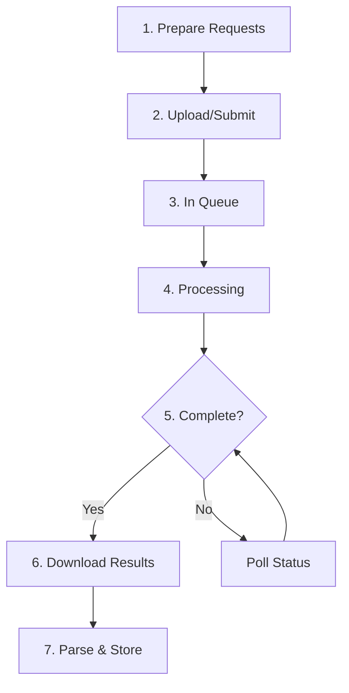

# Batch API Processing

## Introduction

Batch APIs process large numbers of requests asynchronously at significant cost savings. This lesson teaches you how to effectively use batch processing for high-volume AI workloads.

### Why Batch Processing Matters

| Aspect | Real-time API | Batch API |
|--------|--------------|-----------|
| **Cost** | Full price | 50% discount |
| **Latency** | Seconds | Hours |
| **Rate limits** | Apply per request | Higher limits |
| **Use case** | Interactive | Background processing |

### What You'll Learn

In this lesson folder, we'll cover:

| File | Topic | Description |
|------|-------|-------------|
| [01-batch-patterns](./01-batch-patterns.md) | Batch Request Patterns | When to use, size optimization, input prep |
| [02-openai-batch-api](./02-openai-batch-api.md) | OpenAI Batch API | File upload, job submission, result retrieval |
| [03-job-management](./03-job-management.md) | Job Submission & Polling | Status states, polling intervals, timeouts |
| [04-cost-savings](./04-cost-savings.md) | Cost Savings | Pricing discounts, volume considerations |
| [05-result-handling](./05-result-handling.md) | Batch Result Handling | Parsing, errors, partial success |
| [06-multi-provider-batch](./06-multi-provider-batch.md) | Multi-Provider Batch | Claude, Gemini batch APIs |

---

## Quick Comparison: Provider Batch APIs

| Provider | Batch API | Discount | Max Wait | Features |
|----------|-----------|----------|----------|----------|
| OpenAI | Batch API | 50% | 24 hours | JSONL files, webhooks |
| Anthropic | Message Batches | 50% | 24 hours | Direct API, no files |
| Google | Gemini Batch | Varies | 24+ hours | BigQuery integration |
| Azure OpenAI | Batch Deployment | Up to 50% | Configurable | Azure Blob Storage |

---

## Batch Processing Workflow



---

## When to Use Batch Processing

### ✅ Good Use Cases

- **Bulk content generation** — Product descriptions, marketing copy
- **Data processing** — Classification, extraction, summarization
- **Embedding generation** — Large document collections
- **Evaluation runs** — Testing prompts at scale
- **Scheduled tasks** — Nightly reports, weekly analyses

### ❌ Not Suitable For

- **Interactive applications** — Chatbots, real-time assistants
- **Time-sensitive requests** — Urgent processing needs
- **Small volumes** — Under 100 requests
- **Iterative workflows** — When each result affects the next

---

## Quick Start: OpenAI Batch API

```python
from openai import OpenAI
import json

client = OpenAI()

# 1. Prepare requests as JSONL
requests = [
    {
        "custom_id": f"request-{i}",
        "method": "POST",
        "url": "/v1/chat/completions",
        "body": {
            "model": "gpt-4.1-mini",
            "messages": [{"role": "user", "content": f"Summarize topic {i}"}]
        }
    }
    for i in range(100)
]

# Write to file
with open("batch_input.jsonl", "w") as f:
    for req in requests:
        f.write(json.dumps(req) + "\n")

# 2. Upload file
with open("batch_input.jsonl", "rb") as f:
    file = client.files.create(file=f, purpose="batch")

# 3. Create batch
batch = client.batches.create(
    input_file_id=file.id,
    endpoint="/v1/chat/completions",
    completion_window="24h"
)

print(f"Batch ID: {batch.id}")
print(f"Status: {batch.status}")

# 4. Poll for completion (see detailed lesson)
# 5. Download and parse results (see detailed lesson)
```

---

## Key Concepts

### Batch vs Real-time Decision

```python
def should_use_batch(
    request_count: int,
    time_to_deadline_hours: float,
    cost_sensitive: bool
) -> bool:
    """Decide whether to use batch processing."""
    
    # Batch needs at least 24 hours
    if time_to_deadline_hours < 24:
        return False
    
    # Batch is better for larger volumes
    if request_count < 100:
        return False
    
    # Cost savings matter for large volumes
    if cost_sensitive and request_count > 500:
        return True
    
    # High volumes benefit from higher rate limits
    if request_count > 10000:
        return True
    
    return False
```

---

## Prerequisites

Before starting this lesson:

- ✅ Understanding of AI API basics (requests, responses)
- ✅ Experience with file handling (JSON, JSONL)
- ✅ Familiarity with async operations
- ✅ Python or TypeScript environment setup

---

## Navigation

**Next:** [Batch Request Patterns](./01-batch-patterns.md)

**Previous:** [SDKs vs Raw HTTP](../10-sdks-vs-raw-http/00-sdks-vs-raw-http.md)

---

## Further Reading

- [OpenAI Batch API Guide](https://platform.openai.com/docs/guides/batch) — Official documentation
- [Anthropic Message Batches](https://docs.anthropic.com/en/docs/batch-processing) — Claude batch API
- [Google Batch Predictions](https://cloud.google.com/vertex-ai/docs/predictions/batch-predictions) — Vertex AI batch

<!-- 
Sources Consulted:
- OpenAI Batch API: https://platform.openai.com/docs/guides/batch
- Anthropic Batches: https://docs.anthropic.com/en/api/messages-batches
-->
