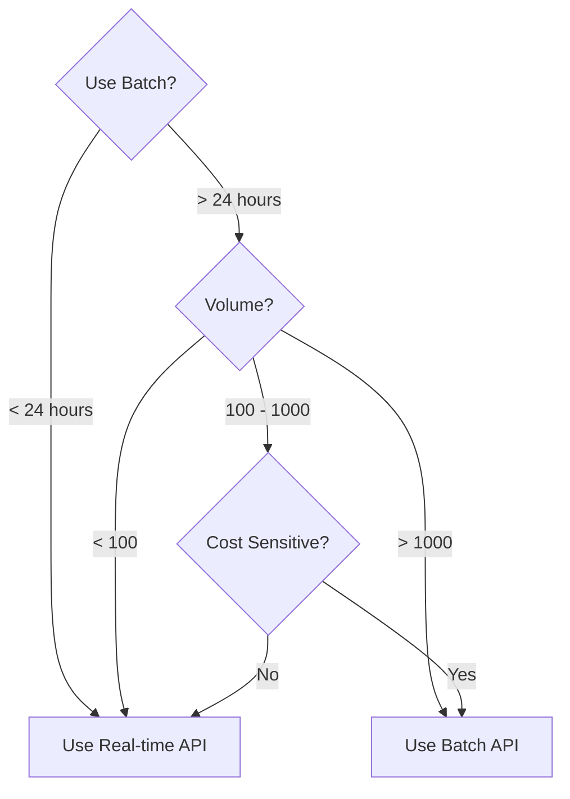

# Batch Request Patterns

## Introduction

Effective batch processing starts with proper request organization. This lesson covers when to use batching, how to optimize batch sizes, and techniques for preparing and mapping batch inputs.

### What We'll Cover

- When to use batch processing
- Batch size optimization
- Input preparation techniques
- Result mapping strategies

### Prerequisites

- Understanding of API request/response formats
- Basic Python data structures
- File handling (JSON, JSONL)

---

## When to Use Batch Processing



### Use Case Decision Matrix

| Scenario | Volume | Deadline | Recommendation |
|----------|--------|----------|----------------|
| Chatbot responses | Low | Immediate | Real-time |
| Product descriptions | High | Flexible | **Batch** |
| User notifications | Medium | Minutes | Real-time |
| Weekly reports | High | Weekly | **Batch** |
| Document classification | High | Daily | **Batch** |
| Customer support tickets | Variable | Hours | Real-time (or queue) |
| Embedding generation | Very high | Flexible | **Batch** |
| Prompt testing | High | Flexible | **Batch** |

---

## Batch Size Optimization

### Finding the Optimal Size

```python
from dataclasses import dataclass
from typing import List
import math

@dataclass
class BatchSizeConfig:
    """Configuration for batch sizing."""
    
    # Provider limits
    max_requests_per_batch: int = 50000  # OpenAI limit
    max_tokens_per_batch: int = 100000000  # 100M tokens
    max_file_size_mb: int = 100
    
    # Processing characteristics
    avg_request_tokens: int = 500
    avg_response_tokens: int = 200
    
    # Time constraints
    max_wait_hours: float = 24.0
    target_completion_hours: float = 8.0


def calculate_optimal_batch_size(
    total_requests: int,
    config: BatchSizeConfig
) -> dict:
    """Calculate optimal batch size and count."""
    
    # Constraint 1: Max requests per batch
    by_request_limit = config.max_requests_per_batch
    
    # Constraint 2: Token budget
    tokens_per_request = config.avg_request_tokens + config.avg_response_tokens
    by_token_limit = config.max_tokens_per_batch // tokens_per_request
    
    # Constraint 3: File size (rough estimate: ~500 bytes per request)
    bytes_per_request = 500
    by_file_limit = (config.max_file_size_mb * 1024 * 1024) // bytes_per_request
    
    # Take the minimum
    optimal_size = min(by_request_limit, by_token_limit, by_file_limit)
    
    # Calculate number of batches
    num_batches = math.ceil(total_requests / optimal_size)
    
    return {
        "optimal_batch_size": optimal_size,
        "num_batches": num_batches,
        "requests_per_batch": min(optimal_size, total_requests),
        "limiting_factor": {
            by_request_limit: "request_limit",
            by_token_limit: "token_limit",
            by_file_limit: "file_size_limit"
        }.get(optimal_size, "unknown")
    }


# Example
config = BatchSizeConfig(avg_request_tokens=1000, avg_response_tokens=500)
result = calculate_optimal_batch_size(75000, config)

print(f"Optimal batch size: {result['optimal_batch_size']:,}")
print(f"Number of batches: {result['num_batches']}")
print(f"Limited by: {result['limiting_factor']}")
```

### Provider-Specific Limits

| Provider | Max Requests | Max Tokens | Max File Size | Max Batches |
|----------|-------------|------------|---------------|-------------|
| OpenAI | 50,000 | 100M | 100 MB | Unlimited |
| Anthropic | 10,000 | ~1M | N/A | Configurable |
| Vertex AI | 30,000 | Varies | 1 GB | 100 |

---

## Input Preparation

### JSONL Format for OpenAI

```python
import json
from typing import List, Dict, Any
from dataclasses import dataclass, asdict
import hashlib

@dataclass
class BatchRequest:
    """A single request in a batch."""
    
    custom_id: str
    method: str
    url: str
    body: Dict[str, Any]
    
    def to_jsonl(self) -> str:
        return json.dumps(asdict(self))


class BatchInputBuilder:
    """Builder for batch input files."""
    
    def __init__(
        self,
        model: str = "gpt-4.1-mini",
        endpoint: str = "/v1/chat/completions"
    ):
        self.model = model
        self.endpoint = endpoint
        self.requests: List[BatchRequest] = []
    
    def add_request(
        self,
        messages: List[Dict[str, str]],
        custom_id: str = None,
        **kwargs
    ) -> str:
        """Add a request to the batch."""
        
        # Generate ID if not provided
        if not custom_id:
            content_hash = hashlib.md5(
                json.dumps(messages).encode()
            ).hexdigest()[:8]
            custom_id = f"req-{len(self.requests)}-{content_hash}"
        
        request = BatchRequest(
            custom_id=custom_id,
            method="POST",
            url=self.endpoint,
            body={
                "model": self.model,
                "messages": messages,
                **kwargs
            }
        )
        
        self.requests.append(request)
        return custom_id
    
    def add_bulk(
        self,
        items: List[Dict[str, Any]],
        prompt_template: str,
        system_prompt: str = None
    ) -> List[str]:
        """Add multiple requests from a template."""
        
        ids = []
        
        for i, item in enumerate(items):
            # Format prompt with item data
            user_content = prompt_template.format(**item)
            
            messages = []
            if system_prompt:
                messages.append({"role": "system", "content": system_prompt})
            messages.append({"role": "user", "content": user_content})
            
            custom_id = item.get("id", f"item-{i}")
            req_id = self.add_request(messages, custom_id=custom_id)
            ids.append(req_id)
        
        return ids
    
    def write(self, filepath: str) -> int:
        """Write batch to JSONL file."""
        
        with open(filepath, "w") as f:
            for request in self.requests:
                f.write(request.to_jsonl() + "\n")
        
        return len(self.requests)
    
    def get_stats(self) -> dict:
        """Get batch statistics."""
        
        total_chars = sum(
            len(json.dumps(req.body["messages"]))
            for req in self.requests
        )
        
        return {
            "total_requests": len(self.requests),
            "estimated_tokens": total_chars // 4,  # Rough estimate
            "file_size_bytes": sum(
                len(req.to_jsonl().encode()) + 1
                for req in self.requests
            )
        }


# Usage
builder = BatchInputBuilder(model="gpt-4.1-mini")

# Add individual requests
builder.add_request(
    messages=[{"role": "user", "content": "What is Python?"}],
    custom_id="python-question"
)

# Bulk add with template
products = [
    {"id": "prod-1", "name": "Widget", "features": "Durable, portable"},
    {"id": "prod-2", "name": "Gadget", "features": "Smart, connected"},
]

builder.add_bulk(
    items=products,
    prompt_template="Write a product description for {name}. Features: {features}",
    system_prompt="You are a copywriter. Write compelling product descriptions."
)

# Write and get stats
builder.write("batch_input.jsonl")
print(builder.get_stats())
```

### Anthropic Message Batches Format

```python
from anthropic import Anthropic
from typing import List

client = Anthropic()

def create_anthropic_batch(requests: List[dict]) -> str:
    """Create an Anthropic message batch."""
    
    # Anthropic uses a different format - direct API, no file upload
    batch_requests = []
    
    for i, req in enumerate(requests):
        batch_requests.append({
            "custom_id": req.get("id", f"request-{i}"),
            "params": {
                "model": "claude-sonnet-4-20250514",
                "max_tokens": 1024,
                "messages": req["messages"]
            }
        })
    
    # Create batch directly (no file upload needed)
    batch = client.messages.batches.create(
        requests=batch_requests
    )
    
    return batch.id


# Example
requests = [
    {
        "id": "q1",
        "messages": [{"role": "user", "content": "What is machine learning?"}]
    },
    {
        "id": "q2", 
        "messages": [{"role": "user", "content": "Explain neural networks."}]
    }
]

batch_id = create_anthropic_batch(requests)
print(f"Batch created: {batch_id}")
```

---

## Result Mapping

### Mapping Request IDs to Results

```python
from dataclasses import dataclass
from typing import Dict, Optional, Any
import json

@dataclass
class BatchResult:
    """Result from a batch request."""
    
    custom_id: str
    success: bool
    content: Optional[str]
    error: Optional[str]
    usage: Optional[Dict[str, int]]
    raw_response: Dict[str, Any]


class BatchResultMapper:
    """Map batch results back to original requests."""
    
    def __init__(self):
        self.results: Dict[str, BatchResult] = {}
        self.metadata: Dict[str, Any] = {}
    
    def register_request(self, custom_id: str, metadata: Any = None):
        """Register a request for later mapping."""
        self.metadata[custom_id] = metadata
    
    def parse_results(self, result_file: str):
        """Parse batch results from file."""
        
        with open(result_file, "r") as f:
            for line in f:
                if not line.strip():
                    continue
                
                data = json.loads(line)
                custom_id = data["custom_id"]
                
                if data.get("error"):
                    self.results[custom_id] = BatchResult(
                        custom_id=custom_id,
                        success=False,
                        content=None,
                        error=data["error"].get("message", str(data["error"])),
                        usage=None,
                        raw_response=data
                    )
                else:
                    response = data["response"]["body"]
                    choice = response["choices"][0]
                    
                    self.results[custom_id] = BatchResult(
                        custom_id=custom_id,
                        success=True,
                        content=choice["message"]["content"],
                        error=None,
                        usage=response.get("usage"),
                        raw_response=data
                    )
    
    def get_result(self, custom_id: str) -> Optional[BatchResult]:
        """Get result by custom ID."""
        return self.results.get(custom_id)
    
    def get_with_metadata(self, custom_id: str) -> tuple:
        """Get result with original metadata."""
        return (
            self.results.get(custom_id),
            self.metadata.get(custom_id)
        )
    
    def get_all_successful(self) -> Dict[str, BatchResult]:
        """Get all successful results."""
        return {
            id: result
            for id, result in self.results.items()
            if result.success
        }
    
    def get_all_failed(self) -> Dict[str, BatchResult]:
        """Get all failed results."""
        return {
            id: result
            for id, result in self.results.items()
            if not result.success
        }
    
    def get_summary(self) -> dict:
        """Get processing summary."""
        
        total = len(self.results)
        successful = len(self.get_all_successful())
        failed = len(self.get_all_failed())
        
        total_tokens = sum(
            r.usage.get("total_tokens", 0)
            for r in self.results.values()
            if r.usage
        )
        
        return {
            "total": total,
            "successful": successful,
            "failed": failed,
            "success_rate": successful / total if total > 0 else 0,
            "total_tokens": total_tokens
        }


# Usage
mapper = BatchResultMapper()

# Register requests with metadata
products = [
    {"id": "prod-1", "name": "Widget"},
    {"id": "prod-2", "name": "Gadget"}
]

for product in products:
    mapper.register_request(product["id"], metadata=product)

# After batch completes, parse results
mapper.parse_results("batch_output.jsonl")

# Get results with metadata
for product in products:
    result, meta = mapper.get_with_metadata(product["id"])
    if result and result.success:
        print(f"{meta['name']}: {result.content[:100]}...")
    else:
        print(f"{meta['name']}: Failed - {result.error if result else 'No result'}")

# Get summary
print(mapper.get_summary())
```

---

## Idempotency and Deduplication

```python
import hashlib
import json
from typing import Set

class IdempotentBatchBuilder:
    """Batch builder with deduplication support."""
    
    def __init__(self, model: str = "gpt-4.1-mini"):
        self.model = model
        self.requests = []
        self.seen_hashes: Set[str] = set()
        self.duplicates = 0
    
    def _hash_request(self, messages: list) -> str:
        """Create hash for request content."""
        content = json.dumps(messages, sort_keys=True)
        return hashlib.sha256(content.encode()).hexdigest()[:16]
    
    def add_request(
        self,
        messages: list,
        custom_id: str = None,
        allow_duplicates: bool = False
    ) -> str:
        """Add request, optionally skipping duplicates."""
        
        content_hash = self._hash_request(messages)
        
        # Check for duplicate
        if not allow_duplicates and content_hash in self.seen_hashes:
            self.duplicates += 1
            # Return existing ID for this content
            for req in self.requests:
                if self._hash_request(req["body"]["messages"]) == content_hash:
                    return req["custom_id"]
        
        self.seen_hashes.add(content_hash)
        
        request_id = custom_id or f"req-{content_hash}"
        
        self.requests.append({
            "custom_id": request_id,
            "method": "POST",
            "url": "/v1/chat/completions",
            "body": {
                "model": self.model,
                "messages": messages
            }
        })
        
        return request_id
    
    def get_stats(self) -> dict:
        return {
            "total_requests": len(self.requests),
            "duplicates_skipped": self.duplicates,
            "unique_requests": len(self.seen_hashes)
        }


# Usage
builder = IdempotentBatchBuilder()

# Add requests, duplicates are automatically skipped
builder.add_request([{"role": "user", "content": "Hello"}])
builder.add_request([{"role": "user", "content": "Hello"}])  # Duplicate
builder.add_request([{"role": "user", "content": "Hi there"}])

print(builder.get_stats())
# {'total_requests': 2, 'duplicates_skipped': 1, 'unique_requests': 2}
```

---

## Hands-on Exercise

### Your Task

Create a batch processor for document summarization.

### Requirements

1. Accept a list of documents with IDs and content
2. Generate batch input in JSONL format
3. Include progress tracking
4. Handle various document sizes

### Expected Result

```python
processor = DocumentBatchProcessor()

documents = [
    {"id": "doc-1", "title": "AI Paper", "content": "Long text..."},
    {"id": "doc-2", "title": "Research", "content": "Another long text..."}
]

batch_file = processor.prepare_batch(
    documents,
    prompt="Summarize this document in 3 bullet points"
)

print(f"Batch file: {batch_file}")
print(f"Stats: {processor.get_stats()}")
```

<details>
<summary>💡 Hints</summary>

- Truncate long documents to fit token limits
- Track character/token counts for estimation
- Use document ID as custom_id for mapping
</details>

<details>
<summary>✅ Solution</summary>

```python
import json
from dataclasses import dataclass, field
from typing import List, Dict, Any

@dataclass
class DocumentStats:
    """Statistics for batch preparation."""
    
    total_documents: int = 0
    total_characters: int = 0
    estimated_tokens: int = 0
    truncated_documents: int = 0
    file_size_bytes: int = 0


class DocumentBatchProcessor:
    """Process documents for batch summarization."""
    
    def __init__(
        self,
        model: str = "gpt-4.1-mini",
        max_doc_tokens: int = 8000,
        max_output_tokens: int = 500
    ):
        self.model = model
        self.max_doc_tokens = max_doc_tokens
        self.max_output_tokens = max_output_tokens
        self.stats = DocumentStats()
        self.requests = []
    
    def _estimate_tokens(self, text: str) -> int:
        """Rough token estimation."""
        return len(text) // 4
    
    def _truncate_to_tokens(self, text: str, max_tokens: int) -> tuple:
        """Truncate text to fit token limit."""
        
        estimated = self._estimate_tokens(text)
        
        if estimated <= max_tokens:
            return text, False
        
        # Truncate by character (4 chars ≈ 1 token)
        max_chars = max_tokens * 4
        truncated = text[:max_chars] + "... [truncated]"
        return truncated, True
    
    def prepare_batch(
        self,
        documents: List[Dict[str, Any]],
        prompt: str,
        system_prompt: str = "You are a helpful document summarizer.",
        output_file: str = "document_batch.jsonl"
    ) -> str:
        """Prepare batch file for document processing."""
        
        self.requests = []
        self.stats = DocumentStats()
        
        for doc in documents:
            doc_id = doc.get("id", f"doc-{len(self.requests)}")
            title = doc.get("title", "Untitled")
            content = doc.get("content", "")
            
            # Track stats
            self.stats.total_documents += 1
            self.stats.total_characters += len(content)
            
            # Truncate if needed
            content, was_truncated = self._truncate_to_tokens(
                content, self.max_doc_tokens
            )
            
            if was_truncated:
                self.stats.truncated_documents += 1
            
            # Build message
            user_message = f"Document: {title}\n\n{content}\n\n{prompt}"
            
            request = {
                "custom_id": doc_id,
                "method": "POST",
                "url": "/v1/chat/completions",
                "body": {
                    "model": self.model,
                    "messages": [
                        {"role": "system", "content": system_prompt},
                        {"role": "user", "content": user_message}
                    ],
                    "max_tokens": self.max_output_tokens
                }
            }
            
            self.requests.append(request)
        
        # Write to file
        with open(output_file, "w") as f:
            for req in self.requests:
                line = json.dumps(req)
                f.write(line + "\n")
                self.stats.file_size_bytes += len(line.encode()) + 1
        
        # Calculate estimated tokens
        self.stats.estimated_tokens = self.stats.total_characters // 4
        
        return output_file
    
    def get_stats(self) -> Dict[str, Any]:
        """Get preparation statistics."""
        return {
            "total_documents": self.stats.total_documents,
            "estimated_input_tokens": self.stats.estimated_tokens,
            "truncated_documents": self.stats.truncated_documents,
            "file_size_kb": self.stats.file_size_bytes / 1024,
            "average_doc_tokens": (
                self.stats.estimated_tokens // self.stats.total_documents
                if self.stats.total_documents > 0 else 0
            )
        }


# Test
processor = DocumentBatchProcessor()

documents = [
    {
        "id": "doc-1",
        "title": "Introduction to Machine Learning",
        "content": "Machine learning is a subset of artificial intelligence " * 100
    },
    {
        "id": "doc-2",
        "title": "Deep Learning Fundamentals",
        "content": "Deep learning uses neural networks with multiple layers " * 100
    },
    {
        "id": "doc-3",
        "title": "AI Ethics",
        "content": "Ethical considerations in AI development are crucial " * 50
    }
]

batch_file = processor.prepare_batch(
    documents,
    prompt="Summarize this document in 3 bullet points",
    output_file="summaries_batch.jsonl"
)

print(f"Batch file created: {batch_file}")
print(f"Stats: {json.dumps(processor.get_stats(), indent=2)}")

# Preview first request
with open(batch_file, "r") as f:
    first_req = json.loads(f.readline())
    print(f"\nFirst request ID: {first_req['custom_id']}")
```

</details>

---

## Summary

✅ Use batch processing for high-volume, non-urgent workloads  
✅ Optimize batch sizes based on provider limits  
✅ Use JSONL format with unique custom_ids for mapping  
✅ Implement deduplication to avoid redundant processing  
✅ Map results back to original requests using custom_ids

**Next:** [OpenAI Batch API](./02-openai-batch-api.md)

---

## Further Reading

- [JSONL Format](https://jsonlines.org/) — JSON Lines specification
- [OpenAI Batch Limits](https://platform.openai.com/docs/guides/batch) — Rate limits and quotas
- [Token Counting](https://github.com/openai/tiktoken) — Accurate token estimation

<!-- 
Sources Consulted:
- OpenAI Batch API: https://platform.openai.com/docs/guides/batch
- Anthropic Batches: https://docs.anthropic.com/en/api/messages-batches
-->
