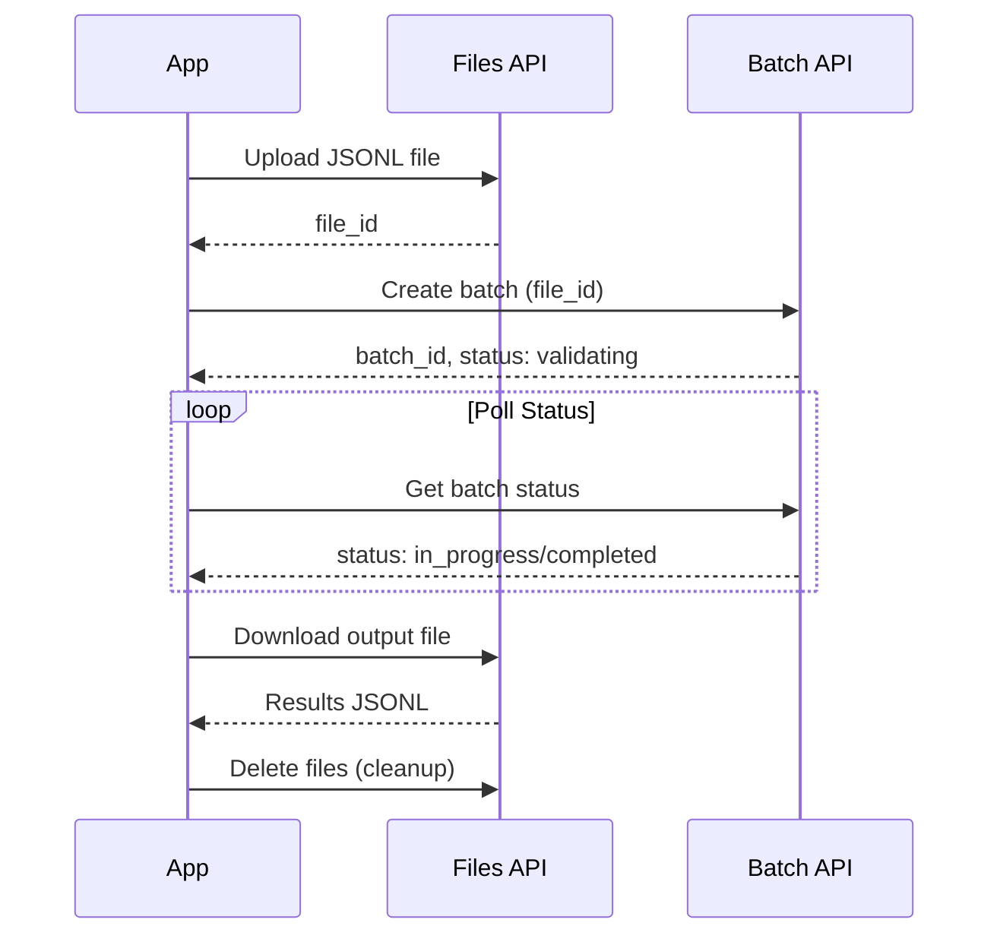
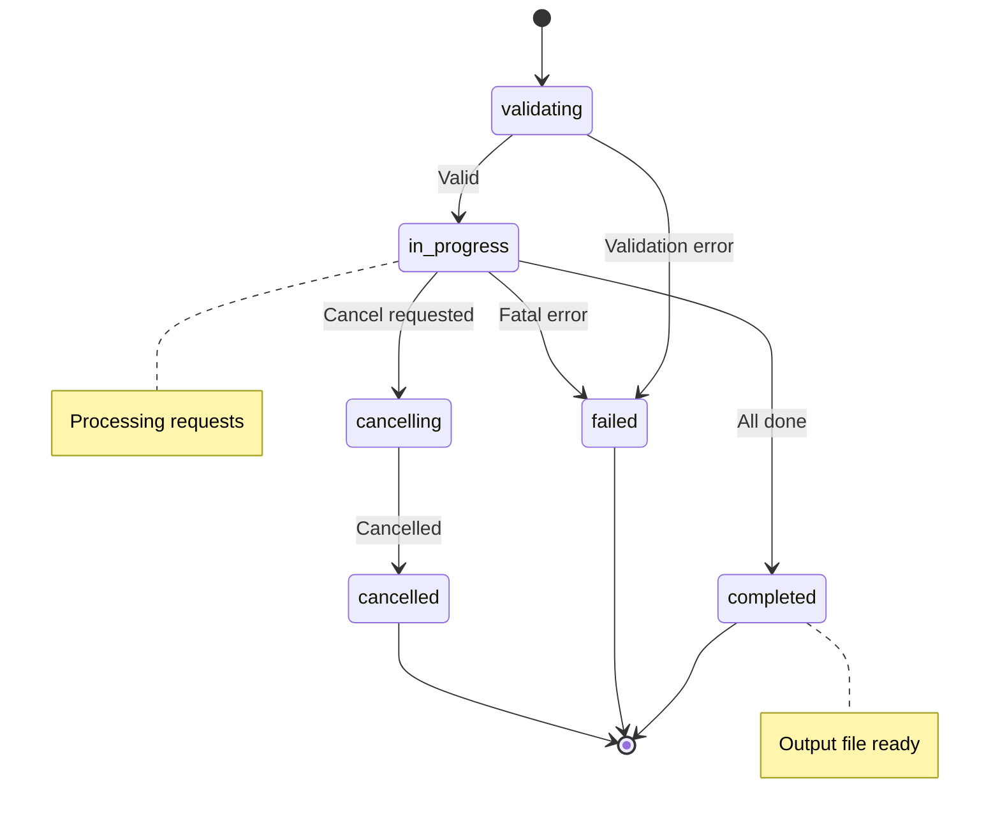

# OpenAI Batch API

## Introduction

OpenAI's Batch API enables processing thousands of requests at 50% cost savings. This lesson covers the complete workflow from file upload to result retrieval.

### What We'll Cover

- Batch API workflow
- File upload for batch input
- Job submission
- Status polling
- Result retrieval

### Prerequisites

- OpenAI API key
- Understanding of JSONL format
- Basic async/await patterns

---

## Batch API Workflow



---

## Complete Batch Workflow

```python
from openai import OpenAI
import json
import time
from pathlib import Path
from dataclasses import dataclass
from typing import Optional
from datetime import datetime

client = OpenAI()

@dataclass
class BatchJob:
    """Represents a batch job."""
    
    batch_id: str
    input_file_id: str
    status: str
    created_at: datetime
    output_file_id: Optional[str] = None
    error_file_id: Optional[str] = None
    request_counts: dict = None


class OpenAIBatchProcessor:
    """Complete OpenAI Batch API workflow."""
    
    def __init__(self, model: str = "gpt-4.1-mini"):
        self.client = OpenAI()
        self.model = model
    
    # ========== STEP 1: Prepare Input ==========
    
    def prepare_input_file(
        self,
        requests: list,
        output_path: str = "batch_input.jsonl"
    ) -> str:
        """Prepare JSONL input file."""
        
        with open(output_path, "w") as f:
            for i, req in enumerate(requests):
                batch_request = {
                    "custom_id": req.get("custom_id", f"request-{i}"),
                    "method": "POST",
                    "url": "/v1/chat/completions",
                    "body": {
                        "model": self.model,
                        "messages": req["messages"],
                        **{k: v for k, v in req.items() 
                           if k not in ["custom_id", "messages"]}
                    }
                }
                f.write(json.dumps(batch_request) + "\n")
        
        return output_path
    
    # ========== STEP 2: Upload File ==========
    
    def upload_file(self, filepath: str) -> str:
        """Upload batch input file."""
        
        with open(filepath, "rb") as f:
            file_obj = self.client.files.create(
                file=f,
                purpose="batch"
            )
        
        print(f"Uploaded file: {file_obj.id}")
        return file_obj.id
    
    # ========== STEP 3: Create Batch ==========
    
    def create_batch(
        self,
        input_file_id: str,
        description: str = None,
        completion_window: str = "24h",
        metadata: dict = None
    ) -> BatchJob:
        """Create batch job."""
        
        batch = self.client.batches.create(
            input_file_id=input_file_id,
            endpoint="/v1/chat/completions",
            completion_window=completion_window,
            metadata=metadata or {}
        )
        
        print(f"Created batch: {batch.id}")
        print(f"Status: {batch.status}")
        
        return BatchJob(
            batch_id=batch.id,
            input_file_id=input_file_id,
            status=batch.status,
            created_at=datetime.now()
        )
    
    # ========== STEP 4: Poll Status ==========
    
    def get_status(self, batch_id: str) -> dict:
        """Get batch status."""
        
        batch = self.client.batches.retrieve(batch_id)
        
        return {
            "id": batch.id,
            "status": batch.status,
            "request_counts": {
                "total": batch.request_counts.total,
                "completed": batch.request_counts.completed,
                "failed": batch.request_counts.failed
            },
            "output_file_id": batch.output_file_id,
            "error_file_id": batch.error_file_id,
            "created_at": batch.created_at,
            "completed_at": batch.completed_at
        }
    
    def wait_for_completion(
        self,
        batch_id: str,
        poll_interval: float = 30.0,
        timeout_hours: float = 24.0,
        progress_callback: callable = None
    ) -> dict:
        """Wait for batch to complete."""
        
        start_time = time.time()
        timeout_seconds = timeout_hours * 3600
        
        while True:
            status = self.get_status(batch_id)
            
            if progress_callback:
                progress_callback(status)
            else:
                counts = status["request_counts"]
                print(
                    f"Status: {status['status']} | "
                    f"Progress: {counts['completed']}/{counts['total']} | "
                    f"Failed: {counts['failed']}"
                )
            
            # Check terminal states
            if status["status"] == "completed":
                return status
            
            if status["status"] in ["failed", "expired", "cancelled"]:
                raise Exception(f"Batch failed with status: {status['status']}")
            
            # Check timeout
            elapsed = time.time() - start_time
            if elapsed > timeout_seconds:
                raise TimeoutError(
                    f"Batch did not complete within {timeout_hours} hours"
                )
            
            time.sleep(poll_interval)
    
    # ========== STEP 5: Download Results ==========
    
    def download_results(
        self,
        output_file_id: str,
        output_path: str = "batch_output.jsonl"
    ) -> str:
        """Download batch output file."""
        
        content = self.client.files.content(output_file_id)
        
        with open(output_path, "wb") as f:
            f.write(content.read())
        
        print(f"Downloaded results to: {output_path}")
        return output_path
    
    def parse_results(self, output_path: str) -> list:
        """Parse batch output file."""
        
        results = []
        
        with open(output_path, "r") as f:
            for line in f:
                if line.strip():
                    data = json.loads(line)
                    
                    custom_id = data["custom_id"]
                    
                    if data.get("error"):
                        results.append({
                            "custom_id": custom_id,
                            "success": False,
                            "error": data["error"]
                        })
                    else:
                        response = data["response"]["body"]
                        content = response["choices"][0]["message"]["content"]
                        
                        results.append({
                            "custom_id": custom_id,
                            "success": True,
                            "content": content,
                            "usage": response.get("usage")
                        })
        
        return results
    
    # ========== STEP 6: Cleanup ==========
    
    def cleanup(
        self,
        input_file_id: str = None,
        output_file_id: str = None,
        error_file_id: str = None
    ):
        """Delete uploaded and result files."""
        
        for file_id in [input_file_id, output_file_id, error_file_id]:
            if file_id:
                try:
                    self.client.files.delete(file_id)
                    print(f"Deleted file: {file_id}")
                except Exception as e:
                    print(f"Failed to delete {file_id}: {e}")
    
    # ========== Full Workflow ==========
    
    def process_batch(
        self,
        requests: list,
        poll_interval: float = 30.0,
        cleanup_files: bool = True
    ) -> list:
        """Complete batch processing workflow."""
        
        # Step 1: Prepare
        input_path = self.prepare_input_file(requests)
        
        # Step 2: Upload
        input_file_id = self.upload_file(input_path)
        
        # Step 3: Create batch
        job = self.create_batch(input_file_id)
        
        # Step 4: Wait
        status = self.wait_for_completion(job.batch_id, poll_interval)
        
        # Step 5: Download and parse
        output_path = self.download_results(status["output_file_id"])
        results = self.parse_results(output_path)
        
        # Step 6: Cleanup
        if cleanup_files:
            self.cleanup(
                input_file_id=input_file_id,
                output_file_id=status["output_file_id"],
                error_file_id=status.get("error_file_id")
            )
            Path(input_path).unlink(missing_ok=True)
            Path(output_path).unlink(missing_ok=True)
        
        return results


# Usage
processor = OpenAIBatchProcessor(model="gpt-4.1-mini")

requests = [
    {
        "custom_id": "summary-1",
        "messages": [
            {"role": "system", "content": "You are a helpful assistant."},
            {"role": "user", "content": "Summarize machine learning in one sentence."}
        ]
    },
    {
        "custom_id": "summary-2",
        "messages": [
            {"role": "user", "content": "Summarize deep learning in one sentence."}
        ]
    }
]

results = processor.process_batch(requests)

for result in results:
    print(f"{result['custom_id']}: {result.get('content', result.get('error'))}")
```

---

## File Format Details

### Input JSONL Format

```json
{"custom_id": "request-1", "method": "POST", "url": "/v1/chat/completions", "body": {"model": "gpt-4.1-mini", "messages": [{"role": "user", "content": "Hello"}]}}
{"custom_id": "request-2", "method": "POST", "url": "/v1/chat/completions", "body": {"model": "gpt-4.1-mini", "messages": [{"role": "user", "content": "World"}]}}
```

### Output JSONL Format

```json
{"id": "batch_req_abc", "custom_id": "request-1", "response": {"status_code": 200, "body": {"id": "chatcmpl-xyz", "choices": [{"message": {"content": "Hello there!"}}], "usage": {"prompt_tokens": 10, "completion_tokens": 5}}}}
{"id": "batch_req_def", "custom_id": "request-2", "response": {"status_code": 200, "body": {"id": "chatcmpl-uvw", "choices": [{"message": {"content": "World to you!"}}], "usage": {"prompt_tokens": 10, "completion_tokens": 6}}}}
```

### Error Format

```json
{"custom_id": "request-3", "error": {"code": "invalid_request", "message": "Model not found"}}
```

---

## Batch Status States



| Status | Description | Action |
|--------|-------------|--------|
| `validating` | Checking input file format | Wait |
| `in_progress` | Processing requests | Poll for updates |
| `completed` | All requests processed | Download results |
| `failed` | Critical error | Check error file |
| `cancelling` | Cancel in progress | Wait for cancelled |
| `cancelled` | Job cancelled | Results may be partial |
| `expired` | Exceeded 24h window | Retry with new batch |

---

## Error Handling

```python
from openai import OpenAI
from typing import List, Dict

class BatchErrorHandler:
    """Handle batch processing errors."""
    
    def __init__(self):
        self.client = OpenAI()
    
    def download_error_file(
        self,
        error_file_id: str,
        output_path: str = "batch_errors.jsonl"
    ) -> str:
        """Download error file if exists."""
        
        if not error_file_id:
            return None
        
        content = self.client.files.content(error_file_id)
        
        with open(output_path, "wb") as f:
            f.write(content.read())
        
        return output_path
    
    def analyze_errors(self, error_path: str) -> Dict[str, List[dict]]:
        """Categorize errors from error file."""
        
        errors_by_type = {}
        
        with open(error_path, "r") as f:
            for line in f:
                if line.strip():
                    data = json.loads(line)
                    error = data.get("error", {})
                    error_code = error.get("code", "unknown")
                    
                    if error_code not in errors_by_type:
                        errors_by_type[error_code] = []
                    
                    errors_by_type[error_code].append({
                        "custom_id": data["custom_id"],
                        "message": error.get("message"),
                        "data": data
                    })
        
        return errors_by_type
    
    def get_retryable_requests(
        self,
        original_requests: List[dict],
        failed_ids: List[str]
    ) -> List[dict]:
        """Extract requests that need retry."""
        
        failed_set = set(failed_ids)
        
        return [
            req for req in original_requests
            if req.get("custom_id") in failed_set
        ]
    
    def create_retry_batch(
        self,
        original_file: str,
        failed_ids: List[str],
        output_file: str = "retry_batch.jsonl"
    ) -> str:
        """Create new batch file with only failed requests."""
        
        failed_set = set(failed_ids)
        
        with open(original_file, "r") as f_in, open(output_file, "w") as f_out:
            for line in f_in:
                if line.strip():
                    data = json.loads(line)
                    if data["custom_id"] in failed_set:
                        f_out.write(line)
        
        return output_file


# Usage
handler = BatchErrorHandler()

# Get batch status
batch = client.batches.retrieve("batch_abc123")

if batch.error_file_id:
    error_path = handler.download_error_file(batch.error_file_id)
    errors = handler.analyze_errors(error_path)
    
    print("Errors by type:")
    for error_type, items in errors.items():
        print(f"  {error_type}: {len(items)} errors")
        for item in items[:3]:  # Show first 3
            print(f"    - {item['custom_id']}: {item['message']}")
    
    # Create retry batch for rate limit errors
    if "rate_limit_exceeded" in errors:
        retry_ids = [e["custom_id"] for e in errors["rate_limit_exceeded"]]
        retry_file = handler.create_retry_batch(
            "batch_input.jsonl",
            retry_ids
        )
        print(f"Retry batch created: {retry_file}")
```

---

## Cancellation

```python
def cancel_batch(batch_id: str) -> dict:
    """Cancel a running batch."""
    
    batch = client.batches.cancel(batch_id)
    
    return {
        "id": batch.id,
        "status": batch.status,
        "request_counts": {
            "total": batch.request_counts.total,
            "completed": batch.request_counts.completed,
            "failed": batch.request_counts.failed
        }
    }


def cancel_with_partial_results(batch_id: str) -> list:
    """Cancel batch and retrieve partial results."""
    
    # Cancel
    result = cancel_batch(batch_id)
    print(f"Cancelled. Completed: {result['request_counts']['completed']}")
    
    # Wait for cancellation to complete
    while True:
        batch = client.batches.retrieve(batch_id)
        if batch.status == "cancelled":
            break
        time.sleep(5)
    
    # Get partial results if available
    if batch.output_file_id:
        content = client.files.content(batch.output_file_id)
        results = []
        
        for line in content.text.strip().split("\n"):
            if line:
                results.append(json.loads(line))
        
        return results
    
    return []
```

---

## Hands-on Exercise

### Your Task

Build a batch processing system with automatic retry.

### Requirements

1. Submit a batch and track progress
2. On completion, identify failed requests
3. Automatically retry failed requests
4. Merge results from all attempts

### Expected Result

```python
processor = RetryableBatchProcessor()

results = processor.process_with_retry(
    requests=my_requests,
    max_retries=3
)

print(f"Total: {len(results)}")
print(f"Successful: {len([r for r in results if r['success']])}")
print(f"Retry attempts: {processor.retry_count}")
```

<details>
<summary>💡 Hints</summary>

- Track custom_ids that succeed vs fail
- Create new batch with only failed requests
- Merge results after each attempt
</details>

<details>
<summary>✅ Solution</summary>

```python
from openai import OpenAI
import json
import time
from typing import List, Dict

class RetryableBatchProcessor:
    """Batch processor with automatic retry."""
    
    def __init__(self, model: str = "gpt-4.1-mini"):
        self.client = OpenAI()
        self.model = model
        self.retry_count = 0
    
    def _prepare_and_upload(self, requests: List[dict]) -> str:
        """Prepare and upload batch file."""
        
        filepath = f"batch_attempt_{self.retry_count}.jsonl"
        
        with open(filepath, "w") as f:
            for req in requests:
                batch_req = {
                    "custom_id": req["custom_id"],
                    "method": "POST",
                    "url": "/v1/chat/completions",
                    "body": {
                        "model": self.model,
                        "messages": req["messages"]
                    }
                }
                f.write(json.dumps(batch_req) + "\n")
        
        with open(filepath, "rb") as f:
            file_obj = self.client.files.create(file=f, purpose="batch")
        
        return file_obj.id
    
    def _run_batch(self, input_file_id: str) -> dict:
        """Run batch and wait for completion."""
        
        batch = self.client.batches.create(
            input_file_id=input_file_id,
            endpoint="/v1/chat/completions",
            completion_window="24h"
        )
        
        # Poll for completion
        while True:
            batch = self.client.batches.retrieve(batch.id)
            
            print(
                f"  Status: {batch.status} | "
                f"Completed: {batch.request_counts.completed}/"
                f"{batch.request_counts.total}"
            )
            
            if batch.status in ["completed", "failed", "expired", "cancelled"]:
                break
            
            time.sleep(10)
        
        return {
            "output_file_id": batch.output_file_id,
            "error_file_id": batch.error_file_id,
            "status": batch.status,
            "completed": batch.request_counts.completed,
            "failed": batch.request_counts.failed
        }
    
    def _parse_results(self, output_file_id: str) -> tuple:
        """Parse results into successful and failed."""
        
        content = self.client.files.content(output_file_id)
        
        successful = []
        failed = []
        
        for line in content.text.strip().split("\n"):
            if not line:
                continue
            
            data = json.loads(line)
            custom_id = data["custom_id"]
            
            if data.get("error"):
                failed.append({
                    "custom_id": custom_id,
                    "success": False,
                    "error": data["error"]
                })
            else:
                response = data["response"]["body"]
                successful.append({
                    "custom_id": custom_id,
                    "success": True,
                    "content": response["choices"][0]["message"]["content"],
                    "usage": response.get("usage")
                })
        
        return successful, failed
    
    def process_with_retry(
        self,
        requests: List[dict],
        max_retries: int = 3
    ) -> List[dict]:
        """Process batch with automatic retry for failures."""
        
        self.retry_count = 0
        all_results = []
        pending_requests = requests.copy()
        
        # Build lookup for retries
        requests_by_id = {r["custom_id"]: r for r in requests}
        
        while pending_requests and self.retry_count <= max_retries:
            print(f"\nAttempt {self.retry_count + 1}: {len(pending_requests)} requests")
            
            # Upload and run
            input_file_id = self._prepare_and_upload(pending_requests)
            batch_result = self._run_batch(input_file_id)
            
            if batch_result["output_file_id"]:
                successful, failed = self._parse_results(
                    batch_result["output_file_id"]
                )
                
                print(f"  Successful: {len(successful)}, Failed: {len(failed)}")
                
                # Collect successful results
                all_results.extend(successful)
                
                # Prepare retry for failed
                failed_ids = [f["custom_id"] for f in failed]
                pending_requests = [
                    requests_by_id[id] for id in failed_ids
                    if id in requests_by_id
                ]
                
                # Also add failed results if no more retries
                if self.retry_count >= max_retries:
                    all_results.extend(failed)
            else:
                print(f"  Batch failed: {batch_result['status']}")
                # Add all pending as failed
                for req in pending_requests:
                    all_results.append({
                        "custom_id": req["custom_id"],
                        "success": False,
                        "error": {"code": "batch_failed", "message": batch_result["status"]}
                    })
                break
            
            self.retry_count += 1
        
        # Add any remaining as failed
        for req in pending_requests:
            all_results.append({
                "custom_id": req["custom_id"],
                "success": False,
                "error": {"code": "max_retries", "message": "Max retries exceeded"}
            })
        
        return all_results


# Test
processor = RetryableBatchProcessor()

requests = [
    {"custom_id": f"req-{i}", "messages": [{"role": "user", "content": f"Say {i}"}]}
    for i in range(10)
]

results = processor.process_with_retry(requests, max_retries=2)

successful = [r for r in results if r["success"]]
failed = [r for r in results if not r["success"]]

print(f"\nFinal Results:")
print(f"  Total: {len(results)}")
print(f"  Successful: {len(successful)}")
print(f"  Failed: {len(failed)}")
print(f"  Retry attempts: {processor.retry_count}")
```

</details>

---

## Summary

✅ OpenAI Batch API offers 50% cost savings  
✅ Workflow: Upload → Create → Poll → Download → Parse  
✅ Use JSONL format with unique custom_ids  
✅ Handle partial failures with retry logic  
✅ Clean up files after processing

**Next:** [Job Management](./03-job-management.md)

---

## Further Reading

- [OpenAI Batch API](https://platform.openai.com/docs/guides/batch) — Official guide
- [Files API](https://platform.openai.com/docs/api-reference/files) — File management
- [Rate Limits](https://platform.openai.com/docs/guides/rate-limits) — Batch limits

<!-- 
Sources Consulted:
- OpenAI Batch API: https://platform.openai.com/docs/guides/batch
- OpenAI API Reference: https://platform.openai.com/docs/api-reference/batch
-->
