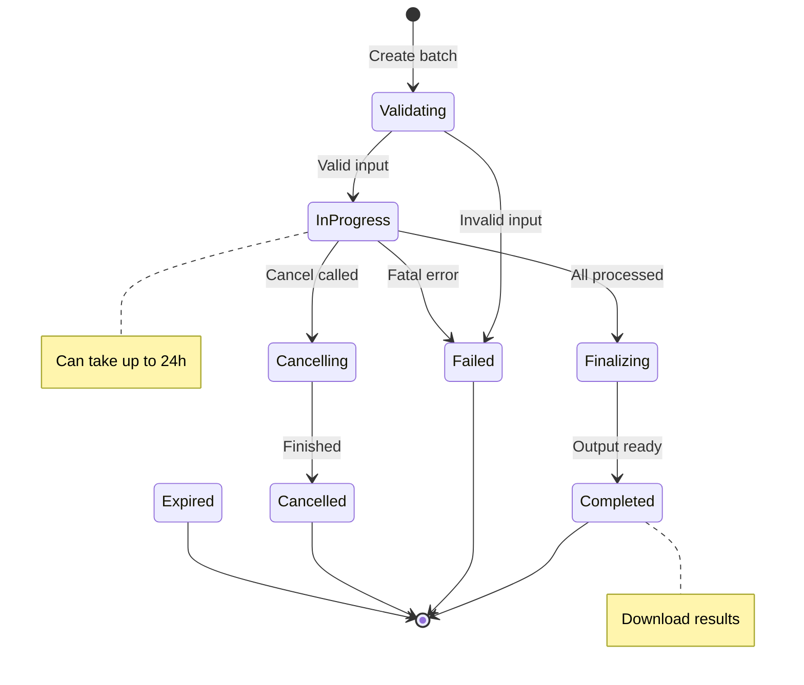

# Job Submission and Polling

## Introduction

Managing batch jobs requires robust submission, polling, and timeout handling. This lesson covers best practices for job lifecycle management including status polling, webhook notifications, and handling edge cases.

### What We'll Cover

- Creating batch jobs
- Job status states
- Polling intervals
- Timeout handling
- Webhook notifications

### Prerequisites

- Understanding of OpenAI Batch API basics
- Async programming concepts
- Background task management

---

## Job Status Lifecycle



---

## Job Submission

```python
from openai import OpenAI
from dataclasses import dataclass, field
from typing import Optional, Dict, Any
from datetime import datetime
import json

client = OpenAI()

@dataclass
class BatchJobConfig:
    """Configuration for batch job submission."""
    
    input_file_id: str
    endpoint: str = "/v1/chat/completions"
    completion_window: str = "24h"
    metadata: Dict[str, str] = field(default_factory=dict)


@dataclass
class BatchJob:
    """Represents a submitted batch job."""
    
    id: str
    status: str
    input_file_id: str
    output_file_id: Optional[str]
    error_file_id: Optional[str]
    request_counts: Dict[str, int]
    created_at: int
    completed_at: Optional[int]
    metadata: Dict[str, str]
    
    @classmethod
    def from_api(cls, batch) -> 'BatchJob':
        """Create from API response."""
        return cls(
            id=batch.id,
            status=batch.status,
            input_file_id=batch.input_file_id,
            output_file_id=batch.output_file_id,
            error_file_id=batch.error_file_id,
            request_counts={
                "total": batch.request_counts.total,
                "completed": batch.request_counts.completed,
                "failed": batch.request_counts.failed
            },
            created_at=batch.created_at,
            completed_at=batch.completed_at,
            metadata=batch.metadata or {}
        )
    
    @property
    def progress(self) -> float:
        """Calculate completion progress."""
        total = self.request_counts.get("total", 0)
        if total == 0:
            return 0.0
        completed = self.request_counts.get("completed", 0)
        return completed / total
    
    @property
    def is_terminal(self) -> bool:
        """Check if job is in terminal state."""
        return self.status in ["completed", "failed", "cancelled", "expired"]
    
    @property
    def is_successful(self) -> bool:
        """Check if job completed successfully."""
        return self.status == "completed"


class BatchJobManager:
    """Manage batch job lifecycle."""
    
    def __init__(self):
        self.client = OpenAI()
        self.jobs: Dict[str, BatchJob] = {}
    
    def submit(self, config: BatchJobConfig) -> BatchJob:
        """Submit a new batch job."""
        
        batch = self.client.batches.create(
            input_file_id=config.input_file_id,
            endpoint=config.endpoint,
            completion_window=config.completion_window,
            metadata=config.metadata
        )
        
        job = BatchJob.from_api(batch)
        self.jobs[job.id] = job
        
        print(f"Submitted job: {job.id}")
        print(f"Status: {job.status}")
        print(f"Total requests: {job.request_counts['total']}")
        
        return job
    
    def get_status(self, job_id: str) -> BatchJob:
        """Get current job status."""
        
        batch = self.client.batches.retrieve(job_id)
        job = BatchJob.from_api(batch)
        self.jobs[job_id] = job
        
        return job
    
    def list_jobs(
        self,
        limit: int = 20,
        status: str = None
    ) -> list:
        """List batch jobs."""
        
        batches = self.client.batches.list(limit=limit)
        
        jobs = [BatchJob.from_api(b) for b in batches.data]
        
        if status:
            jobs = [j for j in jobs if j.status == status]
        
        return jobs
    
    def cancel(self, job_id: str) -> BatchJob:
        """Cancel a running job."""
        
        batch = self.client.batches.cancel(job_id)
        job = BatchJob.from_api(batch)
        self.jobs[job_id] = job
        
        print(f"Cancelled job: {job_id}")
        print(f"Status: {job.status}")
        
        return job


# Usage
manager = BatchJobManager()

# Submit job
config = BatchJobConfig(
    input_file_id="file-abc123",
    metadata={"project": "summarization", "version": "1.0"}
)

job = manager.submit(config)

# Check status
job = manager.get_status(job.id)
print(f"Progress: {job.progress:.1%}")

# List all running jobs
running = manager.list_jobs(status="in_progress")
print(f"Running jobs: {len(running)}")
```

---

## Polling Strategies

### Basic Polling

```python
import time
from typing import Callable, Optional

def poll_batch_simple(
    job_id: str,
    interval: float = 30.0,
    timeout: float = 86400.0  # 24 hours
) -> BatchJob:
    """Simple polling with fixed interval."""
    
    start_time = time.time()
    
    while True:
        job = manager.get_status(job_id)
        
        elapsed = time.time() - start_time
        print(
            f"[{elapsed/60:.1f}m] {job.status} - "
            f"{job.progress:.1%} complete"
        )
        
        if job.is_terminal:
            return job
        
        if elapsed > timeout:
            raise TimeoutError(f"Job {job_id} timed out after {timeout}s")
        
        time.sleep(interval)
```

### Adaptive Polling

```python
class AdaptivePoller:
    """Poll with adaptive intervals based on progress."""
    
    def __init__(
        self,
        min_interval: float = 10.0,
        max_interval: float = 300.0,
        timeout: float = 86400.0
    ):
        self.min_interval = min_interval
        self.max_interval = max_interval
        self.timeout = timeout
    
    def _calculate_interval(
        self,
        progress: float,
        elapsed: float,
        last_progress: float
    ) -> float:
        """Calculate next poll interval."""
        
        # If making progress, poll more frequently
        progress_rate = progress - last_progress
        
        if progress_rate > 0.01:  # >1% progress since last check
            return self.min_interval
        
        if progress < 0.1:
            # Early stage - poll every 30s
            return 30.0
        elif progress < 0.5:
            # Middle stage - poll every minute
            return 60.0
        elif progress < 0.9:
            # Late stage - poll every 2 minutes
            return 120.0
        else:
            # Almost done - poll frequently
            return self.min_interval
    
    def poll(
        self,
        job_id: str,
        progress_callback: Callable[[BatchJob], None] = None
    ) -> BatchJob:
        """Poll with adaptive intervals."""
        
        start_time = time.time()
        last_progress = 0.0
        
        while True:
            job = manager.get_status(job_id)
            elapsed = time.time() - start_time
            
            if progress_callback:
                progress_callback(job)
            else:
                print(
                    f"[{elapsed/60:.1f}m] {job.status} - "
                    f"{job.progress:.1%} ({job.request_counts['completed']}/{job.request_counts['total']})"
                )
            
            if job.is_terminal:
                return job
            
            if elapsed > self.timeout:
                raise TimeoutError(f"Job {job_id} timed out")
            
            # Calculate next interval
            interval = self._calculate_interval(
                job.progress, elapsed, last_progress
            )
            last_progress = job.progress
            
            time.sleep(interval)


# Usage
poller = AdaptivePoller(
    min_interval=10.0,
    max_interval=300.0,
    timeout=7200.0  # 2 hour timeout
)

job = poller.poll("batch_abc123")
```

### Exponential Backoff Polling

```python
class ExponentialBackoffPoller:
    """Poll with exponential backoff."""
    
    def __init__(
        self,
        initial_interval: float = 10.0,
        max_interval: float = 300.0,
        multiplier: float = 1.5,
        timeout: float = 86400.0
    ):
        self.initial_interval = initial_interval
        self.max_interval = max_interval
        self.multiplier = multiplier
        self.timeout = timeout
    
    def poll(self, job_id: str) -> BatchJob:
        """Poll with exponential backoff."""
        
        start_time = time.time()
        interval = self.initial_interval
        
        while True:
            job = manager.get_status(job_id)
            elapsed = time.time() - start_time
            
            print(
                f"[{elapsed/60:.1f}m] {job.status} - "
                f"Next poll in {interval:.0f}s"
            )
            
            if job.is_terminal:
                return job
            
            if elapsed > self.timeout:
                raise TimeoutError(f"Job {job_id} timed out")
            
            time.sleep(interval)
            
            # Increase interval, respecting maximum
            interval = min(interval * self.multiplier, self.max_interval)
```

---

## Async Polling

```python
import asyncio
from typing import List

class AsyncBatchPoller:
    """Asynchronously poll multiple batch jobs."""
    
    def __init__(self):
        self.client = OpenAI()
    
    async def _poll_single(
        self,
        job_id: str,
        interval: float = 30.0,
        timeout: float = 86400.0
    ) -> BatchJob:
        """Poll a single job asynchronously."""
        
        start_time = time.time()
        
        while True:
            # Use sync client in async context (or use async client)
            batch = self.client.batches.retrieve(job_id)
            job = BatchJob.from_api(batch)
            
            if job.is_terminal:
                return job
            
            elapsed = time.time() - start_time
            if elapsed > timeout:
                raise TimeoutError(f"Job {job_id} timed out")
            
            await asyncio.sleep(interval)
    
    async def poll_multiple(
        self,
        job_ids: List[str],
        interval: float = 30.0
    ) -> Dict[str, BatchJob]:
        """Poll multiple jobs concurrently."""
        
        tasks = [
            self._poll_single(job_id, interval)
            for job_id in job_ids
        ]
        
        results = await asyncio.gather(*tasks, return_exceptions=True)
        
        return {
            job_id: result
            for job_id, result in zip(job_ids, results)
            if not isinstance(result, Exception)
        }


# Usage
async def main():
    poller = AsyncBatchPoller()
    
    # Submit multiple batches
    job_ids = ["batch_1", "batch_2", "batch_3"]
    
    # Poll all concurrently
    results = await poller.poll_multiple(job_ids)
    
    for job_id, job in results.items():
        print(f"{job_id}: {job.status} - {job.request_counts['completed']} completed")


# Run
asyncio.run(main())
```

---

## Webhook Notifications

```python
from flask import Flask, request, jsonify
import hmac
import hashlib

app = Flask(__name__)

# Store your webhook secret
WEBHOOK_SECRET = "your-webhook-secret"

def verify_webhook_signature(payload: bytes, signature: str) -> bool:
    """Verify OpenAI webhook signature."""
    
    expected = hmac.new(
        WEBHOOK_SECRET.encode(),
        payload,
        hashlib.sha256
    ).hexdigest()
    
    return hmac.compare_digest(f"sha256={expected}", signature)


@app.route("/webhook/batch", methods=["POST"])
def handle_batch_webhook():
    """Handle batch completion webhook."""
    
    # Verify signature
    signature = request.headers.get("X-OpenAI-Signature")
    if not verify_webhook_signature(request.data, signature):
        return jsonify({"error": "Invalid signature"}), 401
    
    event = request.json
    
    # Handle different event types
    event_type = event.get("type")
    batch_data = event.get("data", {})
    
    if event_type == "batch.completed":
        handle_completed(batch_data)
    elif event_type == "batch.failed":
        handle_failed(batch_data)
    elif event_type == "batch.cancelled":
        handle_cancelled(batch_data)
    elif event_type == "batch.expired":
        handle_expired(batch_data)
    
    return jsonify({"status": "ok"})


def handle_completed(data: dict):
    """Handle successful batch completion."""
    
    batch_id = data["id"]
    output_file_id = data["output_file_id"]
    
    print(f"Batch {batch_id} completed!")
    print(f"Output file: {output_file_id}")
    
    # Queue result processing
    # download_and_process_results.delay(batch_id, output_file_id)


def handle_failed(data: dict):
    """Handle batch failure."""
    
    batch_id = data["id"]
    error_file_id = data.get("error_file_id")
    
    print(f"Batch {batch_id} failed!")
    
    # Alert and analyze
    # send_alert(f"Batch {batch_id} failed")
    # if error_file_id:
    #     analyze_errors.delay(batch_id, error_file_id)


def handle_cancelled(data: dict):
    """Handle batch cancellation."""
    
    batch_id = data["id"]
    completed = data.get("request_counts", {}).get("completed", 0)
    
    print(f"Batch {batch_id} cancelled. Completed: {completed}")
    
    # Process partial results if available
    # if data.get("output_file_id"):
    #     process_partial_results.delay(batch_id)


def handle_expired(data: dict):
    """Handle batch expiration."""
    
    batch_id = data["id"]
    metadata = data.get("metadata", {})
    
    print(f"Batch {batch_id} expired!")
    
    # Resubmit with higher priority
    # resubmit_batch.delay(batch_id, metadata)
```

---

## Timeout Handling

```python
from dataclasses import dataclass
from enum import Enum
from typing import Optional
import time

class TimeoutAction(Enum):
    """Actions to take on timeout."""
    
    CANCEL = "cancel"
    EXTEND = "extend"
    ALERT = "alert"
    RETRY = "retry"


@dataclass
class TimeoutConfig:
    """Configuration for timeout handling."""
    
    soft_timeout_hours: float = 12.0  # Warning threshold
    hard_timeout_hours: float = 23.0  # Cancel threshold
    action: TimeoutAction = TimeoutAction.ALERT


class TimeoutManager:
    """Manage batch job timeouts."""
    
    def __init__(self, config: TimeoutConfig = None):
        self.config = config or TimeoutConfig()
        self.client = OpenAI()
    
    def check_timeouts(self, job: BatchJob) -> Optional[str]:
        """Check if job is approaching or exceeded timeout."""
        
        if job.is_terminal:
            return None
        
        # Calculate elapsed time
        elapsed_seconds = time.time() - job.created_at
        elapsed_hours = elapsed_seconds / 3600
        
        # Check hard timeout
        if elapsed_hours >= self.config.hard_timeout_hours:
            return self._handle_hard_timeout(job)
        
        # Check soft timeout
        if elapsed_hours >= self.config.soft_timeout_hours:
            return self._handle_soft_timeout(job, elapsed_hours)
        
        return None
    
    def _handle_soft_timeout(
        self,
        job: BatchJob,
        elapsed_hours: float
    ) -> str:
        """Handle soft timeout - warning."""
        
        remaining = self.config.hard_timeout_hours - elapsed_hours
        
        message = (
            f"⚠️ Job {job.id} approaching timeout. "
            f"Elapsed: {elapsed_hours:.1f}h, Remaining: {remaining:.1f}h, "
            f"Progress: {job.progress:.1%}"
        )
        
        print(message)
        
        # Could send alert here
        # send_alert(message)
        
        return message
    
    def _handle_hard_timeout(self, job: BatchJob) -> str:
        """Handle hard timeout based on configured action."""
        
        action = self.config.action
        
        if action == TimeoutAction.CANCEL:
            self.client.batches.cancel(job.id)
            message = f"❌ Cancelled job {job.id} due to timeout"
        
        elif action == TimeoutAction.RETRY:
            # Cancel and prepare for retry
            self.client.batches.cancel(job.id)
            message = f"🔄 Retry scheduled for job {job.id}"
            # Would queue retry here
        
        elif action == TimeoutAction.ALERT:
            message = f"🚨 Job {job.id} exceeded timeout - manual intervention needed"
        
        else:
            message = f"Job {job.id} timed out"
        
        print(message)
        return message


# Usage
config = TimeoutConfig(
    soft_timeout_hours=12.0,
    hard_timeout_hours=23.0,
    action=TimeoutAction.CANCEL
)

timeout_mgr = TimeoutManager(config)

# Check timeouts during polling
def poll_with_timeout(job_id: str):
    while True:
        job = manager.get_status(job_id)
        
        # Check timeout
        timeout_result = timeout_mgr.check_timeouts(job)
        if timeout_result:
            print(timeout_result)
        
        if job.is_terminal:
            return job
        
        time.sleep(60)
```

---

## Job Queue Management

```python
from collections import deque
from threading import Lock
from typing import List, Callable

class BatchJobQueue:
    """Queue for managing batch job submissions."""
    
    # OpenAI allows up to ~100 concurrent batches
    MAX_CONCURRENT = 50
    
    def __init__(
        self,
        max_concurrent: int = None,
        on_complete: Callable[[BatchJob], None] = None
    ):
        self.max_concurrent = max_concurrent or self.MAX_CONCURRENT
        self.pending: deque = deque()
        self.running: Dict[str, BatchJob] = {}
        self.completed: List[BatchJob] = []
        self.on_complete = on_complete
        self._lock = Lock()
    
    def enqueue(self, config: BatchJobConfig) -> str:
        """Add job to queue."""
        
        with self._lock:
            queue_id = f"queue-{len(self.pending)}"
            self.pending.append((queue_id, config))
            
            print(f"Enqueued: {queue_id}")
            self._maybe_start_next()
            
            return queue_id
    
    def _maybe_start_next(self):
        """Start next job if capacity available."""
        
        while len(self.running) < self.max_concurrent and self.pending:
            queue_id, config = self.pending.popleft()
            
            # Submit job
            job = manager.submit(config)
            self.running[job.id] = job
            
            print(f"Started: {job.id} (queue: {queue_id})")
    
    def update_status(self):
        """Update status of all running jobs."""
        
        completed_ids = []
        
        with self._lock:
            for job_id in list(self.running.keys()):
                job = manager.get_status(job_id)
                self.running[job_id] = job
                
                if job.is_terminal:
                    completed_ids.append(job_id)
            
            # Move completed to completed list
            for job_id in completed_ids:
                job = self.running.pop(job_id)
                self.completed.append(job)
                
                if self.on_complete:
                    self.on_complete(job)
            
            # Start more if capacity available
            self._maybe_start_next()
        
        return len(completed_ids)
    
    def run_until_complete(self, poll_interval: float = 60.0):
        """Run queue until all jobs complete."""
        
        while self.pending or self.running:
            completed = self.update_status()
            
            print(
                f"Status: {len(self.running)} running, "
                f"{len(self.pending)} pending, "
                f"{len(self.completed)} completed"
            )
            
            if self.running:
                time.sleep(poll_interval)
        
        return self.completed
    
    def get_summary(self) -> dict:
        """Get queue summary."""
        
        successful = [j for j in self.completed if j.is_successful]
        failed = [j for j in self.completed if not j.is_successful]
        
        return {
            "pending": len(self.pending),
            "running": len(self.running),
            "completed": len(self.completed),
            "successful": len(successful),
            "failed": len(failed)
        }


# Usage
def on_complete(job: BatchJob):
    print(f"✅ Job {job.id} completed: {job.status}")


queue = BatchJobQueue(max_concurrent=10, on_complete=on_complete)

# Enqueue many jobs
for i in range(100):
    config = BatchJobConfig(
        input_file_id=f"file-{i}",
        metadata={"batch_number": str(i)}
    )
    queue.enqueue(config)

# Process all
queue.run_until_complete(poll_interval=30.0)

print(queue.get_summary())
```

---

## Hands-on Exercise

### Your Task

Build a robust job manager with progress persistence.

### Requirements

1. Save job state to disk for crash recovery
2. Resume polling after restart
3. Track historical job metrics
4. Generate completion reports

### Expected Result

```python
manager = PersistentJobManager("jobs.db")

# Submit and it's tracked
job = manager.submit(config)

# Later, after restart
manager = PersistentJobManager("jobs.db")
incomplete = manager.get_incomplete_jobs()
for job in incomplete:
    manager.resume_polling(job.id)
```

<details>
<summary>💡 Hints</summary>

- Use SQLite or JSON file for persistence
- Save job state after each status update
- Track submission time, completion time, metrics
</details>

<details>
<summary>✅ Solution</summary>

```python
import sqlite3
import json
from datetime import datetime
from typing import List, Optional

class PersistentJobManager:
    """Job manager with persistent state."""
    
    def __init__(self, db_path: str = "batch_jobs.db"):
        self.db_path = db_path
        self.client = OpenAI()
        self._init_db()
    
    def _init_db(self):
        """Initialize database schema."""
        
        conn = sqlite3.connect(self.db_path)
        cursor = conn.cursor()
        
        cursor.execute("""
            CREATE TABLE IF NOT EXISTS jobs (
                id TEXT PRIMARY KEY,
                status TEXT,
                input_file_id TEXT,
                output_file_id TEXT,
                error_file_id TEXT,
                request_counts TEXT,
                metadata TEXT,
                created_at INTEGER,
                completed_at INTEGER,
                last_updated TEXT
            )
        """)
        
        cursor.execute("""
            CREATE TABLE IF NOT EXISTS job_history (
                id INTEGER PRIMARY KEY AUTOINCREMENT,
                job_id TEXT,
                status TEXT,
                progress REAL,
                timestamp TEXT,
                FOREIGN KEY (job_id) REFERENCES jobs(id)
            )
        """)
        
        conn.commit()
        conn.close()
    
    def _save_job(self, job: BatchJob):
        """Save job state to database."""
        
        conn = sqlite3.connect(self.db_path)
        cursor = conn.cursor()
        
        cursor.execute("""
            INSERT OR REPLACE INTO jobs 
            (id, status, input_file_id, output_file_id, error_file_id,
             request_counts, metadata, created_at, completed_at, last_updated)
            VALUES (?, ?, ?, ?, ?, ?, ?, ?, ?, ?)
        """, (
            job.id,
            job.status,
            job.input_file_id,
            job.output_file_id,
            job.error_file_id,
            json.dumps(job.request_counts),
            json.dumps(job.metadata),
            job.created_at,
            job.completed_at,
            datetime.now().isoformat()
        ))
        
        # Save history entry
        cursor.execute("""
            INSERT INTO job_history (job_id, status, progress, timestamp)
            VALUES (?, ?, ?, ?)
        """, (
            job.id,
            job.status,
            job.progress,
            datetime.now().isoformat()
        ))
        
        conn.commit()
        conn.close()
    
    def _load_job(self, job_id: str) -> Optional[BatchJob]:
        """Load job from database."""
        
        conn = sqlite3.connect(self.db_path)
        cursor = conn.cursor()
        
        cursor.execute("SELECT * FROM jobs WHERE id = ?", (job_id,))
        row = cursor.fetchone()
        conn.close()
        
        if not row:
            return None
        
        return BatchJob(
            id=row[0],
            status=row[1],
            input_file_id=row[2],
            output_file_id=row[3],
            error_file_id=row[4],
            request_counts=json.loads(row[5]),
            metadata=json.loads(row[6]),
            created_at=row[7],
            completed_at=row[8]
        )
    
    def submit(self, config: BatchJobConfig) -> BatchJob:
        """Submit job and persist."""
        
        batch = self.client.batches.create(
            input_file_id=config.input_file_id,
            endpoint=config.endpoint,
            completion_window=config.completion_window,
            metadata=config.metadata
        )
        
        job = BatchJob.from_api(batch)
        self._save_job(job)
        
        print(f"Submitted and saved: {job.id}")
        return job
    
    def get_status(self, job_id: str) -> BatchJob:
        """Get status and update database."""
        
        batch = self.client.batches.retrieve(job_id)
        job = BatchJob.from_api(batch)
        self._save_job(job)
        
        return job
    
    def get_incomplete_jobs(self) -> List[BatchJob]:
        """Get all incomplete jobs for resume."""
        
        conn = sqlite3.connect(self.db_path)
        cursor = conn.cursor()
        
        cursor.execute("""
            SELECT id FROM jobs 
            WHERE status NOT IN ('completed', 'failed', 'cancelled', 'expired')
        """)
        
        rows = cursor.fetchall()
        conn.close()
        
        return [self._load_job(row[0]) for row in rows]
    
    def resume_polling(
        self,
        job_id: str,
        interval: float = 30.0
    ) -> BatchJob:
        """Resume polling an incomplete job."""
        
        print(f"Resuming: {job_id}")
        
        while True:
            job = self.get_status(job_id)
            
            print(f"  {job.status}: {job.progress:.1%}")
            
            if job.is_terminal:
                return job
            
            time.sleep(interval)
    
    def resume_all(self, interval: float = 30.0) -> List[BatchJob]:
        """Resume all incomplete jobs."""
        
        incomplete = self.get_incomplete_jobs()
        print(f"Found {len(incomplete)} incomplete jobs")
        
        results = []
        for job in incomplete:
            result = self.resume_polling(job.id, interval)
            results.append(result)
        
        return results
    
    def get_report(self) -> dict:
        """Generate completion report."""
        
        conn = sqlite3.connect(self.db_path)
        cursor = conn.cursor()
        
        # Count by status
        cursor.execute("""
            SELECT status, COUNT(*) FROM jobs GROUP BY status
        """)
        status_counts = dict(cursor.fetchall())
        
        # Average duration for completed jobs
        cursor.execute("""
            SELECT AVG(completed_at - created_at) 
            FROM jobs WHERE status = 'completed'
        """)
        avg_duration = cursor.fetchone()[0]
        
        # Total requests
        cursor.execute("""
            SELECT SUM(json_extract(request_counts, '$.total'))
            FROM jobs
        """)
        total_requests = cursor.fetchone()[0] or 0
        
        conn.close()
        
        return {
            "status_counts": status_counts,
            "avg_duration_seconds": avg_duration,
            "total_requests": total_requests,
            "report_time": datetime.now().isoformat()
        }


# Test
manager = PersistentJobManager("test_jobs.db")

# Submit a job
config = BatchJobConfig(input_file_id="file-test")
job = manager.submit(config)

# Simulate restart
manager2 = PersistentJobManager("test_jobs.db")

# Resume incomplete
incomplete = manager2.get_incomplete_jobs()
print(f"Incomplete jobs to resume: {len(incomplete)}")

# Get report
print(manager2.get_report())
```

</details>

---

## Summary

✅ Track job lifecycle through status states  
✅ Use adaptive polling for efficiency  
✅ Implement webhook handlers for real-time updates  
✅ Handle timeouts with configurable actions  
✅ Persist state for crash recovery

**Next:** [Cost Savings](./04-cost-savings.md)

---

## Further Reading

- [OpenAI Batch Status](https://platform.openai.com/docs/guides/batch#5-checking-the-status-of-a-batch) — Status reference
- [Webhook Best Practices](https://stripe.com/docs/webhooks/best-practices) — Webhook patterns
- [SQLite](https://www.sqlite.org/docs.html) — Embedded database

<!-- 
Sources Consulted:
- OpenAI Batch API: https://platform.openai.com/docs/guides/batch
- OpenAI API Reference: https://platform.openai.com/docs/api-reference/batch
-->
