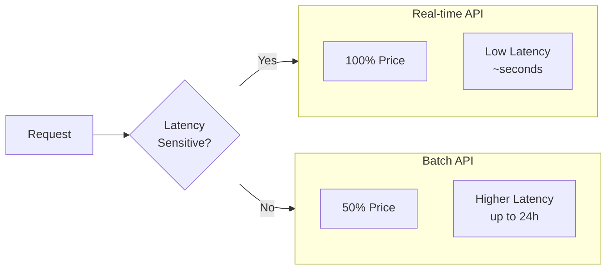

# Cost Savings with Batch Processing

## Introduction

Batch APIs offer significant cost savings—up to 50% compared to real-time requests. This lesson covers pricing structures, break-even analysis, and strategies to maximize savings while balancing latency requirements.

### What We'll Cover

- Batch pricing discounts
- Volume considerations
- Cost-latency trade-offs
- Break-even analysis
- Cost optimization strategies

### Prerequisites

- Understanding of API pricing models
- Basic batch processing concepts
- Cost tracking fundamentals

---

## Batch Pricing Overview



### Provider Pricing Comparison

| Provider | Model | Real-time (per 1M tokens) | Batch (per 1M tokens) | Discount |
|----------|-------|--------------------------|----------------------|----------|
| OpenAI | GPT-4o | $2.50 / $10.00 | $1.25 / $5.00 | 50% |
| OpenAI | GPT-4o-mini | $0.15 / $0.60 | $0.075 / $0.30 | 50% |
| OpenAI | GPT-4.1 | $2.00 / $8.00 | $1.00 / $4.00 | 50% |
| Anthropic | Claude Sonnet 4 | $3.00 / $15.00 | $1.50 / $7.50 | 50% |
| Anthropic | Claude Haiku | $0.80 / $4.00 | $0.40 / $2.00 | 50% |
| Google | Gemini 2.0 Flash | $0.10 / $0.40 | $0.05 / $0.20 | 50% |

> **Note:** Prices shown as input/output. Check provider documentation for current rates.

---

## Cost Calculator

```python
from dataclasses import dataclass
from enum import Enum
from typing import Dict, Tuple

class PricingTier(Enum):
    """API pricing tiers."""
    
    REALTIME = "realtime"
    BATCH = "batch"


@dataclass
class ModelPricing:
    """Pricing for a model in both tiers."""
    
    model: str
    input_price_per_million: float  # Real-time
    output_price_per_million: float  # Real-time
    batch_discount: float = 0.5  # 50% discount
    
    def get_price(
        self,
        tier: PricingTier
    ) -> Tuple[float, float]:
        """Get input/output price for tier."""
        
        if tier == PricingTier.BATCH:
            return (
                self.input_price_per_million * (1 - self.batch_discount),
                self.output_price_per_million * (1 - self.batch_discount)
            )
        return (
            self.input_price_per_million,
            self.output_price_per_million
        )


# Define pricing
PRICING = {
    "gpt-4o": ModelPricing("gpt-4o", 2.50, 10.00),
    "gpt-4o-mini": ModelPricing("gpt-4o-mini", 0.15, 0.60),
    "gpt-4.1": ModelPricing("gpt-4.1", 2.00, 8.00),
    "claude-sonnet-4": ModelPricing("claude-sonnet-4", 3.00, 15.00),
    "claude-haiku": ModelPricing("claude-haiku", 0.80, 4.00),
}


@dataclass
class UsageEstimate:
    """Estimated usage for cost calculation."""
    
    request_count: int
    avg_input_tokens: int
    avg_output_tokens: int
    
    @property
    def total_input_tokens(self) -> int:
        return self.request_count * self.avg_input_tokens
    
    @property
    def total_output_tokens(self) -> int:
        return self.request_count * self.avg_output_tokens


class CostCalculator:
    """Calculate and compare API costs."""
    
    def __init__(self, pricing: Dict[str, ModelPricing] = None):
        self.pricing = pricing or PRICING
    
    def calculate_cost(
        self,
        model: str,
        usage: UsageEstimate,
        tier: PricingTier
    ) -> float:
        """Calculate total cost for usage."""
        
        if model not in self.pricing:
            raise ValueError(f"Unknown model: {model}")
        
        prices = self.pricing[model].get_price(tier)
        
        input_cost = (usage.total_input_tokens / 1_000_000) * prices[0]
        output_cost = (usage.total_output_tokens / 1_000_000) * prices[1]
        
        return input_cost + output_cost
    
    def compare_tiers(
        self,
        model: str,
        usage: UsageEstimate
    ) -> dict:
        """Compare real-time vs batch costs."""
        
        realtime = self.calculate_cost(model, usage, PricingTier.REALTIME)
        batch = self.calculate_cost(model, usage, PricingTier.BATCH)
        
        savings = realtime - batch
        savings_pct = (savings / realtime) * 100 if realtime > 0 else 0
        
        return {
            "model": model,
            "requests": usage.request_count,
            "realtime_cost": realtime,
            "batch_cost": batch,
            "savings": savings,
            "savings_percent": savings_pct
        }
    
    def monthly_projection(
        self,
        model: str,
        daily_requests: int,
        avg_input_tokens: int,
        avg_output_tokens: int
    ) -> dict:
        """Project monthly costs."""
        
        monthly_requests = daily_requests * 30
        
        usage = UsageEstimate(
            request_count=monthly_requests,
            avg_input_tokens=avg_input_tokens,
            avg_output_tokens=avg_output_tokens
        )
        
        comparison = self.compare_tiers(model, usage)
        
        return {
            **comparison,
            "daily_requests": daily_requests,
            "monthly_requests": monthly_requests,
            "realtime_monthly": comparison["realtime_cost"],
            "batch_monthly": comparison["batch_cost"],
            "annual_savings": comparison["savings"] * 12
        }


# Usage examples
calc = CostCalculator()

# Single batch comparison
usage = UsageEstimate(
    request_count=10_000,
    avg_input_tokens=500,
    avg_output_tokens=200
)

result = calc.compare_tiers("gpt-4o", usage)
print(f"Real-time: ${result['realtime_cost']:.2f}")
print(f"Batch: ${result['batch_cost']:.2f}")
print(f"Savings: ${result['savings']:.2f} ({result['savings_percent']:.1f}%)")
```

**Output:**
```
Real-time: $32.50
Batch: $16.25
Savings: $16.25 (50.0%)
```

---

## Volume Considerations

### When Batch Makes Sense

```python
@dataclass
class BatchDecisionFactors:
    """Factors for batch vs real-time decision."""
    
    request_count: int
    latency_tolerance_hours: float
    cost_sensitivity: float  # 0-1, higher = more cost sensitive
    failure_cost: float  # Cost of delayed processing
    
    def should_use_batch(self) -> Tuple[bool, str]:
        """Determine if batch processing is appropriate."""
        
        # Minimum volume for batch to be worthwhile
        if self.request_count < 100:
            return False, "Too few requests for batch overhead"
        
        # Must tolerate delay
        if self.latency_tolerance_hours < 1:
            return False, "Latency requirements too strict"
        
        # Calculate break-even
        # Batch has overhead: file upload, polling, etc.
        overhead_cost_equivalent = 50  # ~50 requests worth
        break_even = overhead_cost_equivalent / 0.5  # 50% savings
        
        if self.request_count < break_even and self.cost_sensitivity < 0.7:
            return False, f"Below break-even of {break_even:.0f} requests"
        
        # High failure cost might not justify batch
        if self.failure_cost > (self.request_count * 0.01):
            return False, "Failure cost too high for delayed processing"
        
        return True, "Batch processing recommended"


# Examples
scenarios = [
    BatchDecisionFactors(50, 24.0, 0.8, 0),     # Few requests
    BatchDecisionFactors(1000, 0.5, 0.9, 0),   # Low latency tolerance
    BatchDecisionFactors(5000, 24.0, 0.7, 0),  # Good candidate
    BatchDecisionFactors(10000, 12.0, 0.9, 10), # High volume
]

for s in scenarios:
    use_batch, reason = s.should_use_batch()
    print(f"{s.request_count} requests: {'✅' if use_batch else '❌'} {reason}")
```

**Output:**
```
50 requests: ❌ Too few requests for batch overhead
1000 requests: ❌ Latency requirements too strict
5000 requests: ✅ Batch processing recommended
10000 requests: ✅ Batch processing recommended
```

### Volume Tiers and Recommendations

| Daily Requests | Recommendation | Monthly Savings (GPT-4o) |
|----------------|----------------|--------------------------|
| < 100 | Real-time | Not worth overhead |
| 100 - 1,000 | Consider batch | $15 - $150 |
| 1,000 - 10,000 | Batch recommended | $150 - $1,500 |
| 10,000 - 100,000 | Batch strongly recommended | $1,500 - $15,000 |
| > 100,000 | Batch essential | $15,000+ |

---

## Cost-Latency Trade-off

```python
from dataclasses import dataclass
from typing import List

@dataclass
class WorkloadProfile:
    """Workload characteristics for optimization."""
    
    name: str
    requests_per_hour: int
    latency_sla_seconds: int  # Max acceptable latency
    business_value_per_request: float  # Revenue/value generated
    
    @property
    def latency_sla_hours(self) -> float:
        return self.latency_sla_seconds / 3600


class WorkloadOptimizer:
    """Optimize workload distribution across tiers."""
    
    def __init__(self, calculator: CostCalculator):
        self.calculator = calculator
    
    def analyze_workload(
        self,
        profile: WorkloadProfile,
        model: str
    ) -> dict:
        """Analyze workload and recommend strategy."""
        
        hourly_usage = UsageEstimate(
            request_count=profile.requests_per_hour,
            avg_input_tokens=500,
            avg_output_tokens=200
        )
        
        # Cost per hour for each tier
        realtime_hourly = self.calculator.calculate_cost(
            model, hourly_usage, PricingTier.REALTIME
        )
        batch_hourly = self.calculator.calculate_cost(
            model, hourly_usage, PricingTier.BATCH
        )
        
        # Value generated vs cost
        hourly_value = profile.requests_per_hour * profile.business_value_per_request
        
        realtime_margin = hourly_value - realtime_hourly
        batch_margin = hourly_value - batch_hourly
        
        # Recommendation
        if profile.latency_sla_hours < 1:
            recommendation = "realtime"
            reason = "SLA requires real-time processing"
        elif batch_margin > realtime_margin * 1.2:  # 20% better margin
            recommendation = "batch"
            reason = f"Batch improves margin by ${batch_margin - realtime_margin:.2f}/hr"
        else:
            recommendation = "hybrid"
            reason = "Mixed approach balances cost and latency"
        
        return {
            "workload": profile.name,
            "requests_per_hour": profile.requests_per_hour,
            "realtime_cost_hourly": realtime_hourly,
            "batch_cost_hourly": batch_hourly,
            "hourly_value": hourly_value,
            "realtime_margin": realtime_margin,
            "batch_margin": batch_margin,
            "recommendation": recommendation,
            "reason": reason
        }
    
    def optimize_mixed_workloads(
        self,
        profiles: List[WorkloadProfile],
        model: str
    ) -> dict:
        """Optimize across multiple workload types."""
        
        analyses = [
            self.analyze_workload(p, model)
            for p in profiles
        ]
        
        # Aggregate recommendations
        realtime_workloads = [
            a for a in analyses if a["recommendation"] == "realtime"
        ]
        batch_workloads = [
            a for a in analyses if a["recommendation"] == "batch"
        ]
        
        total_realtime_cost = sum(a["realtime_cost_hourly"] for a in realtime_workloads)
        total_batch_cost = sum(a["batch_cost_hourly"] for a in batch_workloads)
        
        # Compare to all real-time
        all_realtime = sum(a["realtime_cost_hourly"] for a in analyses)
        optimized = total_realtime_cost + total_batch_cost
        
        return {
            "analyses": analyses,
            "realtime_workloads": len(realtime_workloads),
            "batch_workloads": len(batch_workloads),
            "all_realtime_hourly": all_realtime,
            "optimized_hourly": optimized,
            "hourly_savings": all_realtime - optimized,
            "monthly_savings": (all_realtime - optimized) * 24 * 30
        }


# Example workloads
workloads = [
    WorkloadProfile("Customer Chat", 100, 5, 0.50),      # 5s SLA, $0.50/msg
    WorkloadProfile("Email Analysis", 500, 3600, 0.10),  # 1h SLA, $0.10/email
    WorkloadProfile("Report Generation", 50, 86400, 5.0),  # 24h SLA, $5/report
    WorkloadProfile("Content Moderation", 1000, 30, 0.02),  # 30s SLA, $0.02/item
]

optimizer = WorkloadOptimizer(CostCalculator())
results = optimizer.optimize_mixed_workloads(workloads, "gpt-4o")

print(f"Monthly savings from optimization: ${results['monthly_savings']:.2f}")
for a in results["analyses"]:
    print(f"  {a['workload']}: {a['recommendation']} - {a['reason']}")
```

---

## Break-Even Analysis

```python
@dataclass
class BreakEvenAnalysis:
    """Analyze break-even point for batch processing."""
    
    model: str
    avg_input_tokens: int
    avg_output_tokens: int
    batch_overhead_minutes: float = 5.0  # Setup overhead
    
    def calculate_break_even(self) -> dict:
        """Calculate break-even request count."""
        
        calc = CostCalculator()
        pricing = calc.pricing.get(self.model)
        
        if not pricing:
            raise ValueError(f"Unknown model: {self.model}")
        
        # Cost per request in each tier
        input_rt, output_rt = pricing.get_price(PricingTier.REALTIME)
        input_b, output_b = pricing.get_price(PricingTier.BATCH)
        
        per_request_rt = (
            (self.avg_input_tokens / 1_000_000) * input_rt +
            (self.avg_output_tokens / 1_000_000) * output_rt
        )
        
        per_request_batch = (
            (self.avg_input_tokens / 1_000_000) * input_b +
            (self.avg_output_tokens / 1_000_000) * output_b
        )
        
        savings_per_request = per_request_rt - per_request_batch
        
        # Overhead cost (time = money)
        # Assume $50/hour dev time for overhead
        overhead_cost = (self.batch_overhead_minutes / 60) * 50
        
        # Break-even
        if savings_per_request > 0:
            break_even_requests = overhead_cost / savings_per_request
        else:
            break_even_requests = float('inf')
        
        return {
            "model": self.model,
            "per_request_realtime": per_request_rt,
            "per_request_batch": per_request_batch,
            "savings_per_request": savings_per_request,
            "overhead_cost": overhead_cost,
            "break_even_requests": int(break_even_requests),
            "break_even_with_margin": int(break_even_requests * 1.2)  # 20% margin
        }


# Analyze different models
models_to_analyze = ["gpt-4o", "gpt-4o-mini", "claude-sonnet-4"]

for model in models_to_analyze:
    analysis = BreakEvenAnalysis(
        model=model,
        avg_input_tokens=500,
        avg_output_tokens=200
    )
    
    result = analysis.calculate_break_even()
    
    print(f"\n{model}:")
    print(f"  Per-request savings: ${result['savings_per_request']*1000:.4f} per 1K requests")
    print(f"  Break-even: {result['break_even_requests']} requests")
```

**Output:**
```
gpt-4o:
  Per-request savings: $1.6250 per 1K requests
  Break-even: 2564 requests

gpt-4o-mini:
  Per-request savings: $0.0975 per 1K requests
  Break-even: 42735 requests

claude-sonnet-4:
  Per-request savings: $2.2500 per 1K requests
  Break-even: 1852 requests
```

> **🤖 AI Context:** More expensive models benefit more from batch processing due to higher absolute savings per request.

---

## Cost Tracking and Reporting

```python
from datetime import datetime, timedelta
from collections import defaultdict
from typing import Optional

class BatchCostTracker:
    """Track and report batch processing costs."""
    
    def __init__(self):
        self.batches: List[dict] = []
        self.calculator = CostCalculator()
    
    def record_batch(
        self,
        batch_id: str,
        model: str,
        input_tokens: int,
        output_tokens: int,
        request_count: int,
        start_time: datetime,
        end_time: datetime
    ):
        """Record a completed batch."""
        
        usage = UsageEstimate(
            request_count=request_count,
            avg_input_tokens=input_tokens // request_count,
            avg_output_tokens=output_tokens // request_count
        )
        
        batch_cost = self.calculator.calculate_cost(
            model, usage, PricingTier.BATCH
        )
        
        realtime_cost = self.calculator.calculate_cost(
            model, usage, PricingTier.REALTIME
        )
        
        self.batches.append({
            "batch_id": batch_id,
            "model": model,
            "request_count": request_count,
            "input_tokens": input_tokens,
            "output_tokens": output_tokens,
            "batch_cost": batch_cost,
            "realtime_cost": realtime_cost,
            "savings": realtime_cost - batch_cost,
            "start_time": start_time,
            "end_time": end_time,
            "duration_hours": (end_time - start_time).total_seconds() / 3600
        })
    
    def get_summary(
        self,
        start_date: Optional[datetime] = None,
        end_date: Optional[datetime] = None
    ) -> dict:
        """Get cost summary for period."""
        
        # Filter by date range
        filtered = self.batches
        if start_date:
            filtered = [b for b in filtered if b["start_time"] >= start_date]
        if end_date:
            filtered = [b for b in filtered if b["end_time"] <= end_date]
        
        if not filtered:
            return {"error": "No batches in period"}
        
        # Aggregate
        total_requests = sum(b["request_count"] for b in filtered)
        total_batch_cost = sum(b["batch_cost"] for b in filtered)
        total_realtime_cost = sum(b["realtime_cost"] for b in filtered)
        total_savings = sum(b["savings"] for b in filtered)
        
        # By model
        by_model = defaultdict(lambda: {
            "requests": 0,
            "cost": 0,
            "savings": 0
        })
        
        for b in filtered:
            by_model[b["model"]]["requests"] += b["request_count"]
            by_model[b["model"]]["cost"] += b["batch_cost"]
            by_model[b["model"]]["savings"] += b["savings"]
        
        return {
            "period": {
                "start": start_date.isoformat() if start_date else "all",
                "end": end_date.isoformat() if end_date else "all"
            },
            "totals": {
                "batches": len(filtered),
                "requests": total_requests,
                "batch_cost": total_batch_cost,
                "equivalent_realtime": total_realtime_cost,
                "savings": total_savings,
                "savings_percent": (total_savings / total_realtime_cost * 100) 
                                  if total_realtime_cost > 0 else 0
            },
            "by_model": dict(by_model),
            "avg_duration_hours": sum(b["duration_hours"] for b in filtered) / len(filtered)
        }
    
    def generate_report(self) -> str:
        """Generate a formatted cost report."""
        
        summary = self.get_summary()
        
        if "error" in summary:
            return summary["error"]
        
        lines = [
            "=" * 50,
            "BATCH PROCESSING COST REPORT",
            "=" * 50,
            "",
            f"Total Batches: {summary['totals']['batches']}",
            f"Total Requests: {summary['totals']['requests']:,}",
            "",
            "COSTS:",
            f"  Batch Cost: ${summary['totals']['batch_cost']:.2f}",
            f"  Real-time Would Be: ${summary['totals']['equivalent_realtime']:.2f}",
            f"  Savings: ${summary['totals']['savings']:.2f} ({summary['totals']['savings_percent']:.1f}%)",
            "",
            "BY MODEL:",
        ]
        
        for model, data in summary["by_model"].items():
            lines.append(f"  {model}:")
            lines.append(f"    Requests: {data['requests']:,}")
            lines.append(f"    Cost: ${data['cost']:.2f}")
            lines.append(f"    Savings: ${data['savings']:.2f}")
        
        lines.extend([
            "",
            f"Avg Batch Duration: {summary['avg_duration_hours']:.1f} hours",
            "=" * 50
        ])
        
        return "\n".join(lines)


# Example usage
tracker = BatchCostTracker()

# Record some batches
now = datetime.now()

tracker.record_batch(
    batch_id="batch_1",
    model="gpt-4o",
    input_tokens=5_000_000,
    output_tokens=2_000_000,
    request_count=10_000,
    start_time=now - timedelta(hours=12),
    end_time=now - timedelta(hours=2)
)

tracker.record_batch(
    batch_id="batch_2",
    model="gpt-4o-mini",
    input_tokens=10_000_000,
    output_tokens=4_000_000,
    request_count=20_000,
    start_time=now - timedelta(hours=8),
    end_time=now - timedelta(hours=1)
)

print(tracker.generate_report())
```

**Output:**
```
==================================================
BATCH PROCESSING COST REPORT
==================================================

Total Batches: 2
Total Requests: 30,000

COSTS:
  Batch Cost: $21.75
  Real-time Would Be: $43.50
  Savings: $21.75 (50.0%)

BY MODEL:
  gpt-4o:
    Requests: 10,000
    Cost: $16.25
    Savings: $16.25
  gpt-4o-mini:
    Requests: 20,000
    Cost: $5.50
    Savings: $5.50

Avg Batch Duration: 8.5 hours
==================================================
```

---

## Optimization Strategies

### 1. Batch Aggregation

```python
class BatchAggregator:
    """Aggregate small requests into larger batches for efficiency."""
    
    def __init__(
        self,
        min_batch_size: int = 100,
        max_wait_hours: float = 1.0
    ):
        self.min_batch_size = min_batch_size
        self.max_wait_hours = max_wait_hours
        self.pending: List[dict] = []
        self.first_request_time: Optional[datetime] = None
    
    def add_request(self, request: dict) -> Optional[List[dict]]:
        """Add request, return batch if threshold met."""
        
        if not self.pending:
            self.first_request_time = datetime.now()
        
        self.pending.append(request)
        
        # Check if we should flush
        should_flush = False
        
        if len(self.pending) >= self.min_batch_size:
            should_flush = True
            reason = "size threshold"
        elif self.first_request_time:
            elapsed = (datetime.now() - self.first_request_time).total_seconds() / 3600
            if elapsed >= self.max_wait_hours:
                should_flush = True
                reason = "time threshold"
        
        if should_flush:
            batch = self.pending.copy()
            self.pending = []
            self.first_request_time = None
            print(f"Flushing batch of {len(batch)} requests ({reason})")
            return batch
        
        return None
    
    def flush(self) -> Optional[List[dict]]:
        """Force flush any pending requests."""
        
        if self.pending:
            batch = self.pending.copy()
            self.pending = []
            self.first_request_time = None
            return batch
        return None
```

### 2. Model Selection for Batch

```python
def select_optimal_model_for_batch(
    task_complexity: str,  # "simple", "medium", "complex"
    volume: int,
    budget: float
) -> str:
    """Select optimal model given constraints."""
    
    calc = CostCalculator()
    
    # Candidate models by complexity
    candidates = {
        "simple": ["gpt-4o-mini", "claude-haiku"],
        "medium": ["gpt-4o-mini", "gpt-4o", "claude-sonnet-4"],
        "complex": ["gpt-4o", "gpt-4.1", "claude-sonnet-4"]
    }
    
    usage = UsageEstimate(
        request_count=volume,
        avg_input_tokens=500,
        avg_output_tokens=200
    )
    
    best_model = None
    best_cost = float('inf')
    
    for model in candidates.get(task_complexity, ["gpt-4o"]):
        if model not in calc.pricing:
            continue
        
        cost = calc.calculate_cost(model, usage, PricingTier.BATCH)
        
        if cost <= budget and cost < best_cost:
            best_model = model
            best_cost = cost
    
    if best_model:
        print(f"Selected {best_model} at ${best_cost:.2f} (within ${budget:.2f} budget)")
        return best_model
    else:
        print(f"No model fits budget of ${budget:.2f}")
        return None


# Examples
select_optimal_model_for_batch("simple", 10000, 50.0)
select_optimal_model_for_batch("complex", 5000, 100.0)
```

---

## Hands-on Exercise

### Your Task

Build a cost optimization dashboard that recommends the best processing strategy.

### Requirements

1. Analyze workloads and categorize by latency tolerance
2. Calculate savings for different model/tier combinations
3. Generate optimization recommendations
4. Provide projected monthly cost comparisons

### Expected Result

```python
dashboard = CostDashboard()
dashboard.add_workload("chat", requests=10000, latency_sla=10, model="gpt-4o")
dashboard.add_workload("reports", requests=5000, latency_sla=86400, model="gpt-4o")

report = dashboard.generate_recommendations()
# Shows per-workload recommendations with projected savings
```

<details>
<summary>💡 Hints</summary>

- Group workloads by latency tolerance thresholds
- Compare each workload across model/tier combinations
- Consider total cost across all workloads
</details>

<details>
<summary>✅ Solution</summary>

```python
from dataclasses import dataclass, field
from typing import List

@dataclass
class Workload:
    """A workload for optimization."""
    
    name: str
    daily_requests: int
    latency_sla_seconds: int
    current_model: str
    avg_input_tokens: int = 500
    avg_output_tokens: int = 200


class CostDashboard:
    """Dashboard for cost optimization recommendations."""
    
    def __init__(self):
        self.workloads: List[Workload] = []
        self.calculator = CostCalculator()
    
    def add_workload(
        self,
        name: str,
        requests: int,
        latency_sla: int,
        model: str
    ):
        """Add a workload for analysis."""
        
        self.workloads.append(Workload(
            name=name,
            daily_requests=requests,
            latency_sla_seconds=latency_sla,
            current_model=model
        ))
    
    def analyze_workload(self, workload: Workload) -> dict:
        """Analyze single workload."""
        
        usage = UsageEstimate(
            request_count=workload.daily_requests * 30,
            avg_input_tokens=workload.avg_input_tokens,
            avg_output_tokens=workload.avg_output_tokens
        )
        
        # Current cost (realtime)
        current_cost = self.calculator.calculate_cost(
            workload.current_model,
            usage,
            PricingTier.REALTIME
        )
        
        # Batch eligible?
        batch_eligible = workload.latency_sla_seconds >= 3600
        
        if batch_eligible:
            batch_cost = self.calculator.calculate_cost(
                workload.current_model,
                usage,
                PricingTier.BATCH
            )
            
            recommendation = "batch"
            projected_cost = batch_cost
            savings = current_cost - batch_cost
        else:
            recommendation = "realtime"
            projected_cost = current_cost
            savings = 0
        
        # Check if cheaper model works
        model_alternatives = []
        if workload.current_model != "gpt-4o-mini":
            alt_cost = self.calculator.calculate_cost(
                "gpt-4o-mini",
                usage,
                PricingTier.BATCH if batch_eligible else PricingTier.REALTIME
            )
            if alt_cost < projected_cost:
                model_alternatives.append({
                    "model": "gpt-4o-mini",
                    "cost": alt_cost,
                    "additional_savings": projected_cost - alt_cost
                })
        
        return {
            "workload": workload.name,
            "daily_requests": workload.daily_requests,
            "latency_sla": f"{workload.latency_sla_seconds}s",
            "batch_eligible": batch_eligible,
            "current_model": workload.current_model,
            "current_monthly_cost": current_cost,
            "recommendation": recommendation,
            "projected_monthly_cost": projected_cost,
            "monthly_savings": savings,
            "model_alternatives": model_alternatives
        }
    
    def generate_recommendations(self) -> dict:
        """Generate full recommendations report."""
        
        analyses = [self.analyze_workload(w) for w in self.workloads]
        
        total_current = sum(a["current_monthly_cost"] for a in analyses)
        total_projected = sum(a["projected_monthly_cost"] for a in analyses)
        total_savings = sum(a["monthly_savings"] for a in analyses)
        
        # Additional savings from model changes
        additional_savings = 0
        for a in analyses:
            if a["model_alternatives"]:
                additional_savings += max(
                    alt["additional_savings"] 
                    for alt in a["model_alternatives"]
                )
        
        lines = [
            "=" * 60,
            "COST OPTIMIZATION RECOMMENDATIONS",
            "=" * 60,
            "",
        ]
        
        for a in analyses:
            lines.extend([
                f"📊 {a['workload'].upper()}",
                f"   Requests: {a['daily_requests']:,}/day",
                f"   Latency SLA: {a['latency_sla']}",
                f"   Batch Eligible: {'✅ Yes' if a['batch_eligible'] else '❌ No'}",
                f"",
                f"   Current: {a['current_model']} (realtime)",
                f"   Cost: ${a['current_monthly_cost']:.2f}/month",
                f"",
                f"   💡 Recommendation: {a['recommendation'].upper()}",
                f"   Projected: ${a['projected_monthly_cost']:.2f}/month",
                f"   Savings: ${a['monthly_savings']:.2f}/month",
            ])
            
            if a["model_alternatives"]:
                lines.append(f"")
                lines.append(f"   🔄 Model alternatives:")
                for alt in a["model_alternatives"]:
                    lines.append(
                        f"      - {alt['model']}: ${alt['cost']:.2f}/mo "
                        f"(+${alt['additional_savings']:.2f} savings)"
                    )
            
            lines.append("")
            lines.append("-" * 60)
        
        lines.extend([
            "",
            "SUMMARY",
            f"   Current Monthly Cost: ${total_current:.2f}",
            f"   Projected Monthly Cost: ${total_projected:.2f}",
            f"   Monthly Savings (batch): ${total_savings:.2f}",
            f"   Potential (model changes): ${additional_savings:.2f}",
            f"   Total Potential Savings: ${total_savings + additional_savings:.2f}",
            f"   Annual Savings: ${(total_savings + additional_savings) * 12:.2f}",
            "",
            "=" * 60
        ])
        
        return {
            "report": "\n".join(lines),
            "analyses": analyses,
            "summary": {
                "current_monthly": total_current,
                "projected_monthly": total_projected,
                "monthly_savings": total_savings,
                "additional_potential": additional_savings,
                "annual_savings": (total_savings + additional_savings) * 12
            }
        }


# Test
dashboard = CostDashboard()

dashboard.add_workload(
    "Customer Chat",
    requests=5000,
    latency_sla=10,
    model="gpt-4o"
)

dashboard.add_workload(
    "Email Analysis",
    requests=10000,
    latency_sla=3600,
    model="gpt-4o"
)

dashboard.add_workload(
    "Report Generation",
    requests=2000,
    latency_sla=86400,
    model="gpt-4o"
)

result = dashboard.generate_recommendations()
print(result["report"])

print(f"\nAnnual savings: ${result['summary']['annual_savings']:.2f}")
```

</details>

---

## Summary

✅ Batch APIs offer ~50% cost savings across providers  
✅ Volume thresholds determine when batch is worthwhile  
✅ Balance cost savings against latency requirements  
✅ Track and report savings for budget optimization  
✅ Combine batch processing with model selection for maximum savings

**Next:** [Result Handling](./05-result-handling.md)

---

## Further Reading

- [OpenAI Pricing](https://openai.com/pricing) — Current model pricing
- [Anthropic Pricing](https://www.anthropic.com/pricing) — Claude batch pricing
- [Cost Optimization](https://platform.openai.com/docs/guides/production-best-practices) — Production best practices

<!-- 
Sources Consulted:
- OpenAI Batch API: https://platform.openai.com/docs/guides/batch
- OpenAI Pricing: https://openai.com/pricing
- Anthropic Pricing: https://www.anthropic.com/pricing
-->
