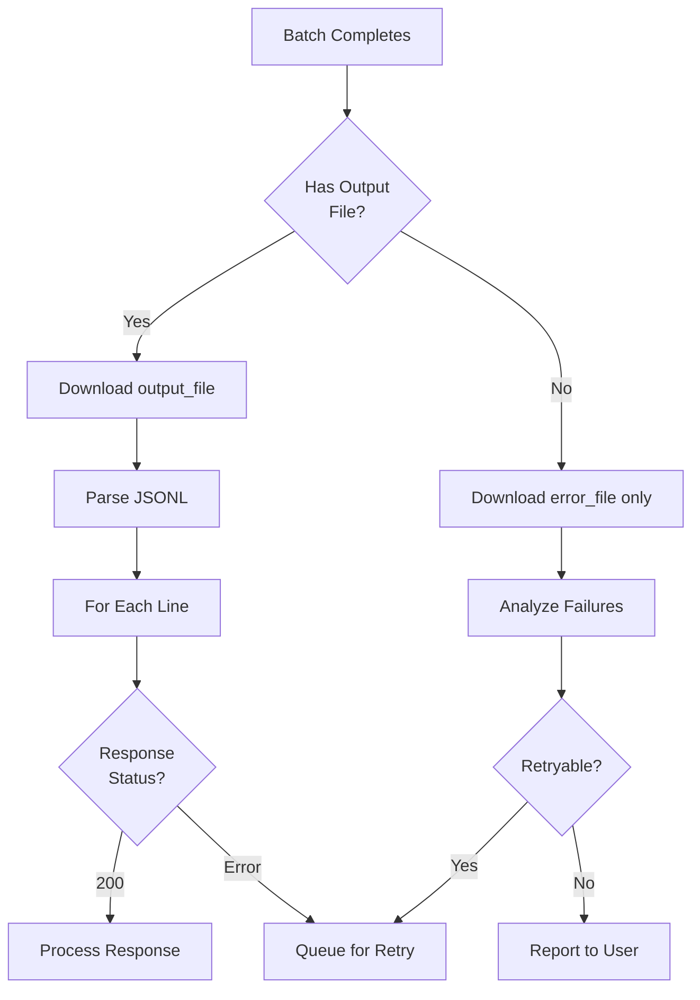

# Batch Result Handling

## Introduction

After a batch completes, you need to parse results, handle errors, and process partial successes. This lesson covers robust result handling patterns including mapping results to original requests, handling failures, and storing results efficiently.

### What We'll Cover

- Parsing batch results
- Error handling per item
- Partial success handling
- Result storage strategies
- Result validation

### Prerequisites

- Understanding of OpenAI Batch API
- JSON/JSONL parsing concepts
- Error handling fundamentals

---

## Result File Format



### Output File Structure

Each line in the output file is a JSON object:

```python
from dataclasses import dataclass
from typing import Optional, Dict, Any, List
import json

@dataclass
class BatchResultLine:
    """A single line from batch output file."""
    
    id: str  # Unique line ID from OpenAI
    custom_id: str  # Your custom ID from input
    response: Optional[Dict[str, Any]]  # Success response
    error: Optional[Dict[str, Any]]  # Error info if failed
    
    @property
    def is_success(self) -> bool:
        """Check if request succeeded."""
        return self.response is not None and \
               self.response.get("status_code") == 200
    
    @property
    def content(self) -> Optional[str]:
        """Extract the completion content."""
        if not self.is_success:
            return None
        
        try:
            body = self.response.get("body", {})
            choices = body.get("choices", [])
            if choices:
                return choices[0].get("message", {}).get("content")
        except (KeyError, IndexError):
            return None
        return None
    
    @property
    def usage(self) -> Dict[str, int]:
        """Extract token usage."""
        if not self.response:
            return {}
        return self.response.get("body", {}).get("usage", {})
    
    @property
    def error_message(self) -> Optional[str]:
        """Get error message if failed."""
        if self.error:
            return self.error.get("message")
        if self.response and self.response.get("status_code") != 200:
            return self.response.get("body", {}).get("error", {}).get("message")
        return None


# Parse example
line = {
    "id": "response-abc123",
    "custom_id": "req-001",
    "response": {
        "status_code": 200,
        "body": {
            "id": "chatcmpl-xyz",
            "choices": [
                {
                    "message": {
                        "role": "assistant",
                        "content": "The answer is 42."
                    }
                }
            ],
            "usage": {
                "prompt_tokens": 50,
                "completion_tokens": 10,
                "total_tokens": 60
            }
        }
    }
}

result = BatchResultLine(
    id=line["id"],
    custom_id=line["custom_id"],
    response=line.get("response"),
    error=line.get("error")
)

print(f"Success: {result.is_success}")
print(f"Content: {result.content}")
print(f"Usage: {result.usage}")
```

**Output:**
```
Success: True
Content: The answer is 42.
Usage: {'prompt_tokens': 50, 'completion_tokens': 10, 'total_tokens': 60}
```

---

## Parsing Batch Results

```python
from openai import OpenAI
from typing import Generator, Tuple
import json

client = OpenAI()

class BatchResultParser:
    """Parse batch result files."""
    
    def __init__(self):
        self.client = OpenAI()
    
    def download_file(self, file_id: str) -> str:
        """Download file content."""
        
        response = self.client.files.content(file_id)
        return response.text
    
    def parse_jsonl(
        self,
        content: str
    ) -> Generator[BatchResultLine, None, None]:
        """Parse JSONL content into result objects."""
        
        for line_num, line in enumerate(content.strip().split('\n'), 1):
            if not line.strip():
                continue
            
            try:
                data = json.loads(line)
                yield BatchResultLine(
                    id=data.get("id", f"line-{line_num}"),
                    custom_id=data.get("custom_id", ""),
                    response=data.get("response"),
                    error=data.get("error")
                )
            except json.JSONDecodeError as e:
                print(f"Failed to parse line {line_num}: {e}")
                yield BatchResultLine(
                    id=f"parse-error-{line_num}",
                    custom_id="",
                    response=None,
                    error={"message": f"Parse error: {str(e)}", "line": line}
                )
    
    def parse_batch_results(
        self,
        output_file_id: str,
        error_file_id: Optional[str] = None
    ) -> Tuple[List[BatchResultLine], List[BatchResultLine]]:
        """Parse both output and error files."""
        
        successes = []
        failures = []
        
        # Parse output file
        if output_file_id:
            content = self.download_file(output_file_id)
            
            for result in self.parse_jsonl(content):
                if result.is_success:
                    successes.append(result)
                else:
                    failures.append(result)
        
        # Parse error file for additional errors
        if error_file_id:
            error_content = self.download_file(error_file_id)
            
            for result in self.parse_jsonl(error_content):
                failures.append(result)
        
        return successes, failures
    
    def get_results_with_metadata(
        self,
        output_file_id: str,
        original_requests: Dict[str, dict]
    ) -> List[dict]:
        """Parse results and join with original request metadata."""
        
        content = self.download_file(output_file_id)
        results = []
        
        for result in self.parse_jsonl(content):
            original = original_requests.get(result.custom_id, {})
            
            results.append({
                "custom_id": result.custom_id,
                "success": result.is_success,
                "content": result.content,
                "usage": result.usage,
                "error": result.error_message,
                "original_request": original
            })
        
        return results


# Usage
parser = BatchResultParser()

# Parse completed batch
successes, failures = parser.parse_batch_results(
    output_file_id="file-output-xyz",
    error_file_id="file-error-xyz"
)

print(f"Successful: {len(successes)}")
print(f"Failed: {len(failures)}")

# Access results
for result in successes[:3]:
    print(f"  {result.custom_id}: {result.content[:50]}...")
```

---

## Error Handling Per Item

```python
from enum import Enum
from typing import List, Dict, Optional

class ErrorCategory(Enum):
    """Categories of batch errors."""
    
    RATE_LIMIT = "rate_limit"
    CONTEXT_LENGTH = "context_length"
    CONTENT_FILTER = "content_filter"
    INVALID_REQUEST = "invalid_request"
    SERVER_ERROR = "server_error"
    UNKNOWN = "unknown"


@dataclass
class ClassifiedError:
    """An error with classification."""
    
    custom_id: str
    category: ErrorCategory
    message: str
    retryable: bool
    original_error: dict


class BatchErrorClassifier:
    """Classify and handle batch errors."""
    
    ERROR_PATTERNS = {
        ErrorCategory.RATE_LIMIT: [
            "rate_limit", "rate limit", "too many requests"
        ],
        ErrorCategory.CONTEXT_LENGTH: [
            "context_length", "maximum context", "too long", "token limit"
        ],
        ErrorCategory.CONTENT_FILTER: [
            "content_filter", "content policy", "flagged", "moderation"
        ],
        ErrorCategory.INVALID_REQUEST: [
            "invalid_request", "invalid request", "malformed", "missing"
        ],
        ErrorCategory.SERVER_ERROR: [
            "server_error", "internal error", "503", "502", "500"
        ]
    }
    
    RETRYABLE_CATEGORIES = {
        ErrorCategory.RATE_LIMIT,
        ErrorCategory.SERVER_ERROR
    }
    
    def classify_error(self, result: BatchResultLine) -> ClassifiedError:
        """Classify a failed result."""
        
        message = result.error_message or "Unknown error"
        message_lower = message.lower()
        
        # Find matching category
        category = ErrorCategory.UNKNOWN
        for cat, patterns in self.ERROR_PATTERNS.items():
            if any(p in message_lower for p in patterns):
                category = cat
                break
        
        return ClassifiedError(
            custom_id=result.custom_id,
            category=category,
            message=message,
            retryable=category in self.RETRYABLE_CATEGORIES,
            original_error=result.error or {}
        )
    
    def analyze_failures(
        self,
        failures: List[BatchResultLine]
    ) -> dict:
        """Analyze all failures and categorize."""
        
        classified = [self.classify_error(f) for f in failures]
        
        # Group by category
        by_category = {}
        for c in classified:
            cat_name = c.category.value
            if cat_name not in by_category:
                by_category[cat_name] = []
            by_category[cat_name].append(c)
        
        # Count retryable
        retryable = [c for c in classified if c.retryable]
        non_retryable = [c for c in classified if not c.retryable]
        
        return {
            "total_failures": len(failures),
            "by_category": {
                cat: len(items) for cat, items in by_category.items()
            },
            "retryable_count": len(retryable),
            "retryable_ids": [c.custom_id for c in retryable],
            "non_retryable_count": len(non_retryable),
            "non_retryable_details": [
                {"id": c.custom_id, "category": c.category.value, "message": c.message}
                for c in non_retryable
            ]
        }
    
    def get_retry_batch(
        self,
        failures: List[BatchResultLine],
        original_requests: Dict[str, dict]
    ) -> List[dict]:
        """Extract retryable failures for new batch."""
        
        retry_requests = []
        
        for failure in failures:
            classified = self.classify_error(failure)
            
            if classified.retryable:
                original = original_requests.get(failure.custom_id)
                if original:
                    retry_requests.append(original)
        
        return retry_requests


# Usage
classifier = BatchErrorClassifier()

# Classify failures
analysis = classifier.analyze_failures(failures)

print(f"Total failures: {analysis['total_failures']}")
print(f"By category: {analysis['by_category']}")
print(f"Retryable: {analysis['retryable_count']}")

# Get requests to retry
retry_requests = classifier.get_retry_batch(failures, original_requests)
print(f"Requests to retry: {len(retry_requests)}")
```

---

## Partial Success Handling

```python
from dataclasses import dataclass, field
from typing import List, Dict, Set

@dataclass
class BatchProcessingResult:
    """Complete result of batch processing."""
    
    batch_id: str
    total_requests: int
    successes: List[BatchResultLine] = field(default_factory=list)
    failures: List[BatchResultLine] = field(default_factory=list)
    
    @property
    def success_count(self) -> int:
        return len(self.successes)
    
    @property
    def failure_count(self) -> int:
        return len(self.failures)
    
    @property
    def success_rate(self) -> float:
        if self.total_requests == 0:
            return 0.0
        return self.success_count / self.total_requests
    
    @property
    def is_complete_success(self) -> bool:
        return self.failure_count == 0
    
    @property
    def is_complete_failure(self) -> bool:
        return self.success_count == 0
    
    @property
    def is_partial_success(self) -> bool:
        return self.success_count > 0 and self.failure_count > 0


class PartialSuccessHandler:
    """Handle partial batch successes."""
    
    def __init__(
        self,
        min_success_rate: float = 0.8,
        auto_retry: bool = True
    ):
        self.min_success_rate = min_success_rate
        self.auto_retry = auto_retry
        self.classifier = BatchErrorClassifier()
    
    def process_results(
        self,
        result: BatchProcessingResult,
        original_requests: Dict[str, dict]
    ) -> dict:
        """Process batch results and determine next actions."""
        
        # Analyze outcome
        if result.is_complete_success:
            return {
                "status": "complete_success",
                "action": "none",
                "message": f"All {result.total_requests} requests succeeded"
            }
        
        if result.is_complete_failure:
            return {
                "status": "complete_failure",
                "action": "investigate",
                "message": "All requests failed - investigate cause"
            }
        
        # Partial success
        analysis = self.classifier.analyze_failures(result.failures)
        
        # Check if above threshold
        if result.success_rate >= self.min_success_rate:
            action = "accept_with_retry" if self.auto_retry else "accept"
        else:
            action = "retry_all" if analysis["retryable_count"] > 0 else "investigate"
        
        return {
            "status": "partial_success",
            "success_rate": result.success_rate,
            "action": action,
            "successes": result.success_count,
            "failures": result.failure_count,
            "retryable": analysis["retryable_count"],
            "error_breakdown": analysis["by_category"],
            "retry_ids": analysis["retryable_ids"] if self.auto_retry else []
        }
    
    def handle_partial_success(
        self,
        result: BatchProcessingResult,
        original_requests: Dict[str, dict],
        success_callback,
        retry_callback
    ):
        """Handle partial success with callbacks."""
        
        # Process successes immediately
        for success in result.successes:
            success_callback(success)
        
        # Handle failures
        analysis = self.process_results(result, original_requests)
        
        if analysis["action"] in ["accept_with_retry", "retry_all"]:
            # Queue retryable failures
            retry_requests = self.classifier.get_retry_batch(
                result.failures, original_requests
            )
            
            if retry_requests:
                retry_callback(retry_requests)
        
        return analysis


# Usage
handler = PartialSuccessHandler(min_success_rate=0.9, auto_retry=True)

result = BatchProcessingResult(
    batch_id="batch_123",
    total_requests=1000,
    successes=successes,  # 950 items
    failures=failures     # 50 items
)

def on_success(item):
    # Process successful result
    print(f"Processing: {item.custom_id}")


def on_retry(requests):
    # Submit new batch with failed requests
    print(f"Retrying {len(requests)} requests")


analysis = handler.handle_partial_success(
    result,
    original_requests,
    success_callback=on_success,
    retry_callback=on_retry
)

print(f"Success rate: {analysis['success_rate']:.1%}")
print(f"Action: {analysis['action']}")
```

---

## Result Storage Strategies

```python
import sqlite3
import json
from datetime import datetime
from abc import ABC, abstractmethod

class ResultStorage(ABC):
    """Abstract base for result storage."""
    
    @abstractmethod
    def store(self, batch_id: str, results: List[BatchResultLine]):
        pass
    
    @abstractmethod
    def retrieve(self, batch_id: str) -> List[dict]:
        pass


class SQLiteResultStorage(ResultStorage):
    """Store results in SQLite."""
    
    def __init__(self, db_path: str = "batch_results.db"):
        self.db_path = db_path
        self._init_db()
    
    def _init_db(self):
        """Initialize database schema."""
        
        conn = sqlite3.connect(self.db_path)
        cursor = conn.cursor()
        
        cursor.execute("""
            CREATE TABLE IF NOT EXISTS results (
                id INTEGER PRIMARY KEY AUTOINCREMENT,
                batch_id TEXT,
                custom_id TEXT,
                success INTEGER,
                content TEXT,
                usage_prompt INTEGER,
                usage_completion INTEGER,
                error TEXT,
                created_at TEXT,
                UNIQUE(batch_id, custom_id)
            )
        """)
        
        cursor.execute("""
            CREATE INDEX IF NOT EXISTS idx_batch_id ON results(batch_id)
        """)
        
        cursor.execute("""
            CREATE INDEX IF NOT EXISTS idx_custom_id ON results(custom_id)
        """)
        
        conn.commit()
        conn.close()
    
    def store(self, batch_id: str, results: List[BatchResultLine]):
        """Store batch results."""
        
        conn = sqlite3.connect(self.db_path)
        cursor = conn.cursor()
        
        for result in results:
            usage = result.usage
            
            cursor.execute("""
                INSERT OR REPLACE INTO results 
                (batch_id, custom_id, success, content, 
                 usage_prompt, usage_completion, error, created_at)
                VALUES (?, ?, ?, ?, ?, ?, ?, ?)
            """, (
                batch_id,
                result.custom_id,
                1 if result.is_success else 0,
                result.content,
                usage.get("prompt_tokens", 0),
                usage.get("completion_tokens", 0),
                result.error_message,
                datetime.now().isoformat()
            ))
        
        conn.commit()
        conn.close()
        
        print(f"Stored {len(results)} results for batch {batch_id}")
    
    def retrieve(self, batch_id: str) -> List[dict]:
        """Retrieve results for a batch."""
        
        conn = sqlite3.connect(self.db_path)
        cursor = conn.cursor()
        
        cursor.execute("""
            SELECT custom_id, success, content, 
                   usage_prompt, usage_completion, error
            FROM results WHERE batch_id = ?
        """, (batch_id,))
        
        results = []
        for row in cursor.fetchall():
            results.append({
                "custom_id": row[0],
                "success": bool(row[1]),
                "content": row[2],
                "usage": {
                    "prompt_tokens": row[3],
                    "completion_tokens": row[4]
                },
                "error": row[5]
            })
        
        conn.close()
        return results
    
    def get_by_custom_id(self, custom_id: str) -> Optional[dict]:
        """Get result by custom ID."""
        
        conn = sqlite3.connect(self.db_path)
        cursor = conn.cursor()
        
        cursor.execute("""
            SELECT batch_id, success, content, 
                   usage_prompt, usage_completion, error
            FROM results WHERE custom_id = ?
            ORDER BY created_at DESC LIMIT 1
        """, (custom_id,))
        
        row = cursor.fetchone()
        conn.close()
        
        if row:
            return {
                "batch_id": row[0],
                "success": bool(row[1]),
                "content": row[2],
                "usage": {
                    "prompt_tokens": row[3],
                    "completion_tokens": row[4]
                },
                "error": row[5]
            }
        return None
    
    def get_statistics(self, batch_id: str) -> dict:
        """Get statistics for a batch."""
        
        conn = sqlite3.connect(self.db_path)
        cursor = conn.cursor()
        
        cursor.execute("""
            SELECT 
                COUNT(*) as total,
                SUM(success) as successes,
                SUM(usage_prompt) as total_prompt_tokens,
                SUM(usage_completion) as total_completion_tokens
            FROM results WHERE batch_id = ?
        """, (batch_id,))
        
        row = cursor.fetchone()
        conn.close()
        
        return {
            "batch_id": batch_id,
            "total": row[0],
            "successes": row[1] or 0,
            "failures": row[0] - (row[1] or 0),
            "success_rate": (row[1] or 0) / row[0] if row[0] > 0 else 0,
            "total_tokens": (row[2] or 0) + (row[3] or 0),
            "prompt_tokens": row[2] or 0,
            "completion_tokens": row[3] or 0
        }


# File-based storage for large results
class JSONLResultStorage(ResultStorage):
    """Store results in JSONL files."""
    
    def __init__(self, base_dir: str = "./batch_results"):
        self.base_dir = base_dir
        import os
        os.makedirs(base_dir, exist_ok=True)
    
    def store(self, batch_id: str, results: List[BatchResultLine]):
        """Store results to JSONL file."""
        
        filepath = f"{self.base_dir}/{batch_id}.jsonl"
        
        with open(filepath, 'w') as f:
            for result in results:
                record = {
                    "custom_id": result.custom_id,
                    "success": result.is_success,
                    "content": result.content,
                    "usage": result.usage,
                    "error": result.error_message,
                    "timestamp": datetime.now().isoformat()
                }
                f.write(json.dumps(record) + '\n')
        
        print(f"Stored {len(results)} results to {filepath}")
    
    def retrieve(self, batch_id: str) -> List[dict]:
        """Retrieve results from JSONL file."""
        
        filepath = f"{self.base_dir}/{batch_id}.jsonl"
        results = []
        
        try:
            with open(filepath, 'r') as f:
                for line in f:
                    results.append(json.loads(line.strip()))
        except FileNotFoundError:
            print(f"No results found for batch {batch_id}")
        
        return results


# Usage
storage = SQLiteResultStorage("my_batches.db")

# Store results
storage.store("batch_123", successes + failures)

# Retrieve
results = storage.retrieve("batch_123")
print(f"Retrieved {len(results)} results")

# Get statistics
stats = storage.get_statistics("batch_123")
print(f"Success rate: {stats['success_rate']:.1%}")
print(f"Total tokens: {stats['total_tokens']:,}")
```

---

## Result Validation

```python
from dataclasses import dataclass
from typing import Callable, List, Optional

@dataclass
class ValidationRule:
    """A rule for validating results."""
    
    name: str
    check: Callable[[str], bool]  # content -> is_valid
    error_message: str


class ResultValidator:
    """Validate batch results."""
    
    def __init__(self):
        self.rules: List[ValidationRule] = []
    
    def add_rule(
        self,
        name: str,
        check: Callable[[str], bool],
        error_message: str
    ):
        """Add a validation rule."""
        
        self.rules.append(ValidationRule(
            name=name,
            check=check,
            error_message=error_message
        ))
    
    def validate(self, content: str) -> Tuple[bool, List[str]]:
        """Validate content against all rules."""
        
        errors = []
        
        for rule in self.rules:
            try:
                if not rule.check(content):
                    errors.append(f"{rule.name}: {rule.error_message}")
            except Exception as e:
                errors.append(f"{rule.name}: Validation error - {str(e)}")
        
        return len(errors) == 0, errors
    
    def validate_results(
        self,
        results: List[BatchResultLine]
    ) -> dict:
        """Validate all results."""
        
        valid = []
        invalid = []
        
        for result in results:
            if not result.is_success:
                invalid.append({
                    "custom_id": result.custom_id,
                    "reason": "API error",
                    "errors": [result.error_message]
                })
                continue
            
            is_valid, errors = self.validate(result.content or "")
            
            if is_valid:
                valid.append(result)
            else:
                invalid.append({
                    "custom_id": result.custom_id,
                    "reason": "validation_failed",
                    "errors": errors
                })
        
        return {
            "valid_count": len(valid),
            "invalid_count": len(invalid),
            "valid_results": valid,
            "invalid_results": invalid
        }


# Example: JSON response validation
validator = ResultValidator()

# Must be valid JSON
validator.add_rule(
    "json_parse",
    lambda c: json.loads(c) is not None,
    "Response must be valid JSON"
)

# Must have required fields
def has_required_fields(content: str) -> bool:
    data = json.loads(content)
    return all(k in data for k in ["title", "summary", "score"])

validator.add_rule(
    "required_fields",
    has_required_fields,
    "Missing required fields: title, summary, score"
)

# Score must be in range
def score_in_range(content: str) -> bool:
    data = json.loads(content)
    score = data.get("score", 0)
    return 0 <= score <= 10

validator.add_rule(
    "score_range",
    score_in_range,
    "Score must be between 0 and 10"
)

# Validate
validation_result = validator.validate_results(successes)

print(f"Valid: {validation_result['valid_count']}")
print(f"Invalid: {validation_result['invalid_count']}")

for inv in validation_result["invalid_results"][:3]:
    print(f"  {inv['custom_id']}: {inv['errors']}")
```

---

## Complete Result Processing Pipeline

```python
class BatchResultPipeline:
    """Complete pipeline for processing batch results."""
    
    def __init__(
        self,
        storage: ResultStorage,
        validator: Optional[ResultValidator] = None,
        min_success_rate: float = 0.8
    ):
        self.storage = storage
        self.validator = validator
        self.parser = BatchResultParser()
        self.handler = PartialSuccessHandler(min_success_rate)
        self.classifier = BatchErrorClassifier()
    
    def process_batch(
        self,
        batch_id: str,
        output_file_id: str,
        error_file_id: Optional[str],
        original_requests: Dict[str, dict]
    ) -> dict:
        """Process complete batch results."""
        
        # Step 1: Parse results
        print("Parsing results...")
        successes, failures = self.parser.parse_batch_results(
            output_file_id, error_file_id
        )
        
        # Step 2: Validate successes (if validator configured)
        if self.validator:
            print("Validating results...")
            validation = self.validator.validate_results(successes)
            
            # Move invalid to failures
            valid_successes = validation["valid_results"]
            for inv in validation["invalid_results"]:
                # Find original result and mark as failure
                for s in successes:
                    if s.custom_id == inv["custom_id"]:
                        failures.append(s)
                        break
            
            successes = valid_successes
        
        # Step 3: Create processing result
        result = BatchProcessingResult(
            batch_id=batch_id,
            total_requests=len(original_requests),
            successes=successes,
            failures=failures
        )
        
        # Step 4: Analyze partial success
        print("Analyzing results...")
        analysis = self.handler.process_results(result, original_requests)
        
        # Step 5: Store results
        print("Storing results...")
        self.storage.store(batch_id, successes + failures)
        
        # Step 6: Prepare retry batch if needed
        retry_requests = []
        if analysis.get("action") in ["accept_with_retry", "retry_all"]:
            retry_requests = self.classifier.get_retry_batch(
                failures, original_requests
            )
        
        # Step 7: Generate report
        stats = self.storage.get_statistics(batch_id)
        
        return {
            "batch_id": batch_id,
            "status": analysis["status"],
            "action": analysis["action"],
            "statistics": stats,
            "retry_count": len(retry_requests),
            "retry_requests": retry_requests,
            "error_breakdown": analysis.get("error_breakdown", {})
        }


# Usage
pipeline = BatchResultPipeline(
    storage=SQLiteResultStorage("production.db"),
    validator=validator,
    min_success_rate=0.9
)

# After batch completes
result = pipeline.process_batch(
    batch_id="batch_abc123",
    output_file_id="file-output-xyz",
    error_file_id="file-error-xyz",
    original_requests=original_requests
)

print(f"Status: {result['status']}")
print(f"Success rate: {result['statistics']['success_rate']:.1%}")

if result["retry_requests"]:
    print(f"Retrying {result['retry_count']} requests...")
    # Submit retry batch
```

---

## Hands-on Exercise

### Your Task

Build a result streaming processor that handles results as they become available.

### Requirements

1. Stream results from file without loading all into memory
2. Process each result immediately
3. Track progress and statistics in real-time
4. Handle very large batch files (millions of lines)

### Expected Result

```python
processor = StreamingResultProcessor(
    chunk_size=1000,
    on_result=process_single_result,
    on_progress=update_progress_bar
)

stats = processor.process_file("large_output.jsonl")
# Processes in chunks, reports progress
```

<details>
<summary>💡 Hints</summary>

- Read file line by line, not all at once
- Process in chunks for efficiency
- Use generators for memory efficiency
- Report progress periodically
</details>

<details>
<summary>✅ Solution</summary>

```python
from typing import Callable, Generator
import time

class StreamingResultProcessor:
    """Process results in streaming fashion for large files."""
    
    def __init__(
        self,
        chunk_size: int = 1000,
        on_result: Callable[[BatchResultLine], None] = None,
        on_progress: Callable[[dict], None] = None,
        progress_interval: int = 100
    ):
        self.chunk_size = chunk_size
        self.on_result = on_result
        self.on_progress = on_progress
        self.progress_interval = progress_interval
    
    def _stream_lines(self, filepath: str) -> Generator[str, None, None]:
        """Stream lines from file."""
        
        with open(filepath, 'r') as f:
            for line in f:
                if line.strip():
                    yield line.strip()
    
    def _parse_line(self, line: str) -> Optional[BatchResultLine]:
        """Parse a single line."""
        
        try:
            data = json.loads(line)
            return BatchResultLine(
                id=data.get("id", ""),
                custom_id=data.get("custom_id", ""),
                response=data.get("response"),
                error=data.get("error")
            )
        except json.JSONDecodeError:
            return None
    
    def process_file(self, filepath: str) -> dict:
        """Process file in streaming fashion."""
        
        start_time = time.time()
        stats = {
            "processed": 0,
            "successes": 0,
            "failures": 0,
            "parse_errors": 0,
            "total_prompt_tokens": 0,
            "total_completion_tokens": 0
        }
        
        chunk = []
        
        for line in self._stream_lines(filepath):
            result = self._parse_line(line)
            
            if result is None:
                stats["parse_errors"] += 1
                continue
            
            # Update stats
            stats["processed"] += 1
            
            if result.is_success:
                stats["successes"] += 1
                usage = result.usage
                stats["total_prompt_tokens"] += usage.get("prompt_tokens", 0)
                stats["total_completion_tokens"] += usage.get("completion_tokens", 0)
            else:
                stats["failures"] += 1
            
            # Call result handler
            if self.on_result:
                self.on_result(result)
            
            # Collect chunk
            chunk.append(result)
            
            # Report progress
            if stats["processed"] % self.progress_interval == 0:
                if self.on_progress:
                    elapsed = time.time() - start_time
                    rate = stats["processed"] / elapsed if elapsed > 0 else 0
                    
                    self.on_progress({
                        **stats,
                        "elapsed_seconds": elapsed,
                        "rate_per_second": rate
                    })
            
            # Process chunk if full
            if len(chunk) >= self.chunk_size:
                self._process_chunk(chunk)
                chunk = []
        
        # Process remaining
        if chunk:
            self._process_chunk(chunk)
        
        # Final stats
        elapsed = time.time() - start_time
        stats["elapsed_seconds"] = elapsed
        stats["rate_per_second"] = stats["processed"] / elapsed if elapsed > 0 else 0
        stats["success_rate"] = (
            stats["successes"] / stats["processed"]
            if stats["processed"] > 0 else 0
        )
        
        return stats
    
    def _process_chunk(self, chunk: List[BatchResultLine]):
        """Process a chunk of results (override for custom handling)."""
        
        # Default: just count (subclass can override for storage, etc.)
        pass


# Memory-efficient processor with storage
class StoringStreamProcessor(StreamingResultProcessor):
    """Streaming processor that stores to database in chunks."""
    
    def __init__(
        self,
        storage: SQLiteResultStorage,
        batch_id: str,
        **kwargs
    ):
        super().__init__(**kwargs)
        self.storage = storage
        self.batch_id = batch_id
    
    def _process_chunk(self, chunk: List[BatchResultLine]):
        """Store chunk to database."""
        
        self.storage.store(self.batch_id, chunk)


# Usage
def handle_result(result: BatchResultLine):
    if result.is_success:
        # Process content immediately
        pass


def show_progress(stats: dict):
    print(
        f"\rProcessed: {stats['processed']:,} | "
        f"Rate: {stats['rate_per_second']:.0f}/sec | "
        f"Success: {stats['successes']:,}/{stats['processed']:,}",
        end=""
    )


# Process a very large file
processor = StoringStreamProcessor(
    storage=SQLiteResultStorage("large_batch.db"),
    batch_id="batch_large",
    chunk_size=1000,
    on_result=handle_result,
    on_progress=show_progress,
    progress_interval=1000
)

# This can handle files with millions of lines
stats = processor.process_file("large_output.jsonl")

print(f"\n\nFinal stats:")
print(f"  Processed: {stats['processed']:,}")
print(f"  Success rate: {stats['success_rate']:.1%}")
print(f"  Total tokens: {stats['total_prompt_tokens'] + stats['total_completion_tokens']:,}")
print(f"  Time: {stats['elapsed_seconds']:.1f}s")
```

</details>

---

## Summary

✅ Parse JSONL output files line by line  
✅ Classify errors by category for targeted handling  
✅ Handle partial successes with automatic retry  
✅ Store results efficiently with appropriate backend  
✅ Validate results before using in production

**Next:** [Multi-Provider Batch APIs](./06-multi-provider-batch.md)

---

## Further Reading

- [OpenAI Batch Output](https://platform.openai.com/docs/guides/batch#6-retrieving-the-results) — Output format
- [JSON Lines](https://jsonlines.org/) — JSONL specification
- [SQLite](https://www.sqlite.org/docs.html) — Embedded database

<!-- 
Sources Consulted:
- OpenAI Batch API: https://platform.openai.com/docs/guides/batch
- OpenAI API Reference: https://platform.openai.com/docs/api-reference/batch
-->
