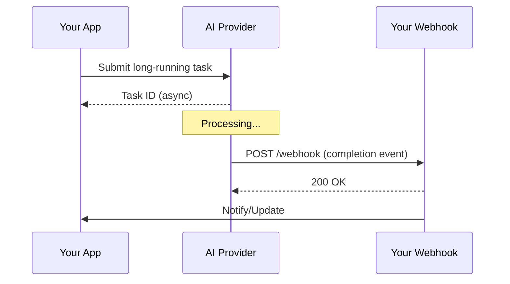

# Webhook Patterns for AI

## Introduction

Webhooks enable event-driven architectures for AI applications, allowing your system to react to events rather than constantly polling for updates. This lesson covers webhook fundamentals, security, and practical patterns for AI operations.

### What We'll Cover

This lesson is organized into the following topics:

| File | Topic | Description |
|------|-------|-------------|
| [01-webhook-fundamentals.md](./01-webhook-fundamentals.md) | Webhook Fundamentals | Push vs pull, endpoints, event types |
| [02-async-ai-operations.md](./02-async-ai-operations.md) | Async AI Operations | Long-running tasks, batch completion, status updates |
| [03-webhook-security.md](./03-webhook-security.md) | Webhook Security | HMAC signatures, timestamp validation, secret rotation |
| [04-retry-handling.md](./04-retry-handling.md) | Retry Handling | Idempotency, duplicate detection, dead letter queues |
| [05-webhook-debugging.md](./05-webhook-debugging.md) | Webhook Debugging | Logging, testing tools, local tunnels |
| [06-openai-webhooks-api.md](./06-openai-webhooks-api.md) | OpenAI Webhooks API | Event registration, background mode, Realtime API |

### Prerequisites

- HTTP request/response fundamentals
- Basic server development (Flask/Express)
- Understanding of asynchronous operations
- Previous lessons on batch processing

---

## Webhook Architecture Overview



### Push vs Pull

| Pattern | Mechanism | Best For |
|---------|-----------|----------|
| **Polling** | Client checks status repeatedly | Simple, no webhook infrastructure |
| **Webhooks** | Server pushes events to you | Efficient, real-time updates |
| **Hybrid** | Webhooks with polling fallback | Maximum reliability |

### When to Use Webhooks

✅ **Use webhooks when:**
- Processing takes more than a few seconds
- You need immediate notification of completion
- Multiple systems need to react to events
- You want to reduce API calls (and costs)

❌ **Skip webhooks when:**
- Operations complete in under 1-2 seconds
- You can't expose public endpoints
- Webhook infrastructure would add too much complexity

---

## AI Provider Webhook Support

| Provider | Webhook Support | Use Cases |
|----------|-----------------|-----------|
| OpenAI | Emerging (2024+) | Background completions, Realtime API |
| Anthropic | Batch status | Batch job completion |
| Google | Cloud Pub/Sub | Vertex AI job events |
| Replicate | Webhooks | Model prediction completion |
| Hugging Face | Webhooks | Inference Endpoints |

---

## Quick Start: Minimal Webhook Server

```python
from flask import Flask, request, jsonify
import hashlib
import hmac

app = Flask(__name__)
WEBHOOK_SECRET = "your-webhook-secret"

@app.route("/webhook/ai", methods=["POST"])
def handle_webhook():
    """Minimal webhook handler."""
    
    # 1. Verify signature
    signature = request.headers.get("X-Webhook-Signature")
    payload = request.data
    
    expected = hmac.new(
        WEBHOOK_SECRET.encode(),
        payload,
        hashlib.sha256
    ).hexdigest()
    
    if not hmac.compare_digest(signature or "", f"sha256={expected}"):
        return jsonify({"error": "Invalid signature"}), 401
    
    # 2. Parse event
    event = request.json
    event_type = event.get("type")
    
    # 3. Handle event
    if event_type == "completion.finished":
        handle_completion(event["data"])
    elif event_type == "batch.completed":
        handle_batch(event["data"])
    else:
        print(f"Unknown event: {event_type}")
    
    # 4. Always return 200 quickly
    return jsonify({"received": True})


def handle_completion(data):
    """Process completion event."""
    print(f"Completion: {data['id']}")
    # Queue for background processing


def handle_batch(data):
    """Process batch completion event."""
    print(f"Batch: {data['batch_id']} - {data['status']}")
    # Download and process results


if __name__ == "__main__":
    app.run(port=8000)
```

---

## Learning Path

1. **[Webhook Fundamentals](./01-webhook-fundamentals.md)** — Core concepts and architecture
2. **[Async AI Operations](./02-async-ai-operations.md)** — Using webhooks for AI workloads
3. **[Webhook Security](./03-webhook-security.md)** — Securing webhook endpoints
4. **[Retry Handling](./04-retry-handling.md)** — Handling failures and duplicates
5. **[Webhook Debugging](./05-webhook-debugging.md)** — Testing and troubleshooting
6. **[OpenAI Webhooks API](./06-openai-webhooks-api.md)** — OpenAI-specific patterns

---

## Summary

✅ Webhooks enable push-based event-driven architecture  
✅ Essential for long-running AI operations  
✅ Require proper security and retry handling  
✅ Provider support is evolving rapidly

**Next:** [Webhook Fundamentals](./01-webhook-fundamentals.md)

---

## Further Reading

- [Webhook.site](https://webhook.site/) — Test webhook endpoints
- [ngrok](https://ngrok.com/) — Local webhook tunnels
- [Svix](https://www.svix.com/) — Webhook infrastructure

<!-- 
Sources Consulted:
- OpenAI API docs: https://platform.openai.com/docs
- Webhook best practices: https://hookdeck.com/webhooks/guides/webhook-best-practices
-->
