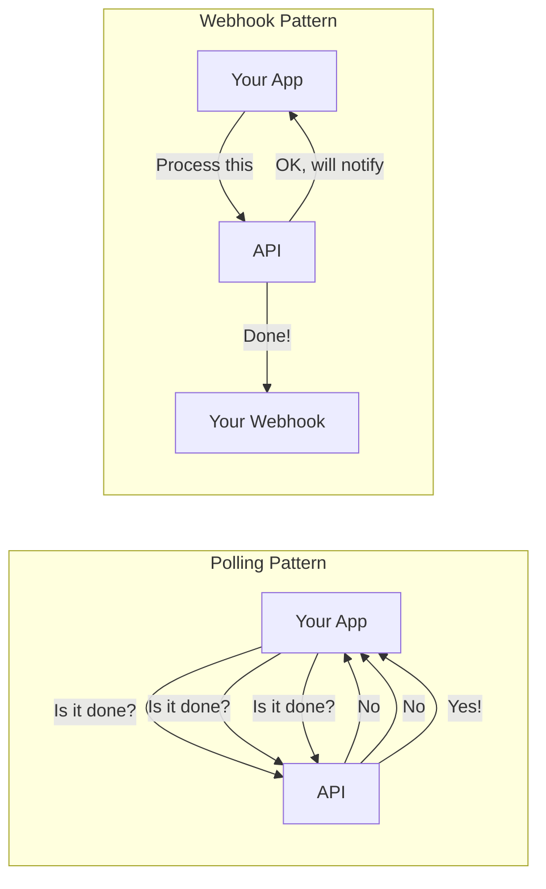

# Webhook Fundamentals

## Introduction

Webhooks are HTTP callbacks that deliver data to your application when events occur. Instead of constantly polling an API to check for updates, webhooks push information to you in real-time.

### What We'll Cover

- What are webhooks
- Push vs pull patterns
- Webhook endpoints
- Event types and payloads

### Prerequisites

- HTTP request/response understanding
- Basic server development
- URL routing concepts

---

## What Are Webhooks?



A webhook is simply an HTTP POST request sent from a service to your server when something happens. Think of it as a "reverse API call" — instead of you calling them, they call you.

### Key Characteristics

| Characteristic | Description |
|----------------|-------------|
| **Push-based** | Data is sent to you automatically |
| **Event-driven** | Triggered by specific events |
| **HTTP POST** | Almost always uses POST method |
| **Asynchronous** | Decoupled from the original request |
| **One-way** | Response is just acknowledgment (2xx) |

---

## Push vs Pull Patterns

### Polling (Pull)

```python
import time
import requests

def poll_for_completion(task_id: str, timeout: float = 300.0):
    """Poll API until task completes."""
    
    start = time.time()
    
    while True:
        response = requests.get(
            f"https://api.example.com/tasks/{task_id}"
        )
        status = response.json()["status"]
        
        if status == "completed":
            return response.json()
        
        if status == "failed":
            raise RuntimeError("Task failed")
        
        if time.time() - start > timeout:
            raise TimeoutError("Polling timeout")
        
        # Wait before next check
        time.sleep(5)  # 5 seconds between polls
```

**Problems with polling:**
- Wastes API calls (and money)
- Delays between polls mean delayed detection
- More frequent polls = more load on both sides
- Doesn't scale well with many concurrent tasks

### Webhooks (Push)

```python
from flask import Flask, request

app = Flask(__name__)

@app.route("/webhook/task-complete", methods=["POST"])
def handle_task_complete():
    """Receive completion notification."""
    
    event = request.json
    task_id = event["task_id"]
    result = event["result"]
    
    # Process immediately upon completion
    process_result(task_id, result)
    
    return "", 200
```

**Advantages:**
- Immediate notification
- No wasted API calls
- Scales to millions of events
- Lower latency

### Hybrid Approach

```python
class HybridTaskTracker:
    """Combine webhooks with polling fallback."""
    
    def __init__(self, webhook_url: str):
        self.webhook_url = webhook_url
        self.pending_tasks = {}
    
    def submit_task(self, task_data: dict) -> str:
        """Submit with webhook callback."""
        
        response = requests.post(
            "https://api.example.com/tasks",
            json={
                "data": task_data,
                "webhook_url": self.webhook_url
            }
        )
        
        task_id = response.json()["task_id"]
        self.pending_tasks[task_id] = {
            "submitted_at": time.time(),
            "status": "pending"
        }
        
        return task_id
    
    def check_stale_tasks(self, max_wait: float = 300.0):
        """Poll for tasks that haven't received webhooks."""
        
        now = time.time()
        
        for task_id, info in list(self.pending_tasks.items()):
            if info["status"] != "pending":
                continue
            
            if now - info["submitted_at"] > max_wait:
                # Webhook might have failed - poll directly
                self._poll_task(task_id)
    
    def handle_webhook(self, event: dict):
        """Handle webhook notification."""
        
        task_id = event["task_id"]
        
        if task_id in self.pending_tasks:
            self.pending_tasks[task_id]["status"] = event["status"]
            self._process_completion(task_id, event)
```

---

## Webhook Endpoints

### Endpoint Design

```python
from flask import Flask, request, jsonify
from functools import wraps

app = Flask(__name__)

# 1. Single endpoint with event routing
@app.route("/webhooks/ai", methods=["POST"])
def unified_webhook():
    """Handle all AI-related webhooks."""
    
    event = request.json
    event_type = event.get("type")
    
    handlers = {
        "completion.finished": handle_completion,
        "batch.completed": handle_batch,
        "job.failed": handle_failure,
        "usage.alert": handle_usage_alert
    }
    
    handler = handlers.get(event_type)
    if handler:
        handler(event["data"])
    else:
        print(f"Unknown event type: {event_type}")
    
    return jsonify({"received": True})


# 2. Separate endpoints per event type
@app.route("/webhooks/completions", methods=["POST"])
def completion_webhook():
    """Handle only completion events."""
    
    event = request.json
    handle_completion(event)
    return "", 200


@app.route("/webhooks/batches", methods=["POST"])
def batch_webhook():
    """Handle only batch events."""
    
    event = request.json
    handle_batch(event)
    return "", 200


# 3. Versioned endpoints
@app.route("/v1/webhooks/<event_type>", methods=["POST"])
def versioned_webhook(event_type: str):
    """Versioned webhook with event type in URL."""
    
    event = request.json
    
    # Route by URL path
    if event_type == "completions":
        handle_completion(event)
    elif event_type == "batches":
        handle_batch(event)
    
    return "", 200
```

### Endpoint Best Practices

| Practice | Reason |
|----------|--------|
| Use HTTPS only | Security |
| Return 2xx quickly | Prevent timeouts |
| Use descriptive paths | Easy to understand |
| Version your endpoints | Future compatibility |
| Accept POST only | Security, proper method |
| Validate content-type | Prevent injection |

---

## Event Types and Payloads

### Standard Event Structure

```python
from dataclasses import dataclass
from datetime import datetime
from typing import Any, Dict, Optional

@dataclass
class WebhookEvent:
    """Standard webhook event structure."""
    
    id: str  # Unique event ID
    type: str  # Event type
    created_at: datetime  # When event occurred
    data: Dict[str, Any]  # Event-specific data
    
    # Optional metadata
    api_version: Optional[str] = None
    source: Optional[str] = None


# Example event types for AI applications
EVENT_TYPES = {
    # Completion events
    "completion.started": "Completion request started processing",
    "completion.streaming": "Streaming chunks available",
    "completion.finished": "Completion request finished",
    "completion.failed": "Completion request failed",
    
    # Batch events
    "batch.created": "Batch job created",
    "batch.processing": "Batch processing started",
    "batch.completed": "Batch job completed",
    "batch.failed": "Batch job failed",
    "batch.cancelled": "Batch job cancelled",
    
    # Usage events
    "usage.limit_warning": "Approaching usage limit",
    "usage.limit_exceeded": "Usage limit exceeded",
    
    # Model events
    "model.deprecated": "Model being deprecated",
    "model.updated": "Model version updated"
}
```

### Event Payload Examples

```python
# Completion finished event
completion_event = {
    "id": "evt_abc123",
    "type": "completion.finished",
    "created_at": "2025-01-15T10:30:00Z",
    "api_version": "2025-01-01",
    "data": {
        "completion_id": "cmpl_xyz789",
        "model": "gpt-4o",
        "prompt_tokens": 150,
        "completion_tokens": 500,
        "total_tokens": 650,
        "finish_reason": "stop",
        "content": "The response content...",
        "request_id": "req_custom_001"
    }
}

# Batch completed event
batch_event = {
    "id": "evt_def456",
    "type": "batch.completed",
    "created_at": "2025-01-15T12:45:00Z",
    "api_version": "2025-01-01",
    "data": {
        "batch_id": "batch_abc123",
        "status": "completed",
        "total_requests": 1000,
        "completed": 995,
        "failed": 5,
        "output_file_id": "file-output-xyz",
        "error_file_id": "file-error-xyz",
        "processing_time_seconds": 3600
    }
}

# Usage alert event
usage_event = {
    "id": "evt_ghi789",
    "type": "usage.limit_warning",
    "created_at": "2025-01-15T14:00:00Z",
    "data": {
        "metric": "tokens",
        "current_usage": 950000,
        "limit": 1000000,
        "percentage": 95,
        "reset_at": "2025-02-01T00:00:00Z"
    }
}
```

### Parsing Events

```python
from pydantic import BaseModel, Field
from datetime import datetime
from typing import Union, Literal

class CompletionFinishedData(BaseModel):
    """Data for completion.finished event."""
    
    completion_id: str
    model: str
    prompt_tokens: int
    completion_tokens: int
    total_tokens: int
    finish_reason: str
    content: str
    request_id: str


class BatchCompletedData(BaseModel):
    """Data for batch.completed event."""
    
    batch_id: str
    status: str
    total_requests: int
    completed: int
    failed: int
    output_file_id: str
    error_file_id: str | None = None
    processing_time_seconds: int


class WebhookEventBase(BaseModel):
    """Base webhook event."""
    
    id: str
    type: str
    created_at: datetime
    api_version: str = "2025-01-01"


class CompletionFinishedEvent(WebhookEventBase):
    """Completion finished event."""
    
    type: Literal["completion.finished"] = "completion.finished"
    data: CompletionFinishedData


class BatchCompletedEvent(WebhookEventBase):
    """Batch completed event."""
    
    type: Literal["batch.completed"] = "batch.completed"
    data: BatchCompletedData


def parse_event(payload: dict) -> WebhookEventBase:
    """Parse webhook payload into typed event."""
    
    event_type = payload.get("type")
    
    parsers = {
        "completion.finished": CompletionFinishedEvent,
        "batch.completed": BatchCompletedEvent
    }
    
    parser = parsers.get(event_type)
    
    if parser:
        return parser.model_validate(payload)
    
    # Unknown event type - return base
    return WebhookEventBase.model_validate(payload)


# Usage
event = parse_event(completion_event)

if isinstance(event, CompletionFinishedEvent):
    print(f"Completion: {event.data.completion_id}")
    print(f"Tokens: {event.data.total_tokens}")
elif isinstance(event, BatchCompletedEvent):
    print(f"Batch: {event.data.batch_id}")
    print(f"Completed: {event.data.completed}/{event.data.total_requests}")
```

---

## Registering Webhooks

```python
import requests

class WebhookRegistration:
    """Register webhooks with providers."""
    
    def __init__(self, api_key: str, base_url: str):
        self.api_key = api_key
        self.base_url = base_url
    
    def register(
        self,
        endpoint_url: str,
        events: list[str],
        secret: str = None
    ) -> dict:
        """Register a webhook endpoint."""
        
        response = requests.post(
            f"{self.base_url}/webhooks",
            headers={"Authorization": f"Bearer {self.api_key}"},
            json={
                "url": endpoint_url,
                "events": events,
                "secret": secret
            }
        )
        
        response.raise_for_status()
        return response.json()
    
    def list_webhooks(self) -> list:
        """List registered webhooks."""
        
        response = requests.get(
            f"{self.base_url}/webhooks",
            headers={"Authorization": f"Bearer {self.api_key}"}
        )
        
        return response.json()["webhooks"]
    
    def update(self, webhook_id: str, **updates) -> dict:
        """Update webhook configuration."""
        
        response = requests.patch(
            f"{self.base_url}/webhooks/{webhook_id}",
            headers={"Authorization": f"Bearer {self.api_key}"},
            json=updates
        )
        
        return response.json()
    
    def delete(self, webhook_id: str) -> bool:
        """Delete a webhook."""
        
        response = requests.delete(
            f"{self.base_url}/webhooks/{webhook_id}",
            headers={"Authorization": f"Bearer {self.api_key}"}
        )
        
        return response.status_code == 204


# Usage example
registration = WebhookRegistration(
    api_key="sk-...",
    base_url="https://api.example.com/v1"
)

# Register for specific events
webhook = registration.register(
    endpoint_url="https://myapp.com/webhooks/ai",
    events=["completion.finished", "batch.completed"],
    secret="whsec_my_secret_key"
)

print(f"Registered webhook: {webhook['id']}")
```

---

## Hands-on Exercise

### Your Task

Build a webhook event router with type-safe handlers.

### Requirements

1. Parse incoming events into typed objects
2. Route to appropriate handlers by event type
3. Log unhandled event types
4. Track event processing metrics

### Expected Result

```python
router = WebhookRouter()

@router.on("completion.finished")
def handle_completion(event: CompletionFinishedEvent):
    print(f"Got completion: {event.data.completion_id}")

@router.on("batch.completed")
def handle_batch(event: BatchCompletedEvent):
    print(f"Got batch: {event.data.batch_id}")

# In your Flask app
@app.route("/webhook", methods=["POST"])
def webhook():
    router.handle(request.json)
    return "", 200
```

<details>
<summary>💡 Hints</summary>

- Use a decorator pattern for registering handlers
- Store handlers in a dictionary
- Parse events before passing to handlers
</details>

<details>
<summary>✅ Solution</summary>

```python
from typing import Callable, Dict, Type
from dataclasses import dataclass, field
from datetime import datetime
import time

@dataclass
class RouterMetrics:
    """Track webhook processing metrics."""
    
    events_received: int = 0
    events_processed: int = 0
    events_failed: int = 0
    unhandled_events: int = 0
    processing_times: list = field(default_factory=list)
    
    @property
    def avg_processing_time_ms(self) -> float:
        if not self.processing_times:
            return 0
        return sum(self.processing_times) / len(self.processing_times)


class WebhookRouter:
    """Type-safe webhook event router."""
    
    def __init__(self):
        self.handlers: Dict[str, Callable] = {}
        self.parsers: Dict[str, Type] = {}
        self.metrics = RouterMetrics()
        self.unhandled_log: list = []
    
    def on(self, event_type: str, parser: Type = None):
        """Decorator to register event handler."""
        
        def decorator(func: Callable) -> Callable:
            self.handlers[event_type] = func
            
            if parser:
                self.parsers[event_type] = parser
            
            return func
        
        return decorator
    
    def register(
        self,
        event_type: str,
        handler: Callable,
        parser: Type = None
    ):
        """Programmatic handler registration."""
        
        self.handlers[event_type] = handler
        
        if parser:
            self.parsers[event_type] = parser
    
    def handle(self, payload: dict) -> bool:
        """Handle incoming webhook event."""
        
        self.metrics.events_received += 1
        start_time = time.time()
        
        try:
            event_type = payload.get("type")
            
            if not event_type:
                print("Invalid payload: missing 'type'")
                self.metrics.events_failed += 1
                return False
            
            handler = self.handlers.get(event_type)
            
            if not handler:
                self._log_unhandled(event_type, payload)
                self.metrics.unhandled_events += 1
                return False
            
            # Parse event if parser is registered
            parser = self.parsers.get(event_type)
            if parser:
                try:
                    event = parser.model_validate(payload)
                except Exception as e:
                    print(f"Parse error for {event_type}: {e}")
                    self.metrics.events_failed += 1
                    return False
            else:
                event = payload
            
            # Call handler
            handler(event)
            
            self.metrics.events_processed += 1
            processing_time = (time.time() - start_time) * 1000
            self.metrics.processing_times.append(processing_time)
            
            return True
        
        except Exception as e:
            print(f"Handler error: {e}")
            self.metrics.events_failed += 1
            return False
    
    def _log_unhandled(self, event_type: str, payload: dict):
        """Log unhandled event types."""
        
        self.unhandled_log.append({
            "type": event_type,
            "received_at": datetime.now().isoformat(),
            "payload_keys": list(payload.keys())
        })
        
        print(f"Unhandled event type: {event_type}")
    
    def get_metrics(self) -> dict:
        """Get processing metrics."""
        
        return {
            "events_received": self.metrics.events_received,
            "events_processed": self.metrics.events_processed,
            "events_failed": self.metrics.events_failed,
            "unhandled_events": self.metrics.unhandled_events,
            "avg_processing_time_ms": self.metrics.avg_processing_time_ms,
            "registered_handlers": list(self.handlers.keys())
        }


# Usage
router = WebhookRouter()

# Register with decorator
@router.on("completion.finished", parser=CompletionFinishedEvent)
def handle_completion(event: CompletionFinishedEvent):
    print(f"Completion received: {event.data.completion_id}")
    print(f"Tokens used: {event.data.total_tokens}")


@router.on("batch.completed", parser=BatchCompletedEvent)
def handle_batch(event: BatchCompletedEvent):
    print(f"Batch completed: {event.data.batch_id}")
    print(f"Success: {event.data.completed}/{event.data.total_requests}")


# Flask integration
from flask import Flask, request

app = Flask(__name__)

@app.route("/webhook", methods=["POST"])
def webhook_endpoint():
    router.handle(request.json)
    return "", 200


@app.route("/webhook/metrics", methods=["GET"])
def metrics_endpoint():
    return router.get_metrics()


# Test
router.handle(completion_event)
router.handle(batch_event)
router.handle({"type": "unknown.event", "data": {}})

print(router.get_metrics())
```

</details>

---

## Summary

✅ Webhooks push events to your application  
✅ More efficient than polling for async operations  
✅ Design clear endpoints with proper routing  
✅ Use typed event parsing for safety  
✅ Hybrid approach provides reliability

**Next:** [Async AI Operations](./02-async-ai-operations.md)

---

## Further Reading

- [Webhook.site](https://webhook.site/) — Test webhooks online
- [RequestBin](https://requestbin.com/) — Inspect webhook payloads
- [Webhooks Guide](https://hookdeck.com/webhooks/guides/what-are-webhooks) — Comprehensive guide

<!-- 
Sources Consulted:
- Hookdeck webhooks guide: https://hookdeck.com/webhooks/guides/what-are-webhooks
- Stripe webhooks: https://stripe.com/docs/webhooks
-->
