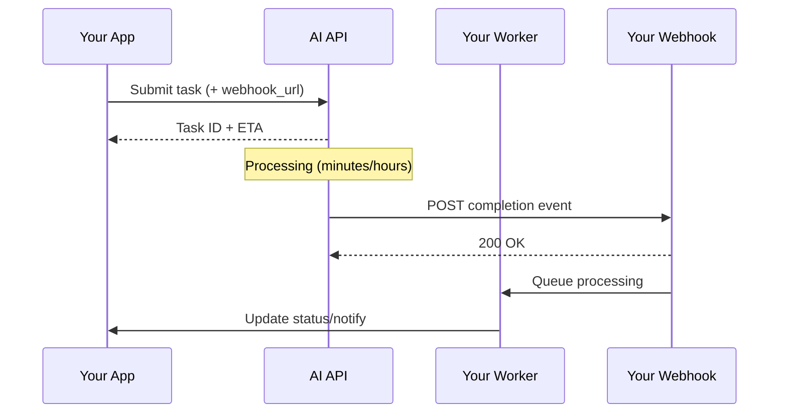

# Async AI Operations with Webhooks

## Introduction

AI operations often take too long for synchronous request-response patterns. Webhooks enable efficient handling of long-running tasks, batch completions, and real-time status updates without wasteful polling.

### What We'll Cover

- Long-running task completion
- Job status updates
- Batch completion notifications
- Real-time event streaming

### Prerequisites

- Webhook fundamentals
- Async programming concepts
- AI batch processing basics

---

## Long-Running Task Pattern



### Implementation

```python
from dataclasses import dataclass
from typing import Optional, Callable
from datetime import datetime
import uuid
import requests

@dataclass
class Task:
    """Represents a long-running AI task."""
    
    id: str
    status: str  # pending, processing, completed, failed
    created_at: datetime
    completed_at: Optional[datetime] = None
    result: Optional[dict] = None
    error: Optional[str] = None
    webhook_url: Optional[str] = None


class LongRunningTaskManager:
    """Manage long-running AI tasks with webhooks."""
    
    def __init__(self, api_key: str, webhook_base_url: str):
        self.api_key = api_key
        self.webhook_base_url = webhook_base_url
        self.tasks: dict[str, Task] = {}
        self.callbacks: dict[str, Callable] = {}
    
    def submit(
        self,
        operation: str,
        payload: dict,
        on_complete: Callable[[Task], None] = None
    ) -> Task:
        """Submit a long-running task."""
        
        task_id = str(uuid.uuid4())
        
        # Generate unique webhook URL for this task
        webhook_url = f"{self.webhook_base_url}/tasks/{task_id}"
        
        # Submit to AI API
        response = requests.post(
            "https://api.ai-provider.com/v1/tasks",
            headers={"Authorization": f"Bearer {self.api_key}"},
            json={
                "operation": operation,
                "payload": payload,
                "webhook_url": webhook_url
            }
        )
        
        response.raise_for_status()
        api_task_id = response.json()["task_id"]
        
        # Create local task record
        task = Task(
            id=task_id,
            status="pending",
            created_at=datetime.now(),
            webhook_url=webhook_url
        )
        
        self.tasks[task_id] = task
        
        if on_complete:
            self.callbacks[task_id] = on_complete
        
        return task
    
    def handle_webhook(self, task_id: str, event: dict) -> bool:
        """Handle webhook notification for task."""
        
        task = self.tasks.get(task_id)
        if not task:
            print(f"Unknown task: {task_id}")
            return False
        
        event_type = event.get("type")
        
        if event_type == "task.completed":
            task.status = "completed"
            task.completed_at = datetime.now()
            task.result = event.get("result")
            
            # Call registered callback
            callback = self.callbacks.get(task_id)
            if callback:
                callback(task)
        
        elif event_type == "task.failed":
            task.status = "failed"
            task.error = event.get("error", "Unknown error")
            task.completed_at = datetime.now()
        
        elif event_type == "task.progress":
            # Update progress without changing status
            print(f"Task {task_id}: {event.get('progress', 0):.1%} complete")
        
        return True
    
    def get_status(self, task_id: str) -> Optional[Task]:
        """Get task status (fallback if webhook missed)."""
        
        return self.tasks.get(task_id)


# Flask webhook endpoint
from flask import Flask, request

app = Flask(__name__)
task_manager = LongRunningTaskManager(
    api_key="sk-...",
    webhook_base_url="https://myapp.com/webhooks"
)

@app.route("/webhooks/tasks/<task_id>", methods=["POST"])
def task_webhook(task_id: str):
    """Handle task completion webhook."""
    
    task_manager.handle_webhook(task_id, request.json)
    return "", 200


# Usage
def on_analysis_complete(task: Task):
    print(f"Analysis complete: {task.id}")
    # Process results
    save_results(task.result)
    notify_user(task.id)


task = task_manager.submit(
    operation="document_analysis",
    payload={"documents": document_list},
    on_complete=on_analysis_complete
)

print(f"Submitted task: {task.id}")
# Webhook will trigger on_analysis_complete when done
```

---

## Job Status Updates

```python
from enum import Enum
from dataclasses import dataclass, field
from typing import List
from datetime import datetime

class JobStatus(Enum):
    """Job status values."""
    
    QUEUED = "queued"
    RUNNING = "running"
    COMPLETED = "completed"
    FAILED = "failed"
    CANCELLED = "cancelled"


@dataclass
class StatusUpdate:
    """A single status update."""
    
    status: JobStatus
    timestamp: datetime
    message: str
    progress: float = 0.0
    metadata: dict = field(default_factory=dict)


@dataclass
class Job:
    """A trackable job with status history."""
    
    id: str
    current_status: JobStatus
    updates: List[StatusUpdate] = field(default_factory=list)
    
    def add_update(self, update: StatusUpdate):
        """Add a status update."""
        
        self.updates.append(update)
        self.current_status = update.status
    
    @property
    def duration_seconds(self) -> float:
        """Calculate job duration."""
        
        if len(self.updates) < 2:
            return 0
        
        start = self.updates[0].timestamp
        end = self.updates[-1].timestamp
        return (end - start).total_seconds()


class JobStatusTracker:
    """Track job status via webhooks."""
    
    def __init__(self):
        self.jobs: dict[str, Job] = {}
        self.status_handlers: dict[JobStatus, List[Callable]] = {}
    
    def on_status(self, status: JobStatus):
        """Decorator to register status handler."""
        
        def decorator(func: Callable):
            if status not in self.status_handlers:
                self.status_handlers[status] = []
            self.status_handlers[status].append(func)
            return func
        
        return decorator
    
    def create_job(self, job_id: str) -> Job:
        """Create a new job to track."""
        
        job = Job(
            id=job_id,
            current_status=JobStatus.QUEUED
        )
        self.jobs[job_id] = job
        return job
    
    def handle_status_webhook(self, event: dict):
        """Handle status update webhook."""
        
        job_id = event.get("job_id")
        job = self.jobs.get(job_id)
        
        if not job:
            # Create if not exists
            job = self.create_job(job_id)
        
        # Parse update
        status = JobStatus(event.get("status"))
        update = StatusUpdate(
            status=status,
            timestamp=datetime.fromisoformat(event.get("timestamp")),
            message=event.get("message", ""),
            progress=event.get("progress", 0.0),
            metadata=event.get("metadata", {})
        )
        
        job.add_update(update)
        
        # Call registered handlers
        handlers = self.status_handlers.get(status, [])
        for handler in handlers:
            try:
                handler(job, update)
            except Exception as e:
                print(f"Handler error: {e}")
    
    def get_job_summary(self, job_id: str) -> dict:
        """Get job summary."""
        
        job = self.jobs.get(job_id)
        if not job:
            return None
        
        return {
            "id": job.id,
            "status": job.current_status.value,
            "updates": len(job.updates),
            "duration_seconds": job.duration_seconds,
            "last_update": job.updates[-1].message if job.updates else None
        }


# Usage
tracker = JobStatusTracker()

@tracker.on_status(JobStatus.RUNNING)
def on_running(job: Job, update: StatusUpdate):
    print(f"Job {job.id} started running")
    print(f"Progress: {update.progress:.1%}")


@tracker.on_status(JobStatus.COMPLETED)
def on_completed(job: Job, update: StatusUpdate):
    print(f"Job {job.id} completed in {job.duration_seconds:.1f}s")
    process_job_results(job.id)


@tracker.on_status(JobStatus.FAILED)
def on_failed(job: Job, update: StatusUpdate):
    print(f"Job {job.id} failed: {update.message}")
    send_alert(job.id, update.message)


# Webhook endpoint
@app.route("/webhooks/job-status", methods=["POST"])
def job_status_webhook():
    tracker.handle_status_webhook(request.json)
    return "", 200
```

---

## Batch Completion Notifications

```python
from dataclasses import dataclass
from typing import Optional, List
import threading

@dataclass
class BatchCompletion:
    """Batch job completion data."""
    
    batch_id: str
    status: str
    total_requests: int
    completed: int
    failed: int
    output_file_id: Optional[str]
    error_file_id: Optional[str]
    processing_time_seconds: int


class BatchWebhookHandler:
    """Handle batch completion webhooks."""
    
    def __init__(self, openai_client):
        self.client = openai_client
        self.pending_batches: dict[str, dict] = {}
        self.completion_events: dict[str, threading.Event] = {}
    
    def register_batch(
        self,
        batch_id: str,
        metadata: dict = None
    ):
        """Register batch for webhook notification."""
        
        self.pending_batches[batch_id] = {
            "registered_at": datetime.now(),
            "metadata": metadata or {}
        }
        self.completion_events[batch_id] = threading.Event()
    
    def handle_completion(self, event: dict) -> BatchCompletion:
        """Handle batch completion webhook."""
        
        data = event.get("data", {})
        batch_id = data.get("batch_id")
        
        completion = BatchCompletion(
            batch_id=batch_id,
            status=data.get("status"),
            total_requests=data.get("total_requests", 0),
            completed=data.get("completed", 0),
            failed=data.get("failed", 0),
            output_file_id=data.get("output_file_id"),
            error_file_id=data.get("error_file_id"),
            processing_time_seconds=data.get("processing_time_seconds", 0)
        )
        
        # Notify waiting threads
        if batch_id in self.completion_events:
            self.completion_events[batch_id].set()
        
        # Process results
        self._process_batch_results(completion)
        
        return completion
    
    def _process_batch_results(self, completion: BatchCompletion):
        """Process completed batch results."""
        
        if completion.status != "completed":
            print(f"Batch {completion.batch_id} failed: {completion.status}")
            return
        
        print(f"Batch {completion.batch_id} completed:")
        print(f"  Total: {completion.total_requests}")
        print(f"  Succeeded: {completion.completed}")
        print(f"  Failed: {completion.failed}")
        print(f"  Time: {completion.processing_time_seconds}s")
        
        # Download results
        if completion.output_file_id:
            self._download_and_process(completion)
    
    def _download_and_process(self, completion: BatchCompletion):
        """Download and process batch results."""
        
        # Download output file
        content = self.client.files.content(
            completion.output_file_id
        ).text
        
        # Parse and save results
        import json
        for line in content.strip().split('\n'):
            result = json.loads(line)
            # Process each result
            save_result(result)
        
        # Clean up
        self.client.files.delete(completion.output_file_id)
        
        if completion.error_file_id:
            self.client.files.delete(completion.error_file_id)
    
    def wait_for_batch(
        self,
        batch_id: str,
        timeout: float = None
    ) -> bool:
        """Wait for batch completion (blocking)."""
        
        event = self.completion_events.get(batch_id)
        if not event:
            return False
        
        return event.wait(timeout=timeout)


# Flask integration
from openai import OpenAI

client = OpenAI()
batch_handler = BatchWebhookHandler(client)

@app.route("/webhooks/batch", methods=["POST"])
def batch_webhook():
    """Handle batch completion webhook."""
    
    event = request.json
    
    if event.get("type") == "batch.completed":
        batch_handler.handle_completion(event)
    
    return "", 200


# Usage
# When submitting a batch
batch = client.batches.create(
    input_file_id="file-abc123",
    endpoint="/v1/chat/completions",
    completion_window="24h"
)

# Register for webhook notification
batch_handler.register_batch(
    batch.id,
    metadata={"project": "summarization"}
)

# Later, in webhook, results are automatically processed
```

---

## Real-Time Event Streaming

```python
import asyncio
from typing import AsyncGenerator, List
from dataclasses import dataclass
import json

@dataclass
class StreamEvent:
    """A real-time stream event."""
    
    event_type: str
    data: dict
    timestamp: datetime


class WebhookEventStream:
    """Stream events via webhooks to connected clients."""
    
    def __init__(self):
        self.subscribers: dict[str, asyncio.Queue] = {}
        self.event_buffer: List[StreamEvent] = []
        self.buffer_size = 1000
    
    async def subscribe(self, client_id: str) -> asyncio.Queue:
        """Subscribe to event stream."""
        
        queue = asyncio.Queue(maxsize=100)
        self.subscribers[client_id] = queue
        
        return queue
    
    def unsubscribe(self, client_id: str):
        """Unsubscribe from event stream."""
        
        if client_id in self.subscribers:
            del self.subscribers[client_id]
    
    async def publish(self, event: StreamEvent):
        """Publish event to all subscribers."""
        
        # Buffer event
        self.event_buffer.append(event)
        if len(self.event_buffer) > self.buffer_size:
            self.event_buffer.pop(0)
        
        # Send to all subscribers
        for client_id, queue in list(self.subscribers.items()):
            try:
                # Non-blocking put
                queue.put_nowait(event)
            except asyncio.QueueFull:
                print(f"Queue full for {client_id}")
    
    def handle_webhook(self, payload: dict):
        """Handle incoming webhook and stream."""
        
        event = StreamEvent(
            event_type=payload.get("type", "unknown"),
            data=payload.get("data", {}),
            timestamp=datetime.now()
        )
        
        # Create task to publish
        asyncio.create_task(self.publish(event))


# Server-Sent Events endpoint
from flask import Response

event_stream = WebhookEventStream()

@app.route("/webhooks/realtime", methods=["POST"])
def realtime_webhook():
    """Receive webhook and stream to clients."""
    
    event_stream.handle_webhook(request.json)
    return "", 200


@app.route("/events/stream")
def stream_events():
    """SSE endpoint for clients."""
    
    def generate():
        client_id = str(uuid.uuid4())
        
        # Create sync wrapper for async queue
        import queue
        sync_queue = queue.Queue()
        
        # This is simplified - in production use async framework
        yield f"data: {json.dumps({'connected': True})}\n\n"
        
        while True:
            try:
                # Would use async in production
                event = sync_queue.get(timeout=30)
                yield f"data: {json.dumps({'type': event.event_type, 'data': event.data})}\n\n"
            except queue.Empty:
                yield ": keepalive\n\n"
    
    return Response(
        generate(),
        mimetype='text/event-stream',
        headers={
            'Cache-Control': 'no-cache',
            'Connection': 'keep-alive'
        }
    )
```

---

## Webhook-Driven Workflow

```python
from enum import Enum
from typing import Callable, Dict, List

class WorkflowStep(Enum):
    """Workflow steps."""
    
    UPLOAD = "upload"
    PROCESS = "process"
    ANALYZE = "analyze"
    NOTIFY = "notify"
    COMPLETE = "complete"


@dataclass
class Workflow:
    """A multi-step workflow."""
    
    id: str
    current_step: WorkflowStep
    context: dict
    completed_steps: List[WorkflowStep] = field(default_factory=list)


class WebhookDrivenWorkflow:
    """Execute workflows driven by webhooks."""
    
    def __init__(self):
        self.workflows: Dict[str, Workflow] = {}
        self.step_handlers: Dict[WorkflowStep, Callable] = {}
        self.transitions: Dict[WorkflowStep, WorkflowStep] = {
            WorkflowStep.UPLOAD: WorkflowStep.PROCESS,
            WorkflowStep.PROCESS: WorkflowStep.ANALYZE,
            WorkflowStep.ANALYZE: WorkflowStep.NOTIFY,
            WorkflowStep.NOTIFY: WorkflowStep.COMPLETE
        }
    
    def register_step(self, step: WorkflowStep):
        """Decorator to register step handler."""
        
        def decorator(func: Callable):
            self.step_handlers[step] = func
            return func
        
        return decorator
    
    def start_workflow(
        self,
        workflow_id: str,
        initial_context: dict
    ) -> Workflow:
        """Start a new workflow."""
        
        workflow = Workflow(
            id=workflow_id,
            current_step=WorkflowStep.UPLOAD,
            context=initial_context
        )
        
        self.workflows[workflow_id] = workflow
        
        # Execute first step
        self._execute_step(workflow)
        
        return workflow
    
    def handle_step_complete(self, event: dict):
        """Handle webhook indicating step completion."""
        
        workflow_id = event.get("workflow_id")
        workflow = self.workflows.get(workflow_id)
        
        if not workflow:
            print(f"Unknown workflow: {workflow_id}")
            return
        
        # Update context with step results
        workflow.context.update(event.get("result", {}))
        workflow.completed_steps.append(workflow.current_step)
        
        # Transition to next step
        next_step = self.transitions.get(workflow.current_step)
        
        if next_step:
            workflow.current_step = next_step
            self._execute_step(workflow)
        else:
            print(f"Workflow {workflow_id} complete!")
    
    def _execute_step(self, workflow: Workflow):
        """Execute current workflow step."""
        
        handler = self.step_handlers.get(workflow.current_step)
        
        if handler:
            try:
                handler(workflow)
            except Exception as e:
                print(f"Step failed: {e}")
        else:
            print(f"No handler for step: {workflow.current_step}")


# Define workflow
workflow_manager = WebhookDrivenWorkflow()

@workflow_manager.register_step(WorkflowStep.UPLOAD)
def upload_step(workflow: Workflow):
    """Upload documents for processing."""
    
    # Submit upload job with webhook callback
    submit_upload_job(
        documents=workflow.context["documents"],
        webhook_url=f"/webhooks/workflow/{workflow.id}"
    )


@workflow_manager.register_step(WorkflowStep.PROCESS)
def process_step(workflow: Workflow):
    """Process uploaded documents."""
    
    submit_processing_job(
        file_ids=workflow.context["uploaded_files"],
        webhook_url=f"/webhooks/workflow/{workflow.id}"
    )


@workflow_manager.register_step(WorkflowStep.ANALYZE)
def analyze_step(workflow: Workflow):
    """Analyze processed documents with AI."""
    
    submit_analysis_batch(
        processed_data=workflow.context["processed_data"],
        webhook_url=f"/webhooks/workflow/{workflow.id}"
    )


@workflow_manager.register_step(WorkflowStep.NOTIFY)
def notify_step(workflow: Workflow):
    """Notify users of completion."""
    
    send_notification(
        user_id=workflow.context["user_id"],
        results=workflow.context["analysis_results"]
    )
    
    # Notify webhook immediately (no async needed)
    workflow_manager.handle_step_complete({
        "workflow_id": workflow.id,
        "result": {"notification_sent": True}
    })


# Webhook endpoint
@app.route("/webhooks/workflow/<workflow_id>", methods=["POST"])
def workflow_webhook(workflow_id: str):
    """Handle workflow step completion."""
    
    event = request.json
    event["workflow_id"] = workflow_id
    
    workflow_manager.handle_step_complete(event)
    return "", 200


# Start workflow
workflow = workflow_manager.start_workflow(
    "wf-001",
    {
        "user_id": "user-123",
        "documents": document_list
    }
)
# Webhook events drive the workflow forward
```

---

## Hands-on Exercise

### Your Task

Build a progress tracker that aggregates webhook events for a multi-document AI analysis job.

### Requirements

1. Track progress across multiple documents
2. Aggregate updates from parallel processing
3. Calculate overall completion percentage
4. Emit progress events to clients

### Expected Result

```python
tracker = MultiDocumentProgressTracker()

# Each document sends progress webhooks
tracker.handle_update({"doc_id": "doc1", "progress": 0.5})
tracker.handle_update({"doc_id": "doc2", "progress": 0.25})

overall = tracker.get_overall_progress()
# {"overall": 0.375, "documents": {"doc1": 0.5, "doc2": 0.25}}
```

<details>
<summary>💡 Hints</summary>

- Track progress per document
- Calculate weighted average for overall
- Handle documents completing out of order
</details>

<details>
<summary>✅ Solution</summary>

```python
from dataclasses import dataclass, field
from typing import Dict, Callable, List
from datetime import datetime
import threading

@dataclass
class DocumentProgress:
    """Progress for a single document."""
    
    doc_id: str
    progress: float = 0.0
    status: str = "pending"
    last_update: datetime = field(default_factory=datetime.now)
    metadata: dict = field(default_factory=dict)


class MultiDocumentProgressTracker:
    """Track progress across multiple documents."""
    
    def __init__(self):
        self.documents: Dict[str, DocumentProgress] = {}
        self.progress_listeners: List[Callable] = []
        self._lock = threading.Lock()
    
    def register_document(
        self,
        doc_id: str,
        metadata: dict = None
    ):
        """Register a document for tracking."""
        
        with self._lock:
            self.documents[doc_id] = DocumentProgress(
                doc_id=doc_id,
                metadata=metadata or {}
            )
    
    def register_documents(self, doc_ids: List[str]):
        """Register multiple documents."""
        
        for doc_id in doc_ids:
            self.register_document(doc_id)
    
    def on_progress(self, callback: Callable):
        """Register progress listener."""
        
        self.progress_listeners.append(callback)
    
    def handle_update(self, event: dict):
        """Handle progress webhook event."""
        
        doc_id = event.get("doc_id")
        
        with self._lock:
            if doc_id not in self.documents:
                self.register_document(doc_id)
            
            doc = self.documents[doc_id]
            doc.progress = event.get("progress", doc.progress)
            doc.status = event.get("status", doc.status)
            doc.last_update = datetime.now()
            
            if "metadata" in event:
                doc.metadata.update(event["metadata"])
        
        # Notify listeners
        overall = self.get_overall_progress()
        for listener in self.progress_listeners:
            try:
                listener(overall)
            except Exception as e:
                print(f"Listener error: {e}")
    
    def get_overall_progress(self) -> dict:
        """Calculate overall progress."""
        
        with self._lock:
            if not self.documents:
                return {
                    "overall": 0.0,
                    "documents": {},
                    "completed": 0,
                    "total": 0
                }
            
            total_progress = sum(d.progress for d in self.documents.values())
            overall = total_progress / len(self.documents)
            
            completed = sum(
                1 for d in self.documents.values() 
                if d.progress >= 1.0
            )
            
            return {
                "overall": overall,
                "documents": {
                    doc_id: {
                        "progress": doc.progress,
                        "status": doc.status,
                        "last_update": doc.last_update.isoformat()
                    }
                    for doc_id, doc in self.documents.items()
                },
                "completed": completed,
                "total": len(self.documents)
            }
    
    def is_complete(self) -> bool:
        """Check if all documents are complete."""
        
        with self._lock:
            return all(
                d.progress >= 1.0 
                for d in self.documents.values()
            )
    
    def get_stale_documents(
        self,
        threshold_seconds: float = 300
    ) -> List[str]:
        """Find documents with no recent updates."""
        
        now = datetime.now()
        stale = []
        
        with self._lock:
            for doc_id, doc in self.documents.items():
                if doc.progress < 1.0:
                    elapsed = (now - doc.last_update).total_seconds()
                    if elapsed > threshold_seconds:
                        stale.append(doc_id)
        
        return stale


# Flask integration
tracker = MultiDocumentProgressTracker()

# Listen for progress changes
@tracker.on_progress
def emit_progress(overall: dict):
    """Emit progress to connected clients via SSE."""
    
    print(f"Overall: {overall['overall']:.1%} ({overall['completed']}/{overall['total']})")


@app.route("/webhooks/document-progress", methods=["POST"])
def document_progress_webhook():
    """Handle document progress webhook."""
    
    tracker.handle_update(request.json)
    return "", 200


@app.route("/progress", methods=["GET"])
def get_progress():
    """Get current progress."""
    
    return jsonify(tracker.get_overall_progress())


# Usage
# Register documents to track
tracker.register_documents(["doc1", "doc2", "doc3", "doc4", "doc5"])

# Webhooks come in as processing progresses
tracker.handle_update({"doc_id": "doc1", "progress": 0.25, "status": "processing"})
tracker.handle_update({"doc_id": "doc3", "progress": 0.50, "status": "processing"})
tracker.handle_update({"doc_id": "doc1", "progress": 0.75, "status": "processing"})
tracker.handle_update({"doc_id": "doc2", "progress": 1.0, "status": "completed"})

print(tracker.get_overall_progress())
# {'overall': 0.4, 'documents': {...}, 'completed': 1, 'total': 5}

# Check for stale
stale = tracker.get_stale_documents(threshold_seconds=60)
print(f"Stale documents: {stale}")
```

</details>

---

## Summary

✅ Webhooks enable efficient async AI operation handling  
✅ Track job status with granular progress updates  
✅ Batch completions trigger automated result processing  
✅ Webhook-driven workflows chain complex operations  
✅ Multi-document progress requires aggregation logic

**Next:** [Webhook Security](./03-webhook-security.md)

---

## Further Reading

- [Async Patterns](https://docs.celeryq.dev/en/stable/) — Celery task queue
- [Event-Driven Architecture](https://martinfowler.com/articles/201701-event-driven.html) — Martin Fowler
- [OpenAI Background](https://platform.openai.com/docs/guides/background) — Background processing

<!-- 
Sources Consulted:
- OpenAI API docs: https://platform.openai.com/docs
- Event-driven patterns: https://martinfowler.com/articles/201701-event-driven.html
-->
