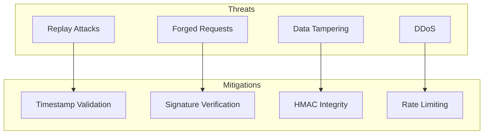
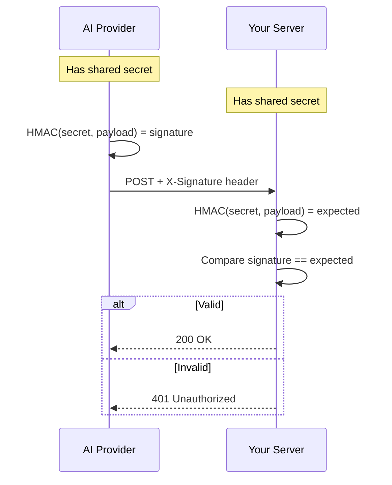

# Webhook Security

## Introduction

Webhook endpoints are public URLs that receive HTTP requests, making them potential targets for attacks. Proper security is essential to ensure only legitimate events from trusted sources are processed.

### What We'll Cover

- HMAC signature verification
- Timestamp validation
- IP allowlisting
- Secret rotation

### Prerequisites

- Cryptographic basics (hashing)
- HTTP headers understanding
- Basic security concepts

---

## Security Threat Model



| Threat | Description | Mitigation |
|--------|-------------|------------|
| **Replay Attack** | Attacker resends valid webhook | Timestamp validation |
| **Forged Request** | Attacker creates fake webhook | Signature verification |
| **Data Tampering** | Attacker modifies payload | HMAC integrity check |
| **DDoS** | Flood endpoint with requests | Rate limiting, IP filtering |

---

## HMAC Signature Verification

### How It Works



### Implementation

```python
import hmac
import hashlib
from flask import Flask, request, abort

app = Flask(__name__)

# Store securely - use environment variable
WEBHOOK_SECRET = "whsec_your_secret_key_here"

def verify_signature(payload: bytes, signature: str) -> bool:
    """Verify HMAC-SHA256 signature."""
    
    if not signature:
        return False
    
    # Compute expected signature
    expected = hmac.new(
        WEBHOOK_SECRET.encode('utf-8'),
        payload,
        hashlib.sha256
    ).hexdigest()
    
    # Handle different signature formats
    if signature.startswith("sha256="):
        signature = signature[7:]
    
    # Constant-time comparison (prevents timing attacks)
    return hmac.compare_digest(expected, signature)


@app.route("/webhook", methods=["POST"])
def webhook_endpoint():
    """Secure webhook endpoint."""
    
    # Get raw payload for signature verification
    payload = request.data
    
    # Get signature from header
    signature = request.headers.get("X-Signature-256") or \
                request.headers.get("X-Webhook-Signature")
    
    if not verify_signature(payload, signature):
        print(f"Invalid signature: {signature}")
        abort(401)
    
    # Signature valid - process event
    event = request.json
    process_event(event)
    
    return "", 200
```

### Provider-Specific Verification

```python
class SignatureVerifier:
    """Verify signatures for different providers."""
    
    def __init__(self, secrets: dict):
        self.secrets = secrets
    
    def verify_openai(
        self,
        payload: bytes,
        signature: str
    ) -> bool:
        """Verify OpenAI webhook signature."""
        
        secret = self.secrets.get("openai")
        if not secret:
            return False
        
        expected = hmac.new(
            secret.encode(),
            payload,
            hashlib.sha256
        ).hexdigest()
        
        return hmac.compare_digest(f"sha256={expected}", signature)
    
    def verify_anthropic(
        self,
        payload: bytes,
        timestamp: str,
        signature: str
    ) -> bool:
        """Verify Anthropic webhook signature."""
        
        secret = self.secrets.get("anthropic")
        if not secret:
            return False
        
        # Anthropic uses timestamp.payload format
        signed_payload = f"{timestamp}.{payload.decode()}"
        
        expected = hmac.new(
            secret.encode(),
            signed_payload.encode(),
            hashlib.sha256
        ).hexdigest()
        
        return hmac.compare_digest(expected, signature)
    
    def verify_stripe_style(
        self,
        payload: bytes,
        header: str
    ) -> bool:
        """Verify Stripe-style signature (t=timestamp,v1=sig)."""
        
        secret = self.secrets.get("stripe_style")
        if not secret or not header:
            return False
        
        # Parse header
        parts = dict(item.split("=") for item in header.split(","))
        timestamp = parts.get("t")
        signature = parts.get("v1")
        
        if not timestamp or not signature:
            return False
        
        # Verify
        signed_payload = f"{timestamp}.{payload.decode()}"
        expected = hmac.new(
            secret.encode(),
            signed_payload.encode(),
            hashlib.sha256
        ).hexdigest()
        
        return hmac.compare_digest(expected, signature)


# Usage
verifier = SignatureVerifier({
    "openai": "sk-webhook-openai-...",
    "anthropic": "sk-webhook-anthropic-...",
    "stripe_style": "whsec_..."
})

# In webhook handler
if not verifier.verify_openai(request.data, request.headers.get("X-Signature-256")):
    abort(401)
```

---

## Timestamp Validation

### Preventing Replay Attacks

```python
from datetime import datetime, timezone, timedelta

class TimestampValidator:
    """Validate webhook timestamps to prevent replay attacks."""
    
    def __init__(
        self,
        max_age_seconds: int = 300,  # 5 minutes
        allow_future_seconds: int = 60  # 1 minute clock skew
    ):
        self.max_age_seconds = max_age_seconds
        self.allow_future_seconds = allow_future_seconds
    
    def validate(self, timestamp: str | int) -> tuple[bool, str]:
        """Validate timestamp is within acceptable range."""
        
        now = datetime.now(timezone.utc)
        
        # Parse timestamp
        try:
            if isinstance(timestamp, int):
                event_time = datetime.fromtimestamp(timestamp, timezone.utc)
            elif isinstance(timestamp, str):
                if timestamp.isdigit():
                    event_time = datetime.fromtimestamp(int(timestamp), timezone.utc)
                else:
                    event_time = datetime.fromisoformat(
                        timestamp.replace('Z', '+00:00')
                    )
        except (ValueError, OSError) as e:
            return False, f"Invalid timestamp format: {e}"
        
        # Check if too old
        age = (now - event_time).total_seconds()
        
        if age > self.max_age_seconds:
            return False, f"Timestamp too old: {age:.0f}s > {self.max_age_seconds}s"
        
        # Check if too far in future
        if age < -self.allow_future_seconds:
            return False, f"Timestamp in future: {-age:.0f}s"
        
        return True, "Valid"


# Combined signature and timestamp validation
class SecureWebhookValidator:
    """Complete webhook validation."""
    
    def __init__(
        self,
        secret: str,
        max_age_seconds: int = 300
    ):
        self.secret = secret
        self.timestamp_validator = TimestampValidator(max_age_seconds)
        self.processed_ids: set = set()
    
    def validate(
        self,
        payload: bytes,
        signature: str,
        timestamp: str,
        event_id: str = None
    ) -> tuple[bool, str]:
        """Validate webhook request."""
        
        # 1. Validate timestamp
        valid, message = self.timestamp_validator.validate(timestamp)
        if not valid:
            return False, f"Timestamp validation failed: {message}"
        
        # 2. Verify signature (include timestamp in signed payload)
        signed_payload = f"{timestamp}.{payload.decode()}"
        expected = hmac.new(
            self.secret.encode(),
            signed_payload.encode(),
            hashlib.sha256
        ).hexdigest()
        
        if not hmac.compare_digest(expected, signature):
            return False, "Invalid signature"
        
        # 3. Check for duplicate (replay)
        if event_id:
            if event_id in self.processed_ids:
                return False, f"Duplicate event: {event_id}"
            self.processed_ids.add(event_id)
        
        return True, "Valid"


# Flask integration
validator = SecureWebhookValidator(
    secret=WEBHOOK_SECRET,
    max_age_seconds=300
)

@app.route("/webhook/secure", methods=["POST"])
def secure_webhook():
    """Webhook with full security validation."""
    
    payload = request.data
    signature = request.headers.get("X-Signature")
    timestamp = request.headers.get("X-Timestamp")
    event_id = request.headers.get("X-Event-ID")
    
    valid, message = validator.validate(
        payload, signature, timestamp, event_id
    )
    
    if not valid:
        print(f"Validation failed: {message}")
        abort(401)
    
    # Process valid event
    return "", 200
```

---

## IP Allowlisting

```python
from functools import wraps
from flask import request, abort
import ipaddress

class IPAllowlist:
    """Restrict webhooks to known IP ranges."""
    
    # Example provider IP ranges (check documentation for current values)
    PROVIDER_IPS = {
        "openai": [
            "52.123.45.0/24",
            "52.123.46.0/24"
        ],
        "anthropic": [
            "34.102.0.0/16"
        ],
        "cloudflare": [
            "173.245.48.0/20",
            "103.21.244.0/22",
            "103.22.200.0/22",
            "103.31.4.0/22",
            "141.101.64.0/18",
            "108.162.192.0/18",
            "190.93.240.0/20",
            "188.114.96.0/20",
            "197.234.240.0/22",
            "198.41.128.0/17",
            "162.158.0.0/15",
            "104.16.0.0/13",
            "104.24.0.0/14",
            "172.64.0.0/13",
            "131.0.72.0/22"
        ]
    }
    
    def __init__(self, providers: list[str] = None):
        self.allowed_networks = []
        
        if providers:
            for provider in providers:
                ips = self.PROVIDER_IPS.get(provider, [])
                for ip_range in ips:
                    self.allowed_networks.append(
                        ipaddress.ip_network(ip_range)
                    )
    
    def add_ip(self, ip_or_range: str):
        """Add IP or CIDR range to allowlist."""
        
        try:
            network = ipaddress.ip_network(ip_or_range, strict=False)
            self.allowed_networks.append(network)
        except ValueError as e:
            print(f"Invalid IP/range: {e}")
    
    def is_allowed(self, ip: str) -> bool:
        """Check if IP is in allowlist."""
        
        if not self.allowed_networks:
            return True  # No allowlist configured
        
        try:
            addr = ipaddress.ip_address(ip)
            
            for network in self.allowed_networks:
                if addr in network:
                    return True
            
            return False
        except ValueError:
            return False
    
    def get_client_ip(self, request) -> str:
        """Get client IP, handling proxies."""
        
        # Check for forwarded headers (behind proxy)
        forwarded = request.headers.get("X-Forwarded-For")
        if forwarded:
            # Get first IP in chain (original client)
            return forwarded.split(",")[0].strip()
        
        return request.remote_addr


# Decorator for IP restriction
def require_allowed_ip(allowlist: IPAllowlist):
    """Decorator to restrict endpoint to allowed IPs."""
    
    def decorator(f):
        @wraps(f)
        def decorated_function(*args, **kwargs):
            client_ip = allowlist.get_client_ip(request)
            
            if not allowlist.is_allowed(client_ip):
                print(f"Blocked IP: {client_ip}")
                abort(403)
            
            return f(*args, **kwargs)
        
        return decorated_function
    
    return decorator


# Usage
allowlist = IPAllowlist(providers=["openai"])
allowlist.add_ip("10.0.0.0/8")  # Internal network

@app.route("/webhook/ip-restricted", methods=["POST"])
@require_allowed_ip(allowlist)
def ip_restricted_webhook():
    """Webhook restricted to allowed IPs."""
    
    # Additional signature validation here
    return "", 200
```

> **Warning:** IP allowlisting alone is not sufficient security. Always combine with signature verification.

---

## Secret Rotation

```python
from dataclasses import dataclass
from datetime import datetime, timedelta
from typing import Optional, List

@dataclass
class WebhookSecret:
    """A webhook secret with lifecycle tracking."""
    
    value: str
    created_at: datetime
    expires_at: Optional[datetime] = None
    revoked: bool = False
    
    @property
    def is_valid(self) -> bool:
        """Check if secret is currently valid."""
        
        if self.revoked:
            return False
        
        if self.expires_at and datetime.now() > self.expires_at:
            return False
        
        return True


class SecretManager:
    """Manage webhook secret rotation."""
    
    def __init__(self, grace_period_hours: int = 24):
        self.secrets: List[WebhookSecret] = []
        self.grace_period = timedelta(hours=grace_period_hours)
    
    def add_secret(
        self,
        value: str,
        expires_in_days: int = 90
    ) -> WebhookSecret:
        """Add a new secret."""
        
        now = datetime.now()
        
        secret = WebhookSecret(
            value=value,
            created_at=now,
            expires_at=now + timedelta(days=expires_in_days)
        )
        
        self.secrets.append(secret)
        return secret
    
    def get_active_secrets(self) -> List[str]:
        """Get all currently valid secrets."""
        
        return [s.value for s in self.secrets if s.is_valid]
    
    def verify_with_rotation(
        self,
        payload: bytes,
        signature: str
    ) -> tuple[bool, Optional[str]]:
        """Verify signature against all active secrets."""
        
        for secret in self.secrets:
            if not secret.is_valid:
                continue
            
            expected = hmac.new(
                secret.value.encode(),
                payload,
                hashlib.sha256
            ).hexdigest()
            
            if hmac.compare_digest(expected, signature):
                return True, secret.value
        
        return False, None
    
    def rotate(self, new_secret: str) -> WebhookSecret:
        """Rotate to a new secret with grace period."""
        
        # Expire old secrets with grace period
        now = datetime.now()
        
        for secret in self.secrets:
            if secret.is_valid and not secret.expires_at:
                secret.expires_at = now + self.grace_period
        
        # Add new secret
        return self.add_secret(new_secret)
    
    def revoke(self, secret_value: str):
        """Immediately revoke a secret."""
        
        for secret in self.secrets:
            if secret.value == secret_value:
                secret.revoked = True
    
    def cleanup(self):
        """Remove expired secrets."""
        
        self.secrets = [s for s in self.secrets if s.is_valid]


# Usage with provider API
class WebhookSecretRotator:
    """Automated webhook secret rotation."""
    
    def __init__(
        self,
        api_client,
        webhook_id: str
    ):
        self.api_client = api_client
        self.webhook_id = webhook_id
        self.secret_manager = SecretManager()
    
    def rotate_secret(self) -> str:
        """Rotate webhook secret via API."""
        
        import secrets
        
        # Generate new secret
        new_secret = f"whsec_{secrets.token_hex(32)}"
        
        # Update with provider
        self.api_client.webhooks.update(
            self.webhook_id,
            secret=new_secret
        )
        
        # Track locally
        self.secret_manager.rotate(new_secret)
        
        print(f"Rotated webhook secret for {self.webhook_id}")
        return new_secret
    
    def verify(self, payload: bytes, signature: str) -> bool:
        """Verify using any active secret."""
        
        valid, used_secret = self.secret_manager.verify_with_rotation(
            payload, signature
        )
        
        return valid


# Flask integration
secret_manager = SecretManager()
secret_manager.add_secret("whsec_old_secret_123")
secret_manager.add_secret("whsec_new_secret_456")

@app.route("/webhook/rotated", methods=["POST"])
def rotated_webhook():
    """Webhook supporting secret rotation."""
    
    signature = request.headers.get("X-Signature")
    
    valid, used_secret = secret_manager.verify_with_rotation(
        request.data, signature
    )
    
    if not valid:
        abort(401)
    
    return "", 200
```

---

## Complete Secure Webhook Handler

```python
from dataclasses import dataclass
from enum import Enum
from typing import Optional

class SecurityLevel(Enum):
    """Webhook security levels."""
    
    BASIC = "basic"  # Signature only
    STANDARD = "standard"  # Signature + timestamp
    STRICT = "strict"  # All checks + IP filtering


@dataclass
class SecurityConfig:
    """Webhook security configuration."""
    
    level: SecurityLevel = SecurityLevel.STANDARD
    max_age_seconds: int = 300
    allow_duplicate_events: bool = False
    ip_allowlist: Optional[List[str]] = None


class SecureWebhookHandler:
    """Production-ready secure webhook handler."""
    
    def __init__(
        self,
        secret_manager: SecretManager,
        config: SecurityConfig = None
    ):
        self.secret_manager = secret_manager
        self.config = config or SecurityConfig()
        self.processed_events: set = set()
        
        if self.config.ip_allowlist:
            self.ip_filter = IPAllowlist()
            for ip in self.config.ip_allowlist:
                self.ip_filter.add_ip(ip)
        else:
            self.ip_filter = None
    
    def validate_request(
        self,
        request
    ) -> tuple[bool, str]:
        """Validate incoming webhook request."""
        
        # 1. IP check (STRICT level)
        if (self.config.level == SecurityLevel.STRICT and 
            self.ip_filter):
            client_ip = self.ip_filter.get_client_ip(request)
            if not self.ip_filter.is_allowed(client_ip):
                return False, f"IP not allowed: {client_ip}"
        
        # 2. Signature verification (all levels)
        payload = request.data
        signature = request.headers.get("X-Signature") or \
                    request.headers.get("X-Signature-256")
        
        valid, _ = self.secret_manager.verify_with_rotation(
            payload, signature or ""
        )
        
        if not valid:
            return False, "Invalid signature"
        
        # 3. Timestamp validation (STANDARD and STRICT)
        if self.config.level in [SecurityLevel.STANDARD, SecurityLevel.STRICT]:
            timestamp = request.headers.get("X-Timestamp")
            
            if not timestamp:
                return False, "Missing timestamp header"
            
            validator = TimestampValidator(self.config.max_age_seconds)
            valid, message = validator.validate(timestamp)
            
            if not valid:
                return False, message
        
        # 4. Duplicate detection (if enabled)
        if not self.config.allow_duplicate_events:
            event_id = request.headers.get("X-Event-ID")
            
            if event_id:
                if event_id in self.processed_events:
                    return False, f"Duplicate event: {event_id}"
                
                self.processed_events.add(event_id)
                
                # Cleanup old events periodically
                if len(self.processed_events) > 10000:
                    self.processed_events = set(
                        list(self.processed_events)[-5000:]
                    )
        
        return True, "Valid"
    
    def create_middleware(self):
        """Create Flask middleware for webhook validation."""
        
        def middleware(f):
            @wraps(f)
            def decorated(*args, **kwargs):
                valid, message = self.validate_request(request)
                
                if not valid:
                    print(f"Webhook validation failed: {message}")
                    return {"error": message}, 401
                
                return f(*args, **kwargs)
            
            return decorated
        
        return middleware


# Production usage
secret_manager = SecretManager()
secret_manager.add_secret(os.environ.get("WEBHOOK_SECRET"))

handler = SecureWebhookHandler(
    secret_manager,
    SecurityConfig(
        level=SecurityLevel.STRICT,
        max_age_seconds=300,
        ip_allowlist=["52.123.45.0/24"]
    )
)

webhook_secure = handler.create_middleware()

@app.route("/webhook/production", methods=["POST"])
@webhook_secure
def production_webhook():
    """Production-ready webhook endpoint."""
    
    event = request.json
    
    # Process event
    process_event(event)
    
    return "", 200
```

---

## Hands-on Exercise

### Your Task

Implement a webhook security audit logger that tracks all validation attempts.

### Requirements

1. Log all validation attempts (success and failure)
2. Track failure reasons and patterns
3. Alert on suspicious patterns (many failures from one IP)
4. Provide audit report generation

### Expected Result

```python
auditor = WebhookSecurityAuditor()

# After some webhook traffic
report = auditor.generate_report()
# Shows: total attempts, success rate, failure breakdown, suspicious IPs
```

<details>
<summary>💡 Hints</summary>

- Store attempts with timestamp, IP, result, reason
- Count failures per IP for pattern detection
- Use time windows for rate calculations
</details>

<details>
<summary>✅ Solution</summary>

```python
from dataclasses import dataclass, field
from collections import defaultdict
from datetime import datetime, timedelta
from typing import List, Dict

@dataclass
class ValidationAttempt:
    """Record of a validation attempt."""
    
    timestamp: datetime
    ip_address: str
    success: bool
    failure_reason: Optional[str] = None
    event_type: Optional[str] = None
    headers: Dict[str, str] = field(default_factory=dict)


class WebhookSecurityAuditor:
    """Audit webhook security events."""
    
    def __init__(
        self,
        alert_threshold: int = 10,  # Failures before alert
        window_minutes: int = 5
    ):
        self.attempts: List[ValidationAttempt] = []
        self.alert_threshold = alert_threshold
        self.window = timedelta(minutes=window_minutes)
        self.alerts_sent: set = set()
    
    def log_attempt(
        self,
        ip_address: str,
        success: bool,
        failure_reason: str = None,
        event_type: str = None,
        headers: dict = None
    ):
        """Log a validation attempt."""
        
        attempt = ValidationAttempt(
            timestamp=datetime.now(),
            ip_address=ip_address,
            success=success,
            failure_reason=failure_reason,
            event_type=event_type,
            headers=headers or {}
        )
        
        self.attempts.append(attempt)
        
        # Check for suspicious patterns
        if not success:
            self._check_suspicious(ip_address)
        
        # Cleanup old attempts (keep last 24h)
        self._cleanup()
    
    def _check_suspicious(self, ip_address: str):
        """Check for suspicious failure patterns."""
        
        now = datetime.now()
        recent_failures = sum(
            1 for a in self.attempts
            if a.ip_address == ip_address
            and not a.success
            and now - a.timestamp < self.window
        )
        
        if recent_failures >= self.alert_threshold:
            if ip_address not in self.alerts_sent:
                self._send_alert(ip_address, recent_failures)
                self.alerts_sent.add(ip_address)
    
    def _send_alert(self, ip_address: str, failure_count: int):
        """Send alert for suspicious IP."""
        
        print(f"⚠️ SECURITY ALERT: {failure_count} failures from {ip_address}")
        # In production: send to monitoring system
    
    def _cleanup(self, max_age_hours: int = 24):
        """Remove old attempts."""
        
        cutoff = datetime.now() - timedelta(hours=max_age_hours)
        self.attempts = [
            a for a in self.attempts
            if a.timestamp > cutoff
        ]
    
    def get_failure_breakdown(self) -> Dict[str, int]:
        """Get failures grouped by reason."""
        
        breakdown = defaultdict(int)
        
        for attempt in self.attempts:
            if not attempt.success and attempt.failure_reason:
                breakdown[attempt.failure_reason] += 1
        
        return dict(breakdown)
    
    def get_suspicious_ips(
        self,
        min_failures: int = 5
    ) -> Dict[str, int]:
        """Get IPs with high failure counts."""
        
        ip_failures = defaultdict(int)
        
        for attempt in self.attempts:
            if not attempt.success:
                ip_failures[attempt.ip_address] += 1
        
        return {
            ip: count
            for ip, count in ip_failures.items()
            if count >= min_failures
        }
    
    def generate_report(
        self,
        hours: int = 24
    ) -> dict:
        """Generate security audit report."""
        
        cutoff = datetime.now() - timedelta(hours=hours)
        recent = [a for a in self.attempts if a.timestamp > cutoff]
        
        if not recent:
            return {"message": "No data in period"}
        
        total = len(recent)
        successes = sum(1 for a in recent if a.success)
        failures = total - successes
        
        # Per-hour breakdown
        hourly = defaultdict(lambda: {"success": 0, "failure": 0})
        for a in recent:
            hour = a.timestamp.strftime("%Y-%m-%d %H:00")
            if a.success:
                hourly[hour]["success"] += 1
            else:
                hourly[hour]["failure"] += 1
        
        return {
            "period_hours": hours,
            "total_attempts": total,
            "successes": successes,
            "failures": failures,
            "success_rate": successes / total if total > 0 else 0,
            "failure_breakdown": self.get_failure_breakdown(),
            "suspicious_ips": self.get_suspicious_ips(),
            "hourly_breakdown": dict(hourly),
            "report_generated": datetime.now().isoformat()
        }
    
    def create_middleware(self, handler: SecureWebhookHandler):
        """Create middleware that logs to auditor."""
        
        def middleware(f):
            @wraps(f)
            def decorated(*args, **kwargs):
                ip = request.remote_addr
                event_type = request.json.get("type") if request.is_json else None
                
                valid, message = handler.validate_request(request)
                
                self.log_attempt(
                    ip_address=ip,
                    success=valid,
                    failure_reason=message if not valid else None,
                    event_type=event_type,
                    headers=dict(request.headers)
                )
                
                if not valid:
                    return {"error": message}, 401
                
                return f(*args, **kwargs)
            
            return decorated
        
        return middleware


# Usage
auditor = WebhookSecurityAuditor(
    alert_threshold=10,
    window_minutes=5
)

# Create combined middleware
secure_and_audit = auditor.create_middleware(handler)

@app.route("/webhook/audited", methods=["POST"])
@secure_and_audit
def audited_webhook():
    return "", 200


@app.route("/webhook/audit-report")
def audit_report():
    return jsonify(auditor.generate_report())


# Test
auditor.log_attempt("192.168.1.1", True)
auditor.log_attempt("192.168.1.1", True)
auditor.log_attempt("10.0.0.5", False, "Invalid signature")
auditor.log_attempt("10.0.0.5", False, "Invalid signature")
auditor.log_attempt("10.0.0.5", False, "Timestamp expired")

print(auditor.generate_report())
```

</details>

---

## Summary

✅ Always verify HMAC signatures with constant-time comparison  
✅ Validate timestamps to prevent replay attacks  
✅ Use IP allowlisting as defense in depth  
✅ Implement secret rotation with grace periods  
✅ Audit all security events for monitoring

**Next:** [Retry Handling](./04-retry-handling.md)

---

## Further Reading

- [HMAC](https://en.wikipedia.org/wiki/HMAC) — Understanding HMAC
- [Webhook Security](https://hookdeck.com/webhooks/guides/webhook-security) — Best practices
- [Timing Attacks](https://codahale.com/a-lesson-in-timing-attacks/) — Why constant-time comparison matters

<!-- 
Sources Consulted:
- Stripe webhook security: https://stripe.com/docs/webhooks/signatures
- Hookdeck security guide: https://hookdeck.com/webhooks/guides/webhook-security
-->
