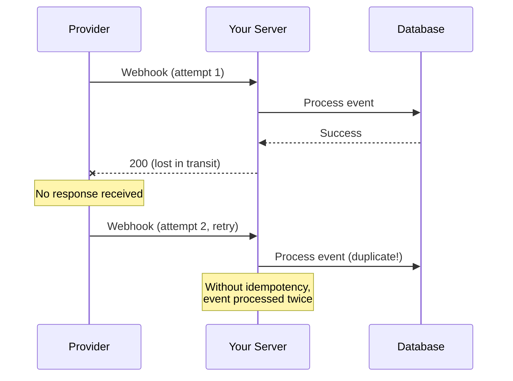
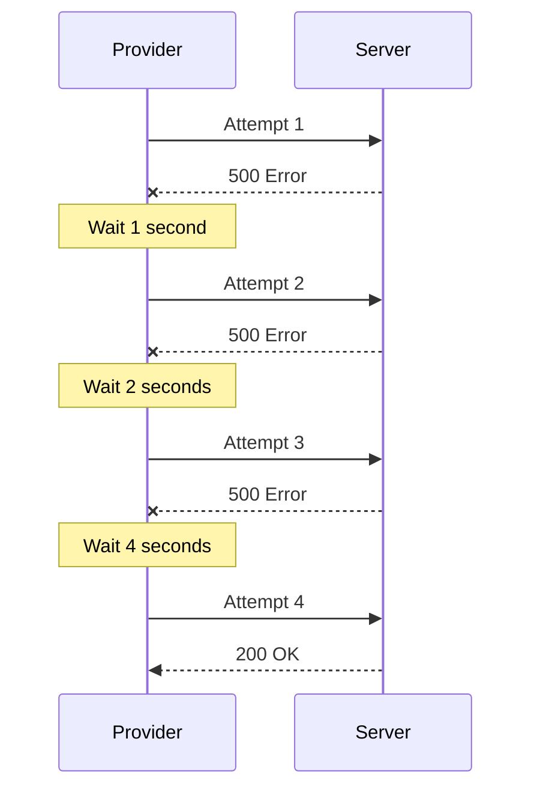

# Retry Handling

## Introduction

Webhooks can fail for many reasons: network issues, server downtime, timeouts. Robust retry handling ensures events aren't lost and operations remain idempotent even when receiving duplicate deliveries.

### What We'll Cover

- Idempotency keys and patterns
- Duplicate detection
- Retry policies and exponential backoff
- Dead letter queues

### Prerequisites

- Database basics
- HTTP status codes
- Basic queueing concepts

---

## Webhook Delivery Challenges



| Challenge | Description | Solution |
|-----------|-------------|----------|
| **Lost ACK** | 200 response not received | Idempotency keys |
| **Server crash** | Crash after processing | At-least-once + idempotency |
| **Timeout** | Processing takes too long | Async processing |
| **Rate limits** | Too many webhooks at once | Queue + backpressure |

---

## Idempotency Keys

### Understanding Idempotency

```python
# NON-IDEMPOTENT (bad)
def process_payment(amount: float):
    """Each call adds to balance - dangerous with duplicates!"""
    user.balance += amount
    
# IDEMPOTENT (good)
def process_payment(payment_id: str, amount: float):
    """Check if already processed - safe with duplicates."""
    if payment_exists(payment_id):
        return get_existing_payment(payment_id)
    
    return create_payment(payment_id, amount)
```

### Implementation

```python
from dataclasses import dataclass
from datetime import datetime, timedelta
from typing import Optional, Dict, Any
import hashlib
import json

@dataclass
class IdempotencyRecord:
    """Record of a processed event."""
    
    key: str
    processed_at: datetime
    result: Any
    expires_at: datetime


class IdempotencyStore:
    """Store for idempotency keys."""
    
    def __init__(self, ttl_hours: int = 24):
        self.records: Dict[str, IdempotencyRecord] = {}
        self.ttl = timedelta(hours=ttl_hours)
    
    def get(self, key: str) -> Optional[IdempotencyRecord]:
        """Get existing record if not expired."""
        
        record = self.records.get(key)
        
        if record and datetime.now() > record.expires_at:
            del self.records[key]
            return None
        
        return record
    
    def set(self, key: str, result: Any) -> IdempotencyRecord:
        """Store processing result."""
        
        now = datetime.now()
        
        record = IdempotencyRecord(
            key=key,
            processed_at=now,
            result=result,
            expires_at=now + self.ttl
        )
        
        self.records[key] = record
        return record
    
    def cleanup(self):
        """Remove expired records."""
        
        now = datetime.now()
        expired = [
            k for k, v in self.records.items()
            if now > v.expires_at
        ]
        
        for key in expired:
            del self.records[key]


class IdempotentWebhookHandler:
    """Handler that ensures idempotent processing."""
    
    def __init__(self, store: IdempotencyStore = None):
        self.store = store or IdempotencyStore()
    
    def get_idempotency_key(
        self,
        event: dict,
        headers: dict
    ) -> str:
        """Extract or generate idempotency key."""
        
        # 1. Prefer provider's event ID
        event_id = (
            event.get("id") or
            event.get("event_id") or
            headers.get("X-Event-ID") or
            headers.get("X-Request-ID")
        )
        
        if event_id:
            return event_id
        
        # 2. Generate from content (hash)
        content = json.dumps(event, sort_keys=True)
        return hashlib.sha256(content.encode()).hexdigest()[:32]
    
    def handle(
        self,
        event: dict,
        headers: dict,
        processor
    ) -> tuple[Any, bool]:
        """Handle event idempotently.
        
        Returns:
            (result, was_duplicate)
        """
        
        key = self.get_idempotency_key(event, headers)
        
        # Check for existing processing
        existing = self.store.get(key)
        
        if existing:
            return existing.result, True
        
        # Process event
        result = processor(event)
        
        # Store result
        self.store.set(key, result)
        
        return result, False


# Flask integration
idempotent_handler = IdempotentWebhookHandler()

@app.route("/webhook/idempotent", methods=["POST"])
def idempotent_webhook():
    """Idempotent webhook endpoint."""
    
    event = request.json
    headers = dict(request.headers)
    
    def processor(e):
        # Your actual processing logic
        return {"processed": e.get("type")}
    
    result, was_duplicate = idempotent_handler.handle(
        event, headers, processor
    )
    
    if was_duplicate:
        print(f"Duplicate event: {event.get('id')}")
    
    return jsonify(result), 200
```

---

## Duplicate Detection

### Multi-Layer Detection

```python
from collections import OrderedDict
from threading import Lock
import sqlite3

class LRUDuplicateCache:
    """In-memory LRU cache for quick duplicate detection."""
    
    def __init__(self, maxsize: int = 10000):
        self.cache = OrderedDict()
        self.maxsize = maxsize
        self.lock = Lock()
    
    def contains(self, key: str) -> bool:
        """Check if key exists (and move to end)."""
        
        with self.lock:
            if key in self.cache:
                self.cache.move_to_end(key)
                return True
            return False
    
    def add(self, key: str):
        """Add key to cache."""
        
        with self.lock:
            if key in self.cache:
                self.cache.move_to_end(key)
            else:
                self.cache[key] = True
                
                while len(self.cache) > self.maxsize:
                    self.cache.popitem(last=False)


class PersistentDuplicateStore:
    """SQLite-backed duplicate store."""
    
    def __init__(self, db_path: str = "duplicates.db"):
        self.conn = sqlite3.connect(db_path, check_same_thread=False)
        self._init_db()
    
    def _init_db(self):
        self.conn.execute("""
            CREATE TABLE IF NOT EXISTS processed_events (
                event_id TEXT PRIMARY KEY,
                processed_at TIMESTAMP DEFAULT CURRENT_TIMESTAMP,
                event_type TEXT,
                result TEXT
            )
        """)
        
        self.conn.execute("""
            CREATE INDEX IF NOT EXISTS idx_processed_at 
            ON processed_events(processed_at)
        """)
        
        self.conn.commit()
    
    def exists(self, event_id: str) -> bool:
        """Check if event was processed."""
        
        cursor = self.conn.execute(
            "SELECT 1 FROM processed_events WHERE event_id = ?",
            (event_id,)
        )
        
        return cursor.fetchone() is not None
    
    def record(
        self,
        event_id: str,
        event_type: str,
        result: str
    ):
        """Record processed event."""
        
        self.conn.execute(
            """INSERT OR IGNORE INTO processed_events 
               (event_id, event_type, result) VALUES (?, ?, ?)""",
            (event_id, event_type, result)
        )
        
        self.conn.commit()
    
    def cleanup(self, days: int = 7):
        """Remove old records."""
        
        self.conn.execute(
            """DELETE FROM processed_events 
               WHERE processed_at < datetime('now', ?)""",
            (f"-{days} days",)
        )
        
        self.conn.commit()


class TwoTierDuplicateDetector:
    """Fast in-memory check with persistent backup."""
    
    def __init__(self):
        self.cache = LRUDuplicateCache(maxsize=10000)
        self.store = PersistentDuplicateStore()
    
    def is_duplicate(self, event_id: str) -> bool:
        """Check both tiers for duplicates."""
        
        # Fast path: in-memory cache
        if self.cache.contains(event_id):
            return True
        
        # Slow path: database
        if self.store.exists(event_id):
            # Populate cache for next time
            self.cache.add(event_id)
            return True
        
        return False
    
    def record(
        self,
        event_id: str,
        event_type: str,
        result: str
    ):
        """Record event in both tiers."""
        
        self.cache.add(event_id)
        self.store.record(event_id, event_type, result)


# Usage
detector = TwoTierDuplicateDetector()

@app.route("/webhook/dedup", methods=["POST"])
def deduplicated_webhook():
    """Webhook with two-tier duplicate detection."""
    
    event = request.json
    event_id = event.get("id")
    
    if not event_id:
        return {"error": "Missing event ID"}, 400
    
    if detector.is_duplicate(event_id):
        return {"status": "already_processed"}, 200
    
    # Process event
    result = process_event(event)
    
    # Record
    detector.record(event_id, event.get("type"), json.dumps(result))
    
    return jsonify(result), 200
```

---

## Retry Policies

### Exponential Backoff



### Handling Provider Retries

```python
from dataclasses import dataclass
from enum import Enum
from typing import Callable, Optional
import time

class RetryAction(Enum):
    """What to tell provider to do."""
    
    SUCCESS = "success"  # 200 - processed
    RETRY = "retry"  # 500 - please retry
    SKIP = "skip"  # 200 - skip this event
    DELAY = "delay"  # 429 - slow down


@dataclass
class ProcessingResult:
    """Result of webhook processing."""
    
    action: RetryAction
    message: str = ""
    retry_after: Optional[int] = None


class RetryAwareHandler:
    """Handler that manages retry signals."""
    
    def __init__(
        self,
        processor: Callable,
        max_processing_time: int = 25  # seconds
    ):
        self.processor = processor
        self.max_processing_time = max_processing_time
    
    def handle(self, event: dict) -> ProcessingResult:
        """Handle event with retry awareness."""
        
        attempt = event.get("delivery_attempt", 1)
        
        try:
            # Set timeout for processing
            result = self._process_with_timeout(event)
            
            return ProcessingResult(
                action=RetryAction.SUCCESS,
                message=f"Processed on attempt {attempt}"
            )
            
        except TimeoutError:
            # Processing too slow - will timeout
            return ProcessingResult(
                action=RetryAction.RETRY,
                message="Processing timeout, please retry"
            )
            
        except RateLimitError:
            # We're being rate limited
            return ProcessingResult(
                action=RetryAction.DELAY,
                retry_after=60
            )
            
        except UnrecoverableError as e:
            # Don't retry this one
            return ProcessingResult(
                action=RetryAction.SKIP,
                message=str(e)
            )
            
        except Exception as e:
            # Transient error - retry
            return ProcessingResult(
                action=RetryAction.RETRY,
                message=str(e)
            )
    
    def _process_with_timeout(self, event: dict) -> Any:
        """Process with timeout."""
        
        import signal
        
        def timeout_handler(signum, frame):
            raise TimeoutError("Processing timeout")
        
        signal.signal(signal.SIGALRM, timeout_handler)
        signal.alarm(self.max_processing_time)
        
        try:
            return self.processor(event)
        finally:
            signal.alarm(0)


class RateLimitError(Exception):
    pass

class UnrecoverableError(Exception):
    pass


# Flask integration
handler = RetryAwareHandler(process_event)

@app.route("/webhook/retry-aware", methods=["POST"])
def retry_aware_webhook():
    """Webhook that signals retry behavior."""
    
    event = request.json
    result = handler.handle(event)
    
    if result.action == RetryAction.SUCCESS:
        return {"status": "success"}, 200
    
    elif result.action == RetryAction.SKIP:
        # 200 but log for investigation
        print(f"Skipped event: {result.message}")
        return {"status": "skipped"}, 200
    
    elif result.action == RetryAction.DELAY:
        # Tell provider to slow down
        return (
            {"status": "rate_limited"},
            429,
            {"Retry-After": str(result.retry_after)}
        )
    
    else:  # RETRY
        # 500 signals "please retry"
        return {"status": "error", "message": result.message}, 500
```

### Implementing Your Own Retry Logic

```python
from dataclasses import dataclass, field
from datetime import datetime, timedelta
from typing import List, Optional
import asyncio
import random

@dataclass
class RetryPolicy:
    """Configuration for retry behavior."""
    
    max_attempts: int = 5
    initial_delay: float = 1.0
    max_delay: float = 300.0  # 5 minutes
    exponential_base: float = 2.0
    jitter: float = 0.1  # 10% jitter


@dataclass
class DeliveryAttempt:
    """Record of a delivery attempt."""
    
    timestamp: datetime
    success: bool
    status_code: Optional[int] = None
    error: Optional[str] = None


@dataclass
class WebhookDelivery:
    """A webhook that needs to be delivered."""
    
    id: str
    url: str
    payload: dict
    created_at: datetime = field(default_factory=datetime.now)
    attempts: List[DeliveryAttempt] = field(default_factory=list)
    next_attempt_at: Optional[datetime] = None
    
    @property
    def attempt_count(self) -> int:
        return len(self.attempts)
    
    @property
    def last_attempt(self) -> Optional[DeliveryAttempt]:
        return self.attempts[-1] if self.attempts else None


class WebhookDeliveryManager:
    """Manage webhook delivery with retries."""
    
    def __init__(
        self,
        policy: RetryPolicy = None,
        dead_letter_callback = None
    ):
        self.policy = policy or RetryPolicy()
        self.dead_letter_callback = dead_letter_callback
        self.pending: List[WebhookDelivery] = []
    
    def calculate_delay(self, attempt: int) -> float:
        """Calculate delay for next retry."""
        
        delay = self.policy.initial_delay * (
            self.policy.exponential_base ** attempt
        )
        
        delay = min(delay, self.policy.max_delay)
        
        # Add jitter
        jitter_range = delay * self.policy.jitter
        delay += random.uniform(-jitter_range, jitter_range)
        
        return max(0, delay)
    
    async def deliver(
        self,
        delivery: WebhookDelivery
    ) -> bool:
        """Attempt to deliver webhook."""
        
        import aiohttp
        
        async with aiohttp.ClientSession() as session:
            try:
                async with session.post(
                    delivery.url,
                    json=delivery.payload,
                    timeout=aiohttp.ClientTimeout(total=30)
                ) as response:
                    
                    success = 200 <= response.status < 300
                    
                    delivery.attempts.append(DeliveryAttempt(
                        timestamp=datetime.now(),
                        success=success,
                        status_code=response.status
                    ))
                    
                    return success
                    
            except Exception as e:
                delivery.attempts.append(DeliveryAttempt(
                    timestamp=datetime.now(),
                    success=False,
                    error=str(e)
                ))
                
                return False
    
    async def deliver_with_retry(
        self,
        delivery: WebhookDelivery
    ) -> bool:
        """Deliver with full retry logic."""
        
        while delivery.attempt_count < self.policy.max_attempts:
            success = await self.deliver(delivery)
            
            if success:
                return True
            
            # Calculate next retry time
            delay = self.calculate_delay(delivery.attempt_count)
            delivery.next_attempt_at = datetime.now() + timedelta(seconds=delay)
            
            print(f"Delivery failed, retry in {delay:.1f}s")
            await asyncio.sleep(delay)
        
        # Max attempts reached - dead letter
        if self.dead_letter_callback:
            await self.dead_letter_callback(delivery)
        
        return False


# Usage
manager = WebhookDeliveryManager(
    policy=RetryPolicy(
        max_attempts=5,
        initial_delay=1.0,
        exponential_base=2.0
    ),
    dead_letter_callback=lambda d: print(f"Dead letter: {d.id}")
)

# Deliver a webhook
delivery = WebhookDelivery(
    id="evt_123",
    url="https://example.com/webhook",
    payload={"type": "test"}
)

success = await manager.deliver_with_retry(delivery)
```

---

## Dead Letter Queues

```python
from dataclasses import dataclass, field
from datetime import datetime
from typing import List, Optional
from enum import Enum
import json

class FailureReason(Enum):
    """Categorized failure reasons."""
    
    MAX_RETRIES = "max_retries"
    INVALID_ENDPOINT = "invalid_endpoint"
    PAYLOAD_ERROR = "payload_error"
    UNRECOVERABLE = "unrecoverable"


@dataclass
class DeadLetter:
    """A failed webhook delivery."""
    
    id: str
    webhook_id: str
    url: str
    payload: dict
    failure_reason: FailureReason
    error_details: str
    attempts: List[dict]
    failed_at: datetime = field(default_factory=datetime.now)
    reprocessed: bool = False


class DeadLetterQueue:
    """Queue for failed webhook deliveries."""
    
    def __init__(self, db_path: str = "dlq.db"):
        self.conn = sqlite3.connect(db_path, check_same_thread=False)
        self._init_db()
    
    def _init_db(self):
        self.conn.execute("""
            CREATE TABLE IF NOT EXISTS dead_letters (
                id TEXT PRIMARY KEY,
                webhook_id TEXT,
                url TEXT,
                payload TEXT,
                failure_reason TEXT,
                error_details TEXT,
                attempts TEXT,
                failed_at TIMESTAMP,
                reprocessed BOOLEAN DEFAULT 0
            )
        """)
        
        self.conn.commit()
    
    def add(self, letter: DeadLetter):
        """Add failed delivery to queue."""
        
        self.conn.execute(
            """INSERT INTO dead_letters 
               (id, webhook_id, url, payload, failure_reason, 
                error_details, attempts, failed_at)
               VALUES (?, ?, ?, ?, ?, ?, ?, ?)""",
            (
                letter.id,
                letter.webhook_id,
                letter.url,
                json.dumps(letter.payload),
                letter.failure_reason.value,
                letter.error_details,
                json.dumps(letter.attempts),
                letter.failed_at.isoformat()
            )
        )
        
        self.conn.commit()
    
    def get_pending(
        self,
        limit: int = 100
    ) -> List[DeadLetter]:
        """Get unprocessed dead letters."""
        
        cursor = self.conn.execute(
            """SELECT * FROM dead_letters 
               WHERE reprocessed = 0 
               ORDER BY failed_at 
               LIMIT ?""",
            (limit,)
        )
        
        letters = []
        
        for row in cursor.fetchall():
            letters.append(DeadLetter(
                id=row[0],
                webhook_id=row[1],
                url=row[2],
                payload=json.loads(row[3]),
                failure_reason=FailureReason(row[4]),
                error_details=row[5],
                attempts=json.loads(row[6]),
                failed_at=datetime.fromisoformat(row[7]),
                reprocessed=bool(row[8])
            ))
        
        return letters
    
    def mark_reprocessed(self, letter_id: str):
        """Mark dead letter as reprocessed."""
        
        self.conn.execute(
            "UPDATE dead_letters SET reprocessed = 1 WHERE id = ?",
            (letter_id,)
        )
        
        self.conn.commit()
    
    def get_stats(self) -> dict:
        """Get queue statistics."""
        
        cursor = self.conn.execute("""
            SELECT 
                failure_reason,
                COUNT(*) as count,
                SUM(CASE WHEN reprocessed = 0 THEN 1 ELSE 0 END) as pending
            FROM dead_letters
            GROUP BY failure_reason
        """)
        
        return {
            row[0]: {"total": row[1], "pending": row[2]}
            for row in cursor.fetchall()
        }


class DeadLetterProcessor:
    """Process dead letter queue."""
    
    def __init__(
        self,
        queue: DeadLetterQueue,
        delivery_manager: WebhookDeliveryManager
    ):
        self.queue = queue
        self.delivery_manager = delivery_manager
    
    async def reprocess_letter(
        self,
        letter: DeadLetter
    ) -> bool:
        """Attempt to reprocess a dead letter."""
        
        # Create new delivery
        delivery = WebhookDelivery(
            id=f"retry_{letter.id}",
            url=letter.url,
            payload=letter.payload
        )
        
        success = await self.delivery_manager.deliver(delivery)
        
        if success:
            self.queue.mark_reprocessed(letter.id)
        
        return success
    
    async def process_batch(
        self,
        batch_size: int = 10
    ) -> dict:
        """Process a batch of dead letters."""
        
        letters = self.queue.get_pending(limit=batch_size)
        
        results = {
            "total": len(letters),
            "success": 0,
            "failed": 0
        }
        
        for letter in letters:
            success = await self.reprocess_letter(letter)
            
            if success:
                results["success"] += 1
            else:
                results["failed"] += 1
        
        return results


# Integration with delivery manager
dlq = DeadLetterQueue()

async def dead_letter_callback(delivery: WebhookDelivery):
    """Move failed delivery to dead letter queue."""
    
    letter = DeadLetter(
        id=f"dl_{delivery.id}",
        webhook_id=delivery.id,
        url=delivery.url,
        payload=delivery.payload,
        failure_reason=FailureReason.MAX_RETRIES,
        error_details=delivery.last_attempt.error or "Max retries",
        attempts=[
            {
                "timestamp": a.timestamp.isoformat(),
                "status_code": a.status_code,
                "error": a.error
            }
            for a in delivery.attempts
        ]
    )
    
    dlq.add(letter)
    print(f"Added to DLQ: {letter.id}")


manager = WebhookDeliveryManager(
    dead_letter_callback=dead_letter_callback
)


# Admin endpoints
@app.route("/admin/dlq/stats")
def dlq_stats():
    """Get dead letter queue statistics."""
    
    return jsonify(dlq.get_stats())


@app.route("/admin/dlq/pending")
def dlq_pending():
    """List pending dead letters."""
    
    letters = dlq.get_pending(limit=50)
    
    return jsonify([
        {
            "id": l.id,
            "url": l.url,
            "reason": l.failure_reason.value,
            "failed_at": l.failed_at.isoformat()
        }
        for l in letters
    ])


@app.route("/admin/dlq/reprocess", methods=["POST"])
async def dlq_reprocess():
    """Reprocess dead letters."""
    
    processor = DeadLetterProcessor(dlq, manager)
    results = await processor.process_batch(batch_size=10)
    
    return jsonify(results)
```

---

## Complete Retry System

```python
from dataclasses import dataclass
from typing import Callable, Optional

@dataclass
class RetryConfig:
    """Complete retry configuration."""
    
    max_attempts: int = 5
    initial_delay: float = 1.0
    max_delay: float = 300.0
    idempotency_ttl_hours: int = 24
    enable_dlq: bool = True


class RobustWebhookHandler:
    """Complete webhook handler with retry support."""
    
    def __init__(
        self,
        processor: Callable,
        config: RetryConfig = None
    ):
        self.processor = processor
        self.config = config or RetryConfig()
        
        self.idempotency = IdempotencyStore(
            ttl_hours=self.config.idempotency_ttl_hours
        )
        
        self.duplicate_detector = TwoTierDuplicateDetector()
        
        if self.config.enable_dlq:
            self.dlq = DeadLetterQueue()
        else:
            self.dlq = None
    
    def handle(
        self,
        event: dict,
        headers: dict
    ) -> tuple[dict, int]:
        """Handle webhook with full robustness."""
        
        event_id = event.get("id") or headers.get("X-Event-ID")
        attempt = int(headers.get("X-Delivery-Attempt", 1))
        
        # 1. Quick duplicate check
        if event_id and self.duplicate_detector.is_duplicate(event_id):
            return {"status": "already_processed"}, 200
        
        # 2. Idempotency check
        key = self._get_idempotency_key(event, headers)
        existing = self.idempotency.get(key)
        
        if existing:
            return existing.result, 200
        
        # 3. Process event
        try:
            result = self.processor(event)
            
            # Record success
            self.idempotency.set(key, result)
            
            if event_id:
                self.duplicate_detector.record(
                    event_id,
                    event.get("type", "unknown"),
                    json.dumps(result)
                )
            
            return result, 200
            
        except Exception as e:
            # Determine if retryable
            if self._is_retryable(e):
                # Signal retry
                return {"error": str(e), "retry": True}, 500
            else:
                # Unrecoverable - skip
                if self.dlq:
                    self._add_to_dlq(event, e, attempt)
                
                return {"error": str(e), "retry": False}, 200
    
    def _get_idempotency_key(
        self,
        event: dict,
        headers: dict
    ) -> str:
        """Generate idempotency key."""
        
        event_id = event.get("id") or headers.get("X-Event-ID")
        
        if event_id:
            return event_id
        
        content = json.dumps(event, sort_keys=True)
        return hashlib.sha256(content.encode()).hexdigest()[:32]
    
    def _is_retryable(self, error: Exception) -> bool:
        """Determine if error is retryable."""
        
        # Network/timeout errors are retryable
        retryable_types = (
            ConnectionError,
            TimeoutError,
            # Add your retryable types
        )
        
        return isinstance(error, retryable_types)
    
    def _add_to_dlq(
        self,
        event: dict,
        error: Exception,
        attempt: int
    ):
        """Add to dead letter queue."""
        
        import uuid
        
        letter = DeadLetter(
            id=str(uuid.uuid4()),
            webhook_id=event.get("id", "unknown"),
            url="self",
            payload=event,
            failure_reason=FailureReason.UNRECOVERABLE,
            error_details=str(error),
            attempts=[{"attempt": attempt, "error": str(error)}]
        )
        
        self.dlq.add(letter)


# Usage
def my_processor(event: dict) -> dict:
    """Your event processing logic."""
    
    event_type = event.get("type")
    
    if event_type == "completion.finished":
        # Process AI completion
        return {"processed": True}
    
    return {"skipped": True}


handler = RobustWebhookHandler(
    processor=my_processor,
    config=RetryConfig(
        max_attempts=5,
        enable_dlq=True
    )
)

@app.route("/webhook/robust", methods=["POST"])
def robust_webhook():
    """Production-ready webhook endpoint."""
    
    result, status = handler.handle(
        request.json,
        dict(request.headers)
    )
    
    return jsonify(result), status
```

---

## Hands-on Exercise

### Your Task

Build a webhook delivery simulator that tests your retry logic.

### Requirements

1. Simulate a flaky endpoint (random failures)
2. Track delivery attempts and timing
3. Verify exponential backoff works correctly
4. Measure success rate across configurations

### Expected Result

```python
simulator = WebhookSimulator(failure_rate=0.5)
results = simulator.run_test(
    deliveries=100,
    policy=RetryPolicy(max_attempts=5)
)
# Shows: success rate, avg attempts, timing distribution
```

<details>
<summary>💡 Hints</summary>

- Use `random.random() < failure_rate` for failures
- Track time between attempts
- Calculate statistics after all deliveries
</details>

<details>
<summary>✅ Solution</summary>

```python
import random
import asyncio
from dataclasses import dataclass, field
from datetime import datetime, timedelta
from typing import List
import statistics

@dataclass
class SimulatedDelivery:
    """Track a simulated delivery."""
    
    id: str
    attempts: List[datetime] = field(default_factory=list)
    success: bool = False
    total_time: Optional[timedelta] = None


@dataclass
class SimulationResults:
    """Results of simulation run."""
    
    total_deliveries: int
    successful: int
    failed: int
    success_rate: float
    avg_attempts: float
    avg_time_seconds: float
    attempt_distribution: dict


class FlakyEndpoint:
    """Simulates a flaky webhook endpoint."""
    
    def __init__(
        self,
        failure_rate: float = 0.3,
        timeout_rate: float = 0.1
    ):
        self.failure_rate = failure_rate
        self.timeout_rate = timeout_rate
        self.call_count = 0
    
    async def receive(self, payload: dict) -> tuple[bool, str]:
        """Simulate receiving a webhook."""
        
        self.call_count += 1
        
        # Random delay (simulate processing)
        await asyncio.sleep(random.uniform(0.01, 0.1))
        
        # Random timeout
        if random.random() < self.timeout_rate:
            await asyncio.sleep(5)
            return False, "timeout"
        
        # Random failure
        if random.random() < self.failure_rate:
            return False, "500_error"
        
        return True, "success"


class WebhookSimulator:
    """Simulate webhook delivery with retries."""
    
    def __init__(
        self,
        failure_rate: float = 0.3,
        timeout_rate: float = 0.1
    ):
        self.endpoint = FlakyEndpoint(failure_rate, timeout_rate)
    
    async def deliver_single(
        self,
        delivery_id: str,
        policy: RetryPolicy
    ) -> SimulatedDelivery:
        """Deliver a single webhook with retry."""
        
        delivery = SimulatedDelivery(id=delivery_id)
        start_time = datetime.now()
        
        for attempt in range(policy.max_attempts):
            delivery.attempts.append(datetime.now())
            
            success, _ = await self.endpoint.receive({"id": delivery_id})
            
            if success:
                delivery.success = True
                break
            
            # Calculate delay
            if attempt < policy.max_attempts - 1:
                delay = policy.initial_delay * (
                    policy.exponential_base ** attempt
                )
                delay = min(delay, policy.max_delay)
                delay *= random.uniform(0.9, 1.1)  # Jitter
                
                await asyncio.sleep(delay)
        
        delivery.total_time = datetime.now() - start_time
        return delivery
    
    async def run_test(
        self,
        num_deliveries: int,
        policy: RetryPolicy
    ) -> SimulationResults:
        """Run simulation with multiple deliveries."""
        
        # Run all deliveries
        tasks = [
            self.deliver_single(f"delivery_{i}", policy)
            for i in range(num_deliveries)
        ]
        
        deliveries = await asyncio.gather(*tasks)
        
        # Calculate statistics
        successful = sum(1 for d in deliveries if d.success)
        failed = num_deliveries - successful
        
        attempt_counts = [len(d.attempts) for d in deliveries]
        times = [
            d.total_time.total_seconds() 
            for d in deliveries if d.total_time
        ]
        
        # Attempt distribution
        distribution = {}
        for count in attempt_counts:
            distribution[count] = distribution.get(count, 0) + 1
        
        return SimulationResults(
            total_deliveries=num_deliveries,
            successful=successful,
            failed=failed,
            success_rate=successful / num_deliveries,
            avg_attempts=statistics.mean(attempt_counts),
            avg_time_seconds=statistics.mean(times) if times else 0,
            attempt_distribution=distribution
        )


# Run simulation
async def main():
    simulator = WebhookSimulator(
        failure_rate=0.5,
        timeout_rate=0.1
    )
    
    policy = RetryPolicy(
        max_attempts=5,
        initial_delay=0.1,  # Short for simulation
        exponential_base=2.0
    )
    
    results = await simulator.run_test(
        num_deliveries=100,
        policy=policy
    )
    
    print("Simulation Results")
    print("=" * 40)
    print(f"Total: {results.total_deliveries}")
    print(f"Successful: {results.successful}")
    print(f"Failed: {results.failed}")
    print(f"Success Rate: {results.success_rate:.1%}")
    print(f"Avg Attempts: {results.avg_attempts:.2f}")
    print(f"Avg Time: {results.avg_time_seconds:.2f}s")
    print(f"\nAttempt Distribution:")
    for attempts, count in sorted(results.attempt_distribution.items()):
        print(f"  {attempts} attempts: {count} deliveries")


asyncio.run(main())
```

**Output:**
```
Simulation Results
========================================
Total: 100
Successful: 97
Failed: 3
Success Rate: 97.0%
Avg Attempts: 1.82
Avg Time: 0.34s

Attempt Distribution:
  1 attempts: 52 deliveries
  2 attempts: 28 deliveries
  3 attempts: 12 deliveries
  4 attempts: 5 deliveries
  5 attempts: 3 deliveries
```

</details>

---

## Summary

✅ Always use idempotency keys for safe duplicate handling  
✅ Implement two-tier duplicate detection (memory + persistent)  
✅ Use exponential backoff with jitter for retries  
✅ Set up dead letter queues for permanent failures  
✅ Return appropriate status codes to guide provider behavior

**Next:** [Webhook Debugging](./05-webhook-debugging.md)

---

## Further Reading

- [Idempotency Patterns](https://stripe.com/docs/api/idempotent_requests) — Stripe's approach
- [Exponential Backoff](https://aws.amazon.com/blogs/architecture/exponential-backoff-and-jitter/) — AWS best practices
- [Dead Letter Queues](https://docs.aws.amazon.com/AWSSimpleQueueService/latest/SQSDeveloperGuide/sqs-dead-letter-queues.html) — AWS SQS DLQ guide

<!-- 
Sources Consulted:
- Stripe idempotency: https://stripe.com/docs/api/idempotent_requests
- AWS backoff patterns: https://aws.amazon.com/blogs/architecture/exponential-backoff-and-jitter/
-->
