# Webhook Debugging

## Introduction

Webhook issues are notoriously hard to debug: the provider sends a request, something goes wrong, and you have limited visibility. This lesson covers tools and techniques to make webhook development and troubleshooting easier.

### What We'll Cover

- Request logging and inspection
- Testing tools (webhook.site, RequestBin)
- Replay mechanisms
- Local development tunnels (ngrok)

### Prerequisites

- HTTP debugging basics
- Command line familiarity
- Basic networking concepts

---

## Debugging Challenges

```mermaid
flowchart TD
    subgraph Provider["AI Provider"]
        P1[Sends Webhook]
    end
    
    subgraph Internet["The Internet 🌐"]
        N1[Network Issues?]
    end
    
    subgraph Server["Your Server"]
        S1[Receives Request?]
        S2[Parses Correctly?]
        S3[Processes Successfully?]
        S4[Returns 200?]
    end
    
    P1 --> N1
    N1 --> S1
    S1 --> S2
    S2 --> S3
    S3 --> S4
    S4 -->|Lost?| N1
    
    style N1 fill:#ffcccc
    style S1 fill:#ffffcc
    style S2 fill:#ffffcc
    style S3 fill:#ffffcc
    style S4 fill:#ffffcc
```



| Issue | Symptom | Debugging Approach |
|-------|---------|-------------------|
| Never receives | No logs at all | Test endpoint accessibility |
| Parse failure | 400/500 errors | Log raw request body |
| Processing crash | Intermittent 500s | Exception logging |
| Response lost | Provider retries | Response logging |

---

## Request Logging

### Comprehensive Webhook Logger

```python
from dataclasses import dataclass, field
from datetime import datetime
from typing import Optional, Dict, Any
import json
import uuid
import traceback

@dataclass
class WebhookLog:
    """Complete log of a webhook request."""
    
    id: str
    timestamp: datetime
    method: str
    path: str
    headers: Dict[str, str]
    raw_body: bytes
    parsed_body: Optional[Dict] = None
    parse_error: Optional[str] = None
    response_status: Optional[int] = None
    response_body: Optional[str] = None
    processing_time_ms: Optional[float] = None
    exception: Optional[str] = None


class WebhookLogger:
    """Log all aspects of webhook requests."""
    
    def __init__(
        self,
        max_logs: int = 1000,
        log_headers: bool = True,
        redact_secrets: bool = True
    ):
        self.logs: list[WebhookLog] = []
        self.max_logs = max_logs
        self.log_headers = log_headers
        self.redact_secrets = redact_secrets
        
        self.secret_headers = {
            "authorization",
            "x-api-key",
            "x-signature",
            "x-webhook-secret"
        }
    
    def _redact_headers(
        self,
        headers: dict
    ) -> dict:
        """Redact sensitive header values."""
        
        if not self.redact_secrets:
            return headers
        
        redacted = {}
        
        for key, value in headers.items():
            if key.lower() in self.secret_headers:
                redacted[key] = f"{value[:8]}...REDACTED"
            else:
                redacted[key] = value
        
        return redacted
    
    def log_request(
        self,
        request
    ) -> WebhookLog:
        """Log incoming request."""
        
        log = WebhookLog(
            id=str(uuid.uuid4()),
            timestamp=datetime.now(),
            method=request.method,
            path=request.path,
            headers=self._redact_headers(dict(request.headers)) if self.log_headers else {},
            raw_body=request.data
        )
        
        # Try to parse body
        try:
            if request.is_json:
                log.parsed_body = request.get_json(force=True)
        except Exception as e:
            log.parse_error = str(e)
        
        self.logs.append(log)
        
        # Trim old logs
        if len(self.logs) > self.max_logs:
            self.logs = self.logs[-self.max_logs:]
        
        return log
    
    def update_response(
        self,
        log_id: str,
        status: int,
        body: str,
        processing_time_ms: float
    ):
        """Update log with response info."""
        
        for log in self.logs:
            if log.id == log_id:
                log.response_status = status
                log.response_body = body
                log.processing_time_ms = processing_time_ms
                break
    
    def log_exception(self, log_id: str, exception: Exception):
        """Log exception for a request."""
        
        for log in self.logs:
            if log.id == log_id:
                log.exception = traceback.format_exc()
                break
    
    def get_recent(
        self,
        limit: int = 50,
        errors_only: bool = False
    ) -> list[WebhookLog]:
        """Get recent logs."""
        
        logs = self.logs[::-1]  # Reverse for most recent first
        
        if errors_only:
            logs = [
                l for l in logs
                if l.response_status and l.response_status >= 400
                or l.exception
            ]
        
        return logs[:limit]
    
    def search(
        self,
        event_type: str = None,
        status_code: int = None,
        since: datetime = None
    ) -> list[WebhookLog]:
        """Search logs by criteria."""
        
        results = []
        
        for log in self.logs:
            if since and log.timestamp < since:
                continue
            
            if status_code and log.response_status != status_code:
                continue
            
            if event_type:
                if not log.parsed_body:
                    continue
                if log.parsed_body.get("type") != event_type:
                    continue
            
            results.append(log)
        
        return results


# Flask middleware
webhook_logger = WebhookLogger()

def logging_middleware(f):
    """Middleware to log all webhook requests."""
    
    @wraps(f)
    def decorated(*args, **kwargs):
        import time
        
        start = time.time()
        log = webhook_logger.log_request(request)
        
        try:
            response = f(*args, **kwargs)
            
            # Handle tuple responses (body, status)
            if isinstance(response, tuple):
                body, status = response[0], response[1]
            else:
                body, status = response, 200
            
            processing_time = (time.time() - start) * 1000
            
            webhook_logger.update_response(
                log.id,
                status,
                str(body)[:500],  # Truncate
                processing_time
            )
            
            return response
            
        except Exception as e:
            webhook_logger.log_exception(log.id, e)
            raise
    
    return decorated


@app.route("/webhook/logged", methods=["POST"])
@logging_middleware
def logged_webhook():
    """Webhook with comprehensive logging."""
    
    event = request.json
    process_event(event)
    
    return "", 200


# Admin endpoints for viewing logs
@app.route("/admin/webhook-logs")
def view_webhook_logs():
    """View recent webhook logs."""
    
    errors_only = request.args.get("errors") == "true"
    limit = int(request.args.get("limit", 50))
    
    logs = webhook_logger.get_recent(
        limit=limit,
        errors_only=errors_only
    )
    
    return jsonify([
        {
            "id": log.id,
            "timestamp": log.timestamp.isoformat(),
            "path": log.path,
            "status": log.response_status,
            "processing_time_ms": log.processing_time_ms,
            "event_type": log.parsed_body.get("type") if log.parsed_body else None,
            "exception": log.exception[:200] if log.exception else None
        }
        for log in logs
    ])


@app.route("/admin/webhook-logs/<log_id>")
def view_webhook_log_detail(log_id: str):
    """View detailed webhook log."""
    
    for log in webhook_logger.logs:
        if log.id == log_id:
            return jsonify({
                "id": log.id,
                "timestamp": log.timestamp.isoformat(),
                "method": log.method,
                "path": log.path,
                "headers": log.headers,
                "body": log.parsed_body,
                "raw_body": log.raw_body.decode("utf-8", errors="replace"),
                "response_status": log.response_status,
                "response_body": log.response_body,
                "processing_time_ms": log.processing_time_ms,
                "parse_error": log.parse_error,
                "exception": log.exception
            })
    
    return {"error": "Log not found"}, 404
```

---

## Online Testing Tools

### Using webhook.site

```python
import requests

# webhook.site gives you a unique URL
WEBHOOK_SITE_URL = "https://webhook.site/your-unique-id"

def test_webhook_format():
    """Send test payload to webhook.site for inspection."""
    
    # Simulate what provider will send
    test_payload = {
        "id": "evt_test_123",
        "type": "completion.finished",
        "created": 1234567890,
        "data": {
            "completion_id": "comp_abc",
            "model": "gpt-4",
            "usage": {
                "prompt_tokens": 100,
                "completion_tokens": 50
            }
        }
    }
    
    # Include typical headers
    headers = {
        "Content-Type": "application/json",
        "X-Webhook-ID": "wh_123",
        "X-Signature": "sha256=abc123...",
        "X-Timestamp": "1234567890"
    }
    
    response = requests.post(
        WEBHOOK_SITE_URL,
        json=test_payload,
        headers=headers
    )
    
    print(f"Sent to webhook.site: {response.status_code}")
    print(f"Check: https://webhook.site/#!/{WEBHOOK_SITE_URL.split('/')[-1]}")


# Useful for verifying payload structure before coding handler
test_webhook_format()
```

### Webhook Testing Utilities

```python
import httpx
from dataclasses import dataclass
from typing import Optional

@dataclass
class WebhookTestResult:
    """Result of webhook test."""
    
    success: bool
    status_code: int
    response_body: str
    response_time_ms: float
    error: Optional[str] = None


class WebhookTester:
    """Test webhook endpoints."""
    
    def __init__(self, base_url: str):
        self.base_url = base_url
    
    async def send_test(
        self,
        path: str,
        payload: dict,
        headers: dict = None
    ) -> WebhookTestResult:
        """Send test webhook."""
        
        import time
        
        url = f"{self.base_url}{path}"
        
        async with httpx.AsyncClient() as client:
            start = time.time()
            
            try:
                response = await client.post(
                    url,
                    json=payload,
                    headers=headers or {},
                    timeout=30.0
                )
                
                return WebhookTestResult(
                    success=200 <= response.status_code < 300,
                    status_code=response.status_code,
                    response_body=response.text,
                    response_time_ms=(time.time() - start) * 1000
                )
                
            except Exception as e:
                return WebhookTestResult(
                    success=False,
                    status_code=0,
                    response_body="",
                    response_time_ms=(time.time() - start) * 1000,
                    error=str(e)
                )
    
    async def test_signature_validation(
        self,
        path: str,
        payload: dict,
        secret: str
    ) -> dict:
        """Test that signature validation works."""
        
        import hmac
        import hashlib
        
        results = {}
        
        # Test 1: Valid signature
        valid_sig = hmac.new(
            secret.encode(),
            json.dumps(payload).encode(),
            hashlib.sha256
        ).hexdigest()
        
        result = await self.send_test(
            path,
            payload,
            {"X-Signature": f"sha256={valid_sig}"}
        )
        
        results["valid_signature"] = {
            "passed": result.success,
            "status": result.status_code
        }
        
        # Test 2: Invalid signature
        result = await self.send_test(
            path,
            payload,
            {"X-Signature": "sha256=invalid"}
        )
        
        results["invalid_signature"] = {
            "passed": result.status_code == 401,
            "status": result.status_code
        }
        
        # Test 3: Missing signature
        result = await self.send_test(path, payload, {})
        
        results["missing_signature"] = {
            "passed": result.status_code == 401,
            "status": result.status_code
        }
        
        return results
    
    async def test_idempotency(
        self,
        path: str,
        payload: dict
    ) -> dict:
        """Test that duplicate events are handled."""
        
        # Send same event twice
        result1 = await self.send_test(path, payload)
        result2 = await self.send_test(path, payload)
        
        return {
            "first_call": {
                "success": result1.success,
                "status": result1.status_code
            },
            "second_call": {
                "success": result2.success,
                "status": result2.status_code
            },
            "idempotent": result1.success and result2.success
        }


# Usage
async def run_tests():
    tester = WebhookTester("http://localhost:5000")
    
    test_payload = {
        "id": "evt_123",
        "type": "test.event"
    }
    
    # Test basic endpoint
    result = await tester.send_test("/webhook", test_payload)
    print(f"Basic test: {'✅' if result.success else '❌'}")
    
    # Test signature validation
    sig_results = await tester.test_signature_validation(
        "/webhook/secure",
        test_payload,
        "test_secret"
    )
    
    for test, result in sig_results.items():
        print(f"{test}: {'✅' if result['passed'] else '❌'}")
    
    # Test idempotency
    idem_results = await tester.test_idempotency("/webhook", test_payload)
    print(f"Idempotent: {'✅' if idem_results['idempotent'] else '❌'}")
```

---

## Replay Mechanisms

### Webhook Replay System

```python
from dataclasses import dataclass, field
from datetime import datetime
from typing import List, Optional
import sqlite3
import json

@dataclass
class StoredWebhook:
    """A stored webhook for replay."""
    
    id: str
    received_at: datetime
    path: str
    headers: dict
    body: dict
    original_response: int
    replay_count: int = 0
    last_replay: Optional[datetime] = None


class WebhookReplayStore:
    """Store webhooks for later replay."""
    
    def __init__(self, db_path: str = "webhook_replay.db"):
        self.conn = sqlite3.connect(db_path, check_same_thread=False)
        self._init_db()
    
    def _init_db(self):
        self.conn.execute("""
            CREATE TABLE IF NOT EXISTS webhooks (
                id TEXT PRIMARY KEY,
                received_at TIMESTAMP,
                path TEXT,
                headers TEXT,
                body TEXT,
                original_response INTEGER,
                replay_count INTEGER DEFAULT 0,
                last_replay TIMESTAMP
            )
        """)
        
        self.conn.commit()
    
    def store(
        self,
        webhook_id: str,
        path: str,
        headers: dict,
        body: dict,
        response_status: int
    ):
        """Store webhook for potential replay."""
        
        self.conn.execute(
            """INSERT OR REPLACE INTO webhooks 
               (id, received_at, path, headers, body, original_response)
               VALUES (?, ?, ?, ?, ?, ?)""",
            (
                webhook_id,
                datetime.now().isoformat(),
                path,
                json.dumps(headers),
                json.dumps(body),
                response_status
            )
        )
        
        self.conn.commit()
    
    def get(self, webhook_id: str) -> Optional[StoredWebhook]:
        """Get stored webhook."""
        
        cursor = self.conn.execute(
            "SELECT * FROM webhooks WHERE id = ?",
            (webhook_id,)
        )
        
        row = cursor.fetchone()
        
        if not row:
            return None
        
        return StoredWebhook(
            id=row[0],
            received_at=datetime.fromisoformat(row[1]),
            path=row[2],
            headers=json.loads(row[3]),
            body=json.loads(row[4]),
            original_response=row[5],
            replay_count=row[6],
            last_replay=datetime.fromisoformat(row[7]) if row[7] else None
        )
    
    def get_failed(self, limit: int = 100) -> List[StoredWebhook]:
        """Get webhooks that failed originally."""
        
        cursor = self.conn.execute(
            """SELECT * FROM webhooks 
               WHERE original_response >= 400 
               ORDER BY received_at DESC 
               LIMIT ?""",
            (limit,)
        )
        
        return [
            StoredWebhook(
                id=row[0],
                received_at=datetime.fromisoformat(row[1]),
                path=row[2],
                headers=json.loads(row[3]),
                body=json.loads(row[4]),
                original_response=row[5],
                replay_count=row[6],
                last_replay=datetime.fromisoformat(row[7]) if row[7] else None
            )
            for row in cursor.fetchall()
        ]
    
    def mark_replayed(self, webhook_id: str):
        """Mark webhook as replayed."""
        
        self.conn.execute(
            """UPDATE webhooks 
               SET replay_count = replay_count + 1, 
                   last_replay = ?
               WHERE id = ?""",
            (datetime.now().isoformat(), webhook_id)
        )
        
        self.conn.commit()


class WebhookReplayer:
    """Replay stored webhooks."""
    
    def __init__(
        self,
        store: WebhookReplayStore,
        app  # Flask app
    ):
        self.store = store
        self.app = app
    
    def replay(
        self,
        webhook_id: str
    ) -> tuple[bool, int, str]:
        """Replay a stored webhook."""
        
        webhook = self.store.get(webhook_id)
        
        if not webhook:
            return False, 404, "Webhook not found"
        
        # Create test client to replay
        with self.app.test_client() as client:
            response = client.post(
                webhook.path,
                json=webhook.body,
                headers=webhook.headers
            )
            
            self.store.mark_replayed(webhook_id)
            
            return (
                200 <= response.status_code < 300,
                response.status_code,
                response.get_data(as_text=True)
            )
    
    def replay_failed(
        self,
        limit: int = 10
    ) -> dict:
        """Replay all failed webhooks."""
        
        failed = self.store.get_failed(limit=limit)
        
        results = {
            "total": len(failed),
            "success": 0,
            "failed": 0,
            "details": []
        }
        
        for webhook in failed:
            success, status, body = self.replay(webhook.id)
            
            if success:
                results["success"] += 1
            else:
                results["failed"] += 1
            
            results["details"].append({
                "id": webhook.id,
                "success": success,
                "status": status
            })
        
        return results


# Flask integration
replay_store = WebhookReplayStore()

# Middleware to store webhooks
def store_for_replay(f):
    """Store all webhooks for potential replay."""
    
    @wraps(f)
    def decorated(*args, **kwargs):
        response = f(*args, **kwargs)
        
        # Get response status
        status = response[1] if isinstance(response, tuple) else 200
        
        # Store webhook
        event = request.json or {}
        webhook_id = event.get("id") or str(uuid.uuid4())
        
        replay_store.store(
            webhook_id,
            request.path,
            dict(request.headers),
            event,
            status
        )
        
        return response
    
    return decorated


@app.route("/webhook/replayable", methods=["POST"])
@store_for_replay
def replayable_webhook():
    """Webhook that stores for replay."""
    
    event = request.json
    
    # Simulate occasional failure
    if random.random() < 0.2:
        return {"error": "Random failure"}, 500
    
    return "", 200


# Admin endpoints
@app.route("/admin/replay/<webhook_id>", methods=["POST"])
def replay_webhook(webhook_id: str):
    """Replay a specific webhook."""
    
    replayer = WebhookReplayer(replay_store, app)
    success, status, body = replayer.replay(webhook_id)
    
    return jsonify({
        "success": success,
        "status": status,
        "body": body
    })


@app.route("/admin/replay-failed", methods=["POST"])
def replay_failed():
    """Replay all failed webhooks."""
    
    replayer = WebhookReplayer(replay_store, app)
    results = replayer.replay_failed(limit=10)
    
    return jsonify(results)
```

---

## Local Development Tunnels

### Using ngrok

```bash
# Install ngrok
# macOS: brew install ngrok
# Linux: snap install ngrok

# Start your local server
python app.py  # Runs on localhost:5000

# In another terminal, expose it
ngrok http 5000
```

**Output:**
```
Session Status                online
Account                       your-email (Plan: Free)
Version                       3.3.0
Region                        United States (us)
Forwarding                    https://abc123.ngrok.io -> http://localhost:5000
```

### Programmatic ngrok Management

```python
import subprocess
import requests
import time
from typing import Optional

class NgrokTunnel:
    """Manage ngrok tunnel for webhook development."""
    
    def __init__(
        self,
        port: int = 5000,
        auth_token: Optional[str] = None
    ):
        self.port = port
        self.auth_token = auth_token
        self.process = None
        self.public_url = None
    
    def start(self) -> str:
        """Start ngrok tunnel."""
        
        # Configure auth if provided
        if self.auth_token:
            subprocess.run(
                ["ngrok", "config", "add-authtoken", self.auth_token],
                capture_output=True
            )
        
        # Start ngrok in background
        self.process = subprocess.Popen(
            ["ngrok", "http", str(self.port)],
            stdout=subprocess.PIPE,
            stderr=subprocess.PIPE
        )
        
        # Wait for tunnel to establish
        time.sleep(2)
        
        # Get public URL from ngrok API
        self.public_url = self._get_public_url()
        
        return self.public_url
    
    def _get_public_url(self) -> str:
        """Get public URL from ngrok API."""
        
        try:
            response = requests.get("http://localhost:4040/api/tunnels")
            tunnels = response.json().get("tunnels", [])
            
            for tunnel in tunnels:
                if tunnel.get("proto") == "https":
                    return tunnel.get("public_url")
            
            raise Exception("No HTTPS tunnel found")
            
        except Exception as e:
            raise Exception(f"Failed to get ngrok URL: {e}")
    
    def stop(self):
        """Stop ngrok tunnel."""
        
        if self.process:
            self.process.terminate()
            self.process = None
            self.public_url = None
    
    def get_webhook_url(self, path: str = "/webhook") -> str:
        """Get full webhook URL."""
        
        if not self.public_url:
            raise Exception("Tunnel not started")
        
        return f"{self.public_url}{path}"


class WebhookDevEnvironment:
    """Complete webhook development environment."""
    
    def __init__(
        self,
        app,
        port: int = 5000
    ):
        self.app = app
        self.port = port
        self.tunnel = NgrokTunnel(port=port)
    
    def start(self):
        """Start dev environment with tunnel."""
        
        import threading
        
        # Start Flask in background
        flask_thread = threading.Thread(
            target=lambda: self.app.run(
                host="0.0.0.0",
                port=self.port,
                debug=False
            )
        )
        flask_thread.daemon = True
        flask_thread.start()
        
        # Wait for Flask to start
        time.sleep(1)
        
        # Start tunnel
        public_url = self.tunnel.start()
        
        print(f"\n{'='*50}")
        print(f"🚀 Webhook Dev Environment Ready")
        print(f"{'='*50}")
        print(f"Local:   http://localhost:{self.port}")
        print(f"Public:  {public_url}")
        print(f"Webhook: {self.tunnel.get_webhook_url()}")
        print(f"{'='*50}\n")
        
        return public_url
    
    def register_with_provider(
        self,
        provider_api,
        path: str = "/webhook"
    ):
        """Register webhook URL with AI provider."""
        
        webhook_url = self.tunnel.get_webhook_url(path)
        
        # Example: Register with OpenAI
        provider_api.webhooks.create(
            url=webhook_url,
            enabled_events=["completion.finished", "batch.completed"]
        )
        
        print(f"Registered webhook: {webhook_url}")


# Usage for development
if __name__ == "__main__":
    from flask import Flask
    
    app = Flask(__name__)
    
    @app.route("/webhook", methods=["POST"])
    def webhook():
        print(f"Received: {request.json}")
        return "", 200
    
    env = WebhookDevEnvironment(app, port=5000)
    
    try:
        env.start()
        
        # Keep running
        while True:
            time.sleep(1)
            
    except KeyboardInterrupt:
        print("\nShutting down...")
        env.tunnel.stop()
```

### Alternative: localtunnel

```python
import subprocess
from typing import Optional

class LocalTunnel:
    """Alternative to ngrok using localtunnel."""
    
    def __init__(
        self,
        port: int = 5000,
        subdomain: Optional[str] = None
    ):
        self.port = port
        self.subdomain = subdomain
        self.process = None
        self.public_url = None
    
    def start(self) -> str:
        """Start localtunnel."""
        
        # Install: npm install -g localtunnel
        
        cmd = ["lt", "--port", str(self.port)]
        
        if self.subdomain:
            cmd.extend(["--subdomain", self.subdomain])
        
        self.process = subprocess.Popen(
            cmd,
            stdout=subprocess.PIPE,
            stderr=subprocess.PIPE,
            text=True
        )
        
        # Read URL from stdout
        for line in iter(self.process.stdout.readline, ""):
            if "your url is:" in line.lower():
                self.public_url = line.split("is:")[-1].strip()
                break
        
        return self.public_url
    
    def stop(self):
        if self.process:
            self.process.terminate()
```

---

## Debug Dashboard

```python
from flask import Flask, render_template_string

DASHBOARD_HTML = """
<!DOCTYPE html>
<html>
<head>
    <title>Webhook Debug Dashboard</title>
    <style>
        body { font-family: monospace; margin: 20px; }
        .log { border: 1px solid #ccc; margin: 10px 0; padding: 10px; }
        .success { border-left: 4px solid green; }
        .error { border-left: 4px solid red; }
        .pending { border-left: 4px solid orange; }
        pre { background: #f5f5f5; padding: 10px; overflow-x: auto; }
        .header { display: flex; justify-content: space-between; }
        .controls { margin: 20px 0; }
        button { padding: 10px 20px; margin-right: 10px; }
    </style>
</head>
<body>
    <h1>🔧 Webhook Debug Dashboard</h1>
    
    <div class="controls">
        <button onclick="refresh()">🔄 Refresh</button>
        <button onclick="clearLogs()">🗑️ Clear</button>
        <button onclick="toggleAutoRefresh()">⏰ Auto-refresh: <span id="autoStatus">OFF</span></button>
    </div>
    
    <div id="logs"></div>
    
    <script>
        let autoRefresh = false;
        let refreshInterval;
        
        async function refresh() {
            const response = await fetch('/admin/webhook-logs');
            const logs = await response.json();
            
            const container = document.getElementById('logs');
            container.innerHTML = logs.map(log => `
                <div class="log ${log.status >= 400 ? 'error' : 'success'}">
                    <div class="header">
                        <strong>${log.event_type || 'Unknown'}</strong>
                        <span>${log.timestamp}</span>
                    </div>
                    <p>Status: ${log.status} | Time: ${log.processing_time_ms?.toFixed(2)}ms</p>
                    <details>
                        <summary>Details</summary>
                        <pre>${JSON.stringify(log, null, 2)}</pre>
                    </details>
                </div>
            `).join('');
        }
        
        function clearLogs() {
            fetch('/admin/webhook-logs/clear', { method: 'POST' });
            refresh();
        }
        
        function toggleAutoRefresh() {
            autoRefresh = !autoRefresh;
            document.getElementById('autoStatus').textContent = autoRefresh ? 'ON' : 'OFF';
            
            if (autoRefresh) {
                refreshInterval = setInterval(refresh, 2000);
            } else {
                clearInterval(refreshInterval);
            }
        }
        
        refresh();
    </script>
</body>
</html>
"""


@app.route("/admin/dashboard")
def debug_dashboard():
    """Webhook debug dashboard."""
    
    return render_template_string(DASHBOARD_HTML)


@app.route("/admin/webhook-logs/clear", methods=["POST"])
def clear_logs():
    """Clear webhook logs."""
    
    webhook_logger.logs.clear()
    return "", 204
```

---

## Hands-on Exercise

### Your Task

Build a webhook debugging CLI tool that can:
1. Start a local server with tunnel
2. Display incoming webhooks in real-time
3. Replay failed webhooks

### Requirements

1. Command-line interface with subcommands
2. Real-time webhook display with color coding
3. Store webhooks for replay
4. Replay specific or all failed webhooks

### Expected Result

```bash
# Start debug server
python webhook_debug.py serve --port 5000

# In another terminal, list recent webhooks  
python webhook_debug.py list --errors-only

# Replay a failed webhook
python webhook_debug.py replay evt_123
```

<details>
<summary>💡 Hints</summary>

- Use `argparse` for CLI
- Use `rich` library for colored output
- SQLite for storage
- Flask test client for replay
</details>

<details>
<summary>✅ Solution</summary>

```python
import argparse
import sys
from datetime import datetime
import sqlite3
import json
from flask import Flask, request

# Try to import rich for pretty output
try:
    from rich.console import Console
    from rich.table import Table
    from rich.live import Live
    from rich.panel import Panel
    console = Console()
    RICH_AVAILABLE = True
except ImportError:
    RICH_AVAILABLE = False
    console = None


class WebhookDebugCLI:
    """Webhook debugging command-line tool."""
    
    def __init__(self, db_path: str = "webhook_debug.db"):
        self.db_path = db_path
        self.conn = sqlite3.connect(db_path, check_same_thread=False)
        self._init_db()
    
    def _init_db(self):
        self.conn.execute("""
            CREATE TABLE IF NOT EXISTS webhooks (
                id TEXT PRIMARY KEY,
                received_at TIMESTAMP,
                path TEXT,
                headers TEXT,
                body TEXT,
                status INTEGER
            )
        """)
        self.conn.commit()
    
    def store_webhook(
        self,
        webhook_id: str,
        path: str,
        headers: dict,
        body: dict,
        status: int
    ):
        """Store webhook."""
        
        self.conn.execute(
            """INSERT OR REPLACE INTO webhooks 
               VALUES (?, ?, ?, ?, ?, ?)""",
            (
                webhook_id,
                datetime.now().isoformat(),
                path,
                json.dumps(headers),
                json.dumps(body),
                status
            )
        )
        self.conn.commit()
    
    def get_webhooks(
        self,
        errors_only: bool = False,
        limit: int = 50
    ) -> list:
        """Get stored webhooks."""
        
        query = "SELECT * FROM webhooks"
        
        if errors_only:
            query += " WHERE status >= 400"
        
        query += " ORDER BY received_at DESC LIMIT ?"
        
        cursor = self.conn.execute(query, (limit,))
        
        return [
            {
                "id": row[0],
                "received_at": row[1],
                "path": row[2],
                "headers": json.loads(row[3]),
                "body": json.loads(row[4]),
                "status": row[5]
            }
            for row in cursor.fetchall()
        ]
    
    def get_webhook(self, webhook_id: str) -> dict:
        """Get single webhook."""
        
        cursor = self.conn.execute(
            "SELECT * FROM webhooks WHERE id = ?",
            (webhook_id,)
        )
        
        row = cursor.fetchone()
        
        if not row:
            return None
        
        return {
            "id": row[0],
            "received_at": row[1],
            "path": row[2],
            "headers": json.loads(row[3]),
            "body": json.loads(row[4]),
            "status": row[5]
        }
    
    def create_app(self) -> Flask:
        """Create Flask app for webhook server."""
        
        app = Flask(__name__)
        cli = self
        
        @app.route("/webhook", methods=["POST"])
        @app.route("/webhook/<path:subpath>", methods=["POST"])
        def webhook_handler(subpath: str = ""):
            event = request.json or {}
            webhook_id = event.get("id", f"wh_{datetime.now().timestamp()}")
            
            # Store
            cli.store_webhook(
                webhook_id,
                request.path,
                dict(request.headers),
                event,
                200
            )
            
            # Display
            if RICH_AVAILABLE:
                console.print(Panel(
                    json.dumps(event, indent=2)[:500],
                    title=f"[green]✓ {event.get('type', 'webhook')}[/green]",
                    subtitle=webhook_id
                ))
            else:
                print(f"\n✓ Received: {webhook_id}")
                print(json.dumps(event, indent=2)[:500])
            
            return "", 200
        
        return app
    
    def serve(self, port: int = 5000):
        """Start debug server."""
        
        app = self.create_app()
        
        print(f"\n🔧 Webhook Debug Server")
        print(f"{'='*40}")
        print(f"Listening on: http://localhost:{port}")
        print(f"Webhook URL:  http://localhost:{port}/webhook")
        print(f"{'='*40}\n")
        
        app.run(host="0.0.0.0", port=port, debug=False)
    
    def list_webhooks(
        self,
        errors_only: bool = False,
        limit: int = 50
    ):
        """List webhooks."""
        
        webhooks = self.get_webhooks(errors_only, limit)
        
        if not webhooks:
            print("No webhooks found")
            return
        
        if RICH_AVAILABLE:
            table = Table(title="Webhooks")
            table.add_column("ID", style="cyan")
            table.add_column("Time")
            table.add_column("Type")
            table.add_column("Status")
            
            for wh in webhooks:
                status_style = "green" if wh["status"] < 400 else "red"
                table.add_row(
                    wh["id"][:20],
                    wh["received_at"],
                    wh["body"].get("type", "-"),
                    f"[{status_style}]{wh['status']}[/{status_style}]"
                )
            
            console.print(table)
        else:
            print("\nWebhooks:")
            print("-" * 60)
            for wh in webhooks:
                status = "✓" if wh["status"] < 400 else "✗"
                print(f"{status} {wh['id'][:20]} | {wh['received_at']} | {wh['status']}")
    
    def replay(self, webhook_id: str):
        """Replay a webhook."""
        
        webhook = self.get_webhook(webhook_id)
        
        if not webhook:
            print(f"Webhook not found: {webhook_id}")
            return
        
        app = self.create_app()
        
        with app.test_client() as client:
            response = client.post(
                webhook["path"],
                json=webhook["body"],
                headers=webhook["headers"]
            )
            
            print(f"Replayed: {webhook_id}")
            print(f"Status: {response.status_code}")


def main():
    parser = argparse.ArgumentParser(
        description="Webhook Debug CLI"
    )
    
    subparsers = parser.add_subparsers(dest="command")
    
    # Serve command
    serve_parser = subparsers.add_parser("serve", help="Start debug server")
    serve_parser.add_argument("--port", type=int, default=5000)
    
    # List command
    list_parser = subparsers.add_parser("list", help="List webhooks")
    list_parser.add_argument("--errors-only", action="store_true")
    list_parser.add_argument("--limit", type=int, default=50)
    
    # Replay command
    replay_parser = subparsers.add_parser("replay", help="Replay webhook")
    replay_parser.add_argument("webhook_id")
    
    # Show command
    show_parser = subparsers.add_parser("show", help="Show webhook details")
    show_parser.add_argument("webhook_id")
    
    args = parser.parse_args()
    
    cli = WebhookDebugCLI()
    
    if args.command == "serve":
        cli.serve(args.port)
    
    elif args.command == "list":
        cli.list_webhooks(args.errors_only, args.limit)
    
    elif args.command == "replay":
        cli.replay(args.webhook_id)
    
    elif args.command == "show":
        webhook = cli.get_webhook(args.webhook_id)
        if webhook:
            print(json.dumps(webhook, indent=2))
        else:
            print("Not found")
    
    else:
        parser.print_help()


if __name__ == "__main__":
    main()
```

**Usage:**
```bash
# Install optional dependency
pip install rich

# Start server
python webhook_debug.py serve --port 5000

# List webhooks
python webhook_debug.py list
python webhook_debug.py list --errors-only

# Show details
python webhook_debug.py show evt_123

# Replay
python webhook_debug.py replay evt_123
```

</details>

---

## Summary

✅ Log all webhook requests comprehensively  
✅ Use webhook.site for initial format exploration  
✅ Store webhooks for replay during debugging  
✅ Use ngrok or localtunnel for local development  
✅ Build debug dashboards for visibility

**Next:** [OpenAI Webhooks API](./06-openai-webhooks-api.md)

---

## Further Reading

- [ngrok Documentation](https://ngrok.com/docs) — Local tunnel setup
- [webhook.site](https://webhook.site/) — Online testing tool
- [Postman Webhook Testing](https://learning.postman.com/docs/sending-requests/mock-server/mock-with-webhooks/) — Testing with Postman

<!-- 
Sources Consulted:
- ngrok documentation: https://ngrok.com/docs
- webhook.site: https://webhook.site/
- Flask testing: https://flask.palletsprojects.com/en/2.3.x/testing/
-->
