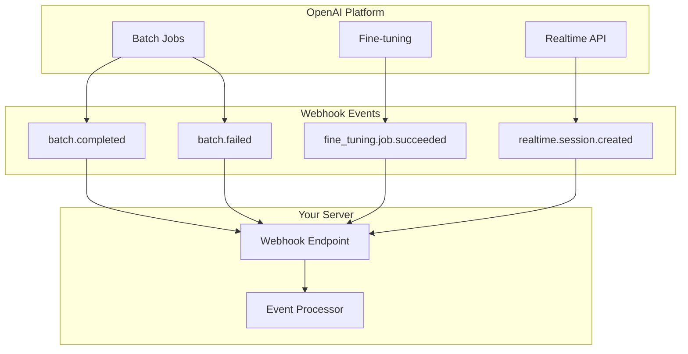
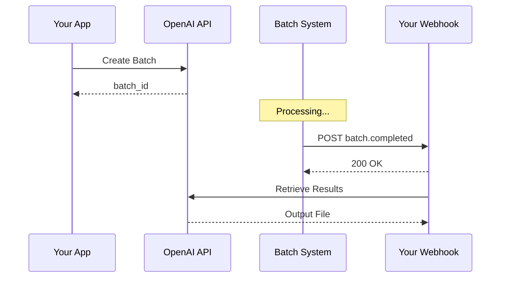

# OpenAI Webhooks API

## Introduction

OpenAI provides webhooks for asynchronous notification of completed operations like batch jobs, fine-tuning, and Realtime API events. This lesson covers OpenAI's specific webhook implementation and patterns.

### What We'll Cover

- Webhook event registration
- Background mode completion webhooks
- Realtime API server-side controls
- Event payload structures

### Prerequisites

- OpenAI API fundamentals
- Previous webhook lessons in this unit
- Batch API basics

---

## OpenAI Webhook Overview



| Event Category | Example Events | Use Case |
|----------------|----------------|----------|
| **Batch** | `batch.completed`, `batch.failed`, `batch.expired` | Long-running batch jobs |
| **Fine-tuning** | `fine_tuning.job.*` | Model training notifications |
| **Files** | `file.created`, `file.deleted` | File upload status |
| **Realtime** | Session and stream events | Voice/realtime interactions |

---

## Webhook Registration

### Registering Webhook Endpoints

```python
from openai import OpenAI
from dataclasses import dataclass
from typing import List, Optional

@dataclass
class WebhookConfig:
    """Configuration for OpenAI webhook."""
    
    url: str
    enabled_events: List[str]
    description: Optional[str] = None
    metadata: Optional[dict] = None


class OpenAIWebhookManager:
    """Manage OpenAI webhook registrations."""
    
    # Available event types
    EVENT_TYPES = {
        "batch": [
            "batch.completed",
            "batch.failed",
            "batch.cancelled",
            "batch.expired"
        ],
        "fine_tuning": [
            "fine_tuning.job.created",
            "fine_tuning.job.running",
            "fine_tuning.job.succeeded",
            "fine_tuning.job.failed",
            "fine_tuning.job.cancelled"
        ],
        "file": [
            "file.created",
            "file.deleted"
        ],
        "realtime": [
            "realtime.session.created",
            "realtime.session.updated"
        ]
    }
    
    def __init__(self, api_key: str = None):
        self.client = OpenAI(api_key=api_key)
        self._webhooks: dict = {}
    
    def register(
        self,
        config: WebhookConfig
    ) -> dict:
        """Register a new webhook endpoint."""
        
        # Note: This is illustrative - check OpenAI's current API
        # for exact webhook registration methods
        
        webhook = self.client.webhooks.create(
            url=config.url,
            enabled_events=config.enabled_events,
            description=config.description,
            metadata=config.metadata or {}
        )
        
        self._webhooks[webhook.id] = webhook
        return webhook
    
    def update(
        self,
        webhook_id: str,
        enabled_events: List[str] = None,
        url: str = None
    ) -> dict:
        """Update webhook configuration."""
        
        update_params = {}
        
        if enabled_events:
            update_params["enabled_events"] = enabled_events
        
        if url:
            update_params["url"] = url
        
        return self.client.webhooks.update(
            webhook_id,
            **update_params
        )
    
    def delete(self, webhook_id: str):
        """Delete webhook."""
        
        self.client.webhooks.delete(webhook_id)
        self._webhooks.pop(webhook_id, None)
    
    def list_all(self) -> List[dict]:
        """List all registered webhooks."""
        
        return list(self.client.webhooks.list())
    
    def rotate_secret(self, webhook_id: str) -> str:
        """Rotate webhook signing secret."""
        
        result = self.client.webhooks.rotate_secret(webhook_id)
        return result.secret


# Register webhooks
manager = OpenAIWebhookManager()

# Register for batch events
batch_webhook = manager.register(WebhookConfig(
    url="https://api.example.com/webhooks/openai/batch",
    enabled_events=[
        "batch.completed",
        "batch.failed",
        "batch.expired"
    ],
    description="Batch job notifications"
))

# Register for fine-tuning events
ft_webhook = manager.register(WebhookConfig(
    url="https://api.example.com/webhooks/openai/fine-tuning",
    enabled_events=[
        "fine_tuning.job.succeeded",
        "fine_tuning.job.failed"
    ],
    description="Fine-tuning notifications"
))

print(f"Batch webhook ID: {batch_webhook.id}")
print(f"Fine-tuning webhook ID: {ft_webhook.id}")
```

---

## Batch Webhook Events

### Batch Completion Flow



### Handling Batch Events

```python
from dataclasses import dataclass
from datetime import datetime
from typing import Optional, List
from enum import Enum

class BatchStatus(Enum):
    """Batch job statuses."""
    
    VALIDATING = "validating"
    IN_PROGRESS = "in_progress"
    COMPLETED = "completed"
    FAILED = "failed"
    CANCELLED = "cancelled"
    EXPIRED = "expired"


@dataclass
class BatchEvent:
    """Parsed batch webhook event."""
    
    id: str
    type: str
    created_at: datetime
    batch_id: str
    status: BatchStatus
    input_file_id: str
    output_file_id: Optional[str]
    error_file_id: Optional[str]
    request_counts: dict
    metadata: dict


class BatchWebhookHandler:
    """Handle OpenAI batch webhook events."""
    
    def __init__(self, client: OpenAI):
        self.client = client
        self._callbacks = {}
    
    def on_event(self, event_type: str):
        """Decorator to register event handler."""
        
        def decorator(func):
            self._callbacks[event_type] = func
            return func
        
        return decorator
    
    def parse_event(self, payload: dict) -> BatchEvent:
        """Parse batch webhook payload."""
        
        data = payload.get("data", {})
        
        return BatchEvent(
            id=payload.get("id"),
            type=payload.get("type"),
            created_at=datetime.fromtimestamp(payload.get("created", 0)),
            batch_id=data.get("id"),
            status=BatchStatus(data.get("status", "unknown")),
            input_file_id=data.get("input_file_id"),
            output_file_id=data.get("output_file_id"),
            error_file_id=data.get("error_file_id"),
            request_counts=data.get("request_counts", {}),
            metadata=data.get("metadata", {})
        )
    
    async def handle(self, payload: dict):
        """Handle incoming batch event."""
        
        event = self.parse_event(payload)
        
        callback = self._callbacks.get(payload.get("type"))
        
        if callback:
            await callback(event)
        else:
            print(f"Unhandled event type: {payload.get('type')}")
    
    async def download_results(
        self,
        event: BatchEvent
    ) -> List[dict]:
        """Download batch results."""
        
        if not event.output_file_id:
            return []
        
        # Download file content
        content = self.client.files.content(event.output_file_id)
        
        # Parse JSONL
        results = []
        for line in content.text.strip().split("\n"):
            if line:
                results.append(json.loads(line))
        
        return results
    
    async def download_errors(
        self,
        event: BatchEvent
    ) -> List[dict]:
        """Download batch errors."""
        
        if not event.error_file_id:
            return []
        
        content = self.client.files.content(event.error_file_id)
        
        errors = []
        for line in content.text.strip().split("\n"):
            if line:
                errors.append(json.loads(line))
        
        return errors


# Usage
handler = BatchWebhookHandler(OpenAI())

@handler.on_event("batch.completed")
async def handle_batch_completed(event: BatchEvent):
    """Handle successful batch completion."""
    
    print(f"Batch {event.batch_id} completed!")
    print(f"Requests: {event.request_counts}")
    
    # Download and process results
    results = await handler.download_results(event)
    
    for result in results:
        custom_id = result.get("custom_id")
        response = result.get("response", {})
        
        if response.get("status_code") == 200:
            content = response["body"]["choices"][0]["message"]["content"]
            print(f"{custom_id}: {content[:100]}...")
        else:
            print(f"{custom_id}: Error - {response.get('error')}")


@handler.on_event("batch.failed")
async def handle_batch_failed(event: BatchEvent):
    """Handle batch failure."""
    
    print(f"Batch {event.batch_id} failed!")
    
    # Download and analyze errors
    errors = await handler.download_errors(event)
    
    for error in errors:
        print(f"Error in {error.get('custom_id')}: {error.get('error')}")


@handler.on_event("batch.expired")
async def handle_batch_expired(event: BatchEvent):
    """Handle batch expiration."""
    
    print(f"Batch {event.batch_id} expired!")
    
    # Check partial results
    if event.output_file_id:
        results = await handler.download_results(event)
        print(f"Partial results: {len(results)} items")


# Flask integration
@app.route("/webhooks/openai/batch", methods=["POST"])
async def openai_batch_webhook():
    """Receive OpenAI batch webhooks."""
    
    # Verify signature first (see webhook security lesson)
    
    payload = request.json
    await handler.handle(payload)
    
    return "", 200
```

---

## Fine-Tuning Webhooks

```python
from dataclasses import dataclass
from typing import Optional, List

@dataclass
class FineTuningEvent:
    """Parsed fine-tuning webhook event."""
    
    id: str
    type: str
    job_id: str
    status: str
    model: str
    fine_tuned_model: Optional[str]
    training_file: str
    validation_file: Optional[str]
    hyperparameters: dict
    trained_tokens: Optional[int]
    error: Optional[dict]


class FineTuningWebhookHandler:
    """Handle fine-tuning webhook events."""
    
    def __init__(self, client: OpenAI):
        self.client = client
    
    def parse_event(self, payload: dict) -> FineTuningEvent:
        """Parse fine-tuning event."""
        
        data = payload.get("data", {})
        
        return FineTuningEvent(
            id=payload.get("id"),
            type=payload.get("type"),
            job_id=data.get("id"),
            status=data.get("status"),
            model=data.get("model"),
            fine_tuned_model=data.get("fine_tuned_model"),
            training_file=data.get("training_file"),
            validation_file=data.get("validation_file"),
            hyperparameters=data.get("hyperparameters", {}),
            trained_tokens=data.get("trained_tokens"),
            error=data.get("error")
        )
    
    async def handle_succeeded(self, event: FineTuningEvent):
        """Handle successful fine-tuning."""
        
        print(f"Fine-tuning complete: {event.job_id}")
        print(f"New model: {event.fine_tuned_model}")
        print(f"Trained tokens: {event.trained_tokens}")
        
        # Test the new model
        response = self.client.chat.completions.create(
            model=event.fine_tuned_model,
            messages=[
                {"role": "user", "content": "Test message"}
            ]
        )
        
        print(f"Test response: {response.choices[0].message.content}")
        
        # Notify team
        await self.send_notification(
            f"🎉 Fine-tuning complete!\n"
            f"Model: {event.fine_tuned_model}\n"
            f"Tokens: {event.trained_tokens}"
        )
    
    async def handle_failed(self, event: FineTuningEvent):
        """Handle failed fine-tuning."""
        
        error = event.error or {}
        
        print(f"Fine-tuning failed: {event.job_id}")
        print(f"Error: {error.get('message')}")
        
        # Alert team
        await self.send_alert(
            f"❌ Fine-tuning failed!\n"
            f"Job: {event.job_id}\n"
            f"Error: {error.get('message')}"
        )
    
    async def send_notification(self, message: str):
        """Send notification (implement for your system)."""
        print(f"Notification: {message}")
    
    async def send_alert(self, message: str):
        """Send alert (implement for your system)."""
        print(f"ALERT: {message}")


# Flask integration
ft_handler = FineTuningWebhookHandler(OpenAI())

@app.route("/webhooks/openai/fine-tuning", methods=["POST"])
async def openai_ft_webhook():
    """Receive fine-tuning webhooks."""
    
    payload = request.json
    event = ft_handler.parse_event(payload)
    
    if payload.get("type") == "fine_tuning.job.succeeded":
        await ft_handler.handle_succeeded(event)
    
    elif payload.get("type") == "fine_tuning.job.failed":
        await ft_handler.handle_failed(event)
    
    return "", 200
```

---

## Realtime API Webhooks

### Server-Side Event Controls

```python
from dataclasses import dataclass, field
from typing import Optional, Dict, Any, List
from enum import Enum
import websockets
import asyncio
import json

class RealtimeEventType(Enum):
    """Realtime API event types."""
    
    # Session events
    SESSION_CREATED = "session.created"
    SESSION_UPDATED = "session.updated"
    
    # Conversation events
    CONVERSATION_CREATED = "conversation.created"
    CONVERSATION_ITEM_CREATED = "conversation.item.created"
    
    # Response events
    RESPONSE_CREATED = "response.created"
    RESPONSE_DONE = "response.done"
    RESPONSE_AUDIO_DELTA = "response.audio.delta"
    RESPONSE_AUDIO_DONE = "response.audio.done"
    
    # Input events
    INPUT_AUDIO_BUFFER_COMMITTED = "input_audio_buffer.committed"
    INPUT_AUDIO_BUFFER_SPEECH_STARTED = "input_audio_buffer.speech_started"
    INPUT_AUDIO_BUFFER_SPEECH_STOPPED = "input_audio_buffer.speech_stopped"
    
    # Error events
    ERROR = "error"


@dataclass
class RealtimeSession:
    """Realtime API session."""
    
    id: str
    model: str
    modalities: List[str]
    voice: str
    instructions: str
    input_audio_format: str
    output_audio_format: str
    tools: List[dict] = field(default_factory=list)


class RealtimeWebhookHandler:
    """Handle Realtime API server-side events."""
    
    def __init__(self, api_key: str):
        self.api_key = api_key
        self.active_sessions: Dict[str, RealtimeSession] = {}
        self._event_handlers = {}
    
    def on(self, event_type: RealtimeEventType):
        """Register event handler."""
        
        def decorator(func):
            self._event_handlers[event_type.value] = func
            return func
        
        return decorator
    
    async def connect_session(
        self,
        session_config: dict = None
    ) -> str:
        """Create and connect to a Realtime session."""
        
        url = "wss://api.openai.com/v1/realtime"
        
        headers = {
            "Authorization": f"Bearer {self.api_key}",
            "OpenAI-Beta": "realtime=v1"
        }
        
        async with websockets.connect(url, extra_headers=headers) as ws:
            # Send session configuration
            if session_config:
                await ws.send(json.dumps({
                    "type": "session.update",
                    "session": session_config
                }))
            
            # Process events
            async for message in ws:
                event = json.loads(message)
                await self._handle_event(event)
        
        return "session_ended"
    
    async def _handle_event(self, event: dict):
        """Route event to handler."""
        
        event_type = event.get("type")
        
        # Update session state
        if event_type == "session.created":
            session_data = event.get("session", {})
            session = RealtimeSession(
                id=session_data.get("id"),
                model=session_data.get("model"),
                modalities=session_data.get("modalities", []),
                voice=session_data.get("voice"),
                instructions=session_data.get("instructions", ""),
                input_audio_format=session_data.get("input_audio_format"),
                output_audio_format=session_data.get("output_audio_format"),
                tools=session_data.get("tools", [])
            )
            self.active_sessions[session.id] = session
        
        # Call registered handler
        handler = self._event_handlers.get(event_type)
        
        if handler:
            await handler(event)
        else:
            print(f"Unhandled event: {event_type}")
    
    def get_active_sessions(self) -> List[str]:
        """Get list of active session IDs."""
        
        return list(self.active_sessions.keys())


# Usage
realtime_handler = RealtimeWebhookHandler(api_key="sk-...")

@realtime_handler.on(RealtimeEventType.SESSION_CREATED)
async def on_session_created(event: dict):
    """Handle session creation."""
    
    session = event.get("session", {})
    print(f"Session created: {session.get('id')}")
    print(f"Model: {session.get('model')}")
    print(f"Voice: {session.get('voice')}")


@realtime_handler.on(RealtimeEventType.RESPONSE_DONE)
async def on_response_done(event: dict):
    """Handle completed response."""
    
    response = event.get("response", {})
    
    for item in response.get("output", []):
        if item.get("type") == "message":
            for content in item.get("content", []):
                if content.get("type") == "text":
                    print(f"Response: {content.get('text')}")


@realtime_handler.on(RealtimeEventType.ERROR)
async def on_error(event: dict):
    """Handle errors."""
    
    error = event.get("error", {})
    print(f"Error: {error.get('message')}")
    print(f"Code: {error.get('code')}")
```

### Realtime Server-Side Controls

```python
import asyncio
from typing import Optional

class RealtimeSessionController:
    """Server-side controls for Realtime sessions."""
    
    def __init__(self, websocket):
        self.ws = websocket
        self.session_id: Optional[str] = None
    
    async def update_session(
        self,
        instructions: str = None,
        voice: str = None,
        tools: list = None
    ):
        """Update session configuration."""
        
        session_update = {}
        
        if instructions:
            session_update["instructions"] = instructions
        
        if voice:
            session_update["voice"] = voice
        
        if tools is not None:
            session_update["tools"] = tools
        
        await self.ws.send(json.dumps({
            "type": "session.update",
            "session": session_update
        }))
    
    async def send_text(self, text: str):
        """Send text input to conversation."""
        
        await self.ws.send(json.dumps({
            "type": "conversation.item.create",
            "item": {
                "type": "message",
                "role": "user",
                "content": [{
                    "type": "input_text",
                    "text": text
                }]
            }
        }))
        
        # Trigger response
        await self.ws.send(json.dumps({
            "type": "response.create"
        }))
    
    async def send_function_result(
        self,
        call_id: str,
        result: str
    ):
        """Send function call result."""
        
        await self.ws.send(json.dumps({
            "type": "conversation.item.create",
            "item": {
                "type": "function_call_output",
                "call_id": call_id,
                "output": result
            }
        }))
        
        # Continue response
        await self.ws.send(json.dumps({
            "type": "response.create"
        }))
    
    async def cancel_response(self):
        """Cancel current response generation."""
        
        await self.ws.send(json.dumps({
            "type": "response.cancel"
        }))
    
    async def commit_audio_buffer(self):
        """Commit pending audio input."""
        
        await self.ws.send(json.dumps({
            "type": "input_audio_buffer.commit"
        }))
    
    async def clear_audio_buffer(self):
        """Clear audio input buffer."""
        
        await self.ws.send(json.dumps({
            "type": "input_audio_buffer.clear"
        }))


# Server-side session management
class RealtimeSessionManager:
    """Manage multiple Realtime sessions."""
    
    def __init__(self, api_key: str):
        self.api_key = api_key
        self.controllers: Dict[str, RealtimeSessionController] = {}
    
    async def create_session(
        self,
        session_id: str,
        config: dict = None
    ) -> RealtimeSessionController:
        """Create new Realtime session."""
        
        url = "wss://api.openai.com/v1/realtime"
        
        headers = {
            "Authorization": f"Bearer {self.api_key}",
            "OpenAI-Beta": "realtime=v1"
        }
        
        ws = await websockets.connect(url, extra_headers=headers)
        
        controller = RealtimeSessionController(ws)
        controller.session_id = session_id
        
        self.controllers[session_id] = controller
        
        if config:
            await controller.update_session(**config)
        
        return controller
    
    def get_controller(
        self,
        session_id: str
    ) -> Optional[RealtimeSessionController]:
        """Get controller for session."""
        
        return self.controllers.get(session_id)
    
    async def broadcast_update(
        self,
        instructions: str
    ):
        """Update all active sessions."""
        
        for controller in self.controllers.values():
            await controller.update_session(instructions=instructions)


# Flask API for server-side control
session_manager = RealtimeSessionManager(api_key="sk-...")

@app.route("/realtime/sessions", methods=["POST"])
async def create_realtime_session():
    """Create new Realtime session."""
    
    data = request.json
    session_id = data.get("session_id", str(uuid.uuid4()))
    
    controller = await session_manager.create_session(
        session_id,
        config=data.get("config")
    )
    
    return jsonify({
        "session_id": session_id,
        "status": "created"
    })


@app.route("/realtime/sessions/<session_id>/message", methods=["POST"])
async def send_message(session_id: str):
    """Send message to session."""
    
    controller = session_manager.get_controller(session_id)
    
    if not controller:
        return {"error": "Session not found"}, 404
    
    text = request.json.get("text")
    await controller.send_text(text)
    
    return {"status": "sent"}


@app.route("/realtime/sessions/<session_id>/cancel", methods=["POST"])
async def cancel_response(session_id: str):
    """Cancel current response."""
    
    controller = session_manager.get_controller(session_id)
    
    if not controller:
        return {"error": "Session not found"}, 404
    
    await controller.cancel_response()
    
    return {"status": "cancelled"}
```

---

## Complete OpenAI Webhook Integration

```python
from dataclasses import dataclass
from typing import Dict, Any, Optional, Callable
from enum import Enum
import hmac
import hashlib

class OpenAIEventCategory(Enum):
    """OpenAI webhook event categories."""
    
    BATCH = "batch"
    FINE_TUNING = "fine_tuning"
    FILE = "file"
    REALTIME = "realtime"


@dataclass
class OpenAIWebhookConfig:
    """Configuration for OpenAI webhook handler."""
    
    webhook_secret: str
    batch_handler: Optional[Callable] = None
    fine_tuning_handler: Optional[Callable] = None
    file_handler: Optional[Callable] = None


class OpenAIWebhookRouter:
    """Unified router for all OpenAI webhooks."""
    
    def __init__(self, config: OpenAIWebhookConfig):
        self.config = config
        self._handlers: Dict[str, Callable] = {}
        
        # Register default handlers
        if config.batch_handler:
            self.register_category(
                OpenAIEventCategory.BATCH,
                config.batch_handler
            )
        
        if config.fine_tuning_handler:
            self.register_category(
                OpenAIEventCategory.FINE_TUNING,
                config.fine_tuning_handler
            )
    
    def register_category(
        self,
        category: OpenAIEventCategory,
        handler: Callable
    ):
        """Register handler for event category."""
        
        self._handlers[category.value] = handler
    
    def register_event(
        self,
        event_type: str,
        handler: Callable
    ):
        """Register handler for specific event type."""
        
        self._handlers[event_type] = handler
    
    def verify_signature(
        self,
        payload: bytes,
        signature: str,
        timestamp: str
    ) -> bool:
        """Verify OpenAI webhook signature."""
        
        # OpenAI uses timestamp.payload format
        signed_payload = f"{timestamp}.{payload.decode()}"
        
        expected = hmac.new(
            self.config.webhook_secret.encode(),
            signed_payload.encode(),
            hashlib.sha256
        ).hexdigest()
        
        return hmac.compare_digest(expected, signature)
    
    def get_category(self, event_type: str) -> Optional[str]:
        """Get category from event type."""
        
        if event_type.startswith("batch."):
            return "batch"
        elif event_type.startswith("fine_tuning."):
            return "fine_tuning"
        elif event_type.startswith("file."):
            return "file"
        elif event_type.startswith("realtime."):
            return "realtime"
        
        return None
    
    async def route(self, payload: dict) -> dict:
        """Route event to appropriate handler."""
        
        event_type = payload.get("type")
        
        # Try specific handler first
        if event_type in self._handlers:
            return await self._handlers[event_type](payload)
        
        # Try category handler
        category = self.get_category(event_type)
        
        if category and category in self._handlers:
            return await self._handlers[category](payload)
        
        # No handler found
        return {
            "status": "unhandled",
            "event_type": event_type
        }


# Flask integration
config = OpenAIWebhookConfig(
    webhook_secret=os.environ.get("OPENAI_WEBHOOK_SECRET"),
)

router = OpenAIWebhookRouter(config)


@router.register_event("batch.completed")
async def handle_batch_completed(payload: dict):
    """Handle batch completion."""
    
    data = payload.get("data", {})
    batch_id = data.get("id")
    
    print(f"Batch completed: {batch_id}")
    
    # Process results
    # ...
    
    return {"processed": batch_id}


@router.register_event("fine_tuning.job.succeeded")
async def handle_ft_succeeded(payload: dict):
    """Handle fine-tuning success."""
    
    data = payload.get("data", {})
    model = data.get("fine_tuned_model")
    
    print(f"New model available: {model}")
    
    return {"model": model}


@app.route("/webhooks/openai", methods=["POST"])
async def openai_webhook():
    """Unified OpenAI webhook endpoint."""
    
    # Verify signature
    signature = request.headers.get("X-Signature-256", "")
    timestamp = request.headers.get("X-Timestamp", "")
    
    if signature.startswith("sha256="):
        signature = signature[7:]
    
    if not router.verify_signature(request.data, signature, timestamp):
        return {"error": "Invalid signature"}, 401
    
    # Route event
    result = await router.route(request.json)
    
    return jsonify(result), 200
```

---

## Hands-on Exercise

### Your Task

Build a batch job monitoring dashboard that uses webhooks.

### Requirements

1. Register webhook for batch events
2. Track batch status in real-time
3. Display progress and results
4. Send notifications on completion/failure

### Expected Result

```python
monitor = BatchMonitor()

# Start batch job
batch_id = monitor.submit_batch(requests)

# Dashboard shows:
# - Batch status: in_progress
# - Progress: 45/100 complete
# - On completion: notification sent
```

<details>
<summary>💡 Hints</summary>

- Store batch metadata when created
- Update on each webhook event
- Use request_counts for progress
- Implement notification channels
</details>

<details>
<summary>✅ Solution</summary>

```python
from dataclasses import dataclass, field
from datetime import datetime
from typing import Dict, List, Optional
from enum import Enum
import json
import sqlite3

@dataclass
class BatchJobInfo:
    """Information about a batch job."""
    
    id: str
    created_at: datetime
    status: str
    total_requests: int
    completed_requests: int = 0
    failed_requests: int = 0
    input_file_id: Optional[str] = None
    output_file_id: Optional[str] = None
    error_file_id: Optional[str] = None
    metadata: Dict = field(default_factory=dict)


class BatchMonitor:
    """Monitor batch jobs via webhooks."""
    
    def __init__(
        self,
        client: OpenAI,
        db_path: str = "batch_monitor.db"
    ):
        self.client = client
        self.conn = sqlite3.connect(db_path, check_same_thread=False)
        self._init_db()
        self._notification_handlers = []
    
    def _init_db(self):
        self.conn.execute("""
            CREATE TABLE IF NOT EXISTS batches (
                id TEXT PRIMARY KEY,
                created_at TIMESTAMP,
                status TEXT,
                total_requests INTEGER,
                completed_requests INTEGER,
                failed_requests INTEGER,
                input_file_id TEXT,
                output_file_id TEXT,
                error_file_id TEXT,
                metadata TEXT,
                updated_at TIMESTAMP
            )
        """)
        self.conn.commit()
    
    def add_notification_handler(self, handler):
        """Add notification handler."""
        self._notification_handlers.append(handler)
    
    async def _notify(self, message: str, level: str = "info"):
        """Send notification."""
        for handler in self._notification_handlers:
            await handler(message, level)
    
    def submit_batch(
        self,
        requests: List[dict],
        metadata: dict = None
    ) -> str:
        """Submit batch and start monitoring."""
        
        # Create JSONL file
        jsonl_content = "\n".join(json.dumps(r) for r in requests)
        
        # Upload file
        file = self.client.files.create(
            file=jsonl_content.encode(),
            purpose="batch"
        )
        
        # Create batch
        batch = self.client.batches.create(
            input_file_id=file.id,
            endpoint="/v1/chat/completions",
            completion_window="24h",
            metadata=metadata or {}
        )
        
        # Store in database
        self.conn.execute(
            """INSERT INTO batches 
               (id, created_at, status, total_requests, completed_requests,
                failed_requests, input_file_id, metadata, updated_at)
               VALUES (?, ?, ?, ?, 0, 0, ?, ?, ?)""",
            (
                batch.id,
                datetime.now().isoformat(),
                batch.status,
                len(requests),
                file.id,
                json.dumps(metadata or {}),
                datetime.now().isoformat()
            )
        )
        self.conn.commit()
        
        return batch.id
    
    async def handle_webhook(self, payload: dict):
        """Handle batch webhook event."""
        
        event_type = payload.get("type")
        data = payload.get("data", {})
        batch_id = data.get("id")
        
        if not batch_id:
            return
        
        # Update database
        counts = data.get("request_counts", {})
        
        self.conn.execute(
            """UPDATE batches SET
               status = ?,
               completed_requests = ?,
               failed_requests = ?,
               output_file_id = ?,
               error_file_id = ?,
               updated_at = ?
               WHERE id = ?""",
            (
                data.get("status"),
                counts.get("completed", 0),
                counts.get("failed", 0),
                data.get("output_file_id"),
                data.get("error_file_id"),
                datetime.now().isoformat(),
                batch_id
            )
        )
        self.conn.commit()
        
        # Send notifications
        if event_type == "batch.completed":
            await self._notify(
                f"✅ Batch {batch_id} completed! "
                f"{counts.get('completed', 0)} requests processed.",
                level="success"
            )
        
        elif event_type == "batch.failed":
            await self._notify(
                f"❌ Batch {batch_id} failed! "
                f"Check error file for details.",
                level="error"
            )
        
        elif event_type == "batch.expired":
            await self._notify(
                f"⏰ Batch {batch_id} expired! "
                f"Partial results may be available.",
                level="warning"
            )
    
    def get_status(self, batch_id: str) -> Optional[BatchJobInfo]:
        """Get batch status."""
        
        cursor = self.conn.execute(
            "SELECT * FROM batches WHERE id = ?",
            (batch_id,)
        )
        
        row = cursor.fetchone()
        if not row:
            return None
        
        return BatchJobInfo(
            id=row[0],
            created_at=datetime.fromisoformat(row[1]),
            status=row[2],
            total_requests=row[3],
            completed_requests=row[4],
            failed_requests=row[5],
            input_file_id=row[6],
            output_file_id=row[7],
            error_file_id=row[8],
            metadata=json.loads(row[9]) if row[9] else {}
        )
    
    def get_all_batches(
        self,
        status: str = None,
        limit: int = 50
    ) -> List[BatchJobInfo]:
        """Get all batches."""
        
        query = "SELECT * FROM batches"
        params = []
        
        if status:
            query += " WHERE status = ?"
            params.append(status)
        
        query += " ORDER BY created_at DESC LIMIT ?"
        params.append(limit)
        
        cursor = self.conn.execute(query, params)
        
        return [
            BatchJobInfo(
                id=row[0],
                created_at=datetime.fromisoformat(row[1]),
                status=row[2],
                total_requests=row[3],
                completed_requests=row[4],
                failed_requests=row[5],
                input_file_id=row[6],
                output_file_id=row[7],
                error_file_id=row[8],
                metadata=json.loads(row[9]) if row[9] else {}
            )
            for row in cursor.fetchall()
        ]
    
    def get_dashboard_data(self) -> dict:
        """Get data for dashboard."""
        
        batches = self.get_all_batches(limit=100)
        
        return {
            "total_batches": len(batches),
            "in_progress": sum(1 for b in batches if b.status == "in_progress"),
            "completed": sum(1 for b in batches if b.status == "completed"),
            "failed": sum(1 for b in batches if b.status == "failed"),
            "total_requests": sum(b.total_requests for b in batches),
            "completed_requests": sum(b.completed_requests for b in batches),
            "batches": [
                {
                    "id": b.id,
                    "status": b.status,
                    "progress": f"{b.completed_requests}/{b.total_requests}",
                    "created": b.created_at.isoformat()
                }
                for b in batches[:20]
            ]
        }


# Flask integration
monitor = BatchMonitor(OpenAI())

# Add notification handlers
async def console_notify(message: str, level: str):
    print(f"[{level.upper()}] {message}")

monitor.add_notification_handler(console_notify)


@app.route("/webhooks/openai/batch", methods=["POST"])
async def batch_webhook():
    """Receive batch webhooks."""
    
    await monitor.handle_webhook(request.json)
    return "", 200


@app.route("/api/batches", methods=["POST"])
def submit_batch():
    """Submit new batch."""
    
    requests = request.json.get("requests", [])
    metadata = request.json.get("metadata")
    
    batch_id = monitor.submit_batch(requests, metadata)
    
    return jsonify({"batch_id": batch_id})


@app.route("/api/batches/<batch_id>")
def get_batch_status(batch_id: str):
    """Get batch status."""
    
    info = monitor.get_status(batch_id)
    
    if not info:
        return {"error": "Not found"}, 404
    
    return jsonify({
        "id": info.id,
        "status": info.status,
        "progress": {
            "total": info.total_requests,
            "completed": info.completed_requests,
            "failed": info.failed_requests
        },
        "created_at": info.created_at.isoformat()
    })


@app.route("/api/dashboard")
def dashboard():
    """Get dashboard data."""
    
    return jsonify(monitor.get_dashboard_data())


# Test it
async def test_monitor():
    # Submit batch
    requests = [
        {
            "custom_id": f"req_{i}",
            "method": "POST",
            "url": "/v1/chat/completions",
            "body": {
                "model": "gpt-4o-mini",
                "messages": [{"role": "user", "content": f"Test {i}"}]
            }
        }
        for i in range(10)
    ]
    
    batch_id = monitor.submit_batch(requests, {"test": True})
    print(f"Submitted: {batch_id}")
    
    # Check status
    info = monitor.get_status(batch_id)
    print(f"Status: {info.status}")
    
    # Get dashboard
    data = monitor.get_dashboard_data()
    print(f"Dashboard: {data}")
```

</details>

---

## Summary

✅ Register webhooks for batch, fine-tuning, and file events  
✅ Parse event payloads to extract relevant data  
✅ Handle Realtime API events for voice applications  
✅ Use server-side controls for session management  
✅ Build monitoring dashboards for long-running operations

**Next:** [Long-Running Operations](../13-long-running-operations.md)

---

## Further Reading

- [OpenAI Batch API](https://platform.openai.com/docs/guides/batch) — Official batch documentation
- [OpenAI Fine-tuning](https://platform.openai.com/docs/guides/fine-tuning) — Fine-tuning guide
- [OpenAI Realtime API](https://platform.openai.com/docs/guides/realtime) — Realtime API reference

<!-- 
Sources Consulted:
- OpenAI Batch API: https://platform.openai.com/docs/guides/batch
- OpenAI Fine-tuning: https://platform.openai.com/docs/guides/fine-tuning
- OpenAI Realtime API: https://platform.openai.com/docs/guides/realtime
-->
