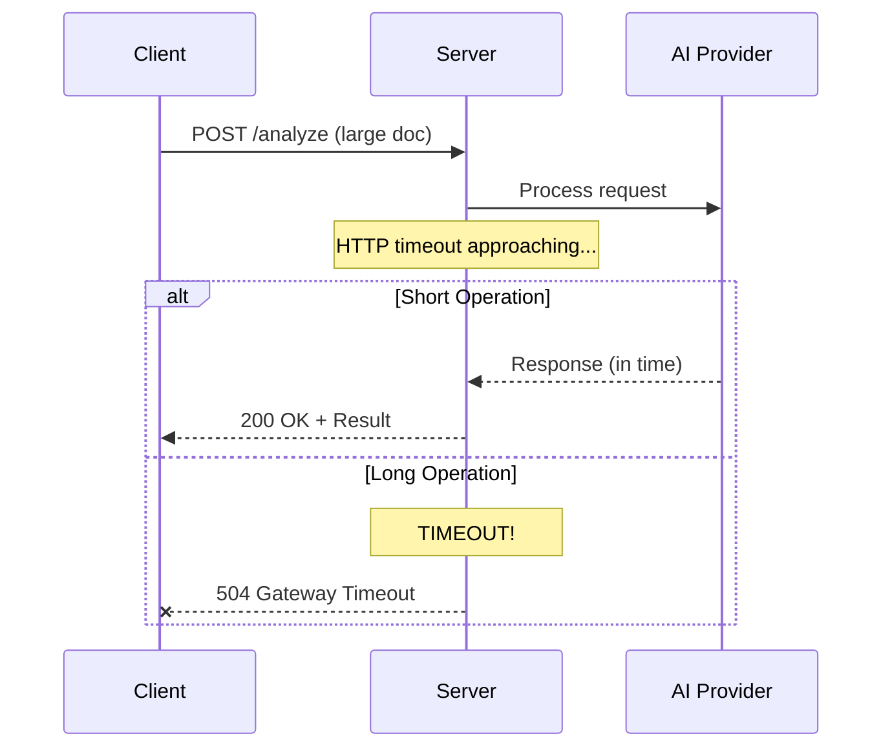
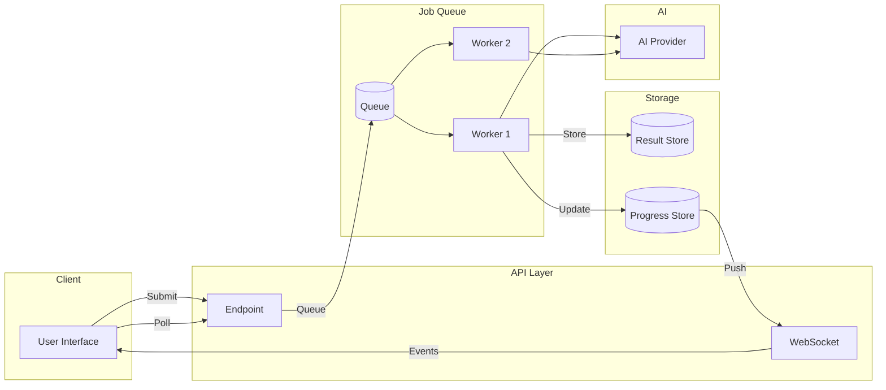

# Long-Running Operations

## Overview

AI operations often exceed standard HTTP timeout limits—large document processing, complex analysis, or generation tasks can take minutes rather than seconds. This lesson covers patterns for handling these long-running operations reliably.

### What You'll Learn

| File | Topic | Description |
|------|-------|-------------|
| [01-timeout-handling.md](./01-timeout-handling.md) | Timeout Handling | Detecting timeouts, offloading to background, serverless limits |
| [02-job-queues.md](./02-job-queues.md) | Job Queue Patterns | Queue selection, job tracking, worker implementation |
| [03-progress-tracking.md](./03-progress-tracking.md) | Progress Tracking | Progress events, stages, UI indicators |
| [04-cancellation.md](./04-cancellation.md) | Cancellation Support | User cancellation, graceful termination, cleanup |
| [05-result-storage.md](./05-result-storage.md) | Result Storage | Temporary storage, expiration, retrieval patterns |
| [06-background-mode.md](./06-background-mode.md) | Background Mode | OpenAI background parameter, async retrieval, Deep Research |

### Prerequisites

- Webhook patterns (previous lesson)
- Basic queueing concepts
- Async programming fundamentals

---

## The Long-Running Operation Challenge



### Why Operations Take Long

| Cause | Example | Typical Duration |
|-------|---------|------------------|
| Large input | 100-page document analysis | 30-120 seconds |
| Complex reasoning | Multi-step agent workflow | 60-300 seconds |
| Batch processing | 1000 item classification | 5-30 minutes |
| Research tasks | Deep web research | 2-15 minutes |
| Generation | Long-form content | 30-90 seconds |

### Common Timeout Limits

| Platform | Default Timeout | Maximum |
|----------|-----------------|---------|
| AWS Lambda | 3s | 15 minutes |
| Vercel Functions | 10s | 300s (Pro) |
| Cloudflare Workers | 30s | 6 minutes |
| AWS API Gateway | 29s | 29s |
| Nginx | 60s | Configurable |

---

## Quick Start: Background Job Pattern

```python
from dataclasses import dataclass
from datetime import datetime
from typing import Optional
from enum import Enum
import uuid

class JobStatus(Enum):
    PENDING = "pending"
    RUNNING = "running"
    COMPLETED = "completed"
    FAILED = "failed"
    CANCELLED = "cancelled"


@dataclass
class Job:
    id: str
    status: JobStatus
    created_at: datetime
    progress: float = 0.0
    result: Optional[dict] = None
    error: Optional[str] = None


# Simple in-memory job store (use Redis/database in production)
jobs: dict[str, Job] = {}


def create_job(payload: dict) -> str:
    """Create a new background job."""
    
    job_id = str(uuid.uuid4())
    
    jobs[job_id] = Job(
        id=job_id,
        status=JobStatus.PENDING,
        created_at=datetime.now()
    )
    
    # Queue for background processing
    queue_job(job_id, payload)
    
    return job_id


def get_job(job_id: str) -> Optional[Job]:
    """Get job status."""
    return jobs.get(job_id)


# Flask endpoints
@app.route("/api/analyze", methods=["POST"])
def start_analysis():
    """Start long-running analysis."""
    
    job_id = create_job(request.json)
    
    return jsonify({
        "job_id": job_id,
        "status": "pending",
        "status_url": f"/api/jobs/{job_id}"
    }), 202  # Accepted


@app.route("/api/jobs/<job_id>")
def check_job(job_id: str):
    """Check job status."""
    
    job = get_job(job_id)
    
    if not job:
        return {"error": "Job not found"}, 404
    
    return jsonify({
        "id": job.id,
        "status": job.status.value,
        "progress": job.progress,
        "result": job.result,
        "error": job.error
    })
```

---

## Architecture Overview



---

## Key Patterns Summary

| Pattern | Use When | Complexity |
|---------|----------|------------|
| **Polling** | Simple apps, low traffic | Low |
| **WebSocket** | Real-time updates needed | Medium |
| **Server-Sent Events** | One-way updates, simpler than WS | Low-Medium |
| **Webhooks** | Server-to-server, decoupled | Medium |
| **Background Mode** | Using OpenAI's built-in support | Low |

---

## Lesson Navigation

1. **[Timeout Handling](./01-timeout-handling.md)** — Detect and handle timeouts
2. **[Job Queues](./02-job-queues.md)** — Queue and process background jobs
3. **[Progress Tracking](./03-progress-tracking.md)** — Track and display progress
4. **[Cancellation](./04-cancellation.md)** — Cancel running operations
5. **[Result Storage](./05-result-storage.md)** — Store and retrieve results
6. **[Background Mode](./06-background-mode.md)** — OpenAI's background parameter

---

## Further Reading

- [Temporal.io](https://temporal.io/) — Durable workflow execution
- [Celery](https://docs.celeryq.dev/) — Python task queue
- [BullMQ](https://docs.bullmq.io/) — Node.js job queue
