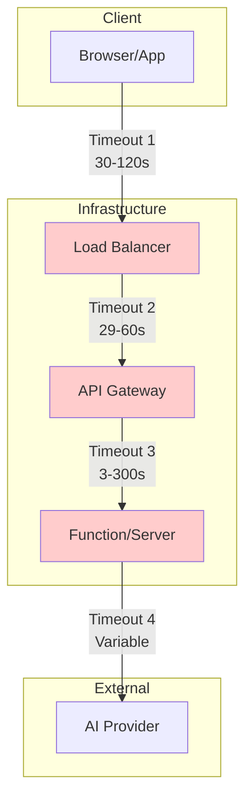

# Timeout Handling

## Introduction

HTTP timeouts are the primary challenge with long-running AI operations. Understanding timeout sources and implementing proper handling ensures reliable user experiences even when operations take minutes.

### What We'll Cover

- Timeout detection and sources
- Background job offloading
- Serverless function limits
- Edge function considerations

### Prerequisites

- HTTP fundamentals
- Basic async programming
- Understanding of cloud functions

---

## Timeout Sources



| Layer | Typical Timeout | Control Level |
|-------|-----------------|---------------|
| Browser fetch | 30-300s | Full control |
| Load Balancer | 60s | Configurable |
| API Gateway | 29s (AWS) | Limited |
| Function Runtime | 3-900s | Platform-dependent |
| AI Provider | 60-600s | No control |

---

## Timeout Detection

```python
import asyncio
import time
from dataclasses import dataclass
from typing import Optional, Callable, Any
from enum import Enum

class TimeoutType(Enum):
    """Types of timeouts."""
    
    CLIENT = "client"  # Client-side timeout
    GATEWAY = "gateway"  # API gateway timeout
    FUNCTION = "function"  # Function execution limit
    PROVIDER = "provider"  # AI provider timeout


@dataclass
class TimeoutConfig:
    """Timeout configuration."""
    
    # Known limits
    gateway_timeout: float = 29.0  # AWS API Gateway
    function_timeout: float = 300.0  # Lambda max
    provider_timeout: float = 600.0  # OpenAI
    
    # Safety margins
    gateway_margin: float = 5.0
    function_margin: float = 10.0
    
    @property
    def safe_sync_limit(self) -> float:
        """Maximum safe synchronous operation time."""
        return self.gateway_timeout - self.gateway_margin
    
    @property
    def safe_async_limit(self) -> float:
        """Maximum safe async operation time."""
        return self.function_timeout - self.function_margin


class TimeoutMonitor:
    """Monitor operation duration against timeouts."""
    
    def __init__(self, config: TimeoutConfig = None):
        self.config = config or TimeoutConfig()
        self.start_time: Optional[float] = None
    
    def start(self):
        """Start timing."""
        self.start_time = time.time()
    
    @property
    def elapsed(self) -> float:
        """Get elapsed time in seconds."""
        if not self.start_time:
            return 0
        return time.time() - self.start_time
    
    @property
    def remaining_sync(self) -> float:
        """Remaining time for sync operations."""
        return max(0, self.config.safe_sync_limit - self.elapsed)
    
    @property
    def remaining_async(self) -> float:
        """Remaining time for async operations."""
        return max(0, self.config.safe_async_limit - self.elapsed)
    
    def should_offload(self) -> bool:
        """Check if operation should be offloaded to background."""
        return self.remaining_sync < 5.0
    
    def will_timeout(self, estimated_duration: float) -> bool:
        """Check if operation will likely timeout."""
        return estimated_duration > self.remaining_sync


class TimeoutError(Exception):
    """Custom timeout error with context."""
    
    def __init__(
        self,
        message: str,
        timeout_type: TimeoutType,
        elapsed: float,
        limit: float
    ):
        super().__init__(message)
        self.timeout_type = timeout_type
        self.elapsed = elapsed
        self.limit = limit


async def with_timeout(
    coro,
    timeout: float,
    timeout_type: TimeoutType = TimeoutType.FUNCTION
) -> Any:
    """Execute coroutine with timeout."""
    
    start = time.time()
    
    try:
        return await asyncio.wait_for(coro, timeout=timeout)
    except asyncio.TimeoutError:
        elapsed = time.time() - start
        raise TimeoutError(
            f"Operation timed out after {elapsed:.1f}s",
            timeout_type=timeout_type,
            elapsed=elapsed,
            limit=timeout
        )


# Usage
async def process_with_monitoring():
    """Process with timeout monitoring."""
    
    monitor = TimeoutMonitor()
    monitor.start()
    
    # Check before expensive operation
    if monitor.should_offload():
        # Not enough time - offload to background
        return await offload_to_background()
    
    # Proceed with operation
    try:
        result = await with_timeout(
            expensive_ai_operation(),
            timeout=monitor.remaining_sync
        )
        return result
    
    except TimeoutError as e:
        # Handle gracefully
        return {
            "status": "timeout",
            "message": str(e),
            "elapsed": e.elapsed
        }
```

---

## Background Job Offloading

### When to Offload

```python
from dataclasses import dataclass
from typing import Callable

@dataclass
class OperationEstimate:
    """Estimated operation characteristics."""
    
    min_duration: float
    max_duration: float
    average_duration: float
    confidence: float = 0.8


class OffloadDecider:
    """Decide whether to offload to background."""
    
    def __init__(
        self,
        sync_limit: float = 25.0,
        offload_threshold: float = 0.7
    ):
        self.sync_limit = sync_limit
        self.offload_threshold = offload_threshold
        
        # Track historical durations
        self.operation_history: dict[str, list[float]] = {}
    
    def record_duration(
        self,
        operation_type: str,
        duration: float
    ):
        """Record operation duration for estimation."""
        
        if operation_type not in self.operation_history:
            self.operation_history[operation_type] = []
        
        history = self.operation_history[operation_type]
        history.append(duration)
        
        # Keep last 100 samples
        if len(history) > 100:
            self.operation_history[operation_type] = history[-100:]
    
    def estimate(
        self,
        operation_type: str
    ) -> OperationEstimate:
        """Estimate operation duration."""
        
        history = self.operation_history.get(operation_type, [])
        
        if not history:
            # No data - assume potentially long
            return OperationEstimate(
                min_duration=5.0,
                max_duration=60.0,
                average_duration=30.0,
                confidence=0.3
            )
        
        return OperationEstimate(
            min_duration=min(history),
            max_duration=max(history),
            average_duration=sum(history) / len(history),
            confidence=min(0.95, 0.5 + len(history) * 0.01)
        )
    
    def should_offload(
        self,
        operation_type: str,
        payload_size: int = 0
    ) -> tuple[bool, str]:
        """Decide if operation should be offloaded."""
        
        estimate = self.estimate(operation_type)
        
        # Always offload if average exceeds limit
        if estimate.average_duration > self.sync_limit:
            return True, f"Average duration ({estimate.average_duration:.1f}s) exceeds limit"
        
        # Offload if max exceeds limit with high confidence
        if (estimate.max_duration > self.sync_limit and 
            estimate.confidence > self.offload_threshold):
            return True, f"Risk of timeout (max: {estimate.max_duration:.1f}s)"
        
        # Consider payload size
        if payload_size > 100_000:  # 100KB
            return True, "Large payload may cause slow processing"
        
        return False, "Safe for synchronous processing"


# Request handler with offload decision
decider = OffloadDecider()

@app.route("/api/process", methods=["POST"])
async def process_request():
    """Process request, offloading if needed."""
    
    payload = request.json
    operation_type = payload.get("type", "default")
    payload_size = len(request.data)
    
    should_offload, reason = decider.should_offload(
        operation_type,
        payload_size
    )
    
    if should_offload:
        # Queue for background processing
        job_id = await queue_background_job(payload)
        
        return jsonify({
            "status": "accepted",
            "job_id": job_id,
            "reason": reason,
            "poll_url": f"/api/jobs/{job_id}"
        }), 202
    
    # Process synchronously
    start = time.time()
    
    try:
        result = await process_sync(payload)
        
        # Record for future estimates
        duration = time.time() - start
        decider.record_duration(operation_type, duration)
        
        return jsonify(result)
        
    except TimeoutError:
        # Timeout occurred - retry as background job
        job_id = await queue_background_job(payload)
        
        return jsonify({
            "status": "timeout_recovery",
            "job_id": job_id,
            "message": "Request moved to background processing"
        }), 202
```

---

## Serverless Function Limits

### AWS Lambda Patterns

```python
import json
import boto3
from typing import Optional

# Lambda has 15-minute maximum timeout

lambda_client = boto3.client('lambda')
sqs_client = boto3.client('sqs')


def lambda_handler(event, context):
    """Lambda function with timeout awareness."""
    
    # Get remaining time
    remaining_ms = context.get_remaining_time_in_millis()
    remaining_s = remaining_ms / 1000
    
    # Reserve time for cleanup
    safe_remaining = remaining_s - 10
    
    if safe_remaining < 30:
        # Not enough time - queue for later
        return queue_for_retry(event)
    
    # Process with timeout awareness
    try:
        result = process_with_limit(event, safe_remaining)
        return {
            'statusCode': 200,
            'body': json.dumps(result)
        }
    
    except TimeoutError:
        # Queue incomplete work
        return queue_for_retry(event, partial_result=True)


def queue_for_retry(
    event: dict,
    partial_result: bool = False
) -> dict:
    """Queue event for retry via SQS."""
    
    queue_url = os.environ['RETRY_QUEUE_URL']
    
    message = {
        'original_event': event,
        'retry_count': event.get('retry_count', 0) + 1,
        'partial_result': partial_result
    }
    
    sqs_client.send_message(
        QueueUrl=queue_url,
        MessageBody=json.dumps(message)
    )
    
    return {
        'statusCode': 202,
        'body': json.dumps({
            'status': 'queued_for_retry',
            'message': 'Operation will continue asynchronously'
        })
    }


class LambdaChainExecutor:
    """Chain Lambda invocations for long operations."""
    
    def __init__(self, function_name: str):
        self.function_name = function_name
    
    def invoke_async(self, payload: dict) -> str:
        """Invoke Lambda asynchronously."""
        
        response = lambda_client.invoke(
            FunctionName=self.function_name,
            InvocationType='Event',  # Async
            Payload=json.dumps(payload)
        )
        
        return response['ResponseMetadata']['RequestId']
    
    def chain_invoke(
        self,
        initial_payload: dict,
        context
    ) -> dict:
        """Continue operation in new Lambda if needed."""
        
        remaining = context.get_remaining_time_in_millis() / 1000
        
        if remaining < 30:
            # Chain to new Lambda
            continuation_payload = {
                **initial_payload,
                '_continuation': True,
                '_state': self.capture_state()
            }
            
            request_id = self.invoke_async(continuation_payload)
            
            return {
                'status': 'continued',
                'continuation_id': request_id
            }
        
        # Continue in this invocation
        return self.process_chunk()
```

### Vercel/Edge Function Patterns

```typescript
// Vercel Edge Function (max 30s on Hobby, 300s on Pro)

import { NextResponse } from 'next/server';

export const runtime = 'edge';
export const maxDuration = 300; // Pro plan

export async function POST(request: Request) {
  const startTime = Date.now();
  const maxTime = 280_000; // 280s with margin
  
  const body = await request.json();
  
  // Check if we should process sync
  const estimatedTime = estimateDuration(body);
  
  if (estimatedTime > maxTime / 1000) {
    // Queue for background processing
    const jobId = await queueJob(body);
    
    return NextResponse.json(
      { status: 'queued', jobId },
      { status: 202 }
    );
  }
  
  // Process with timeout awareness
  const result = await processWithTimeout(body, maxTime - 10_000);
  
  return NextResponse.json(result);
}


async function processWithTimeout(
  body: any,
  timeout: number
): Promise<any> {
  
  const controller = new AbortController();
  const timeoutId = setTimeout(() => controller.abort(), timeout);
  
  try {
    const result = await fetch('https://api.openai.com/v1/...', {
      method: 'POST',
      body: JSON.stringify(body),
      signal: controller.signal
    });
    
    clearTimeout(timeoutId);
    return result.json();
    
  } catch (error) {
    if (error.name === 'AbortError') {
      // Timeout - queue for background
      const jobId = await queueJob(body);
      return { status: 'timeout_queued', jobId };
    }
    throw error;
  }
}
```

---

## Edge Function Considerations

```python
# Edge functions have stricter limits but lower latency

from dataclasses import dataclass
from enum import Enum

class EdgePlatform(Enum):
    CLOUDFLARE = "cloudflare"
    VERCEL = "vercel"
    DENO_DEPLOY = "deno_deploy"
    FASTLY = "fastly"


@dataclass
class EdgeLimits:
    """Edge platform limits."""
    
    platform: EdgePlatform
    cpu_time_ms: int
    wall_time_ms: int
    memory_mb: int
    subrequest_limit: int


EDGE_LIMITS = {
    EdgePlatform.CLOUDFLARE: EdgeLimits(
        platform=EdgePlatform.CLOUDFLARE,
        cpu_time_ms=50,  # Unbound: 30_000
        wall_time_ms=30_000,  # Can be longer with streaming
        memory_mb=128,
        subrequest_limit=50
    ),
    EdgePlatform.VERCEL: EdgeLimits(
        platform=EdgePlatform.VERCEL,
        cpu_time_ms=300_000,  # Pro
        wall_time_ms=300_000,
        memory_mb=256,
        subrequest_limit=100
    ),
    EdgePlatform.DENO_DEPLOY: EdgeLimits(
        platform=EdgePlatform.DENO_DEPLOY,
        cpu_time_ms=50,  # 200 for Pro
        wall_time_ms=300_000,  # Generous wall time
        memory_mb=512,
        subrequest_limit=100
    )
}


class EdgeOperationPlanner:
    """Plan operations for edge constraints."""
    
    def __init__(self, platform: EdgePlatform):
        self.limits = EDGE_LIMITS[platform]
    
    def can_process_sync(
        self,
        estimated_cpu_ms: int,
        estimated_wall_ms: int
    ) -> bool:
        """Check if operation fits edge limits."""
        
        return (
            estimated_cpu_ms < self.limits.cpu_time_ms * 0.8 and
            estimated_wall_ms < self.limits.wall_time_ms * 0.9
        )
    
    def recommend_strategy(
        self,
        operation_type: str,
        payload_size: int
    ) -> str:
        """Recommend processing strategy."""
        
        # AI API calls are mostly wall-time (waiting for response)
        if operation_type == "completion":
            if payload_size < 10_000:  # Small payload
                return "edge_sync"
            else:
                return "edge_stream"  # Stream to extend wall time
        
        elif operation_type == "embedding":
            if payload_size < 50_000:
                return "edge_sync"
            else:
                return "backend_batch"  # Too many tokens
        
        elif operation_type == "analysis":
            return "backend_async"  # CPU intensive
        
        return "backend_async"  # Default safe option


# Usage in edge function
planner = EdgeOperationPlanner(EdgePlatform.CLOUDFLARE)

async def handle_request(request):
    """Edge function request handler."""
    
    body = await request.json()
    
    strategy = planner.recommend_strategy(
        body.get("type"),
        len(json.dumps(body))
    )
    
    if strategy == "edge_sync":
        return await process_sync(body)
    
    elif strategy == "edge_stream":
        return stream_response(body)
    
    else:
        # Forward to backend
        job_id = await queue_backend_job(body)
        return Response.json({
            "status": "queued",
            "job_id": job_id
        }, status=202)
```

---

## Hands-on Exercise

### Your Task

Build a timeout-aware request handler that automatically decides between sync and async processing.

### Requirements

1. Estimate operation duration based on input
2. Decide sync vs async based on available time
3. Handle mid-operation timeouts gracefully
4. Track and learn from actual durations

### Expected Result

```python
handler = SmartHandler()

# Small request - processed sync
result = await handler.process({"text": "short"})
# Returns: {"result": "...", "mode": "sync"}

# Large request - offloaded
result = await handler.process({"text": "very long..." * 1000})
# Returns: {"job_id": "...", "mode": "async"}
```

<details>
<summary>💡 Hints</summary>

- Use token count to estimate duration
- Track P95 latency for safety margin
- Implement graceful degradation
</details>

<details>
<summary>✅ Solution</summary>

```python
from dataclasses import dataclass, field
from datetime import datetime
from typing import Optional, List, Any
import time
import asyncio
import statistics
import uuid

@dataclass
class DurationSample:
    """A recorded duration sample."""
    
    token_count: int
    duration: float
    timestamp: datetime


class DurationEstimator:
    """Estimate operation duration from history."""
    
    def __init__(self):
        self.samples: List[DurationSample] = []
    
    def record(
        self,
        token_count: int,
        duration: float
    ):
        """Record a duration sample."""
        
        self.samples.append(DurationSample(
            token_count=token_count,
            duration=duration,
            timestamp=datetime.now()
        ))
        
        # Keep last 1000 samples
        if len(self.samples) > 1000:
            self.samples = self.samples[-1000:]
    
    def estimate(
        self,
        token_count: int
    ) -> tuple[float, float]:
        """Estimate duration and confidence.
        
        Returns:
            (estimated_duration, confidence)
        """
        
        if len(self.samples) < 10:
            # Not enough data - use conservative estimate
            return token_count * 0.05, 0.3  # 50ms per token
        
        # Find similar samples
        similar = [
            s for s in self.samples
            if 0.5 * token_count <= s.token_count <= 2 * token_count
        ]
        
        if len(similar) < 5:
            # Linear regression on all samples
            durations = [s.duration for s in self.samples]
            tokens = [s.token_count for s in self.samples]
            
            avg_rate = sum(d/t for d, t in zip(durations, tokens)) / len(self.samples)
            estimated = token_count * avg_rate
            
            return estimated * 1.5, 0.5  # Add safety margin
        
        # Use similar samples
        durations = [s.duration for s in similar]
        
        p95 = sorted(durations)[int(len(durations) * 0.95)]
        confidence = min(0.9, 0.5 + len(similar) * 0.02)
        
        return p95, confidence


@dataclass
class SmartHandlerConfig:
    """Configuration for smart handler."""
    
    sync_timeout: float = 25.0
    async_threshold: float = 20.0
    min_confidence: float = 0.5


class SmartHandler:
    """Timeout-aware request handler."""
    
    def __init__(
        self,
        config: SmartHandlerConfig = None,
        ai_client = None
    ):
        self.config = config or SmartHandlerConfig()
        self.client = ai_client
        self.estimator = DurationEstimator()
        self.jobs: dict = {}
    
    def count_tokens(self, text: str) -> int:
        """Estimate token count."""
        # Rough estimate: 1 token ≈ 4 characters
        return len(text) // 4
    
    async def process(
        self,
        payload: dict
    ) -> dict:
        """Process request with smart mode selection."""
        
        text = payload.get("text", "")
        token_count = self.count_tokens(text)
        
        # Estimate duration
        estimated, confidence = self.estimator.estimate(token_count)
        
        # Decide mode
        if (estimated > self.config.async_threshold and 
            confidence >= self.config.min_confidence):
            # Async mode
            return await self._process_async(payload, token_count)
        
        elif estimated > self.config.sync_timeout:
            # Uncertain but potentially long - try sync with fallback
            return await self._process_with_fallback(payload, token_count)
        
        else:
            # Sync mode
            return await self._process_sync(payload, token_count)
    
    async def _process_sync(
        self,
        payload: dict,
        token_count: int
    ) -> dict:
        """Process synchronously."""
        
        start = time.time()
        
        try:
            result = await asyncio.wait_for(
                self._do_ai_call(payload),
                timeout=self.config.sync_timeout
            )
            
            # Record duration
            duration = time.time() - start
            self.estimator.record(token_count, duration)
            
            return {
                "result": result,
                "mode": "sync",
                "duration": duration
            }
            
        except asyncio.TimeoutError:
            # Fallback to async
            return await self._process_async(payload, token_count)
    
    async def _process_async(
        self,
        payload: dict,
        token_count: int
    ) -> dict:
        """Process asynchronously."""
        
        job_id = str(uuid.uuid4())
        
        self.jobs[job_id] = {
            "status": "pending",
            "created_at": datetime.now(),
            "token_count": token_count
        }
        
        # Start background task
        asyncio.create_task(
            self._background_process(job_id, payload, token_count)
        )
        
        return {
            "job_id": job_id,
            "mode": "async",
            "status_url": f"/jobs/{job_id}"
        }
    
    async def _process_with_fallback(
        self,
        payload: dict,
        token_count: int
    ) -> dict:
        """Try sync with async fallback."""
        
        start = time.time()
        
        try:
            # Try sync first
            result = await asyncio.wait_for(
                self._do_ai_call(payload),
                timeout=self.config.sync_timeout
            )
            
            duration = time.time() - start
            self.estimator.record(token_count, duration)
            
            return {
                "result": result,
                "mode": "sync_fallback",
                "duration": duration
            }
            
        except asyncio.TimeoutError:
            # Timeout - switch to async
            return await self._process_async(payload, token_count)
    
    async def _do_ai_call(self, payload: dict) -> str:
        """Make actual AI call."""
        
        # Simulate AI call
        await asyncio.sleep(len(payload.get("text", "")) * 0.001)
        return f"Processed: {payload.get('text', '')[:50]}..."
    
    async def _background_process(
        self,
        job_id: str,
        payload: dict,
        token_count: int
    ):
        """Process job in background."""
        
        self.jobs[job_id]["status"] = "running"
        start = time.time()
        
        try:
            result = await self._do_ai_call(payload)
            
            duration = time.time() - start
            self.estimator.record(token_count, duration)
            
            self.jobs[job_id].update({
                "status": "completed",
                "result": result,
                "duration": duration
            })
            
        except Exception as e:
            self.jobs[job_id].update({
                "status": "failed",
                "error": str(e)
            })
    
    def get_job(self, job_id: str) -> Optional[dict]:
        """Get job status."""
        return self.jobs.get(job_id)


# Test it
async def test_handler():
    handler = SmartHandler()
    
    # Seed with some samples
    for _ in range(20):
        handler.estimator.record(100, 2.0)
        handler.estimator.record(500, 10.0)
        handler.estimator.record(1000, 20.0)
    
    # Small request - should be sync
    result1 = await handler.process({"text": "Hello world"})
    print(f"Small: {result1}")
    
    # Medium request
    result2 = await handler.process({"text": "x" * 500})
    print(f"Medium: {result2}")
    
    # Large request - should be async
    result3 = await handler.process({"text": "x" * 5000})
    print(f"Large: {result3}")
    
    # Wait for async job
    if "job_id" in result3:
        await asyncio.sleep(6)
        job = handler.get_job(result3["job_id"])
        print(f"Job status: {job}")


asyncio.run(test_handler())
```

</details>

---

## Summary

✅ Identify all timeout sources in your stack  
✅ Monitor remaining time during operations  
✅ Offload to background before timeouts occur  
✅ Handle serverless limits with continuation patterns  
✅ Choose appropriate strategies for edge functions

**Next:** [Job Queue Patterns](./02-job-queues.md)

---

## Further Reading

- [AWS Lambda Timeouts](https://docs.aws.amazon.com/lambda/latest/dg/gettingstarted-limits.html) — Lambda limits
- [Vercel Limits](https://vercel.com/docs/functions/runtimes#max-duration) — Function duration limits
- [Cloudflare Workers Limits](https://developers.cloudflare.com/workers/platform/limits) — Edge function limits

<!-- 
Sources Consulted:
- AWS Lambda limits: https://docs.aws.amazon.com/lambda/latest/dg/gettingstarted-limits.html
- Vercel functions: https://vercel.com/docs/functions
- Cloudflare Workers: https://developers.cloudflare.com/workers/
-->
