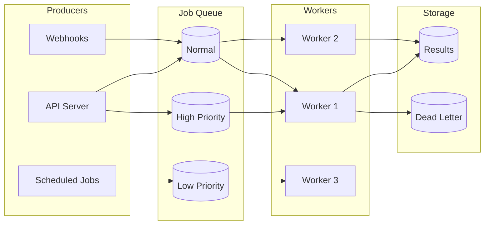

# Job Queue Patterns

## Introduction

When operations exceed timeout limits, job queues provide reliable background processing. This lesson covers queue selection, job creation and tracking, worker implementation, and concurrency control.

### What We'll Cover

- Queue selection (Redis, SQS, Bull)
- Job creation and tracking
- Worker implementation
- Concurrency control

### Prerequisites

- Basic queueing concepts
- Async programming
- Database basics

---

## Queue Architecture



---

## Queue Selection

| Queue | Best For | Pros | Cons |
|-------|----------|------|------|
| **Redis (Bull/BullMQ)** | Single-region, low latency | Fast, feature-rich | Memory limits |
| **AWS SQS** | AWS, high scale | Managed, durable | Higher latency |
| **RabbitMQ** | Complex routing | Flexible, mature | Ops overhead |
| **Celery** | Python apps | Python-native | Broker-dependent |
| **PostgreSQL (SKIP LOCKED)** | Simple apps | No extra infra | Limited scale |

### Redis with Bull/BullMQ

```python
# Using RQ (Redis Queue) for Python
from redis import Redis
from rq import Queue, Worker
from dataclasses import dataclass
from typing import Optional, Any
from datetime import datetime
import json

# Setup
redis_conn = Redis(host='localhost', port=6379)

# Create queues with priorities
high_priority = Queue('high', connection=redis_conn)
default_queue = Queue('default', connection=redis_conn)
low_priority = Queue('low', connection=redis_conn)


@dataclass
class AIJob:
    """AI processing job."""
    
    id: str
    type: str
    payload: dict
    priority: str = "default"
    max_retries: int = 3
    timeout: int = 600  # 10 minutes


def enqueue_ai_job(job: AIJob) -> str:
    """Enqueue an AI job."""
    
    # Select queue by priority
    queues = {
        "high": high_priority,
        "default": default_queue,
        "low": low_priority
    }
    
    queue = queues.get(job.priority, default_queue)
    
    # Enqueue with job metadata
    rq_job = queue.enqueue(
        process_ai_job,
        args=(job.payload,),
        job_id=job.id,
        job_timeout=job.timeout,
        retry=job.max_retries,
        meta={
            "type": job.type,
            "created_at": datetime.now().isoformat()
        }
    )
    
    return rq_job.id


def process_ai_job(payload: dict) -> dict:
    """Process AI job (runs in worker)."""
    
    from openai import OpenAI
    
    client = OpenAI()
    
    response = client.chat.completions.create(
        model=payload.get("model", "gpt-4o-mini"),
        messages=payload.get("messages", [])
    )
    
    return {
        "content": response.choices[0].message.content,
        "usage": {
            "prompt_tokens": response.usage.prompt_tokens,
            "completion_tokens": response.usage.completion_tokens
        }
    }


# Start workers (run in separate processes)
# python -m rq worker high default low
```

### BullMQ (Node.js)

```typescript
import { Queue, Worker, Job } from 'bullmq';
import { Redis } from 'ioredis';

const connection = new Redis({
  host: 'localhost',
  port: 6379,
  maxRetriesPerRequest: null
});

// Create queue
const aiQueue = new Queue('ai-processing', { connection });

// Add job
async function queueAIJob(payload: any, priority: number = 0) {
  const job = await aiQueue.add(
    'process',
    payload,
    {
      priority,
      attempts: 3,
      backoff: {
        type: 'exponential',
        delay: 1000
      },
      removeOnComplete: { count: 1000 },
      removeOnFail: { count: 5000 }
    }
  );
  
  return job.id;
}

// Create worker
const worker = new Worker(
  'ai-processing',
  async (job: Job) => {
    console.log(`Processing job ${job.id}`);
    
    const result = await processWithOpenAI(job.data);
    
    // Update progress
    await job.updateProgress(100);
    
    return result;
  },
  {
    connection,
    concurrency: 5,
    limiter: {
      max: 10,
      duration: 1000 // 10 jobs per second
    }
  }
);

// Event handlers
worker.on('completed', (job, result) => {
  console.log(`Job ${job.id} completed`);
});

worker.on('failed', (job, err) => {
  console.error(`Job ${job?.id} failed: ${err.message}`);
});

worker.on('progress', (job, progress) => {
  console.log(`Job ${job.id} progress: ${progress}%`);
});
```

### AWS SQS

```python
import boto3
import json
from dataclasses import dataclass
from typing import Optional

sqs = boto3.client('sqs')

QUEUE_URL = "https://sqs.us-east-1.amazonaws.com/123456789/ai-jobs"
DLQ_URL = "https://sqs.us-east-1.amazonaws.com/123456789/ai-jobs-dlq"


@dataclass
class SQSJob:
    """SQS message wrapper."""
    
    receipt_handle: str
    body: dict
    message_id: str
    approximate_receive_count: int


def send_job(payload: dict, delay_seconds: int = 0) -> str:
    """Send job to SQS."""
    
    response = sqs.send_message(
        QueueUrl=QUEUE_URL,
        MessageBody=json.dumps(payload),
        DelaySeconds=delay_seconds,
        MessageAttributes={
            'JobType': {
                'DataType': 'String',
                'StringValue': payload.get('type', 'default')
            }
        }
    )
    
    return response['MessageId']


def receive_jobs(max_messages: int = 10) -> list[SQSJob]:
    """Receive jobs from SQS."""
    
    response = sqs.receive_message(
        QueueUrl=QUEUE_URL,
        MaxNumberOfMessages=max_messages,
        WaitTimeSeconds=20,  # Long polling
        AttributeNames=['ApproximateReceiveCount'],
        MessageAttributeNames=['All']
    )
    
    jobs = []
    
    for msg in response.get('Messages', []):
        jobs.append(SQSJob(
            receipt_handle=msg['ReceiptHandle'],
            body=json.loads(msg['Body']),
            message_id=msg['MessageId'],
            approximate_receive_count=int(
                msg['Attributes'].get('ApproximateReceiveCount', 0)
            )
        ))
    
    return jobs


def complete_job(job: SQSJob):
    """Delete job from queue (mark complete)."""
    
    sqs.delete_message(
        QueueUrl=QUEUE_URL,
        ReceiptHandle=job.receipt_handle
    )


def extend_visibility(job: SQSJob, seconds: int):
    """Extend visibility timeout for long operations."""
    
    sqs.change_message_visibility(
        QueueUrl=QUEUE_URL,
        ReceiptHandle=job.receipt_handle,
        VisibilityTimeout=seconds
    )


# Worker loop
def worker_loop():
    """SQS worker loop."""
    
    while True:
        jobs = receive_jobs(max_messages=5)
        
        for job in jobs:
            try:
                # Extend visibility for long operations
                extend_visibility(job, 600)  # 10 minutes
                
                # Process
                result = process_job(job.body)
                
                # Store result
                store_result(job.message_id, result)
                
                # Complete
                complete_job(job)
                
            except Exception as e:
                print(f"Job {job.message_id} failed: {e}")
                
                # Check retry count
                if job.approximate_receive_count >= 3:
                    # Move to DLQ manually if needed
                    pass
                # Otherwise, SQS will make it visible again
```

### PostgreSQL Queue (Simple)

```python
import psycopg2
from contextlib import contextmanager
from dataclasses import dataclass
from datetime import datetime, timedelta
from typing import Optional
import json

@dataclass
class PGJob:
    """PostgreSQL queue job."""
    
    id: int
    payload: dict
    status: str
    created_at: datetime
    started_at: Optional[datetime] = None
    completed_at: Optional[datetime] = None
    error: Optional[str] = None


class PostgresQueue:
    """Simple PostgreSQL-based job queue."""
    
    def __init__(self, connection_string: str):
        self.conn_string = connection_string
        self._init_schema()
    
    @contextmanager
    def _get_conn(self):
        conn = psycopg2.connect(self.conn_string)
        try:
            yield conn
        finally:
            conn.close()
    
    def _init_schema(self):
        with self._get_conn() as conn:
            with conn.cursor() as cur:
                cur.execute("""
                    CREATE TABLE IF NOT EXISTS job_queue (
                        id SERIAL PRIMARY KEY,
                        payload JSONB NOT NULL,
                        status VARCHAR(20) DEFAULT 'pending',
                        priority INTEGER DEFAULT 0,
                        created_at TIMESTAMP DEFAULT NOW(),
                        started_at TIMESTAMP,
                        completed_at TIMESTAMP,
                        error TEXT,
                        result JSONB
                    );
                    
                    CREATE INDEX IF NOT EXISTS idx_job_status 
                    ON job_queue(status, priority DESC, created_at);
                """)
                conn.commit()
    
    def enqueue(
        self,
        payload: dict,
        priority: int = 0
    ) -> int:
        """Add job to queue."""
        
        with self._get_conn() as conn:
            with conn.cursor() as cur:
                cur.execute(
                    """INSERT INTO job_queue (payload, priority)
                       VALUES (%s, %s) RETURNING id""",
                    (json.dumps(payload), priority)
                )
                job_id = cur.fetchone()[0]
                conn.commit()
                return job_id
    
    def fetch_job(self) -> Optional[PGJob]:
        """Fetch next available job using SKIP LOCKED."""
        
        with self._get_conn() as conn:
            with conn.cursor() as cur:
                cur.execute("""
                    UPDATE job_queue
                    SET status = 'running', started_at = NOW()
                    WHERE id = (
                        SELECT id FROM job_queue
                        WHERE status = 'pending'
                        ORDER BY priority DESC, created_at
                        FOR UPDATE SKIP LOCKED
                        LIMIT 1
                    )
                    RETURNING id, payload, status, created_at, started_at
                """)
                
                row = cur.fetchone()
                conn.commit()
                
                if not row:
                    return None
                
                return PGJob(
                    id=row[0],
                    payload=row[1],
                    status=row[2],
                    created_at=row[3],
                    started_at=row[4]
                )
    
    def complete_job(
        self,
        job_id: int,
        result: dict
    ):
        """Mark job as completed."""
        
        with self._get_conn() as conn:
            with conn.cursor() as cur:
                cur.execute(
                    """UPDATE job_queue
                       SET status = 'completed',
                           completed_at = NOW(),
                           result = %s
                       WHERE id = %s""",
                    (json.dumps(result), job_id)
                )
                conn.commit()
    
    def fail_job(
        self,
        job_id: int,
        error: str
    ):
        """Mark job as failed."""
        
        with self._get_conn() as conn:
            with conn.cursor() as cur:
                cur.execute(
                    """UPDATE job_queue
                       SET status = 'failed',
                           completed_at = NOW(),
                           error = %s
                       WHERE id = %s""",
                    (error, job_id)
                )
                conn.commit()
    
    def get_job(self, job_id: int) -> Optional[PGJob]:
        """Get job by ID."""
        
        with self._get_conn() as conn:
            with conn.cursor() as cur:
                cur.execute(
                    """SELECT id, payload, status, created_at, 
                              started_at, completed_at, error
                       FROM job_queue WHERE id = %s""",
                    (job_id,)
                )
                
                row = cur.fetchone()
                
                if not row:
                    return None
                
                return PGJob(
                    id=row[0],
                    payload=row[1],
                    status=row[2],
                    created_at=row[3],
                    started_at=row[4],
                    completed_at=row[5],
                    error=row[6]
                )


# Usage
queue = PostgresQueue("postgresql://localhost/mydb")

# Producer
job_id = queue.enqueue({
    "type": "completion",
    "messages": [{"role": "user", "content": "Hello"}]
}, priority=10)

# Worker
def worker():
    while True:
        job = queue.fetch_job()
        
        if not job:
            time.sleep(1)
            continue
        
        try:
            result = process_job(job.payload)
            queue.complete_job(job.id, result)
        except Exception as e:
            queue.fail_job(job.id, str(e))
```

---

## Worker Implementation

```python
import asyncio
import signal
from dataclasses import dataclass
from typing import Callable, Optional
from concurrent.futures import ThreadPoolExecutor
import threading

@dataclass
class WorkerConfig:
    """Worker configuration."""
    
    concurrency: int = 5
    poll_interval: float = 1.0
    shutdown_timeout: float = 30.0
    max_retries: int = 3


class AIWorker:
    """Production-ready AI job worker."""
    
    def __init__(
        self,
        queue: PostgresQueue,
        processor: Callable,
        config: WorkerConfig = None
    ):
        self.queue = queue
        self.processor = processor
        self.config = config or WorkerConfig()
        
        self.running = False
        self.active_jobs: set = set()
        self.executor = ThreadPoolExecutor(
            max_workers=self.config.concurrency
        )
        self._shutdown_event = threading.Event()
    
    def start(self):
        """Start the worker."""
        
        self.running = True
        
        # Setup signal handlers
        signal.signal(signal.SIGTERM, self._handle_shutdown)
        signal.signal(signal.SIGINT, self._handle_shutdown)
        
        print(f"Worker starting with concurrency {self.config.concurrency}")
        
        while self.running:
            # Check if we can take more jobs
            if len(self.active_jobs) >= self.config.concurrency:
                time.sleep(0.1)
                continue
            
            # Fetch job
            job = self.queue.fetch_job()
            
            if not job:
                time.sleep(self.config.poll_interval)
                continue
            
            # Submit to executor
            self.active_jobs.add(job.id)
            self.executor.submit(self._process_job, job)
        
        # Wait for active jobs on shutdown
        self._wait_for_completion()
    
    def _process_job(self, job: PGJob):
        """Process a single job."""
        
        try:
            print(f"Processing job {job.id}")
            
            result = self.processor(job.payload)
            
            self.queue.complete_job(job.id, result)
            print(f"Job {job.id} completed")
            
        except Exception as e:
            print(f"Job {job.id} failed: {e}")
            self.queue.fail_job(job.id, str(e))
        
        finally:
            self.active_jobs.discard(job.id)
    
    def _handle_shutdown(self, signum, frame):
        """Handle shutdown signal."""
        
        print(f"Received signal {signum}, shutting down...")
        self.running = False
        self._shutdown_event.set()
    
    def _wait_for_completion(self):
        """Wait for active jobs to complete."""
        
        if not self.active_jobs:
            return
        
        print(f"Waiting for {len(self.active_jobs)} active jobs...")
        
        start = time.time()
        
        while self.active_jobs:
            if time.time() - start > self.config.shutdown_timeout:
                print("Shutdown timeout, forcing exit")
                break
            
            time.sleep(0.5)
        
        self.executor.shutdown(wait=False)


# Async worker variant
class AsyncAIWorker:
    """Async worker for AI jobs."""
    
    def __init__(
        self,
        queue,
        processor: Callable,
        config: WorkerConfig = None
    ):
        self.queue = queue
        self.processor = processor
        self.config = config or WorkerConfig()
        self.running = False
        self.active_tasks: set = set()
    
    async def start(self):
        """Start async worker."""
        
        self.running = True
        
        while self.running:
            # Limit concurrency
            while len(self.active_tasks) >= self.config.concurrency:
                # Wait for any task to complete
                done, _ = await asyncio.wait(
                    self.active_tasks,
                    return_when=asyncio.FIRST_COMPLETED
                )
                self.active_tasks -= done
            
            # Fetch job
            job = await asyncio.to_thread(self.queue.fetch_job)
            
            if not job:
                await asyncio.sleep(self.config.poll_interval)
                continue
            
            # Create task
            task = asyncio.create_task(self._process_job(job))
            self.active_tasks.add(task)
    
    async def _process_job(self, job):
        """Process job asynchronously."""
        
        try:
            result = await self.processor(job.payload)
            await asyncio.to_thread(
                self.queue.complete_job, job.id, result
            )
        except Exception as e:
            await asyncio.to_thread(
                self.queue.fail_job, job.id, str(e)
            )


# Usage
def ai_processor(payload: dict) -> dict:
    """Process AI job."""
    
    from openai import OpenAI
    
    client = OpenAI()
    
    response = client.chat.completions.create(
        model=payload.get("model", "gpt-4o-mini"),
        messages=payload["messages"]
    )
    
    return {
        "content": response.choices[0].message.content
    }


if __name__ == "__main__":
    queue = PostgresQueue("postgresql://localhost/mydb")
    worker = AIWorker(
        queue,
        ai_processor,
        WorkerConfig(concurrency=5)
    )
    worker.start()
```

---

## Concurrency Control

```python
from dataclasses import dataclass
from typing import Optional
import asyncio
import time

@dataclass
class RateLimitConfig:
    """Rate limit configuration."""
    
    requests_per_second: float = 10.0
    burst_limit: int = 20
    per_user_limit: float = 2.0


class TokenBucket:
    """Token bucket rate limiter."""
    
    def __init__(
        self,
        rate: float,
        capacity: int
    ):
        self.rate = rate
        self.capacity = capacity
        self.tokens = capacity
        self.last_update = time.time()
        self._lock = asyncio.Lock()
    
    async def acquire(self, tokens: int = 1) -> bool:
        """Try to acquire tokens."""
        
        async with self._lock:
            now = time.time()
            
            # Add tokens based on elapsed time
            elapsed = now - self.last_update
            self.tokens = min(
                self.capacity,
                self.tokens + elapsed * self.rate
            )
            self.last_update = now
            
            if self.tokens >= tokens:
                self.tokens -= tokens
                return True
            
            return False
    
    async def wait_for_token(self, tokens: int = 1):
        """Wait until token is available."""
        
        while not await self.acquire(tokens):
            # Calculate wait time
            needed = tokens - self.tokens
            wait_time = needed / self.rate
            await asyncio.sleep(min(wait_time, 0.1))


class ConcurrencyManager:
    """Manage job concurrency with rate limiting."""
    
    def __init__(self, config: RateLimitConfig):
        self.config = config
        self.global_limiter = TokenBucket(
            config.requests_per_second,
            config.burst_limit
        )
        self.user_limiters: dict[str, TokenBucket] = {}
        self.semaphore = asyncio.Semaphore(config.burst_limit)
    
    def _get_user_limiter(self, user_id: str) -> TokenBucket:
        """Get or create user-specific limiter."""
        
        if user_id not in self.user_limiters:
            self.user_limiters[user_id] = TokenBucket(
                self.config.per_user_limit,
                5  # Small burst for users
            )
        
        return self.user_limiters[user_id]
    
    async def acquire(self, user_id: Optional[str] = None) -> bool:
        """Acquire permission to process."""
        
        # Check global limit
        if not await self.global_limiter.acquire():
            return False
        
        # Check user limit
        if user_id:
            user_limiter = self._get_user_limiter(user_id)
            if not await user_limiter.acquire():
                return False
        
        return True
    
    async def execute_with_limit(
        self,
        func,
        *args,
        user_id: str = None,
        **kwargs
    ):
        """Execute function with rate limiting."""
        
        # Wait for rate limit
        await self.global_limiter.wait_for_token()
        
        if user_id:
            user_limiter = self._get_user_limiter(user_id)
            await user_limiter.wait_for_token()
        
        # Use semaphore for concurrency
        async with self.semaphore:
            return await func(*args, **kwargs)


class PriorityQueue:
    """Priority-based job queue."""
    
    def __init__(self):
        self.queues: dict[int, list] = {}
        self._lock = asyncio.Lock()
    
    async def push(
        self,
        job: dict,
        priority: int = 0
    ):
        """Add job with priority (higher = more important)."""
        
        async with self._lock:
            if priority not in self.queues:
                self.queues[priority] = []
            
            self.queues[priority].append(job)
    
    async def pop(self) -> Optional[dict]:
        """Get highest priority job."""
        
        async with self._lock:
            # Sort by priority descending
            for priority in sorted(self.queues.keys(), reverse=True):
                if self.queues[priority]:
                    return self.queues[priority].pop(0)
            
            return None


# Fair queue with round-robin per user
class FairQueue:
    """Fair queue ensuring no user monopolizes resources."""
    
    def __init__(self):
        self.user_queues: dict[str, list] = {}
        self.user_order: list = []
        self._current_index = 0
        self._lock = asyncio.Lock()
    
    async def push(self, user_id: str, job: dict):
        """Add job for user."""
        
        async with self._lock:
            if user_id not in self.user_queues:
                self.user_queues[user_id] = []
                self.user_order.append(user_id)
            
            self.user_queues[user_id].append(job)
    
    async def pop(self) -> Optional[tuple[str, dict]]:
        """Get next job using round-robin."""
        
        async with self._lock:
            if not self.user_order:
                return None
            
            # Try each user starting from current index
            for _ in range(len(self.user_order)):
                user_id = self.user_order[self._current_index]
                
                if self.user_queues.get(user_id):
                    job = self.user_queues[user_id].pop(0)
                    
                    # Remove user if no more jobs
                    if not self.user_queues[user_id]:
                        del self.user_queues[user_id]
                        self.user_order.remove(user_id)
                    
                    # Move to next user
                    if self.user_order:
                        self._current_index = (
                            self._current_index % len(self.user_order)
                        )
                    
                    return user_id, job
                
                self._current_index = (
                    (self._current_index + 1) % len(self.user_order)
                )
            
            return None
```

---

## Hands-on Exercise

### Your Task

Build a job queue system with priority lanes and fair scheduling.

### Requirements

1. Three priority lanes (high, normal, low)
2. Fair scheduling within each lane
3. Concurrency limits per user
4. Dead letter queue for failures

### Expected Result

```python
queue = SmartQueue()

# Add jobs
queue.enqueue("user1", {"task": "A"}, priority="high")
queue.enqueue("user2", {"task": "B"}, priority="normal")
queue.enqueue("user1", {"task": "C"}, priority="normal")

# Process fairly
job = queue.dequeue()  # user1's high priority
job = queue.dequeue()  # user2's normal (fair)
job = queue.dequeue()  # user1's normal
```

<details>
<summary>💡 Hints</summary>

- Use separate queues per priority
- Track user positions for fairness
- Implement circuit breakers per user
</details>

<details>
<summary>✅ Solution</summary>

```python
from dataclasses import dataclass, field
from datetime import datetime
from typing import Optional, Dict, List
from enum import Enum
from collections import defaultdict
import threading
import uuid

class Priority(Enum):
    HIGH = 3
    NORMAL = 2
    LOW = 1


@dataclass
class QueuedJob:
    """A job in the queue."""
    
    id: str
    user_id: str
    payload: dict
    priority: Priority
    created_at: datetime = field(default_factory=datetime.now)
    attempts: int = 0


@dataclass
class UserState:
    """State tracking per user."""
    
    active_jobs: int = 0
    total_failures: int = 0
    last_failure: Optional[datetime] = None
    is_blocked: bool = False


class SmartQueue:
    """Smart queue with priorities and fairness."""
    
    def __init__(
        self,
        max_user_concurrent: int = 3,
        max_failures_before_block: int = 5,
        block_duration_seconds: int = 300
    ):
        self.max_user_concurrent = max_user_concurrent
        self.max_failures = max_failures_before_block
        self.block_duration = block_duration_seconds
        
        # Priority lanes
        self.lanes: Dict[Priority, Dict[str, List[QueuedJob]]] = {
            Priority.HIGH: defaultdict(list),
            Priority.NORMAL: defaultdict(list),
            Priority.LOW: defaultdict(list)
        }
        
        # User tracking
        self.user_state: Dict[str, UserState] = {}
        self.lane_positions: Dict[Priority, int] = {
            p: 0 for p in Priority
        }
        
        # Dead letter queue
        self.dlq: List[QueuedJob] = []
        
        self._lock = threading.Lock()
    
    def _get_user_state(self, user_id: str) -> UserState:
        """Get or create user state."""
        
        if user_id not in self.user_state:
            self.user_state[user_id] = UserState()
        
        return self.user_state[user_id]
    
    def _is_user_blocked(self, user_id: str) -> bool:
        """Check if user is blocked."""
        
        state = self._get_user_state(user_id)
        
        if not state.is_blocked:
            return False
        
        # Check if block has expired
        if state.last_failure:
            elapsed = (datetime.now() - state.last_failure).seconds
            if elapsed > self.block_duration:
                state.is_blocked = False
                state.total_failures = 0
                return False
        
        return True
    
    def enqueue(
        self,
        user_id: str,
        payload: dict,
        priority: str = "normal"
    ) -> str:
        """Add job to queue."""
        
        priority_enum = {
            "high": Priority.HIGH,
            "normal": Priority.NORMAL,
            "low": Priority.LOW
        }.get(priority, Priority.NORMAL)
        
        job = QueuedJob(
            id=str(uuid.uuid4()),
            user_id=user_id,
            payload=payload,
            priority=priority_enum
        )
        
        with self._lock:
            self.lanes[priority_enum][user_id].append(job)
        
        return job.id
    
    def dequeue(self) -> Optional[QueuedJob]:
        """Get next job using fair scheduling."""
        
        with self._lock:
            # Check each priority lane in order
            for priority in [Priority.HIGH, Priority.NORMAL, Priority.LOW]:
                job = self._dequeue_from_lane(priority)
                if job:
                    return job
        
        return None
    
    def _dequeue_from_lane(
        self,
        priority: Priority
    ) -> Optional[QueuedJob]:
        """Dequeue from specific lane with fairness."""
        
        lane = self.lanes[priority]
        users = list(lane.keys())
        
        if not users:
            return None
        
        # Start from last position for round-robin
        start_pos = self.lane_positions[priority] % len(users)
        
        for offset in range(len(users)):
            idx = (start_pos + offset) % len(users)
            user_id = users[idx]
            
            # Check user constraints
            if self._is_user_blocked(user_id):
                continue
            
            state = self._get_user_state(user_id)
            if state.active_jobs >= self.max_user_concurrent:
                continue
            
            # Get job
            if lane[user_id]:
                job = lane[user_id].pop(0)
                
                # Clean up empty user queue
                if not lane[user_id]:
                    del lane[user_id]
                
                # Update state
                state.active_jobs += 1
                self.lane_positions[priority] = idx + 1
                
                return job
        
        return None
    
    def complete(self, job_id: str, user_id: str):
        """Mark job as complete."""
        
        with self._lock:
            state = self._get_user_state(user_id)
            state.active_jobs = max(0, state.active_jobs - 1)
    
    def fail(
        self,
        job: QueuedJob,
        error: str,
        retry: bool = True
    ):
        """Mark job as failed."""
        
        with self._lock:
            state = self._get_user_state(job.user_id)
            state.active_jobs = max(0, state.active_jobs - 1)
            state.total_failures += 1
            state.last_failure = datetime.now()
            
            # Block user if too many failures
            if state.total_failures >= self.max_failures:
                state.is_blocked = True
            
            # Retry or DLQ
            job.attempts += 1
            
            if retry and job.attempts < 3:
                # Re-queue at lower priority
                lower_priority = {
                    Priority.HIGH: Priority.NORMAL,
                    Priority.NORMAL: Priority.LOW,
                    Priority.LOW: Priority.LOW
                }[job.priority]
                
                self.lanes[lower_priority][job.user_id].append(job)
            else:
                # Move to DLQ
                self.dlq.append(job)
    
    def get_stats(self) -> dict:
        """Get queue statistics."""
        
        with self._lock:
            stats = {
                "queued": 0,
                "by_priority": {},
                "by_user": defaultdict(int),
                "dlq_size": len(self.dlq),
                "blocked_users": []
            }
            
            for priority in Priority:
                lane = self.lanes[priority]
                count = sum(len(jobs) for jobs in lane.values())
                stats["by_priority"][priority.name] = count
                stats["queued"] += count
                
                for user_id, jobs in lane.items():
                    stats["by_user"][user_id] += len(jobs)
            
            for user_id, state in self.user_state.items():
                if state.is_blocked:
                    stats["blocked_users"].append(user_id)
            
            return stats


# Test it
queue = SmartQueue(max_user_concurrent=2)

# Add jobs
queue.enqueue("user1", {"task": "A"}, priority="high")
queue.enqueue("user2", {"task": "B"}, priority="normal")
queue.enqueue("user1", {"task": "C"}, priority="normal")
queue.enqueue("user1", {"task": "D"}, priority="normal")
queue.enqueue("user2", {"task": "E"}, priority="low")

print("Stats:", queue.get_stats())

# Process
while True:
    job = queue.dequeue()
    if not job:
        break
    
    print(f"Processing: user={job.user_id}, task={job.payload['task']}, priority={job.priority.name}")
    queue.complete(job.id, job.user_id)

print("\nFinal stats:", queue.get_stats())
```

**Output:**
```
Stats: {'queued': 5, 'by_priority': {'HIGH': 1, 'NORMAL': 3, 'LOW': 1}, ...}
Processing: user=user1, task=A, priority=HIGH
Processing: user=user2, task=B, priority=NORMAL
Processing: user=user1, task=C, priority=NORMAL
Processing: user=user1, task=D, priority=NORMAL
Processing: user=user2, task=E, priority=LOW

Final stats: {'queued': 0, ...}
```

</details>

---

## Summary

✅ Choose queue technology based on scale and infrastructure  
✅ Implement reliable workers with graceful shutdown  
✅ Use priority lanes for urgent operations  
✅ Apply fair scheduling to prevent user monopolization  
✅ Handle failures with retries and dead letter queues

**Next:** [Progress Tracking](./03-progress-tracking.md)

---

## Further Reading

- [BullMQ Documentation](https://docs.bullmq.io/) — Node.js queue
- [Celery](https://docs.celeryq.dev/) — Python task queue
- [AWS SQS](https://docs.aws.amazon.com/sqs/) — Managed queue service

<!-- 
Sources Consulted:
- BullMQ: https://docs.bullmq.io/
- Celery: https://docs.celeryq.dev/
- AWS SQS: https://docs.aws.amazon.com/sqs/
-->
