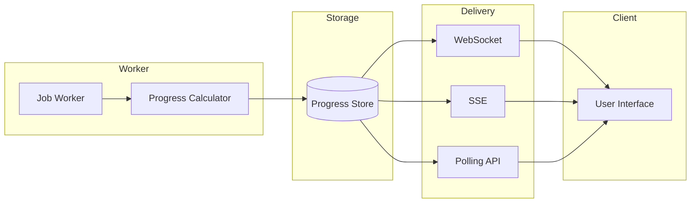

# Progress Tracking

## Introduction

Long-running operations benefit from progress updates that keep users informed and engaged. This lesson covers progress events, percentage completion, stage-based progress, and UI indicators.

### What We'll Cover

- Progress events
- Percentage completion
- Stage-based progress
- UI progress indicators

### Prerequisites

- Job queue patterns (previous lesson)
- Basic WebSocket/SSE concepts
- Frontend basics

---

## Progress Architecture



---

## Progress Event Types

```python
from dataclasses import dataclass, field
from datetime import datetime
from typing import Optional, List, Any
from enum import Enum
import json

class ProgressType(Enum):
    """Types of progress updates."""
    
    PERCENTAGE = "percentage"  # Simple 0-100%
    STAGE = "stage"  # Named stages
    ITEMS = "items"  # Item-based (3/100)
    INDETERMINATE = "indeterminate"  # Unknown duration


@dataclass
class ProgressEvent:
    """A progress update event."""
    
    job_id: str
    type: ProgressType
    timestamp: datetime = field(default_factory=datetime.now)
    
    # Percentage progress
    percent: Optional[float] = None
    
    # Stage progress
    stage: Optional[str] = None
    stage_index: Optional[int] = None
    total_stages: Optional[int] = None
    
    # Item progress
    completed_items: Optional[int] = None
    total_items: Optional[int] = None
    
    # Additional info
    message: Optional[str] = None
    details: Optional[dict] = None
    estimated_remaining_seconds: Optional[float] = None
    
    def to_dict(self) -> dict:
        """Convert to dictionary for serialization."""
        
        return {
            "job_id": self.job_id,
            "type": self.type.value,
            "timestamp": self.timestamp.isoformat(),
            "percent": self.percent,
            "stage": self.stage,
            "stage_index": self.stage_index,
            "total_stages": self.total_stages,
            "completed_items": self.completed_items,
            "total_items": self.total_items,
            "message": self.message,
            "details": self.details,
            "estimated_remaining": self.estimated_remaining_seconds
        }


class ProgressTracker:
    """Track and emit progress for a job."""
    
    def __init__(
        self,
        job_id: str,
        on_progress = None
    ):
        self.job_id = job_id
        self.on_progress = on_progress
        self.history: List[ProgressEvent] = []
        self.start_time = datetime.now()
    
    def emit(self, event: ProgressEvent):
        """Emit progress event."""
        
        self.history.append(event)
        
        if self.on_progress:
            self.on_progress(event)
    
    def percentage(
        self,
        percent: float,
        message: str = None
    ):
        """Emit percentage progress."""
        
        # Estimate remaining time
        elapsed = (datetime.now() - self.start_time).total_seconds()
        
        if percent > 0:
            total_estimated = elapsed / (percent / 100)
            remaining = total_estimated - elapsed
        else:
            remaining = None
        
        self.emit(ProgressEvent(
            job_id=self.job_id,
            type=ProgressType.PERCENTAGE,
            percent=percent,
            message=message,
            estimated_remaining_seconds=remaining
        ))
    
    def stage(
        self,
        name: str,
        index: int,
        total: int,
        message: str = None
    ):
        """Emit stage progress."""
        
        percent = (index / total) * 100
        
        self.emit(ProgressEvent(
            job_id=self.job_id,
            type=ProgressType.STAGE,
            stage=name,
            stage_index=index,
            total_stages=total,
            percent=percent,
            message=message
        ))
    
    def items(
        self,
        completed: int,
        total: int,
        message: str = None
    ):
        """Emit item-based progress."""
        
        percent = (completed / total) * 100 if total > 0 else 0
        
        self.emit(ProgressEvent(
            job_id=self.job_id,
            type=ProgressType.ITEMS,
            completed_items=completed,
            total_items=total,
            percent=percent,
            message=message
        ))
    
    def indeterminate(self, message: str):
        """Emit indeterminate progress."""
        
        self.emit(ProgressEvent(
            job_id=self.job_id,
            type=ProgressType.INDETERMINATE,
            message=message
        ))


# Usage in job processor
async def process_documents(
    documents: list,
    tracker: ProgressTracker
):
    """Process documents with progress tracking."""
    
    stages = [
        "Parsing documents",
        "Extracting content",
        "Analyzing with AI",
        "Generating summary",
        "Finalizing"
    ]
    
    total_items = len(documents)
    
    for stage_idx, stage_name in enumerate(stages):
        tracker.stage(stage_name, stage_idx + 1, len(stages))
        
        if stage_name == "Analyzing with AI":
            # Item-based progress within stage
            for i, doc in enumerate(documents):
                await analyze_document(doc)
                tracker.items(
                    i + 1,
                    total_items,
                    f"Analyzed {doc['name']}"
                )
        else:
            # Indeterminate progress for other stages
            await asyncio.sleep(1)  # Simulate work
    
    tracker.percentage(100, "Complete!")
```

---

## Progress Storage

```python
from typing import Dict, Optional
import redis
import json
from datetime import timedelta

class RedisProgressStore:
    """Store progress in Redis for real-time access."""
    
    def __init__(
        self,
        redis_client: redis.Redis,
        ttl_hours: int = 24
    ):
        self.redis = redis_client
        self.ttl = timedelta(hours=ttl_hours)
    
    def _key(self, job_id: str) -> str:
        return f"progress:{job_id}"
    
    def _history_key(self, job_id: str) -> str:
        return f"progress:{job_id}:history"
    
    def update(self, event: ProgressEvent):
        """Update progress for job."""
        
        key = self._key(event.job_id)
        history_key = self._history_key(event.job_id)
        
        # Store current state
        self.redis.setex(
            key,
            self.ttl,
            json.dumps(event.to_dict())
        )
        
        # Append to history
        self.redis.rpush(history_key, json.dumps(event.to_dict()))
        self.redis.expire(history_key, self.ttl)
        
        # Publish for real-time updates
        self.redis.publish(
            f"progress_updates",
            json.dumps(event.to_dict())
        )
    
    def get_current(self, job_id: str) -> Optional[dict]:
        """Get current progress."""
        
        data = self.redis.get(self._key(job_id))
        
        if data:
            return json.loads(data)
        
        return None
    
    def get_history(self, job_id: str) -> list:
        """Get progress history."""
        
        history_key = self._history_key(job_id)
        items = self.redis.lrange(history_key, 0, -1)
        
        return [json.loads(item) for item in items]
    
    def subscribe(self, callback):
        """Subscribe to progress updates."""
        
        pubsub = self.redis.pubsub()
        pubsub.subscribe("progress_updates")
        
        for message in pubsub.listen():
            if message["type"] == "message":
                data = json.loads(message["data"])
                callback(data)


class InMemoryProgressStore:
    """Simple in-memory progress store."""
    
    def __init__(self):
        self.current: Dict[str, dict] = {}
        self.history: Dict[str, list] = {}
        self.subscribers: list = []
    
    def update(self, event: ProgressEvent):
        """Update progress."""
        
        data = event.to_dict()
        
        self.current[event.job_id] = data
        
        if event.job_id not in self.history:
            self.history[event.job_id] = []
        
        self.history[event.job_id].append(data)
        
        # Notify subscribers
        for callback in self.subscribers:
            callback(data)
    
    def get_current(self, job_id: str) -> Optional[dict]:
        return self.current.get(job_id)
    
    def get_history(self, job_id: str) -> list:
        return self.history.get(job_id, [])
    
    def subscribe(self, callback):
        self.subscribers.append(callback)
```

---

## Real-Time Progress Delivery

### Server-Sent Events (SSE)

```python
from flask import Flask, Response
import queue

app = Flask(__name__)

# Per-job event queues
job_queues: Dict[str, list] = {}


def register_client(job_id: str) -> queue.Queue:
    """Register a new client for job updates."""
    
    q = queue.Queue()
    
    if job_id not in job_queues:
        job_queues[job_id] = []
    
    job_queues[job_id].append(q)
    return q


def unregister_client(job_id: str, q: queue.Queue):
    """Unregister client."""
    
    if job_id in job_queues:
        job_queues[job_id].remove(q)


def broadcast_progress(job_id: str, data: dict):
    """Broadcast progress to all clients."""
    
    if job_id not in job_queues:
        return
    
    for q in job_queues[job_id]:
        q.put(data)


@app.route("/progress/<job_id>/stream")
def stream_progress(job_id: str):
    """SSE endpoint for progress updates."""
    
    def generate():
        q = register_client(job_id)
        
        try:
            # Send initial state
            current = progress_store.get_current(job_id)
            if current:
                yield f"data: {json.dumps(current)}\n\n"
            
            # Stream updates
            while True:
                try:
                    data = q.get(timeout=30)
                    yield f"data: {json.dumps(data)}\n\n"
                    
                    # Check for completion
                    if data.get("percent") == 100:
                        break
                        
                except queue.Empty:
                    # Send keepalive
                    yield f": keepalive\n\n"
                    
        finally:
            unregister_client(job_id, q)
    
    return Response(
        generate(),
        mimetype="text/event-stream",
        headers={
            "Cache-Control": "no-cache",
            "Connection": "keep-alive",
            "X-Accel-Buffering": "no"
        }
    )


# Client JavaScript
"""
const eventSource = new EventSource('/progress/job123/stream');

eventSource.onmessage = (event) => {
    const progress = JSON.parse(event.data);
    updateProgressUI(progress);
    
    if (progress.percent === 100) {
        eventSource.close();
    }
};

eventSource.onerror = (error) => {
    console.error('SSE error:', error);
    eventSource.close();
};
"""
```

### WebSocket

```python
from flask import Flask
from flask_socketio import SocketIO, emit, join_room, leave_room

app = Flask(__name__)
socketio = SocketIO(app, cors_allowed_origins="*")


@socketio.on('join_job')
def handle_join(data):
    """Join job room for updates."""
    
    job_id = data['job_id']
    join_room(f"job_{job_id}")
    
    # Send current state
    current = progress_store.get_current(job_id)
    if current:
        emit('progress', current)


@socketio.on('leave_job')
def handle_leave(data):
    """Leave job room."""
    
    job_id = data['job_id']
    leave_room(f"job_{job_id}")


def emit_progress(job_id: str, data: dict):
    """Emit progress to job room."""
    
    socketio.emit('progress', data, room=f"job_{job_id}")


# Connect progress store to WebSocket
class WebSocketProgressStore(InMemoryProgressStore):
    """Progress store with WebSocket emission."""
    
    def update(self, event: ProgressEvent):
        super().update(event)
        emit_progress(event.job_id, event.to_dict())


# Client JavaScript
"""
const socket = io();

socket.emit('join_job', { job_id: 'job123' });

socket.on('progress', (data) => {
    updateProgressUI(data);
    
    if (data.percent === 100) {
        socket.emit('leave_job', { job_id: 'job123' });
    }
});
"""
```

### Polling API

```python
@app.route("/api/jobs/<job_id>/progress")
def get_progress(job_id: str):
    """Get current job progress."""
    
    current = progress_store.get_current(job_id)
    
    if not current:
        return {"error": "Job not found"}, 404
    
    return jsonify(current)


@app.route("/api/jobs/<job_id>/progress/history")
def get_progress_history(job_id: str):
    """Get progress history."""
    
    history = progress_store.get_history(job_id)
    
    return jsonify({"history": history})


# Client JavaScript with polling
"""
async function pollProgress(jobId, interval = 1000) {
    while (true) {
        const response = await fetch(`/api/jobs/${jobId}/progress`);
        const progress = await response.json();
        
        updateProgressUI(progress);
        
        if (progress.percent === 100 || progress.status === 'failed') {
            break;
        }
        
        await new Promise(r => setTimeout(r, interval));
    }
}
"""
```

---

## Stage-Based Progress

```python
from dataclasses import dataclass, field
from typing import List, Optional, Callable
from enum import Enum
import time

class StageStatus(Enum):
    PENDING = "pending"
    RUNNING = "running"
    COMPLETED = "completed"
    FAILED = "failed"
    SKIPPED = "skipped"


@dataclass
class Stage:
    """A processing stage."""
    
    name: str
    weight: float = 1.0  # Relative weight for progress
    status: StageStatus = StageStatus.PENDING
    started_at: Optional[float] = None
    completed_at: Optional[float] = None
    error: Optional[str] = None
    sub_progress: float = 0.0  # 0-100 within stage


@dataclass
class StageProgress:
    """Multi-stage progress tracker."""
    
    job_id: str
    stages: List[Stage] = field(default_factory=list)
    on_update: Optional[Callable] = None
    
    def add_stage(
        self,
        name: str,
        weight: float = 1.0
    ):
        """Add a stage."""
        
        self.stages.append(Stage(name=name, weight=weight))
    
    @property
    def total_weight(self) -> float:
        return sum(s.weight for s in self.stages)
    
    @property
    def completed_weight(self) -> float:
        """Calculate completed weight."""
        
        completed = 0.0
        
        for stage in self.stages:
            if stage.status == StageStatus.COMPLETED:
                completed += stage.weight
            elif stage.status == StageStatus.RUNNING:
                completed += stage.weight * (stage.sub_progress / 100)
        
        return completed
    
    @property
    def overall_percent(self) -> float:
        """Get overall progress percentage."""
        
        if self.total_weight == 0:
            return 0
        
        return (self.completed_weight / self.total_weight) * 100
    
    @property
    def current_stage(self) -> Optional[Stage]:
        """Get currently running stage."""
        
        for stage in self.stages:
            if stage.status == StageStatus.RUNNING:
                return stage
        
        return None
    
    def start_stage(self, name: str):
        """Start a stage."""
        
        for stage in self.stages:
            if stage.name == name:
                stage.status = StageStatus.RUNNING
                stage.started_at = time.time()
                self._emit()
                return
    
    def update_stage_progress(
        self,
        name: str,
        progress: float
    ):
        """Update sub-progress within a stage."""
        
        for stage in self.stages:
            if stage.name == name:
                stage.sub_progress = min(100, max(0, progress))
                self._emit()
                return
    
    def complete_stage(self, name: str):
        """Complete a stage."""
        
        for stage in self.stages:
            if stage.name == name:
                stage.status = StageStatus.COMPLETED
                stage.sub_progress = 100
                stage.completed_at = time.time()
                self._emit()
                return
    
    def fail_stage(self, name: str, error: str):
        """Fail a stage."""
        
        for stage in self.stages:
            if stage.name == name:
                stage.status = StageStatus.FAILED
                stage.error = error
                stage.completed_at = time.time()
                self._emit()
                return
    
    def _emit(self):
        """Emit progress update."""
        
        if self.on_update:
            self.on_update(self.to_dict())
    
    def to_dict(self) -> dict:
        """Convert to dictionary."""
        
        return {
            "job_id": self.job_id,
            "overall_percent": round(self.overall_percent, 1),
            "current_stage": self.current_stage.name if self.current_stage else None,
            "stages": [
                {
                    "name": s.name,
                    "status": s.status.value,
                    "progress": s.sub_progress,
                    "duration": (
                        (s.completed_at or time.time()) - s.started_at
                        if s.started_at else None
                    )
                }
                for s in self.stages
            ]
        }


# Context manager for stages
class StageContext:
    """Context manager for stage execution."""
    
    def __init__(
        self,
        progress: StageProgress,
        stage_name: str
    ):
        self.progress = progress
        self.stage_name = stage_name
    
    def __enter__(self):
        self.progress.start_stage(self.stage_name)
        return self
    
    def __exit__(self, exc_type, exc_val, exc_tb):
        if exc_type:
            self.progress.fail_stage(
                self.stage_name,
                str(exc_val)
            )
            return False
        
        self.progress.complete_stage(self.stage_name)
        return False
    
    def update(self, percent: float):
        """Update stage progress."""
        
        self.progress.update_stage_progress(
            self.stage_name,
            percent
        )


# Usage
async def process_with_stages(job_id: str, data: dict):
    """Process with stage tracking."""
    
    progress = StageProgress(
        job_id=job_id,
        on_update=lambda p: broadcast_progress(job_id, p)
    )
    
    # Define stages with weights
    progress.add_stage("Upload", weight=1)
    progress.add_stage("Parse", weight=2)
    progress.add_stage("Analyze", weight=5)  # Heaviest
    progress.add_stage("Generate", weight=2)
    
    # Execute stages
    with StageContext(progress, "Upload") as stage:
        await upload_data(data)
    
    with StageContext(progress, "Parse") as stage:
        for i, item in enumerate(data["items"]):
            await parse_item(item)
            stage.update((i + 1) / len(data["items"]) * 100)
    
    with StageContext(progress, "Analyze") as stage:
        result = await analyze_with_ai(data, progress_callback=stage.update)
    
    with StageContext(progress, "Generate") as stage:
        output = await generate_output(result)
    
    return output
```

---

## UI Progress Components

### React Progress Component

```typescript
import React, { useEffect, useState } from 'react';

interface ProgressData {
  job_id: string;
  overall_percent: number;
  current_stage: string | null;
  stages: Array<{
    name: string;
    status: 'pending' | 'running' | 'completed' | 'failed';
    progress: number;
    duration: number | null;
  }>;
}

interface ProgressBarProps {
  jobId: string;
  onComplete?: (result: any) => void;
  onError?: (error: string) => void;
}

export function ProgressBar({ jobId, onComplete, onError }: ProgressBarProps) {
  const [progress, setProgress] = useState<ProgressData | null>(null);
  
  useEffect(() => {
    const eventSource = new EventSource(`/progress/${jobId}/stream`);
    
    eventSource.onmessage = (event) => {
      const data = JSON.parse(event.data);
      setProgress(data);
      
      if (data.overall_percent === 100) {
        eventSource.close();
        onComplete?.(data);
      }
    };
    
    eventSource.onerror = (error) => {
      eventSource.close();
      onError?.('Connection lost');
    };
    
    return () => eventSource.close();
  }, [jobId]);
  
  if (!progress) {
    return <div className="progress-loading">Loading...</div>;
  }
  
  return (
    <div className="progress-container">
      {/* Overall progress bar */}
      <div className="overall-progress">
        <div 
          className="progress-bar"
          style={{ width: `${progress.overall_percent}%` }}
        />
        <span className="progress-text">
          {Math.round(progress.overall_percent)}%
        </span>
      </div>
      
      {/* Current stage */}
      {progress.current_stage && (
        <p className="current-stage">
          {progress.current_stage}...
        </p>
      )}
      
      {/* Stage list */}
      <div className="stages">
        {progress.stages.map((stage) => (
          <div 
            key={stage.name}
            className={`stage stage-${stage.status}`}
          >
            <StatusIcon status={stage.status} />
            <span className="stage-name">{stage.name}</span>
            {stage.status === 'running' && (
              <span className="stage-progress">
                {Math.round(stage.progress)}%
              </span>
            )}
            {stage.duration && (
              <span className="stage-duration">
                {formatDuration(stage.duration)}
              </span>
            )}
          </div>
        ))}
      </div>
    </div>
  );
}

function StatusIcon({ status }: { status: string }) {
  switch (status) {
    case 'completed':
      return <span className="icon">✅</span>;
    case 'running':
      return <span className="icon spinning">⏳</span>;
    case 'failed':
      return <span className="icon">❌</span>;
    default:
      return <span className="icon">⬜</span>;
  }
}

function formatDuration(seconds: number): string {
  if (seconds < 60) return `${Math.round(seconds)}s`;
  return `${Math.floor(seconds / 60)}m ${Math.round(seconds % 60)}s`;
}


// CSS
const styles = `
.progress-container {
  padding: 20px;
  background: #f5f5f5;
  border-radius: 8px;
}

.overall-progress {
  height: 24px;
  background: #e0e0e0;
  border-radius: 12px;
  position: relative;
  overflow: hidden;
}

.progress-bar {
  height: 100%;
  background: linear-gradient(90deg, #4caf50, #8bc34a);
  transition: width 0.3s ease;
}

.progress-text {
  position: absolute;
  top: 50%;
  left: 50%;
  transform: translate(-50%, -50%);
  font-weight: bold;
}

.current-stage {
  margin: 16px 0 8px;
  color: #666;
  font-style: italic;
}

.stages {
  display: flex;
  flex-direction: column;
  gap: 8px;
}

.stage {
  display: flex;
  align-items: center;
  gap: 8px;
  padding: 8px;
  background: white;
  border-radius: 4px;
}

.stage-completed { color: #4caf50; }
.stage-running { color: #2196f3; }
.stage-failed { color: #f44336; }
.stage-pending { color: #9e9e9e; }

.spinning {
  animation: spin 1s linear infinite;
}

@keyframes spin {
  from { transform: rotate(0deg); }
  to { transform: rotate(360deg); }
}
`;
```

---

## Hands-on Exercise

### Your Task

Build a progress tracking system for a multi-document AI processing job.

### Requirements

1. Track progress across multiple documents
2. Show individual document status
3. Estimate remaining time
4. Handle partial failures

### Expected Result

```python
tracker = DocumentProgressTracker(job_id="doc_job_1")

# Processing 3 documents
tracker.start_document("doc1.pdf")
tracker.update_document("doc1.pdf", 50, "Analyzing...")
tracker.complete_document("doc1.pdf")

tracker.start_document("doc2.pdf")
tracker.fail_document("doc2.pdf", "Parse error")

# Get status
status = tracker.get_status()
# {
#   "overall_percent": 50,
#   "documents": [...],
#   "estimated_remaining": 120
# }
```

<details>
<summary>💡 Hints</summary>

- Track start times for estimation
- Weight by document size if available
- Handle failures gracefully in percentage
</details>

<details>
<summary>✅ Solution</summary>

```python
from dataclasses import dataclass, field
from datetime import datetime
from typing import Optional, Dict, List, Callable
from enum import Enum
import time

class DocStatus(Enum):
    PENDING = "pending"
    PROCESSING = "processing"
    COMPLETED = "completed"
    FAILED = "failed"


@dataclass
class DocumentProgress:
    """Progress for a single document."""
    
    name: str
    status: DocStatus = DocStatus.PENDING
    progress: float = 0.0
    message: str = ""
    size_bytes: int = 0
    started_at: Optional[float] = None
    completed_at: Optional[float] = None
    error: Optional[str] = None
    
    @property
    def duration(self) -> Optional[float]:
        if not self.started_at:
            return None
        end = self.completed_at or time.time()
        return end - self.started_at


class DocumentProgressTracker:
    """Track progress across multiple documents."""
    
    def __init__(
        self,
        job_id: str,
        on_update: Callable = None
    ):
        self.job_id = job_id
        self.on_update = on_update
        self.documents: Dict[str, DocumentProgress] = {}
        self.start_time = time.time()
        self._completed_times: List[float] = []
    
    def add_document(
        self,
        name: str,
        size_bytes: int = 0
    ):
        """Add document to track."""
        
        self.documents[name] = DocumentProgress(
            name=name,
            size_bytes=size_bytes
        )
        self._emit()
    
    def start_document(self, name: str):
        """Start processing a document."""
        
        if name not in self.documents:
            self.add_document(name)
        
        doc = self.documents[name]
        doc.status = DocStatus.PROCESSING
        doc.started_at = time.time()
        doc.message = "Processing..."
        
        self._emit()
    
    def update_document(
        self,
        name: str,
        progress: float,
        message: str = ""
    ):
        """Update document progress."""
        
        if name not in self.documents:
            return
        
        doc = self.documents[name]
        doc.progress = min(100, max(0, progress))
        doc.message = message
        
        self._emit()
    
    def complete_document(self, name: str):
        """Mark document as complete."""
        
        if name not in self.documents:
            return
        
        doc = self.documents[name]
        doc.status = DocStatus.COMPLETED
        doc.progress = 100
        doc.completed_at = time.time()
        doc.message = "Complete"
        
        # Record completion time for estimation
        if doc.duration:
            self._completed_times.append(doc.duration)
        
        self._emit()
    
    def fail_document(
        self,
        name: str,
        error: str
    ):
        """Mark document as failed."""
        
        if name not in self.documents:
            return
        
        doc = self.documents[name]
        doc.status = DocStatus.FAILED
        doc.completed_at = time.time()
        doc.error = error
        doc.message = f"Failed: {error}"
        
        self._emit()
    
    @property
    def total_weight(self) -> float:
        """Total weight (by size or count)."""
        
        total_size = sum(d.size_bytes for d in self.documents.values())
        
        if total_size > 0:
            return total_size
        
        return len(self.documents)
    
    @property
    def completed_weight(self) -> float:
        """Completed weight."""
        
        total_size = sum(d.size_bytes for d in self.documents.values())
        
        if total_size > 0:
            # Weight by size
            completed = 0.0
            for doc in self.documents.values():
                if doc.status == DocStatus.COMPLETED:
                    completed += doc.size_bytes
                elif doc.status == DocStatus.PROCESSING:
                    completed += doc.size_bytes * (doc.progress / 100)
            return completed
        
        # Weight by count
        completed = 0.0
        for doc in self.documents.values():
            if doc.status == DocStatus.COMPLETED:
                completed += 1
            elif doc.status == DocStatus.PROCESSING:
                completed += doc.progress / 100
        
        return completed
    
    @property
    def overall_percent(self) -> float:
        """Overall progress percentage."""
        
        if self.total_weight == 0:
            return 0
        
        return (self.completed_weight / self.total_weight) * 100
    
    @property
    def estimated_remaining(self) -> Optional[float]:
        """Estimate remaining time in seconds."""
        
        if not self._completed_times:
            return None
        
        avg_time = sum(self._completed_times) / len(self._completed_times)
        
        remaining_docs = sum(
            1 for d in self.documents.values()
            if d.status in [DocStatus.PENDING, DocStatus.PROCESSING]
        )
        
        # Adjust for current progress
        current = next(
            (d for d in self.documents.values() 
             if d.status == DocStatus.PROCESSING),
            None
        )
        
        if current:
            remaining = (100 - current.progress) / 100
            return avg_time * (remaining_docs - 1 + remaining)
        
        return avg_time * remaining_docs
    
    def get_status(self) -> dict:
        """Get full status."""
        
        return {
            "job_id": self.job_id,
            "overall_percent": round(self.overall_percent, 1),
            "estimated_remaining": (
                round(self.estimated_remaining, 0)
                if self.estimated_remaining else None
            ),
            "total_documents": len(self.documents),
            "completed": sum(
                1 for d in self.documents.values()
                if d.status == DocStatus.COMPLETED
            ),
            "failed": sum(
                1 for d in self.documents.values()
                if d.status == DocStatus.FAILED
            ),
            "documents": [
                {
                    "name": d.name,
                    "status": d.status.value,
                    "progress": d.progress,
                    "message": d.message,
                    "duration": d.duration,
                    "error": d.error
                }
                for d in self.documents.values()
            ]
        }
    
    def _emit(self):
        """Emit update."""
        
        if self.on_update:
            self.on_update(self.get_status())


# Test it
def test_tracker():
    updates = []
    
    tracker = DocumentProgressTracker(
        job_id="test_job",
        on_update=lambda s: updates.append(s)
    )
    
    # Add documents
    tracker.add_document("doc1.pdf", size_bytes=1000)
    tracker.add_document("doc2.pdf", size_bytes=2000)
    tracker.add_document("doc3.pdf", size_bytes=1000)
    
    # Process doc1
    tracker.start_document("doc1.pdf")
    tracker.update_document("doc1.pdf", 50, "Halfway...")
    time.sleep(0.1)  # Simulate work
    tracker.complete_document("doc1.pdf")
    
    # Process doc2
    tracker.start_document("doc2.pdf")
    tracker.update_document("doc2.pdf", 25)
    tracker.fail_document("doc2.pdf", "Parse error")
    
    # Process doc3
    tracker.start_document("doc3.pdf")
    tracker.complete_document("doc3.pdf")
    
    # Get final status
    status = tracker.get_status()
    
    print(f"Overall: {status['overall_percent']}%")
    print(f"Completed: {status['completed']}/{status['total_documents']}")
    print(f"Failed: {status['failed']}")
    
    for doc in status['documents']:
        print(f"  {doc['name']}: {doc['status']} - {doc['message']}")


test_tracker()
```

**Output:**
```
Overall: 50.0%
Completed: 2/3
Failed: 1
  doc1.pdf: completed - Complete
  doc2.pdf: failed - Failed: Parse error
  doc3.pdf: completed - Complete
```

</details>

---

## Summary

✅ Use typed progress events for consistency  
✅ Store progress for real-time access  
✅ Deliver via SSE, WebSocket, or polling  
✅ Track weighted stages for accurate percentages  
✅ Build responsive UI components

**Next:** [Cancellation Support](./04-cancellation.md)

---

## Further Reading

- [Server-Sent Events](https://developer.mozilla.org/en-US/docs/Web/API/Server-sent_events) — MDN SSE guide
- [Socket.IO](https://socket.io/docs/v4/) — WebSocket library
- [React Progress Patterns](https://react.dev/learn/responding-to-events) — React event handling

<!-- 
Sources Consulted:
- MDN SSE: https://developer.mozilla.org/en-US/docs/Web/API/Server-sent_events
- Socket.IO: https://socket.io/docs/v4/
-->
