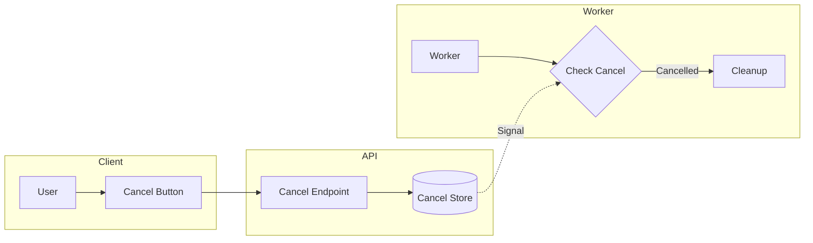

# Cancellation Support

## Introduction

Users need the ability to cancel long-running operations. This lesson covers graceful cancellation, cleanup, and partial result handling for AI workloads.

### What We'll Cover

- User-initiated cancellation
- Graceful job termination
- Cleanup on cancel
- Partial result handling

### Prerequisites

- Job queue patterns
- Progress tracking concepts
- Async Python basics

---

## Cancellation Architecture



---

## Cancellation Tokens

```python
from dataclasses import dataclass, field
from datetime import datetime
from typing import Optional, Callable, List
from enum import Enum
import threading
import asyncio
import time

class CancellationReason(Enum):
    """Why a job was cancelled."""
    
    USER_REQUESTED = "user_requested"
    TIMEOUT = "timeout"
    SYSTEM_SHUTDOWN = "system_shutdown"
    RESOURCE_LIMIT = "resource_limit"
    DEPENDENCY_FAILED = "dependency_failed"


@dataclass
class CancellationToken:
    """Token for checking/requesting cancellation."""
    
    job_id: str
    cancelled: bool = False
    reason: Optional[CancellationReason] = None
    cancelled_at: Optional[datetime] = None
    message: Optional[str] = None
    _callbacks: List[Callable] = field(default_factory=list)
    _lock: threading.Lock = field(default_factory=threading.Lock)
    
    def cancel(
        self,
        reason: CancellationReason = CancellationReason.USER_REQUESTED,
        message: str = None
    ):
        """Request cancellation."""
        
        with self._lock:
            if self.cancelled:
                return  # Already cancelled
            
            self.cancelled = True
            self.reason = reason
            self.cancelled_at = datetime.now()
            self.message = message
        
        # Execute callbacks
        for callback in self._callbacks:
            try:
                callback(self)
            except Exception as e:
                print(f"Callback error: {e}")
    
    def register_callback(self, callback: Callable):
        """Register cancellation callback."""
        
        self._callbacks.append(callback)
        
        # Call immediately if already cancelled
        if self.cancelled:
            callback(self)
    
    def check(self) -> bool:
        """Check if cancelled (raises if so)."""
        
        if self.cancelled:
            raise CancellationError(
                self.job_id,
                self.reason,
                self.message
            )
        
        return False
    
    def is_cancelled(self) -> bool:
        """Check if cancelled (no exception)."""
        
        return self.cancelled


class CancellationError(Exception):
    """Raised when operation is cancelled."""
    
    def __init__(
        self,
        job_id: str,
        reason: CancellationReason,
        message: str = None
    ):
        self.job_id = job_id
        self.reason = reason
        super().__init__(
            f"Job {job_id} cancelled: {reason.value}"
            + (f" - {message}" if message else "")
        )


# Cancellation store
class CancellationStore:
    """Store and manage cancellation tokens."""
    
    def __init__(self):
        self.tokens: dict[str, CancellationToken] = {}
        self._lock = threading.Lock()
    
    def create(self, job_id: str) -> CancellationToken:
        """Create token for job."""
        
        with self._lock:
            token = CancellationToken(job_id=job_id)
            self.tokens[job_id] = token
            return token
    
    def get(self, job_id: str) -> Optional[CancellationToken]:
        """Get token for job."""
        
        return self.tokens.get(job_id)
    
    def cancel(
        self,
        job_id: str,
        reason: CancellationReason = CancellationReason.USER_REQUESTED,
        message: str = None
    ) -> bool:
        """Cancel a job."""
        
        token = self.tokens.get(job_id)
        
        if not token:
            return False
        
        token.cancel(reason, message)
        return True
    
    def cleanup(self, job_id: str):
        """Remove token after job completes."""
        
        with self._lock:
            self.tokens.pop(job_id, None)


# Global store
cancellation_store = CancellationStore()
```

---

## Checking Cancellation

```python
import time
from typing import Any, List

class CancellableOperation:
    """Base for cancellable operations."""
    
    def __init__(self, token: CancellationToken):
        self.token = token
        self.checkpoints = 0
    
    def checkpoint(self, name: str = None):
        """Check for cancellation at checkpoint."""
        
        self.checkpoints += 1
        
        if self.token.is_cancelled():
            raise CancellationError(
                self.token.job_id,
                self.token.reason,
                f"Cancelled at checkpoint: {name or self.checkpoints}"
            )


def process_with_cancellation(
    items: List[Any],
    token: CancellationToken,
    process_func
) -> List[Any]:
    """Process items with cancellation checks."""
    
    results = []
    
    for i, item in enumerate(items):
        # Check before each item
        token.check()
        
        result = process_func(item)
        results.append(result)
        
        # Periodic check
        if i % 10 == 0:
            token.check()
    
    return results


# Async version
async def process_with_cancellation_async(
    items: List[Any],
    token: CancellationToken,
    process_func
) -> List[Any]:
    """Async process with cancellation."""
    
    results = []
    
    for item in items:
        if token.is_cancelled():
            raise CancellationError(
                token.job_id,
                token.reason
            )
        
        result = await process_func(item)
        results.append(result)
        
        # Yield to allow cancellation propagation
        await asyncio.sleep(0)
    
    return results


# Worker integration
async def cancellable_ai_job(
    job_id: str,
    documents: List[dict]
):
    """AI job with cancellation support."""
    
    token = cancellation_store.create(job_id)
    
    try:
        results = []
        
        for i, doc in enumerate(documents):
            # Check at start of each document
            token.check()
            
            # Process document
            result = await analyze_document(doc, token)
            results.append(result)
            
            # Update progress
            await update_progress(
                job_id,
                (i + 1) / len(documents) * 100
            )
        
        return {"status": "completed", "results": results}
        
    except CancellationError as e:
        return {
            "status": "cancelled",
            "reason": e.reason.value,
            "processed": len(results)
        }
        
    finally:
        cancellation_store.cleanup(job_id)


async def analyze_document(
    doc: dict,
    token: CancellationToken
) -> dict:
    """Analyze with checkpoints."""
    
    # Parsing checkpoint
    token.check()
    parsed = await parse_document(doc)
    
    # Embedding checkpoint
    token.check()
    embeddings = await generate_embeddings(parsed)
    
    # AI analysis checkpoint
    token.check()
    analysis = await ai_analyze(embeddings)
    
    return analysis
```

---

## Graceful Shutdown

```python
import signal
from concurrent.futures import ThreadPoolExecutor
from typing import Set
import threading

class GracefulWorker:
    """Worker with graceful shutdown."""
    
    def __init__(
        self,
        max_workers: int = 4,
        shutdown_timeout: float = 30.0
    ):
        self.max_workers = max_workers
        self.shutdown_timeout = shutdown_timeout
        self.executor = ThreadPoolExecutor(max_workers=max_workers)
        self.active_jobs: Set[str] = set()
        self.shutdown_requested = False
        self._lock = threading.Lock()
        
        # Register signal handlers
        signal.signal(signal.SIGTERM, self._handle_shutdown)
        signal.signal(signal.SIGINT, self._handle_shutdown)
    
    def _handle_shutdown(self, signum, frame):
        """Handle shutdown signal."""
        
        print(f"Shutdown signal received ({signum})")
        self.shutdown_requested = True
        
        # Cancel all active jobs
        for job_id in list(self.active_jobs):
            cancellation_store.cancel(
                job_id,
                CancellationReason.SYSTEM_SHUTDOWN,
                "Worker shutting down"
            )
    
    def submit(self, job_id: str, func, *args, **kwargs):
        """Submit job for execution."""
        
        if self.shutdown_requested:
            raise RuntimeError("Worker is shutting down")
        
        with self._lock:
            self.active_jobs.add(job_id)
        
        def wrapper():
            try:
                return func(*args, **kwargs)
            finally:
                with self._lock:
                    self.active_jobs.discard(job_id)
        
        return self.executor.submit(wrapper)
    
    def shutdown(self, wait: bool = True):
        """Shutdown worker gracefully."""
        
        self.shutdown_requested = True
        
        # Cancel active jobs
        for job_id in list(self.active_jobs):
            cancellation_store.cancel(
                job_id,
                CancellationReason.SYSTEM_SHUTDOWN
            )
        
        # Wait for completion
        self.executor.shutdown(wait=wait)


class CancellableTask:
    """Task that can be cancelled mid-execution."""
    
    def __init__(self, job_id: str):
        self.job_id = job_id
        self.token = cancellation_store.create(job_id)
        self._thread: Optional[threading.Thread] = None
        self._result = None
        self._error = None
        self._completed = threading.Event()
    
    def run(self, func, *args, **kwargs):
        """Run function in cancellable context."""
        
        def wrapper():
            try:
                self._result = func(self.token, *args, **kwargs)
            except CancellationError as e:
                self._error = e
            except Exception as e:
                self._error = e
            finally:
                self._completed.set()
        
        self._thread = threading.Thread(target=wrapper)
        self._thread.start()
        
        return self
    
    def cancel(self):
        """Cancel the task."""
        
        self.token.cancel()
    
    def wait(self, timeout: float = None) -> bool:
        """Wait for completion."""
        
        return self._completed.wait(timeout=timeout)
    
    @property
    def result(self):
        """Get result (raises if error)."""
        
        if self._error:
            raise self._error
        return self._result
    
    @property
    def is_cancelled(self) -> bool:
        return self.token.is_cancelled()
```

---

## API Cancellation Endpoint

```python
from flask import Flask, jsonify, request
from dataclasses import dataclass
from typing import Optional

app = Flask(__name__)


@dataclass
class Job:
    """Job record."""
    
    id: str
    status: str
    cancellation_token: Optional[CancellationToken] = None


# In-memory job store
jobs: dict[str, Job] = {}


@app.route("/api/jobs/<job_id>/cancel", methods=["POST"])
def cancel_job(job_id: str):
    """Cancel a running job."""
    
    job = jobs.get(job_id)
    
    if not job:
        return jsonify({"error": "Job not found"}), 404
    
    if job.status in ["completed", "failed", "cancelled"]:
        return jsonify({
            "error": f"Cannot cancel job with status: {job.status}"
        }), 400
    
    # Get reason from request
    data = request.get_json() or {}
    reason = data.get("reason", "user_requested")
    message = data.get("message")
    
    # Cancel via store
    cancelled = cancellation_store.cancel(
        job_id,
        CancellationReason[reason.upper()],
        message
    )
    
    if not cancelled:
        return jsonify({
            "error": "Job not cancellable (may have completed)"
        }), 400
    
    # Update job status
    job.status = "cancelling"
    
    return jsonify({
        "job_id": job_id,
        "status": "cancelling",
        "message": "Cancellation requested"
    })


@app.route("/api/jobs/<job_id>", methods=["GET"])
def get_job(job_id: str):
    """Get job status."""
    
    job = jobs.get(job_id)
    
    if not job:
        return jsonify({"error": "Job not found"}), 404
    
    # Check cancellation status
    token = cancellation_store.get(job_id)
    
    return jsonify({
        "job_id": job_id,
        "status": job.status,
        "cancelled": token.is_cancelled() if token else False,
        "cancellation_reason": (
            token.reason.value if token and token.cancelled else None
        )
    })


# Client usage
"""
// JavaScript cancel
async function cancelJob(jobId, reason = 'user_requested') {
    const response = await fetch(`/api/jobs/${jobId}/cancel`, {
        method: 'POST',
        headers: { 'Content-Type': 'application/json' },
        body: JSON.stringify({ reason })
    });
    
    return response.json();
}

// Poll for cancellation completion
async function waitForCancellation(jobId, maxWait = 30000) {
    const start = Date.now();
    
    while (Date.now() - start < maxWait) {
        const response = await fetch(`/api/jobs/${jobId}`);
        const job = await response.json();
        
        if (job.status === 'cancelled') {
            return job;
        }
        
        await new Promise(r => setTimeout(r, 1000));
    }
    
    throw new Error('Cancellation timeout');
}
"""
```

---

## Cleanup on Cancel

```python
from contextlib import contextmanager
from typing import Callable, List
import tempfile
import os
import shutil

class CleanupManager:
    """Manage cleanup actions on cancellation."""
    
    def __init__(self):
        self.cleanup_actions: List[Callable] = []
        self.temp_files: List[str] = []
        self.temp_dirs: List[str] = []
    
    def register_cleanup(self, action: Callable):
        """Register cleanup action."""
        
        self.cleanup_actions.append(action)
    
    def create_temp_file(self, **kwargs) -> str:
        """Create tracked temp file."""
        
        fd, path = tempfile.mkstemp(**kwargs)
        os.close(fd)
        self.temp_files.append(path)
        return path
    
    def create_temp_dir(self, **kwargs) -> str:
        """Create tracked temp directory."""
        
        path = tempfile.mkdtemp(**kwargs)
        self.temp_dirs.append(path)
        return path
    
    def cleanup(self):
        """Execute all cleanup actions."""
        
        errors = []
        
        # Run registered actions
        for action in reversed(self.cleanup_actions):
            try:
                action()
            except Exception as e:
                errors.append(f"Cleanup action failed: {e}")
        
        # Remove temp files
        for path in self.temp_files:
            try:
                if os.path.exists(path):
                    os.remove(path)
            except Exception as e:
                errors.append(f"Failed to remove {path}: {e}")
        
        # Remove temp directories
        for path in self.temp_dirs:
            try:
                if os.path.exists(path):
                    shutil.rmtree(path)
            except Exception as e:
                errors.append(f"Failed to remove {path}: {e}")
        
        if errors:
            print(f"Cleanup errors: {errors}")


@contextmanager
def cancellable_context(
    token: CancellationToken,
    cleanup: CleanupManager = None
):
    """Context manager for cancellable operations."""
    
    cleanup = cleanup or CleanupManager()
    
    try:
        yield cleanup
        
    except CancellationError:
        # Perform cleanup
        cleanup.cleanup()
        raise
        
    except Exception:
        # Cleanup on any error
        cleanup.cleanup()
        raise


# Usage
async def process_with_cleanup(
    job_id: str,
    data: dict,
    token: CancellationToken
):
    """Process with automatic cleanup."""
    
    cleanup = CleanupManager()
    
    # Track resources
    work_dir = cleanup.create_temp_dir(prefix="job_")
    
    # Register API cleanup
    api_session = await create_api_session()
    cleanup.register_cleanup(lambda: api_session.close())
    
    # Register database cleanup
    partial_results = []
    cleanup.register_cleanup(
        lambda: delete_partial_results(job_id, partial_results)
    )
    
    try:
        with cancellable_context(token, cleanup):
            # Process with checkpoints
            for item in data["items"]:
                token.check()
                
                result = await process_item(item, work_dir)
                partial_results.append(result)
                
                # Save progress
                await save_partial(job_id, result)
        
        return partial_results
        
    except CancellationError:
        # Cleanup already handled by context
        return {"status": "cancelled", "partial": len(partial_results)}
```

---

## Partial Results

```python
from dataclasses import dataclass, field
from typing import List, Any, Optional
from enum import Enum
import json

class ResultStatus(Enum):
    COMPLETE = "complete"
    PARTIAL = "partial"
    EMPTY = "empty"


@dataclass
class PartialResult:
    """Container for partial results."""
    
    job_id: str
    status: ResultStatus
    total_items: int
    completed_items: int
    results: List[Any] = field(default_factory=list)
    failed_items: List[dict] = field(default_factory=list)
    cancelled_at_item: Optional[int] = None
    
    @property
    def completion_percent(self) -> float:
        if self.total_items == 0:
            return 0
        return (self.completed_items / self.total_items) * 100
    
    def add_result(self, result: Any):
        """Add a completed result."""
        
        self.results.append(result)
        self.completed_items += 1
    
    def add_failure(self, index: int, error: str):
        """Record a failed item."""
        
        self.failed_items.append({
            "index": index,
            "error": error
        })
    
    def mark_cancelled(self, at_item: int):
        """Mark as cancelled."""
        
        self.status = ResultStatus.PARTIAL
        self.cancelled_at_item = at_item
    
    def to_dict(self) -> dict:
        return {
            "job_id": self.job_id,
            "status": self.status.value,
            "completion_percent": round(self.completion_percent, 1),
            "total_items": self.total_items,
            "completed_items": self.completed_items,
            "results": self.results,
            "failed_items": self.failed_items,
            "cancelled_at_item": self.cancelled_at_item
        }


class PartialResultStore:
    """Store and retrieve partial results."""
    
    def __init__(self, redis_client):
        self.redis = redis_client
    
    def save(self, result: PartialResult):
        """Save partial result."""
        
        key = f"partial_result:{result.job_id}"
        
        self.redis.setex(
            key,
            3600 * 24,  # 24 hour TTL
            json.dumps(result.to_dict())
        )
    
    def get(self, job_id: str) -> Optional[PartialResult]:
        """Get partial result."""
        
        key = f"partial_result:{job_id}"
        data = self.redis.get(key)
        
        if not data:
            return None
        
        parsed = json.loads(data)
        
        return PartialResult(
            job_id=parsed["job_id"],
            status=ResultStatus(parsed["status"]),
            total_items=parsed["total_items"],
            completed_items=parsed["completed_items"],
            results=parsed["results"],
            failed_items=parsed["failed_items"],
            cancelled_at_item=parsed.get("cancelled_at_item")
        )
    
    def append_result(self, job_id: str, result: Any):
        """Append result to existing partial."""
        
        partial = self.get(job_id)
        
        if partial:
            partial.add_result(result)
            self.save(partial)


# Processing with partial results
async def process_cancellable(
    job_id: str,
    items: List[dict],
    token: CancellationToken,
    result_store: PartialResultStore
):
    """Process items, preserving partial results on cancel."""
    
    partial = PartialResult(
        job_id=job_id,
        status=ResultStatus.EMPTY,
        total_items=len(items)
    )
    
    try:
        for i, item in enumerate(items):
            # Check cancellation
            if token.is_cancelled():
                partial.mark_cancelled(i)
                result_store.save(partial)
                
                return {
                    "status": "cancelled",
                    "partial_result_id": job_id,
                    "completed": i,
                    "total": len(items)
                }
            
            try:
                # Process item
                result = await process_item(item)
                partial.add_result(result)
                
            except Exception as e:
                partial.add_failure(i, str(e))
            
            # Checkpoint save
            if i % 10 == 0:
                result_store.save(partial)
        
        # Complete
        partial.status = ResultStatus.COMPLETE
        result_store.save(partial)
        
        return {
            "status": "completed",
            "results": partial.results,
            "failures": partial.failed_items
        }
        
    except Exception as e:
        partial.status = ResultStatus.PARTIAL
        result_store.save(partial)
        raise


# API endpoint for partial results
@app.route("/api/jobs/<job_id>/partial-results")
def get_partial_results(job_id: str):
    """Get partial results for cancelled/failed job."""
    
    partial = result_store.get(job_id)
    
    if not partial:
        return jsonify({"error": "No results found"}), 404
    
    return jsonify(partial.to_dict())
```

---

## OpenAI Streaming Cancellation

```python
import httpx
from typing import AsyncIterator

class CancellableOpenAI:
    """OpenAI client with cancellation support."""
    
    def __init__(self, api_key: str):
        self.api_key = api_key
        self.base_url = "https://api.openai.com/v1"
    
    async def stream_completion(
        self,
        messages: list,
        token: CancellationToken,
        model: str = "gpt-4o"
    ) -> AsyncIterator[str]:
        """Stream completion with cancellation."""
        
        async with httpx.AsyncClient() as client:
            async with client.stream(
                "POST",
                f"{self.base_url}/chat/completions",
                headers={"Authorization": f"Bearer {self.api_key}"},
                json={
                    "model": model,
                    "messages": messages,
                    "stream": True
                },
                timeout=300
            ) as response:
                async for line in response.aiter_lines():
                    # Check cancellation before each chunk
                    if token.is_cancelled():
                        # Close connection
                        await response.aclose()
                        raise CancellationError(
                            token.job_id,
                            token.reason,
                            "Stream cancelled"
                        )
                    
                    if line.startswith("data: "):
                        data = line[6:]
                        if data == "[DONE]":
                            break
                        
                        chunk = json.loads(data)
                        content = chunk["choices"][0]["delta"].get("content", "")
                        
                        if content:
                            yield content


# Usage
async def generate_with_cancel(
    prompt: str,
    job_id: str
) -> str:
    """Generate text with cancellation support."""
    
    token = cancellation_store.create(job_id)
    client = CancellableOpenAI(os.environ["OPENAI_API_KEY"])
    
    full_response = []
    
    try:
        async for chunk in client.stream_completion(
            messages=[{"role": "user", "content": prompt}],
            token=token
        ):
            full_response.append(chunk)
            
            # Optional: emit progress
            await emit_stream_progress(job_id, len(full_response))
        
        return "".join(full_response)
        
    except CancellationError:
        # Return partial response
        return "".join(full_response) + "\n\n[Response cancelled]"
        
    finally:
        cancellation_store.cleanup(job_id)
```

---

## Hands-on Exercise

### Your Task

Build a job manager with full cancellation lifecycle support.

### Requirements

1. Create/track jobs with tokens
2. Support cancel with cleanup
3. Preserve partial results
4. Timeout auto-cancellation

<details>
<summary>💡 Hints</summary>

- Use threading timer for timeout
- Store results incrementally
- Clean up all resources in finally
</details>

<details>
<summary>✅ Solution</summary>

```python
from dataclasses import dataclass, field
from datetime import datetime
from typing import Optional, Callable, List, Any
from enum import Enum
import threading
import time
import uuid

class JobStatus(Enum):
    PENDING = "pending"
    RUNNING = "running"
    COMPLETED = "completed"
    CANCELLED = "cancelled"
    FAILED = "failed"


@dataclass
class ManagedJob:
    """A managed job with cancellation support."""
    
    id: str
    status: JobStatus
    token: CancellationToken
    created_at: datetime
    started_at: Optional[datetime] = None
    completed_at: Optional[datetime] = None
    partial_results: List[Any] = field(default_factory=list)
    error: Optional[str] = None
    timeout_timer: Optional[threading.Timer] = None


class JobManager:
    """Manage jobs with cancellation lifecycle."""
    
    def __init__(
        self,
        default_timeout: float = 300.0,
        result_store = None
    ):
        self.default_timeout = default_timeout
        self.result_store = result_store
        self.jobs: dict[str, ManagedJob] = {}
        self._lock = threading.Lock()
    
    def create_job(
        self,
        timeout: float = None
    ) -> ManagedJob:
        """Create a new managed job."""
        
        job_id = str(uuid.uuid4())
        token = CancellationToken(job_id=job_id)
        
        job = ManagedJob(
            id=job_id,
            status=JobStatus.PENDING,
            token=token,
            created_at=datetime.now()
        )
        
        # Set timeout timer
        timeout = timeout or self.default_timeout
        timer = threading.Timer(
            timeout,
            self._timeout_job,
            args=[job_id]
        )
        job.timeout_timer = timer
        
        with self._lock:
            self.jobs[job_id] = job
        
        return job
    
    def start_job(self, job_id: str):
        """Mark job as started."""
        
        job = self.jobs.get(job_id)
        if not job:
            return
        
        job.status = JobStatus.RUNNING
        job.started_at = datetime.now()
        
        # Start timeout timer
        if job.timeout_timer:
            job.timeout_timer.start()
    
    def _timeout_job(self, job_id: str):
        """Handle job timeout."""
        
        job = self.jobs.get(job_id)
        if not job or job.status != JobStatus.RUNNING:
            return
        
        job.token.cancel(
            CancellationReason.TIMEOUT,
            "Job exceeded timeout"
        )
    
    def add_partial_result(
        self,
        job_id: str,
        result: Any
    ):
        """Add partial result."""
        
        job = self.jobs.get(job_id)
        if not job:
            return
        
        job.partial_results.append(result)
        
        if self.result_store:
            self.result_store.append_result(job_id, result)
    
    def cancel_job(
        self,
        job_id: str,
        reason: CancellationReason = CancellationReason.USER_REQUESTED,
        message: str = None
    ) -> bool:
        """Cancel a job."""
        
        job = self.jobs.get(job_id)
        if not job:
            return False
        
        if job.status not in [JobStatus.PENDING, JobStatus.RUNNING]:
            return False
        
        # Cancel timeout timer
        if job.timeout_timer:
            job.timeout_timer.cancel()
        
        # Cancel the token
        job.token.cancel(reason, message)
        job.status = JobStatus.CANCELLED
        job.completed_at = datetime.now()
        
        return True
    
    def complete_job(
        self,
        job_id: str,
        results: List[Any] = None
    ):
        """Mark job as complete."""
        
        job = self.jobs.get(job_id)
        if not job:
            return
        
        if job.timeout_timer:
            job.timeout_timer.cancel()
        
        if results:
            job.partial_results = results
        
        job.status = JobStatus.COMPLETED
        job.completed_at = datetime.now()
    
    def fail_job(
        self,
        job_id: str,
        error: str
    ):
        """Mark job as failed."""
        
        job = self.jobs.get(job_id)
        if not job:
            return
        
        if job.timeout_timer:
            job.timeout_timer.cancel()
        
        job.status = JobStatus.FAILED
        job.error = error
        job.completed_at = datetime.now()
    
    def get_status(self, job_id: str) -> Optional[dict]:
        """Get job status."""
        
        job = self.jobs.get(job_id)
        if not job:
            return None
        
        return {
            "id": job.id,
            "status": job.status.value,
            "created_at": job.created_at.isoformat(),
            "started_at": job.started_at.isoformat() if job.started_at else None,
            "completed_at": job.completed_at.isoformat() if job.completed_at else None,
            "cancelled": job.token.is_cancelled(),
            "cancellation_reason": (
                job.token.reason.value if job.token.cancelled else None
            ),
            "partial_results_count": len(job.partial_results),
            "error": job.error
        }
    
    def run_job(
        self,
        process_func: Callable,
        items: List[Any],
        timeout: float = None
    ) -> dict:
        """Run a job with full lifecycle management."""
        
        job = self.create_job(timeout)
        cleanup = CleanupManager()
        
        try:
            self.start_job(job.id)
            
            for i, item in enumerate(items):
                # Check cancellation
                job.token.check()
                
                # Process
                result = process_func(item)
                self.add_partial_result(job.id, result)
            
            self.complete_job(job.id)
            
            return {
                "job_id": job.id,
                "status": "completed",
                "results": job.partial_results
            }
            
        except CancellationError as e:
            cleanup.cleanup()
            
            return {
                "job_id": job.id,
                "status": "cancelled",
                "reason": e.reason.value,
                "partial_results": job.partial_results
            }
            
        except Exception as e:
            cleanup.cleanup()
            self.fail_job(job.id, str(e))
            
            return {
                "job_id": job.id,
                "status": "failed",
                "error": str(e),
                "partial_results": job.partial_results
            }


# Test it
def test_job_manager():
    manager = JobManager(default_timeout=5.0)
    
    # Test normal completion
    result = manager.run_job(
        process_func=lambda x: x * 2,
        items=[1, 2, 3, 4, 5]
    )
    print(f"Normal: {result}")
    
    # Test cancellation
    job = manager.create_job()
    
    def slow_process(x):
        time.sleep(0.5)
        return x * 2
    
    # Cancel after 1 second
    def cancel_after():
        time.sleep(1)
        manager.cancel_job(job.id)
    
    threading.Thread(target=cancel_after).start()
    
    manager.start_job(job.id)
    results = []
    
    try:
        for item in range(10):
            job.token.check()
            results.append(slow_process(item))
            manager.add_partial_result(job.id, results[-1])
    except CancellationError:
        print(f"Cancelled with partial: {results}")
    
    status = manager.get_status(job.id)
    print(f"Status: {status}")


test_job_manager()
```

**Output:**
```
Normal: {'job_id': '...', 'status': 'completed', 'results': [2, 4, 6, 8, 10]}
Cancelled with partial: [0, 2]
Status: {'id': '...', 'status': 'running', 'cancelled': True, 'cancellation_reason': 'user_requested', ...}
```

</details>

---

## Summary

✅ Use cancellation tokens for clean signaling  
✅ Check frequently at natural boundaries  
✅ Always clean up resources on cancel  
✅ Preserve partial results for recovery  
✅ Handle streaming cancellation gracefully

**Next:** [Result Storage](./05-result-storage.md)

---

## Further Reading

- [Python threading](https://docs.python.org/3/library/threading.html) — Thread synchronization
- [asyncio.CancelledError](https://docs.python.org/3/library/asyncio-exceptions.html) — Async cancellation
- [Graceful Shutdown](https://cloud.google.com/blog/products/containers-kubernetes/kubernetes-best-practices-terminating-with-grace) — Container patterns

<!-- 
Sources Consulted:
- Python threading: https://docs.python.org/3/library/threading.html
- Python asyncio: https://docs.python.org/3/library/asyncio.html
-->
