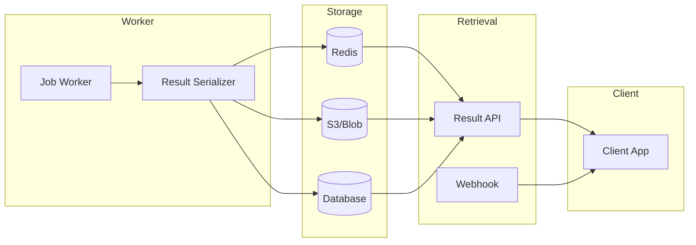

# Result Storage

## Introduction

Long-running operations need a reliable way to store results until clients retrieve them. This lesson covers temporary storage strategies, expiration policies, and notification patterns.

### What We'll Cover

- Temporary result storage
- Result expiration (TTL)
- Result notification
- Polling patterns

### Prerequisites

- Job queue patterns
- Redis basics
- Cloud storage concepts

---

## Storage Architecture



---

## Result Data Model

```python
from dataclasses import dataclass, field
from datetime import datetime, timedelta
from typing import Optional, Any, Dict
from enum import Enum
import json
import hashlib

class ResultStatus(Enum):
    PENDING = "pending"
    PROCESSING = "processing"
    READY = "ready"
    EXPIRED = "expired"
    FAILED = "failed"


@dataclass
class JobResult:
    """Container for job results."""
    
    job_id: str
    status: ResultStatus
    created_at: datetime = field(default_factory=datetime.now)
    expires_at: Optional[datetime] = None
    
    # Result data
    data: Optional[Any] = None
    data_url: Optional[str] = None  # For large results
    
    # Metadata
    content_type: str = "application/json"
    size_bytes: int = 0
    checksum: Optional[str] = None
    
    # Error info
    error: Optional[str] = None
    error_code: Optional[str] = None
    
    def set_data(self, data: Any, ttl_hours: int = 24):
        """Set result data with TTL."""
        
        self.data = data
        self.status = ResultStatus.READY
        self.expires_at = datetime.now() + timedelta(hours=ttl_hours)
        
        # Calculate size and checksum
        serialized = json.dumps(data)
        self.size_bytes = len(serialized.encode())
        self.checksum = hashlib.sha256(serialized.encode()).hexdigest()
    
    def set_error(self, error: str, code: str = None):
        """Set error result."""
        
        self.error = error
        self.error_code = code
        self.status = ResultStatus.FAILED
    
    @property
    def is_expired(self) -> bool:
        """Check if result has expired."""
        
        if not self.expires_at:
            return False
        return datetime.now() > self.expires_at
    
    @property
    def is_ready(self) -> bool:
        """Check if result is ready for retrieval."""
        
        return self.status == ResultStatus.READY and not self.is_expired
    
    def to_dict(self) -> dict:
        """Convert to dictionary."""
        
        return {
            "job_id": self.job_id,
            "status": self.status.value,
            "created_at": self.created_at.isoformat(),
            "expires_at": self.expires_at.isoformat() if self.expires_at else None,
            "content_type": self.content_type,
            "size_bytes": self.size_bytes,
            "checksum": self.checksum,
            "error": self.error,
            "error_code": self.error_code,
            "has_data": self.data is not None,
            "data_url": self.data_url
        }
```

---

## Redis Result Storage

```python
import redis
import json
from typing import Optional
from datetime import timedelta

class RedisResultStore:
    """Store results in Redis with TTL."""
    
    def __init__(
        self,
        redis_client: redis.Redis,
        default_ttl_hours: int = 24,
        max_size_bytes: int = 10 * 1024 * 1024  # 10MB
    ):
        self.redis = redis_client
        self.default_ttl = timedelta(hours=default_ttl_hours)
        self.max_size = max_size_bytes
    
    def _result_key(self, job_id: str) -> str:
        return f"result:{job_id}"
    
    def _data_key(self, job_id: str) -> str:
        return f"result:{job_id}:data"
    
    def store(
        self,
        result: JobResult,
        ttl: timedelta = None
    ) -> bool:
        """Store result with TTL."""
        
        ttl = ttl or self.default_ttl
        key = self._result_key(result.job_id)
        data_key = self._data_key(result.job_id)
        
        # Serialize data separately if present
        if result.data:
            data_json = json.dumps(result.data)
            
            if len(data_json.encode()) > self.max_size:
                raise ValueError(
                    f"Result too large: {len(data_json)} bytes"
                )
            
            # Store data with same TTL
            self.redis.setex(
                data_key,
                ttl,
                data_json
            )
        
        # Store metadata
        metadata = result.to_dict()
        self.redis.setex(
            key,
            ttl,
            json.dumps(metadata)
        )
        
        return True
    
    def get(
        self,
        job_id: str,
        include_data: bool = True
    ) -> Optional[JobResult]:
        """Get result by job ID."""
        
        key = self._result_key(job_id)
        metadata = self.redis.get(key)
        
        if not metadata:
            return None
        
        parsed = json.loads(metadata)
        
        result = JobResult(
            job_id=parsed["job_id"],
            status=ResultStatus(parsed["status"]),
            created_at=datetime.fromisoformat(parsed["created_at"]),
            expires_at=(
                datetime.fromisoformat(parsed["expires_at"])
                if parsed["expires_at"] else None
            ),
            content_type=parsed["content_type"],
            size_bytes=parsed["size_bytes"],
            checksum=parsed["checksum"],
            error=parsed.get("error"),
            error_code=parsed.get("error_code"),
            data_url=parsed.get("data_url")
        )
        
        # Get data if requested
        if include_data and parsed.get("has_data"):
            data_key = self._data_key(job_id)
            data_json = self.redis.get(data_key)
            
            if data_json:
                result.data = json.loads(data_json)
        
        return result
    
    def delete(self, job_id: str) -> bool:
        """Delete result."""
        
        key = self._result_key(job_id)
        data_key = self._data_key(job_id)
        
        self.redis.delete(key, data_key)
        return True
    
    def extend_ttl(
        self,
        job_id: str,
        additional_hours: int
    ) -> bool:
        """Extend result TTL."""
        
        key = self._result_key(job_id)
        data_key = self._data_key(job_id)
        
        ttl = timedelta(hours=additional_hours)
        
        # Get current TTL and add
        current_ttl = self.redis.ttl(key)
        if current_ttl < 0:
            return False
        
        new_ttl = current_ttl + int(ttl.total_seconds())
        
        self.redis.expire(key, new_ttl)
        self.redis.expire(data_key, new_ttl)
        
        return True
    
    def update_status(
        self,
        job_id: str,
        status: ResultStatus
    ):
        """Update result status."""
        
        result = self.get(job_id, include_data=False)
        
        if result:
            result.status = status
            self.store(result)
```

---

## S3 Storage for Large Results

```python
import boto3
import json
from typing import Optional
from datetime import datetime, timedelta
import hashlib

class S3ResultStore:
    """Store large results in S3."""
    
    def __init__(
        self,
        bucket: str,
        prefix: str = "results/",
        default_ttl_days: int = 7,
        region: str = "us-east-1"
    ):
        self.s3 = boto3.client("s3", region_name=region)
        self.bucket = bucket
        self.prefix = prefix
        self.default_ttl_days = default_ttl_days
    
    def _key(self, job_id: str) -> str:
        return f"{self.prefix}{job_id}/result.json"
    
    def _metadata_key(self, job_id: str) -> str:
        return f"{self.prefix}{job_id}/metadata.json"
    
    def store(
        self,
        result: JobResult,
        ttl_days: int = None
    ) -> str:
        """Store result in S3, return URL."""
        
        ttl_days = ttl_days or self.default_ttl_days
        expiration = datetime.now() + timedelta(days=ttl_days)
        
        # Store data
        data_key = self._key(result.job_id)
        data_json = json.dumps(result.data)
        
        self.s3.put_object(
            Bucket=self.bucket,
            Key=data_key,
            Body=data_json.encode(),
            ContentType="application/json",
            Metadata={
                "job_id": result.job_id,
                "checksum": result.checksum or "",
                "expires_at": expiration.isoformat()
            }
        )
        
        # Store metadata
        metadata_key = self._metadata_key(result.job_id)
        result.expires_at = expiration
        result.data_url = self._generate_presigned_url(data_key, ttl_days)
        
        self.s3.put_object(
            Bucket=self.bucket,
            Key=metadata_key,
            Body=json.dumps(result.to_dict()).encode(),
            ContentType="application/json"
        )
        
        # Set lifecycle rule for cleanup
        self._ensure_lifecycle_rule()
        
        return result.data_url
    
    def _generate_presigned_url(
        self,
        key: str,
        ttl_days: int
    ) -> str:
        """Generate presigned URL for download."""
        
        return self.s3.generate_presigned_url(
            "get_object",
            Params={
                "Bucket": self.bucket,
                "Key": key
            },
            ExpiresIn=ttl_days * 24 * 3600
        )
    
    def get_url(
        self,
        job_id: str,
        ttl_hours: int = 1
    ) -> Optional[str]:
        """Get presigned URL for result."""
        
        key = self._key(job_id)
        
        try:
            # Check if exists
            self.s3.head_object(Bucket=self.bucket, Key=key)
            
            return self.s3.generate_presigned_url(
                "get_object",
                Params={
                    "Bucket": self.bucket,
                    "Key": key
                },
                ExpiresIn=ttl_hours * 3600
            )
            
        except self.s3.exceptions.ClientError:
            return None
    
    def get(self, job_id: str) -> Optional[JobResult]:
        """Get result metadata."""
        
        metadata_key = self._metadata_key(job_id)
        
        try:
            response = self.s3.get_object(
                Bucket=self.bucket,
                Key=metadata_key
            )
            
            parsed = json.loads(response["Body"].read())
            
            result = JobResult(
                job_id=parsed["job_id"],
                status=ResultStatus(parsed["status"]),
                created_at=datetime.fromisoformat(parsed["created_at"]),
                expires_at=(
                    datetime.fromisoformat(parsed["expires_at"])
                    if parsed["expires_at"] else None
                ),
                content_type=parsed["content_type"],
                size_bytes=parsed["size_bytes"],
                checksum=parsed["checksum"],
                data_url=parsed.get("data_url")
            )
            
            # Refresh presigned URL
            result.data_url = self.get_url(job_id)
            
            return result
            
        except self.s3.exceptions.NoSuchKey:
            return None
    
    def _ensure_lifecycle_rule(self):
        """Ensure S3 lifecycle rule for cleanup."""
        
        rule = {
            "ID": "ResultExpiration",
            "Status": "Enabled",
            "Filter": {"Prefix": self.prefix},
            "Expiration": {"Days": self.default_ttl_days + 1}
        }
        
        try:
            self.s3.put_bucket_lifecycle_configuration(
                Bucket=self.bucket,
                LifecycleConfiguration={"Rules": [rule]}
            )
        except Exception:
            pass  # Rule may already exist


# Tiered storage
class TieredResultStore:
    """Use Redis for small, S3 for large results."""
    
    def __init__(
        self,
        redis_store: RedisResultStore,
        s3_store: S3ResultStore,
        size_threshold: int = 1024 * 1024  # 1MB
    ):
        self.redis = redis_store
        self.s3 = s3_store
        self.threshold = size_threshold
    
    def store(self, result: JobResult) -> str:
        """Store result in appropriate tier."""
        
        if result.size_bytes > self.threshold:
            # Large result -> S3
            url = self.s3.store(result)
            
            # Store metadata in Redis
            result.data = None
            result.data_url = url
            self.redis.store(result)
            
            return url
        
        # Small result -> Redis
        self.redis.store(result)
        return None
    
    def get(self, job_id: str) -> Optional[JobResult]:
        """Get result from appropriate tier."""
        
        # Check Redis first
        result = self.redis.get(job_id)
        
        if not result:
            return None
        
        # If data is in S3, refresh URL
        if result.data_url and not result.data:
            result.data_url = self.s3.get_url(job_id)
        
        return result
```

---

## Result Notification

### Webhook Notification

```python
import httpx
from dataclasses import dataclass
from typing import Optional, Callable
import asyncio
import json

@dataclass
class NotificationConfig:
    """Webhook notification config."""
    
    webhook_url: str
    secret: Optional[str] = None
    max_retries: int = 3
    timeout: float = 10.0


class ResultNotifier:
    """Notify clients when results are ready."""
    
    def __init__(self):
        self.configs: dict[str, NotificationConfig] = {}
    
    def register(
        self,
        job_id: str,
        config: NotificationConfig
    ):
        """Register webhook for job."""
        
        self.configs[job_id] = config
    
    async def notify(
        self,
        job_id: str,
        result: JobResult
    ) -> bool:
        """Send result notification."""
        
        config = self.configs.get(job_id)
        
        if not config:
            return False
        
        payload = {
            "event": "result.ready",
            "job_id": job_id,
            "status": result.status.value,
            "result_url": result.data_url,
            "size_bytes": result.size_bytes,
            "expires_at": (
                result.expires_at.isoformat()
                if result.expires_at else None
            )
        }
        
        # Sign payload
        headers = {"Content-Type": "application/json"}
        
        if config.secret:
            signature = self._sign_payload(payload, config.secret)
            headers["X-Signature"] = signature
        
        # Send with retries
        for attempt in range(config.max_retries):
            try:
                async with httpx.AsyncClient() as client:
                    response = await client.post(
                        config.webhook_url,
                        json=payload,
                        headers=headers,
                        timeout=config.timeout
                    )
                    
                    if response.status_code < 300:
                        return True
                        
            except Exception as e:
                print(f"Notification failed (attempt {attempt + 1}): {e}")
                
                if attempt < config.max_retries - 1:
                    await asyncio.sleep(2 ** attempt)
        
        return False
    
    def _sign_payload(
        self,
        payload: dict,
        secret: str
    ) -> str:
        """Sign payload with HMAC."""
        
        import hmac
        import hashlib
        
        message = json.dumps(payload, sort_keys=True)
        signature = hmac.new(
            secret.encode(),
            message.encode(),
            hashlib.sha256
        ).hexdigest()
        
        return f"sha256={signature}"


# Email notification
class EmailNotifier:
    """Send email when results ready."""
    
    def __init__(self, smtp_config: dict):
        self.config = smtp_config
    
    async def notify(
        self,
        email: str,
        job_id: str,
        result: JobResult
    ):
        """Send result notification email."""
        
        import smtplib
        from email.mime.text import MIMEText
        
        subject = f"Job {job_id[:8]} Complete"
        
        body = f"""
Your AI processing job has completed.

Job ID: {job_id}
Status: {result.status.value}
Size: {result.size_bytes:,} bytes

Download your results:
{result.data_url}

This link expires: {result.expires_at}
        """
        
        msg = MIMEText(body)
        msg["Subject"] = subject
        msg["From"] = self.config["from"]
        msg["To"] = email
        
        with smtplib.SMTP(self.config["host"], self.config["port"]) as server:
            server.starttls()
            server.login(self.config["user"], self.config["password"])
            server.sendmail(
                self.config["from"],
                [email],
                msg.as_string()
            )
```

---

## Polling Patterns

```python
from flask import Flask, jsonify, request
from typing import Optional
import time

app = Flask(__name__)

# Result store
result_store = RedisResultStore(redis.Redis())


@app.route("/api/jobs/<job_id>/result")
def get_result(job_id: str):
    """Get job result with polling support."""
    
    result = result_store.get(job_id)
    
    if not result:
        return jsonify({
            "error": "Job not found"
        }), 404
    
    if result.status == ResultStatus.PENDING:
        return jsonify({
            "status": "pending",
            "retry_after": 5
        }), 202
    
    if result.status == ResultStatus.PROCESSING:
        return jsonify({
            "status": "processing",
            "retry_after": 2
        }), 202
    
    if result.is_expired:
        return jsonify({
            "error": "Result expired",
            "expired_at": result.expires_at.isoformat()
        }), 410
    
    if result.status == ResultStatus.FAILED:
        return jsonify({
            "status": "failed",
            "error": result.error,
            "error_code": result.error_code
        }), 500
    
    # Result ready
    response = {
        "status": "ready",
        "job_id": job_id,
        "size_bytes": result.size_bytes,
        "expires_at": result.expires_at.isoformat(),
        "checksum": result.checksum
    }
    
    # Include data or URL
    if result.data:
        response["data"] = result.data
    else:
        response["download_url"] = result.data_url
    
    return jsonify(response)


@app.route("/api/jobs/<job_id>/result/extend", methods=["POST"])
def extend_result(job_id: str):
    """Extend result TTL."""
    
    hours = request.json.get("hours", 24)
    
    if result_store.extend_ttl(job_id, hours):
        result = result_store.get(job_id, include_data=False)
        
        return jsonify({
            "job_id": job_id,
            "new_expires_at": result.expires_at.isoformat()
        })
    
    return jsonify({"error": "Result not found"}), 404


# Client polling implementation
"""
async function pollForResult(jobId, options = {}) {
    const {
        maxWait = 300000,  // 5 minutes
        onProgress = null
    } = options;
    
    const start = Date.now();
    
    while (Date.now() - start < maxWait) {
        const response = await fetch(`/api/jobs/${jobId}/result`);
        const data = await response.json();
        
        if (response.status === 200) {
            // Result ready
            return data;
        }
        
        if (response.status === 202) {
            // Still processing
            onProgress?.(data.status);
            await new Promise(r => setTimeout(r, data.retry_after * 1000));
            continue;
        }
        
        if (response.status === 410) {
            throw new Error('Result expired');
        }
        
        if (response.status >= 400) {
            throw new Error(data.error);
        }
    }
    
    throw new Error('Polling timeout');
}

// Usage
try {
    const result = await pollForResult('job123', {
        onProgress: (status) => console.log(`Status: ${status}`)
    });
    
    if (result.download_url) {
        // Large result - download separately
        const data = await fetch(result.download_url).then(r => r.json());
    } else {
        // Small result - inline
        console.log(result.data);
    }
} catch (error) {
    console.error('Failed:', error);
}
"""


# Long polling endpoint
@app.route("/api/jobs/<job_id>/result/wait")
def wait_for_result(job_id: str):
    """Long polling - wait for result."""
    
    timeout = int(request.args.get("timeout", 30))
    timeout = min(timeout, 60)  # Max 60 seconds
    
    start = time.time()
    
    while time.time() - start < timeout:
        result = result_store.get(job_id)
        
        if not result:
            return jsonify({"error": "Job not found"}), 404
        
        if result.status in [ResultStatus.READY, ResultStatus.FAILED]:
            return get_result(job_id)
        
        time.sleep(0.5)
    
    # Timeout - return current status
    return jsonify({
        "status": result.status.value if result else "unknown",
        "timeout": True
    }), 202
```

---

## Result Streaming

```python
from flask import Response
import json

@app.route("/api/jobs/<job_id>/result/stream")
def stream_result(job_id: str):
    """Stream large result in chunks."""
    
    result = result_store.get(job_id)
    
    if not result or result.status != ResultStatus.READY:
        return jsonify({"error": "Result not ready"}), 404
    
    def generate():
        # Stream data in chunks
        data = result.data
        
        if isinstance(data, list):
            yield "["
            for i, item in enumerate(data):
                if i > 0:
                    yield ","
                yield json.dumps(item)
            yield "]"
        else:
            yield json.dumps(data)
    
    return Response(
        generate(),
        mimetype="application/json",
        headers={
            "X-Total-Size": str(result.size_bytes),
            "X-Checksum": result.checksum
        }
    )


# Chunked download for S3
class ChunkedDownloader:
    """Download large S3 results in chunks."""
    
    def __init__(self, s3_store: S3ResultStore):
        self.s3 = s3_store
    
    async def download_chunks(
        self,
        job_id: str,
        chunk_size: int = 1024 * 1024
    ):
        """Yield result in chunks."""
        
        key = self.s3._key(job_id)
        
        response = self.s3.s3.get_object(
            Bucket=self.s3.bucket,
            Key=key
        )
        
        body = response["Body"]
        
        while True:
            chunk = body.read(chunk_size)
            if not chunk:
                break
            yield chunk
```

---

## Cleanup and Expiration

```python
import threading
import time
from datetime import datetime
from typing import List

class ResultCleaner:
    """Clean up expired results."""
    
    def __init__(
        self,
        redis_store: RedisResultStore,
        scan_interval: int = 3600
    ):
        self.redis = redis_store
        self.interval = scan_interval
        self._stop = False
        self._thread = None
    
    def start(self):
        """Start cleanup thread."""
        
        self._thread = threading.Thread(target=self._run)
        self._thread.daemon = True
        self._thread.start()
    
    def stop(self):
        """Stop cleanup."""
        
        self._stop = True
        if self._thread:
            self._thread.join()
    
    def _run(self):
        """Run cleanup loop."""
        
        while not self._stop:
            self._cleanup()
            time.sleep(self.interval)
    
    def _cleanup(self):
        """Scan and clean expired results."""
        
        # Scan for result keys
        cursor = 0
        cleaned = 0
        
        while True:
            cursor, keys = self.redis.redis.scan(
                cursor,
                match="result:*",
                count=100
            )
            
            for key in keys:
                # Skip data keys
                if key.endswith(b":data"):
                    continue
                
                # Check TTL
                ttl = self.redis.redis.ttl(key)
                
                if ttl < 0:
                    # Expired or no TTL - clean up
                    job_id = key.decode().split(":")[1]
                    self.redis.delete(job_id)
                    cleaned += 1
            
            if cursor == 0:
                break
        
        if cleaned > 0:
            print(f"Cleaned {cleaned} expired results")


# Scheduled cleanup with notification
class ExpirationNotifier:
    """Notify before results expire."""
    
    def __init__(
        self,
        store: RedisResultStore,
        notifier: ResultNotifier,
        warning_hours: int = 2
    ):
        self.store = store
        self.notifier = notifier
        self.warning_hours = warning_hours
    
    async def check_expiring(self) -> List[str]:
        """Find and notify about expiring results."""
        
        expiring = []
        cursor = 0
        
        while True:
            cursor, keys = self.store.redis.scan(
                cursor,
                match="result:*",
                count=100
            )
            
            for key in keys:
                if key.endswith(b":data"):
                    continue
                
                job_id = key.decode().split(":")[1]
                result = self.store.get(job_id, include_data=False)
                
                if not result or not result.expires_at:
                    continue
                
                # Check if expiring soon
                hours_left = (
                    result.expires_at - datetime.now()
                ).total_seconds() / 3600
                
                if 0 < hours_left < self.warning_hours:
                    expiring.append(job_id)
                    
                    # Send warning
                    await self._send_warning(job_id, result)
            
            if cursor == 0:
                break
        
        return expiring
    
    async def _send_warning(
        self,
        job_id: str,
        result: JobResult
    ):
        """Send expiration warning."""
        
        # Implementation depends on notification channel
        pass
```

---

## Hands-on Exercise

### Your Task

Build a result storage system with tiered storage and expiration.

### Requirements

1. Store small results in Redis
2. Store large results in filesystem (simulating S3)
3. Implement TTL and cleanup
4. Support result download

<details>
<summary>💡 Hints</summary>

- Use 1MB threshold for tiering
- Track metadata in Redis always
- Use file checksums for integrity
</details>

<details>
<summary>✅ Solution</summary>

```python
from dataclasses import dataclass, field
from datetime import datetime, timedelta
from typing import Optional, Any, Dict
from pathlib import Path
import json
import hashlib
import os
import threading
import time

class ResultStatus:
    PENDING = "pending"
    READY = "ready"
    EXPIRED = "expired"


@dataclass
class StoredResult:
    job_id: str
    status: str = ResultStatus.PENDING
    created_at: datetime = field(default_factory=datetime.now)
    expires_at: Optional[datetime] = None
    data: Optional[Any] = None
    file_path: Optional[str] = None
    size_bytes: int = 0
    checksum: Optional[str] = None


class TieredResultStorage:
    """Tiered storage with Redis + filesystem."""
    
    def __init__(
        self,
        storage_dir: str = "./results",
        size_threshold: int = 1024 * 1024,  # 1MB
        default_ttl_hours: int = 24
    ):
        self.storage_dir = Path(storage_dir)
        self.storage_dir.mkdir(exist_ok=True)
        self.threshold = size_threshold
        self.default_ttl = timedelta(hours=default_ttl_hours)
        
        # In-memory metadata (simulating Redis)
        self.metadata: Dict[str, dict] = {}
        self._lock = threading.Lock()
    
    def store(
        self,
        job_id: str,
        data: Any,
        ttl_hours: int = None
    ) -> StoredResult:
        """Store result in appropriate tier."""
        
        ttl = timedelta(hours=ttl_hours or self.default_ttl.total_seconds() / 3600)
        expires_at = datetime.now() + ttl
        
        # Serialize
        data_json = json.dumps(data)
        data_bytes = data_json.encode()
        size = len(data_bytes)
        checksum = hashlib.sha256(data_bytes).hexdigest()
        
        result = StoredResult(
            job_id=job_id,
            status=ResultStatus.READY,
            expires_at=expires_at,
            size_bytes=size,
            checksum=checksum
        )
        
        if size > self.threshold:
            # Large -> filesystem
            file_path = self.storage_dir / f"{job_id}.json"
            file_path.write_bytes(data_bytes)
            result.file_path = str(file_path)
        else:
            # Small -> in-memory
            result.data = data
        
        # Store metadata
        with self._lock:
            self.metadata[job_id] = {
                "job_id": job_id,
                "status": result.status,
                "created_at": result.created_at.isoformat(),
                "expires_at": result.expires_at.isoformat(),
                "size_bytes": result.size_bytes,
                "checksum": result.checksum,
                "file_path": result.file_path,
                "has_inline_data": result.data is not None,
                "inline_data": result.data
            }
        
        return result
    
    def get(
        self,
        job_id: str,
        include_data: bool = True
    ) -> Optional[StoredResult]:
        """Get result."""
        
        with self._lock:
            meta = self.metadata.get(job_id)
        
        if not meta:
            return None
        
        result = StoredResult(
            job_id=meta["job_id"],
            status=meta["status"],
            created_at=datetime.fromisoformat(meta["created_at"]),
            expires_at=datetime.fromisoformat(meta["expires_at"]),
            size_bytes=meta["size_bytes"],
            checksum=meta["checksum"],
            file_path=meta.get("file_path")
        )
        
        # Check expiration
        if result.expires_at < datetime.now():
            result.status = ResultStatus.EXPIRED
            return result
        
        if include_data:
            if meta.get("has_inline_data"):
                result.data = meta["inline_data"]
            elif result.file_path:
                file_path = Path(result.file_path)
                if file_path.exists():
                    result.data = json.loads(file_path.read_text())
        
        return result
    
    def delete(self, job_id: str) -> bool:
        """Delete result."""
        
        with self._lock:
            meta = self.metadata.pop(job_id, None)
        
        if not meta:
            return False
        
        # Delete file if exists
        if meta.get("file_path"):
            file_path = Path(meta["file_path"])
            if file_path.exists():
                file_path.unlink()
        
        return True
    
    def extend_ttl(
        self,
        job_id: str,
        hours: int
    ) -> bool:
        """Extend TTL."""
        
        with self._lock:
            meta = self.metadata.get(job_id)
            
            if not meta:
                return False
            
            current = datetime.fromisoformat(meta["expires_at"])
            new_expires = current + timedelta(hours=hours)
            meta["expires_at"] = new_expires.isoformat()
        
        return True
    
    def cleanup_expired(self) -> int:
        """Clean up expired results."""
        
        cleaned = 0
        now = datetime.now()
        
        with self._lock:
            expired_ids = [
                job_id for job_id, meta in self.metadata.items()
                if datetime.fromisoformat(meta["expires_at"]) < now
            ]
        
        for job_id in expired_ids:
            if self.delete(job_id):
                cleaned += 1
        
        return cleaned
    
    def get_download_info(
        self,
        job_id: str
    ) -> Optional[dict]:
        """Get download info for result."""
        
        result = self.get(job_id, include_data=False)
        
        if not result or result.status == ResultStatus.EXPIRED:
            return None
        
        return {
            "job_id": job_id,
            "size_bytes": result.size_bytes,
            "checksum": result.checksum,
            "expires_at": result.expires_at.isoformat(),
            "storage_type": "file" if result.file_path else "inline"
        }


# Test it
def test_tiered_storage():
    storage = TieredResultStorage(
        storage_dir="./test_results",
        size_threshold=100,  # Low threshold for testing
        default_ttl_hours=1
    )
    
    # Small result -> inline
    small_result = storage.store(
        "job_small",
        {"message": "Hello"}
    )
    print(f"Small: inline={small_result.data is not None}, file={small_result.file_path}")
    
    # Large result -> file
    large_data = {"items": list(range(100))}
    large_result = storage.store(
        "job_large",
        large_data
    )
    print(f"Large: inline={large_result.data is not None}, file={large_result.file_path}")
    
    # Retrieve
    retrieved = storage.get("job_large")
    print(f"Retrieved: {len(retrieved.data['items'])} items")
    
    # Download info
    info = storage.get_download_info("job_large")
    print(f"Download info: {info}")
    
    # Extend TTL
    storage.extend_ttl("job_small", 24)
    
    # Cleanup
    # (Would need to wait for expiration in real test)
    
    # Delete
    storage.delete("job_small")
    storage.delete("job_large")
    
    print("✅ All tests passed")


test_tiered_storage()
```

**Output:**
```
Small: inline=True, file=None
Large: inline=False, file=./test_results/job_large.json
Retrieved: 100 items
Download info: {'job_id': 'job_large', 'size_bytes': 391, 'checksum': '...', 'expires_at': '...', 'storage_type': 'file'}
✅ All tests passed
```

</details>

---

## Summary

✅ Use tiered storage for efficiency  
✅ Always set TTL on results  
✅ Notify clients when results ready  
✅ Support both polling and push  
✅ Clean up expired results automatically

**Next:** [Background Mode](./06-background-mode.md)

---

## Further Reading

- [Redis Expiration](https://redis.io/commands/expire/) — TTL management
- [S3 Lifecycle](https://docs.aws.amazon.com/AmazonS3/latest/userguide/object-lifecycle-mgmt.html) — Object expiration
- [Presigned URLs](https://docs.aws.amazon.com/AmazonS3/latest/userguide/ShareObjectPreSignedURL.html) — Secure download links

<!-- 
Sources Consulted:
- Redis commands: https://redis.io/commands/
- AWS S3 SDK: https://boto3.amazonaws.com/v1/documentation/api/latest/reference/services/s3.html
-->
