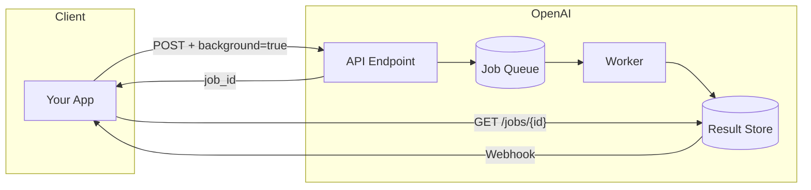

# Background Mode

## Introduction

OpenAI and other providers now offer background processing modes that let you submit long-running jobs without maintaining connections. This lesson covers the `background` parameter, async retrieval, and Deep Research APIs.

### What We'll Cover

- OpenAI background parameter
- Async response retrieval
- Webhook notifications
- Deep Research API

### Prerequisites

- OpenAI API basics
- Webhook concepts
- Job queue patterns

---

## Background Mode Architecture



---

## OpenAI Background Parameter

```python
from openai import OpenAI
from typing import Optional
import time

client = OpenAI()


def submit_background_job(
    messages: list,
    model: str = "gpt-4o",
    webhook_url: str = None
) -> dict:
    """Submit a request for background processing."""
    
    # Request parameters
    params = {
        "model": model,
        "messages": messages,
        "background": True  # Enable background mode
    }
    
    # Optional webhook for completion notification
    if webhook_url:
        params["webhook"] = {
            "url": webhook_url,
            "events": ["job.completed", "job.failed"]
        }
    
    response = client.chat.completions.create(**params)
    
    # Background response returns job info
    return {
        "job_id": response.id,
        "status": response.status,
        "created_at": response.created
    }


def get_job_status(job_id: str) -> dict:
    """Check job status."""
    
    job = client.jobs.retrieve(job_id)
    
    return {
        "id": job.id,
        "status": job.status,
        "created_at": job.created,
        "completed_at": job.completed_at,
        "result": job.result if job.status == "completed" else None,
        "error": job.error if job.status == "failed" else None
    }


def poll_for_completion(
    job_id: str,
    timeout: int = 300,
    interval: int = 5
) -> dict:
    """Poll until job completes."""
    
    start = time.time()
    
    while time.time() - start < timeout:
        status = get_job_status(job_id)
        
        if status["status"] == "completed":
            return status["result"]
        
        if status["status"] == "failed":
            raise Exception(f"Job failed: {status['error']}")
        
        time.sleep(interval)
    
    raise TimeoutError(f"Job {job_id} did not complete in {timeout}s")


# Usage
job = submit_background_job(
    messages=[
        {"role": "user", "content": "Analyze this large document..."}
    ],
    webhook_url="https://myapp.com/webhooks/openai"
)

print(f"Submitted job: {job['job_id']}")

# Option 1: Poll
result = poll_for_completion(job['job_id'])

# Option 2: Wait for webhook (preferred)
```

---

## Async Response Retrieval

```python
from dataclasses import dataclass
from typing import Optional, Callable
from datetime import datetime
import asyncio
import httpx

@dataclass
class BackgroundJob:
    """Track a background job."""
    
    id: str
    status: str
    created_at: datetime
    model: str
    prompt_tokens: Optional[int] = None
    completion_tokens: Optional[int] = None
    result: Optional[dict] = None
    error: Optional[str] = None


class AsyncOpenAIClient:
    """Async client for background jobs."""
    
    def __init__(self, api_key: str):
        self.api_key = api_key
        self.base_url = "https://api.openai.com/v1"
    
    async def submit_background(
        self,
        messages: list,
        model: str = "gpt-4o",
        **kwargs
    ) -> BackgroundJob:
        """Submit background job."""
        
        async with httpx.AsyncClient() as client:
            response = await client.post(
                f"{self.base_url}/chat/completions",
                headers={
                    "Authorization": f"Bearer {self.api_key}",
                    "Content-Type": "application/json"
                },
                json={
                    "model": model,
                    "messages": messages,
                    "background": True,
                    **kwargs
                }
            )
            
            data = response.json()
            
            return BackgroundJob(
                id=data["id"],
                status=data["status"],
                created_at=datetime.fromisoformat(data["created"]),
                model=model
            )
    
    async def get_job(self, job_id: str) -> BackgroundJob:
        """Get job status and result."""
        
        async with httpx.AsyncClient() as client:
            response = await client.get(
                f"{self.base_url}/jobs/{job_id}",
                headers={"Authorization": f"Bearer {self.api_key}"}
            )
            
            data = response.json()
            
            return BackgroundJob(
                id=data["id"],
                status=data["status"],
                created_at=datetime.fromisoformat(data["created"]),
                model=data.get("model", "unknown"),
                prompt_tokens=data.get("usage", {}).get("prompt_tokens"),
                completion_tokens=data.get("usage", {}).get("completion_tokens"),
                result=data.get("result"),
                error=data.get("error")
            )
    
    async def wait_for_completion(
        self,
        job_id: str,
        timeout: float = 300,
        poll_interval: float = 2.0,
        on_status: Callable = None
    ) -> BackgroundJob:
        """Wait for job completion."""
        
        start = asyncio.get_event_loop().time()
        
        while asyncio.get_event_loop().time() - start < timeout:
            job = await self.get_job(job_id)
            
            if on_status:
                on_status(job)
            
            if job.status == "completed":
                return job
            
            if job.status == "failed":
                raise Exception(f"Job failed: {job.error}")
            
            await asyncio.sleep(poll_interval)
        
        raise TimeoutError(f"Timeout waiting for job {job_id}")
    
    async def cancel_job(self, job_id: str) -> bool:
        """Cancel a pending job."""
        
        async with httpx.AsyncClient() as client:
            response = await client.post(
                f"{self.base_url}/jobs/{job_id}/cancel",
                headers={"Authorization": f"Bearer {self.api_key}"}
            )
            
            return response.status_code == 200


# Usage
async def process_large_document(document: str):
    """Process document in background."""
    
    client = AsyncOpenAIClient(os.environ["OPENAI_API_KEY"])
    
    # Submit
    job = await client.submit_background(
        messages=[
            {"role": "system", "content": "You are a document analyst."},
            {"role": "user", "content": f"Analyze: {document}"}
        ],
        model="gpt-4o"
    )
    
    print(f"Submitted: {job.id}")
    
    # Wait with progress
    result = await client.wait_for_completion(
        job.id,
        on_status=lambda j: print(f"Status: {j.status}")
    )
    
    print(f"Tokens: {result.prompt_tokens} + {result.completion_tokens}")
    return result.result
```

---

## Webhook Integration

```python
from flask import Flask, request, jsonify
from dataclasses import dataclass
from typing import Dict, Callable
import hmac
import hashlib
import json

app = Flask(__name__)


@dataclass
class JobCallback:
    """Callback for job completion."""
    
    job_id: str
    on_complete: Callable
    on_error: Callable


# Track pending jobs
pending_jobs: Dict[str, JobCallback] = {}


def register_job_callback(
    job_id: str,
    on_complete: Callable,
    on_error: Callable
):
    """Register callbacks for job."""
    
    pending_jobs[job_id] = JobCallback(
        job_id=job_id,
        on_complete=on_complete,
        on_error=on_error
    )


@app.route("/webhooks/openai", methods=["POST"])
def openai_webhook():
    """Handle OpenAI job webhooks."""
    
    # Verify signature
    signature = request.headers.get("X-OpenAI-Signature")
    
    if not verify_signature(request.data, signature):
        return jsonify({"error": "Invalid signature"}), 401
    
    payload = request.json
    event_type = payload.get("type")
    job_id = payload.get("data", {}).get("id")
    
    callback = pending_jobs.get(job_id)
    
    if not callback:
        return jsonify({"status": "ignored"})
    
    if event_type == "job.completed":
        result = payload["data"]["result"]
        callback.on_complete(result)
        
    elif event_type == "job.failed":
        error = payload["data"]["error"]
        callback.on_error(error)
    
    # Clean up
    pending_jobs.pop(job_id, None)
    
    return jsonify({"status": "processed"})


def verify_signature(payload: bytes, signature: str) -> bool:
    """Verify OpenAI webhook signature."""
    
    secret = os.environ.get("OPENAI_WEBHOOK_SECRET")
    
    if not secret:
        return False
    
    expected = hmac.new(
        secret.encode(),
        payload,
        hashlib.sha256
    ).hexdigest()
    
    return hmac.compare_digest(f"sha256={expected}", signature)


# Async wrapper for webhook-based flow
class WebhookJobManager:
    """Manage background jobs with webhooks."""
    
    def __init__(
        self,
        client: AsyncOpenAIClient,
        webhook_url: str
    ):
        self.client = client
        self.webhook_url = webhook_url
        self.futures: Dict[str, asyncio.Future] = {}
    
    async def submit_and_wait(
        self,
        messages: list,
        timeout: float = 300,
        **kwargs
    ) -> dict:
        """Submit job and wait via webhook."""
        
        # Create future for result
        loop = asyncio.get_event_loop()
        future = loop.create_future()
        
        # Submit job
        job = await self.client.submit_background(
            messages=messages,
            webhook={
                "url": self.webhook_url,
                "events": ["job.completed", "job.failed"]
            },
            **kwargs
        )
        
        # Register future
        self.futures[job.id] = future
        
        # Register callback
        def on_complete(result):
            if not future.done():
                future.set_result(result)
        
        def on_error(error):
            if not future.done():
                future.set_exception(Exception(error))
        
        register_job_callback(job.id, on_complete, on_error)
        
        # Wait with timeout
        try:
            return await asyncio.wait_for(future, timeout)
        except asyncio.TimeoutError:
            # Cancel job on timeout
            await self.client.cancel_job(job.id)
            raise
        finally:
            self.futures.pop(job.id, None)
```

---

## Deep Research API

The Deep Research API is designed for complex queries requiring extensive analysis.

```python
from openai import OpenAI
from typing import Optional, List
from dataclasses import dataclass
from datetime import datetime
import time

@dataclass
class ResearchResult:
    """Deep research result."""
    
    job_id: str
    query: str
    summary: str
    findings: List[dict]
    sources: List[str]
    confidence: float
    tokens_used: int
    duration_seconds: float


class DeepResearchClient:
    """Client for Deep Research API."""
    
    def __init__(self, api_key: str = None):
        self.client = OpenAI(api_key=api_key)
    
    def submit_research(
        self,
        query: str,
        depth: str = "standard",  # standard, deep, comprehensive
        domains: List[str] = None,
        max_sources: int = 10
    ) -> str:
        """Submit deep research query."""
        
        response = self.client.research.create(
            query=query,
            depth=depth,
            settings={
                "domains": domains,
                "max_sources": max_sources,
                "include_citations": True
            },
            background=True  # Always async
        )
        
        return response.id
    
    def get_research(self, job_id: str) -> Optional[ResearchResult]:
        """Get research result."""
        
        job = self.client.research.retrieve(job_id)
        
        if job.status != "completed":
            return None
        
        return ResearchResult(
            job_id=job.id,
            query=job.query,
            summary=job.result.summary,
            findings=job.result.findings,
            sources=job.result.sources,
            confidence=job.result.confidence,
            tokens_used=job.usage.total_tokens,
            duration_seconds=job.duration
        )
    
    def wait_for_research(
        self,
        job_id: str,
        timeout: int = 600,  # Research can take 10+ minutes
        on_progress: callable = None
    ) -> ResearchResult:
        """Wait for research to complete."""
        
        start = time.time()
        
        while time.time() - start < timeout:
            job = self.client.research.retrieve(job_id)
            
            if on_progress:
                on_progress({
                    "status": job.status,
                    "progress": getattr(job, "progress", None),
                    "current_step": getattr(job, "current_step", None)
                })
            
            if job.status == "completed":
                return self.get_research(job_id)
            
            if job.status == "failed":
                raise Exception(f"Research failed: {job.error}")
            
            # Research takes longer, poll less frequently
            time.sleep(10)
        
        raise TimeoutError("Research timeout")


# Usage
def research_topic(topic: str):
    """Conduct deep research on a topic."""
    
    client = DeepResearchClient()
    
    job_id = client.submit_research(
        query=f"Comprehensive analysis of {topic}",
        depth="deep",
        max_sources=20
    )
    
    print(f"Research started: {job_id}")
    
    result = client.wait_for_research(
        job_id,
        on_progress=lambda p: print(f"  {p['status']}: {p.get('current_step', '')}")
    )
    
    print(f"\n=== Research Complete ===")
    print(f"Confidence: {result.confidence:.0%}")
    print(f"\nSummary:\n{result.summary}")
    print(f"\nSources: {len(result.sources)}")
    
    return result
```

---

## Encrypted Reasoning (ZDR)

Zero Data Retention with encrypted reasoning for sensitive queries.

```python
from typing import Optional
from dataclasses import dataclass

@dataclass
class EncryptedReasoningConfig:
    """Config for encrypted reasoning."""
    
    enabled: bool = True
    encryption_key_id: Optional[str] = None  # Customer-managed key
    reasoning_visibility: str = "none"  # none, summary, full


class SecureBackgroundClient:
    """Background jobs with encrypted reasoning."""
    
    def __init__(self, client: OpenAI):
        self.client = client
    
    def submit_secure(
        self,
        messages: list,
        model: str = "gpt-4o",
        encryption_config: EncryptedReasoningConfig = None
    ) -> str:
        """Submit with encrypted reasoning."""
        
        config = encryption_config or EncryptedReasoningConfig()
        
        params = {
            "model": model,
            "messages": messages,
            "background": True,
            "store": False,  # Don't store in OpenAI
            "metadata": {
                "zero_data_retention": True
            }
        }
        
        if config.enabled:
            params["reasoning"] = {
                "encrypted": True,
                "visibility": config.reasoning_visibility,
                "key_id": config.encryption_key_id
            }
        
        response = self.client.chat.completions.create(**params)
        
        return response.id
    
    def get_secure_result(
        self,
        job_id: str,
        decryption_key: str = None
    ) -> dict:
        """Get result with optional reasoning decryption."""
        
        job = self.client.jobs.retrieve(job_id)
        
        result = {
            "id": job.id,
            "status": job.status,
            "content": job.result.content if job.result else None
        }
        
        # Decrypt reasoning if key provided
        if decryption_key and job.result:
            encrypted_reasoning = job.result.get("encrypted_reasoning")
            
            if encrypted_reasoning:
                result["reasoning"] = self._decrypt(
                    encrypted_reasoning,
                    decryption_key
                )
        
        return result
    
    def _decrypt(self, data: str, key: str) -> str:
        """Decrypt reasoning traces."""
        
        # Implementation depends on encryption scheme
        # Typically uses customer's KMS
        pass


# Usage for sensitive data
def process_sensitive_document(document: str):
    """Process with encrypted reasoning."""
    
    client = SecureBackgroundClient(OpenAI())
    
    job_id = client.submit_secure(
        messages=[
            {"role": "user", "content": f"Analyze PII in: {document}"}
        ],
        encryption_config=EncryptedReasoningConfig(
            enabled=True,
            reasoning_visibility="none"
        )
    )
    
    # Wait and retrieve
    # Reasoning traces are encrypted and not visible
    result = client.get_secure_result(job_id)
    
    return result["content"]
```

---

## Provider Comparison

| Feature | OpenAI | Anthropic | Google |
|---------|--------|-----------|--------|
| Background mode | `background: true` | Batch API | Batch prediction |
| Max wait time | Configurable | 24 hours | Hours |
| Webhook notify | Yes | No | Pub/Sub |
| Cancel job | Yes | Limited | Yes |
| Result storage | 24 hours | 24 hours | Configurable |

---

## Multi-Provider Background

```python
from abc import ABC, abstractmethod
from typing import Optional
from dataclasses import dataclass
from enum import Enum

class Provider(Enum):
    OPENAI = "openai"
    ANTHROPIC = "anthropic"
    GOOGLE = "google"


@dataclass
class BackgroundRequest:
    """Provider-agnostic background request."""
    
    messages: list
    model: str
    webhook_url: Optional[str] = None
    timeout: int = 300


@dataclass
class BackgroundResponse:
    """Provider-agnostic response."""
    
    job_id: str
    provider: Provider
    status: str
    result: Optional[dict] = None
    error: Optional[str] = None


class BackgroundProvider(ABC):
    """Abstract background provider."""
    
    @abstractmethod
    async def submit(self, request: BackgroundRequest) -> str:
        pass
    
    @abstractmethod
    async def get_status(self, job_id: str) -> BackgroundResponse:
        pass
    
    @abstractmethod
    async def cancel(self, job_id: str) -> bool:
        pass


class OpenAIBackground(BackgroundProvider):
    """OpenAI background implementation."""
    
    def __init__(self, api_key: str):
        self.client = OpenAI(api_key=api_key)
    
    async def submit(self, request: BackgroundRequest) -> str:
        response = self.client.chat.completions.create(
            model=request.model,
            messages=request.messages,
            background=True
        )
        return response.id
    
    async def get_status(self, job_id: str) -> BackgroundResponse:
        job = self.client.jobs.retrieve(job_id)
        
        return BackgroundResponse(
            job_id=job.id,
            provider=Provider.OPENAI,
            status=job.status,
            result=job.result,
            error=job.error
        )
    
    async def cancel(self, job_id: str) -> bool:
        try:
            self.client.jobs.cancel(job_id)
            return True
        except:
            return False


class AnthropicBackground(BackgroundProvider):
    """Anthropic batch API implementation."""
    
    def __init__(self, api_key: str):
        self.api_key = api_key
    
    async def submit(self, request: BackgroundRequest) -> str:
        # Anthropic uses batch API
        # Implementation would create a batch job
        pass
    
    async def get_status(self, job_id: str) -> BackgroundResponse:
        pass
    
    async def cancel(self, job_id: str) -> bool:
        pass


class UnifiedBackgroundClient:
    """Unified client for background jobs."""
    
    def __init__(self):
        self.providers: dict[Provider, BackgroundProvider] = {}
    
    def register(
        self,
        provider: Provider,
        implementation: BackgroundProvider
    ):
        """Register provider."""
        
        self.providers[provider] = implementation
    
    async def submit(
        self,
        request: BackgroundRequest,
        provider: Provider
    ) -> str:
        """Submit to provider."""
        
        impl = self.providers.get(provider)
        
        if not impl:
            raise ValueError(f"Provider not registered: {provider}")
        
        return await impl.submit(request)
    
    async def wait_for_any(
        self,
        jobs: list[tuple[Provider, str]],
        timeout: float = 300
    ) -> BackgroundResponse:
        """Wait for any job to complete."""
        
        import asyncio
        
        async def check_job(provider: Provider, job_id: str):
            while True:
                status = await self.providers[provider].get_status(job_id)
                
                if status.status in ["completed", "failed"]:
                    return status
                
                await asyncio.sleep(2)
        
        tasks = [
            check_job(provider, job_id)
            for provider, job_id in jobs
        ]
        
        done, pending = await asyncio.wait(
            tasks,
            timeout=timeout,
            return_when=asyncio.FIRST_COMPLETED
        )
        
        # Cancel pending
        for task in pending:
            task.cancel()
        
        if done:
            return done.pop().result()
        
        raise TimeoutError("No jobs completed in time")
```

---

## Hands-on Exercise

### Your Task

Build a background job manager with webhook support.

### Requirements

1. Submit background jobs
2. Track job status
3. Handle webhook callbacks
4. Support job cancellation

<details>
<summary>💡 Hints</summary>

- Use in-memory store for simplicity
- Simulate webhook with direct callback
- Track timing for metrics
</details>

<details>
<summary>✅ Solution</summary>

```python
from dataclasses import dataclass, field
from datetime import datetime
from typing import Optional, Callable, Dict, Any
from enum import Enum
import threading
import time
import uuid

class JobStatus(Enum):
    PENDING = "pending"
    PROCESSING = "processing"
    COMPLETED = "completed"
    FAILED = "failed"
    CANCELLED = "cancelled"


@dataclass
class BackgroundJob:
    id: str
    status: JobStatus
    created_at: datetime
    payload: dict
    result: Optional[Any] = None
    error: Optional[str] = None
    completed_at: Optional[datetime] = None
    webhook_url: Optional[str] = None


class BackgroundJobManager:
    """Manage background jobs with webhooks."""
    
    def __init__(self):
        self.jobs: Dict[str, BackgroundJob] = {}
        self.processors: Dict[str, Callable] = {}
        self.webhook_handlers: Dict[str, Callable] = {}
        self._lock = threading.Lock()
    
    def register_processor(
        self,
        job_type: str,
        processor: Callable
    ):
        """Register job processor."""
        
        self.processors[job_type] = processor
    
    def register_webhook_handler(
        self,
        url: str,
        handler: Callable
    ):
        """Register webhook handler (for testing)."""
        
        self.webhook_handlers[url] = handler
    
    def submit(
        self,
        job_type: str,
        payload: dict,
        webhook_url: str = None
    ) -> str:
        """Submit background job."""
        
        job_id = str(uuid.uuid4())
        
        job = BackgroundJob(
            id=job_id,
            status=JobStatus.PENDING,
            created_at=datetime.now(),
            payload={"type": job_type, **payload},
            webhook_url=webhook_url
        )
        
        with self._lock:
            self.jobs[job_id] = job
        
        # Start processing in background
        thread = threading.Thread(
            target=self._process_job,
            args=(job_id, job_type)
        )
        thread.start()
        
        return job_id
    
    def _process_job(self, job_id: str, job_type: str):
        """Process job in background."""
        
        job = self.jobs.get(job_id)
        
        if not job:
            return
        
        # Update status
        job.status = JobStatus.PROCESSING
        
        processor = self.processors.get(job_type)
        
        if not processor:
            job.status = JobStatus.FAILED
            job.error = f"No processor for type: {job_type}"
            job.completed_at = datetime.now()
            self._send_webhook(job)
            return
        
        try:
            # Process
            result = processor(job.payload)
            
            # Complete
            job.status = JobStatus.COMPLETED
            job.result = result
            job.completed_at = datetime.now()
            
        except Exception as e:
            job.status = JobStatus.FAILED
            job.error = str(e)
            job.completed_at = datetime.now()
        
        # Send webhook
        self._send_webhook(job)
    
    def _send_webhook(self, job: BackgroundJob):
        """Send webhook notification."""
        
        if not job.webhook_url:
            return
        
        handler = self.webhook_handlers.get(job.webhook_url)
        
        if handler:
            payload = {
                "type": f"job.{job.status.value}",
                "data": {
                    "id": job.id,
                    "status": job.status.value,
                    "result": job.result,
                    "error": job.error,
                    "created_at": job.created_at.isoformat(),
                    "completed_at": (
                        job.completed_at.isoformat()
                        if job.completed_at else None
                    )
                }
            }
            
            try:
                handler(payload)
            except Exception as e:
                print(f"Webhook failed: {e}")
    
    def get_status(self, job_id: str) -> Optional[dict]:
        """Get job status."""
        
        job = self.jobs.get(job_id)
        
        if not job:
            return None
        
        return {
            "id": job.id,
            "status": job.status.value,
            "created_at": job.created_at.isoformat(),
            "completed_at": (
                job.completed_at.isoformat()
                if job.completed_at else None
            ),
            "has_result": job.result is not None,
            "error": job.error
        }
    
    def get_result(self, job_id: str) -> Optional[Any]:
        """Get job result."""
        
        job = self.jobs.get(job_id)
        
        if not job or job.status != JobStatus.COMPLETED:
            return None
        
        return job.result
    
    def cancel(self, job_id: str) -> bool:
        """Cancel pending job."""
        
        job = self.jobs.get(job_id)
        
        if not job:
            return False
        
        if job.status not in [JobStatus.PENDING, JobStatus.PROCESSING]:
            return False
        
        job.status = JobStatus.CANCELLED
        job.completed_at = datetime.now()
        
        self._send_webhook(job)
        
        return True
    
    def wait_for_completion(
        self,
        job_id: str,
        timeout: float = 30
    ) -> Optional[Any]:
        """Wait for job to complete."""
        
        start = time.time()
        
        while time.time() - start < timeout:
            job = self.jobs.get(job_id)
            
            if not job:
                return None
            
            if job.status == JobStatus.COMPLETED:
                return job.result
            
            if job.status in [JobStatus.FAILED, JobStatus.CANCELLED]:
                raise Exception(f"Job {job.status.value}: {job.error}")
            
            time.sleep(0.1)
        
        raise TimeoutError(f"Job {job_id} did not complete")


# Test it
def test_background_manager():
    manager = BackgroundJobManager()
    
    # Register processor
    def analyze_processor(payload):
        time.sleep(0.5)  # Simulate work
        return {"analysis": f"Analyzed: {payload.get('text', '')[:20]}"}
    
    manager.register_processor("analyze", analyze_processor)
    
    # Track webhooks
    webhook_events = []
    
    def webhook_handler(payload):
        webhook_events.append(payload)
        print(f"Webhook: {payload['type']}")
    
    manager.register_webhook_handler(
        "https://example.com/webhook",
        webhook_handler
    )
    
    # Submit job
    job_id = manager.submit(
        job_type="analyze",
        payload={"text": "This is a test document for analysis"},
        webhook_url="https://example.com/webhook"
    )
    
    print(f"Submitted: {job_id}")
    
    # Check status
    status = manager.get_status(job_id)
    print(f"Status: {status['status']}")
    
    # Wait for result
    result = manager.wait_for_completion(job_id)
    print(f"Result: {result}")
    
    # Verify webhook was called
    assert len(webhook_events) == 1
    assert webhook_events[0]["type"] == "job.completed"
    
    # Test cancellation
    job_id2 = manager.submit(
        job_type="analyze",
        payload={"text": "Another document"}
    )
    
    manager.cancel(job_id2)
    status2 = manager.get_status(job_id2)
    print(f"Cancelled job status: {status2['status']}")
    
    print("✅ All tests passed")


test_background_manager()
```

**Output:**
```
Submitted: abc123...
Status: pending
Webhook: job.completed
Result: {'analysis': 'Analyzed: This is a test doc'}
Cancelled job status: cancelled
✅ All tests passed
```

</details>

---

## Summary

✅ Use `background: true` for long operations  
✅ Prefer webhooks over polling  
✅ Handle job lifecycle properly  
✅ Implement secure reasoning for sensitive data  
✅ Abstract across providers

**Next:** [Local AI Self-Hosted Models](../14-local-ai-self-hosted-models/00-local-ai-self-hosted-models.md)

---

## Further Reading

- [OpenAI Background Jobs](https://platform.openai.com/docs/guides/background) — Official documentation
- [Deep Research API](https://platform.openai.com/docs/guides/deep-research) — Research capabilities
- [Zero Data Retention](https://platform.openai.com/docs/guides/zero-data-retention) — Privacy features

<!-- 
Sources Consulted:
- OpenAI API Reference: https://platform.openai.com/docs/api-reference
- OpenAI Guides: https://platform.openai.com/docs/guides
-->
