# Local AI & Self-Hosted Models

## Introduction

Running AI models locally gives you complete control over your data, eliminates API costs, and enables offline operation. This lesson covers local inference tools, API compatibility, hardware requirements, and production deployment.

### What We'll Cover

| # | File | Topic |
|---|------|-------|
| 01 | [Running Models Locally](./01-running-models-locally.md) | Ollama, LM Studio, model management |
| 02 | [Local API Compatibility](./02-local-api-compatibility.md) | OpenAI-compatible endpoints |
| 03 | [Privacy Benefits](./03-privacy-benefits.md) | Data sovereignty, compliance |
| 04 | [Hardware Requirements](./04-hardware-requirements.md) | GPU, VRAM, quantization |
| 05 | [Performance Trade-offs](./05-performance-tradeoffs.md) | Local vs cloud comparison |
| 06 | [Hybrid Strategies](./06-hybrid-strategies.md) | Local + cloud patterns |
| 07 | [Production Inference](./07-production-inference.md) | vLLM, TGI, Kubernetes |

### Why Local AI?

```mermaid
flowchart LR
    subgraph Cloud["☁️ Cloud AI"]
        API[API Calls]
        COST[Per-token Costs]
        LAT[Network Latency]
    end
    
    subgraph Local["💻 Local AI"]
        GPU[Your Hardware]
        FREE[No API Costs]
        PRIV[Data Privacy]
    end
    
    subgraph Hybrid["🔀 Hybrid"]
        DEV[Local Dev]
        PROD[Cloud Prod]
        SENS[Sensitive Local]
    end
    
    Cloud --> Hybrid
    Local --> Hybrid
```



### Prerequisites

- Basic AI/LLM understanding
- Command line familiarity
- Python basics
- Understanding of GPU concepts (helpful)

---

## The Local AI Landscape

### Tool Comparison

| Tool | Type | Best For | Platform |
|------|------|----------|----------|
| **Ollama** | CLI + Server | Easy setup, development | macOS, Linux, Windows |
| **LM Studio** | GUI | Non-technical users | macOS, Windows |
| **vLLM** | High-throughput | Production serving | Linux |
| **llama.cpp** | Low-level | Edge, embedded | All |
| **MLX** | Apple Silicon | Mac optimization | macOS |

### Quick Start with Ollama

```bash
# Install Ollama
curl -fsSL https://ollama.com/install.sh | sh

# Run a model
ollama run llama3.1

# Or use the API
curl http://localhost:11434/api/generate -d '{
  "model": "llama3.1",
  "prompt": "Hello, world!"
}'
```

---

## Key Concepts

### Model Sizes and VRAM

| Model Size | Parameters | VRAM Required | Example |
|------------|------------|---------------|---------|
| Small | 1-3B | 2-4 GB | Phi-3-mini |
| Medium | 7-8B | 6-8 GB | Llama 3.1 8B |
| Large | 13-14B | 12-16 GB | CodeLlama 13B |
| XL | 30-34B | 24-32 GB | CodeLlama 34B |
| XXL | 70B+ | 48+ GB | Llama 3.1 70B |

### Quantization Levels

```
Full Precision (FP16) → Most accurate, most VRAM
   ↓
Q8_0 (8-bit) → Minimal quality loss
   ↓
Q4_K_M (4-bit) → Good balance
   ↓
Q2_K (2-bit) → Maximum compression, quality loss
```

---

## Architecture Overview


---

## Learning Path

1. **Start with Ollama** → Easiest setup, great for development
2. **Understand hardware** → Know your VRAM and quantization options
3. **Build with OpenAI SDK** → Drop-in replacement pattern
4. **Consider hybrid** → Local for dev, cloud for prod
5. **Scale with vLLM** → Production deployment

---

## Summary

✅ Local AI gives you data privacy and cost control  
✅ Ollama and LM Studio make local inference easy  
✅ OpenAI-compatible endpoints enable code reuse  
✅ Quantization trades quality for lower VRAM  
✅ Hybrid strategies combine local and cloud benefits

**Start:** [Running Models Locally](./01-running-models-locally.md)

---

## Further Reading

- [Ollama](https://ollama.com/) — Easy local AI
- [LM Studio](https://lmstudio.ai/) — GUI for local models
- [vLLM](https://docs.vllm.ai/) — Production serving
- [Hugging Face Models](https://huggingface.co/models) — Model repository
