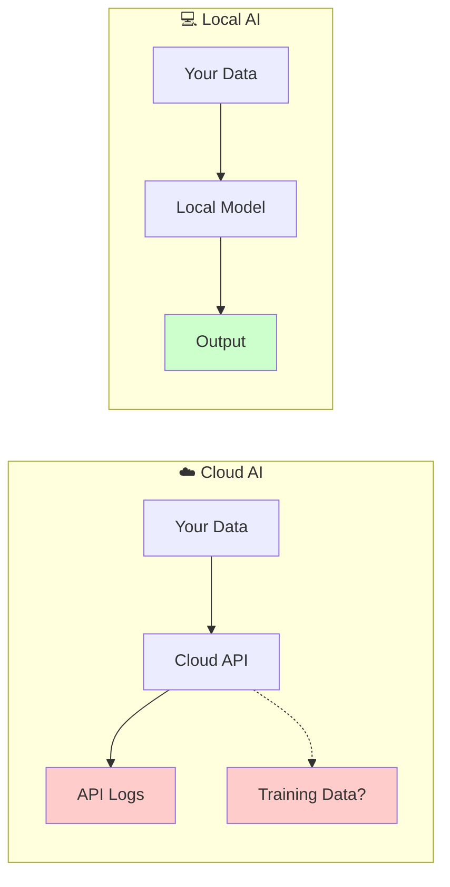

# Privacy Benefits

## Introduction

Running AI locally keeps your data entirely under your control. This lesson covers data sovereignty, compliance advantages, and offline capabilities.

### What We'll Cover

- Data never leaves device
- No API logging concerns
- Compliance advantages
- Offline capability

### Prerequisites

- Understanding of local AI tools
- Basic security/privacy concepts
- Awareness of data regulations

---

## Data Sovereignty



### No Data Transmission

With local AI, sensitive data never leaves your network:

```python
from openai import OpenAI

# Local processing - data stays local
local_client = OpenAI(
    base_url="http://localhost:11434/v1",
    api_key="local"
)

def analyze_sensitive_document(content: str) -> str:
    """Analyze document without sending to cloud."""
    
    response = local_client.chat.completions.create(
        model="llama3.1",
        messages=[
            {
                "role": "system",
                "content": "Analyze this document for key insights."
            },
            {
                "role": "user",
                "content": content
            }
        ]
    )
    
    return response.choices[0].message.content


# PII never leaves your machine
medical_record = """
Patient: John Smith
SSN: 123-45-6789
Diagnosis: ...
"""

analysis = analyze_sensitive_document(medical_record)
```

---

## API Logging Concerns

### Cloud Provider Data Handling

| Provider | Default Retention | Can Opt Out? | Training Data? |
|----------|------------------|--------------|----------------|
| OpenAI | 30 days | Yes (API) | Opt-out available |
| Anthropic | 30 days | Yes | Not used |
| Google | 30 days | Varies | Varies |
| **Local** | **None** | **N/A** | **Never** |

### No Logs with Local AI

```python
import logging
from typing import Optional

class PrivacyAwareClient:
    """Client with privacy controls."""
    
    def __init__(
        self,
        local_endpoint: str = "http://localhost:11434/v1",
        cloud_endpoint: str = None,
        cloud_key: str = None
    ):
        # Always available local
        self.local = OpenAI(
            base_url=local_endpoint,
            api_key="local"
        )
        
        # Optional cloud
        self.cloud = None
        if cloud_endpoint and cloud_key:
            self.cloud = OpenAI(
                base_url=cloud_endpoint,
                api_key=cloud_key
            )
    
    def process(
        self,
        content: str,
        contains_pii: bool = False,
        contains_sensitive: bool = False,
        prefer_local: bool = True
    ) -> str:
        """Process with privacy-aware routing."""
        
        # Force local for sensitive data
        if contains_pii or contains_sensitive:
            return self._process_local(content)
        
        # Prefer local if available and requested
        if prefer_local:
            try:
                return self._process_local(content)
            except Exception:
                pass
        
        # Fall back to cloud
        if self.cloud:
            return self._process_cloud(content)
        
        return self._process_local(content)
    
    def _process_local(self, content: str) -> str:
        """Process locally - no data leaves."""
        
        response = self.local.chat.completions.create(
            model="llama3.1",
            messages=[{"role": "user", "content": content}]
        )
        return response.choices[0].message.content
    
    def _process_cloud(self, content: str) -> str:
        """Process in cloud."""
        
        response = self.cloud.chat.completions.create(
            model="gpt-4o-mini",
            messages=[{"role": "user", "content": content}]
        )
        return response.choices[0].message.content


# Usage
client = PrivacyAwareClient()

# Sensitive data always local
result = client.process(
    "Analyze this patient record...",
    contains_pii=True
)

# General data can use either
result = client.process(
    "What is machine learning?",
    contains_pii=False
)
```

---

## Compliance Advantages

### HIPAA Compliance

```python
from dataclasses import dataclass
from enum import Enum
from typing import List

class DataClassification(Enum):
    PUBLIC = "public"
    INTERNAL = "internal"
    CONFIDENTIAL = "confidential"
    PHI = "phi"  # Protected Health Information
    PII = "pii"  # Personally Identifiable Information


@dataclass
class CompliancePolicy:
    """AI processing compliance policy."""
    
    classification: DataClassification
    allow_cloud: bool
    require_encryption: bool
    require_audit: bool
    max_retention_days: int


HIPAA_POLICIES = {
    DataClassification.PUBLIC: CompliancePolicy(
        classification=DataClassification.PUBLIC,
        allow_cloud=True,
        require_encryption=False,
        require_audit=False,
        max_retention_days=365
    ),
    DataClassification.PHI: CompliancePolicy(
        classification=DataClassification.PHI,
        allow_cloud=False,  # Must be local
        require_encryption=True,
        require_audit=True,
        max_retention_days=0  # No retention
    ),
    DataClassification.PII: CompliancePolicy(
        classification=DataClassification.PII,
        allow_cloud=False,
        require_encryption=True,
        require_audit=True,
        max_retention_days=0
    )
}


class HIPAACompliantAI:
    """HIPAA-compliant AI processor."""
    
    def __init__(self, local_client: OpenAI):
        self.local = local_client
        self.audit_log: List[dict] = []
    
    def process(
        self,
        content: str,
        classification: DataClassification
    ) -> str:
        """Process with HIPAA compliance."""
        
        policy = HIPAA_POLICIES[classification]
        
        if not policy.allow_cloud:
            return self._process_local(content, policy)
        
        # Could use cloud, but we prefer local
        return self._process_local(content, policy)
    
    def _process_local(
        self,
        content: str,
        policy: CompliancePolicy
    ) -> str:
        """Local processing with compliance."""
        
        # Audit logging (metadata only, not content)
        if policy.require_audit:
            self._log_access(
                classification=policy.classification,
                content_hash=self._hash_content(content)
            )
        
        response = self.local.chat.completions.create(
            model="llama3.1",
            messages=[{"role": "user", "content": content}]
        )
        
        return response.choices[0].message.content
    
    def _log_access(
        self,
        classification: DataClassification,
        content_hash: str
    ):
        """Log access for audit."""
        
        import datetime
        
        self.audit_log.append({
            "timestamp": datetime.datetime.now().isoformat(),
            "classification": classification.value,
            "content_hash": content_hash,
            "processor": "local"
        })
    
    def _hash_content(self, content: str) -> str:
        """Hash content for audit without storing it."""
        
        import hashlib
        return hashlib.sha256(content.encode()).hexdigest()[:16]
```

### GDPR Compliance

```python
from dataclasses import dataclass
from typing import Optional
import json

@dataclass
class GDPRDataSubject:
    """GDPR data subject information."""
    
    subject_id: str
    consent_given: bool
    consent_date: Optional[str] = None
    data_processing_purpose: Optional[str] = None


class GDPRCompliantProcessor:
    """GDPR-compliant AI processor."""
    
    def __init__(self):
        self.local = OpenAI(
            base_url="http://localhost:11434/v1",
            api_key="local"
        )
        self.consent_store: dict = {}
    
    def record_consent(
        self,
        subject: GDPRDataSubject
    ):
        """Record data subject consent."""
        
        self.consent_store[subject.subject_id] = subject
    
    def can_process(
        self,
        subject_id: str,
        purpose: str
    ) -> bool:
        """Check if processing is allowed."""
        
        subject = self.consent_store.get(subject_id)
        
        if not subject:
            return False
        
        if not subject.consent_given:
            return False
        
        # Purpose must match
        if subject.data_processing_purpose != purpose:
            return False
        
        return True
    
    def process_with_consent(
        self,
        content: str,
        subject_id: str,
        purpose: str = "analysis"
    ) -> str:
        """Process only if consent given."""
        
        if not self.can_process(subject_id, purpose):
            raise PermissionError(
                f"No consent for processing: {subject_id}"
            )
        
        # Use local to ensure data doesn't leave
        response = self.local.chat.completions.create(
            model="llama3.1",
            messages=[{"role": "user", "content": content}]
        )
        
        return response.choices[0].message.content
    
    def right_to_erasure(self, subject_id: str):
        """Implement right to be forgotten."""
        
        # Remove consent record
        self.consent_store.pop(subject_id, None)
        
        # Local AI doesn't retain data, so no cleanup needed
        # Cloud would require API calls to delete
```

---

## Offline Capability

### Air-Gapped Environments

```python
import socket
from typing import Optional

def check_network() -> bool:
    """Check if network is available."""
    
    try:
        socket.create_connection(("8.8.8.8", 53), timeout=3)
        return True
    except OSError:
        return False


class OfflineAI:
    """AI that works completely offline."""
    
    def __init__(self, model: str = "llama3.1"):
        self.model = model
        self.client = OpenAI(
            base_url="http://localhost:11434/v1",
            api_key="local"
        )
        self._online = None
    
    @property
    def is_online(self) -> bool:
        """Check network status."""
        
        if self._online is None:
            self._online = check_network()
        return self._online
    
    def process(self, content: str) -> str:
        """Process content locally."""
        
        # Always works, regardless of network
        response = self.client.chat.completions.create(
            model=self.model,
            messages=[{"role": "user", "content": content}]
        )
        
        return response.choices[0].message.content
    
    def verify_offline(self) -> dict:
        """Verify we're truly offline capable."""
        
        return {
            "network_available": self.is_online,
            "local_inference": True,
            "cloud_required": False,
            "data_transmitted": False
        }


# Air-gapped deployment
class AirGappedDeployment:
    """Deployment for air-gapped networks."""
    
    def __init__(self, model_path: str):
        self.model_path = model_path
        
    def setup_instructions(self) -> str:
        """Instructions for air-gapped setup."""
        
        return """
        Air-Gapped Ollama Setup:
        
        1. On internet-connected machine:
           - Download Ollama binary
           - Download model files:
             ollama pull llama3.1
             
        2. Copy to air-gapped machine:
           - Ollama binary
           - ~/.ollama/models directory
           
        3. On air-gapped machine:
           - Install Ollama binary
           - Copy models to ~/.ollama/models
           - Start: ollama serve
           
        4. Verify:
           curl http://localhost:11434/api/tags
        """
```

### Mobile/Edge Deployment

```python
from dataclasses import dataclass
from enum import Enum
from typing import Optional

class DeviceType(Enum):
    SERVER = "server"
    DESKTOP = "desktop"
    LAPTOP = "laptop"
    MOBILE = "mobile"
    EDGE = "edge"


@dataclass
class DeviceCapabilities:
    """Device capabilities for AI."""
    
    device_type: DeviceType
    ram_gb: int
    gpu_vram_gb: Optional[int]
    storage_gb: int
    network: bool = True


def recommend_model(device: DeviceCapabilities) -> str:
    """Recommend model based on device."""
    
    if device.gpu_vram_gb and device.gpu_vram_gb >= 8:
        return "llama3.1:8b"
    
    if device.ram_gb >= 16:
        return "llama3.1:8b"
    
    if device.ram_gb >= 8:
        return "phi3:mini"
    
    if device.ram_gb >= 4:
        return "tinyllama"
    
    return "Not enough resources"


# Edge deployment example
edge_device = DeviceCapabilities(
    device_type=DeviceType.EDGE,
    ram_gb=4,
    gpu_vram_gb=None,
    storage_gb=32,
    network=False  # May be offline
)

model = recommend_model(edge_device)
print(f"Recommended for edge: {model}")
```

---

## Privacy-First Architecture

```python
from abc import ABC, abstractmethod
from typing import Optional
import hashlib

class PrivacyPolicy(ABC):
    """Abstract privacy policy."""
    
    @abstractmethod
    def can_send_to_cloud(self, content: str) -> bool:
        pass
    
    @abstractmethod
    def should_anonymize(self, content: str) -> bool:
        pass


class StrictPrivacyPolicy(PrivacyPolicy):
    """Strict privacy - always local."""
    
    def can_send_to_cloud(self, content: str) -> bool:
        return False
    
    def should_anonymize(self, content: str) -> bool:
        return True


class ContentAwarePolicy(PrivacyPolicy):
    """Content-aware privacy routing."""
    
    PII_PATTERNS = [
        r'\b\d{3}-\d{2}-\d{4}\b',  # SSN
        r'\b\d{16}\b',  # Credit card
        r'\b[A-Za-z0-9._%+-]+@[A-Za-z0-9.-]+\.[A-Z|a-z]{2,}\b',  # Email
    ]
    
    def can_send_to_cloud(self, content: str) -> bool:
        import re
        
        for pattern in self.PII_PATTERNS:
            if re.search(pattern, content):
                return False
        
        return True
    
    def should_anonymize(self, content: str) -> bool:
        return not self.can_send_to_cloud(content)


class PrivacyFirstAI:
    """AI with privacy-first architecture."""
    
    def __init__(
        self,
        policy: PrivacyPolicy,
        local_model: str = "llama3.1",
        cloud_model: str = "gpt-4o-mini"
    ):
        self.policy = policy
        
        self.local = OpenAI(
            base_url="http://localhost:11434/v1",
            api_key="local"
        )
        
        # Cloud is optional
        self.cloud = None
        import os
        if os.getenv("OPENAI_API_KEY"):
            self.cloud = OpenAI()
        
        self.local_model = local_model
        self.cloud_model = cloud_model
    
    def process(self, content: str) -> dict:
        """Process with privacy-first routing."""
        
        can_cloud = self.policy.can_send_to_cloud(content)
        should_anonymize = self.policy.should_anonymize(content)
        
        if not can_cloud or not self.cloud:
            # Use local
            response = self.local.chat.completions.create(
                model=self.local_model,
                messages=[{"role": "user", "content": content}]
            )
            
            return {
                "response": response.choices[0].message.content,
                "processor": "local",
                "data_transmitted": False
            }
        
        # Can use cloud
        process_content = content
        
        if should_anonymize:
            process_content = self._anonymize(content)
        
        response = self.cloud.chat.completions.create(
            model=self.cloud_model,
            messages=[{"role": "user", "content": process_content}]
        )
        
        return {
            "response": response.choices[0].message.content,
            "processor": "cloud",
            "anonymized": should_anonymize,
            "data_transmitted": True
        }
    
    def _anonymize(self, content: str) -> str:
        """Anonymize PII in content."""
        
        import re
        
        # Replace SSN
        content = re.sub(
            r'\b\d{3}-\d{2}-\d{4}\b',
            '[SSN-REDACTED]',
            content
        )
        
        # Replace email
        content = re.sub(
            r'\b[A-Za-z0-9._%+-]+@[A-Za-z0-9.-]+\.[A-Z|a-z]{2,}\b',
            '[EMAIL-REDACTED]',
            content
        )
        
        return content
```

---

## Hands-on Exercise

### Your Task

Build a privacy-aware document analyzer.

### Requirements

1. Detect sensitive data
2. Route to local for sensitive
3. Log decisions (not content)
4. Support offline mode

<details>
<summary>💡 Hints</summary>

- Use regex for PII detection
- Hash content for logging
- Check network before cloud
</details>

<details>
<summary>✅ Solution</summary>

```python
from dataclasses import dataclass, field
from datetime import datetime
from typing import List, Optional
from enum import Enum
from openai import OpenAI
import re
import hashlib

class SensitivityLevel(Enum):
    PUBLIC = "public"
    INTERNAL = "internal"
    SENSITIVE = "sensitive"
    HIGHLY_SENSITIVE = "highly_sensitive"


@dataclass
class AnalysisResult:
    content_hash: str
    sensitivity: SensitivityLevel
    processor: str
    timestamp: str
    analysis: str
    offline_mode: bool


@dataclass
class DecisionLog:
    timestamp: str
    content_hash: str
    sensitivity: SensitivityLevel
    decision: str
    reason: str


class PrivacyAwareAnalyzer:
    """Privacy-aware document analyzer."""
    
    PII_PATTERNS = {
        "ssn": r'\b\d{3}-\d{2}-\d{4}\b',
        "credit_card": r'\b\d{4}[\s-]?\d{4}[\s-]?\d{4}[\s-]?\d{4}\b',
        "email": r'\b[A-Za-z0-9._%+-]+@[A-Za-z0-9.-]+\.[A-Z|a-z]{2,}\b',
        "phone": r'\b\d{3}[-.\s]?\d{3}[-.\s]?\d{4}\b',
        "ip_address": r'\b\d{1,3}\.\d{1,3}\.\d{1,3}\.\d{1,3}\b',
    }
    
    SENSITIVE_KEYWORDS = [
        "password", "secret", "confidential", "private",
        "ssn", "social security", "credit card", "bank account",
        "medical", "diagnosis", "patient", "health",
    ]
    
    def __init__(
        self,
        local_url: str = "http://localhost:11434/v1",
        cloud_available: bool = True
    ):
        self.local = OpenAI(
            base_url=local_url,
            api_key="local"
        )
        
        self.cloud = None
        if cloud_available:
            import os
            if os.getenv("OPENAI_API_KEY"):
                self.cloud = OpenAI()
        
        self.decision_log: List[DecisionLog] = []
        self._offline_mode = False
    
    @property
    def is_offline(self) -> bool:
        """Check if in offline mode."""
        
        if self._offline_mode:
            return True
        
        try:
            import socket
            socket.create_connection(("8.8.8.8", 53), timeout=1)
            return False
        except OSError:
            self._offline_mode = True
            return True
    
    def detect_sensitivity(self, content: str) -> SensitivityLevel:
        """Detect content sensitivity."""
        
        content_lower = content.lower()
        
        # Check for PII patterns
        pii_found = []
        for name, pattern in self.PII_PATTERNS.items():
            if re.search(pattern, content):
                pii_found.append(name)
        
        if pii_found:
            return SensitivityLevel.HIGHLY_SENSITIVE
        
        # Check for sensitive keywords
        keywords_found = [
            kw for kw in self.SENSITIVE_KEYWORDS
            if kw in content_lower
        ]
        
        if len(keywords_found) >= 3:
            return SensitivityLevel.SENSITIVE
        elif keywords_found:
            return SensitivityLevel.INTERNAL
        
        return SensitivityLevel.PUBLIC
    
    def _hash_content(self, content: str) -> str:
        """Hash content for logging."""
        
        return hashlib.sha256(content.encode()).hexdigest()[:16]
    
    def _log_decision(
        self,
        content: str,
        sensitivity: SensitivityLevel,
        decision: str,
        reason: str
    ):
        """Log routing decision."""
        
        self.decision_log.append(DecisionLog(
            timestamp=datetime.now().isoformat(),
            content_hash=self._hash_content(content),
            sensitivity=sensitivity,
            decision=decision,
            reason=reason
        ))
    
    def analyze(
        self,
        content: str,
        force_local: bool = False
    ) -> AnalysisResult:
        """Analyze document with privacy awareness."""
        
        content_hash = self._hash_content(content)
        sensitivity = self.detect_sensitivity(content)
        
        # Decision logic
        use_local = False
        reason = ""
        
        if force_local:
            use_local = True
            reason = "Forced local"
        elif self.is_offline:
            use_local = True
            reason = "Offline mode"
        elif sensitivity in [SensitivityLevel.SENSITIVE, 
                            SensitivityLevel.HIGHLY_SENSITIVE]:
            use_local = True
            reason = f"Sensitive content: {sensitivity.value}"
        elif not self.cloud:
            use_local = True
            reason = "Cloud not configured"
        else:
            use_local = False
            reason = "Public content, cloud available"
        
        # Log decision
        self._log_decision(
            content,
            sensitivity,
            "local" if use_local else "cloud",
            reason
        )
        
        # Process
        if use_local:
            analysis = self._analyze_local(content)
            processor = "local"
        else:
            analysis = self._analyze_cloud(content)
            processor = "cloud"
        
        return AnalysisResult(
            content_hash=content_hash,
            sensitivity=sensitivity,
            processor=processor,
            timestamp=datetime.now().isoformat(),
            analysis=analysis,
            offline_mode=self.is_offline
        )
    
    def _analyze_local(self, content: str) -> str:
        """Analyze locally."""
        
        response = self.local.chat.completions.create(
            model="llama3.1",
            messages=[
                {
                    "role": "system",
                    "content": "Analyze this document and provide key insights."
                },
                {
                    "role": "user",
                    "content": content
                }
            ]
        )
        
        return response.choices[0].message.content
    
    def _analyze_cloud(self, content: str) -> str:
        """Analyze in cloud."""
        
        response = self.cloud.chat.completions.create(
            model="gpt-4o-mini",
            messages=[
                {
                    "role": "system",
                    "content": "Analyze this document and provide key insights."
                },
                {
                    "role": "user",
                    "content": content
                }
            ]
        )
        
        return response.choices[0].message.content
    
    def get_audit_log(self) -> List[dict]:
        """Get audit log of decisions."""
        
        return [
            {
                "timestamp": log.timestamp,
                "content_hash": log.content_hash,
                "sensitivity": log.sensitivity.value,
                "decision": log.decision,
                "reason": log.reason
            }
            for log in self.decision_log
        ]


# Test
def test_analyzer():
    analyzer = PrivacyAwareAnalyzer(cloud_available=False)
    
    # Public content
    public_doc = "Machine learning is a subset of AI."
    result1 = analyzer.analyze(public_doc)
    print(f"Public: {result1.sensitivity.value} -> {result1.processor}")
    
    # Sensitive content
    sensitive_doc = "Patient SSN: 123-45-6789, diagnosis: confidential"
    result2 = analyzer.analyze(sensitive_doc)
    print(f"Sensitive: {result2.sensitivity.value} -> {result2.processor}")
    
    # Show audit log
    print("\nAudit Log:")
    for entry in analyzer.get_audit_log():
        print(f"  {entry['content_hash']}: {entry['decision']} - {entry['reason']}")


test_analyzer()
```

</details>

---

## Summary

✅ Local AI keeps data completely private  
✅ No API logging or retention concerns  
✅ Enables HIPAA/GDPR compliance  
✅ Works fully offline  
✅ Privacy-first architecture protects sensitive data

**Next:** [Hardware Requirements](./04-hardware-requirements.md)

---

## Further Reading

- [HIPAA AI Guidelines](https://www.hhs.gov/hipaa/) — Healthcare compliance
- [GDPR AI Guidance](https://gdpr.eu/) — European privacy regulation
- [Zero Data Retention](https://platform.openai.com/docs/guides/zero-data-retention) — OpenAI ZDR
