# Hardware Requirements

## Introduction

Running AI locally requires understanding hardware constraints. This lesson covers GPU vs CPU inference, VRAM requirements, and optimization strategies for different devices.

### What We'll Cover

- GPU vs CPU inference
- VRAM requirements by model size
- Quantization for smaller footprint
- Apple Silicon optimization
- Minimum specifications

### Prerequisites

- Understanding of local AI tools
- Basic computer hardware knowledge
- Familiarity with model sizes

---

## GPU vs CPU Inference

```mermaid
flowchart TB
    subgraph GPU["🎮 GPU Inference"]
        G1[Parallel Processing]
        G2[VRAM Storage]
        G3[Fast Matrix Ops]
        G4["⚡ 10-100x Faster"]
    end
    
    subgraph CPU["💻 CPU Inference"]
        C1[Sequential Processing]
        C2[RAM Storage]
        C3[General Purpose]
        C4["🐌 Slower but Universal"]
    end
    
    MODEL[AI Model] --> GPU
    MODEL --> CPU
```



### Speed Comparison

| Model Size | GPU (RTX 4090) | GPU (RTX 3060) | CPU (Ryzen 9) | CPU (i5) |
|------------|----------------|----------------|---------------|----------|
| 7B | ~50 tok/s | ~30 tok/s | ~15 tok/s | ~5 tok/s |
| 13B | ~30 tok/s | ~15 tok/s | ~8 tok/s | ~2 tok/s |
| 70B | ~10 tok/s | N/A (VRAM) | ~2 tok/s | <1 tok/s |

### Checking Your Hardware

```python
import subprocess
import platform
from dataclasses import dataclass
from typing import Optional, List

@dataclass
class GPUInfo:
    name: str
    vram_gb: float
    cuda_available: bool


@dataclass
class HardwareProfile:
    cpu_name: str
    cpu_cores: int
    ram_gb: float
    gpus: List[GPUInfo]
    apple_silicon: bool


def get_hardware_profile() -> HardwareProfile:
    """Detect hardware capabilities."""
    
    import psutil
    import os
    
    # CPU info
    cpu_name = platform.processor() or "Unknown"
    cpu_cores = os.cpu_count() or 1
    ram_gb = psutil.virtual_memory().total / (1024**3)
    
    # Check for Apple Silicon
    apple_silicon = (
        platform.system() == "Darwin" and 
        platform.machine() == "arm64"
    )
    
    # GPU detection
    gpus = []
    
    try:
        # Try nvidia-smi for NVIDIA GPUs
        result = subprocess.run(
            ["nvidia-smi", "--query-gpu=name,memory.total",
             "--format=csv,noheader,nounits"],
            capture_output=True,
            text=True
        )
        
        if result.returncode == 0:
            for line in result.stdout.strip().split("\n"):
                parts = line.split(", ")
                if len(parts) == 2:
                    gpus.append(GPUInfo(
                        name=parts[0],
                        vram_gb=float(parts[1]) / 1024,
                        cuda_available=True
                    ))
    except FileNotFoundError:
        pass
    
    return HardwareProfile(
        cpu_name=cpu_name,
        cpu_cores=cpu_cores,
        ram_gb=round(ram_gb, 1),
        gpus=gpus,
        apple_silicon=apple_silicon
    )


# Usage
profile = get_hardware_profile()
print(f"CPU: {profile.cpu_name} ({profile.cpu_cores} cores)")
print(f"RAM: {profile.ram_gb} GB")
print(f"GPUs: {len(profile.gpus)}")
for gpu in profile.gpus:
    print(f"  - {gpu.name}: {gpu.vram_gb:.1f} GB VRAM")
print(f"Apple Silicon: {profile.apple_silicon}")
```

**Output:**
```
CPU: AMD Ryzen 9 5900X (24 cores)
RAM: 64.0 GB
GPUs: 1
  - NVIDIA GeForce RTX 4090: 24.0 GB VRAM
Apple Silicon: False
```

---

## VRAM Requirements by Model Size

### Memory Calculation

```python
from dataclasses import dataclass
from enum import Enum
from typing import Optional

class Precision(Enum):
    FP32 = "fp32"      # 4 bytes per param
    FP16 = "fp16"      # 2 bytes per param
    INT8 = "int8"      # 1 byte per param
    INT4 = "int4"      # 0.5 bytes per param


@dataclass
class MemoryRequirement:
    model_size: str
    parameters: float  # billions
    fp16_gb: float
    int8_gb: float
    int4_gb: float


def calculate_memory(params_billions: float) -> MemoryRequirement:
    """Calculate memory for different precisions."""
    
    # Memory = params * bytes_per_param
    fp16_gb = params_billions * 2  # 2 bytes
    int8_gb = params_billions * 1  # 1 byte
    int4_gb = params_billions * 0.5  # 0.5 bytes
    
    # Add ~20% overhead for KV cache, activations
    overhead = 1.2
    
    return MemoryRequirement(
        model_size=f"{params_billions}B",
        parameters=params_billions,
        fp16_gb=round(fp16_gb * overhead, 1),
        int8_gb=round(int8_gb * overhead, 1),
        int4_gb=round(int4_gb * overhead, 1)
    )


# Common model sizes
MODELS = [
    ("phi-3", 3.8),
    ("llama-3.1-8b", 8),
    ("llama-3.1-70b", 70),
    ("mixtral-8x7b", 46.7),
    ("llama-3.1-405b", 405),
]

print("Model Memory Requirements:")
print("-" * 60)
print(f"{'Model':<20} {'FP16':>10} {'INT8':>10} {'INT4':>10}")
print("-" * 60)

for name, params in MODELS:
    req = calculate_memory(params)
    print(f"{name:<20} {req.fp16_gb:>8.1f}GB {req.int8_gb:>8.1f}GB {req.int4_gb:>8.1f}GB")
```

**Output:**
```
Model Memory Requirements:
------------------------------------------------------------
Model                      FP16       INT8       INT4
------------------------------------------------------------
phi-3                     9.1GB      4.6GB      2.3GB
llama-3.1-8b             19.2GB      9.6GB      4.8GB
llama-3.1-70b           168.0GB     84.0GB     42.0GB
mixtral-8x7b            112.1GB     56.0GB     28.0GB
llama-3.1-405b          972.0GB    486.0GB    243.0GB
```

### GPU VRAM Guide

| GPU | VRAM | Recommended Models |
|-----|------|-------------------|
| RTX 4060 | 8GB | 7B-Q4, 13B-Q2 |
| RTX 4070 | 12GB | 7B-Q8, 13B-Q4 |
| RTX 4080 | 16GB | 13B-Q8, 30B-Q4 |
| RTX 4090 | 24GB | 30B-Q8, 70B-Q4 (partial) |
| A100 | 40GB | 70B-Q4 |
| A100 | 80GB | 70B-Q8 |
| H100 | 80GB | 70B-FP16 |

---

## Quantization Strategies

### GGUF Quantization Types

```python
from dataclasses import dataclass
from enum import Enum

class QuantLevel(Enum):
    Q2_K = "Q2_K"    # 2-bit
    Q3_K_S = "Q3_K_S"  # 3-bit small
    Q3_K_M = "Q3_K_M"  # 3-bit medium
    Q4_0 = "Q4_0"    # 4-bit
    Q4_K_M = "Q4_K_M"  # 4-bit medium (recommended)
    Q5_K_M = "Q5_K_M"  # 5-bit medium
    Q6_K = "Q6_K"    # 6-bit
    Q8_0 = "Q8_0"    # 8-bit
    F16 = "F16"      # 16-bit (no quantization)


@dataclass
class QuantInfo:
    level: QuantLevel
    bits_per_weight: float
    quality_loss: str
    use_case: str


QUANT_TABLE = {
    QuantLevel.Q2_K: QuantInfo(
        level=QuantLevel.Q2_K,
        bits_per_weight=2.5,
        quality_loss="Significant",
        use_case="Extreme memory constraints"
    ),
    QuantLevel.Q4_K_M: QuantInfo(
        level=QuantLevel.Q4_K_M,
        bits_per_weight=4.5,
        quality_loss="Minimal",
        use_case="Best balance (recommended)"
    ),
    QuantLevel.Q5_K_M: QuantInfo(
        level=QuantLevel.Q5_K_M,
        bits_per_weight=5.5,
        quality_loss="Very low",
        use_case="Quality priority"
    ),
    QuantLevel.Q8_0: QuantInfo(
        level=QuantLevel.Q8_0,
        bits_per_weight=8.0,
        quality_loss="Negligible",
        use_case="Maximum quality"
    ),
    QuantLevel.F16: QuantInfo(
        level=QuantLevel.F16,
        bits_per_weight=16.0,
        quality_loss="None",
        use_case="Research/baseline"
    ),
}


def recommend_quantization(
    model_params_b: float,
    available_vram_gb: float,
    quality_priority: bool = False
) -> QuantLevel:
    """Recommend quantization based on constraints."""
    
    # Try each quantization from highest to lowest quality
    quant_order = [
        QuantLevel.Q8_0,
        QuantLevel.Q6_K,
        QuantLevel.Q5_K_M,
        QuantLevel.Q4_K_M,
        QuantLevel.Q3_K_M,
        QuantLevel.Q2_K,
    ]
    
    for quant in quant_order:
        info = QUANT_TABLE.get(quant)
        if not info:
            continue
        
        # Calculate required memory
        bytes_per_param = info.bits_per_weight / 8
        required_gb = model_params_b * bytes_per_param * 1.2  # 20% overhead
        
        if required_gb <= available_vram_gb:
            # If quality priority, don't go below Q4
            if quality_priority and quant in [QuantLevel.Q2_K, QuantLevel.Q3_K_M]:
                continue
            return quant
    
    return QuantLevel.Q2_K  # Last resort


# Example
print("Quantization Recommendations:")
print("-" * 50)

scenarios = [
    ("7B model", 7, 8, False),
    ("7B model", 7, 4, False),
    ("13B model", 13, 12, True),
    ("70B model", 70, 24, False),
]

for name, params, vram, quality in scenarios:
    quant = recommend_quantization(params, vram, quality)
    print(f"{name} on {vram}GB VRAM: {quant.value}")
```

**Output:**
```
Quantization Recommendations:
--------------------------------------------------
7B model on 8GB VRAM: Q8_0
7B model on 4GB VRAM: Q4_K_M
13B model on 12GB VRAM (quality): Q5_K_M
70B model on 24GB VRAM: Q2_K
```

### Layer Offloading

```python
from dataclasses import dataclass
from typing import Optional

@dataclass
class OffloadConfig:
    """Configuration for GPU/CPU layer split."""
    
    gpu_layers: int
    cpu_layers: int
    total_layers: int
    gpu_vram_used_gb: float
    cpu_ram_used_gb: float


def calculate_offload(
    model_params_b: float,
    total_layers: int,
    available_gpu_vram_gb: float,
    available_cpu_ram_gb: float,
    quant_bits: float = 4.5
) -> OffloadConfig:
    """Calculate optimal layer offload config."""
    
    # Memory per layer
    params_per_layer = model_params_b / total_layers
    bytes_per_param = quant_bits / 8
    gb_per_layer = params_per_layer * bytes_per_param
    
    # How many layers fit in GPU?
    max_gpu_layers = int(available_gpu_vram_gb * 0.9 / gb_per_layer)
    gpu_layers = min(max_gpu_layers, total_layers)
    
    # Remaining on CPU
    cpu_layers = total_layers - gpu_layers
    
    return OffloadConfig(
        gpu_layers=gpu_layers,
        cpu_layers=cpu_layers,
        total_layers=total_layers,
        gpu_vram_used_gb=round(gpu_layers * gb_per_layer, 1),
        cpu_ram_used_gb=round(cpu_layers * gb_per_layer, 1)
    )


# Example: 70B model on 24GB GPU
config = calculate_offload(
    model_params_b=70,
    total_layers=80,
    available_gpu_vram_gb=24,
    available_cpu_ram_gb=64
)

print(f"70B Model Offload Configuration:")
print(f"  GPU layers: {config.gpu_layers}/{config.total_layers}")
print(f"  CPU layers: {config.cpu_layers}/{config.total_layers}")
print(f"  GPU VRAM: {config.gpu_vram_used_gb} GB")
print(f"  CPU RAM: {config.cpu_ram_used_gb} GB")
```

**Output:**
```
70B Model Offload Configuration:
  GPU layers: 54/80
  CPU layers: 26/80
  GPU VRAM: 21.3 GB
  CPU RAM: 10.2 GB
```

---

## Apple Silicon Optimization

### MLX for Mac

```python
# MLX is Apple's ML framework optimized for Apple Silicon

from dataclasses import dataclass
from typing import Optional

@dataclass
class AppleSiliconSpec:
    chip: str
    unified_memory_gb: int
    gpu_cores: int
    neural_engine_cores: int


APPLE_CHIPS = {
    "M1": AppleSiliconSpec("M1", 8, 8, 16),
    "M1 Pro": AppleSiliconSpec("M1 Pro", 16, 16, 16),
    "M1 Max": AppleSiliconSpec("M1 Max", 32, 32, 16),
    "M1 Ultra": AppleSiliconSpec("M1 Ultra", 64, 64, 32),
    "M2": AppleSiliconSpec("M2", 8, 10, 16),
    "M2 Pro": AppleSiliconSpec("M2 Pro", 16, 19, 16),
    "M2 Max": AppleSiliconSpec("M2 Max", 32, 38, 16),
    "M2 Ultra": AppleSiliconSpec("M2 Ultra", 64, 76, 32),
    "M3": AppleSiliconSpec("M3", 8, 10, 16),
    "M3 Pro": AppleSiliconSpec("M3 Pro", 18, 18, 16),
    "M3 Max": AppleSiliconSpec("M3 Max", 36, 40, 16),
    "M4": AppleSiliconSpec("M4", 16, 10, 16),
    "M4 Pro": AppleSiliconSpec("M4 Pro", 24, 20, 16),
    "M4 Max": AppleSiliconSpec("M4 Max", 48, 40, 16),
}


def recommend_for_apple(chip: str) -> dict:
    """Recommend models for Apple Silicon chip."""
    
    spec = APPLE_CHIPS.get(chip)
    if not spec:
        return {"error": f"Unknown chip: {chip}"}
    
    # Unified memory can be used for model
    usable_memory = spec.unified_memory_gb * 0.7  # Leave 30% for system
    
    recommendations = []
    
    if usable_memory >= 50:
        recommendations.append("llama3.1:70b-q4")
    if usable_memory >= 25:
        recommendations.append("llama3.1:70b-q2")
        recommendations.append("mixtral:8x7b-q4")
    if usable_memory >= 12:
        recommendations.append("llama3.1:8b")
        recommendations.append("codellama:13b-q4")
    if usable_memory >= 6:
        recommendations.append("llama3.1:8b-q4")
        recommendations.append("phi3:mini")
    if usable_memory >= 3:
        recommendations.append("tinyllama")
    
    return {
        "chip": chip,
        "unified_memory_gb": spec.unified_memory_gb,
        "usable_for_ai_gb": round(usable_memory, 1),
        "gpu_cores": spec.gpu_cores,
        "recommended_models": recommendations[:5],  # Top 5
        "notes": "Use MLX or Ollama for best performance"
    }


# Example
for chip in ["M1", "M3 Max", "M4 Pro"]:
    result = recommend_for_apple(chip)
    print(f"\n{chip}:")
    print(f"  Memory: {result['unified_memory_gb']}GB total, "
          f"{result['usable_for_ai_gb']}GB usable")
    print(f"  Models: {', '.join(result['recommended_models'][:3])}")
```

**Output:**
```
M1:
  Memory: 8GB total, 5.6GB usable
  Models: llama3.1:8b-q4, phi3:mini, tinyllama

M3 Max:
  Memory: 36GB total, 25.2GB usable
  Models: llama3.1:70b-q2, mixtral:8x7b-q4, llama3.1:8b

M4 Pro:
  Memory: 24GB total, 16.8GB usable
  Models: llama3.1:8b, codellama:13b-q4, llama3.1:8b-q4
```

### Using MLX

```python
# MLX installation: pip install mlx mlx-lm

def mlx_inference_example():
    """Example using MLX for Apple Silicon."""
    
    # Note: This is pseudo-code structure
    # Actual MLX code requires mlx library
    
    code = '''
    from mlx_lm import load, generate

    # Load MLX-optimized model
    model, tokenizer = load("mlx-community/Llama-3.2-1B-Instruct-4bit")

    # Generate
    prompt = "What is machine learning?"
    response = generate(
        model, 
        tokenizer, 
        prompt=prompt,
        max_tokens=256
    )
    
    print(response)
    '''
    
    return code


# MLX vs Ollama on Apple Silicon
comparison = """
MLX vs Ollama on Apple Silicon:

| Feature | MLX | Ollama |
|---------|-----|--------|
| Performance | Faster (native) | Good |
| Ease of use | Requires Python | CLI + API |
| Model format | MLX format | GGUF |
| Model selection | Growing | Extensive |
| Memory efficiency | Excellent | Good |

Recommendation:
- Use Ollama for ease of use and model variety
- Use MLX for maximum performance when model available
"""

print(comparison)
```

---

## Minimum Specifications

```python
from dataclasses import dataclass
from enum import Enum
from typing import List, Optional

class UseCase(Enum):
    BASIC_CHAT = "basic_chat"        # Simple Q&A
    CODING_ASSIST = "coding_assist"  # Code completion
    DOCUMENT_ANALYSIS = "doc_analysis"  # Long documents
    PRODUCTION = "production"        # High throughput


@dataclass
class MinimumSpec:
    use_case: UseCase
    min_ram_gb: int
    min_vram_gb: Optional[int]
    recommended_cpu: str
    recommended_gpu: str
    model_recommendation: str


MINIMUM_SPECS = {
    UseCase.BASIC_CHAT: MinimumSpec(
        use_case=UseCase.BASIC_CHAT,
        min_ram_gb=8,
        min_vram_gb=None,  # CPU is fine
        recommended_cpu="4 cores, 3GHz+",
        recommended_gpu="Optional",
        model_recommendation="phi3:mini, tinyllama"
    ),
    UseCase.CODING_ASSIST: MinimumSpec(
        use_case=UseCase.CODING_ASSIST,
        min_ram_gb=16,
        min_vram_gb=8,
        recommended_cpu="6 cores, 3.5GHz+",
        recommended_gpu="RTX 3060 or better",
        model_recommendation="codellama:7b, deepseek-coder:6.7b"
    ),
    UseCase.DOCUMENT_ANALYSIS: MinimumSpec(
        use_case=UseCase.DOCUMENT_ANALYSIS,
        min_ram_gb=32,
        min_vram_gb=12,
        recommended_cpu="8 cores, 3.5GHz+",
        recommended_gpu="RTX 4070 or better",
        model_recommendation="llama3.1:8b (long context)"
    ),
    UseCase.PRODUCTION: MinimumSpec(
        use_case=UseCase.PRODUCTION,
        min_ram_gb=64,
        min_vram_gb=24,
        recommended_cpu="16+ cores",
        recommended_gpu="RTX 4090 / A100",
        model_recommendation="llama3.1:70b-q4, mixtral"
    ),
}


def check_compatibility(
    use_case: UseCase,
    ram_gb: int,
    vram_gb: Optional[int] = None
) -> dict:
    """Check if hardware meets minimum specs."""
    
    spec = MINIMUM_SPECS[use_case]
    
    ram_ok = ram_gb >= spec.min_ram_gb
    
    vram_ok = True
    if spec.min_vram_gb:
        vram_ok = vram_gb is not None and vram_gb >= spec.min_vram_gb
    
    compatible = ram_ok and vram_ok
    
    issues = []
    if not ram_ok:
        issues.append(f"Need {spec.min_ram_gb}GB RAM, have {ram_gb}GB")
    if not vram_ok:
        issues.append(f"Need {spec.min_vram_gb}GB VRAM, have {vram_gb or 0}GB")
    
    return {
        "use_case": use_case.value,
        "compatible": compatible,
        "issues": issues,
        "recommended_model": spec.model_recommendation if compatible else None,
        "upgrade_suggestion": issues[0] if issues else None
    }


# Test compatibility
print("Hardware Compatibility Check:")
print("-" * 50)

test_cases = [
    (UseCase.BASIC_CHAT, 8, None),
    (UseCase.CODING_ASSIST, 16, 6),
    (UseCase.CODING_ASSIST, 16, 12),
    (UseCase.PRODUCTION, 32, 24),
]

for use_case, ram, vram in test_cases:
    result = check_compatibility(use_case, ram, vram)
    status = "✅" if result["compatible"] else "❌"
    print(f"{status} {use_case.value}: RAM={ram}GB, VRAM={vram}GB")
    if not result["compatible"]:
        print(f"   Issue: {result['upgrade_suggestion']}")
    else:
        print(f"   Model: {result['recommended_model']}")
```

**Output:**
```
Hardware Compatibility Check:
--------------------------------------------------
✅ basic_chat: RAM=8GB, VRAM=None
   Model: phi3:mini, tinyllama
❌ coding_assist: RAM=16GB, VRAM=6GB
   Issue: Need 8GB VRAM, have 6GB
✅ coding_assist: RAM=16GB, VRAM=12GB
   Model: codellama:7b, deepseek-coder:6.7b
❌ production: RAM=32GB, VRAM=24GB
   Issue: Need 64GB RAM, have 32GB
```

---

## Hardware Upgrade Guide

```python
from dataclasses import dataclass
from typing import List

@dataclass
class UpgradePath:
    current: str
    target_capability: str
    recommended_upgrade: str
    estimated_cost: str
    performance_gain: str


UPGRADE_PATHS = [
    UpgradePath(
        current="No GPU",
        target_capability="Run 7B models fast",
        recommended_upgrade="RTX 4060 (8GB)",
        estimated_cost="$300-350",
        performance_gain="5-10x faster than CPU"
    ),
    UpgradePath(
        current="RTX 3060 (12GB)",
        target_capability="Run 13B models",
        recommended_upgrade="RTX 4070 Super (16GB)",
        estimated_cost="$600-650",
        performance_gain="2x faster, larger models"
    ),
    UpgradePath(
        current="8GB RAM",
        target_capability="Run models without GPU",
        recommended_upgrade="32GB RAM",
        estimated_cost="$60-100",
        performance_gain="Enables 13B on CPU"
    ),
    UpgradePath(
        current="Consumer GPU",
        target_capability="Run 70B models",
        recommended_upgrade="RTX 4090 (24GB) or 2x RTX 4090",
        estimated_cost="$1600-3200",
        performance_gain="70B-Q4 possible"
    ),
]


def get_upgrade_advice(
    current_ram_gb: int,
    current_vram_gb: Optional[int],
    target_model_size: str
) -> List[str]:
    """Get upgrade advice for target model."""
    
    advice = []
    
    # Parse target model size
    size_map = {
        "7b": 7, "8b": 8, "13b": 13, 
        "30b": 30, "70b": 70
    }
    target_params = size_map.get(target_model_size.lower(), 7)
    
    # Calculate requirements
    min_vram_q4 = target_params * 0.6  # Q4 estimate
    min_ram_cpu = target_params * 1.0  # CPU estimate
    
    if current_vram_gb and current_vram_gb >= min_vram_q4:
        advice.append(f"✅ GPU has enough VRAM for {target_model_size}")
    elif current_vram_gb:
        needed = min_vram_q4 - current_vram_gb
        advice.append(f"❌ Need ~{needed:.0f}GB more VRAM for {target_model_size}")
    else:
        if current_ram_gb >= min_ram_cpu:
            advice.append(f"⚠️ No GPU, but RAM sufficient for slow CPU inference")
        else:
            advice.append(f"❌ Need GPU with {min_vram_q4:.0f}GB+ VRAM")
    
    return advice


# Example
print("Upgrade Advice:")
advice = get_upgrade_advice(32, 8, "13b")
for a in advice:
    print(f"  {a}")
```

---

## Hands-on Exercise

### Your Task

Build a hardware recommendation system.

### Requirements

1. Input: desired model and use case
2. Check current hardware
3. Recommend configuration
4. Suggest upgrades if needed

<details>
<summary>💡 Hints</summary>

- Use psutil for RAM detection
- nvidia-smi for GPU info
- Match model to VRAM requirements
</details>

<details>
<summary>✅ Solution</summary>

```python
from dataclasses import dataclass
from enum import Enum
from typing import Optional, List, Dict
import subprocess
import platform

class ModelSize(Enum):
    TINY = "tiny"      # 1-3B
    SMALL = "small"    # 7-8B
    MEDIUM = "medium"  # 13-30B
    LARGE = "large"    # 70B+


@dataclass
class ModelRequirements:
    size: ModelSize
    min_vram_q4_gb: float
    min_vram_q8_gb: float
    min_ram_cpu_gb: float
    example_models: List[str]


MODEL_REQUIREMENTS = {
    ModelSize.TINY: ModelRequirements(
        size=ModelSize.TINY,
        min_vram_q4_gb=2,
        min_vram_q8_gb=4,
        min_ram_cpu_gb=4,
        example_models=["phi3:mini", "tinyllama", "gemma:2b"]
    ),
    ModelSize.SMALL: ModelRequirements(
        size=ModelSize.SMALL,
        min_vram_q4_gb=5,
        min_vram_q8_gb=10,
        min_ram_cpu_gb=10,
        example_models=["llama3.1:8b", "mistral:7b", "codellama:7b"]
    ),
    ModelSize.MEDIUM: ModelRequirements(
        size=ModelSize.MEDIUM,
        min_vram_q4_gb=10,
        min_vram_q8_gb=20,
        min_ram_cpu_gb=20,
        example_models=["llama3.1:13b", "codellama:13b"]
    ),
    ModelSize.LARGE: ModelRequirements(
        size=ModelSize.LARGE,
        min_vram_q4_gb=35,
        min_vram_q8_gb=70,
        min_ram_cpu_gb=70,
        example_models=["llama3.1:70b", "mixtral:8x7b"]
    ),
}


@dataclass
class HardwareInfo:
    ram_gb: float
    gpu_name: Optional[str]
    vram_gb: Optional[float]
    cpu_cores: int
    is_apple_silicon: bool
    unified_memory_gb: Optional[float] = None


@dataclass
class Recommendation:
    can_run: bool
    best_quantization: str
    inference_type: str
    estimated_speed: str
    suggestions: List[str]
    recommended_models: List[str]


class HardwareAdvisor:
    """AI hardware recommendation system."""
    
    def __init__(self):
        self.hardware = self._detect_hardware()
    
    def _detect_hardware(self) -> HardwareInfo:
        """Detect system hardware."""
        
        import os
        
        # RAM
        try:
            import psutil
            ram_gb = psutil.virtual_memory().total / (1024**3)
        except ImportError:
            ram_gb = 8  # Default assumption
        
        # CPU cores
        cpu_cores = os.cpu_count() or 4
        
        # Apple Silicon check
        is_apple = (
            platform.system() == "Darwin" and 
            platform.machine() == "arm64"
        )
        
        # GPU detection
        gpu_name = None
        vram_gb = None
        
        try:
            result = subprocess.run(
                ["nvidia-smi", "--query-gpu=name,memory.total",
                 "--format=csv,noheader,nounits"],
                capture_output=True,
                text=True,
                timeout=5
            )
            
            if result.returncode == 0:
                line = result.stdout.strip().split("\n")[0]
                parts = line.split(", ")
                if len(parts) == 2:
                    gpu_name = parts[0]
                    vram_gb = float(parts[1]) / 1024
        except (FileNotFoundError, subprocess.TimeoutExpired):
            pass
        
        return HardwareInfo(
            ram_gb=round(ram_gb, 1),
            gpu_name=gpu_name,
            vram_gb=round(vram_gb, 1) if vram_gb else None,
            cpu_cores=cpu_cores,
            is_apple_silicon=is_apple,
            unified_memory_gb=ram_gb if is_apple else None
        )
    
    def get_hardware_summary(self) -> str:
        """Get human-readable hardware summary."""
        
        h = self.hardware
        lines = [
            "Detected Hardware:",
            f"  RAM: {h.ram_gb} GB",
            f"  CPU Cores: {h.cpu_cores}",
        ]
        
        if h.gpu_name:
            lines.append(f"  GPU: {h.gpu_name} ({h.vram_gb} GB VRAM)")
        else:
            lines.append("  GPU: None detected")
        
        if h.is_apple_silicon:
            lines.append(f"  Apple Silicon: Yes (Unified Memory)")
        
        return "\n".join(lines)
    
    def recommend(
        self,
        target_size: ModelSize,
        prefer_quality: bool = False
    ) -> Recommendation:
        """Get recommendation for target model size."""
        
        reqs = MODEL_REQUIREMENTS[target_size]
        h = self.hardware
        
        can_run = False
        quant = "Q4_K_M"
        inference = "cpu"
        speed = "slow"
        suggestions = []
        models = reqs.example_models.copy()
        
        # Check GPU capability
        if h.vram_gb:
            if h.vram_gb >= reqs.min_vram_q8_gb:
                can_run = True
                quant = "Q8_0" if prefer_quality else "Q4_K_M"
                inference = "gpu"
                speed = "fast"
            elif h.vram_gb >= reqs.min_vram_q4_gb:
                can_run = True
                quant = "Q4_K_M"
                inference = "gpu"
                speed = "medium"
            else:
                # Partial offload?
                if h.ram_gb >= reqs.min_ram_cpu_gb / 2:
                    can_run = True
                    quant = "Q4_K_M"
                    inference = "hybrid (GPU + CPU)"
                    speed = "slow-medium"
                    suggestions.append(
                        f"Model will partially offload to CPU"
                    )
        
        # Check Apple Silicon
        if h.is_apple_silicon and h.unified_memory_gb:
            usable = h.unified_memory_gb * 0.7
            if usable >= reqs.min_vram_q4_gb:
                can_run = True
                quant = "Q4_K_M"
                inference = "apple silicon (unified memory)"
                speed = "medium-fast"
                suggestions.append("Use Ollama or MLX for best performance")
        
        # Check CPU-only
        if not can_run and h.ram_gb >= reqs.min_ram_cpu_gb:
            can_run = True
            quant = "Q4_K_M"
            inference = "cpu"
            speed = "slow"
            suggestions.append("Consider GPU upgrade for faster inference")
        
        # Upgrade suggestions
        if not can_run:
            if target_size == ModelSize.SMALL:
                suggestions.append("Upgrade to 16GB RAM or get 8GB GPU")
            elif target_size == ModelSize.MEDIUM:
                suggestions.append("Need 12GB+ GPU (RTX 4070+)")
            elif target_size == ModelSize.LARGE:
                suggestions.append("Need 24GB+ GPU (RTX 4090, A100)")
            
            # Downgrade suggestion
            smaller_sizes = list(ModelSize)
            current_idx = smaller_sizes.index(target_size)
            if current_idx > 0:
                smaller = smaller_sizes[current_idx - 1]
                smaller_models = MODEL_REQUIREMENTS[smaller].example_models
                suggestions.append(
                    f"Try smaller models: {', '.join(smaller_models[:2])}"
                )
        
        return Recommendation(
            can_run=can_run,
            best_quantization=quant,
            inference_type=inference,
            estimated_speed=speed,
            suggestions=suggestions,
            recommended_models=models if can_run else []
        )
    
    def full_report(self) -> str:
        """Generate full hardware report."""
        
        lines = [self.get_hardware_summary(), "", "Capability Matrix:"]
        lines.append("-" * 50)
        
        for size in ModelSize:
            rec = self.recommend(size)
            status = "✅" if rec.can_run else "❌"
            
            lines.append(f"\n{status} {size.value.upper()} Models:")
            
            if rec.can_run:
                lines.append(f"   Inference: {rec.inference_type}")
                lines.append(f"   Quantization: {rec.best_quantization}")
                lines.append(f"   Speed: {rec.estimated_speed}")
                lines.append(f"   Models: {', '.join(rec.recommended_models[:2])}")
            else:
                for s in rec.suggestions:
                    lines.append(f"   → {s}")
        
        return "\n".join(lines)


# Usage
advisor = HardwareAdvisor()
print(advisor.full_report())
```

</details>

---

## Summary

✅ GPU provides 10-100x faster inference than CPU  
✅ VRAM determines which models can run  
✅ Quantization trades quality for memory savings  
✅ Apple Silicon uses unified memory efficiently  
✅ Match hardware to use case requirements

**Next:** [Performance Trade-offs](./05-performance-tradeoffs.md)

---

## Further Reading

- [Ollama Performance Tips](https://ollama.ai/blog/performance) — Optimization guide
- [GGUF Format](https://github.com/ggerganov/llama.cpp) — Quantization details
- [MLX Documentation](https://ml-explore.github.io/mlx/) — Apple Silicon ML
