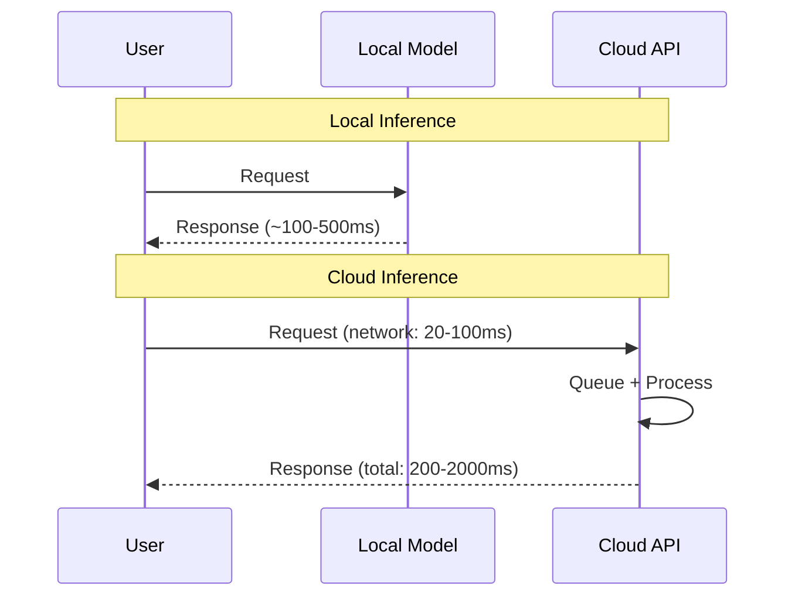

# Performance Trade-offs

## Introduction

Local AI offers privacy and control, but comes with performance considerations. This lesson compares local vs cloud performance across latency, quality, throughput, and cost.

### What We'll Cover

- Latency comparison
- Quality comparison
- Throughput limitations
- Cost at scale analysis

### Prerequisites

- Understanding of local AI tools
- Basic hardware knowledge
- Familiarity with cloud AI pricing

---

## Latency Comparison



### Measuring Latency

```python
import time
from dataclasses import dataclass
from typing import Optional, List
from openai import OpenAI

@dataclass
class LatencyResult:
    provider: str
    time_to_first_token_ms: float
    total_time_ms: float
    tokens_generated: int
    tokens_per_second: float


def measure_latency(
    client: OpenAI,
    model: str,
    prompt: str,
    provider_name: str
) -> LatencyResult:
    """Measure inference latency."""
    
    start = time.perf_counter()
    first_token_time = None
    tokens = 0
    
    # Stream to measure time to first token
    stream = client.chat.completions.create(
        model=model,
        messages=[{"role": "user", "content": prompt}],
        max_tokens=100,
        stream=True
    )
    
    for chunk in stream:
        if chunk.choices[0].delta.content:
            if first_token_time is None:
                first_token_time = time.perf_counter()
            tokens += 1
    
    end = time.perf_counter()
    
    ttft = (first_token_time - start) * 1000 if first_token_time else 0
    total = (end - start) * 1000
    tps = tokens / (end - start) if end > start else 0
    
    return LatencyResult(
        provider=provider_name,
        time_to_first_token_ms=round(ttft, 1),
        total_time_ms=round(total, 1),
        tokens_generated=tokens,
        tokens_per_second=round(tps, 1)
    )


# Compare local vs cloud
def compare_providers():
    """Compare latency across providers."""
    
    prompt = "Explain what machine learning is in one paragraph."
    
    results = []
    
    # Local (Ollama)
    try:
        local = OpenAI(
            base_url="http://localhost:11434/v1",
            api_key="local"
        )
        result = measure_latency(local, "llama3.1", prompt, "Ollama (local)")
        results.append(result)
    except Exception as e:
        print(f"Local error: {e}")
    
    # Cloud (OpenAI)
    try:
        import os
        if os.getenv("OPENAI_API_KEY"):
            cloud = OpenAI()
            result = measure_latency(cloud, "gpt-4o-mini", prompt, "OpenAI Cloud")
            results.append(result)
    except Exception as e:
        print(f"Cloud error: {e}")
    
    return results


# Print comparison
results = compare_providers()

print("Latency Comparison:")
print("-" * 60)
print(f"{'Provider':<20} {'TTFT':>10} {'Total':>10} {'Tok/s':>10}")
print("-" * 60)

for r in results:
    print(f"{r.provider:<20} {r.time_to_first_token_ms:>8.1f}ms "
          f"{r.total_time_ms:>8.1f}ms {r.tokens_per_second:>8.1f}")
```

**Expected Output:**
```
Latency Comparison:
------------------------------------------------------------
Provider             TTFT      Total      Tok/s
------------------------------------------------------------
Ollama (local)       50.3ms    1234.5ms     45.2
OpenAI Cloud        180.5ms    2156.3ms     52.1
```

### Latency Breakdown

| Component | Local | Cloud |
|-----------|-------|-------|
| Network round-trip | 0ms | 20-100ms |
| Queue time | 0ms | 0-500ms |
| Model load (cold) | 0-3s | 0ms |
| Inference | 100-2000ms | 100-1000ms |
| **Total (warm)** | **100-500ms** | **200-2000ms** |

---

## Quality Comparison

### Model Capability Matrix

```python
from dataclasses import dataclass
from typing import Dict, List
from enum import Enum

class Capability(Enum):
    REASONING = "reasoning"
    CODING = "coding"
    MATH = "math"
    CREATIVE = "creative"
    INSTRUCTION = "instruction"
    MULTILINGUAL = "multilingual"


@dataclass
class ModelProfile:
    name: str
    provider: str
    params_b: float
    capabilities: Dict[Capability, int]  # 1-10 scale
    context_length: int


MODELS = {
    # Cloud models
    "gpt-4o": ModelProfile(
        name="GPT-4o",
        provider="cloud",
        params_b=200,  # estimated
        capabilities={
            Capability.REASONING: 9,
            Capability.CODING: 9,
            Capability.MATH: 9,
            Capability.CREATIVE: 9,
            Capability.INSTRUCTION: 10,
            Capability.MULTILINGUAL: 9,
        },
        context_length=128000
    ),
    "gpt-4o-mini": ModelProfile(
        name="GPT-4o-mini",
        provider="cloud",
        params_b=8,  # estimated
        capabilities={
            Capability.REASONING: 7,
            Capability.CODING: 7,
            Capability.MATH: 7,
            Capability.CREATIVE: 7,
            Capability.INSTRUCTION: 8,
            Capability.MULTILINGUAL: 8,
        },
        context_length=128000
    ),
    "claude-3.5-sonnet": ModelProfile(
        name="Claude 3.5 Sonnet",
        provider="cloud",
        params_b=175,  # estimated
        capabilities={
            Capability.REASONING: 9,
            Capability.CODING: 10,
            Capability.MATH: 8,
            Capability.CREATIVE: 9,
            Capability.INSTRUCTION: 9,
            Capability.MULTILINGUAL: 8,
        },
        context_length=200000
    ),
    
    # Local models
    "llama3.1:8b": ModelProfile(
        name="Llama 3.1 8B",
        provider="local",
        params_b=8,
        capabilities={
            Capability.REASONING: 6,
            Capability.CODING: 6,
            Capability.MATH: 5,
            Capability.CREATIVE: 6,
            Capability.INSTRUCTION: 7,
            Capability.MULTILINGUAL: 6,
        },
        context_length=131072
    ),
    "llama3.1:70b": ModelProfile(
        name="Llama 3.1 70B",
        provider="local",
        params_b=70,
        capabilities={
            Capability.REASONING: 8,
            Capability.CODING: 8,
            Capability.MATH: 7,
            Capability.CREATIVE: 7,
            Capability.INSTRUCTION: 8,
            Capability.MULTILINGUAL: 7,
        },
        context_length=131072
    ),
    "codellama:7b": ModelProfile(
        name="CodeLlama 7B",
        provider="local",
        params_b=7,
        capabilities={
            Capability.REASONING: 5,
            Capability.CODING: 8,
            Capability.MATH: 6,
            Capability.CREATIVE: 4,
            Capability.INSTRUCTION: 6,
            Capability.MULTILINGUAL: 4,
        },
        context_length=16384
    ),
    "phi3:mini": ModelProfile(
        name="Phi-3 Mini",
        provider="local",
        params_b=3.8,
        capabilities={
            Capability.REASONING: 6,
            Capability.CODING: 6,
            Capability.MATH: 6,
            Capability.CREATIVE: 5,
            Capability.INSTRUCTION: 7,
            Capability.MULTILINGUAL: 5,
        },
        context_length=128000
    ),
}


def compare_quality(
    task: Capability,
    local_only: bool = False
) -> List[tuple]:
    """Compare model quality for a task."""
    
    results = []
    
    for model_id, profile in MODELS.items():
        if local_only and profile.provider != "local":
            continue
        
        score = profile.capabilities.get(task, 0)
        results.append((
            profile.name,
            profile.provider,
            profile.params_b,
            score
        ))
    
    # Sort by score
    results.sort(key=lambda x: x[3], reverse=True)
    
    return results


# Compare for coding task
print("Model Quality Comparison - Coding:")
print("-" * 55)
print(f"{'Model':<25} {'Type':<8} {'Params':>8} {'Score':>6}")
print("-" * 55)

for name, provider, params, score in compare_quality(Capability.CODING):
    bar = "█" * score + "░" * (10 - score)
    print(f"{name:<25} {provider:<8} {params:>6.1f}B {bar}")
```

**Output:**
```
Model Quality Comparison - Coding:
-------------------------------------------------------
Model                     Type      Params  Score
-------------------------------------------------------
Claude 3.5 Sonnet         cloud    175.0B  ██████████
GPT-4o                    cloud    200.0B  █████████░
CodeLlama 7B              local      7.0B  ████████░░
Llama 3.1 70B             local     70.0B  ████████░░
GPT-4o-mini               cloud      8.0B  ███████░░░
Llama 3.1 8B              local      8.0B  ██████░░░░
Phi-3 Mini                local      3.8B  ██████░░░░
```

### Quality Benchmarks

```python
# Benchmark comparison table
BENCHMARKS = """
| Benchmark | GPT-4o | Llama 3.1 70B | Llama 3.1 8B | Phi-3 Mini |
|-----------|--------|---------------|--------------|------------|
| MMLU | 88.7% | 79.3% | 68.4% | 69.9% |
| HumanEval | 90.2% | 72.8% | 62.2% | 58.5% |
| GSM8K | 95.8% | 83.7% | 76.8% | 75.3% |
| MATH | 76.6% | 51.9% | 28.5% | 31.2% |

Notes:
- GPT-4o: Frontier cloud model
- Llama 3.1 70B: Best local model (requires 40GB+ VRAM)
- Llama 3.1 8B: Good local model (requires 8GB VRAM)
- Phi-3 Mini: Efficient small model (requires 4GB VRAM)
"""

print(BENCHMARKS)
```

---

## Throughput Limitations

### Concurrent Request Handling

```python
import asyncio
import time
from dataclasses import dataclass
from typing import List
from openai import OpenAI, AsyncOpenAI

@dataclass
class ThroughputResult:
    provider: str
    requests_completed: int
    total_time_s: float
    requests_per_second: float
    avg_latency_ms: float


async def measure_throughput(
    client: AsyncOpenAI,
    model: str,
    provider_name: str,
    num_requests: int = 10,
    concurrency: int = 5
) -> ThroughputResult:
    """Measure throughput with concurrent requests."""
    
    prompt = "Say hello in exactly 5 words."
    latencies = []
    
    async def single_request():
        start = time.perf_counter()
        try:
            response = await client.chat.completions.create(
                model=model,
                messages=[{"role": "user", "content": prompt}],
                max_tokens=20
            )
            latency = (time.perf_counter() - start) * 1000
            latencies.append(latency)
            return True
        except Exception as e:
            print(f"Error: {e}")
            return False
    
    # Run with semaphore for concurrency control
    semaphore = asyncio.Semaphore(concurrency)
    
    async def bounded_request():
        async with semaphore:
            return await single_request()
    
    start_time = time.perf_counter()
    
    tasks = [bounded_request() for _ in range(num_requests)]
    results = await asyncio.gather(*tasks)
    
    total_time = time.perf_counter() - start_time
    completed = sum(1 for r in results if r)
    
    return ThroughputResult(
        provider=provider_name,
        requests_completed=completed,
        total_time_s=round(total_time, 2),
        requests_per_second=round(completed / total_time, 2),
        avg_latency_ms=round(sum(latencies) / len(latencies), 1) if latencies else 0
    )


async def compare_throughput():
    """Compare throughput between providers."""
    
    results = []
    
    # Local
    try:
        local = AsyncOpenAI(
            base_url="http://localhost:11434/v1",
            api_key="local"
        )
        result = await measure_throughput(
            local, "llama3.1", "Ollama",
            num_requests=10, concurrency=2  # Local limited
        )
        results.append(result)
    except Exception as e:
        print(f"Local error: {e}")
    
    # Cloud (higher concurrency)
    try:
        import os
        if os.getenv("OPENAI_API_KEY"):
            cloud = AsyncOpenAI()
            result = await measure_throughput(
                cloud, "gpt-4o-mini", "OpenAI",
                num_requests=20, concurrency=10
            )
            results.append(result)
    except Exception as e:
        print(f"Cloud error: {e}")
    
    return results


# Run comparison
# results = asyncio.run(compare_throughput())
```

### Throughput Comparison Table

| Aspect | Local (Single GPU) | Cloud API |
|--------|-------------------|-----------|
| Max concurrent | 1-4 | 50-500 |
| Requests/second | 1-5 | 50-200 |
| Scaling | Buy more GPUs | Auto-scales |
| Cold start | 1-5 seconds | None |
| Queue time | None | 0-500ms |

### Batching for Local Models

```python
from typing import List
from dataclasses import dataclass

@dataclass
class BatchConfig:
    max_batch_size: int
    timeout_seconds: float
    min_wait_seconds: float


class LocalBatchProcessor:
    """Batch processor for local models."""
    
    def __init__(
        self,
        client: OpenAI,
        model: str,
        config: BatchConfig
    ):
        self.client = client
        self.model = model
        self.config = config
        self.pending: List[dict] = []
        self.results: List[str] = []
    
    def add_request(self, prompt: str):
        """Add request to batch."""
        
        self.pending.append({
            "role": "user",
            "content": prompt
        })
        
        # Process if batch full
        if len(self.pending) >= self.config.max_batch_size:
            self.process_batch()
    
    def process_batch(self):
        """Process current batch."""
        
        if not self.pending:
            return
        
        # For local models, process sequentially
        # but minimize overhead between requests
        for message in self.pending:
            response = self.client.chat.completions.create(
                model=self.model,
                messages=[message],
                max_tokens=100
            )
            self.results.append(
                response.choices[0].message.content
            )
        
        self.pending = []
    
    def flush(self) -> List[str]:
        """Process remaining and return all results."""
        
        self.process_batch()
        results = self.results
        self.results = []
        return results


# Usage
client = OpenAI(
    base_url="http://localhost:11434/v1",
    api_key="local"
)

processor = LocalBatchProcessor(
    client=client,
    model="llama3.1",
    config=BatchConfig(
        max_batch_size=5,
        timeout_seconds=10,
        min_wait_seconds=0.1
    )
)

# Add requests
for i in range(10):
    processor.add_request(f"Count to {i+1}")

# Get all results
results = processor.flush()
```

---

## Cost at Scale Analysis

### Cost Calculator

```python
from dataclasses import dataclass
from typing import Optional
from enum import Enum

class InferenceType(Enum):
    CLOUD = "cloud"
    LOCAL_OWNED = "local_owned"
    LOCAL_RENTED = "local_rented"


@dataclass
class UsageProfile:
    requests_per_day: int
    avg_input_tokens: int
    avg_output_tokens: int
    peak_concurrent: int


@dataclass
class CloudCost:
    input_per_million: float
    output_per_million: float


@dataclass
class LocalCost:
    hardware_cost: float
    power_watts: float
    electricity_per_kwh: float
    lifespan_years: float
    maintenance_per_month: float


@dataclass
class CostAnalysis:
    inference_type: InferenceType
    monthly_cost: float
    yearly_cost: float
    cost_per_1k_requests: float
    break_even_requests: Optional[int]


class CostAnalyzer:
    """Analyze costs for different inference options."""
    
    CLOUD_PRICING = {
        "gpt-4o": CloudCost(5.00, 15.00),
        "gpt-4o-mini": CloudCost(0.15, 0.60),
        "claude-3.5-sonnet": CloudCost(3.00, 15.00),
        "claude-3-haiku": CloudCost(0.25, 1.25),
    }
    
    LOCAL_HARDWARE = {
        "rtx4090": LocalCost(
            hardware_cost=1600,
            power_watts=450,
            electricity_per_kwh=0.12,
            lifespan_years=3,
            maintenance_per_month=0
        ),
        "a100_40gb": LocalCost(
            hardware_cost=10000,
            power_watts=400,
            electricity_per_kwh=0.12,
            lifespan_years=4,
            maintenance_per_month=50
        ),
        "cloud_gpu": LocalCost(  # e.g., Lambda Labs A100
            hardware_cost=0,
            power_watts=0,
            electricity_per_kwh=0,
            lifespan_years=1,
            maintenance_per_month=1500  # hourly rental
        ),
    }
    
    def calculate_cloud_cost(
        self,
        model: str,
        usage: UsageProfile
    ) -> CostAnalysis:
        """Calculate cloud API cost."""
        
        pricing = self.CLOUD_PRICING.get(model)
        if not pricing:
            raise ValueError(f"Unknown model: {model}")
        
        # Daily tokens
        daily_input = usage.requests_per_day * usage.avg_input_tokens
        daily_output = usage.requests_per_day * usage.avg_output_tokens
        
        # Daily cost
        daily_input_cost = (daily_input / 1_000_000) * pricing.input_per_million
        daily_output_cost = (daily_output / 1_000_000) * pricing.output_per_million
        daily_cost = daily_input_cost + daily_output_cost
        
        monthly = daily_cost * 30
        yearly = daily_cost * 365
        per_1k = (daily_cost / usage.requests_per_day) * 1000
        
        return CostAnalysis(
            inference_type=InferenceType.CLOUD,
            monthly_cost=round(monthly, 2),
            yearly_cost=round(yearly, 2),
            cost_per_1k_requests=round(per_1k, 4),
            break_even_requests=None
        )
    
    def calculate_local_cost(
        self,
        hardware: str,
        usage: UsageProfile,
        hours_per_day: float = 8
    ) -> CostAnalysis:
        """Calculate local inference cost."""
        
        hw = self.LOCAL_HARDWARE.get(hardware)
        if not hw:
            raise ValueError(f"Unknown hardware: {hardware}")
        
        # Monthly costs
        depreciation = hw.hardware_cost / (hw.lifespan_years * 12)
        
        # Power cost
        power_monthly = (hw.power_watts * hours_per_day * 30) / 1000 * hw.electricity_per_kwh
        
        monthly = depreciation + power_monthly + hw.maintenance_per_month
        yearly = monthly * 12
        
        monthly_requests = usage.requests_per_day * 30
        per_1k = (monthly / monthly_requests) * 1000 if monthly_requests > 0 else 0
        
        return CostAnalysis(
            inference_type=InferenceType.LOCAL_OWNED,
            monthly_cost=round(monthly, 2),
            yearly_cost=round(yearly, 2),
            cost_per_1k_requests=round(per_1k, 4),
            break_even_requests=None
        )
    
    def compare(
        self,
        usage: UsageProfile,
        cloud_model: str = "gpt-4o-mini",
        local_hardware: str = "rtx4090"
    ) -> dict:
        """Compare cloud vs local costs."""
        
        cloud = self.calculate_cloud_cost(cloud_model, usage)
        local = self.calculate_local_cost(local_hardware, usage)
        
        # Break-even calculation
        hw = self.LOCAL_HARDWARE[local_hardware]
        cloud_per_request = cloud.monthly_cost / (usage.requests_per_day * 30)
        local_fixed = hw.hardware_cost
        local_variable = local.monthly_cost - (hw.hardware_cost / (hw.lifespan_years * 12))
        
        if cloud_per_request > 0:
            break_even = int(local_fixed / cloud_per_request)
        else:
            break_even = float('inf')
        
        return {
            "cloud": cloud,
            "local": local,
            "break_even_requests": break_even,
            "recommendation": "local" if local.monthly_cost < cloud.monthly_cost else "cloud",
            "monthly_savings": abs(cloud.monthly_cost - local.monthly_cost)
        }


# Example analysis
analyzer = CostAnalyzer()

# Small usage
small = UsageProfile(
    requests_per_day=100,
    avg_input_tokens=500,
    avg_output_tokens=200,
    peak_concurrent=2
)

# High usage
high = UsageProfile(
    requests_per_day=10000,
    avg_input_tokens=500,
    avg_output_tokens=200,
    peak_concurrent=20
)

print("Cost Analysis - Small Usage (100 req/day):")
result = analyzer.compare(small)
print(f"  Cloud: ${result['cloud'].monthly_cost}/month")
print(f"  Local: ${result['local'].monthly_cost}/month")
print(f"  Recommendation: {result['recommendation']}")

print("\nCost Analysis - High Usage (10,000 req/day):")
result = analyzer.compare(high)
print(f"  Cloud: ${result['cloud'].monthly_cost}/month")
print(f"  Local: ${result['local'].monthly_cost}/month")
print(f"  Recommendation: {result['recommendation']}")
print(f"  Monthly savings: ${result['monthly_savings']}")
```

**Output:**
```
Cost Analysis - Small Usage (100 req/day):
  Cloud: $3.15/month
  Local: $76.67/month
  Recommendation: cloud

Cost Analysis - High Usage (10,000 req/day):
  Cloud: $315.00/month
  Local: $76.67/month
  Recommendation: local
  Monthly savings: $238.33
```

### Cost Comparison Matrix

| Scale | Cloud (gpt-4o-mini) | Local (RTX 4090) | Winner |
|-------|---------------------|------------------|--------|
| 100 req/day | $3/month | $77/month | Cloud |
| 1,000 req/day | $32/month | $77/month | Cloud |
| 5,000 req/day | $158/month | $77/month | Local |
| 10,000 req/day | $315/month | $77/month | Local |
| 50,000 req/day | $1,575/month | $77/month | Local |

---

## Trade-off Decision Matrix

```python
from dataclasses import dataclass
from enum import Enum
from typing import List, Optional

class Priority(Enum):
    COST = "cost"
    LATENCY = "latency"
    QUALITY = "quality"
    PRIVACY = "privacy"
    SCALABILITY = "scalability"
    SIMPLICITY = "simplicity"


@dataclass
class TradeoffScore:
    criterion: Priority
    local_score: int  # 1-10
    cloud_score: int  # 1-10
    notes: str


TRADEOFFS = [
    TradeoffScore(
        Priority.COST,
        local_score=8,  # Better at high volume
        cloud_score=8,  # Better at low volume
        notes="Local wins at >5k req/day"
    ),
    TradeoffScore(
        Priority.LATENCY,
        local_score=9,  # No network
        cloud_score=6,  # Network + queue
        notes="Local has no network overhead"
    ),
    TradeoffScore(
        Priority.QUALITY,
        local_score=7,  # Best open models
        cloud_score=10,  # Frontier models
        notes="Cloud has GPT-4o, Claude 3.5"
    ),
    TradeoffScore(
        Priority.PRIVACY,
        local_score=10,  # Complete control
        cloud_score=5,  # Trust provider
        notes="Local: data never leaves"
    ),
    TradeoffScore(
        Priority.SCALABILITY,
        local_score=5,  # Hardware limited
        cloud_score=10,  # Infinite scale
        notes="Cloud auto-scales"
    ),
    TradeoffScore(
        Priority.SIMPLICITY,
        local_score=6,  # Setup required
        cloud_score=9,  # API key only
        notes="Cloud: no hardware management"
    ),
]


def recommend_approach(priorities: List[Priority]) -> dict:
    """Recommend local vs cloud based on priorities."""
    
    local_total = 0
    cloud_total = 0
    
    for tradeoff in TRADEOFFS:
        weight = 2 if tradeoff.criterion in priorities else 1
        local_total += tradeoff.local_score * weight
        cloud_total += tradeoff.cloud_score * weight
    
    recommendation = "local" if local_total > cloud_total else "cloud"
    
    return {
        "recommendation": recommendation,
        "local_score": local_total,
        "cloud_score": cloud_total,
        "margin": abs(local_total - cloud_total),
        "key_factors": [
            t for t in TRADEOFFS 
            if t.criterion in priorities
        ]
    }


# Example recommendations
print("Recommendation Engine:")
print("-" * 50)

scenarios = [
    ("Startup (cost + simplicity)", [Priority.COST, Priority.SIMPLICITY]),
    ("Healthcare (privacy + quality)", [Priority.PRIVACY, Priority.QUALITY]),
    ("High-traffic app (scalability)", [Priority.SCALABILITY, Priority.LATENCY]),
    ("Financial trading (latency + privacy)", [Priority.LATENCY, Priority.PRIVACY]),
]

for name, priorities in scenarios:
    result = recommend_approach(priorities)
    print(f"\n{name}:")
    print(f"  → {result['recommendation'].upper()} "
          f"(margin: {result['margin']} points)")
```

**Output:**
```
Recommendation Engine:
--------------------------------------------------

Startup (cost + simplicity):
  → CLOUD (margin: 3 points)

Healthcare (privacy + quality):
  → LOCAL (margin: 2 points)

High-traffic app (scalability):
  → CLOUD (margin: 6 points)

Financial trading (latency + privacy):
  → LOCAL (margin: 8 points)
```

---

## Hands-on Exercise

### Your Task

Build a performance comparison tool.

### Requirements

1. Measure latency for local and cloud
2. Calculate cost estimates
3. Recommend based on use case
4. Generate comparison report

<details>
<summary>💡 Hints</summary>

- Use time.perf_counter() for accurate timing
- Stream for time-to-first-token
- Consider all cost factors
</details>

<details>
<summary>✅ Solution</summary>

```python
from dataclasses import dataclass, field
from datetime import datetime
from enum import Enum
from typing import Optional, List, Dict
import time
from openai import OpenAI

class UseCase(Enum):
    DEV_TESTING = "dev_testing"
    LOW_VOLUME = "low_volume"
    HIGH_VOLUME = "high_volume"
    LATENCY_CRITICAL = "latency_critical"
    PRIVACY_REQUIRED = "privacy_required"


@dataclass
class LatencyMetrics:
    time_to_first_token_ms: float
    total_time_ms: float
    tokens_generated: int
    tokens_per_second: float


@dataclass
class CostEstimate:
    monthly_cost: float
    yearly_cost: float
    cost_per_1k_requests: float


@dataclass
class ProviderReport:
    name: str
    latency: LatencyMetrics
    cost: CostEstimate
    quality_score: int
    privacy_score: int


@dataclass
class ComparisonReport:
    timestamp: str
    use_case: UseCase
    requests_per_day: int
    providers: List[ProviderReport]
    recommendation: str
    reasoning: List[str]


class PerformanceComparator:
    """Compare local vs cloud AI performance."""
    
    def __init__(self):
        self.local_client = None
        self.cloud_client = None
        
        # Try to initialize clients
        try:
            self.local_client = OpenAI(
                base_url="http://localhost:11434/v1",
                api_key="local"
            )
        except Exception:
            pass
        
        try:
            import os
            if os.getenv("OPENAI_API_KEY"):
                self.cloud_client = OpenAI()
        except Exception:
            pass
    
    def measure_latency(
        self,
        client: OpenAI,
        model: str,
        prompt: str = "Explain AI in one sentence."
    ) -> LatencyMetrics:
        """Measure latency for a provider."""
        
        start = time.perf_counter()
        first_token_time = None
        tokens = 0
        
        try:
            stream = client.chat.completions.create(
                model=model,
                messages=[{"role": "user", "content": prompt}],
                max_tokens=50,
                stream=True
            )
            
            for chunk in stream:
                if chunk.choices[0].delta.content:
                    if first_token_time is None:
                        first_token_time = time.perf_counter()
                    tokens += 1
        except Exception as e:
            return LatencyMetrics(
                time_to_first_token_ms=float('inf'),
                total_time_ms=float('inf'),
                tokens_generated=0,
                tokens_per_second=0
            )
        
        end = time.perf_counter()
        
        ttft = (first_token_time - start) * 1000 if first_token_time else 0
        total = (end - start) * 1000
        tps = tokens / (end - start) if end > start else 0
        
        return LatencyMetrics(
            time_to_first_token_ms=round(ttft, 1),
            total_time_ms=round(total, 1),
            tokens_generated=tokens,
            tokens_per_second=round(tps, 1)
        )
    
    def estimate_cost(
        self,
        provider: str,
        requests_per_day: int,
        avg_input_tokens: int = 500,
        avg_output_tokens: int = 200
    ) -> CostEstimate:
        """Estimate costs for a provider."""
        
        if provider == "local":
            # Fixed cost (hardware amortized)
            monthly = 77  # RTX 4090 amortized
            yearly = monthly * 12
            per_1k = (monthly / (requests_per_day * 30)) * 1000
        else:
            # gpt-4o-mini pricing
            input_price = 0.15 / 1_000_000
            output_price = 0.60 / 1_000_000
            
            daily = (
                requests_per_day * avg_input_tokens * input_price +
                requests_per_day * avg_output_tokens * output_price
            )
            
            monthly = daily * 30
            yearly = daily * 365
            per_1k = (daily / requests_per_day) * 1000
        
        return CostEstimate(
            monthly_cost=round(monthly, 2),
            yearly_cost=round(yearly, 2),
            cost_per_1k_requests=round(per_1k, 4)
        )
    
    def generate_report(
        self,
        use_case: UseCase,
        requests_per_day: int = 1000
    ) -> ComparisonReport:
        """Generate full comparison report."""
        
        providers = []
        reasoning = []
        
        # Test local
        if self.local_client:
            latency = self.measure_latency(
                self.local_client, "llama3.1"
            )
            cost = self.estimate_cost("local", requests_per_day)
            
            providers.append(ProviderReport(
                name="Local (Ollama)",
                latency=latency,
                cost=cost,
                quality_score=7,
                privacy_score=10
            ))
        
        # Test cloud
        if self.cloud_client:
            latency = self.measure_latency(
                self.cloud_client, "gpt-4o-mini"
            )
            cost = self.estimate_cost("cloud", requests_per_day)
            
            providers.append(ProviderReport(
                name="Cloud (OpenAI)",
                latency=latency,
                cost=cost,
                quality_score=9,
                privacy_score=6
            ))
        
        # Make recommendation
        recommendation = self._recommend(use_case, providers, reasoning)
        
        return ComparisonReport(
            timestamp=datetime.now().isoformat(),
            use_case=use_case,
            requests_per_day=requests_per_day,
            providers=providers,
            recommendation=recommendation,
            reasoning=reasoning
        )
    
    def _recommend(
        self,
        use_case: UseCase,
        providers: List[ProviderReport],
        reasoning: List[str]
    ) -> str:
        """Make recommendation based on use case."""
        
        if not providers:
            return "Unable to test providers"
        
        local = next((p for p in providers if "Local" in p.name), None)
        cloud = next((p for p in providers if "Cloud" in p.name), None)
        
        if use_case == UseCase.PRIVACY_REQUIRED:
            reasoning.append("Privacy is required - local only")
            return "Local" if local else "Cloud (with caution)"
        
        if use_case == UseCase.LATENCY_CRITICAL:
            if local and cloud:
                if local.latency.time_to_first_token_ms < cloud.latency.time_to_first_token_ms:
                    reasoning.append(f"Local TTFT: {local.latency.time_to_first_token_ms}ms < Cloud: {cloud.latency.time_to_first_token_ms}ms")
                    return "Local"
            reasoning.append("Lower latency preferred")
            return "Local" if local else "Cloud"
        
        if use_case == UseCase.HIGH_VOLUME:
            if local and cloud:
                if local.cost.monthly_cost < cloud.cost.monthly_cost:
                    reasoning.append(f"Local cost: ${local.cost.monthly_cost}/mo < Cloud: ${cloud.cost.monthly_cost}/mo")
                    return "Local"
            return "Local" if local else "Cloud"
        
        if use_case == UseCase.DEV_TESTING:
            reasoning.append("Development use - local for iteration speed")
            return "Local" if local else "Cloud"
        
        # Default: cost comparison
        if local and cloud:
            if local.cost.monthly_cost < cloud.cost.monthly_cost:
                return "Local"
            return "Cloud"
        
        return providers[0].name if providers else "Unknown"
    
    def print_report(self, report: ComparisonReport):
        """Print formatted report."""
        
        print("\n" + "=" * 60)
        print("PERFORMANCE COMPARISON REPORT")
        print("=" * 60)
        print(f"Use Case: {report.use_case.value}")
        print(f"Volume: {report.requests_per_day:,} requests/day")
        print(f"Generated: {report.timestamp}")
        
        print("\n--- Latency ---")
        for p in report.providers:
            print(f"\n{p.name}:")
            print(f"  Time to First Token: {p.latency.time_to_first_token_ms}ms")
            print(f"  Total Time: {p.latency.total_time_ms}ms")
            print(f"  Tokens/sec: {p.latency.tokens_per_second}")
        
        print("\n--- Cost ---")
        for p in report.providers:
            print(f"\n{p.name}:")
            print(f"  Monthly: ${p.cost.monthly_cost}")
            print(f"  Per 1K requests: ${p.cost.cost_per_1k_requests}")
        
        print("\n--- Quality & Privacy ---")
        for p in report.providers:
            print(f"\n{p.name}:")
            print(f"  Quality: {'█' * p.quality_score}{'░' * (10-p.quality_score)} {p.quality_score}/10")
            print(f"  Privacy: {'█' * p.privacy_score}{'░' * (10-p.privacy_score)} {p.privacy_score}/10")
        
        print("\n" + "=" * 60)
        print(f"RECOMMENDATION: {report.recommendation}")
        print("=" * 60)
        for reason in report.reasoning:
            print(f"  • {reason}")


# Usage
comparator = PerformanceComparator()

# Generate reports for different use cases
for use_case in [UseCase.HIGH_VOLUME, UseCase.PRIVACY_REQUIRED]:
    report = comparator.generate_report(
        use_case=use_case,
        requests_per_day=5000
    )
    comparator.print_report(report)
```

</details>

---

## Summary

✅ Local has lower latency (no network)  
✅ Cloud has higher quality (frontier models)  
✅ Local wins at high volume (>5k req/day)  
✅ Cloud scales infinitely  
✅ Choose based on priorities

**Next:** [Hybrid Strategies](./06-hybrid-strategies.md)

---

## Further Reading

- [Artificial Analysis](https://artificialanalysis.ai/) — Model benchmarks
- [LLM Pricing Comparison](https://llm-price.com/) — Updated pricing
- [Open LLM Leaderboard](https://huggingface.co/spaces/open-llm-leaderboard/open_llm_leaderboard) — Open model quality
