# Hybrid Strategies

## Introduction

Hybrid approaches combine the best of local and cloud AI. This lesson covers strategies for using local models for development, cloud for production, and smart routing based on data sensitivity.

### What We'll Cover

- Local for development/testing
- Cloud for production
- Sensitive data patterns
- Fallback strategies

### Prerequisites

- Understanding of local and cloud AI
- Basic deployment knowledge
- Familiarity with environment configuration

---

## Local for Development

```mermaid
flowchart LR
    subgraph Dev["💻 Development"]
        CODE[Code Changes]
        LOCAL[Local Model]
        FAST[Fast Iteration]
        
        CODE --> LOCAL
        LOCAL --> FAST
    end
    
    subgraph Prod["☁️ Production"]
        DEPLOY[Deploy]
        CLOUD[Cloud API]
        QUALITY[High Quality]
        
        DEPLOY --> CLOUD
        CLOUD --> QUALITY
    end
    
    FAST -.->|Ready| DEPLOY
```



### Environment-Based Configuration

```python
import os
from dataclasses import dataclass
from enum import Enum
from typing import Optional
from openai import OpenAI

class Environment(Enum):
    DEVELOPMENT = "development"
    STAGING = "staging"
    PRODUCTION = "production"
    TESTING = "testing"


@dataclass
class AIConfig:
    provider: str
    model: str
    base_url: Optional[str]
    api_key: str
    max_tokens: int
    temperature: float


def get_ai_config() -> AIConfig:
    """Get AI configuration based on environment."""
    
    env = os.getenv("ENVIRONMENT", "development").lower()
    
    if env == "development":
        return AIConfig(
            provider="local",
            model="llama3.1",
            base_url="http://localhost:11434/v1",
            api_key="local",
            max_tokens=1000,
            temperature=0.7
        )
    
    elif env == "staging":
        return AIConfig(
            provider="openai",
            model="gpt-4o-mini",
            base_url=None,
            api_key=os.getenv("OPENAI_API_KEY", ""),
            max_tokens=2000,
            temperature=0.5
        )
    
    elif env == "production":
        return AIConfig(
            provider="openai",
            model="gpt-4o",
            base_url=None,
            api_key=os.getenv("OPENAI_API_KEY", ""),
            max_tokens=4000,
            temperature=0.3
        )
    
    else:  # testing
        return AIConfig(
            provider="local",
            model="phi3:mini",
            base_url="http://localhost:11434/v1",
            api_key="local",
            max_tokens=500,
            temperature=0.0
        )


def create_client(config: AIConfig) -> OpenAI:
    """Create OpenAI client from config."""
    
    if config.base_url:
        return OpenAI(
            base_url=config.base_url,
            api_key=config.api_key
        )
    
    return OpenAI(api_key=config.api_key)


# Usage
config = get_ai_config()
client = create_client(config)

print(f"Environment: {os.getenv('ENVIRONMENT', 'development')}")
print(f"Provider: {config.provider}")
print(f"Model: {config.model}")
```

### Development Benefits

```python
from dataclasses import dataclass
from typing import List
import time

@dataclass
class DevBenefits:
    benefit: str
    local_value: str
    cloud_value: str


BENEFITS = [
    DevBenefits(
        "Cost during development",
        "$0 (free after hardware)",
        "$10-100+/day of testing"
    ),
    DevBenefits(
        "Iteration speed",
        "~50-100ms latency",
        "200-500ms+ latency"
    ),
    DevBenefits(
        "Offline development",
        "Works without internet",
        "Requires connectivity"
    ),
    DevBenefits(
        "Rate limits",
        "None",
        "May hit limits during testing"
    ),
    DevBenefits(
        "Prompt experimentation",
        "Unlimited, instant",
        "Costs add up"
    ),
]


def print_benefits():
    print("Development with Local AI:")
    print("-" * 70)
    print(f"{'Benefit':<25} {'Local':<22} {'Cloud':<22}")
    print("-" * 70)
    
    for b in BENEFITS:
        print(f"{b.benefit:<25} {b.local_value:<22} {b.cloud_value:<22}")


print_benefits()
```

**Output:**
```
Development with Local AI:
----------------------------------------------------------------------
Benefit                   Local                  Cloud                 
----------------------------------------------------------------------
Cost during development   $0 (free after hardware) $10-100+/day of testing
Iteration speed           ~50-100ms latency      200-500ms+ latency    
Offline development       Works without internet Requires connectivity 
Rate limits               None                   May hit limits during testing
Prompt experimentation    Unlimited, instant     Costs add up          
```

---

## Cloud for Production

### Production Readiness

```python
from dataclasses import dataclass
from enum import Enum
from typing import List, Optional

class ProductionRequirement(Enum):
    HIGH_AVAILABILITY = "high_availability"
    SCALABILITY = "scalability"
    QUALITY = "quality"
    MONITORING = "monitoring"
    SLA = "sla"


@dataclass
class ProductionConfig:
    primary_provider: str
    fallback_provider: Optional[str]
    model: str
    fallback_model: Optional[str]
    requirements: List[ProductionRequirement]
    sla_uptime: float  # e.g., 99.9


def get_production_config(
    requirements: List[ProductionRequirement]
) -> ProductionConfig:
    """Generate production config based on requirements."""
    
    # High availability requires cloud + fallback
    if ProductionRequirement.HIGH_AVAILABILITY in requirements:
        return ProductionConfig(
            primary_provider="openai",
            fallback_provider="anthropic",
            model="gpt-4o",
            fallback_model="claude-3-5-sonnet-20241022",
            requirements=requirements,
            sla_uptime=99.9
        )
    
    # Scalability requires cloud
    if ProductionRequirement.SCALABILITY in requirements:
        return ProductionConfig(
            primary_provider="openai",
            fallback_provider="openai",
            model="gpt-4o-mini",
            fallback_model="gpt-4o-mini",
            requirements=requirements,
            sla_uptime=99.5
        )
    
    # Quality focus
    if ProductionRequirement.QUALITY in requirements:
        return ProductionConfig(
            primary_provider="anthropic",
            fallback_provider="openai",
            model="claude-3-5-sonnet-20241022",
            fallback_model="gpt-4o",
            requirements=requirements,
            sla_uptime=99.0
        )
    
    # Default production config
    return ProductionConfig(
        primary_provider="openai",
        fallback_provider=None,
        model="gpt-4o-mini",
        fallback_model=None,
        requirements=requirements,
        sla_uptime=99.0
    )


# Example
config = get_production_config([
    ProductionRequirement.HIGH_AVAILABILITY,
    ProductionRequirement.QUALITY
])

print(f"Primary: {config.primary_provider}/{config.model}")
print(f"Fallback: {config.fallback_provider}/{config.fallback_model}")
print(f"SLA: {config.sla_uptime}% uptime")
```

### Production Client

```python
import os
from typing import Optional, List, Generator
from openai import OpenAI
from dataclasses import dataclass
import time

@dataclass
class ProviderConfig:
    name: str
    client: OpenAI
    model: str
    priority: int  # Lower = higher priority


class ProductionAIClient:
    """Production-ready AI client with fallbacks."""
    
    def __init__(self):
        self.providers: List[ProviderConfig] = []
        self._setup_providers()
    
    def _setup_providers(self):
        """Setup providers based on environment."""
        
        # Primary: OpenAI
        if os.getenv("OPENAI_API_KEY"):
            self.providers.append(ProviderConfig(
                name="openai",
                client=OpenAI(),
                model="gpt-4o-mini",
                priority=1
            ))
        
        # Secondary: Anthropic
        if os.getenv("ANTHROPIC_API_KEY"):
            from anthropic import Anthropic
            # Note: Would need adapter for OpenAI compatibility
            pass
        
        # Tertiary: Local fallback
        try:
            local = OpenAI(
                base_url="http://localhost:11434/v1",
                api_key="local"
            )
            # Test connection
            local.models.list()
            self.providers.append(ProviderConfig(
                name="local",
                client=local,
                model="llama3.1",
                priority=10  # Last resort
            ))
        except Exception:
            pass
        
        # Sort by priority
        self.providers.sort(key=lambda p: p.priority)
    
    def chat(
        self,
        messages: List[dict],
        max_tokens: int = 1000
    ) -> str:
        """Send chat with automatic fallback."""
        
        last_error = None
        
        for provider in self.providers:
            try:
                response = provider.client.chat.completions.create(
                    model=provider.model,
                    messages=messages,
                    max_tokens=max_tokens
                )
                return response.choices[0].message.content
            
            except Exception as e:
                last_error = e
                print(f"Provider {provider.name} failed: {e}")
                continue
        
        raise RuntimeError(f"All providers failed. Last error: {last_error}")
    
    def stream(
        self,
        messages: List[dict],
        max_tokens: int = 1000
    ) -> Generator[str, None, None]:
        """Stream with automatic fallback."""
        
        last_error = None
        
        for provider in self.providers:
            try:
                stream = provider.client.chat.completions.create(
                    model=provider.model,
                    messages=messages,
                    max_tokens=max_tokens,
                    stream=True
                )
                
                for chunk in stream:
                    if chunk.choices[0].delta.content:
                        yield chunk.choices[0].delta.content
                
                return  # Success, exit
            
            except Exception as e:
                last_error = e
                continue
        
        raise RuntimeError(f"All providers failed: {last_error}")


# Usage
client = ProductionAIClient()

response = client.chat([
    {"role": "user", "content": "Hello, what's 2+2?"}
])
print(response)
```

---

## Sensitive Data Patterns

### Data Classification Router

```python
from dataclasses import dataclass
from enum import Enum
from typing import Optional, List
import re
from openai import OpenAI

class DataSensitivity(Enum):
    PUBLIC = "public"
    INTERNAL = "internal"
    CONFIDENTIAL = "confidential"
    RESTRICTED = "restricted"  # Must be local


@dataclass
class ClassificationResult:
    sensitivity: DataSensitivity
    reason: str
    detected_patterns: List[str]


class DataClassifier:
    """Classify data sensitivity for routing."""
    
    PATTERNS = {
        "ssn": (r'\b\d{3}-\d{2}-\d{4}\b', DataSensitivity.RESTRICTED),
        "credit_card": (r'\b\d{4}[\s-]?\d{4}[\s-]?\d{4}[\s-]?\d{4}\b', DataSensitivity.RESTRICTED),
        "email": (r'\b[A-Za-z0-9._%+-]+@[A-Za-z0-9.-]+\.[A-Z|a-z]{2,}\b', DataSensitivity.CONFIDENTIAL),
        "phone": (r'\b\d{3}[-.\s]?\d{3}[-.\s]?\d{4}\b', DataSensitivity.CONFIDENTIAL),
        "ip_address": (r'\b\d{1,3}\.\d{1,3}\.\d{1,3}\.\d{1,3}\b', DataSensitivity.INTERNAL),
        "api_key": (r'(sk-[a-zA-Z0-9]{32,}|api[_-]?key[=:]\s*[a-zA-Z0-9]+)', DataSensitivity.RESTRICTED),
    }
    
    KEYWORDS = {
        DataSensitivity.RESTRICTED: [
            "password", "secret", "private key", "ssn",
            "social security", "credit card", "bank account"
        ],
        DataSensitivity.CONFIDENTIAL: [
            "salary", "compensation", "medical", "diagnosis",
            "patient", "health record", "personnel"
        ],
        DataSensitivity.INTERNAL: [
            "internal", "draft", "confidential", "proprietary"
        ],
    }
    
    def classify(self, content: str) -> ClassificationResult:
        """Classify content sensitivity."""
        
        content_lower = content.lower()
        detected = []
        max_sensitivity = DataSensitivity.PUBLIC
        
        # Check patterns
        for name, (pattern, sensitivity) in self.PATTERNS.items():
            if re.search(pattern, content, re.IGNORECASE):
                detected.append(f"Pattern: {name}")
                if sensitivity.value > max_sensitivity.value:
                    max_sensitivity = sensitivity
        
        # Check keywords
        for sensitivity, keywords in self.KEYWORDS.items():
            for keyword in keywords:
                if keyword in content_lower:
                    detected.append(f"Keyword: {keyword}")
                    if sensitivity.value > max_sensitivity.value:
                        max_sensitivity = sensitivity
        
        return ClassificationResult(
            sensitivity=max_sensitivity,
            reason=f"Detected {len(detected)} sensitive items",
            detected_patterns=detected
        )


class SensitiveDataRouter:
    """Route requests based on data sensitivity."""
    
    def __init__(self):
        self.classifier = DataClassifier()
        
        # Local client (always available for sensitive data)
        self.local = OpenAI(
            base_url="http://localhost:11434/v1",
            api_key="local"
        )
        
        # Cloud client
        import os
        self.cloud = None
        if os.getenv("OPENAI_API_KEY"):
            self.cloud = OpenAI()
    
    def process(
        self,
        content: str,
        force_local: bool = False
    ) -> dict:
        """Process content with sensitivity-aware routing."""
        
        classification = self.classifier.classify(content)
        
        # Determine routing
        use_local = (
            force_local or
            classification.sensitivity == DataSensitivity.RESTRICTED or
            classification.sensitivity == DataSensitivity.CONFIDENTIAL or
            self.cloud is None
        )
        
        client = self.local if use_local else self.cloud
        model = "llama3.1" if use_local else "gpt-4o-mini"
        
        try:
            response = client.chat.completions.create(
                model=model,
                messages=[{"role": "user", "content": content}],
                max_tokens=500
            )
            
            return {
                "response": response.choices[0].message.content,
                "sensitivity": classification.sensitivity.value,
                "routed_to": "local" if use_local else "cloud",
                "detected": classification.detected_patterns
            }
        
        except Exception as e:
            return {
                "error": str(e),
                "sensitivity": classification.sensitivity.value
            }


# Usage
router = SensitiveDataRouter()

# Public content -> cloud
result = router.process("What is the capital of France?")
print(f"Public query -> {result['routed_to']}")

# Sensitive content -> local
result = router.process("Patient SSN: 123-45-6789, what's the diagnosis?")
print(f"Sensitive query -> {result['routed_to']}")
print(f"Detected: {result['detected']}")
```

---

## Fallback Strategies

### Cascading Fallback

```python
from dataclasses import dataclass
from typing import List, Optional, Callable
from enum import Enum
import time
from openai import OpenAI

class FallbackReason(Enum):
    TIMEOUT = "timeout"
    RATE_LIMIT = "rate_limit"
    SERVER_ERROR = "server_error"
    QUALITY = "quality"
    COST = "cost"


@dataclass
class FallbackProvider:
    name: str
    client: OpenAI
    model: str
    timeout_seconds: float
    max_retries: int
    is_local: bool


class CascadingFallback:
    """Cascading fallback between providers."""
    
    def __init__(self):
        self.providers: List[FallbackProvider] = []
        self.metrics: dict = {
            "calls": 0,
            "fallbacks": 0,
            "local_calls": 0,
            "cloud_calls": 0
        }
        self._setup_providers()
    
    def _setup_providers(self):
        """Setup provider cascade."""
        
        import os
        
        # Primary: Cloud
        if os.getenv("OPENAI_API_KEY"):
            self.providers.append(FallbackProvider(
                name="openai-primary",
                client=OpenAI(),
                model="gpt-4o-mini",
                timeout_seconds=30,
                max_retries=2,
                is_local=False
            ))
        
        # Secondary: Local (fast)
        try:
            local = OpenAI(
                base_url="http://localhost:11434/v1",
                api_key="local"
            )
            self.providers.append(FallbackProvider(
                name="local-llama",
                client=local,
                model="llama3.1",
                timeout_seconds=60,
                max_retries=1,
                is_local=True
            ))
        except Exception:
            pass
        
        # Tertiary: Local small (last resort)
        try:
            local = OpenAI(
                base_url="http://localhost:11434/v1",
                api_key="local"
            )
            self.providers.append(FallbackProvider(
                name="local-phi",
                client=local,
                model="phi3:mini",
                timeout_seconds=30,
                max_retries=1,
                is_local=True
            ))
        except Exception:
            pass
    
    def chat(
        self,
        messages: List[dict],
        max_tokens: int = 500,
        require_local: bool = False
    ) -> dict:
        """Send with cascading fallback."""
        
        self.metrics["calls"] += 1
        
        providers = self.providers
        if require_local:
            providers = [p for p in providers if p.is_local]
        
        for i, provider in enumerate(providers):
            if i > 0:
                self.metrics["fallbacks"] += 1
            
            for retry in range(provider.max_retries):
                try:
                    start = time.perf_counter()
                    
                    response = provider.client.chat.completions.create(
                        model=provider.model,
                        messages=messages,
                        max_tokens=max_tokens,
                        timeout=provider.timeout_seconds
                    )
                    
                    latency = (time.perf_counter() - start) * 1000
                    
                    if provider.is_local:
                        self.metrics["local_calls"] += 1
                    else:
                        self.metrics["cloud_calls"] += 1
                    
                    return {
                        "content": response.choices[0].message.content,
                        "provider": provider.name,
                        "model": provider.model,
                        "latency_ms": round(latency, 1),
                        "fallback_count": i,
                        "retry_count": retry
                    }
                
                except Exception as e:
                    print(f"Provider {provider.name} failed (retry {retry}): {e}")
                    continue
        
        return {
            "error": "All providers failed",
            "provider": None
        }
    
    def get_metrics(self) -> dict:
        """Get usage metrics."""
        
        total = self.metrics["calls"]
        if total == 0:
            return self.metrics
        
        return {
            **self.metrics,
            "fallback_rate": round(self.metrics["fallbacks"] / total * 100, 1),
            "local_rate": round(self.metrics["local_calls"] / total * 100, 1)
        }


# Usage
fallback = CascadingFallback()

# Normal call
result = fallback.chat([
    {"role": "user", "content": "Hello!"}
])
print(f"Provider: {result.get('provider')}, Latency: {result.get('latency_ms')}ms")

# Force local
result = fallback.chat(
    [{"role": "user", "content": "Sensitive data here"}],
    require_local=True
)
print(f"Local only: {result.get('provider')}")

# Metrics
print(f"Metrics: {fallback.get_metrics()}")
```

### Quality-Based Fallback

```python
from dataclasses import dataclass
from typing import Optional, Callable
from openai import OpenAI

@dataclass
class QualityCheck:
    passed: bool
    reason: str
    score: float


class QualityBasedFallback:
    """Fallback based on response quality."""
    
    def __init__(
        self,
        quality_threshold: float = 0.7
    ):
        self.threshold = quality_threshold
        
        # Fast but lower quality
        self.fast_client = OpenAI(
            base_url="http://localhost:11434/v1",
            api_key="local"
        )
        self.fast_model = "phi3:mini"
        
        # Slower but higher quality
        self.quality_client = OpenAI(
            base_url="http://localhost:11434/v1",
            api_key="local"
        )
        self.quality_model = "llama3.1"
    
    def check_quality(
        self,
        prompt: str,
        response: str
    ) -> QualityCheck:
        """Check response quality."""
        
        # Simple heuristics
        issues = []
        
        # Check length
        if len(response) < 20:
            issues.append("Too short")
        
        # Check for common failure patterns
        failure_patterns = [
            "I don't understand",
            "I cannot",
            "I'm not sure",
            "error",
            "failed"
        ]
        
        response_lower = response.lower()
        for pattern in failure_patterns:
            if pattern in response_lower:
                issues.append(f"Contains '{pattern}'")
        
        # Check relevance (simple keyword overlap)
        prompt_words = set(prompt.lower().split())
        response_words = set(response.lower().split())
        overlap = len(prompt_words & response_words)
        relevance = overlap / len(prompt_words) if prompt_words else 0
        
        if relevance < 0.1:
            issues.append("Low relevance")
        
        # Calculate score
        score = 1.0
        score -= len(issues) * 0.2
        score = max(0, min(1, score))
        
        return QualityCheck(
            passed=score >= self.threshold,
            reason=", ".join(issues) if issues else "Passed",
            score=score
        )
    
    def chat(
        self,
        messages: list,
        max_tokens: int = 500
    ) -> dict:
        """Chat with quality-based fallback."""
        
        prompt = messages[-1]["content"] if messages else ""
        
        # Try fast model first
        fast_response = self.fast_client.chat.completions.create(
            model=self.fast_model,
            messages=messages,
            max_tokens=max_tokens
        )
        
        fast_content = fast_response.choices[0].message.content
        quality = self.check_quality(prompt, fast_content)
        
        if quality.passed:
            return {
                "content": fast_content,
                "model": self.fast_model,
                "quality_score": quality.score,
                "fallback_used": False
            }
        
        # Fallback to quality model
        quality_response = self.quality_client.chat.completions.create(
            model=self.quality_model,
            messages=messages,
            max_tokens=max_tokens
        )
        
        quality_content = quality_response.choices[0].message.content
        new_quality = self.check_quality(prompt, quality_content)
        
        return {
            "content": quality_content,
            "model": self.quality_model,
            "quality_score": new_quality.score,
            "fallback_used": True,
            "original_score": quality.score,
            "original_reason": quality.reason
        }


# Usage
fallback = QualityBasedFallback(quality_threshold=0.7)

result = fallback.chat([
    {"role": "user", "content": "Explain quantum computing in detail."}
])

print(f"Model: {result['model']}")
print(f"Quality: {result['quality_score']:.2f}")
print(f"Fallback used: {result['fallback_used']}")
```

---

## Unified Hybrid Client

```python
from dataclasses import dataclass, field
from enum import Enum
from typing import Optional, List, Dict, Generator
import os
from openai import OpenAI

class RoutingStrategy(Enum):
    COST_OPTIMIZED = "cost"
    QUALITY_OPTIMIZED = "quality"
    PRIVACY_FIRST = "privacy"
    LATENCY_FIRST = "latency"
    BALANCED = "balanced"


@dataclass
class HybridConfig:
    strategy: RoutingStrategy
    local_url: str = "http://localhost:11434/v1"
    local_model: str = "llama3.1"
    cloud_model: str = "gpt-4o-mini"
    fallback_enabled: bool = True
    quality_threshold: float = 0.7


class HybridAIClient:
    """Unified hybrid local/cloud AI client."""
    
    def __init__(self, config: HybridConfig):
        self.config = config
        
        # Setup clients
        self.local = None
        self.cloud = None
        
        try:
            self.local = OpenAI(
                base_url=config.local_url,
                api_key="local"
            )
        except Exception:
            pass
        
        if os.getenv("OPENAI_API_KEY"):
            self.cloud = OpenAI()
        
        self.stats = {
            "local_calls": 0,
            "cloud_calls": 0,
            "fallbacks": 0
        }
    
    def _should_use_local(
        self,
        content: str,
        force_local: bool = False
    ) -> bool:
        """Determine if should use local based on strategy."""
        
        if force_local:
            return True
        
        if self.config.strategy == RoutingStrategy.PRIVACY_FIRST:
            return True
        
        if self.config.strategy == RoutingStrategy.LATENCY_FIRST:
            return True  # Local usually faster
        
        if self.config.strategy == RoutingStrategy.QUALITY_OPTIMIZED:
            return False  # Cloud usually better
        
        if self.config.strategy == RoutingStrategy.COST_OPTIMIZED:
            return True  # Local is free
        
        # Balanced: check content sensitivity
        sensitive_patterns = ["password", "secret", "ssn", "credit"]
        content_lower = content.lower()
        
        return any(p in content_lower for p in sensitive_patterns)
    
    def chat(
        self,
        messages: List[dict],
        max_tokens: int = 500,
        force_local: bool = False,
        force_cloud: bool = False
    ) -> dict:
        """Chat with hybrid routing."""
        
        content = messages[-1]["content"] if messages else ""
        use_local = self._should_use_local(content, force_local)
        
        if force_cloud and self.cloud:
            use_local = False
        
        # Primary attempt
        if use_local and self.local:
            try:
                response = self.local.chat.completions.create(
                    model=self.config.local_model,
                    messages=messages,
                    max_tokens=max_tokens
                )
                self.stats["local_calls"] += 1
                
                return {
                    "content": response.choices[0].message.content,
                    "provider": "local",
                    "model": self.config.local_model,
                    "fallback": False
                }
            
            except Exception as e:
                if self.config.fallback_enabled and self.cloud:
                    self.stats["fallbacks"] += 1
                    # Fall through to cloud
                else:
                    raise
        
        # Cloud
        if self.cloud:
            response = self.cloud.chat.completions.create(
                model=self.config.cloud_model,
                messages=messages,
                max_tokens=max_tokens
            )
            self.stats["cloud_calls"] += 1
            
            return {
                "content": response.choices[0].message.content,
                "provider": "cloud",
                "model": self.config.cloud_model,
                "fallback": use_local  # Was supposed to be local
            }
        
        raise RuntimeError("No AI providers available")
    
    def stream(
        self,
        messages: List[dict],
        max_tokens: int = 500,
        force_local: bool = False
    ) -> Generator[dict, None, None]:
        """Stream with hybrid routing."""
        
        content = messages[-1]["content"] if messages else ""
        use_local = self._should_use_local(content, force_local)
        
        client = self.local if use_local and self.local else self.cloud
        model = self.config.local_model if use_local else self.config.cloud_model
        
        if not client:
            raise RuntimeError("No AI providers available")
        
        stream = client.chat.completions.create(
            model=model,
            messages=messages,
            max_tokens=max_tokens,
            stream=True
        )
        
        for chunk in stream:
            if chunk.choices[0].delta.content:
                yield {
                    "content": chunk.choices[0].delta.content,
                    "provider": "local" if use_local else "cloud"
                }
    
    def get_stats(self) -> dict:
        """Get usage statistics."""
        
        total = self.stats["local_calls"] + self.stats["cloud_calls"]
        
        return {
            **self.stats,
            "total_calls": total,
            "local_percentage": round(
                self.stats["local_calls"] / total * 100, 1
            ) if total > 0 else 0
        }


# Usage
client = HybridAIClient(HybridConfig(
    strategy=RoutingStrategy.BALANCED,
    local_model="llama3.1",
    cloud_model="gpt-4o-mini"
))

# Public query -> may use cloud
result = client.chat([
    {"role": "user", "content": "What's the weather like in Paris?"}
])
print(f"Public: {result['provider']}")

# Sensitive -> local
result = client.chat([
    {"role": "user", "content": "Check my password strength: secret123"}
])
print(f"Sensitive: {result['provider']}")

# Stats
print(f"Stats: {client.get_stats()}")
```

---

## Hands-on Exercise

### Your Task

Build a smart hybrid router.

### Requirements

1. Route based on content sensitivity
2. Support dev/staging/prod environments
3. Implement fallback chain
4. Track routing decisions

<details>
<summary>💡 Hints</summary>

- Use regex for sensitivity detection
- Environment variables for config
- Cascading fallback pattern
</details>

<details>
<summary>✅ Solution</summary>

```python
from dataclasses import dataclass, field
from datetime import datetime
from enum import Enum
from typing import List, Optional, Dict
import os
import re
from openai import OpenAI

class Environment(Enum):
    DEV = "development"
    STAGING = "staging"
    PROD = "production"


class Sensitivity(Enum):
    PUBLIC = 1
    INTERNAL = 2
    CONFIDENTIAL = 3
    RESTRICTED = 4


@dataclass
class RoutingDecision:
    timestamp: str
    content_preview: str
    sensitivity: Sensitivity
    environment: Environment
    provider: str
    model: str
    fallback_used: bool
    latency_ms: float


@dataclass
class ProviderConfig:
    name: str
    client: OpenAI
    model: str
    is_local: bool


class SmartHybridRouter:
    """Smart hybrid router with sensitivity awareness."""
    
    SENSITIVITY_PATTERNS = {
        Sensitivity.RESTRICTED: [
            r'\b\d{3}-\d{2}-\d{4}\b',  # SSN
            r'password\s*[:=]',
            r'(api[_-]?key|secret|token)\s*[:=]',
        ],
        Sensitivity.CONFIDENTIAL: [
            r'\b[A-Za-z0-9._%+-]+@[A-Za-z0-9.-]+\.[A-Z|a-z]{2,}\b',
            r'\b\d{3}[-.]?\d{3}[-.]?\d{4}\b',  # Phone
            r'(salary|compensation|medical|diagnosis)',
        ],
        Sensitivity.INTERNAL: [
            r'(internal|draft|proprietary|confidential)',
        ],
    }
    
    def __init__(self):
        self.environment = self._detect_environment()
        self.providers = self._setup_providers()
        self.decisions: List[RoutingDecision] = []
    
    def _detect_environment(self) -> Environment:
        """Detect current environment."""
        
        env = os.getenv("ENVIRONMENT", "development").lower()
        
        if env in ["prod", "production"]:
            return Environment.PROD
        elif env in ["staging", "stage"]:
            return Environment.STAGING
        else:
            return Environment.DEV
    
    def _setup_providers(self) -> Dict[str, ProviderConfig]:
        """Setup providers based on environment."""
        
        providers = {}
        
        # Local (always try)
        try:
            local = OpenAI(
                base_url="http://localhost:11434/v1",
                api_key="local"
            )
            providers["local"] = ProviderConfig(
                name="local",
                client=local,
                model="llama3.1",
                is_local=True
            )
        except Exception:
            pass
        
        # Cloud (if API key available)
        if os.getenv("OPENAI_API_KEY"):
            cloud_model = "gpt-4o" if self.environment == Environment.PROD else "gpt-4o-mini"
            
            providers["cloud"] = ProviderConfig(
                name="cloud",
                client=OpenAI(),
                model=cloud_model,
                is_local=False
            )
        
        return providers
    
    def classify_sensitivity(self, content: str) -> Sensitivity:
        """Classify content sensitivity."""
        
        for sensitivity, patterns in self.SENSITIVITY_PATTERNS.items():
            for pattern in patterns:
                if re.search(pattern, content, re.IGNORECASE):
                    return sensitivity
        
        return Sensitivity.PUBLIC
    
    def get_provider_order(
        self,
        sensitivity: Sensitivity
    ) -> List[str]:
        """Get provider order based on sensitivity and environment."""
        
        # Restricted data: local only
        if sensitivity == Sensitivity.RESTRICTED:
            return ["local"]
        
        # Confidential: prefer local, fallback to cloud
        if sensitivity == Sensitivity.CONFIDENTIAL:
            return ["local", "cloud"]
        
        # Dev environment: prefer local for cost
        if self.environment == Environment.DEV:
            return ["local", "cloud"]
        
        # Staging: same as prod
        if self.environment == Environment.STAGING:
            return ["cloud", "local"]
        
        # Production: cloud first for quality
        return ["cloud", "local"]
    
    def route(
        self,
        messages: List[dict],
        max_tokens: int = 500
    ) -> dict:
        """Route request with smart decision making."""
        
        import time
        
        content = messages[-1]["content"] if messages else ""
        sensitivity = self.classify_sensitivity(content)
        provider_order = self.get_provider_order(sensitivity)
        
        # Filter to available providers
        available = [p for p in provider_order if p in self.providers]
        
        if not available:
            raise RuntimeError("No providers available")
        
        start = time.perf_counter()
        fallback_used = False
        last_error = None
        
        for i, provider_name in enumerate(available):
            if i > 0:
                fallback_used = True
            
            provider = self.providers[provider_name]
            
            try:
                response = provider.client.chat.completions.create(
                    model=provider.model,
                    messages=messages,
                    max_tokens=max_tokens
                )
                
                latency = (time.perf_counter() - start) * 1000
                
                # Log decision
                self.decisions.append(RoutingDecision(
                    timestamp=datetime.now().isoformat(),
                    content_preview=content[:50] + "..." if len(content) > 50 else content,
                    sensitivity=sensitivity,
                    environment=self.environment,
                    provider=provider_name,
                    model=provider.model,
                    fallback_used=fallback_used,
                    latency_ms=round(latency, 1)
                ))
                
                return {
                    "content": response.choices[0].message.content,
                    "provider": provider_name,
                    "model": provider.model,
                    "sensitivity": sensitivity.name,
                    "fallback": fallback_used,
                    "latency_ms": round(latency, 1)
                }
            
            except Exception as e:
                last_error = e
                continue
        
        raise RuntimeError(f"All providers failed: {last_error}")
    
    def get_analytics(self) -> dict:
        """Get routing analytics."""
        
        if not self.decisions:
            return {"total": 0}
        
        total = len(self.decisions)
        local_count = sum(1 for d in self.decisions if d.provider == "local")
        fallback_count = sum(1 for d in self.decisions if d.fallback_used)
        
        sensitivity_counts = {}
        for d in self.decisions:
            key = d.sensitivity.name
            sensitivity_counts[key] = sensitivity_counts.get(key, 0) + 1
        
        avg_latency = sum(d.latency_ms for d in self.decisions) / total
        
        return {
            "total_requests": total,
            "local_percentage": round(local_count / total * 100, 1),
            "cloud_percentage": round((total - local_count) / total * 100, 1),
            "fallback_rate": round(fallback_count / total * 100, 1),
            "avg_latency_ms": round(avg_latency, 1),
            "by_sensitivity": sensitivity_counts,
            "environment": self.environment.value
        }
    
    def print_recent_decisions(self, n: int = 5):
        """Print recent routing decisions."""
        
        print(f"\nRecent Routing Decisions (last {n}):")
        print("-" * 70)
        
        for d in self.decisions[-n:]:
            print(f"  [{d.timestamp}]")
            print(f"    Content: {d.content_preview}")
            print(f"    Sensitivity: {d.sensitivity.name}")
            print(f"    Route: {d.provider}/{d.model}")
            print(f"    Fallback: {d.fallback_used}, Latency: {d.latency_ms}ms")


# Test
router = SmartHybridRouter()
print(f"Environment: {router.environment.value}")
print(f"Available providers: {list(router.providers.keys())}")

# Public query
result = router.route([
    {"role": "user", "content": "What is Python?"}
])
print(f"\nPublic query -> {result['provider']} ({result['sensitivity']})")

# Sensitive query
result = router.route([
    {"role": "user", "content": "User SSN: 123-45-6789, check records"}
])
print(f"Sensitive query -> {result['provider']} ({result['sensitivity']})")

# Analytics
print(f"\nAnalytics: {router.get_analytics()}")
router.print_recent_decisions()
```

</details>

---

## Summary

✅ Local for development saves cost and speeds iteration  
✅ Cloud for production provides quality and scale  
✅ Route sensitive data to local automatically  
✅ Cascading fallback ensures availability  
✅ Environment-based config simplifies deployment

**Next:** [Production Inference](./07-production-inference.md)

---

## Further Reading

- [Environment Configuration](https://12factor.net/config) — 12-factor app config
- [AI Gateway Patterns](https://www.cloudflare.com/products/ai-gateway/) — Cloudflare AI Gateway
- [LiteLLM Proxy](https://docs.litellm.ai/) — Unified AI proxy
