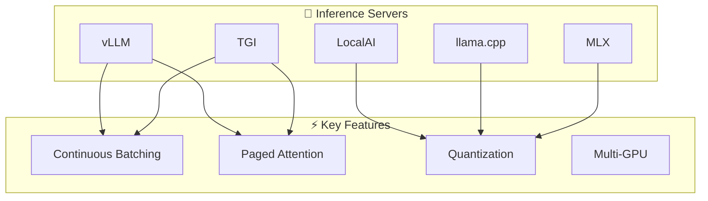

# Production Local Inference

## Introduction

Running AI locally at scale requires specialized inference servers. This lesson covers production-grade tools like vLLM, Text Generation Inference (TGI), and deployment strategies.

### What We'll Cover

- vLLM for high-throughput serving
- Text Generation Inference (TGI)
- LocalAI multi-model support
- llama.cpp optimizations
- MLX for Apple Silicon
- Kubernetes deployment

### Prerequisites

- Understanding of local AI basics
- Docker and container knowledge
- Basic Kubernetes concepts

---

## Production Inference Landscape



### Comparison Table

| Feature | vLLM | TGI | LocalAI | llama.cpp | MLX |
|---------|------|-----|---------|-----------|-----|
| Performance | ⭐⭐⭐⭐⭐ | ⭐⭐⭐⭐⭐ | ⭐⭐⭐ | ⭐⭐⭐⭐ | ⭐⭐⭐⭐ |
| Ease of setup | ⭐⭐⭐⭐ | ⭐⭐⭐⭐ | ⭐⭐⭐⭐⭐ | ⭐⭐⭐⭐ | ⭐⭐⭐⭐ |
| Memory efficiency | ⭐⭐⭐⭐⭐ | ⭐⭐⭐⭐ | ⭐⭐⭐ | ⭐⭐⭐⭐⭐ | ⭐⭐⭐⭐⭐ |
| Multi-GPU | ✅ | ✅ | ✅ | Limited | ❌ |
| Apple Silicon | ❌ | ❌ | ✅ | ✅ | ✅ |
| OpenAI compat | ✅ | ❌ | ✅ | ✅ | ❌ |
| Quantization | AWQ, GPTQ | AWQ, GPTQ | GGUF | GGUF | 4-bit |

---

## vLLM for High-Throughput

### Installation

```bash
# Install vLLM
pip install vllm

# Or with Docker
docker pull vllm/vllm-openai:latest
```

### Running vLLM Server

```bash
# Start server with OpenAI-compatible API
python -m vllm.entrypoints.openai.api_server \
    --model meta-llama/Llama-3.1-8B-Instruct \
    --host 0.0.0.0 \
    --port 8000 \
    --tensor-parallel-size 1

# With quantization
python -m vllm.entrypoints.openai.api_server \
    --model TheBloke/Llama-2-7B-Chat-AWQ \
    --quantization awq \
    --host 0.0.0.0 \
    --port 8000
```

### Docker Deployment

```yaml
# docker-compose.yml
version: '3.8'

services:
  vllm:
    image: vllm/vllm-openai:latest
    ports:
      - "8000:8000"
    volumes:
      - ~/.cache/huggingface:/root/.cache/huggingface
    environment:
      - HUGGING_FACE_HUB_TOKEN=${HF_TOKEN}
    command: >
      --model meta-llama/Llama-3.1-8B-Instruct
      --host 0.0.0.0
      --port 8000
      --max-model-len 8192
    deploy:
      resources:
        reservations:
          devices:
            - driver: nvidia
              count: 1
              capabilities: [gpu]
```

### Python Client

```python
from openai import OpenAI

# vLLM has OpenAI-compatible API
client = OpenAI(
    base_url="http://localhost:8000/v1",
    api_key="not-needed"
)

# Chat completion
response = client.chat.completions.create(
    model="meta-llama/Llama-3.1-8B-Instruct",
    messages=[
        {"role": "user", "content": "Hello!"}
    ],
    max_tokens=100
)

print(response.choices[0].message.content)
```

### vLLM Performance Tuning

```python
from dataclasses import dataclass
from typing import Optional

@dataclass
class VLLMConfig:
    """vLLM server configuration."""
    
    model: str
    tensor_parallel_size: int = 1  # GPUs for model parallelism
    max_model_len: int = 8192
    gpu_memory_utilization: float = 0.9
    max_num_batched_tokens: int = 8192
    max_num_seqs: int = 256  # Max concurrent sequences
    quantization: Optional[str] = None  # awq, gptq, squeezellm
    
    def to_args(self) -> list:
        """Convert to command line args."""
        
        args = [
            "--model", self.model,
            "--tensor-parallel-size", str(self.tensor_parallel_size),
            "--max-model-len", str(self.max_model_len),
            "--gpu-memory-utilization", str(self.gpu_memory_utilization),
            "--max-num-batched-tokens", str(self.max_num_batched_tokens),
            "--max-num-seqs", str(self.max_num_seqs),
        ]
        
        if self.quantization:
            args.extend(["--quantization", self.quantization])
        
        return args


# Example configurations
CONFIGS = {
    "single_gpu": VLLMConfig(
        model="meta-llama/Llama-3.1-8B-Instruct",
        tensor_parallel_size=1,
        gpu_memory_utilization=0.9
    ),
    "multi_gpu_70b": VLLMConfig(
        model="meta-llama/Llama-3.1-70B-Instruct",
        tensor_parallel_size=4,  # 4 GPUs
        max_model_len=4096,
        gpu_memory_utilization=0.95
    ),
    "quantized": VLLMConfig(
        model="TheBloke/Llama-2-13B-chat-AWQ",
        quantization="awq",
        max_num_seqs=512  # Higher throughput
    ),
}
```

---

## Text Generation Inference (TGI)

### Running TGI

```bash
# Docker (recommended)
docker run --gpus all -p 8080:80 \
    -v ~/.cache/huggingface:/data \
    ghcr.io/huggingface/text-generation-inference:latest \
    --model-id meta-llama/Llama-3.1-8B-Instruct \
    --max-input-length 4096 \
    --max-total-tokens 8192

# With quantization
docker run --gpus all -p 8080:80 \
    -v ~/.cache/huggingface:/data \
    ghcr.io/huggingface/text-generation-inference:latest \
    --model-id meta-llama/Llama-3.1-8B-Instruct \
    --quantize bitsandbytes-nf4
```

### TGI Client

```python
from huggingface_hub import InferenceClient
from dataclasses import dataclass
from typing import Generator, Optional

@dataclass
class TGIConfig:
    base_url: str = "http://localhost:8080"
    timeout: int = 60


class TGIClient:
    """Client for Text Generation Inference."""
    
    def __init__(self, config: TGIConfig = None):
        self.config = config or TGIConfig()
        self.client = InferenceClient(
            model=self.config.base_url,
            timeout=self.config.timeout
        )
    
    def generate(
        self,
        prompt: str,
        max_tokens: int = 500,
        temperature: float = 0.7,
        top_p: float = 0.95
    ) -> str:
        """Generate completion."""
        
        response = self.client.text_generation(
            prompt=prompt,
            max_new_tokens=max_tokens,
            temperature=temperature,
            top_p=top_p,
            do_sample=True
        )
        
        return response
    
    def stream(
        self,
        prompt: str,
        max_tokens: int = 500
    ) -> Generator[str, None, None]:
        """Stream completion."""
        
        for token in self.client.text_generation(
            prompt=prompt,
            max_new_tokens=max_tokens,
            stream=True
        ):
            yield token
    
    def chat(
        self,
        messages: list,
        max_tokens: int = 500
    ) -> str:
        """Chat completion (builds prompt internally)."""
        
        # Build chat prompt
        prompt = self._build_chat_prompt(messages)
        return self.generate(prompt, max_tokens)
    
    def _build_chat_prompt(self, messages: list) -> str:
        """Build prompt from messages."""
        
        # Llama format
        parts = []
        
        for msg in messages:
            role = msg["role"]
            content = msg["content"]
            
            if role == "system":
                parts.append(f"<|system|>\n{content}")
            elif role == "user":
                parts.append(f"<|user|>\n{content}")
            elif role == "assistant":
                parts.append(f"<|assistant|>\n{content}")
        
        parts.append("<|assistant|>")
        return "\n".join(parts)


# Usage
tgi = TGIClient()

response = tgi.generate("What is Python?")
print(response)

# Streaming
for token in tgi.stream("Explain AI briefly:"):
    print(token, end="", flush=True)
```

---

## LocalAI Multi-Model

### Setup

```bash
# Docker
docker run -p 8080:8080 \
    -v $PWD/models:/models \
    localai/localai:latest

# With GPU
docker run --gpus all -p 8080:8080 \
    -v $PWD/models:/models \
    localai/localai:latest-gpu-nvidia-cuda-12
```

### Multi-Model Configuration

```yaml
# models/llama.yaml
name: llama
backend: llama-cpp
parameters:
  model: /models/llama-3.1-8b-instruct-q4_k_m.gguf
  temperature: 0.7
  top_p: 0.95
  context_size: 4096
  gpu_layers: 35

# models/codellama.yaml
name: codellama
backend: llama-cpp
parameters:
  model: /models/codellama-7b-instruct-q4_k_m.gguf
  temperature: 0.2
  context_size: 16384
  gpu_layers: 35

# models/embeddings.yaml
name: embeddings
backend: bert-embeddings
parameters:
  model: /models/bge-base-en-v1.5-q4_k_m.gguf
```

### LocalAI Client

```python
from openai import OpenAI
from dataclasses import dataclass
from typing import List

@dataclass
class LocalAIModel:
    name: str
    backend: str
    use_case: str


class LocalAIClient:
    """Client for LocalAI multi-model server."""
    
    def __init__(self, base_url: str = "http://localhost:8080/v1"):
        self.client = OpenAI(
            base_url=base_url,
            api_key="not-needed"
        )
    
    def list_models(self) -> List[str]:
        """List available models."""
        
        models = self.client.models.list()
        return [m.id for m in models.data]
    
    def chat(
        self,
        model: str,
        messages: list,
        max_tokens: int = 500
    ) -> str:
        """Chat with specific model."""
        
        response = self.client.chat.completions.create(
            model=model,
            messages=messages,
            max_tokens=max_tokens
        )
        
        return response.choices[0].message.content
    
    def embed(
        self,
        model: str,
        texts: List[str]
    ) -> List[List[float]]:
        """Generate embeddings."""
        
        response = self.client.embeddings.create(
            model=model,
            input=texts
        )
        
        return [e.embedding for e in response.data]
    
    def generate_code(
        self,
        prompt: str,
        max_tokens: int = 1000
    ) -> str:
        """Generate code using code model."""
        
        return self.chat(
            model="codellama",
            messages=[
                {
                    "role": "system",
                    "content": "You are an expert programmer."
                },
                {
                    "role": "user",
                    "content": prompt
                }
            ],
            max_tokens=max_tokens
        )


# Usage
local = LocalAIClient()

# List models
print("Available models:", local.list_models())

# General chat
response = local.chat("llama", [
    {"role": "user", "content": "Hello!"}
])
print(response)

# Code generation
code = local.generate_code("Write a Python function to sort a list")
print(code)
```

---

## llama.cpp Server

### Running llama.cpp Server

```bash
# Build server
git clone https://github.com/ggerganov/llama.cpp
cd llama.cpp
make server

# Run server
./server \
    -m models/llama-3.1-8b-instruct-q4_k_m.gguf \
    --host 0.0.0.0 \
    --port 8080 \
    -c 4096 \
    -ngl 35 \
    --parallel 4
```

### Advanced llama.cpp Configuration

```python
from dataclasses import dataclass
from typing import Optional
import subprocess

@dataclass
class LlamaCppConfig:
    """llama.cpp server configuration."""
    
    model_path: str
    host: str = "0.0.0.0"
    port: int = 8080
    context_size: int = 4096
    gpu_layers: int = -1  # -1 = all layers
    parallel: int = 4  # Concurrent requests
    threads: int = 8
    batch_size: int = 512
    rope_freq_base: Optional[float] = None  # For extended context
    rope_freq_scale: Optional[float] = None
    
    def to_command(self) -> list:
        """Build command line."""
        
        cmd = [
            "./server",
            "-m", self.model_path,
            "--host", self.host,
            "--port", str(self.port),
            "-c", str(self.context_size),
            "-ngl", str(self.gpu_layers),
            "--parallel", str(self.parallel),
            "-t", str(self.threads),
            "-b", str(self.batch_size),
        ]
        
        if self.rope_freq_base:
            cmd.extend(["--rope-freq-base", str(self.rope_freq_base)])
        
        if self.rope_freq_scale:
            cmd.extend(["--rope-freq-scale", str(self.rope_freq_scale)])
        
        return cmd


# Example configurations
LLAMA_CONFIGS = {
    "standard": LlamaCppConfig(
        model_path="models/llama-3.1-8b-q4_k_m.gguf",
        context_size=4096,
        gpu_layers=35
    ),
    "long_context": LlamaCppConfig(
        model_path="models/llama-3.1-8b-q4_k_m.gguf",
        context_size=32768,
        gpu_layers=35,
        rope_freq_base=10000,
        rope_freq_scale=0.25
    ),
    "cpu_only": LlamaCppConfig(
        model_path="models/llama-3.1-8b-q4_k_m.gguf",
        context_size=2048,
        gpu_layers=0,
        threads=16,
        parallel=2
    ),
}
```

---

## MLX for Apple Silicon

### Setup

```bash
# Install MLX
pip install mlx mlx-lm

# Download models
huggingface-cli download mlx-community/Llama-3.2-3B-Instruct-4bit
```

### MLX Server

```python
# Note: Simplified example - actual MLX API may vary
from dataclasses import dataclass
from typing import Optional, Generator
import mlx.core as mx
from mlx_lm import load, generate

@dataclass
class MLXConfig:
    model_path: str = "mlx-community/Llama-3.2-3B-Instruct-4bit"
    max_tokens: int = 500
    temperature: float = 0.7


class MLXServer:
    """MLX inference server for Apple Silicon."""
    
    def __init__(self, config: MLXConfig = None):
        self.config = config or MLXConfig()
        self.model = None
        self.tokenizer = None
    
    def load_model(self):
        """Load model into memory."""
        
        self.model, self.tokenizer = load(self.config.model_path)
        print(f"Model loaded: {self.config.model_path}")
    
    def generate(
        self,
        prompt: str,
        max_tokens: Optional[int] = None
    ) -> str:
        """Generate completion."""
        
        if self.model is None:
            self.load_model()
        
        response = generate(
            self.model,
            self.tokenizer,
            prompt=prompt,
            max_tokens=max_tokens or self.config.max_tokens,
            temp=self.config.temperature
        )
        
        return response
    
    def chat(
        self,
        messages: list,
        max_tokens: Optional[int] = None
    ) -> str:
        """Chat completion."""
        
        # Build prompt
        prompt = self._build_prompt(messages)
        return self.generate(prompt, max_tokens)
    
    def _build_prompt(self, messages: list) -> str:
        """Build chat prompt."""
        
        parts = []
        for msg in messages:
            role = msg["role"]
            content = msg["content"]
            parts.append(f"<|{role}|>\n{content}")
        
        parts.append("<|assistant|>")
        return "\n".join(parts)


# Usage
server = MLXServer()

response = server.chat([
    {"role": "user", "content": "What is machine learning?"}
])
print(response)
```

---

## Kubernetes Deployment

### Kubernetes Manifests

```yaml
# vllm-deployment.yaml
apiVersion: apps/v1
kind: Deployment
metadata:
  name: vllm-server
  labels:
    app: vllm
spec:
  replicas: 1
  selector:
    matchLabels:
      app: vllm
  template:
    metadata:
      labels:
        app: vllm
    spec:
      containers:
      - name: vllm
        image: vllm/vllm-openai:latest
        ports:
        - containerPort: 8000
        args:
          - "--model"
          - "meta-llama/Llama-3.1-8B-Instruct"
          - "--host"
          - "0.0.0.0"
          - "--port"
          - "8000"
          - "--max-model-len"
          - "8192"
        resources:
          limits:
            nvidia.com/gpu: 1
            memory: "32Gi"
          requests:
            nvidia.com/gpu: 1
            memory: "24Gi"
        volumeMounts:
        - name: model-cache
          mountPath: /root/.cache/huggingface
        env:
        - name: HUGGING_FACE_HUB_TOKEN
          valueFrom:
            secretKeyRef:
              name: hf-token
              key: token
      volumes:
      - name: model-cache
        persistentVolumeClaim:
          claimName: model-cache-pvc
      nodeSelector:
        gpu: "true"

---
apiVersion: v1
kind: Service
metadata:
  name: vllm-service
spec:
  selector:
    app: vllm
  ports:
  - port: 8000
    targetPort: 8000
  type: ClusterIP

---
apiVersion: autoscaling/v2
kind: HorizontalPodAutoscaler
metadata:
  name: vllm-hpa
spec:
  scaleTargetRef:
    apiVersion: apps/v1
    kind: Deployment
    name: vllm-server
  minReplicas: 1
  maxReplicas: 4
  metrics:
  - type: Resource
    resource:
      name: cpu
      target:
        type: Utilization
        averageUtilization: 80
```

### Kubernetes Client

```python
from dataclasses import dataclass
from typing import Optional
from openai import OpenAI

@dataclass
class K8sAIConfig:
    service_name: str = "vllm-service"
    namespace: str = "default"
    port: int = 8000
    
    @property
    def base_url(self) -> str:
        return f"http://{self.service_name}.{self.namespace}.svc.cluster.local:{self.port}/v1"


class K8sAIClient:
    """Client for Kubernetes-deployed AI."""
    
    def __init__(self, config: K8sAIConfig = None):
        self.config = config or K8sAIConfig()
        
        self.client = OpenAI(
            base_url=self.config.base_url,
            api_key="not-needed"
        )
    
    def chat(
        self,
        messages: list,
        model: str = "meta-llama/Llama-3.1-8B-Instruct",
        max_tokens: int = 500
    ) -> str:
        """Chat completion."""
        
        response = self.client.chat.completions.create(
            model=model,
            messages=messages,
            max_tokens=max_tokens
        )
        
        return response.choices[0].message.content
    
    def health_check(self) -> bool:
        """Check if service is healthy."""
        
        try:
            self.client.models.list()
            return True
        except Exception:
            return False


# In-cluster usage
k8s_client = K8sAIClient()

if k8s_client.health_check():
    response = k8s_client.chat([
        {"role": "user", "content": "Hello!"}
    ])
    print(response)
```

---

## Production Monitoring

```python
from dataclasses import dataclass, field
from datetime import datetime
from typing import Dict, List
import time
from prometheus_client import Counter, Histogram, Gauge, start_http_server

# Prometheus metrics
REQUEST_COUNT = Counter(
    'ai_requests_total',
    'Total AI requests',
    ['model', 'status']
)

REQUEST_LATENCY = Histogram(
    'ai_request_latency_seconds',
    'Request latency',
    ['model'],
    buckets=[0.1, 0.5, 1.0, 2.0, 5.0, 10.0]
)

ACTIVE_REQUESTS = Gauge(
    'ai_active_requests',
    'Currently active requests',
    ['model']
)

TOKENS_GENERATED = Counter(
    'ai_tokens_generated_total',
    'Total tokens generated',
    ['model']
)


class MonitoredAIClient:
    """AI client with Prometheus metrics."""
    
    def __init__(self, client, model: str):
        self.client = client
        self.model = model
    
    def chat(
        self,
        messages: list,
        max_tokens: int = 500
    ) -> str:
        """Chat with monitoring."""
        
        ACTIVE_REQUESTS.labels(model=self.model).inc()
        start_time = time.perf_counter()
        
        try:
            response = self.client.chat.completions.create(
                model=self.model,
                messages=messages,
                max_tokens=max_tokens
            )
            
            # Record success metrics
            REQUEST_COUNT.labels(model=self.model, status="success").inc()
            
            tokens = response.usage.completion_tokens
            TOKENS_GENERATED.labels(model=self.model).inc(tokens)
            
            return response.choices[0].message.content
        
        except Exception as e:
            REQUEST_COUNT.labels(model=self.model, status="error").inc()
            raise
        
        finally:
            latency = time.perf_counter() - start_time
            REQUEST_LATENCY.labels(model=self.model).observe(latency)
            ACTIVE_REQUESTS.labels(model=self.model).dec()


# Start Prometheus endpoint
start_http_server(9090)

# Usage
from openai import OpenAI

raw_client = OpenAI(
    base_url="http://localhost:8000/v1",
    api_key="not-needed"
)

monitored = MonitoredAIClient(raw_client, "llama-3.1-8b")

response = monitored.chat([
    {"role": "user", "content": "Hello!"}
])
```

---

## Hands-on Exercise

### Your Task

Build a production inference manager.

### Requirements

1. Support multiple backends (vLLM, TGI)
2. Health checking
3. Load balancing
4. Metrics collection

<details>
<summary>💡 Hints</summary>

- Use health endpoints
- Round-robin or least-connections
- Track latency and errors
</details>

<details>
<summary>✅ Solution</summary>

```python
from dataclasses import dataclass, field
from datetime import datetime
from enum import Enum
from typing import Optional, List, Dict
import time
import random
from openai import OpenAI
import threading

class BackendType(Enum):
    VLLM = "vllm"
    TGI = "tgi"
    LOCALAI = "localai"
    OLLAMA = "ollama"


class BackendStatus(Enum):
    HEALTHY = "healthy"
    UNHEALTHY = "unhealthy"
    UNKNOWN = "unknown"


@dataclass
class BackendConfig:
    name: str
    backend_type: BackendType
    base_url: str
    model: str
    weight: int = 1  # For weighted load balancing


@dataclass
class BackendHealth:
    status: BackendStatus
    last_check: str
    latency_ms: float
    error: Optional[str] = None


@dataclass
class RequestMetrics:
    total_requests: int = 0
    successful_requests: int = 0
    failed_requests: int = 0
    total_latency_ms: float = 0
    
    @property
    def avg_latency_ms(self) -> float:
        if self.successful_requests == 0:
            return 0
        return self.total_latency_ms / self.successful_requests
    
    @property
    def success_rate(self) -> float:
        if self.total_requests == 0:
            return 0
        return self.successful_requests / self.total_requests * 100


class ProductionInferenceManager:
    """Production inference manager with load balancing."""
    
    def __init__(self, backends: List[BackendConfig]):
        self.backends = backends
        self.clients: Dict[str, OpenAI] = {}
        self.health: Dict[str, BackendHealth] = {}
        self.metrics: Dict[str, RequestMetrics] = {}
        
        # Initialize
        for backend in backends:
            self.clients[backend.name] = OpenAI(
                base_url=backend.base_url,
                api_key="not-needed"
            )
            self.health[backend.name] = BackendHealth(
                status=BackendStatus.UNKNOWN,
                last_check="never",
                latency_ms=0
            )
            self.metrics[backend.name] = RequestMetrics()
        
        # Start health checker
        self._start_health_checker()
    
    def _start_health_checker(self):
        """Start background health checker."""
        
        def check_loop():
            while True:
                self._check_all_health()
                time.sleep(30)  # Check every 30 seconds
        
        thread = threading.Thread(target=check_loop, daemon=True)
        thread.start()
    
    def _check_all_health(self):
        """Check health of all backends."""
        
        for backend in self.backends:
            self._check_health(backend)
    
    def _check_health(self, backend: BackendConfig):
        """Check health of a single backend."""
        
        start = time.perf_counter()
        
        try:
            # Simple health check - list models
            self.clients[backend.name].models.list()
            
            latency = (time.perf_counter() - start) * 1000
            
            self.health[backend.name] = BackendHealth(
                status=BackendStatus.HEALTHY,
                last_check=datetime.now().isoformat(),
                latency_ms=round(latency, 1)
            )
        
        except Exception as e:
            self.health[backend.name] = BackendHealth(
                status=BackendStatus.UNHEALTHY,
                last_check=datetime.now().isoformat(),
                latency_ms=0,
                error=str(e)
            )
    
    def _get_healthy_backends(self) -> List[BackendConfig]:
        """Get list of healthy backends."""
        
        return [
            b for b in self.backends
            if self.health[b.name].status == BackendStatus.HEALTHY
        ]
    
    def _select_backend(self) -> Optional[BackendConfig]:
        """Select backend using weighted round-robin."""
        
        healthy = self._get_healthy_backends()
        
        if not healthy:
            # Try all if none healthy
            healthy = self.backends
        
        # Weighted random selection
        weights = [b.weight for b in healthy]
        total = sum(weights)
        r = random.uniform(0, total)
        
        cumulative = 0
        for backend in healthy:
            cumulative += backend.weight
            if r <= cumulative:
                return backend
        
        return healthy[0] if healthy else None
    
    def chat(
        self,
        messages: list,
        max_tokens: int = 500,
        preferred_backend: Optional[str] = None
    ) -> dict:
        """Send chat request with load balancing."""
        
        # Select backend
        if preferred_backend and preferred_backend in self.clients:
            backend = next(
                b for b in self.backends 
                if b.name == preferred_backend
            )
        else:
            backend = self._select_backend()
        
        if not backend:
            return {"error": "No backends available"}
        
        start = time.perf_counter()
        metrics = self.metrics[backend.name]
        metrics.total_requests += 1
        
        try:
            response = self.clients[backend.name].chat.completions.create(
                model=backend.model,
                messages=messages,
                max_tokens=max_tokens
            )
            
            latency = (time.perf_counter() - start) * 1000
            metrics.successful_requests += 1
            metrics.total_latency_ms += latency
            
            return {
                "content": response.choices[0].message.content,
                "backend": backend.name,
                "model": backend.model,
                "latency_ms": round(latency, 1)
            }
        
        except Exception as e:
            metrics.failed_requests += 1
            
            # Try another backend
            other_backends = [
                b for b in self.backends 
                if b.name != backend.name
            ]
            
            for fallback in other_backends:
                try:
                    response = self.clients[fallback.name].chat.completions.create(
                        model=fallback.model,
                        messages=messages,
                        max_tokens=max_tokens
                    )
                    
                    latency = (time.perf_counter() - start) * 1000
                    fb_metrics = self.metrics[fallback.name]
                    fb_metrics.total_requests += 1
                    fb_metrics.successful_requests += 1
                    fb_metrics.total_latency_ms += latency
                    
                    return {
                        "content": response.choices[0].message.content,
                        "backend": fallback.name,
                        "model": fallback.model,
                        "latency_ms": round(latency, 1),
                        "fallback": True,
                        "original_backend": backend.name
                    }
                
                except Exception:
                    continue
            
            return {
                "error": f"All backends failed. Last error: {e}",
                "backend": backend.name
            }
    
    def get_status(self) -> dict:
        """Get overall status."""
        
        return {
            "backends": [
                {
                    "name": b.name,
                    "type": b.backend_type.value,
                    "health": self.health[b.name].status.value,
                    "last_check": self.health[b.name].last_check,
                    "latency_ms": self.health[b.name].latency_ms,
                    "metrics": {
                        "total": self.metrics[b.name].total_requests,
                        "success_rate": round(self.metrics[b.name].success_rate, 1),
                        "avg_latency_ms": round(self.metrics[b.name].avg_latency_ms, 1)
                    }
                }
                for b in self.backends
            ],
            "healthy_count": len(self._get_healthy_backends()),
            "total_count": len(self.backends)
        }


# Usage
manager = ProductionInferenceManager([
    BackendConfig(
        name="vllm-primary",
        backend_type=BackendType.VLLM,
        base_url="http://localhost:8000/v1",
        model="meta-llama/Llama-3.1-8B-Instruct",
        weight=3
    ),
    BackendConfig(
        name="ollama-backup",
        backend_type=BackendType.OLLAMA,
        base_url="http://localhost:11434/v1",
        model="llama3.1",
        weight=1
    ),
])

# Chat with automatic load balancing
result = manager.chat([
    {"role": "user", "content": "Hello!"}
])

print(f"Response from: {result.get('backend')}")
print(f"Latency: {result.get('latency_ms')}ms")

# Get status
import json
print("\nStatus:")
print(json.dumps(manager.get_status(), indent=2))
```

</details>

---

## Summary

✅ vLLM provides highest throughput with PagedAttention  
✅ TGI offers production-ready Hugging Face integration  
✅ LocalAI enables multi-model serving  
✅ llama.cpp excels at efficiency and quantization  
✅ MLX optimizes for Apple Silicon  
✅ Kubernetes enables scalable deployment

**Next:** [OpenAI Responses API](../15-openai-responses-api/00-openai-responses-api.md)

---

## Further Reading

- [vLLM Documentation](https://docs.vllm.ai/) — High-throughput serving
- [TGI Documentation](https://huggingface.co/docs/text-generation-inference) — Hugging Face inference
- [LocalAI](https://localai.io/) — OpenAI-compatible local AI
- [llama.cpp](https://github.com/ggerganov/llama.cpp) — Efficient inference
