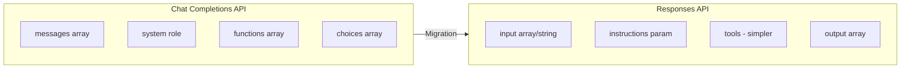

# OpenAI Responses API

## Overview

This lesson covers OpenAI's new Responses API, the recommended approach for building AI applications in 2025 and beyond. It offers improved performance, simpler conversation management, and native support for agentic workflows.

### Lesson Structure

| File | Topic | Description |
|------|-------|-------------|
| [01-responses-api-overview.md](./01-responses-api-overview.md) | API Overview | Evolution, benefits, benchmarks |
| [02-request-structure.md](./02-request-structure.md) | Request Structure | Input array, instructions, functions |
| [03-response-structure.md](./03-response-structure.md) | Response Structure | Output items, types, helpers |
| [04-conversation-state.md](./04-conversation-state.md) | Conversation State | Chaining, context preservation |
| [05-agentic-features.md](./05-agentic-features.md) | Agentic Features | Multi-tool, MCP, connectors |
| [06-data-storage.md](./06-data-storage.md) | Data Storage | Store parameter, compliance |
| [07-migration-guide.md](./07-migration-guide.md) | Migration Guide | Chat Completions to Responses |

---

## Why Responses API?



### Key Benefits

| Aspect | Chat Completions | Responses API |
|--------|------------------|---------------|
| Reasoning | Baseline | +3% benchmark improvement |
| Cache hits | 40-60% | 40-80% better utilization |
| Conversation | Manual history | Built-in state (`previous_response_id`) |
| Tools | Sequential | Multi-tool execution loop |
| System prompt | `role: system` | `instructions` parameter |
| Response | `choices[0].message` | `output` array with items |

---

## Quick Start

### Basic Request

```python
from openai import OpenAI

client = OpenAI()

# Simple string input
response = client.responses.create(
    model="gpt-4o",
    input="What is machine learning?"
)

print(response.output_text)
```

### With Instructions

```python
response = client.responses.create(
    model="gpt-4o",
    instructions="You are a helpful AI assistant. Be concise.",
    input="Explain neural networks"
)

print(response.output_text)
```

### Conversation Chaining

```python
# First message
response1 = client.responses.create(
    model="gpt-4o",
    input="My name is Alice"
)

# Continue conversation
response2 = client.responses.create(
    model="gpt-4o",
    input="What's my name?",
    previous_response_id=response1.id
)

print(response2.output_text)  # "Your name is Alice"
```

---

## API Comparison

### Chat Completions (Old)

```python
# Old approach
response = client.chat.completions.create(
    model="gpt-4o",
    messages=[
        {"role": "system", "content": "Be helpful"},
        {"role": "user", "content": "Hello"}
    ]
)

text = response.choices[0].message.content
```

### Responses API (New)

```python
# New approach
response = client.responses.create(
    model="gpt-4o",
    instructions="Be helpful",
    input="Hello"
)

text = response.output_text
```

---

## When to Use Which

| Use Case | Recommended API |
|----------|-----------------|
| New projects (2025+) | Responses API |
| Existing Chat Completions code | Migrate when ready |
| Agentic workflows | Responses API |
| Multi-turn conversations | Responses API |
| Simple completions | Either (Responses simpler) |
| Fine-tuning training data | Chat Completions format |

---

## Learning Path

1. **[API Overview](./01-responses-api-overview.md)** — Understand the evolution and benefits
2. **[Request Structure](./02-request-structure.md)** — Master input formats and parameters
3. **[Response Structure](./03-response-structure.md)** — Work with output items
4. **[Conversation State](./04-conversation-state.md)** — Build multi-turn conversations
5. **[Agentic Features](./05-agentic-features.md)** — Leverage tools and MCP
6. **[Data Storage](./06-data-storage.md)** — Understand storage implications
7. **[Migration Guide](./07-migration-guide.md)** — Migrate existing code

---

## Prerequisites

- Familiarity with OpenAI Chat Completions API
- Understanding of API authentication
- Basic knowledge of function calling (for tool sections)

---

## Further Reading

- [OpenAI Responses API Documentation](https://platform.openai.com/docs/api-reference/responses)
- [Migration Guide](https://platform.openai.com/docs/guides/responses-vs-chat-completions)
- [Agentic SDK](https://platform.openai.com/docs/guides/agents)
