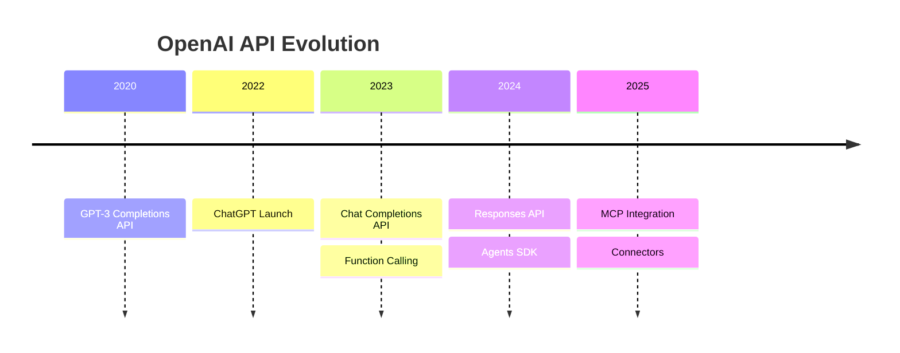
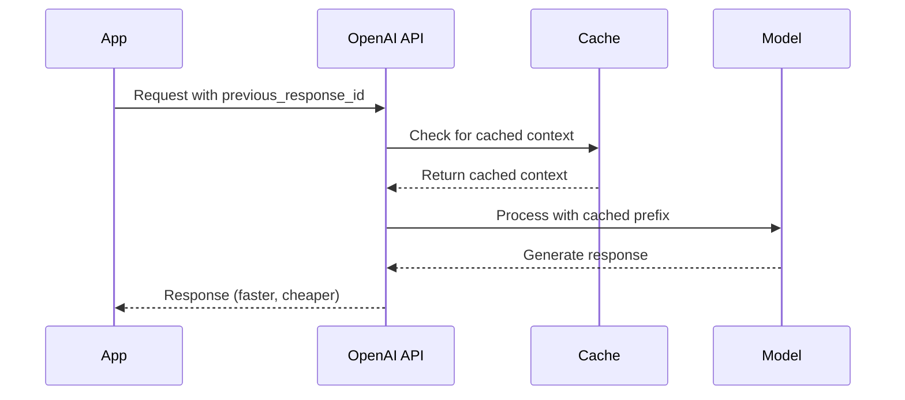

# Responses API Overview

## Introduction

OpenAI's Responses API represents the next generation of AI interaction. Introduced in 2024, it simplifies building AI applications while improving performance and enabling agentic workflows.

### What We'll Cover

- Evolution from Chat Completions
- Why Responses API for new projects
- Performance improvements
- Cache utilization benefits

### Prerequisites

- Experience with Chat Completions API
- Understanding of AI API concepts
- OpenAI API key

---

## Evolution of OpenAI APIs



### API Timeline

| API | Status | Recommendation |
|-----|--------|----------------|
| Completions | Deprecated | Migrate away |
| Chat Completions | Stable | Existing projects |
| Responses | Current | New projects |

### Why a New API?

```python
# The Chat Completions API was designed for chat-like interactions
# But modern use cases needed more:

use_cases = {
    "multi_turn": "Managing conversation history is manual",
    "agents": "Function calling required complex loops",
    "tools": "Each tool call needs separate handling",
    "context": "Context window management is developer burden",
    "state": "No built-in conversation persistence",
}

# Responses API addresses all of these
```

---

## Key Differences

### Request Simplification

```python
from openai import OpenAI

client = OpenAI()

# Chat Completions - verbose
chat_response = client.chat.completions.create(
    model="gpt-4o",
    messages=[
        {
            "role": "system",
            "content": "You are a helpful assistant."
        },
        {
            "role": "user",
            "content": "Hello, world!"
        }
    ],
    max_tokens=100,
    temperature=0.7
)

# Responses API - simpler
responses_response = client.responses.create(
    model="gpt-4o",
    instructions="You are a helpful assistant.",
    input="Hello, world!",
    max_output_tokens=100,
    temperature=0.7
)
```

### Response Structure

```python
# Chat Completions response
chat_text = chat_response.choices[0].message.content

# Responses API response
responses_text = responses_response.output_text

# Or access structured output
for item in responses_response.output:
    print(f"Type: {item.type}")
    if item.type == "message":
        print(f"Content: {item.content[0].text}")
```

---

## Performance Improvements

### Reasoning Benchmarks

```python
# OpenAI reports ~3% improvement in reasoning tasks
# when using Responses API vs Chat Completions

benchmark_improvements = {
    "MMLU": "+2.8%",
    "HumanEval": "+3.2%",
    "GSM8K": "+2.5%",
    "MATH": "+3.1%",
}

# This is due to internal optimizations in how
# the Responses API processes instructions
```

### Why Better Performance?

1. **Optimized instruction handling** — `instructions` param is processed differently than system messages
2. **Better context management** — Built-in conversation state reduces noise
3. **Improved tokenization** — Internal token handling is more efficient
4. **Native tool execution** — Less back-and-forth for agentic tasks

---

## Cache Utilization

### How Caching Works



### Cache Benefits

```python
from dataclasses import dataclass
from typing import Optional

@dataclass
class CacheStats:
    api: str
    cache_hit_rate: str
    cost_savings: str
    latency_improvement: str


CACHE_COMPARISON = {
    "chat_completions": CacheStats(
        api="Chat Completions",
        cache_hit_rate="40-60%",
        cost_savings="Up to 50%",
        latency_improvement="20-30%"
    ),
    "responses": CacheStats(
        api="Responses",
        cache_hit_rate="60-80%",
        cost_savings="Up to 75%",
        latency_improvement="40-50%"
    ),
}


def print_comparison():
    for api_name, stats in CACHE_COMPARISON.items():
        print(f"\n{stats.api}:")
        print(f"  Cache hit rate: {stats.cache_hit_rate}")
        print(f"  Cost savings: {stats.cost_savings}")
        print(f"  Latency improvement: {stats.latency_improvement}")


print_comparison()
```

**Output:**
```
Chat Completions:
  Cache hit rate: 40-60%
  Cost savings: Up to 50%
  Latency improvement: 20-30%

Responses:
  Cache hit rate: 60-80%
  Cost savings: Up to 75%
  Latency improvement: 40-50%
```

### Automatic Prompt Caching

```python
# Responses API automatically caches:
# 1. Instructions (system prompt equivalent)
# 2. Previous conversation context
# 3. Tool definitions

# First request - full processing
response1 = client.responses.create(
    model="gpt-4o",
    instructions="You are a Python expert.",  # Cached
    input="What is a list comprehension?"
)

# Second request - instructions cached
response2 = client.responses.create(
    model="gpt-4o",
    instructions="You are a Python expert.",  # Cache HIT
    input="What is a generator?"
)

# Chained request - context cached
response3 = client.responses.create(
    model="gpt-4o",
    input="Show me an example",
    previous_response_id=response2.id  # Context cached
)
```

---

## Feature Comparison

```python
from dataclasses import dataclass
from typing import Optional

@dataclass
class FeatureComparison:
    feature: str
    chat_completions: str
    responses: str


FEATURES = [
    FeatureComparison(
        feature="System prompt",
        chat_completions="messages[0] with role='system'",
        responses="instructions parameter"
    ),
    FeatureComparison(
        feature="User input",
        chat_completions="messages array with roles",
        responses="input string or array"
    ),
    FeatureComparison(
        feature="Response access",
        chat_completions="choices[0].message.content",
        responses="output_text property"
    ),
    FeatureComparison(
        feature="Conversation history",
        chat_completions="Manual message array",
        responses="previous_response_id"
    ),
    FeatureComparison(
        feature="Multi-tool calls",
        chat_completions="Loop required",
        responses="Built-in execution loop"
    ),
    FeatureComparison(
        feature="MCP support",
        chat_completions="Not native",
        responses="Native integration"
    ),
    FeatureComparison(
        feature="Data storage",
        chat_completions="Always ephemeral",
        responses="Configurable (store param)"
    ),
]


def print_features():
    print(f"{'Feature':<25} {'Chat Completions':<30} {'Responses':<30}")
    print("-" * 85)
    
    for f in FEATURES:
        print(f"{f.feature:<25} {f.chat_completions:<30} {f.responses:<30}")


print_features()
```

---

## Agentic Capabilities

### Built-in Tool Loop

```python
# Chat Completions: Manual loop required
def chat_agent_loop(messages, tools):
    while True:
        response = client.chat.completions.create(
            model="gpt-4o",
            messages=messages,
            tools=tools
        )
        
        if response.choices[0].finish_reason == "stop":
            return response.choices[0].message.content
        
        # Manually handle each tool call
        for tool_call in response.choices[0].message.tool_calls:
            result = execute_tool(tool_call)
            messages.append({
                "role": "tool",
                "tool_call_id": tool_call.id,
                "content": result
            })


# Responses API: Built-in loop
def responses_agent(input_text, tools):
    response = client.responses.create(
        model="gpt-4o",
        input=input_text,
        tools=tools,
        tool_choice="auto"  # Automatically executes tools
    )
    
    return response.output_text
```

### MCP Integration

```python
# Responses API natively supports Model Context Protocol
response = client.responses.create(
    model="gpt-4o",
    input="Search for Python tutorials",
    tools=[
        {
            "type": "mcp",
            "server_url": "https://mcp.example.com",
            "tools": ["search", "browse"]
        }
    ]
)
```

---

## When to Migrate

### Migrate Now If:

- Starting a new project
- Building agentic applications
- Need better caching
- Want simpler code
- Using multi-turn conversations

### Wait to Migrate If:

- Complex existing Chat Completions setup
- Using features not yet in Responses API
- Need to maintain backward compatibility
- Have extensive testing for Chat Completions

### Migration Complexity

| Scenario | Effort | Notes |
|----------|--------|-------|
| Simple completions | Low | 1:1 mapping |
| Multi-turn chat | Medium | Use `previous_response_id` |
| Function calling | Medium | Update tool format |
| Complex agents | Medium-High | Leverage built-in loop |
| Streaming | Low | Same pattern |

---

## Hands-on Exercise

### Your Task

Compare Chat Completions and Responses API.

### Requirements

1. Implement the same prompt with both APIs
2. Measure response times
3. Compare response structures
4. Document differences

<details>
<summary>💡 Hints</summary>

- Use time.perf_counter() for timing
- Print full response objects
- Note convenience properties
</details>

<details>
<summary>✅ Solution</summary>

```python
import time
from dataclasses import dataclass
from typing import Optional
from openai import OpenAI

@dataclass
class APIComparison:
    api_name: str
    latency_ms: float
    response_text: str
    response_structure: dict
    convenience: str


def compare_apis():
    """Compare Chat Completions and Responses API."""
    
    client = OpenAI()
    
    prompt = "Explain what an API is in one sentence."
    system = "You are a helpful assistant. Be concise."
    
    results = []
    
    # Chat Completions
    start = time.perf_counter()
    
    chat_response = client.chat.completions.create(
        model="gpt-4o-mini",
        messages=[
            {"role": "system", "content": system},
            {"role": "user", "content": prompt}
        ],
        max_tokens=100
    )
    
    chat_latency = (time.perf_counter() - start) * 1000
    
    results.append(APIComparison(
        api_name="Chat Completions",
        latency_ms=round(chat_latency, 1),
        response_text=chat_response.choices[0].message.content,
        response_structure={
            "access_pattern": "response.choices[0].message.content",
            "has_choices": True,
            "has_message": True,
            "fields": list(chat_response.model_dump().keys())
        },
        convenience="Manual message array management"
    ))
    
    # Responses API
    start = time.perf_counter()
    
    responses_response = client.responses.create(
        model="gpt-4o-mini",
        instructions=system,
        input=prompt,
        max_output_tokens=100
    )
    
    responses_latency = (time.perf_counter() - start) * 1000
    
    results.append(APIComparison(
        api_name="Responses API",
        latency_ms=round(responses_latency, 1),
        response_text=responses_response.output_text,
        response_structure={
            "access_pattern": "response.output_text",
            "has_output_text": True,
            "has_output_array": True,
            "fields": list(responses_response.model_dump().keys())
        },
        convenience="Built-in previous_response_id for chaining"
    ))
    
    return results


def print_comparison(results):
    print("\n" + "=" * 60)
    print("API COMPARISON RESULTS")
    print("=" * 60)
    
    for result in results:
        print(f"\n{result.api_name}:")
        print(f"  Latency: {result.latency_ms}ms")
        print(f"  Response: {result.response_text[:100]}...")
        print(f"  Access: {result.response_structure['access_pattern']}")
        print(f"  Convenience: {result.convenience}")
        print(f"  Fields: {', '.join(result.response_structure['fields'][:5])}...")


# Run comparison
results = compare_apis()
print_comparison(results)

# Additional: Test conversation chaining
print("\n" + "=" * 60)
print("CONVERSATION CHAINING COMPARISON")
print("=" * 60)

client = OpenAI()

# Chat Completions - manual history
chat_messages = [
    {"role": "user", "content": "My name is Bob"}
]

chat_r1 = client.chat.completions.create(
    model="gpt-4o-mini",
    messages=chat_messages
)

chat_messages.append({
    "role": "assistant",
    "content": chat_r1.choices[0].message.content
})
chat_messages.append({
    "role": "user",
    "content": "What's my name?"
})

chat_r2 = client.chat.completions.create(
    model="gpt-4o-mini",
    messages=chat_messages
)

print(f"\nChat Completions (manual history):")
print(f"  Q: What's my name?")
print(f"  A: {chat_r2.choices[0].message.content}")
print(f"  Messages managed: {len(chat_messages)}")

# Responses API - automatic chaining
resp_r1 = client.responses.create(
    model="gpt-4o-mini",
    input="My name is Alice"
)

resp_r2 = client.responses.create(
    model="gpt-4o-mini",
    input="What's my name?",
    previous_response_id=resp_r1.id
)

print(f"\nResponses API (automatic chaining):")
print(f"  Q: What's my name?")
print(f"  A: {resp_r2.output_text}")
print(f"  Messages managed: 0 (automatic)")
```

</details>

---

## Summary

✅ Responses API is the recommended approach for new projects  
✅ 3% reasoning improvement over Chat Completions  
✅ 40-80% better cache utilization  
✅ Simpler request/response structure  
✅ Built-in conversation state and agentic features

**Next:** [Request Structure](./02-request-structure.md)

---

## Further Reading

- [OpenAI Responses API](https://platform.openai.com/docs/api-reference/responses) — Official docs
- [API Comparison](https://platform.openai.com/docs/guides/responses-vs-chat-completions) — Migration guide
- [Agentic Features](https://platform.openai.com/docs/guides/agents) — Agent development
