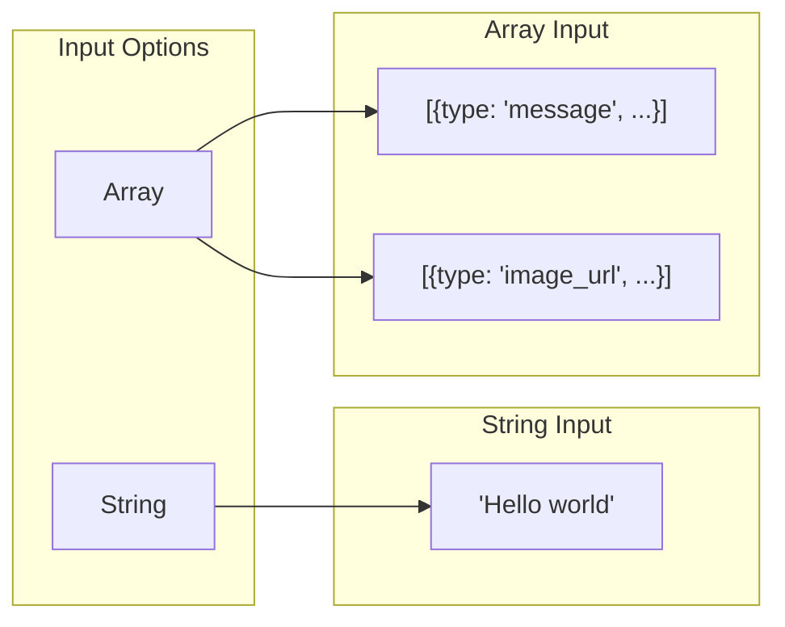

# Request Structure

## Introduction

The Responses API uses a simplified request structure compared to Chat Completions. This lesson covers the input formats, instructions parameter, and function definitions.

### What We'll Cover

- Input array and string shorthand
- Instructions parameter
- Simpler function definitions
- Request configuration options

### Prerequisites

- Understanding of Responses API basics
- OpenAI API key configured
- Python environment ready

---

## Input Formats



### String Input (Simple)

```python
from openai import OpenAI

client = OpenAI()

# Simplest form - just a string
response = client.responses.create(
    model="gpt-4o",
    input="What is the capital of France?"
)

print(response.output_text)
```

**Output:**
```
The capital of France is Paris.
```

### Array Input (Structured)

```python
# Array input for more control
response = client.responses.create(
    model="gpt-4o",
    input=[
        {
            "type": "message",
            "role": "user",
            "content": "What is Python?"
        }
    ]
)

print(response.output_text)
```

### Multi-Message Input

```python
# Multiple messages in input array
response = client.responses.create(
    model="gpt-4o",
    input=[
        {
            "type": "message",
            "role": "user",
            "content": "Hi, I'm learning Python."
        },
        {
            "type": "message",
            "role": "assistant",
            "content": "Great! Python is a versatile language."
        },
        {
            "type": "message",
            "role": "user",
            "content": "What should I learn first?"
        }
    ]
)

print(response.output_text)
```

---

## Instructions Parameter

### System Prompt Replacement

```python
# Chat Completions - system message
chat_response = client.chat.completions.create(
    model="gpt-4o",
    messages=[
        {"role": "system", "content": "You are a helpful coding assistant."},
        {"role": "user", "content": "Write a hello world"}
    ]
)

# Responses API - instructions parameter
responses_response = client.responses.create(
    model="gpt-4o",
    instructions="You are a helpful coding assistant.",
    input="Write a hello world"
)
```

### Instructions Best Practices

```python
from dataclasses import dataclass
from typing import List

@dataclass
class InstructionTemplate:
    name: str
    instructions: str
    use_case: str


INSTRUCTION_TEMPLATES = [
    InstructionTemplate(
        name="code_assistant",
        instructions="""You are an expert programmer.
        - Write clean, well-documented code
        - Explain your approach
        - Handle edge cases
        - Use best practices""",
        use_case="Code generation and review"
    ),
    InstructionTemplate(
        name="data_analyst",
        instructions="""You are a data analyst.
        - Provide statistical insights
        - Use precise numbers
        - Cite sources when possible
        - Visualize with descriptions""",
        use_case="Data analysis tasks"
    ),
    InstructionTemplate(
        name="teacher",
        instructions="""You are a patient teacher.
        - Explain concepts simply
        - Use analogies
        - Check for understanding
        - Encourage questions""",
        use_case="Educational content"
    ),
]


def get_instructions(template_name: str) -> str:
    """Get instructions by template name."""
    
    template = next(
        (t for t in INSTRUCTION_TEMPLATES if t.name == template_name),
        None
    )
    
    return template.instructions if template else ""


# Usage
response = client.responses.create(
    model="gpt-4o",
    instructions=get_instructions("code_assistant"),
    input="Write a Python function to sort a dictionary by value"
)
```

### Dynamic Instructions

```python
from typing import Optional

def build_instructions(
    role: str,
    context: Optional[str] = None,
    constraints: Optional[List[str]] = None,
    output_format: Optional[str] = None
) -> str:
    """Build dynamic instructions."""
    
    parts = [f"You are a {role}."]
    
    if context:
        parts.append(f"\nContext: {context}")
    
    if constraints:
        parts.append("\nConstraints:")
        for c in constraints:
            parts.append(f"- {c}")
    
    if output_format:
        parts.append(f"\nOutput format: {output_format}")
    
    return "\n".join(parts)


# Dynamic instruction generation
instructions = build_instructions(
    role="Python code reviewer",
    context="Reviewing production code",
    constraints=[
        "Focus on performance",
        "Check for security issues",
        "Suggest improvements"
    ],
    output_format="Markdown with code blocks"
)

response = client.responses.create(
    model="gpt-4o",
    instructions=instructions,
    input="Review this code: def add(a, b): return a + b"
)
```

---

## Function Definitions

### Simplified Tool Format

```python
# Responses API uses simpler tool definitions
tools = [
    {
        "type": "function",
        "name": "get_weather",
        "description": "Get current weather for a location",
        "parameters": {
            "type": "object",
            "properties": {
                "location": {
                    "type": "string",
                    "description": "City name"
                },
                "unit": {
                    "type": "string",
                    "enum": ["celsius", "fahrenheit"],
                    "description": "Temperature unit"
                }
            },
            "required": ["location"]
        }
    }
]

response = client.responses.create(
    model="gpt-4o",
    input="What's the weather in London?",
    tools=tools
)

# Check for function calls in output
for item in response.output:
    if item.type == "function_call":
        print(f"Function: {item.name}")
        print(f"Arguments: {item.arguments}")
```

### Tool Definition Comparison

```python
from typing import Dict, Any

# Chat Completions tool format
chat_completions_tool = {
    "type": "function",
    "function": {
        "name": "search_database",
        "description": "Search the product database",
        "parameters": {
            "type": "object",
            "properties": {
                "query": {"type": "string"},
                "limit": {"type": "integer"}
            },
            "required": ["query"]
        }
    }
}

# Responses API tool format - flatter structure
responses_api_tool = {
    "type": "function",
    "name": "search_database",
    "description": "Search the product database",
    "parameters": {
        "type": "object",
        "properties": {
            "query": {"type": "string"},
            "limit": {"type": "integer"}
        },
        "required": ["query"]
    }
}


def convert_chat_tool_to_responses(chat_tool: Dict[str, Any]) -> Dict[str, Any]:
    """Convert Chat Completions tool to Responses format."""
    
    if chat_tool["type"] != "function":
        return chat_tool
    
    func = chat_tool["function"]
    
    return {
        "type": "function",
        "name": func["name"],
        "description": func.get("description", ""),
        "parameters": func.get("parameters", {})
    }


# Convert
responses_tool = convert_chat_tool_to_responses(chat_completions_tool)
print(responses_tool)
```

### Multiple Tools

```python
# Define multiple tools
tools = [
    {
        "type": "function",
        "name": "search_web",
        "description": "Search the web for information",
        "parameters": {
            "type": "object",
            "properties": {
                "query": {
                    "type": "string",
                    "description": "Search query"
                }
            },
            "required": ["query"]
        }
    },
    {
        "type": "function",
        "name": "get_stock_price",
        "description": "Get current stock price",
        "parameters": {
            "type": "object",
            "properties": {
                "symbol": {
                    "type": "string",
                    "description": "Stock ticker symbol"
                }
            },
            "required": ["symbol"]
        }
    },
    {
        "type": "function",
        "name": "send_email",
        "description": "Send an email",
        "parameters": {
            "type": "object",
            "properties": {
                "to": {"type": "string"},
                "subject": {"type": "string"},
                "body": {"type": "string"}
            },
            "required": ["to", "subject", "body"]
        }
    }
]

response = client.responses.create(
    model="gpt-4o",
    input="Search for the latest Apple stock price and email it to me@example.com",
    tools=tools,
    tool_choice="auto"  # Let model decide
)
```

---

## Request Configuration

### Core Parameters

```python
from dataclasses import dataclass
from typing import Optional, List, Any

@dataclass
class ResponsesRequestConfig:
    model: str
    input: Any  # str or list
    instructions: Optional[str] = None
    max_output_tokens: Optional[int] = None
    temperature: Optional[float] = None
    top_p: Optional[float] = None
    tools: Optional[List[dict]] = None
    tool_choice: Optional[str] = None
    previous_response_id: Optional[str] = None
    store: bool = True
    metadata: Optional[dict] = None


def create_request(config: ResponsesRequestConfig) -> dict:
    """Build request parameters from config."""
    
    params = {
        "model": config.model,
        "input": config.input
    }
    
    if config.instructions:
        params["instructions"] = config.instructions
    
    if config.max_output_tokens:
        params["max_output_tokens"] = config.max_output_tokens
    
    if config.temperature is not None:
        params["temperature"] = config.temperature
    
    if config.top_p is not None:
        params["top_p"] = config.top_p
    
    if config.tools:
        params["tools"] = config.tools
    
    if config.tool_choice:
        params["tool_choice"] = config.tool_choice
    
    if config.previous_response_id:
        params["previous_response_id"] = config.previous_response_id
    
    if not config.store:
        params["store"] = False
    
    if config.metadata:
        params["metadata"] = config.metadata
    
    return params


# Usage
config = ResponsesRequestConfig(
    model="gpt-4o",
    input="Write a haiku about programming",
    instructions="You are a creative poet",
    max_output_tokens=100,
    temperature=0.9
)

params = create_request(config)
response = client.responses.create(**params)
```

### Parameter Comparison

| Parameter | Chat Completions | Responses API |
|-----------|------------------|---------------|
| Model | `model` | `model` |
| Input | `messages` | `input` |
| System | `messages[0].role="system"` | `instructions` |
| Max tokens | `max_tokens` | `max_output_tokens` |
| Temperature | `temperature` | `temperature` |
| Tools | `tools[].function.name` | `tools[].name` |
| History | Manual `messages` | `previous_response_id` |
| Storage | N/A | `store` |

---

## Streaming

### Stream Configuration

```python
# Enable streaming
response = client.responses.create(
    model="gpt-4o",
    input="Tell me a story",
    stream=True
)

# Process stream
for event in response:
    if event.type == "response.output_text.delta":
        print(event.delta, end="", flush=True)
    elif event.type == "response.completed":
        print("\n[Complete]")
```

### Async Streaming

```python
import asyncio
from openai import AsyncOpenAI

async def stream_response():
    client = AsyncOpenAI()
    
    response = await client.responses.create(
        model="gpt-4o",
        input="Explain machine learning",
        stream=True
    )
    
    async for event in response:
        if event.type == "response.output_text.delta":
            print(event.delta, end="", flush=True)
    
    print()


# asyncio.run(stream_response())
```

---

## Input Validation

```python
from typing import Union, List, Dict, Any
from dataclasses import dataclass

@dataclass
class ValidationResult:
    valid: bool
    errors: List[str]


def validate_input(
    input_value: Union[str, List[Dict[str, Any]]]
) -> ValidationResult:
    """Validate Responses API input."""
    
    errors = []
    
    # String input
    if isinstance(input_value, str):
        if not input_value.strip():
            errors.append("String input cannot be empty")
        return ValidationResult(valid=len(errors) == 0, errors=errors)
    
    # Array input
    if isinstance(input_value, list):
        if len(input_value) == 0:
            errors.append("Input array cannot be empty")
            return ValidationResult(valid=False, errors=errors)
        
        for i, item in enumerate(input_value):
            if not isinstance(item, dict):
                errors.append(f"Item {i} must be a dictionary")
                continue
            
            if "type" not in item:
                errors.append(f"Item {i} missing 'type' field")
            
            if item.get("type") == "message":
                if "role" not in item:
                    errors.append(f"Message {i} missing 'role'")
                if "content" not in item:
                    errors.append(f"Message {i} missing 'content'")
        
        return ValidationResult(valid=len(errors) == 0, errors=errors)
    
    errors.append(f"Invalid input type: {type(input_value)}")
    return ValidationResult(valid=False, errors=errors)


# Test validation
test_cases = [
    "Hello world",  # Valid string
    "",  # Invalid empty
    [{"type": "message", "role": "user", "content": "Hi"}],  # Valid
    [{"role": "user"}],  # Invalid - missing type
    [],  # Invalid - empty array
]

for test in test_cases:
    result = validate_input(test)
    preview = str(test)[:30] + "..." if len(str(test)) > 30 else str(test)
    status = "✅" if result.valid else "❌"
    print(f"{status} {preview}: {result.errors if result.errors else 'OK'}")
```

---

## Hands-on Exercise

### Your Task

Build a request builder for the Responses API.

### Requirements

1. Support string and array inputs
2. Validate all parameters
3. Generate request dictionary
4. Support tool definitions

<details>
<summary>💡 Hints</summary>

- Use dataclasses for config
- Validate before building
- Handle optional parameters
</details>

<details>
<summary>✅ Solution</summary>

```python
from dataclasses import dataclass, field
from typing import Optional, List, Dict, Any, Union
from enum import Enum

class ToolChoice(Enum):
    AUTO = "auto"
    NONE = "none"
    REQUIRED = "required"


@dataclass
class Tool:
    name: str
    description: str
    parameters: Dict[str, Any]
    
    def to_dict(self) -> Dict[str, Any]:
        return {
            "type": "function",
            "name": self.name,
            "description": self.description,
            "parameters": self.parameters
        }


@dataclass
class RequestBuilder:
    """Build Responses API requests with validation."""
    
    model: str = "gpt-4o"
    input: Union[str, List[Dict[str, Any]]] = ""
    instructions: Optional[str] = None
    max_output_tokens: Optional[int] = None
    temperature: Optional[float] = None
    top_p: Optional[float] = None
    tools: List[Tool] = field(default_factory=list)
    tool_choice: Optional[ToolChoice] = None
    previous_response_id: Optional[str] = None
    store: bool = True
    metadata: Dict[str, str] = field(default_factory=dict)
    stream: bool = False
    
    # Validation errors
    _errors: List[str] = field(default_factory=list)
    
    def with_input(self, value: Union[str, List[Dict[str, Any]]]) -> "RequestBuilder":
        """Set input value."""
        self.input = value
        return self
    
    def with_instructions(self, value: str) -> "RequestBuilder":
        """Set instructions."""
        self.instructions = value
        return self
    
    def with_tool(self, tool: Tool) -> "RequestBuilder":
        """Add a tool."""
        self.tools.append(tool)
        return self
    
    def with_temperature(self, value: float) -> "RequestBuilder":
        """Set temperature."""
        self.temperature = value
        return self
    
    def with_max_tokens(self, value: int) -> "RequestBuilder":
        """Set max output tokens."""
        self.max_output_tokens = value
        return self
    
    def with_previous_response(self, response_id: str) -> "RequestBuilder":
        """Chain from previous response."""
        self.previous_response_id = response_id
        return self
    
    def with_streaming(self, enabled: bool = True) -> "RequestBuilder":
        """Enable streaming."""
        self.stream = enabled
        return self
    
    def with_metadata(self, key: str, value: str) -> "RequestBuilder":
        """Add metadata."""
        self.metadata[key] = value
        return self
    
    def _validate(self) -> bool:
        """Validate request parameters."""
        
        self._errors = []
        
        # Model
        valid_models = ["gpt-4o", "gpt-4o-mini", "gpt-4-turbo", "o1", "o1-mini"]
        if not any(self.model.startswith(m) for m in valid_models):
            self._errors.append(f"Unknown model: {self.model}")
        
        # Input
        if isinstance(self.input, str):
            if not self.input.strip():
                self._errors.append("Input cannot be empty")
        elif isinstance(self.input, list):
            if len(self.input) == 0:
                self._errors.append("Input array cannot be empty")
            for i, item in enumerate(self.input):
                if "type" not in item:
                    self._errors.append(f"Input[{i}] missing 'type'")
        else:
            self._errors.append("Input must be string or array")
        
        # Temperature
        if self.temperature is not None:
            if not 0 <= self.temperature <= 2:
                self._errors.append("Temperature must be 0-2")
        
        # Top P
        if self.top_p is not None:
            if not 0 <= self.top_p <= 1:
                self._errors.append("Top P must be 0-1")
        
        # Max tokens
        if self.max_output_tokens is not None:
            if self.max_output_tokens < 1:
                self._errors.append("Max tokens must be positive")
        
        return len(self._errors) == 0
    
    def build(self) -> Dict[str, Any]:
        """Build request dictionary."""
        
        if not self._validate():
            raise ValueError(f"Validation errors: {self._errors}")
        
        request = {
            "model": self.model,
            "input": self.input
        }
        
        if self.instructions:
            request["instructions"] = self.instructions
        
        if self.max_output_tokens:
            request["max_output_tokens"] = self.max_output_tokens
        
        if self.temperature is not None:
            request["temperature"] = self.temperature
        
        if self.top_p is not None:
            request["top_p"] = self.top_p
        
        if self.tools:
            request["tools"] = [t.to_dict() for t in self.tools]
        
        if self.tool_choice:
            request["tool_choice"] = self.tool_choice.value
        
        if self.previous_response_id:
            request["previous_response_id"] = self.previous_response_id
        
        if not self.store:
            request["store"] = False
        
        if self.metadata:
            request["metadata"] = self.metadata
        
        if self.stream:
            request["stream"] = True
        
        return request
    
    @property
    def errors(self) -> List[str]:
        """Get validation errors."""
        return self._errors


# Usage example
search_tool = Tool(
    name="search",
    description="Search for information",
    parameters={
        "type": "object",
        "properties": {
            "query": {"type": "string"}
        },
        "required": ["query"]
    }
)

builder = (
    RequestBuilder(model="gpt-4o")
    .with_input("Search for Python tutorials")
    .with_instructions("You are a helpful assistant")
    .with_tool(search_tool)
    .with_temperature(0.7)
    .with_max_tokens(500)
    .with_metadata("user_id", "123")
    .with_streaming()
)

try:
    request = builder.build()
    print("Request built successfully:")
    import json
    print(json.dumps(request, indent=2))
except ValueError as e:
    print(f"Error: {e}")

# Test validation errors
bad_builder = (
    RequestBuilder()
    .with_input("")  # Empty
    .with_temperature(5.0)  # Invalid
)

try:
    bad_builder.build()
except ValueError as e:
    print(f"\nValidation caught: {e}")
```

</details>

---

## Summary

✅ String input for simple requests  
✅ Array input for complex multi-message scenarios  
✅ Instructions parameter replaces system messages  
✅ Simpler flat tool definition format  
✅ Validate parameters before sending

**Next:** [Response Structure](./03-response-structure.md)

---

## Further Reading

- [Responses API Reference](https://platform.openai.com/docs/api-reference/responses/create) — Request parameters
- [Tool Use Guide](https://platform.openai.com/docs/guides/function-calling) — Function calling
- [Streaming Guide](https://platform.openai.com/docs/guides/streaming) — Stream handling
